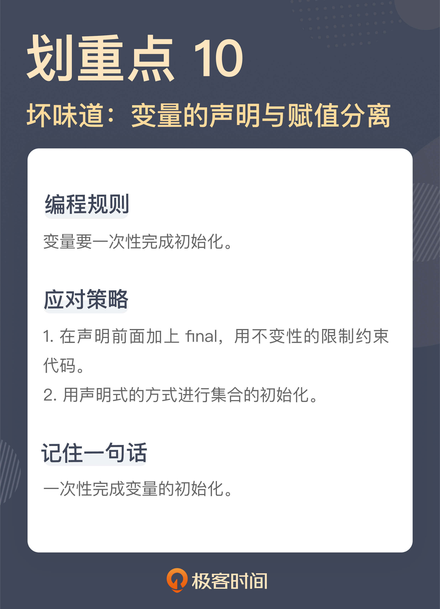

# 10 | 变量声明与赋值分离：普通的变量声明，怎么也有坏味道？
你好，我是郑晔。

我们已经用连续几讲的篇幅在挑战很多人固有的编程习惯了，从各种控制语句，到 getter 和 setter，甚至连直接使用基本类型都已经成了坏味道，这一讲，我们再来挑战一个很多人习以为常的编程习惯：变量的声明与赋值。

我估计有人已经露出了惊讶的表情。你可能会想：要说前面几种坏味道可能确实是编码没有做好，该封装没封装，该返回没返回，一个变量声明怎么还会有坏味道啊？难道是变量声明都不让用了吗？

诚然，变量声明是写程序不可或缺的一部分，我并不打算让你戒掉变量声明，严格地说，我们是要把变量初始化这件事做好。

## 变量的初始化

我们先来看一段代码：

```
EpubStatus status = null;
CreateEpubResponse response = createEpub(request);
if (response.getCode() == 201) {
  status = EpubStatus.CREATED;
} else {
  status = EpubStatus.TO_CREATE;
}

```

这段代码在做的事情是向另外一个服务发请求创建 EPUB（一种电子书格式），如果创建成功，返回值是 HTTP 的 201，也就表示创建成功，然后就把状态置为 CREATED；而如果没有成功，则把状态置为 TO\_CREATE。后面对于 TO\_CREATE 状态的作品，还需要再次尝试创建。

这里，我们暂且把是否要写 else 放下，这是我们在前面已经讨论过的一个坏味道。

我们这次的重点在 status 这个变量上，虽然 status 这个变量在声明的时候，就赋上了一个null 值，但实际上，这个值并没有起到任何作用，因为status 的变量值，其实是在经过后续处理之后，才有了真正的值。换言之，从语义上说，第一行的变量初始化其实是没有用的，这是一次假的初始化。

按照我们通常的理解，一个变量的初始化是分成了声明和赋值两个部分，而我这里要说的就是， **变量初始化最好一次性完成**。这段代码里的变量赋值是在声明很久之后才完成的，也就是说，变量初始化没有一次性完成。

**这种代码真正的问题就是不清晰，变量初始化与业务处理混在在一起**。通常来说，这种代码后面紧接着就是一大堆更复杂的业务处理。当代码混在一起的时候，我们必须小心翼翼地从一堆业务逻辑里抽丝剥茧，才能把逻辑理清，知道变量到底是怎么初始化的。很多代码难读，一个重要的原因就是把不同层面的代码混在了一起。

这种代码在实际的代码库中出现的频率非常高，只不过，它会以各种变形的方式呈现出来。有的变量甚至是在相隔很远的地方才做了真正的赋值，完成了初始化，这中间已经夹杂了很多的业务代码在其中，进一步增加了理解的复杂度。

所以，我们编程时要有一个基本原则： **变量一次性完成初始化**。

有了这个理解，我们可以这样来修改上面这段代码：

```
final CreateEpubResponse response = createEpub(request);
final EpubStatus status = toEpubStatus(response);

private EpubStatus toEpubStatus(final CreateEpubResponse response) {
  if (response.getCode() == 201) {
    return EpubStatus.CREATED;
  }

  return EpubStatus.TO_CREATE;
}

```

在这段改进的代码中，我们提取出了一个函数，将 response 转成对应的内部的 EPUB状态。

其实，很多人之所以这样写代码，一个重要的原因是很多人的编程习惯是从 C 语言来的。C 语言在早期的版本中，一个函数用到的变量必须在整个函数的一开始就声明出来。

在 C 语言诞生的年代，当时计算机能力有限内存小，编译器技术也处于刚刚起步的阶段，把变量放在前面声明出来，有助于减小编译器编写的难度。到了 C++产生的年代，这个限制就逐步放开了，所以，C++程序是支持变量随用随声明的。对于今天的大多数程序设计语言来说，这个限制早就不存在了，但 **很多人的编程习惯却留在了那个古老的年代**。

还有一点不知道你注意到了没有，在新的变量声明中，我加上了 final，在 Java 的语义中，一个变量加上了 final，也就意味着这个变量不能再次赋值。对，我们需要的正是这样的限制。

上一讲，我们讲了可变的数据会带来怎样的影响，其中的一个结论是，尽可能编写不变的代码。这里其实是这个话题的延伸， **尽可能使用不变的量**。

如果我们能够按照使用场景做一个区分，把变量初始化与业务处理分开，你会发现，在很多情况下，变量只在初始化完成之后赋值，就足以满足我们的需求了，在一段代码中，需要使用可变量的场景并不多。

这个原则其实可以推广一下， **在能够使用 final 的地方尽量使用 final**，限制变量的赋值。

这里说的“能够使用”，不仅包括普通的变量声明，还包含参数声明，还有类字段的声明，甚至还可以包括类和方法的声明。当然，我们这里改进的考量主要还是在变量上。你可以尝试着调整自己现有的代码，给变量声明都加上 final，你就会发现许多值得改进的代码。

对于 Java 程序员来说，还有一个特殊的场景，就是异常处理的场景，强迫你把变量的声明与初始化分开，就像下面这段代码：

```
InputStream is = null;

try {
  is = new FileInputStream(...);
  ...
} catch (IOException e) {
  ...
} finally {
  if (is != null) {
    is.close();
  }
}

```

之所以要把 InputStream 变量 is 单独声明，是为了能够在 finanlly 块里面访问到。其实，这段代码写成这样，一个重要的原因是 Java 早期的版本只能写成这样，而如果采用 Java 7 之后的版本，采用 try-with-resource 的写法，代码就可以更简洁了：

```
try (InputStream is = new FileInputStream(...)) {
  ...
}

```

这样一来，InputStream 变量的初始化就一次性完成了，我们的原则就统一了，不需要在这种特殊的场景下纠结了。

## 集合初始化

接下来，我们在来看一段代码：

```
List<Permission> permissions = new ArrayList<>();
permissions.add(Permission.BOOK_READ);
permissions.add(Permission.BOOK_WRITE);
check.grantTo(Role.AUTHOR, permissions);

```

这是一段给作者赋予作品读写权限的代码，逻辑比较简单，但这段代码中也存在一些坏味道。我们把注意力放在 permissions 这个集合上。之所以要声明这样一个 List，是因为 grantTo 方法要用到一个 List 作为参数。

我们来看这个 List 是怎样生成的。这里先给 permission 初始化成了一个 ArrayList，这个时候，permissions 虽然存在了，但我们并不会把它传给 grantTo 方法，它还不能直接使用，因为它还缺少必要的信息。然后，我们将 BOOK\_READ 和 BOOK\_WRITE 两个枚举对象添加了进去，这样，这个 permissions 对象才是我们真正需要的那个对象。

这种代码是非常常见的，声明一个集合，然后，调用一堆添加的方法，将所需的对象添加进去。

我们不难发现，其实 permissions 对象一开始的变量声明，并没有完成这个集合真正的初始化，只有当集合所需的对象添加完毕之后，这个集合才是它应有的样子。换言之，只有添加了元素的集合才是我们需要的。

这样解释这段代码，你是不是就发现了，这和我们前面所说的变量先声明后赋值，本质上是一回事，都是从一个变量的声明到初始化成一个可用的状态，中间隔了太远的距离。

之所以很多人习惯这么写，一个原因就是在早期的 Java 版本中，没有提供很好的集合初始化的方法。像这种代码，也是很多动态语言的支持者调侃 Java 啰嗦的一个靶子。

现如今，Java在这方面早已经改进了许多，各种程序库已经提供了一步到位的写法，我们先来看看 Java 9 之后的写法：

```
List<Permission> permissions = List.of(
  Permission.BOOK_READ,
  Permission.BOOK_WRITE
);
check.grantTo(Role.AUTHOR, permissions);

```

如果你的项目还没有升级 Java 9 之后的版本，使用 Guava（Google 提供的一个 Java 库）也是可以做成类似的效果：

```
List<Permission> permissions = ImmutableList.of(
  Permission.BOOK_READ,
  Permission.BOOK_WRITE
);
check.grantTo(Role.AUTHOR, permissions);

```

经过改进，这段代码是不是看上去就清爽多了！

不知道你注意到没有，第二段代码里的 List 用的是一个 ImmutableList，也就是一个不可变的 List，实际上，你查看第一段代码的实现就会发现，它也是一个不变的 List。这是什么意思呢？也就是说，这个 List 一旦创建好了，就是不能修改了，对应的实现就是各种添加、删除之类的方法全部都禁用了。

初看起来，这是限制了我们的能力，但我们对比一下代码就不难发现，很多时候，我们对于一个集合的使用，除了声明时添加元素之外，后续就只是把它当作一个只读的集合。所以，在很多情况下，一个不变集合对我们来说就够用了。

其实，这段代码，相对来说还是比较清晰的，稍微再复杂一些的，集合的声明和添加元素之间隔了很远，不注意的话，甚至不觉得它们是在完成一次初始化。

```
private static Map<Locale, String> CODE_MAPPING = new HashMap<>();
...

static {
  CODE_MAPPING.put(LOCALE.ENGLISH, "EN");
  CODE_MAPPING.put(LOCALE.CHINESE, "CH");
}

```

这是一个传输时的映射方案，将不同的语言版本映射为不同的代码。这里 CODE\_MAPPING 是一个类的 static 变量，而这个类的声明里还有其它一些变量。所以，隔了很远之后，才有一个 static 块向这个集合添加元素。

如果我们能够用一次性声明的方式，这个单独的 static 块就是不需要的：

```
private static Map<Locale, String> CODE_MAPPING = ImmutableMap.of(
  LOCALE.ENGLISH, "EN",
  LOCALE.CHINESE, "CH"
);

```

对比我们改造前后的代码，二者之间还有一个更关键的区别：前面的代码是命令式的代码，而后面的代码是声明式的代码。

命令式的代码，就是告诉你“怎么做”的代码，就像改造前的代码，声明一个集合，然后添加一个元素，再添加一个元素。而声明式的代码，是告诉你“做什么”的代码，改造后就是，我要一个包含了这两个元素的集合。

我在《软件设计之美》专栏中讲 [DSL](https://time.geekbang.org/column/article/248638) 时，曾经讲过二者的区别，声明式的代码体现的意图，是更高层面的抽象，把意图和实现分开，从某种意义上来说，也是一种分离关注点。

所以， **用声明式的标准来看代码，是一个发现代码坏味道的重要参考**。

回想一下今天讲的坏味道，无论是变量的声明与赋值分离，还是初始化一个集合的分步骤，其实反映的都是不同时代编程风格的烙印。变量的声明是 C 早期的编程风格，异常处理是 Java 早期的风格，而集合声明也体现出不同版本 Java 的影子。

**我们学习编程不仅仅是要学习实现功能，编程的风格也要与时俱进。**

## 总结时刻

今天我们继续挑战着很多人习惯的编程方式，讲了变量初始化带来的问题。变量的初始化包含变量的声明和赋值两个部分，一个编程的原则是“变量要一次性完成初始化”。

这就衍生出一个坏味道：变量的声明和赋值是分离的。二者分离带来的问题就是，把赋值的过程与业务处理混杂在一起。发现变量声明与赋值分离一个做法就是在声明前面加上 final，用“不变性”约束代码。

我们还谈到了集合的初始化，传统的集合初始化方式是命令式的，而今天我们完全可以用声明式的方式进行集合的初始化，让初始化的过程一次性完成。再进一步，以声明式的标准来看代码，会帮助我们发现许多的坏味道。

如果今天的内容你只能记住一件事，那请记住： **一次性完成变量的初始化**。



## 思考题

变量初始化可能是一个很多人都没有注意过的坏味道，你可以回去翻翻自己的代码，用这个标准衡量一下，你能发现什么问题吗？欢迎在留言区分享你的发现。

参考资料：

[DSL：你也可以设计一门自己的语言](https://time.geekbang.org/column/article/248638)

[](https://time.geekbang.org/column/article/325594)