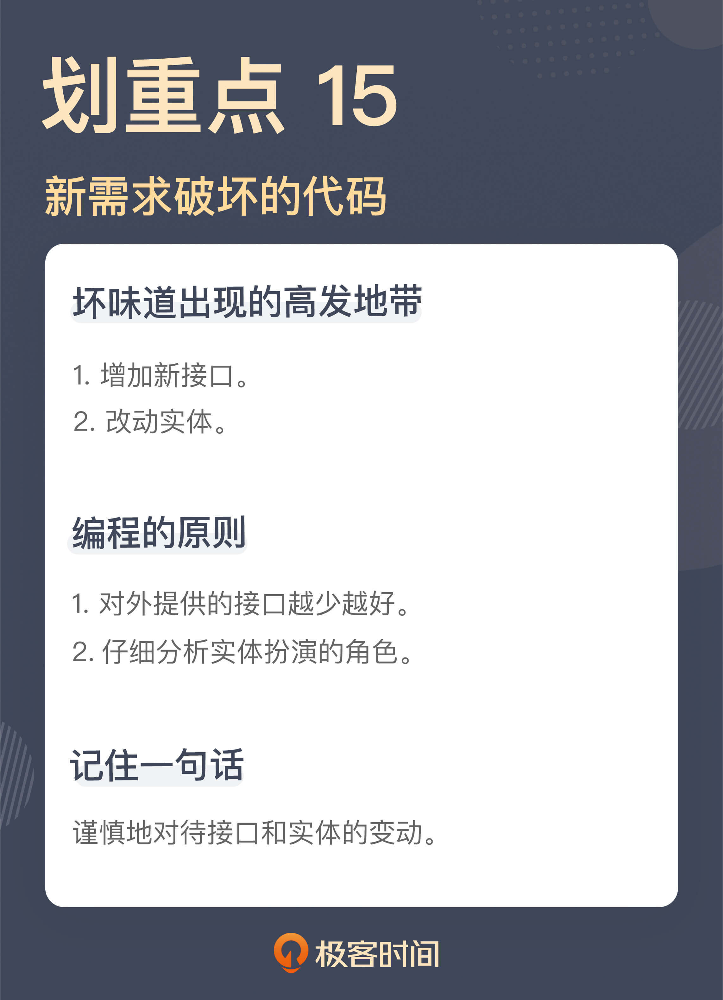

# 15 | 新需求破坏了代码，怎么办？
你好，我是郑晔。

我前面课程讲的所有坏味道都是告诉你如何在已有的代码中发现问题。不过你要明白，即便我们能够极尽所能把代码写整洁，规避各种坏味道，但我们小心翼翼维护的代码，还是可能因为新的需求到来，不经意间就会破坏。

一个有生命力的代码不会保持静止，新的需求总会到来，所以， **写代码时需要时时刻刻保持嗅觉。**

这一讲加餐，我来给你讲讲两个发生在真实项目中的故事。

## 一次驳回的实现

我们的系统里有这样一个功能，内容作品提交之后要由相应的编辑进行审核。既然有审核，自然就有审核通过和不通过的情况，这是系统中早早开发完成的功能。

有一天，新的需求来了：驳回审核通过的章节，让作品的作者重新修改。造成作品需要驳回的原因有很多，比如，审核标准的调整，这就会导致原先通过审核的作品又变得不合格了。

在实现这个需求之前，我们先来看看代码库里已经有怎样的基础。

首先，系统里已经有了审核通过和审核不通过的接口。

```
PUT /chapter/{chapterId}/review
DELETE /chapter/{chapterId}/review

```

在这个设计里，将章节（chapter）的审核（review）当作了一个资源。在创建章节的时候，章节的审核状态就创建好了。审核通过，就相当于对这次审核进行了修改，而审核不通过，就相当于删除了这个资源。

对应着这两个接口，就有两个对应的服务接口：

```
class ChapterService {
  public void approve(final ChapterId chapterId) {
    ...
  }

  public void reject(final ChapterId chapterId) {
    ...
  }
}

```

顾名思义，approve 函数对应着审核通过，而 reject 对应着审核不通过。相应地，章节上有一个状态字段，标识现在章节处于什么样的状态。章节是待审核、审核通过，还是审核不通过，就是通过这个字段标记出来的。

```
class Chapter {
  private Status status = Status.PENDING;

  public void approve() {
    this.status = Status.APPROVED;
  }

  public void reject() {
    this.status = Status.REJECTED;
  }
}

```

好，我们已经知道了这些基础了，那驳回的需求该怎么设计呢？

既然增加了一个驳回的功能，那就增加一个驳回的接口，然后，在服务中增加一个驳回的服务，最后，再在状态中增加一个驳回的状态。这么做，听上去非常合理，你是不是已经按捺不住自己蠢蠢欲动的双手，准备写代码了呢？

且慢！我嗅到了一丝坏味道，这个坏味道来自于我们要增加一个接口。

来一个新需求，增加一个新接口，对于很多人来说，这是一种常规操作。但 **我们必须对新增接口保持谨慎**。

接口，是系统暴露出的能力，一旦一个接口提供出去，你就不知道什么人会以什么样的方式使用这个接口。

我们常常看到很多系统有很多接口，如果你仔细梳理一番，就会发现，有很多接口提供类似的功能，这会让初次接触到系统的新人一脸茫然。即便你打算对系统进行清理，当清理掉一个你以为根本没有人用的接口时，就会有人跑出来告诉你，这个接口调整影响了他们的业务。

所以，我们必须对接口的调整慎之又慎。最好的办法就是从源头进行限制，也就是说， **当我们想对外提供一个接口时，我们必须问一下，真的要提供一个新接口吗？**

回到这个案例上，我们面对这个需求的第一反应和大多数人一样，也是增加一个新的接口。但是，是否真的要增加一个新的接口呢？如果不增加新接口，这就意味着要复用已有的接口。但复用的前提是：新增的业务动作是可以通过已有的业务来完成的，或是对已有业务进行微调就可以。

那么，到底是需要新增，还是复用，真正要回答这个问题，还是要回到业务上。

在原有的业务中，审核通过会进入到下一个阶段，而审核不通过，就会退回到作者那里进行修改。那驳回之后呢？它也会要求作者去修改。

说到这里，你就不难发现了，驳回的动作和审核不通过，二者的后续动作是一样的。它们的差别只是起始的状态，如果原来的状态是待审核，经过一个审核不通过的动作，状态就变成了审核不通过；而如果原来的状态是审核通过，经过一个驳回的动作，状态就变成了驳回。所以，我们完全可以复用原来的审核不通过接口。

既然是复用接口，所有的变化就全部都是内部变化了，我们可以根据章节当前的状态进行判断，设置相应的状态。具体到代码上，我们既不需要增加驳回的接口，也不需要增加驳回的服务，只需要在 Chapter 类内部进行修改，代码改动量比原先预期的就小了很多。其代码结构大体如下所示：

```
class Chapter {
  private Status status = Status.PENDING;
  ...

  public void reject() {
    if (status == Status.PENDING) {
      this.status = Status.REJECTED;
      return;
    }

    if (status == Status.APPROVED) {
      ...
.
    }
  }
}

```

按照这个理解，我们只要增加一个驳回的状态，在当前状态是审核通过时，将这个新状态赋值上去就可以了。

看上去，我们已经把这次要改动的代码限制在一个最小的范围。但其实，我还想再问一个问题，我们真的需要这么一个状态吗？

是否增加一个驳回的状态，回答这个问题还是要回到业务上，驳回后续的处理与审核不通过的状态有什么不同。

按照产品经理本来的需求，他是希望做出一些不同来，比如，处于审核不通过的状态，编辑端是无法查看的，而处于驳回状态的，编辑是可以查看的。但在当前的产品状态下，我们是否可以将二者统一起来呢？也就是说，都按照审核不通过来处理呢？

产品经理仔细想了想，觉得其实也可以，于是，两种不同的状态在这里得到了统一，也就是说，我们根本没有增加这个驳回的新状态。

事情说到这里，你就会发现，在这次的业务调整中，后端服务的代码其实没有做任何修改，只是前端的代码在需要驳回时增加了一个对审核不通过的调用，而所有这一切的起点，只是我们对于增加一个新接口的嗅觉。

## 一次定时提交的实现

我再来给你讲另外的一个与“实现”有关的故事。

在我们的系统中，一般情况下，作者写完一章之后就直接提交了，这是系统中已经实现好的一个功能。现在来了新的需求，有时候，作者会囤一些稿子，为了保证自己每天都有作品提交，作者希望作品能够按自己设定的时间去提交，也就是说，一个章节在它创建的时候，并不会直接提交到编辑那里去审核，而是要到特定的时间之后，再来完成作品的提交。

实际上，“每天都有作品提交”就是一种连续的签到，通常来说，系统都会给连续签到以奖励，这也是对于作者的一种激励手段。

如果你面对这样一个需求，你会怎么实现呢？

与这个需求最直接相关的代码就是章节信息了：

```
class Chapter {
  // 章节 ID
  private ChapterId chapterId;
  // 章节标题
  private String title;
  // 章节内容
  private String content;
  // 章节状态
  private Status status;
  // 章节创建时间
  private ZonedDateTime createdAt;
  // 章节创建者
  private String createdBy;
  // 章节修改者
  private String modifiedBy;
  // 章节修改时间
  private ZonedDateTime modifiedAt;
  ...
}

```

显然，要实现这个需求，需要有一个定时任务，定期去扫描那些需要提交的作品。这个是没有问题的，但是，这些定时的信息要放在哪里呢？

我似乎已经看到你跃跃欲试的样子了。你可能会想：这个实现还不简单，在章节上加上一个调度时间就行了：

```
class Chapter {
  ...
  private ZonedDateTime scheduleTime;
}

```

确实，这么实现并不复杂。但我想请你稍微停顿一下，别急着写这段代码。这种做法我又嗅到了一丝坏味道，因为我们要改动实体了。

有需求就改动实体，这几乎是很多人不假思索的编码习惯，然而， **对于一个业务系统而言，实体是其中最核心的部分，对它的改动必须有谨慎的思考**。

随意修改实体，必然伴随着其它部分的调整，而经常变动的实体，就会让整个系统难以稳定下来。一般来说，一个系统的业务并不会经常改变，所以，核心的业务实体应该是一个系统中最稳定的部分。

不过，你可能会说：“我有什么办法，需求总在变，就总会改动到这个实体。”

需求总在变，这是没有错的，但它是否真的要改动到业务实体呢？很多时候，这只是应有的职责没有分析清楚而已。

具体到我们这个例子里面，我们需要的是定时提交一个章节，而这个定时信息并不是核心业务实体的一部分，只是在一种特定场景下所需要的信息而已。所以，它根本不应该添加到 Chapter 这个类里面。

不放在 Chapter 这个类里面，那要放到哪呢？很显然，这里少了一个模型，一个关于调度的模型。我们只要增加一个新的模型，让它和 Chapter 关联在一起就好了：

```
class ChapterSchedule {
  private ChapterId chapterId;
  private ZonedDateTime scheduleTime;
  ...
}

```

有了这个模型，后续再有关于调度的信息就可以放到这个模型里面了，而更重要的是，我们的核心模型 Chapter 在这个过程中是保持不变的。

我们之所以要把定时提交的信息与章节本身分开，因为这二者改变的原因是不同的。你或许已经发现了，是的，如果将二者混在一起，就是违反了单一职责原则。对于一个程序员来说，深入理解单一职责原则是非常必要的。

到这里，定时提交的问题看上去已经得到了一个很合理的解决，有了基础的数据结构，修改对应的接口和服务，对大多数程序员来说，都是一件驾轻就熟的事情。那么，这个讨论就结束了吗？我们可能暂时还不能停下来。

我们新增的需求是定时发布，之所以要有这么个需求，因为这和作者的激励是相关的。要想确定作者的激励，就要确定章节的提交时间，问题是，我们怎么确定章节的提交时间呢？

在原来实现中，创建时间就是提交时间，因为章节是立即提交的，而现在创建时间和提交时间有可能不同了。

你可能会想到，创建时间不行，那就用修改时间。我告诉你，这也不行，修改时间是章节信息最后一次修改的时间，它有可能因为各种原因变更，最简单的就是编辑审核通过，这个时间就会变。

分析到这里，我们突然发现，模型里居然没有一个地方可以存放提交时间，是的，我们需要修改实体了，我们要给它增加一个提交时间：

```
class Chapter {
  ...
  private ZonedDateTime submittedAt;
}

```

到这里，估计有些人已经懵了。前面我们辛辛苦苦地讨论，为的就是不在 Chapter 里增加信息，而这里，我们竟然就增加了一个字段。

前面我们说了，一个字段该不该加在一个类上，取决于其改变的原因。前面的定时时间确实不该加，而这里的提交时间却是应该加的。提交时间本来就是章节的一个属性，只不过如前面所说，之前，这个信息与创建时间是共用的，而如今，因为定时提交的出现，二者应该分开了。

或许你还有一个疑问，我们难道不能直接用 submittedAt 去存储调度时间吗？严格地说，不行。因为调度时间可能与具体提交的时间有差异。我举个例子，因为某种原因，系统宕机了，启动之后，调度任务执行，这时可能已经过了调度时间很多了，但这个时候提交章节，它的时间就不会是调度时间。

至此，我们完整地分析完了定时提交的实现，你还记得我们为什么要做这个分析吗？没错，因为它要改动核心的实体，而这又是一个坏味道的高发地带。

## 总结时刻

这一讲，我用了两个例子给你讲了新需求到来时需要关注的地方，它们分别是：

- 增加新接口；
- 改动实体。

接口和实体，其实也是一个系统对外界产生影响的重要部分，一个是对客户端提供能力，一个是产生持久化信息。所以，我们必须谨慎地思考它们的变动，它们也是坏味道产生的高发地带。

对于接口，我们对外提供得越少越好，而对于实体，我们必须仔细分析它们扮演的角色。

如果今天的内容你只能记住一件事，那请记住： **谨慎地对待接口和实体的变动**。



## 思考题

你平时是怎么对待接口和实体的变动的呢？欢迎在留言区分享你的经验。

感谢阅读，我们下一讲再见！

参考资料:

[34 \| 你的代码是怎么变混乱的？](https://time.geekbang.org/column/article/87845)

[20 \| 单一职责原则：你的模块到底为谁负责？](https://time.geekbang.org/column/article/258222)