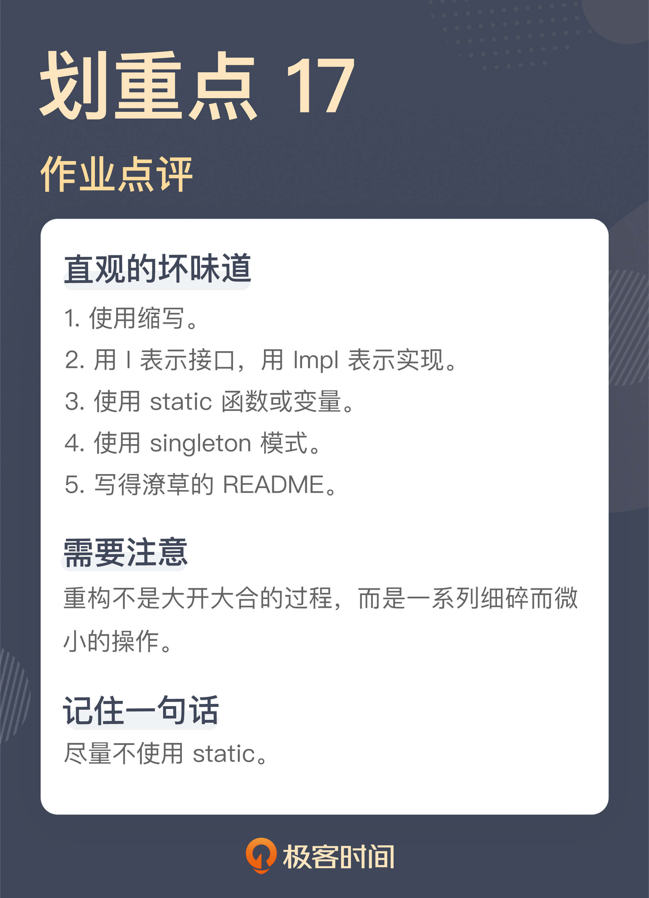

# 17 | 课前作业点评：发现“你”代码里的坏味道
你好，我是郑晔。

在这个专栏刚开始的时候，我给你留了一个课前作业，实现一个待办事项管理的软件。许多同学都利用自己的业余时间完成了这个作业，感谢大家的付出！

学习代码的坏味道，听别人讲是一种方式，但这种方式总会让人有一种隔岸观火的感觉，虽然知道有问题，但感觉并不深刻。最直接受益的方式就是自己写了代码，然后，让别人来点评。其实，这就是某种形式的代码评审。

所以，这一讲，我们就来做一次“代码评审”，直接来看看代码中存在的问题。题目背景我就不再做过多的介绍了，如果没有来得及完成作业的同学，可以先到“ [课前作业区](https://time.geekbang.org/column/article/325594)”回顾一下题目。

既然是指出问题，得罪大家可能就在所难免了，希望你不要介意，毕竟能够发现自己的问题是精进的第一步。好，我们开始！

## 从已知的坏味道出发

在 [极客双同学的代码仓库](https://github.com/benben773/todomaster) 里，我在 [一段代码](https://github.com/benben773/todomaster/blob/main/todomaster/src/main/java/com/test/service/impl/ProcessTxtServiceImpl.java) 中看到了之前我们课程中讲过的坏味道：

```
Item itemNew = new Item(item.getName());
itemNew.setUserIndex(userIndex);
itemNew.setIndex(initUserIndex);

```

我们的业务需求是添加TODO项，这段代码就是在这个过程中创建一个新的TODO项对象。那这段代码有什么问题？一方面，这里有 setter，另一方面，这里的 setter 只在初始化的过程中用到。显然，我们可以用一个更完整的构造函数替换掉它。

其实，从这段代码出发，我们还能看到一些小问题，比如，这里创建 TODO 项设置了两个字段，一个是 userIndex，一个是 index。index 可以理解，表示这个 TODO 项的索引，但 userIndex 是什么呢？你需要仔细阅读代码才能发现，它其实是一个用户的标识，表示这个索引项是由某个用户创建的。既然是用户标识，按照通常的做法它可以叫 userId，这就降低了理解的难度。

这段代码所在类的声明也是一个让人出戏的地方：

```
public class ProcessTxtServiceImpl implements ProcessItemservice

```

这个类实现了一个接口 **ProcessItemservice**，显然，这里的拼写是有问题的，它应该是 ProcessItemService，另外，它的名字叫做“处理（TODO）项的服务”，一方面，在一个服务名字上用了处理这个动词，另一方面，“处理”这个名字也是特别泛化的一个名字。如果是我来声明这个接口，它可能就叫 **ItemService**。

所以，你可以看到，仅仅是一个接口的命名，就有这么多的问题。

我们再来看这个类的命名 **ProcessTxtServiceImpl**，这个名字里有一个 Txt 是容易让人困惑的，一般来说，如果不是特别的原因， **尽量不要用缩写**。

我初看到这个名字时，着实想了半天它表示什么含义，一开始我以为是表示事务（Transaction），常有人把事务缩写成 Tx，如果它的含义是表示事务，那么这里就是一个拼写错误了。后来，我才想明白，这里的 Txt 表示的是文本（Text）， **仅仅省了一个字母，却造成了理解上更大的障碍，实在有些得不偿失。**

如果 Txt 表示的是文本，这里就暴露出另外一个问题。这里为什么要有一个文本呢？其实是对应着另外一个数据库存储的实现，这是第四阶段的要求。

文本和数据库的差别到底是体现在哪里呢？体现在存储上。而在这段代码中，差别从服务层面就开始了，换言之，按照这段代码的逻辑，实现数据库存储，就需要把整个的业务逻辑重新写一遍。显然，这种做法是从结构上来看是有问题的，会造成大量的重复代码。

理解了文本和数据库只差别在存储这件事，我们再回过头来看这个类的声明。

```
public class ProcessTxtServiceImpl implements ProcessItemservice

```

这个为数据库预留的实现根本就是不需要的，只有一个 ItemService 的实现就够了，换言之，也就没有必要声明出一个接口，这里的类层次这么复杂，根本就是没有必要的。

```
public class ItemService

```

这里我再补充一个点，很多 Java 程序员给类命名有个不好的习惯，用“I” 打头给接口命名，用“Impl”给实现类结尾，这其实是早期的一种编程习惯，准确地说，这就是没有想好命名的偷懒方式。其实，它也是我们讲到的“ [用技术术语命名](https://time.geekbang.org/column/article/326166)”的一种具体体现方式。后来的代码基本上就不这么做了，因为我们可以找到更准确的描述。但很多人的编程习惯却留在了早期，所以，这也算是一种遗毒的吧。

## 一个“静态”的问题

接下来，我们再来看一个很多人代码中都存在的问题。

下面是来自 [刘大明](https://github.com/liudaming/todo) 同学的 [一段代码](https://github.com/liudaming/todo/blob/main/src/main/java/com/timegeekbang/todo/user/UserContext.java)，这是一个用以存放用户信息的类。单看这段代码本身，其实写得还是非常不错的，代码本身并不长，而且考虑了很多的细节。我们暂且忽略其它的细节，我注意到这段代码的主要原因是因为它用到了 static：

```
public class UserContext {

  private static ThreadLocal<Integer> USERID = new ThreadLocal();

  private UserContext() {
    throw new UnsupportedOperationException();
  }

  public static String getUserID() {
    return String.valueOf(USERID.get());
  }

  public static void setUserID(Integer userID) {
    USERID.set(userID);
  }
}

```

在《10x 程序员工作法》讲到 [测试驱动开发](https://time.geekbang.org/column/article/78104) 时，我曾经讲了 static 函数的问题，简单总结一下就是：

- 从本质上说，static 函数是一种全局函数，static 变量是一种全局变量，全局的函数和变量是我们尽量规避的；
- 一个函数调用了 static 函数不好测试；
- 除了写程序库，日常开发尽可能不用 static 函数。

那怎么消除 static 函数呢？消除 static 函数，最简单的做法就是用普通的函数调用替换掉 static 函数，也就是把这里的 static 都去掉。涉及到相应的字段，也要去掉 static。这种做法没有问题，但通常这种做法太粗暴了。这里我们尝试着用重构的方式一步一步地把它替换掉。

首先，我要去掉这里的构造函数，因为这里的构造函数是私有的，无法调用，而我们要用普通的函数，自然就需要构造出一个对象来。

```
public class UserContext {

  private static ThreadLocal<Integer> USERID = new ThreadLocal();

  public static String getUserID() {
    return String.valueOf(USERID.get());
  }

  public static void setUserID(Integer userID) {
    USERID.set(userID);
  }
}

```

然后，我们需要找到对应的调用点，这里就以其中的一个为例，下面就是在退出登录的地方调用了这里的 static 函数：

```
public class UserAccounts {
  ...

  public void loginOut() {
    UserContext.setUserID(null);
  }
}

```

我们可以把它改成对象的调用：

```
public class UserAccounts {
  ...

  public void loginOut() {
    new UserContext().setUserID(null);
  }
}

```

这样，我们就有了一个对象，因为原来的函数是 static 函数，所以，这里的调用，本质上还是原来的函数，所以不会有影响。

然后，我们把这个创建出的对象变成这个类的字段，如果你使用的是支持重构功能的 IDE，这就是一个快捷键的操作（引入字段，Introduce Field）：

```
public class UserAccounts {
  ...

  private UserContext context = new UserContext();

  public void loginOut() {
    context.setUserID(null);
  }
}

```

如果在一个类有多个调用点，不妨都改成这个新字段的函数调用，正如我们前面所说，目前还是一个 static 函数，无论从哪个对象调用，调用的都是同一个函数。

通常来说，这个 static 函数应该不只是在一个类中使用，所以，它应该是在多个类中间共享的，为了保证多个类中间使用同一个 UserContext 对象，UserContext 对象的初始化就不能在这个类进行，而要在同一个地方初始化，所以，我们这里可以把 UserContext 对象作为构造函数的参数传进来：

```
public class UserAccounts {
  ...

  private UserContext context;

  public UserAccounts(..., final UserContext context) {
    ...
    this.context = context;
  }

  public void loginOut() {
    context.setUserID(null);
  }
}

```

有了这个基础，我们再在 UserAccounts 这个对象初始化的时候，把这个 UserContext 对象传进来：

```
new UserAccounts(..., new UserContext());

```

如此一来，UserContext 这个对象的初始化就放到对象组装的过程中了，这就可以在多个不同的对象组件中共享这个对象了。如此往复，将所有的调用点都这么修改，我们就消除了对于 static 函数的依赖。现在，我们可以动手消除 static 了：

```
public class UserContext {

  private ThreadLocal<Integer> USERID = new ThreadLocal();

  public String getUserID() {
    return String.valueOf(USERID.get());
  }

  public void setUserID(Integer userID) {
    USERID.set(userID);
  }
}

```

消除 static 函数本身并不难，这里我是借着这个简单的例子，给你演示一下，如何一步一步地进行重构。可能这比很多人以为的大刀阔斧地修改代码来得要琐碎得多， **但只有这样一点一点调整，代码足够安全，每一步都是能够停下来的。**

无论如何，请别忘了，真正能给予我们修改有效性回答的是， **单元测试**。

估计很多人看到这里就会说，如果 static 都成了坏味道，那 Singleton 模式该怎么办呢？答案就是 **尽可能不用 Singleton 模式**。我在《软件设计之美》中讲 [可测试性](https://time.geekbang.org/column/article/241094) 和 [设计模式](https://time.geekbang.org/column/article/265121) 时，都说到过 Singleton 模式，简单地说，系统里只有一个实例和限制系统里只能构建出一个实例，这是两件事，而且，如果一个函数牵扯到 Singleton 类也不好测试。

在一些同学的代码中，我也看到的 Singleton 模式的使用，处理手法其实与这里消除 static 函数是类似的，只不过，Singleton 稍微好一点的是，它的函数和字段本身都已经是普通的类成员了，我们只需要把那个限制实例唯一的 static 函数和字段消除就可以了。

说了半天的代码问题，我还想对很多人普遍忽略的小问题说上几句，这就是文档，对应到各位的代码库中，主要就是 README。

一个开源项目的好坏与否，同它的文档质量是强相关的。我知道，作为程序员，大家的普遍兴趣都是写代码，所以，文档就常常被忽略了。

如果我不了解这个项目的背景，很多人的 README 给我提供的信息量是非常有限的。

大家的 README 普遍存在的问题有两种，一种是信息量太少，比如，只写了如何构建一个项目，另一种是把 README 当成 blog，在里面写了自己的心得体会。无论是哪种，信息的有效性都很差。

README 文件是一个项目的门面，它应该给我们提供关于这个项目的背景信息，比如，这个项目是做什么的、当前的状态、如何入手等等。你可以找一些经典的开源项目，去看看好的README是怎么写的。 **好的程序员要学会表达，不仅仅会用代码表达，也要会用文字表达**。

好，这就是大家作业中的所有问题了吗？当然不是，代码中存在的问题还很多。不过，你不用担心，即便这个专栏的正式更新结束了，我也会考虑以加餐的形式，继续我们这个云端的代码评审环节。所以，之前没来得及写代码的同学依然可以继续写，说不定下次就会谈到你的代码。

## 总结时刻

今天我们点评了大家代码中存在的一些问题，除了之前在专栏中讲到过的坏味道，今天我们还讲到了一些一眼就可以看出问题的坏味道：

- 使用缩写；
- 用 I 表示接口，用 Impl 表示实现；
- 使用 static 函数或变量；
- 使用 singleton 模式；
- 写得潦草的 README。

你在写代码时也要注意这些问题。

我还借着 static 函数的调整过程，给你演示了如何一步一步地重构代码，保证代码的安全。希望你能够理解，重构不是大开大合的过程，而就是这样细小而微的操作。

如果今天的内容你只能记住一件事，那请记住： **尽量不使用 static**。

另外，按照最初的约定，我也选出了3位作业完成比较好的同学，分别是 [邓志国](https://github.com/bobdeng/todolist)、 [LiuTianyou](https://github.com/LiuTianyou/todo)、 [\_CountingStars](https://github.com/mgxian/todolist) ，这几天极客时间的团队会联系你们邮寄奖品。



## 思考题

我们今天谈到了文档，你平时写文档吗？或者，你平时阅读项目文档，发现什么值得改善的地方吗？欢迎在留言区分享你的经验。

参考资料: [加餐 \| 你真的了解重构吗？](https://time.geekbang.org/column/article/85915)