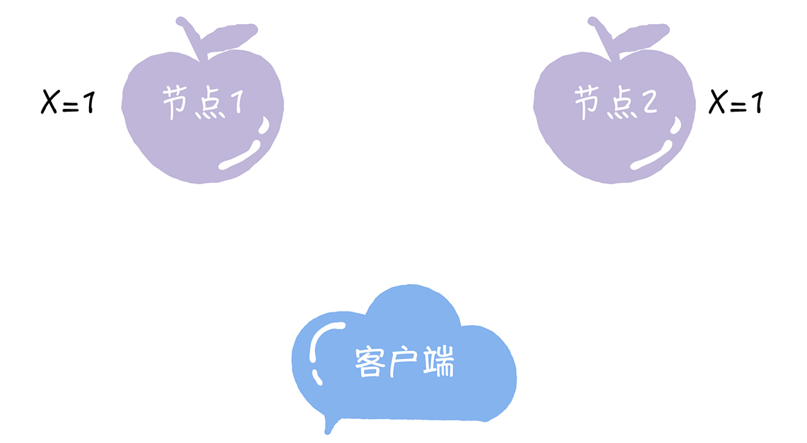
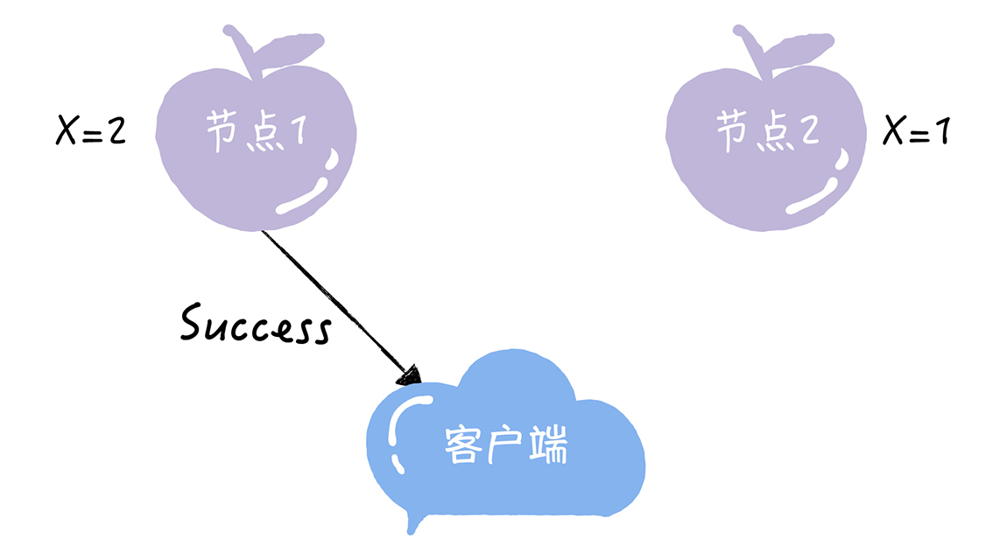
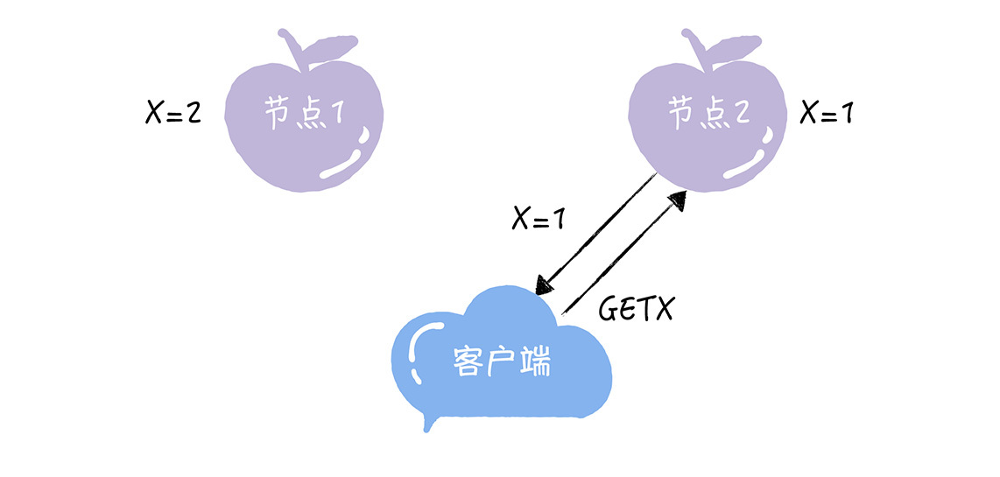
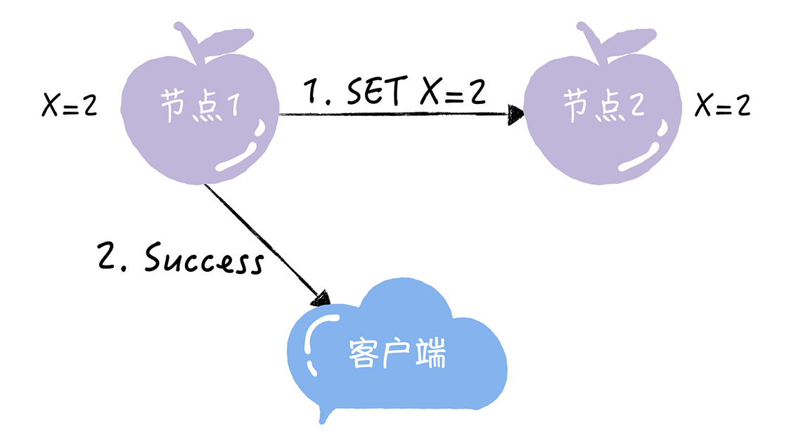
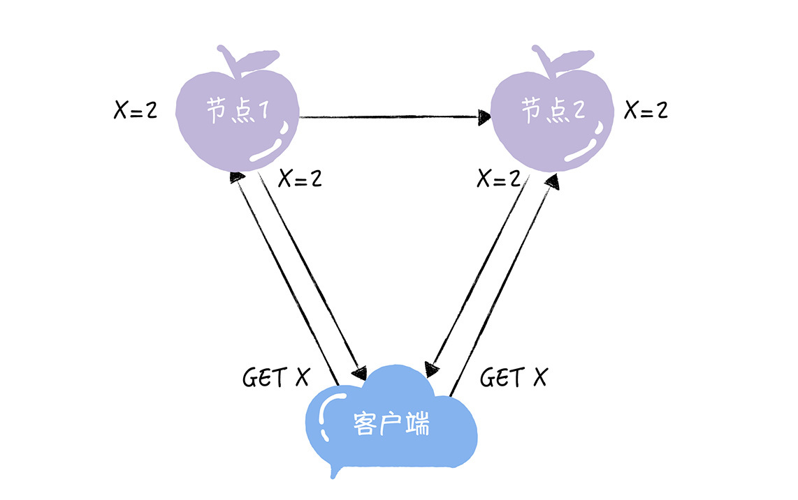
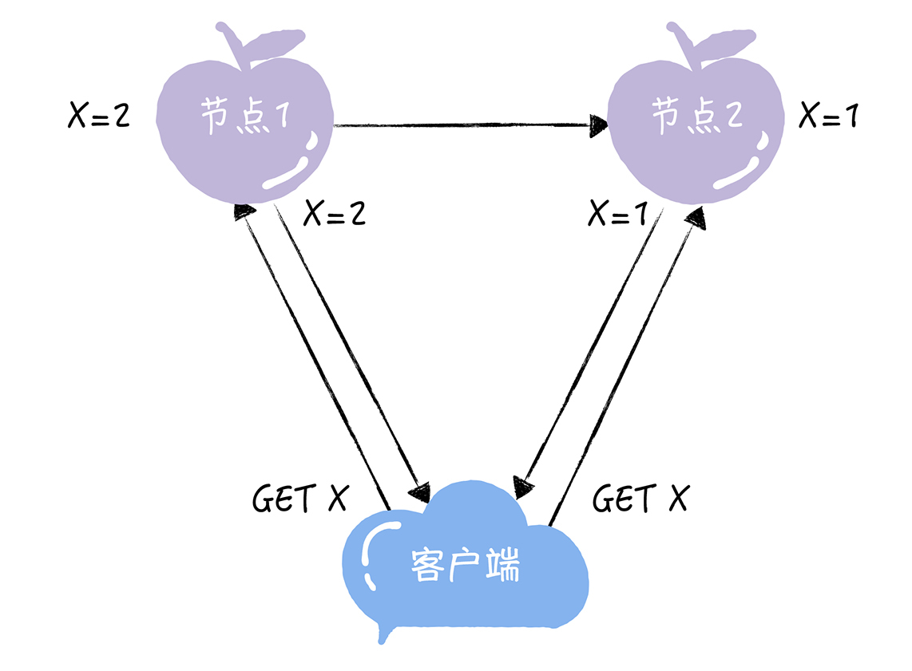
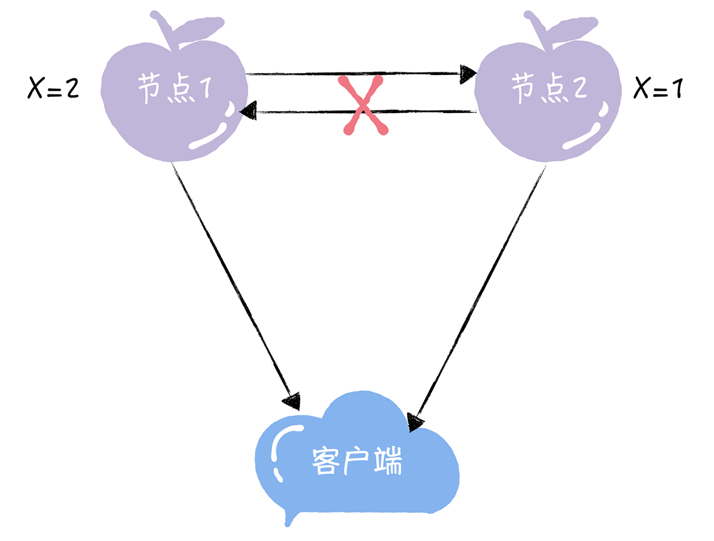
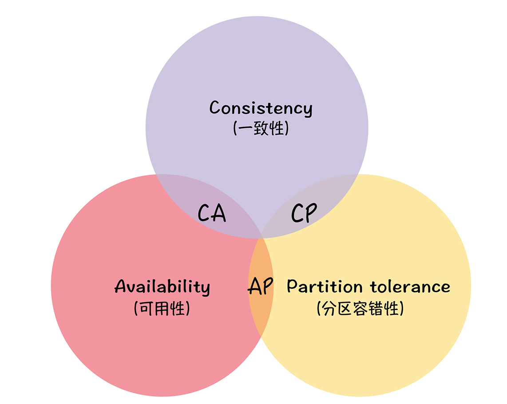
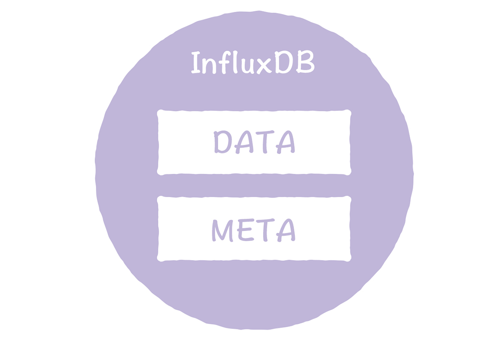

# 02 | CAP理论：分布式系统的PH试纸，用它来测酸碱度
你好，我是韩健。

很多同学可能都有这样的感觉，每次要开发分布式系统的时候，就会遇到一个非常棘手的问题，那就是如何根据业务特点，为系统设计合适的分区容错一致性模型，以实现集群能力。这个问题棘手在当发生分区错误时，应该如何保障系统稳定运行，不影响业务。

这和我之前经历的一件事比较像，当时，我负责自研InfluxDB系统的项目，接手这个项目后， **我遇到的第一个问题就是，如何为单机开源版的InfluxDB设计分区容错一致性模型。** 因为InfluxDB有META和DATA两个节点，它们的功能和数据特点不同，所以我还需要考虑这两个逻辑单元的特点，然后分别设计分区容错一致性模型。

那个时候，我想到了CAP理论，并且在CAP理论的帮助下，成功地解决了问题。讲到这儿，你可能会问了：为什么CAP理论可以解决这个问题呢？

因为在我看来，CAP理论是一个很好的思考框架，它对分布式系统的特性做了高度抽象，比如抽象成了一致性、可用性和分区容错性，并对特性间的冲突（也就是CAP不可能三角）做了总结。一旦掌握它，你就像拥有了引路人，自然而然就能根据业务场景的特点进行权衡，设计出适合的分区容错一致性模型。

那么问题来了：我说的一致性、可用性和分区容错性是什么呢？它们之间有什么关系？你又该如何使用CAP理论来思考和设计分区容错一致性模型呢？这些问题就是我们本节课所要讲的重点了。我建议你集中注意力，认真学习内容，并学以致用，把CAP理论应用到日常工作中。

## CAP三指标

我刚刚提到，CAP理论对分布式系统的特性做了高度抽象，形成了三个指标：

- 一致性（Consistency）
- 可用性（Availability）
- 分区容错性（Partition Tolerance）

一致性说的是客户端的每次读操作，不管访问哪个节点，要么读到的都是同一份最新写入的数据，要么读取失败。

你可以把一致性看作是分布式系统，对访问自己的客户端的一种承诺：不管你访问哪个节点，要么我给你返回的都是绝对一致的最新写入的数据，要么你读取失败。你可以看到，一致性强调的是数据正确。

为了帮你理解一致性这个指标，我给你举一个具体的例子。比如，2个节点的KV存储，原始的KV记录为“X = 1”。

紧接着，客户端向节点1发送写请求“SET X = 2”。

如果节点1收到写请求后，只将节点1的X值更新为2，然后返回成功给客户端。

那么，此时如果客户端访问节点2执行读操作，就无法读到最新写入的X值，这就不满足一致性了。

如果节点1收到写请求后，通过节点间的通讯，同时将节点1和节点2的X值都更新为2，然后返回成功给客户端。

那么在完成写请求后，不管客户端访问哪个节点，读取到的都是同一份最新写入的数据，这就叫一致性。

一致性这个指标，描述的是分布式系统非常重要的一个特性，强调的是数据正确。也就是说，对客户端而言，每次读都能读取到最新写入的数据。

不过集群毕竟不是单机，当发生分区故障的时候，有时不能仅仅因为节点间出现了通讯问题，无法响应最新写入的数据，之后在客户端查询数据时，就一直返回给客户端出错信息。这句话怎么理解呢？我来举个例子。

业务集群中的一些关键系统，比如名字路由系统（基于Raft算法的强一致性系统），如果仅仅因为发生了分区故障，无法响应最新数据（比如不满足“大多数”，没有了领导者），为了不破坏一致性，那么客户端查询相关路由信息时，系统就一直返回给客户端出错信息，此时相关的业务都将因为获取不到指定路由信息而不可用、瘫痪，这可以说是灾难性的故障了。

这个时候，我们就需要牺牲数据正确，每个节点使用本地数据来响应客户端请求，来保证服务可用， **这就是我要说的另外一个指标，可用性。**

可用性说的是任何来自客户端的请求，不管访问哪个非故障节点，都能得到响应数据，但不保证是同一份最新数据。你也可以把可用性看作是分布式系统对访问本系统的客户端的另外一种承诺：我尽力给你返回数据，不会不响应你，但是我不保证每个节点给你的数据都是最新的。 **这个指标强调的是服务可用，但不保证数据正确。**

我还是用一个例子，帮助你理解一下。比如，用户可以选择向节点1或节点2 发起读操作，如果不管节点间的数据是否一致，只要节点服务器收到请求，就响应X的值，那么，2个节点的服务是满足可用性的。

最后的分区容错性说的是，当节点间出现任意数量的消息丢失或高延迟的时候，系统仍然在继续工作。也就是说，分布式系统在告诉访问本系统的客户端：不管我的内部出现什么样的数据同步问题，我会一直运行。 **这个指标，强调的是集群对分区故障的容错能力。**

来看下面的图，当节点1和节点2通信出问题的时候，如果系统仍能继续工作，那么，2个节点是满足分区容错性的。

因为分布式系统与单机系统不同，它涉及到多节点间的通讯和交互，节点间的分区故障是必然发生的， **所以我要提醒你的是，在分布式系统中分区容错性是必须要考虑的。**

现在你了解了一致性、可用性和分区容错性，那么你在设计分布式系统时，是选择一致性？还是可用性？还是分区容错性？还是都可以选择呢？这三个特性有什么冲突么？这些问题就与我接下来要讲的“CAP不可能三角”有关了。

## CAP不可能三角

CAP不可能三角说的是对于一个分布式系统而言，一致性（Consistency）、可用性（Availability）、分区容错性（Partition Tolerance）3个指标不可兼得，只能在3个指标中选择2个。

CAP不能三角最初是埃里克·布鲁尔（Eric Brewer）基于自己的工程实践，提出的一个猜想，后被赛斯·吉尔伯特（Seth Gilbert）和南希·林奇（Nancy Lynch）证明，证明过程可以参考论文 [《Brewer’s conjecture and the feasibility of consistent, available, partition-tolerant web services》](https://dl.acm.org/citation.cfm?id=564601)，你记住结论就好了。不过，为了帮你阅读论文，我补充一点：

**基于证明严谨性的考虑，赛斯·吉尔伯特（Seth Gilbert）和南希·林奇（Nancy Lynch）对指标的含义做了预设和限制，比如，将一致性限制为原子一致性。**

说了这么多，那么CAP理论是怎么解决我在开篇提到的问题呢？或者说，你要如何使用CAP理论来思考和设计分区容错一致性模型呢？

## 如何使用CAP理论

我们都知道，只要有网络交互就一定会有延迟和数据丢失，而这种状况我们必须接受，还必须保证系统不能挂掉。所以就像我上面提到的，节点间的分区故障是必然发生的。也就是说，分区容错性（P）是前提，是必须要保证的。

现在就只剩下一致性（C）和可用性（A）可以选择了：要么选择一致性，保证数据正确；要么选择可用性，保证服务可用。那么CP和AP的含义是什么呢？

- 当选择了一致性（C）的时候，一定会读到最新的数据，不会读到旧数据，但如果因为消息丢失、延迟过高发生了网络分区，那么这个时候，当集群节点接收到来自客户端的读请求时，为了不破坏一致性，可能会因为无法响应最新数据，而返回出错信息。
- 当选择了可用性（A）的时候，系统将始终处理客户端的查询，返回特定信息，如果发生了网络分区，一些节点将无法返回最新的特定信息，它们将返回自己当前的相对新的信息。

**这里我想强调一点，大部分人对CAP理论有个误解，认为无论在什么情况下，分布式系统都只能在C和A中选择1个。** 其实，在不存在网络分区的情况下，也就是分布式系统正常运行时（这也是系统在绝大部分时候所处的状态），就是说在不需要P时，C和A能够同时保证。只有当发生分区故障的时候，也就是说需要P时，才会在C和A之间做出选择。而且如果读操作会读到旧数据，影响到了系统运行或业务运行（也就是说会有负面的影响），推荐选择C，否则选A。

那么我当时是怎么根据场景特点，进行CAP权衡，设计适合的分布式系统呢？为了便于你理解，我先来说说背景。

开源版的InfluxDB，缺乏集群能力和可用性，而且，InfluxDB是由META节点和DATA节点2个逻辑单元组成，这2个节点的功能和数据特点不同，需要我们分别为它们设计分区容错一致性模型。

我具体是这么设计的：

- **作为分布式系统，分区容错性是必须要实现的，** 不能因为节点间出现了分区故障，而出现整个系统不工作的情况。

- 考虑到META节点保存的是系统运行的关键元信息，比如数据库名、表名、保留策略信息等，所以必须实现一致性。也就是说，每次读，都要能读取到最新数据，这样才能避免因为查询不到指定的元信息，时序数据记录写入失败或者系统没办法正常运行。比如，创建了数据库telegraf之后，如果系统不能立刻读取到这条新的元信息，那么相关的时序数据记录，就会因为找不到指定数据库信息而写入失败， **所以，我选择CAP理论中的C和P，采用CP架构。**

- DATA节点保存的是具体的时序数据记录，比如一条记录CPU负载的时序数据，“cpu\_usage,host=server01,location=cn-sz user=23.0,system=57.0”。虽然这些数据不是系统运行相关的元信息，但服务会被访问频繁，水平扩展、性能、可用性等是关键， **所以，我选择了CAP理论中的A和P，采用AP架构。**

你看，我用CAP理论进行思考，并分别设计了InfluxDB的META节点和DATA节点的分区容错一致性模型，而你也可以采用类似的思考方法，设计出符合自己业务场景的分区容错一致性模型。

那么假设我当时没有受到CAP理论的影响，或者对CAP理论理解不深入，DATA节点不采用AP架构，而是直接使用了现在比较流行的共识算法，比如使用Raft算法，会有什么痛点呢？

- 受限于Raft的强领导者模型。所有写请求都在领导者节点上处理，整个集群的写性能等于单机性能。这样会造成集群接入性能低下，无法支撑海量或大数据量的时序数据。
- 受限于强领导者模型，以及Raft的节点和副本一一对应的限制，无法实现水平扩展，分布式集群扩展了读性能，但写性能并没有提升。这样会出现写性能低下，和因为架构上的限制，无法提升写性能的问题。

关于Raft算法的一些细节（比如强领导模型），我会在07讲详细带你了解，这里你知道有这么回事儿就可以了。

那么在这里，我也想考考你：如果META节点采用AP架构，会有什么痛点呢？你可以思考一下。

## 内容小结

本节课我主要带你了解了CAP理论，以及CAP理论的应用，我希望你明确的重点如下：

- CA模型，在分布式系统中不存在。因为舍弃P，意味着舍弃分布式系统，就比如单机版关系型数据库MySQL，如果MySQL要考虑主备或集群部署时，它必须考虑P。

- CP模型，采用CP模型的分布式系统，舍弃了可用性，一定会读到最新数据，不会读到旧数据。一旦因为消息丢失、延迟过高发生了网络分区，就影响用户的体验和业务的可用性（比如基于Raft的强一致性系统，此时可能无法执行读操作和写操作）。典型的应用是Etcd，Consul和Hbase。

- AP模型，采用AP模型的分布式系统，舍弃了一致性，实现了服务的高可用。用户访问系统的时候，都能得到响应数据，不会出现响应错误，但会读到旧数据。典型应用就比如Cassandra和DynamoDB。

在多年的开发实践中，我一直喜欢埃里克·布鲁尔的猜想，不是因为它是CAP理论的本源，意义重大，而是因为它源自高可用、高扩展大型互联网系统的实践，强调在数据一致性（ACID）和服务可用性（BASE）之间权衡妥协。在我看来，CAP理论像PH试纸一样，可以用来度量分布式系统的酸碱值，帮助我们思考如何设计合适的酸碱度，在一致性和可用性之间进行妥协折中，设计出满足场景特点的分布式系统。关于酸（Acid）和碱（Base），我会在03和04讲带你了解。

最后我想说的是，在当前分布式系统开发中，延迟是非常重要的一个指标，比如，在QQ后台的名字路由系统中，我们通过延迟评估服务可用性，进行负载均衡和容灾；再比如，在Hashicorp/Raft实现中，通过延迟评估领导者节点的服务可用性，以及决定是否发起领导者选举。所以，我希望你在分布式系统的开发中，也能意识到延迟的重要性，能通过延迟来衡量服务的可用性。

## 课堂思考

既然我提了CAP理论是一个很好的思考框架，能帮助我们思考，如何进行权衡，设计适合业务场景特性的分布式系统，那么你不妨思考一下，CP模型的KV存储和AP模型的KV存储，分别适合怎样的业务场景呢？欢迎在留言区分享你的看法，与我一同讨论。

最后，感谢你的阅读，如果这节课让你有所收获，也欢迎你将它分享给更多的朋友。