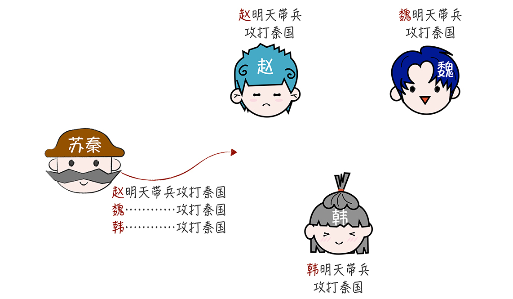
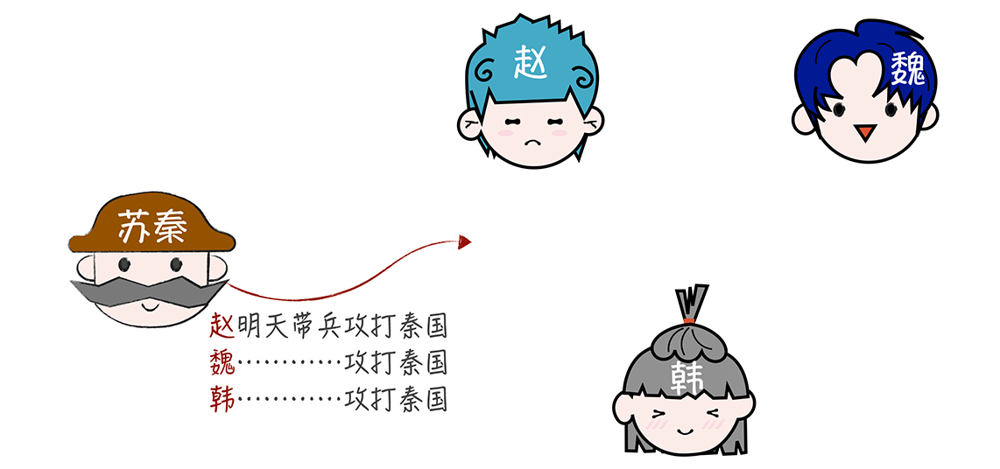
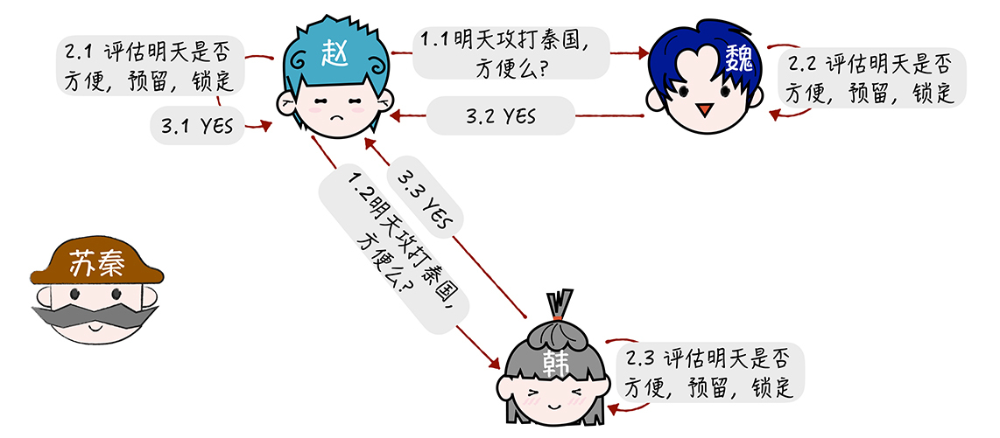
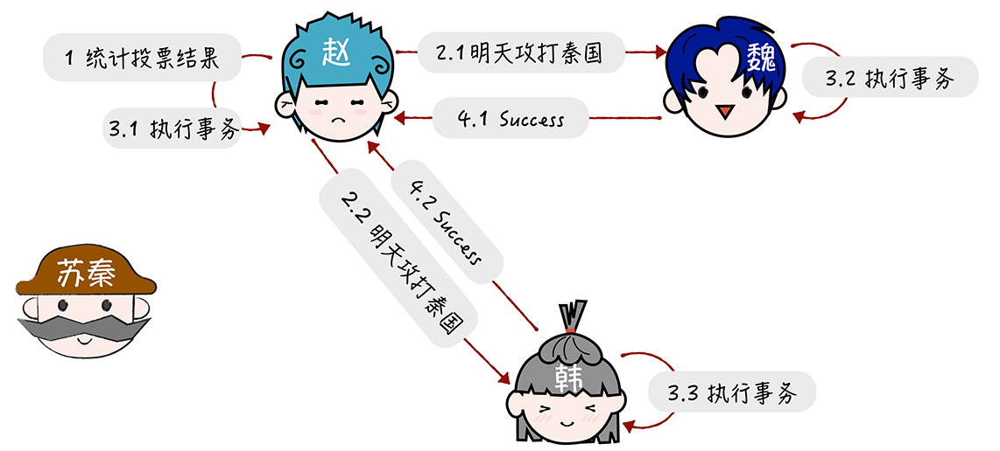
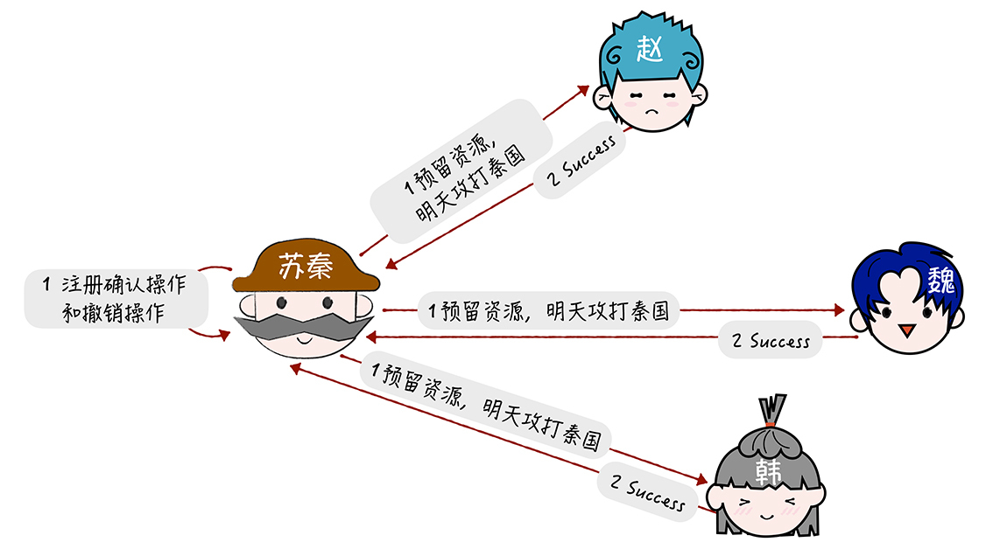
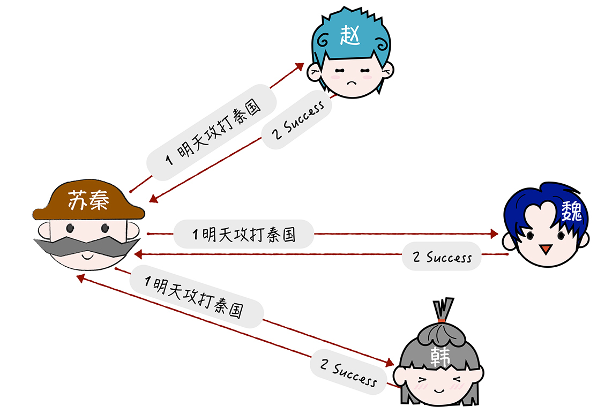
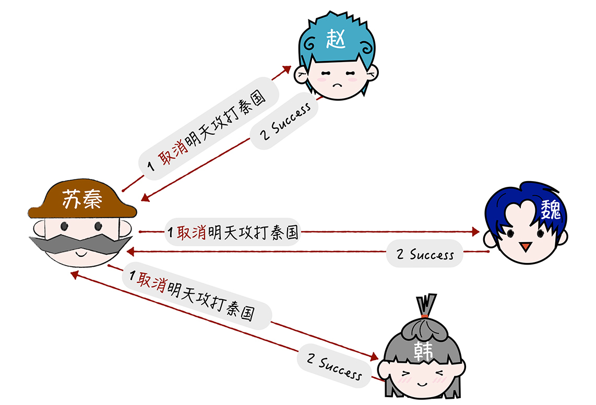

# 03 | ACID理论：CAP的酸，追求一致性
你好，我是韩健。

提到ACID，我想你并不陌生，很多同学也会觉得它容易理解，在单机上实现ACID也不难，比如可以通过锁、时间序列等机制保障操作的顺序执行，让系统实现ACID特性。但是，一说要实现分布式系统的ACID特性，很多同学就犯难了。那么问题来了，为什么分布式系统的ACID特性在实现上，比较难掌握呢？

在我看来，ACID理论是对事务特性的抽象和总结，方便我们实现事务。你可以理解成：如果实现了操作的ACID特性，那么就实现了事务。而大多数人觉得比较难，是因为分布式系统涉及多个节点间的操作。加锁、时间序列等机制，只能保证单个节点上操作的ACID特性，无法保证节点间操作的ACID特性。

那么怎么做才会让实现不那么难呢？答案是你要掌握分布式事务协议，比如二阶段提交协议和TCC（Try-Confirm-Cancel）。这也是我接下来重点和你分享的内容。

不过在带你了解二阶段提交协议和TCC之前，咱们先继续看看苏秦的故事，看这回苏秦又遇到了什么事儿。

最近呢，秦国按捺不住自己躁动的心，开始骚扰魏国边境，魏王头疼，向苏秦求助，苏秦认为“三晋一家亲”，建议魏王联合赵、韩一起对抗秦国。但是这三个国家实力都很弱，需要大家都同意联合，一致行动，如果有任何一方不方便行动，就取消整个计划。

根据侦查情况，明天发动反攻胜算比较大。苏秦想协调赵、魏、韩，明天一起行动。 **那么对苏秦来说，他面临的问题是，如何高效协同赵、魏、韩一起行动，并且保证当有一方不方便行动时，取消整个计划。**

苏秦面对的这个新问题，就是典型的如何实现分布式事务的问题， **赵、魏、韩明天攻打秦国，这三个操作组成一个分布式事务，要么全部执行，要么全部不执行。**

了解了这个问题之后，我们看看如何通过二阶段提交协议和TCC，来帮助苏秦解决这个难题。

## 二阶段提交协议

二阶段提交协议，顾名思义，就是通过二阶段的协商来完成一个提交操作，那么具体是怎么操作的呢？

首先，苏秦发消息给赵，赵接收到消息后就扮演协调者（Coordinator）的身份，由赵联系魏和韩，发起二阶段提交：

赵发起二阶段提交后，先进入 **提交请求阶段（又称投票阶段）。** 为了方便演示，我们先假设赵、魏、韩明天都能去攻打秦国：

也就是说，第一步，赵分别向魏、韩发送消息：“明天攻打秦国，方便吗？”

第二步，赵、魏、韩，分别评估明天能否去攻打秦国，如果能，就预留时间并锁定，不再安排其他军事活动。

第三步，赵得到全部的回复结果（包括他自己的评估结果），都是YES。

赵收到所有回复后，进入 **提交执行阶段（又称完成阶段），** 也就是具体执行操作了，大致步骤如下：

首先，赵按照“要么全部执行，要么放弃”的原则，统计投票结果，因为所有的回复结果都是YES，所以赵决定执行分布式事务，明天攻打秦国。

然后，赵通知魏、韩：“明天攻打秦国。”

接到通知之后，魏、韩执行事务，明天攻打秦国。

最后，魏、韩将执行事务的结果返回给赵。

这样一来，赵就将事务执行的结果（也就是赵、魏、韩明天一起攻打秦国），返回给苏秦，那么，这时苏秦就解决了问题，协调好了明天的作战计划。

在这里，赵采用的方法就是二阶段提交协议。在这个协议中：

- 你可以将“赵明天攻打秦国、魏明天攻打秦国、韩明天攻打秦国”，理解成一个分布式事务操作；
- 将赵、魏、韩理解为分布式系统的三个节点，其中，赵是协调者（Coordinator），将苏秦理解为业务，也就是客户端；
- 将消息理解为网络消息；
- 将“明天能否攻打秦国，预留时间”，理解为评估事务中需要操作的对象和对象状态，是否准备好，能否提交新操作。

需要注意的是，在第一个阶段，每个参与者投票表决事务是放弃还是提交。一旦参与者投票要求提交事务，那么就不允许放弃事务。也就是说， **在一个参与者投票要求提交事务之前，它必须保证能够执行提交协议中它自己那一部分，即使参与者出现故障或者中途被替换掉。** 这个特性，是我们需要在代码实现时保障的。

还需要你注意的是，在第二个阶段，事务的每个参与者执行最终统一的决定，提交事务或者放弃事务。这个约定，是为了实现ACID中的原子性。

[二阶段提交协议](https://courses.cs.washington.edu/courses/cse551/09au/papers/CSE550BHG-Ch7.pdf) 最早是用来实现数据库的分布式事务的，不过现在最常用的协议是XA协议。这个协议是X/Open国际联盟基于二阶段提交协议提出的，也叫作X/Open Distributed Transaction Processing（DTP）模型，比如MySQL就是通过MySQL XA实现了分布式事务。

但是不管是原始的二阶段提交协议，还是XA协议，都存在一些问题：

- 在提交请求阶段，需要预留资源，在资源预留期间，其他人不能操作（比如，XA在第一阶段会将相关资源锁定）；
- 数据库是独立的系统。

因为上面这两点，我们无法根据业务特点弹性地调整锁的粒度，而这些都会影响数据库的并发性能。那用什么办法可以解决这些问题呢？答案就是TCC。

## TCC（Try-Confirm-Cancel）

TCC是Try（预留）、Confirm（确认）、Cancel（撤销） 3个操作的简称，它包含了预留、确认或撤销这2个阶段。那么你如何使用TCC协议，解决苏秦面临的问题呢？

首先，我们先 **进入到预留阶段**，大致的步骤如下：

第一步，苏秦分别发送消息通知赵、魏、韩，让他们预留明天的时间和相关资源。然后苏秦实现确认操作（明天攻打秦国），和撤销操作（取消明天攻打秦国）。

第二步，苏秦收到赵、魏、韩的预留答复，都是OK。

如果预留阶段的执行都没有问题，就进入 **确认阶段**，大致步骤如下：

第一步，苏秦执行确认操作，通知赵、魏、韩明天攻打秦国。

第二步，收到确认操作的响应，完成分布式事务。

如果预留阶段执行出错，比如赵的一部分军队还在赶来的路上，无法出兵，那么就进入撤销 **阶段**，大致步骤如下：

第一步，苏秦执行撤销操作，通知赵、魏、韩取消明天攻打秦国的计划。

第二步，收到撤销操作的响应。

你看，在经过了预留和确认（或撤销）2阶段的协商，苏秦实现这个分布式事务：赵、魏、韩三国，要么明天一起进攻，要么明天都按兵不动。

其实在我看来，TCC本质上是补偿事务， **它的核心思想是针对每个操作都要注册一个与其对应的确认操作和补偿操作（也就是撤销操作）。** 它是一个业务层面的协议，你也可以将TCC理解为编程模型，TCC的3个操作是需要在业务代码中编码实现的，为了实现一致性，确认操作和补偿操作必须是等幂的，因为这2个操作可能会失败重试。

另外，TCC不依赖于数据库的事务，而是在业务中实现了分布式事务，这样能减轻数据库的压力，但对业务代码的入侵性也更强，实现的复杂度也更高。所以，我推荐在需要分布式事务能力时，优先考虑现成的事务型数据库（比如MySQL XA），当现有的事务型数据库不能满足业务的需求时，再考虑基于TCC实现分布式事务。

## 内容小结

本节课我主要带你了解了实现分布式系统ACID特性的方法，二阶段提交协议和TCC，我希望你明确这样几个重点。

1. 二阶段提交协议，不仅仅是协议，也是一种非常经典的思想。二阶段提交在达成提交操作共识的算法中应用广泛，比如XA协议、TCC、Paxos、Raft等。我希望你不仅能理解二阶段提交协议，更能理解协议背后的二阶段提交的思想，当后续需要时，能灵活地根据二阶段提交思想，设计新的事务或一致性协议。

2. 幂等性，是指同一操作对同一系统的任意多次执行，所产生的影响均与一次执行的影响相同，不会因为多次执行而产生副作用。常见的实现方法有Token、索引等。它的本质是通过唯一标识，标记同一操作的方式，来消除多次执行的副作用。

另外，我想补充一下，三阶段提交协议，虽然针对二阶段提交协议的“协调者故障，参与者长期锁定资源”的痛点，通过引入了询问阶段和超时机制，来减少资源被长时间锁定的情况，不过这会导致集群各节点在正常运行的情况下，使用更多的消息进行协商，增加系统负载和响应延迟。也正是因为这些问题，三阶段提交协议很少被使用，所以，你只要知道有这么个协议就可以了，但如果你想继续研究，可以参考《 [Concurrency Control and Recovery in Database Systems](https://courses.cs.washington.edu/courses/cse551/09au/papers/CSE550BHG-Ch7.pdf)》来学习。

最后我想强调的是，你可以将ACID特性理解为CAP中一致性的边界，最强的一致性，也就是CAP的酸（Acid）。根据CAP理论，如果在分布式系统中实现了一致性，可用性必然受到影响。比如，如果出现一个节点故障，则整个分布式事务的执行都是失败的。实际上，绝大部分场景对一致性要求没那么高，短暂的不一致是能接受的，另外，也基于可用性和并发性能的考虑， **建议在开发实现分布式系统，如果不是必须，尽量不要实现事务，可以考虑采用最终一致性**。

## 课堂思考

既然我提了一些实现分布式事务的方法，比如二阶段提交协议、TCC等，那么你不妨思考一下，事务型分布式系统有哪些优点，哪些缺点呢？欢迎在留言区分享你的看法，与我一同讨论。

最后，感谢你的阅读，如果这篇文章让你有所收获，也欢迎你将它分享给更多的朋友。