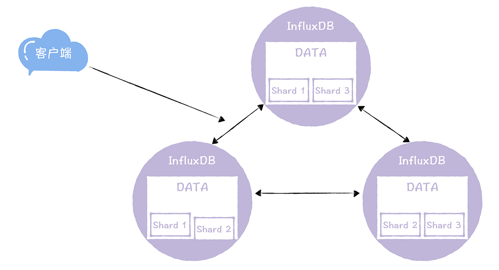

# 04 | BASE理论：CAP的碱，追求可用性
你好，我是韩健。

很多同学可能喜欢使用事务型的分布式系统，或者是强一致性的分布式系统，因为使用起来很方便，不需要考虑太多，就像使用单机系统一样。但是学了CAP理论后，你肯定知道在分布式系统中要实现强一致性必然会影响可用性。比如，在采用两阶段提交协议的集群系统中，因为执行提交操作，需要所有节点确认和投票。

所以，集群的可用性是每个节点可用性的乘积，比如，假设3个节点的集群，每个节点的可用性为99.9％，那么整个集群的可用性为99.7％，也就是说，每个月约宕机129.6分钟， **这是非常严重的问题。** 而解决可用性低的关键在于，根据实际场景，尽量采用可用性优先的AP模型。

讲到这儿，可能会有一些同学“举手提问”：这也太难了，难道没有现成的库或者方案，来实现合适的AP模型？是的，的确没有。因为它是一个动态模型，是基于业务场景特点妥协折中后设计实现的。不过，你可以借助BASE理论帮助你达成目的。

在我看来，BASE理论是CAP理论中的AP的延伸，是对互联网大规模分布式系统的实践总结，强调可用性。几乎所有的互联网后台分布式系统都有BASE的支持，这个理论很重要，地位也很高。一旦掌握它，你就能掌握绝大部分场景的分布式系统的架构技巧，设计出适合业务场景特点的、高可用性的分布式系统。

而它的核心就是基本可用（Basically Available）和最终一致性（Eventually consistent）。也有人会提到软状态（Soft state），在我看来，软状态描述的是实现服务可用性的时候系统数据的一种过渡状态，也就是说不同节点间，数据副本存在短暂的不一致。你只需要知道软状态是一种过渡状态就可以了，我们不多说。

那么基本可用以及最终一致性到底是什么呢？你又如何在实践中使用BASE理论提升系统的可用性呢？这些就是本节课的重点了，而我建议你集中注意力，认真学习本节课的内容，学以致用，将BASE理论应用到日常工作中。

## 实现基本可用的4板斧

在我看来，基本可用是说，当分布式系统在出现不可预知的故障时，允许损失部分功能的可用性，保障核心功能的可用性。就像弹簧一样，遇到外界的压迫，它不是折断，而是变形伸缩，不断适应外力，实现基本的可用。

具体说的话，你可以把基本可用理解成，当系统节点出现大规模故障的时候，比如专线的光纤被挖断、突发流量导致系统过载（出现了突发事件，服务被大量访问），这个时候可以通过服务降级，牺牲部分功能的可用性，保障系统的核心功能可用。

就拿12306订票系统基本可用的设计为例，这个订票系统在春运期间，因为开始售票后先到先得的缘故，会出现极其海量的请求峰值，如何处理这个问题呢？

咱们可以在不同的时间，出售不同区域的票，将访问请求错开，削弱请求峰值。比如，在春运期间，深圳出发的火车票在8点开售，北京出发的火车票在9点开售。 **这就是我们常说的流量削峰。**

另外，你可能已经发现了，在春运期间，自己提交的购票请求，往往会在队列中排队等待处理，可能几分钟或十几分钟后，系统才开始处理，然后响应处理结果， **这就是你熟悉的延迟响应。** 你看，12306订票系统在出现超出系统处理能力的突发流量的情况下，会通过牺牲响应时间的可用性，保障核心功能的运行。

而12306通过流量削峰和延迟响应，是不是就实现了基本的可用呢？现在它不会再像最初的时候那样，常常404了吧？

再比如，你正负责一个互联网系统，突然出现了网络热点事件，好多用户涌进来，产生了海量的突发流量，系统过载了，大量图片因为网络超时无法显示。那么这个时候你可以通过哪些方法，保障系统的基本可用呢？

**相信你马上就能想到体验降级，** 比如用小图片来替代原始图片，通过降低图片的清晰度和大小，提升系统的处理能力。

**然后你还能想到过载保护，** 比如把接收到的请求放在指定的队列中排队处理，如果请求等待时间超时了（假设是100ms），这个时候直接拒绝超时请求；再比如队列满了之后，就清除队列中一定数量的排队请求，保护系统不过载，实现系统的基本可用。

**你看，和12306的设计类似，只不过你负责的互联网系统是通过牺牲部分功能的可用性，保障核心功能的运行。**

我说了这么多，主要是想强调：基本可用在本质上是一种妥协，也就是在出现节点故障或系统过载的时候，通过牺牲非核心功能的可用性，保障核心功能的稳定运行。

我希望你能在后续的分布式系统的开发中， **不仅掌握流量削峰、延迟响应、体验降级、过载保护这4板斧**，更能理解这4板斧背后的妥协折中，从而灵活地处理不可预知的突发问题。

带你了解了基本可用之后，我再来说说BASE理论中，另一个非常核心的内容：最终一致性。

## 最终的一致

在我看来，最终一致性是说，系统中所有的数据副本在经过一段时间的同步后，最终能够达到一个一致的状态。也就是说，在数据一致性上，存在一个短暂的延迟。

几乎所有的互联网系统采用的都是最终一致性，只有在实在无法使用最终一致性，才使用强一致性或事务，比如，对于决定系统运行的敏感元数据，需要考虑采用强一致性，对于与钱有关的支付系统或金融系统的数据，需要考虑采用事务。

你可以将强一致性理解为最终一致性的特例，也就是说，你可以把强一致性看作是不存在延迟的一致性。 **在实践中，你也可以这样思考：** 如果业务的某功能无法容忍一致性的延迟（比如分布式锁对应的数据），需要实现的是强一致性；如果能容忍短暂的一致性的延迟（比如QQ状态数据），就可以考虑最终一致性。

那么如何实现最终一致性呢？你首先要知道它以什么为准，因为这是实现最终一致性的关键。一般来说，在实际工程实践中有这样几种方式：

- 以最新写入的数据为准，比如AP模型的KV存储采用的就是这种方式；
- 以第一次写入的数据为准，如果你不希望存储的数据被更改，可以以它为准。

那实现最终一致性的具体方式是什么呢？常用的有这样几种。

- 读时修复：在读取数据时，检测数据的不一致，进行修复。比如Cassandra 的Read Repair实现，具体来说，在向Cassandra系统查询数据的时候，如果检测到不同节点的副本数据不一致，系统就自动修复数据。
- 写时修复：在写入数据，检测数据的不一致时，进行修复。比如Cassandra 的Hinted Handoff实现。具体来说，Cassandra集群的节点之间远程写数据的时候，如果写失败就将数据缓存下来，然后定时重传，修复数据的不一致性。
- 异步修复：这个是最常用的方式，通过定时对账检测副本数据的一致性，并修复（更多信息可以参考 [11讲](https://time.geekbang.org/column/article/208182) 的反熵）。

在这里，我想强调的是因为写时修复不需要做数据一致性对比，性能消耗比较低，对系统运行影响也不大，所以我推荐你在实现最终一致性时优先实现这种方式。而读时修复和异步修复因为需要做数据的一致性对比，性能消耗比较多，在开发实际系统时，你要尽量优化一致性对比的算法，降低性能消耗，避免对系统运行造成影响。

另外，我还想补充一点，在实现最终一致性的时候， **我推荐同时实现自定义写一致性级别（比如All、Quorum、One、Any，更多信息你可以看一下 [12讲](https://time.geekbang.org/column/article/209130)），** 让用户可以自主选择相应的一致性级别，比如可以通过设置一致性级别为All，来实现强一致性。

现在，想必你了解了BASE理论的核心内容了吧？不过这是理论层面上的，那么在实践中，该如何使用BASE理论的呢？

## 如何使用BASE理论

我以自研InfluxDB系统中DATA节点的集群实现为例，带你来使用BASE理论。咱们先来看看如何保障基本可用。

DATA节点的核心功能是读和写，所以基本可用是指读和写的基本可用。那么我们可以通过分片和多副本，实现读和写的基本可用。也就是说，将同一业务的数据先分片，然后再以多份副本的形式分布在不同的节点上。比如下面这张图，这个3节点2副本的集群，除非超过一半的节点都故障了，否则是能保障所有数据的读写的。

那么如果实现最终一致性呢？就像我上文提到的样子，我们可以通过写时修复和异步修复实现最终一致性。另外，还实现自定义写一致性级别，支持All、Quorum、One、Any 4种写一致性级别，用户在写数据的时候，可以根据业务数据的特点，设置不同的写一致性级别。

## 内容小结

本节课我主要带你了解了BASE理论，以及BASE理论的应用，我希望你明确几个重点：

1. BASE理论是对CAP中一致性和可用性权衡的结果，它来源于对大规模互联网分布式系统实践的总结，是基于CAP定理逐步演化而来的。它的核心思想是，如果不是必须的话，不推荐实现事务或强一致性，鼓励可用性和性能优先，根据业务的场景特点，来实现非常弹性的基本可用，以及实现数据的最终一致性。

2. BASE理论主张通过牺牲部分功能的可用性，实现整体的基本可用，也就是说，通过服务降级的方式，努力保障极端情况下的系统可用性。

3. ACID理论是传统数据库常用的设计理念，追求强一致性模型。BASE理论支持的是大型分布式系统，通过牺牲强一致性获得高可用性。BASE理论在很大程度上，解决了事务型系统在性能、容错、可用性等方面痛点。另外我再多说一句，BASE理论在NoSQL中应用广泛，是NoSQL系统设计的事实上的理论支撑。

最后我强调一下，对于任何集群而言，不可预知的故障的最终后果，都是系统过载。如何设计过载保护，实现系统在过载时的基本可用，是开发和运营互联网后台的分布式系统的重中之重。那么我建议你，在开发实现分布式系统，要充分考虑如何实现基本可用。

## 课堂思考

我在文章中提了一些实现基本可用的方法，比如流量削峰、延迟响应、体验降级、过载保护等，那么你不妨思考一下，还有哪些方法可以用来实现基本可用呢？欢迎在留言区分享你的看法，与我一同讨论。

最后，感谢你的阅读，如果这篇文章让你有所收获，也欢迎你将它分享给更多的朋友。