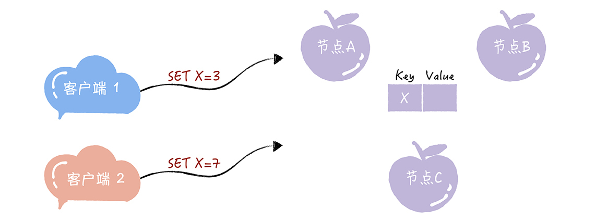
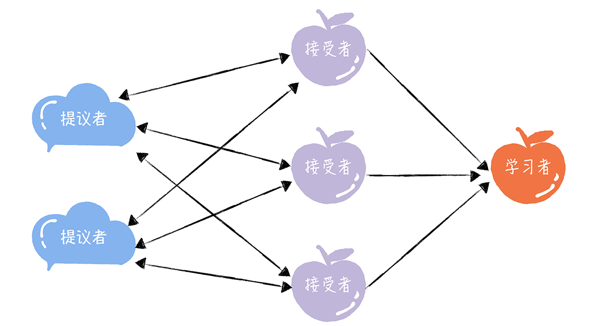
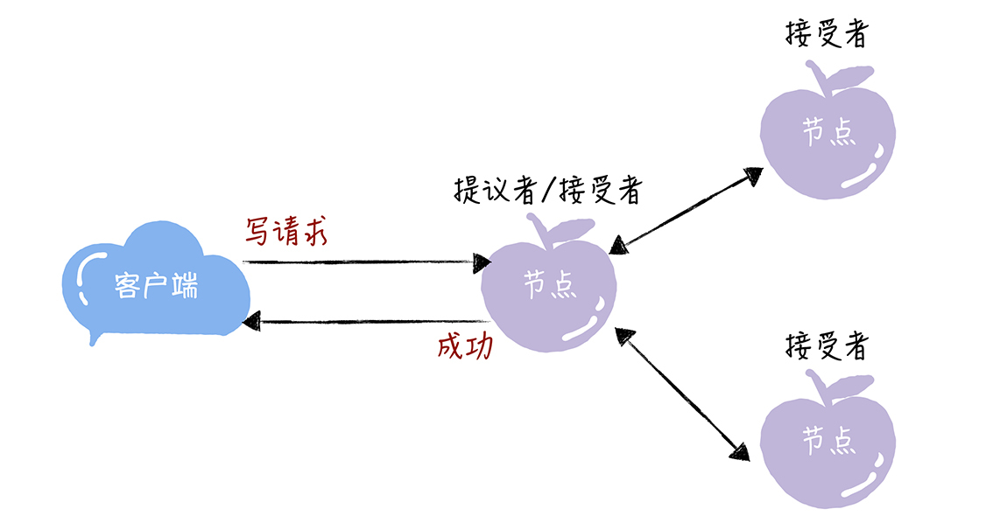
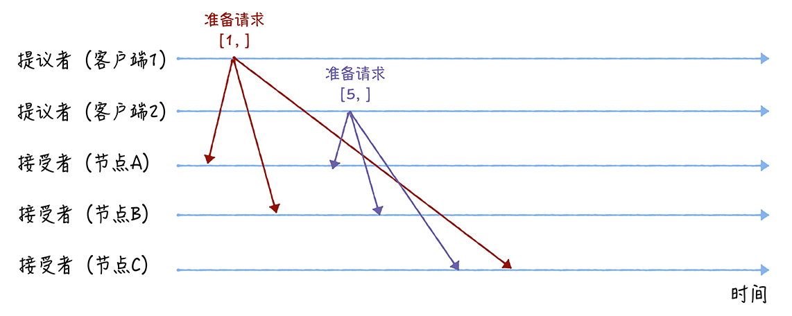
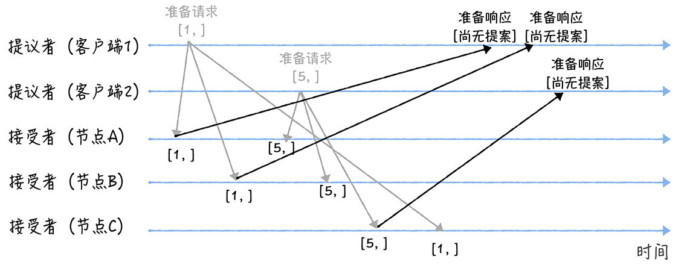
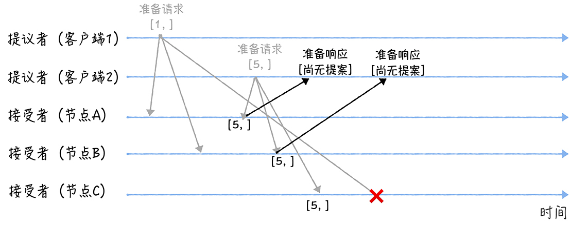
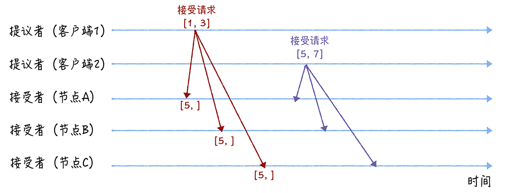
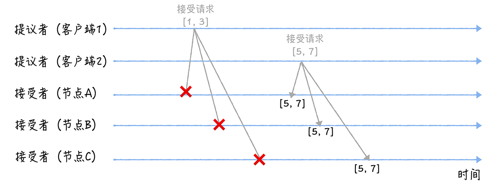

# 05 | Paxos算法（一）：如何在多个节点间确定某变量的值？
你好，我是韩健。

提到分布式算法，就不得不提Paxos算法，在过去几十年里，它基本上是分布式共识的代名词，因为当前最常用的一批共识算法都是基于它改进的。比如，Fast Paxos算法、Cheap Paxos算法、Raft算法等等。而很多同学都会在准确和系统理解Paxos算法上踩坑，比如，只知道它可以用来达成共识，但不知道它是如何达成共识的。

这其实侧面说明了Paxos算法有一定的难度，可分布式算法本身就很复杂，Paxos算法自然也不会例外，当然了，除了这一点，还跟兰伯特有关。

兰伯特提出的Paxos算法包含2个部分：

- 一个是Basic Paxos算法，描述的是多节点之间如何就某个值（提案Value）达成共识；
- 另一个是Multi-Paxos思想，描述的是执行多个Basic Paxos实例，就一系列值达成共识。

可因为兰伯特提到的Multi-Paxos思想，缺少代码实现的必要细节（比如怎么选举领导者），所以在理解上比较难。

为了让你理解Paxos算法，接下来我会用2节课的时间，分别以Basic Paxos和Multi-Paxos为核心，带你了解Basic Paxos如何达成共识，以及针对Basic Paxos的局限性Multi-Paxos又是如何改进的。今天咱们先来聊聊Basic Paxos。

在我看来，Basic Paxos是Multi-Paxos思想的核心，说白了，Multi-Paxos就是多执行几次Basic Paxos。所以掌握它之后，你能更好地理解后几讲基于Multi-Paxos思想的共识算法（比如Raft算法），还能掌握分布式共识算法的最核心内容，当现在的算法不能满足业务需求，进行权衡折中，设计自己的算法。

**来看一道思考题。**

假设我们要实现一个分布式集群，这个集群是由节点A、B、C组成，提供只读KV存储服务。你应该知道，创建只读变量的时候，必须要对它进行赋值，而且这个值后续没办法修改。因此一个节点创建只读变量后就不能再修改它了，所以所有节点必须要先对只读变量的值达成共识，然后所有节点再一起创建这个只读变量。

那么，当有多个客户端（比如客户端1、2）访问这个系统，试图创建同一个只读变量（比如X），客户端1试图创建值为3的X，客户端2试图创建值为7的X，这样要如何达成共识，实现各节点上X值的一致呢？带着这个问题，我们进入今天的学习。

在一些经典的算法中，你会看到一些既形象又独有的概念（比如二阶段提交协议中的协调者），Basic Paxos算法也不例外。为了帮助人们更好地理解Basic Paxos算法，兰伯特在讲解时，也使用了一些独有而且比较重要的概念，提案、准备（Prepare）请求、接受（Accept）请求、角色等等，其中最重要的就是“角色”。因为角色是对Basic Paxos中最核心的三个功能的抽象，比如，由接受者（Acceptor）对提议的值进行投票，并存储接受的值。

## 你需要了解的三种角色

在Basic Paxos中，有提议者（Proposer）、接受者（Acceptor）、学习者（Learner）三种角色，他们之间的关系如下：

看着是不是有些复杂，其实并不难理解：

- **提议者（Proposer）**：提议一个值，用于投票表决。为了方便演示，你可以把图1中的客户端1和2看作是提议者。但在绝大多数场景中，集群中收到客户端请求的节点，才是提议者（图1 这个架构，是为了方便演示算法原理）。这样做的好处是，对业务代码没有入侵性，也就是说，我们不需要在业务代码中实现算法逻辑，就可以像使用数据库一样访问后端的数据。

- **接受者（Acceptor）**：对每个提议的值进行投票，并存储接受的值，比如A、B、C三个节点。 一般来说，集群中的所有节点都在扮演接受者的角色，参与共识协商，并接受和存储数据。

讲到这儿，你可能会有疑惑：前面不是说接收客户端请求的节点是提议者吗？这里怎么又是接受者呢？这是因为一个节点（或进程）可以身兼多个角色。想象一下，一个3节点的集群，1个节点收到了请求，那么该节点将作为提议者发起二阶段提交，然后这个节点和另外2个节点一起作为接受者进行共识协商，就像下图的样子：

- **学习者（Learner）**：被告知投票的结果，接受达成共识的值，存储保存，不参与投票的过程。一般来说，学习者是数据备份节点，比如“Master-Slave”模型中的Slave，被动地接受数据，容灾备份。

其实，这三种角色，在本质上代表的是三种功能：

- 提议者代表的是接入和协调功能，收到客户端请求后，发起二阶段提交，进行共识协商；
- 接受者代表投票协商和存储数据，对提议的值进行投票，并接受达成共识的值，存储保存；
- 学习者代表存储数据，不参与共识协商，只接受达成共识的值，存储保存。

因为一个完整的算法过程是由这三种角色对应的功能组成的，所以理解这三种角色，是你理解Basic Paxos如何就提议的值达成共识的基础。那么接下来，咱们看看如何使用Basic Paxos达成共识，解决开篇提到的那道思考题。

## 如何达成共识？

想象这样一个场景，现在疫情这么严重，每个村的路都封得差不多了，就你的村委会不作为，迟迟没有什么防疫的措施。你决定给村委会提交个提案，提一些防疫的建议，除了建议之外，为了和其他村民的提案做区分，你的提案还得包含一个提案编号，来起到唯一标识的作用。

与你的做法类似，在Basic Paxos中，兰伯特也使用提案代表一个提议。不过在提案中，除了提案编号，还包含了提议值。为了方便演示，我使用\[n, v\]表示一个提案，其中n为提案编号，v 为提议值。

我想强调一下，整个共识协商是分2个阶段进行的（也就是我在03讲提到的二阶段提交）。那么具体要如何协商呢？

我们假设客户端1的提案编号为1，客户端2的提案编号为5，并假设节点A、B先收到来自客户端1的准备请求，节点C先收到来自客户端2的准备请求。

### 准备（Prepare）阶段

先来看第一个阶段，首先客户端1、2作为提议者，分别向所有接受者发送包含提案编号的准备请求：

**你要注意，在准备请求中是不需要指定提议的值的，只需要携带提案编号就可以了，这是很多同学容易产生误解的地方。**

接着，当节点A、B收到提案编号为1的准备请求，节点C收到提案编号为5的准备请求后，将进行这样的处理：

- 由于之前没有通过任何提案，所以节点A、B将返回一个 “尚无提案”的响应。也就是说节点A和B在告诉提议者，我之前没有通过任何提案呢，并承诺以后不再响应提案编号小于等于1的准备请求，不会通过编号小于1的提案。
- 节点C也是如此，它将返回一个 “尚无提案”的响应，并承诺以后不再响应提案编号小于等于5的准备请求，不会通过编号小于5的提案。

另外，当节点A、B收到提案编号为5的准备请求，和节点C收到提案编号为1的准备请求的时候，将进行这样的处理过程：

- 当节点A、B收到提案编号为5的准备请求的时候，因为提案编号5大于它们之前响应的准备请求的提案编号1，而且两个节点都没有通过任何提案，所以它将返回一个 “尚无提案”的响应，并承诺以后不再响应提案编号小于等于5的准备请求，不会通过编号小于5的提案。
- 当节点C收到提案编号为1的准备请求的时候，由于提案编号1小于它之前响应的准备请求的提案编号5，所以丢弃该准备请求，不做响应。

### 接受（Accept）阶段

第二个阶段也就是接受阶段，首先客户端1、2在收到大多数节点的准备响应之后，会分别发送接受请求：

- 当客户端1收到大多数的接受者（节点A、B）的准备响应后，根据响应中提案编号最大的提案的值，设置接受请求中的值。因为该值在来自节点A、B的准备响应中都为空（也就是图5中的“尚无提案”），所以就把自己的提议值3作为提案的值，发送接受请求\[1, 3\]。

- 当客户端2收到大多数的接受者的准备响应后（节点A、B和节点C），根据响应中提案编号最大的提案的值，来设置接受请求中的值。因为该值在来自节点A、B、C的准备响应中都为空（也就是图5和图6中的“尚无提案”），所以就把自己的提议值7作为提案的值，发送接受请求\[5, 7\]。

当三个节点收到2个客户端的接受请求时，会进行这样的处理：

- 当节点A、B、C收到接受请求\[1, 3\]的时候，由于提案的提案编号1小于三个节点承诺能通过的提案的最小提案编号5，所以提案\[1, 3\]将被拒绝。
- 当节点A、B、C收到接受请求\[5, 7\]的时候，由于提案的提案编号5不小于三个节点承诺能通过的提案的最小提案编号5，所以就通过提案\[5, 7\]，也就是接受了值7，三个节点就X值为7达成了共识。

讲到这儿我想补充一下，如果集群中有学习者，当接受者通过了一个提案时，就通知给所有的学习者。当学习者发现大多数的接受者都通过了某个提案，那么它也通过该提案，接受该提案的值。

通过上面的演示过程，你可以看到，最终各节点就X的值达成了共识。那么在这里我还想强调一下，Basic Paxos的容错能力，源自“大多数”的约定，你可以这么理解：当少于一半的节点出现故障的时候，共识协商仍然在正常工作。

## 内容小结

本节课我主要带你了解了Basic Paxos的原理和一些特点，我希望你明确这样几个重点。

1. 你可以看到，Basic Paxos是通过二阶段提交的方式来达成共识的。二阶段提交是达成共识的常用方式，如果你需要设计新的共识算法的时候，也可以考虑这个方式。

2. 除了共识，Basic Paxos还实现了容错，在少于一半的节点出现故障时，集群也能工作。它不像分布式事务算法那样，必须要所有节点都同意后才提交操作，因为“所有节点都同意”这个原则，在出现节点故障的时候会导致整个集群不可用。也就是说，“大多数节点都同意”的原则，赋予了Basic Paxos容错的能力，让它能够容忍少于一半的节点的故障。

3. 本质上而言，提案编号的大小代表着优先级，你可以这么理解，根据提案编号的大小，接受者保证 **三个承诺**，具体来说：如果准备请求的提案编号， **小于等于** 接受者已经响应的准备请求的提案编号，那么接受者将承诺不响应这个准备请求；如果接受请求中的提案的提案编号， **小于** 接受者已经响应的准备请求的提案编号，那么接受者将承诺不通过这个提案；如果接受者之前有通过提案，那么接受者将承诺，会在准备请求的响应中，包含 **已经通过的最大编号的提案信息**。

## 课堂思考

在示例中，如果节点A、B已经通过了提案\[5, 7\]，节点C未通过任何提案，那么当客户端3提案编号为9时，通过Basic Paxos执行“SET X = 6”，最终三个节点上X值是多少呢？为什么呢？欢迎在留言区分享你的看法，与我一同讨论。

最后，感谢你的阅读，如果这篇文章让你有所收获，也欢迎你将它分享给更多的朋友。