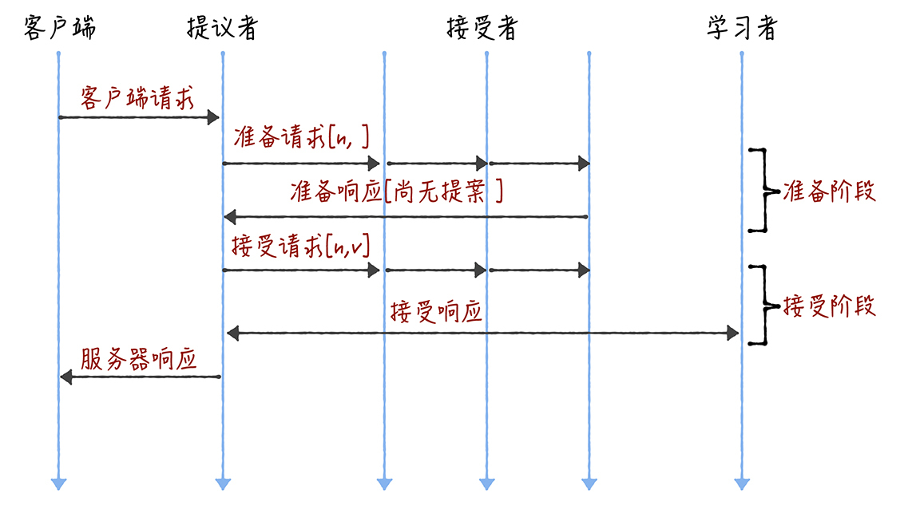
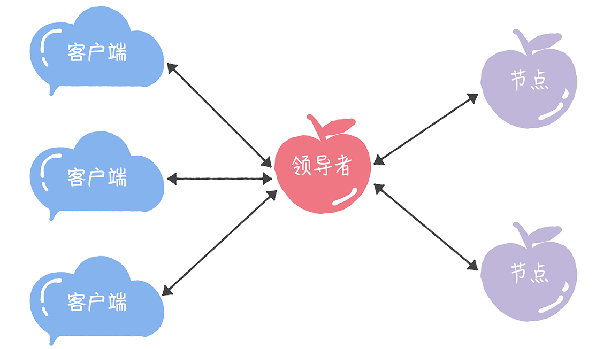
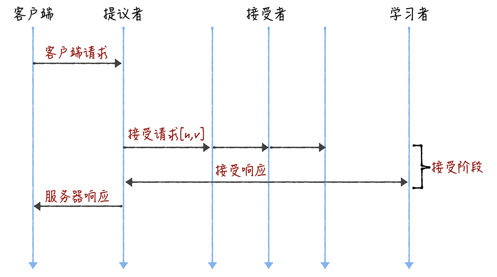
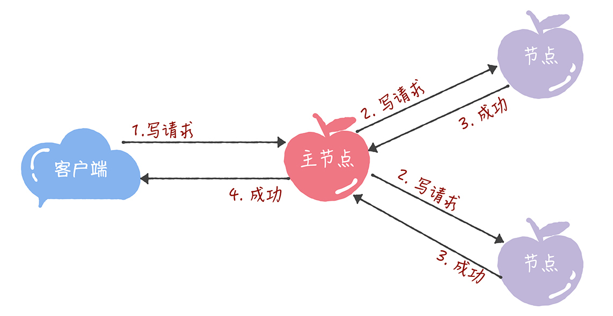
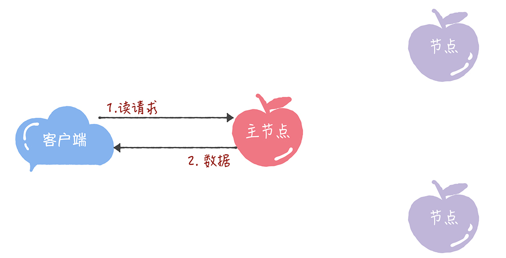

# 06 | Paxos算法（二）：Multi-Paxos不是一个算法，而是统称
你好，我是韩健。

经过上节课的学习，你应该知道，Basic Paxos只能就单个值（Value）达成共识，一旦遇到为一系列的值实现共识的时候，它就不管用了。虽然兰伯特提到可以通过多次执行Basic Paxos实例（比如每接收到一个值时，就执行一次Basic Paxos算法）实现一系列值的共识。但是，很多同学读完论文后，应该还是两眼摸黑，虽然每个英文单词都能读懂，但还是不理解兰伯特提到的Multi-Paxos，为什么Multi-Paxos这么难理解呢？

在我看来，兰伯特并没有把Multi-Paxos讲清楚，只是介绍了大概的思想，缺少算法过程的细节和编程所必须的细节（比如缺少选举领导者的细节）。这也就导致每个人实现的Multi-Paxos都不一样。不过从本质上看，大家都是在兰伯特提到的Multi-Paxos思想上补充细节，设计自己的Multi-Paxos算法，然后实现它（比如Chubby的Multi-Paxos实现、Raft算法等）。

所以在这里，我补充一下： **兰伯特提到的Multi-Paxos是一种思想，不是算法。而Multi-Paxos算法是一个统称，它是指基于Multi-Paxos思想，通过多个Basic Paxos实例实现一系列值的共识的算法（比如Chubby的Multi-Paxos实现、Raft算法等）。** 这一点尤其需要你注意。

为了帮你掌握Multi-Paxos思想，我会先带你了解，对于Multi-Paxos兰伯特是如何思考的，也就是说，如何解决Basic Paxos的痛点问题；然后我再以Chubby的Multi-Paxos实现为例，具体讲解一下。为啥选它呢？因为Chubby的Multi-Paxos实现，代表了Multi-Paxos思想在生产环境中的真正落地，它将一种思想变成了代码实现。

## 兰伯特关于Multi-Paxos的思考

熟悉Basic Paxos的同学（可以回顾一下 [05讲](https://time.geekbang.org/column/article/201700?utm_source=geektimeweb&utm_medium=pc&utm_term=pc_interstitial_143)）可能还记得，Basic Paxos是通过二阶段提交来达成共识的。在第一阶段，也就是准备阶段，接收到大多数准备响应的提议者，才能发起接受请求进入第二阶段（也就是接受阶段）：

而如果我们直接通过多次执行Basic Paxos实例，来实现一系列值的共识，就会存在这样几个问题：

- 如果多个提议者同时提交提案，可能出现因为提案编号冲突，在准备阶段没有提议者接收到大多数准备响应，协商失败，需要重新协商。你想象一下，一个5节点的集群，如果3个节点作为提议者同时提案，就可能发生因为没有提议者接收大多数响应（比如1个提议者接收到1个准备响应，另外2个提议者分别接收到2个准备响应）而准备失败，需要重新协商。

- 2轮RPC通讯（准备阶段和接受阶段）往返消息多、耗性能、延迟大。你要知道，分布式系统的运行是建立在RPC通讯的基础之上的，因此，延迟一直是分布式系统的痛点，是需要我们在开发分布式系统时认真考虑和优化的。

那么如何解决上面的2个问题呢？可以通过引入领导者和优化Basic Paxos执行来解决，咱们首先聊一聊领导者。

### 领导者（Leader）

我们可以通过引入领导者节点，也就是说，领导者节点作为唯一提议者，这样就不存在多个提议者同时提交提案的情况，也就不存在提案冲突的情况了：

在这里，我补充一点： **在论文中，兰伯特没有说如何选举领导者，需要我们在实现Multi-Paxos算法的时候自己实现。** 比如在Chubby中，主节点（也就是领导者节点）是通过执行Basic Paxos算法，进行投票选举产生的。

那么，如何解决第二个问题，也就是如何优化Basic Paxos执行呢？

### 优化Basic Paxos执行

我们可以采用“当领导者处于稳定状态时，省掉准备阶段，直接进入接受阶段”这个优化机制，优化Basic Paxos执行。也就是说，领导者节点上，序列中的命令是最新的，不再需要通过准备请求来发现之前被大多数节点通过的提案，领导者可以独立指定提案中的值。这时，领导者在提交命令时，可以省掉准备阶段，直接进入到接受阶段：

你看，和重复执行Basic Paxos相比，Multi-Paxos引入领导者节点之后，因为只有领导者节点一个提议者，只有它说了算，所以就不存在提案冲突。另外，当主节点处于稳定状态时，就省掉准备阶段，直接进入接受阶段，所以在很大程度上减少了往返的消息数，提升了性能，降低了延迟。

讲到这儿，你可能会问了：在实际系统中，该如何实现Multi-Paxos呢？接下来，我以Chubby的Multi-Paxos实现为例，具体讲解一下。

## Chubby的Multi-Paxos实现

既然兰伯特只是大概的介绍了Multi-Paxos思想，那么Chubby是如何补充细节，实现Multi-Paxos算法的呢？

首先，它通过引入主节点，实现了兰伯特提到的领导者（Leader）节点的特性。也就是说，主节点作为唯一提议者，这样就不存在多个提议者同时提交提案的情况，也就不存在提案冲突的情况了。

另外，在Chubby中，主节点是通过执行Basic Paxos算法，进行投票选举产生的，并且在运行过程中，主节点会通过不断续租的方式来延长租期（Lease）。比如在实际场景中，几天内都是同一个节点作为主节点。如果主节点故障了，那么其他的节点又会投票选举出新的主节点，也就是说主节点是一直存在的，而且是唯一的。

其次，在Chubby中实现了兰伯特提到的，“当领导者处于稳定状态时，省掉准备阶段，直接进入接受阶段”这个优化机制。

最后，在Chubby中，实现了成员变更（Group membership），以此保证节点变更的时候集群的平稳运行。

最后，我想补充一点： **在Chubby中，为了实现了强一致性，读操作也只能在主节点上执行。** 也就是说，只要数据写入成功，之后所有的客户端读到的数据都是一致的。具体的过程，就是下面的样子。

- 所有的读请求和写请求都由主节点来处理。当主节点从客户端接收到写请求后，作为提议者，执行Basic Paxos实例，将数据发送给所有的节点，并且在大多数的服务器接受了这个写请求之后，再响应给客户端成功：

- 当主节点接收到读请求后，处理就比较简单了，主节点只需要查询本地数据，然后返回给客户端就可以了：

Chubby的Multi-Paxos实现，尽管是一个闭源的实现，但这是Multi-Paxos思想在实际场景中的真正落地，Chubby团队不仅编程实现了理论，还探索了如何补充细节。其中的思考和设计非常具有参考价值，不仅能帮助我们理解Multi-Paxos思想，还能帮助我们理解其他的Multi-Paxos算法（比如Raft算法）。

## 内容小结

本节课我主要带你了解了Basic Paxos的局限，以及Chubby的Multi-Paxos实现。我希望你明确的重点如下：

1. 兰伯特提到的Multi-Paxos是一种思想，不是算法，而且还缺少算法过程的细节和编程所必须的细节，比如如何选举领导者等，这也就导致了每个人实现的Multi-Paxos都不一样。而Multi-Paxos算法是一个统称，它是指基于Multi-Paxos思想，通过多个Basic Paxos实例实现一系列数据的共识的算法（比如Chubby的Multi-Paxos实现、Raft算法等）。

2. Chubby实现了主节点（也就是兰伯特提到的领导者），也实现了兰伯特提到的 **“当领导者处于稳定状态时，省掉准备阶段，直接进入接受阶段”** 这个优化机制，省掉Basic Paxos的准备阶段，提升了数据的提交效率，但是所有写请求都在主节点处理，限制了集群处理写请求的并发能力，约等于单机。

3. 因为在Chubby的Multi-Paxos实现中，也约定了“大多数原则”，也就是说，只要大多数节点正常运行时，集群就能正常工作，所以Chubby能容错（n - 1）/2个节点的故障。

4. 本质上而言，“当领导者处于稳定状态时，省掉准备阶段，直接进入接受阶段”这个优化机制，是通过减少非必须的协商步骤来提升性能的。这种方法非常常用，也很有效。比如，Google设计的QUIC协议，是通过减少TCP、TLS的协商步骤，优化HTTPS性能。 **我希望你能掌握这种性能优化思路，后续在需要时，可以通过减少非必须的步骤，优化系统性能。**

最后，我想说的是，我个人比较喜欢Paxos算法（兰伯特的Basic Paxos和Multi-Paxos），虽然Multi-Paxos缺失算法细节，但这反而给我们提供了思考空间，让我们可以反复思考和考据缺失的细节，比如在Multi-Paxos中到底需不需要选举领导者，再比如如何实现提案编号等等。

但我想强调，Basic Paxos是经过证明的，而Multi-Paxos是一种思想，缺失实现算法的必须编程细节，这就导致，Multi-Paxos的最终算法实现，是建立在一个未经证明的基础之上的，正确性是个问号。

**与此同时，实现Multi-Paxos算法，最大的挑战是如何证明它是正确的。** 比如Chubby的作者做了大量的测试，和运行一致性检测脚本，验证和观察系统的健壮性。在实际使用时，我不推荐你设计和实现新的Multi-Paxos算法，而是建议优先考虑Raft算法，因为Raft的正确性是经过证明的。当Raft算法不能满足需求时，你再考虑实现和优化Multi-Paxos算法。

## 课堂思考

既然，我提了Chubby只能在主节点上执行读操作，那么在最后，我给你留了一个思考题，这个设计有什么局限呢？欢迎在留言区分享你的看法，与我一同讨论。

最后，感谢你的阅读，如果这篇文章让你有所收获，也欢迎你将它分享给更多的朋友。