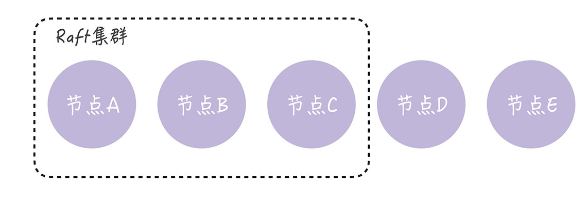
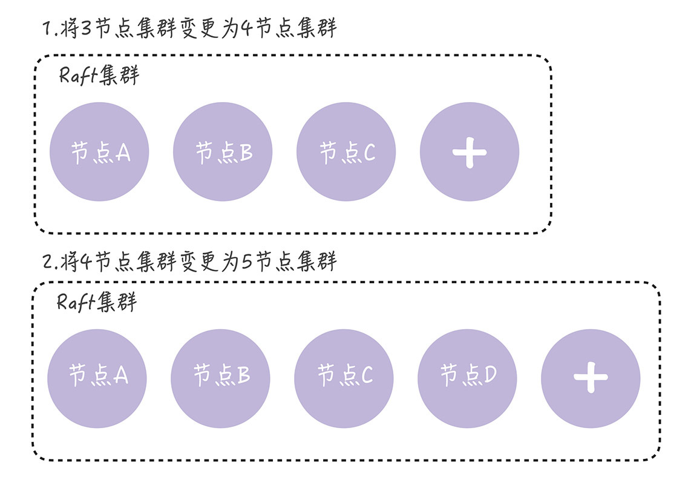
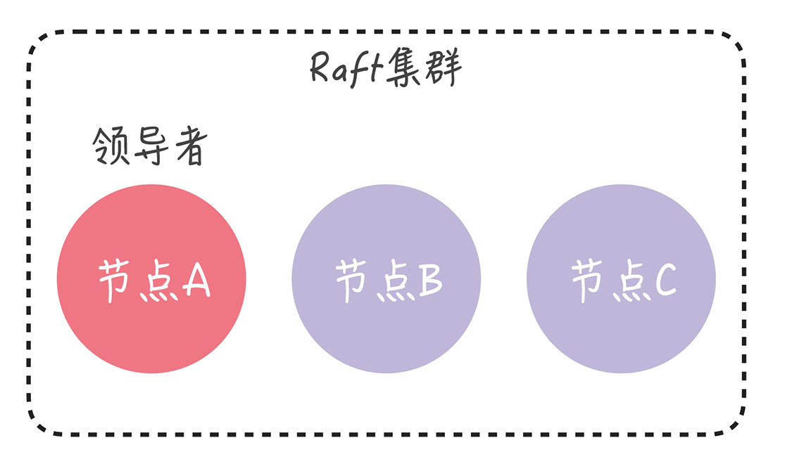
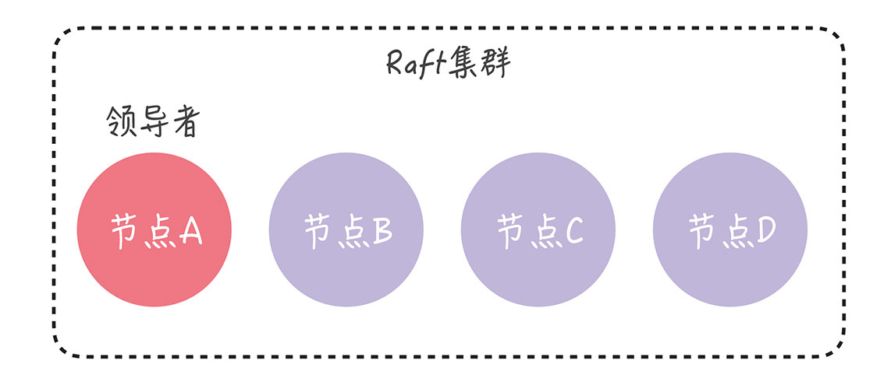
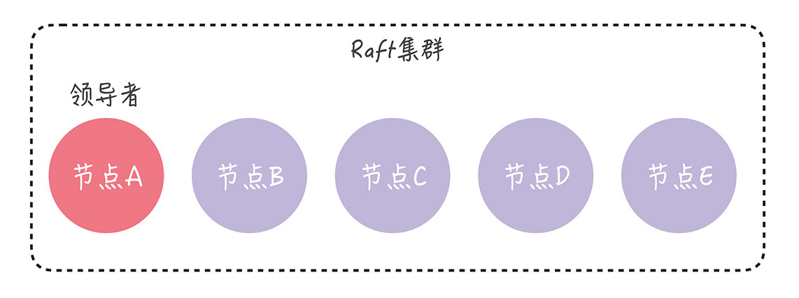
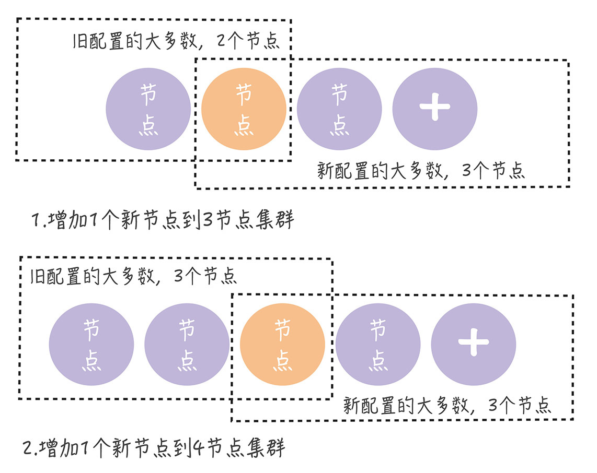
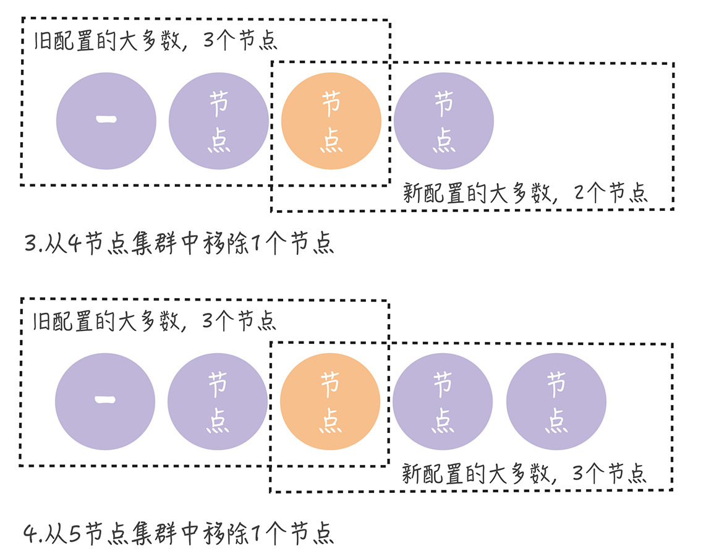

# 09 | Raft算法（三）：如何解决成员变更的问题？
你好，我是韩健。

在日常工作中，你可能会遇到服务器故障的情况，这时你就需要替换集群中的服务器。如果遇到需要改变数据副本数的情况，则需要增加或移除集群中的服务器。总的来说，在日常工作中，集群中的服务器数量是会发生变化的。

讲到这儿，也许你会问：“老韩，Raft是共识算法，对集群成员进行变更时（比如增加2台服务器），会不会因为集群分裂，出现2个领导者呢？”

在我看来，的确会出现这个问题，因为Raft的领导者选举，建立在“大多数”的基础之上，那么当成员变更时，集群成员发生了变化，就可能同时存在新旧配置的2个“大多数”，出现2个领导者，破坏了Raft集群的领导者唯一性，影响了集群的运行。

而关于成员变更，不仅是Raft算法中比较难理解的一部分，非常重要，也是Raft算法中唯一被优化和改进的部分。比如，最初实现成员变更的是联合共识（Joint Consensus），但这个方法实现起来难，后来Raft的作者就提出了一种改进后的方法，单节点变更（single-server changes）。

为了帮你掌握这块内容，今天我除了带你了解成员变更问题的本质之外，还会讲一下如何通过单节点变更的方法，解决成员变更的问题。学完本讲内容之后，你不仅能理解成员变更的问题和单节点变更的原理，也能更好地理解Raft源码实现，掌握解决成员变更问题的方法。

在开始今天内容之前，我先介绍一下“配置”这个词儿。因为常听到有同学说，自己不理解配置（Configuration）的含义，从而不知道如何理解论文中的成员变更。

的确，配置是成员变更中一个非常重要的概念，我建议你这么理解：它就是在说集群是哪些节点组成的，是集群各节点地址信息的集合。比如节点A、B、C组成的集群，那么集群的配置就是\[A, B, C\]集合。

理解了这一点之后，咱们先来看一道思考题。

假设我们有一个由节点A、B、C组成的Raft集群，现在我们需要增加数据副本数，增加2个副本（也就是增加2台服务器），扩展为由节点A、B、C、D、E， 5个节点组成的新集群：



那么Raft算法是如何保障在集群配置变更时，集群能稳定运行，不出现2个领导者呢？带着这个问题，我们正式进入今天的学习。

老话说得好，“认识问题，才能解决问题”。为了帮你更好地理解单节点变更的方法，我们先来看一看，成员变更时，到底会出现什么样的问题？

## 成员变更的问题

在我看来，在集群中进行成员变更的最大风险是，可能会同时出现2个领导者。比如在进行成员变更时，节点A、B和C之间发生了分区错误，节点A、B组成旧配置中的“大多数”，也就是变更前的3节点集群中的“大多数”，那么这时的领导者（节点A）依旧是领导者。

另一方面，节点C和新节点D、E组成了新配置的“大多数”，也就是变更后的5节点集群中的“大多数”，它们可能会选举出新的领导者（比如节点C）。那么这时，就出现了同时存在2个领导者的情况。


如果出现了2个领导者，那么就违背了“领导者的唯一性”的原则，进而影响到集群的稳定运行。你要如何解决这个问题呢？也许有的同学想到了一个解决方法。

因为我们在启动集群时，配置是固定的，不存在成员变更，在这种情况下，Raft的领导者选举能保证只有一个领导者。也就是说，这时不会出现多个领导者的问题，那我可以先将集群关闭再启动新集群啊。也就是先把节点A、B、C组成的集群关闭，然后再启动节点A、B、C、D、E组成的新集群。

**在我看来，这个方法不可行。** 为什么呢？因为你每次变更都要重启集群，意味着在集群变更期间服务不可用，肯定不行啊，太影响用户体验了。想象一下，你正在玩王者荣耀，时不时弹出一个对话框通知你：系统升级，游戏暂停3分钟。这体验糟糕不糟糕？

既然这种方法影响用户体验，根本行不通，那到底怎样解决成员变更的问题呢？ **最常用的方法就是单节点变更。**

## 如何通过单节点变更解决成员变更的问题？

单节点变更，就是通过一次变更一个节点实现成员变更。如果需要变更多个节点，那你需要执行多次单节点变更。比如将3节点集群扩容为5节点集群，这时你需要执行2次单节点变更，先将3节点集群变更为4节点集群，然后再将4节点集群变更为5节点集群，就像下图的样子。



现在，让我们回到开篇的思考题，看看如何用单节点变更的方法，解决这个问题。为了演示方便，我们假设节点A是领导者：



目前的集群配置为\[A, B, C\]，我们先向集群中加入节点D，这意味着新配置为\[A, B, C, D\]。成员变更，是通过这么两步实现的：

- 第一步，领导者（节点A）向新节点（节点D）同步数据；
- 第二步，领导者（节点A）将新配置\[A, B, C, D\]作为一个日志项，复制到新配置中所有节点（节点A、B、C、D）上，然后将新配置的日志项应用（Apply）到本地状态机，完成单节点变更。



在变更完成后，现在的集群配置就是\[A, B, C, D\]，我们再向集群中加入节点E，也就是说，新配置为\[A, B, C, D, E\]。成员变更的步骤和上面类似：

- 第一步，领导者（节点A）向新节点（节点E）同步数据；
- 第二步，领导者（节点A）将新配置\[A, B, C, D, E\]作为一个日志项，复制到新配置中的所有节点（A、B、C、D、E）上，然后再将新配置的日志项应用到本地状态机，完成单节点变更。



这样一来，我们就通过一次变更一个节点的方式，完成了成员变更，保证了集群中始终只有一个领导者，而且集群也在稳定运行，持续提供服务。

我想说的是，在正常情况下， **不管旧的集群配置是怎么组成的，旧配置的“大多数”和新配置的“大多数”都会有一个节点是重叠的。** 也就是说，不会同时存在旧配置和新配置2个“大多数”：



从上图中你可以看到，不管集群是偶数节点，还是奇数节点，不管是增加节点，还是移除节点，新旧配置的“大多数”都会存在重叠（图中的橙色节点）。

需要你注意的是，在分区错误、节点故障等情况下，如果我们并发执行单节点变更，那么就可能出现一次单节点变更尚未完成，新的单节点变更又在执行，导致集群出现2个领导者的情况。

如果你遇到这种情况，可以在领导者启动时，创建一个NO\_OP日志项（也就是空日志项），只有当领导者将NO\_OP日志项应用后，再执行成员变更请求。这个解决办法，你记住就可以了，可以自己在课后试着研究下。具体的实现，可参考Hashicorp Raft的源码，也就是runLeader()函数中：

```
noop := &logFuture{
        log: Log{
               Type: LogNoop,
        },
}
r.dispatchLogs([]*logFuture{noop})

```

当然，有的同学会好奇“联合共识”，在我看来，因为它难以实现，很少被Raft实现采用。比如，除了Logcabin外，未见到其他常用Raft实现采用了它，所以这里我就不多说了。如果你有兴趣，可以自己去阅读论文，加深了解。

## 内容小结

以上就是本节课的全部内容了，本节课我主要带你了解了成员变更的问题和单节点变更的方法，我希望你明确这样几个重点。

1. 成员变更的问题，主要在于进行成员变更时，可能存在新旧配置的2个“大多数”，导致集群中同时出现两个领导者，破坏了Raft的领导者的唯一性原则，影响了集群的稳定运行。

2. 单节点变更是利用“一次变更一个节点，不会同时存在旧配置和新配置2个‘大多数’”的特性，实现成员变更。

3. 因为联合共识实现起来复杂，不好实现，所以绝大多数Raft算法的实现，采用的都是单节点变更的方法（比如Etcd、Hashicorp Raft）。其中，Hashicorp Raft单节点变更的实现，是由Raft算法的作者迭戈·安加罗（Diego Ongaro）设计的，很有参考价值。


除此之外，考虑到本节课是Raft算法的最后一讲，所以在这里，我想多说几句，帮助你更好地理解Raft算法。

有很多同学把Raft当成一致性算法，其实Raft不是一致性算法而是共识算法，是一个Multi-Paxos算法，实现的是如何就一系列值达成共识。并且，Raft能容忍少数节点的故障。虽然Raft算法能实现强一致性，也就是线性一致性（Linearizability），但需要客户端协议的配合。在实际场景中，我们一般需要根据场景特点，在一致性强度和实现复杂度之间进行权衡。比如Consul实现了三种一致性模型。

- default：客户端访问领导者节点执行读操作，领导者确认自己处于稳定状态时（在leader leasing时间内），返回本地数据给客户端，否则返回错误给客户端。在这种情况下，客户端是可能读到旧数据的，比如此时发生了网络分区错误，新领导者已经更新过数据，但因为网络故障，旧领导者未更新数据也未退位，仍处于稳定状态。

- consistent：客户端访问领导者节点执行读操作，领导者在和大多数节点确认自己仍是领导者之后返回本地数据给客户端，否则返回错误给客户端。在这种情况下，客户端读到的都是最新数据。

- stale：从任意节点读数据，不局限于领导者节点，客户端可能会读到旧数据。


一般而言，在实际工程中，Consul的consistent就够用了，可以不用线性一致性，只要能保证写操作完成后，每次读都能读到最新值就可以了。比如为了实现幂等操作，我们使用一个编号(ID)来唯一标记一个操作，并使用一个状态字段（nil/done）来标记操作是否已经执行，那么只要我们能保证设置了ID对应状态值为done后，能立即和一直读到最新状态值就可以了，也就通过防止操作的重复执行，实现了幂等性。

总的来说，Raft算法能很好地处理绝大部分场景的一致性问题，我推荐你在设计分布式系统时，优先考虑Raft算法，当Raft算法不能满足现有场景需求时，再去调研其他共识算法。

比如我负责过多个QQ后台的海量服务分布式系统，其中配置中心、名字服务以及时序数据库的META节点，采用了Raft算法。在设计时序数据库的DATA节点一致性时，基于水平扩展、性能和数据完整性等考虑，就没采用Raft算法，而是采用了Quorum NWR、失败重传、反熵等机制。这样安排不仅满足了业务的需求，还通过尽可能采用最终一致性方案的方式，实现系统的高性能，降低了成本。

## 课堂思考

在最后，我给你留了一个思考题，强领导者模型会限制集群的写性能，那你想想看，有什么办法能突破Raft集群的写性能瓶颈呢？欢迎在留言区分享你的看法，与我一同讨论。

最后，感谢你的阅读，如果这篇文章让你有所收获，也欢迎你将它分享给更多的朋友。