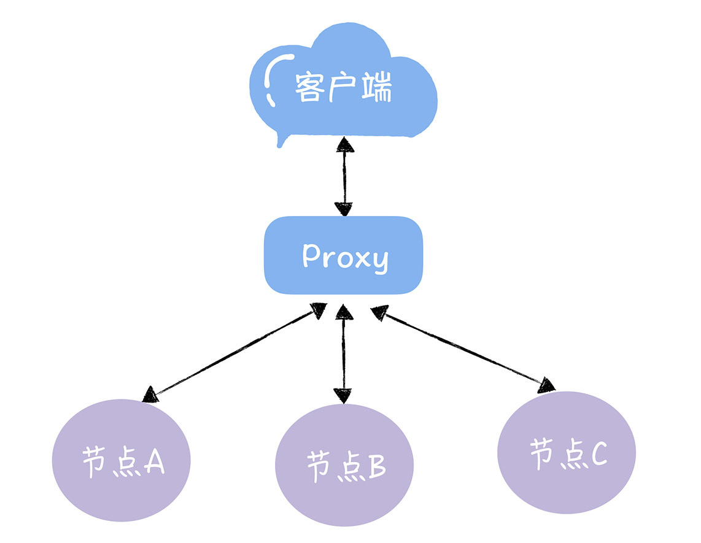
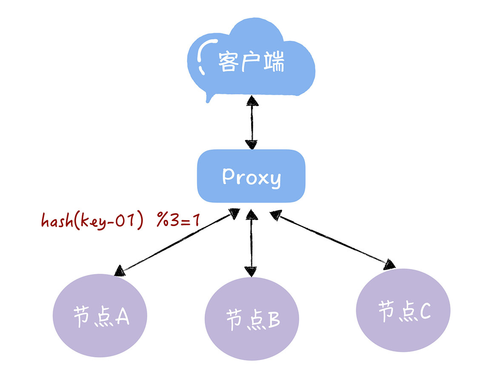
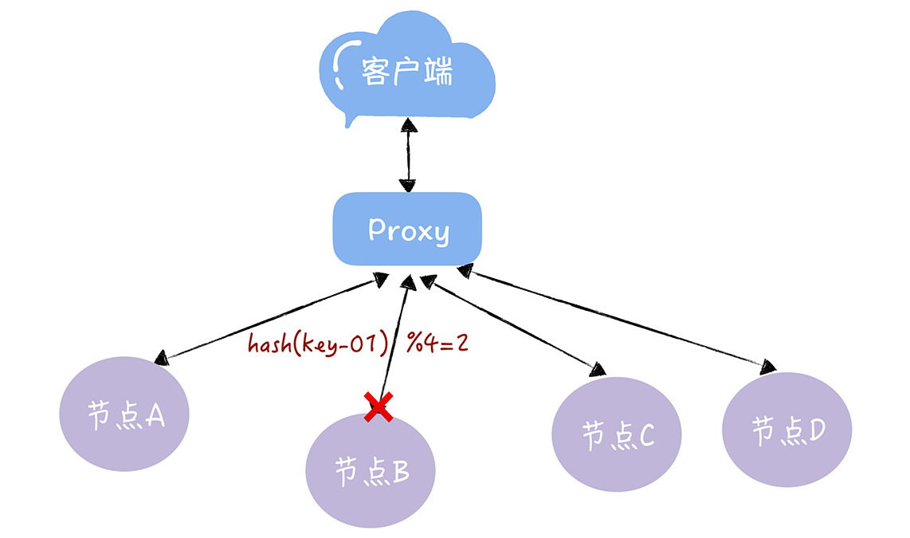
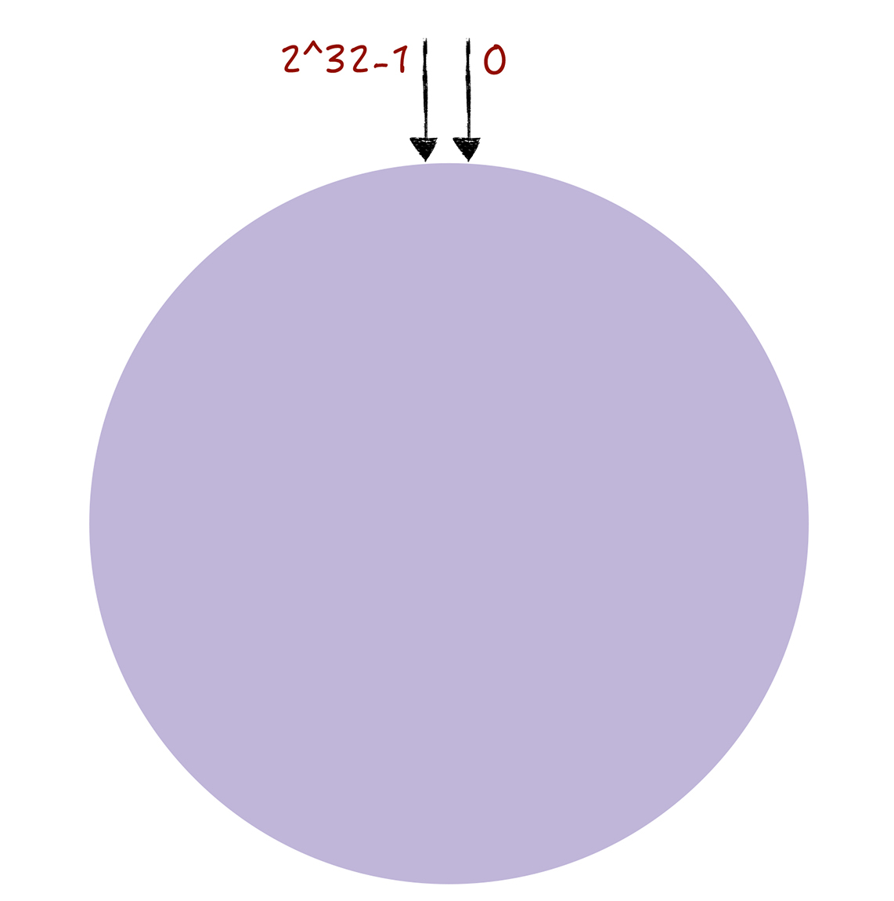
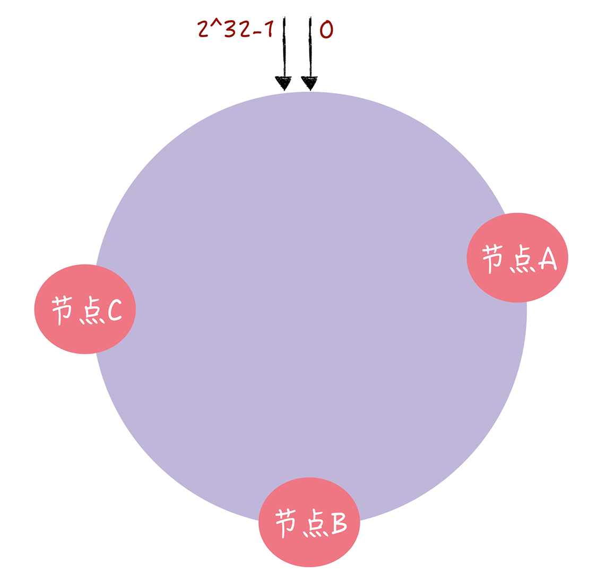
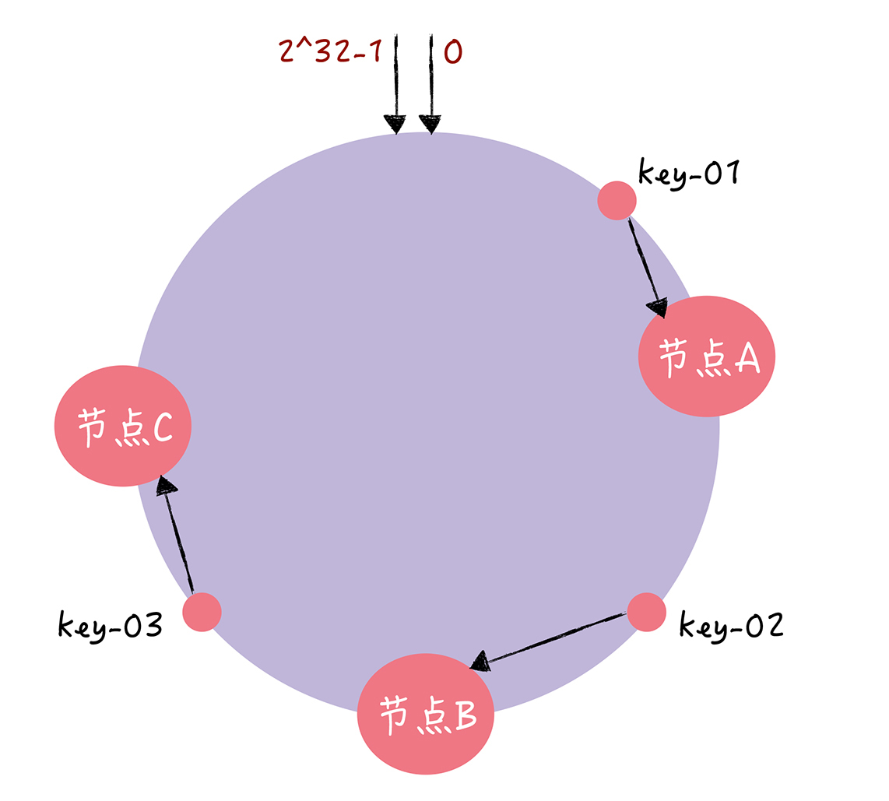
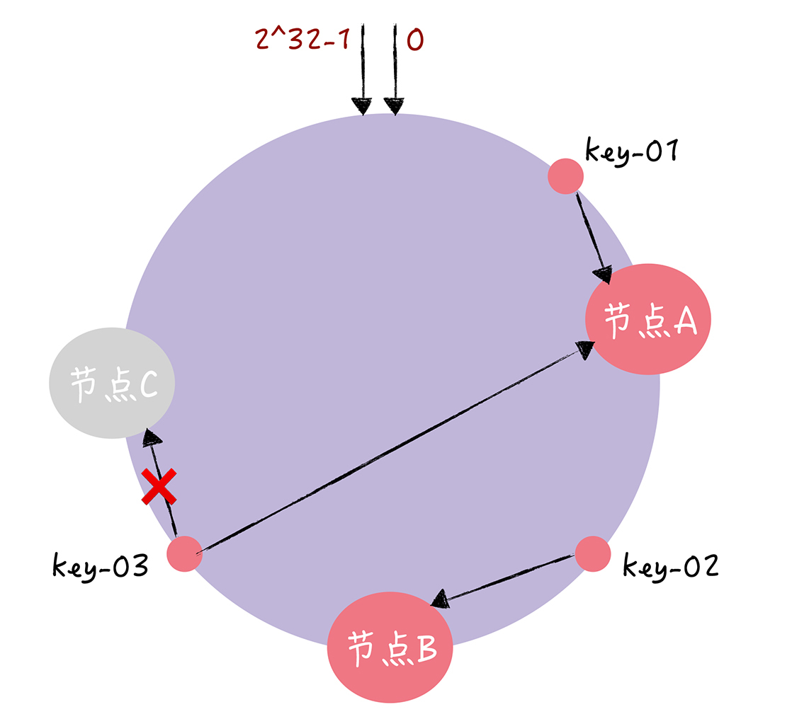
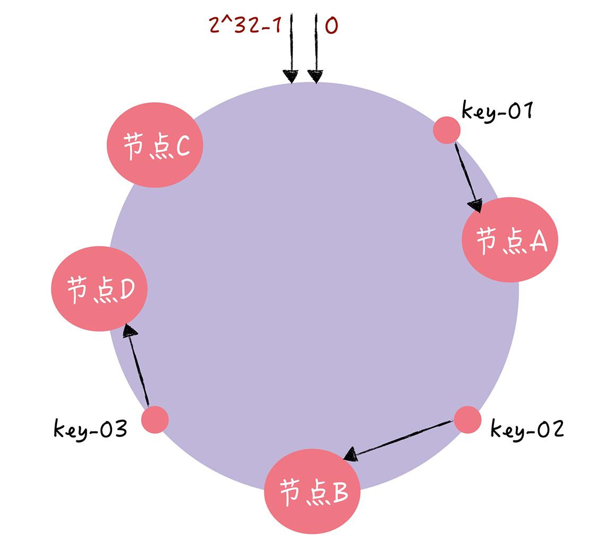
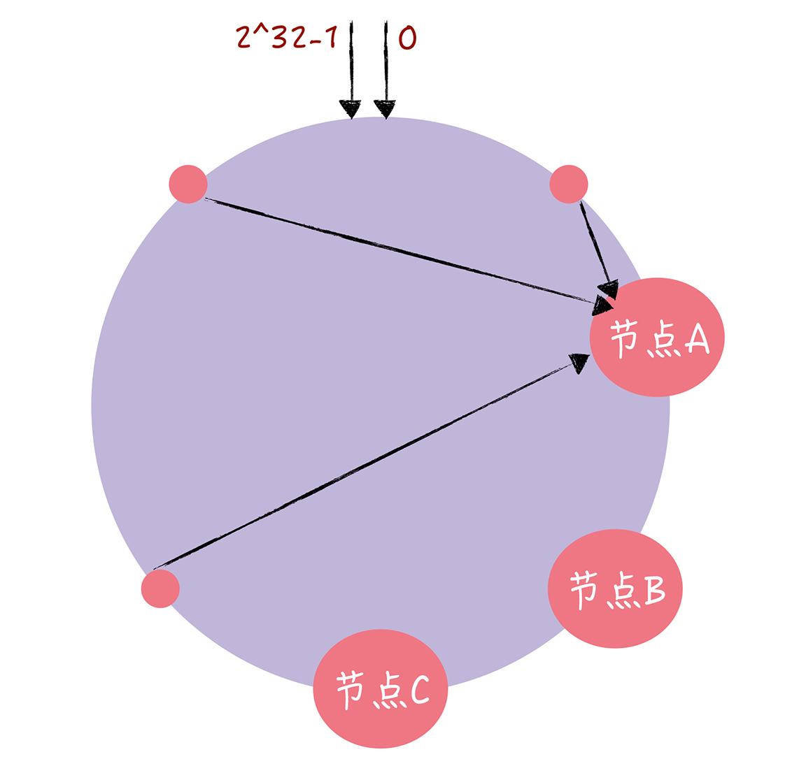
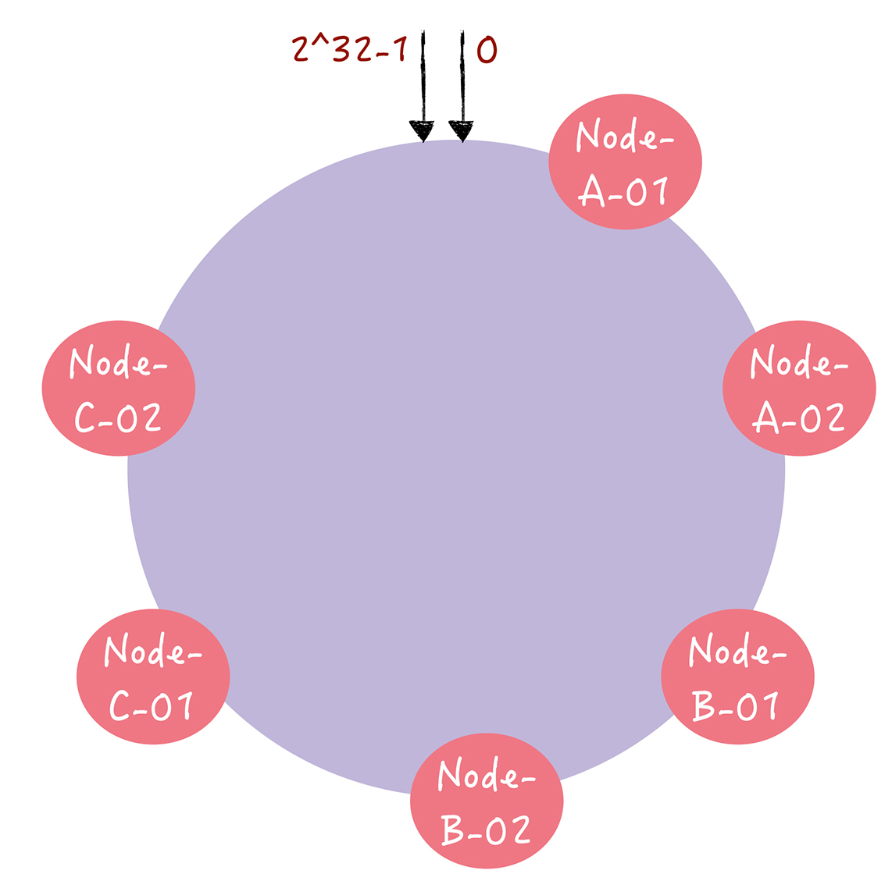

# 10 | 一致哈希算法：如何分群，突破集群的“领导者”限制？
你好，我是韩健。

学完前面几讲后，有些同学可能有这样的疑问：如果我们通过Raft算法实现了KV存储，虽然领导者模型简化了算法实现和共识协商，但写请求只能限制在领导者节点上处理，导致了集群的接入性能约等于单机，那么随着业务发展，集群的性能可能就扛不住了，会造成系统过载和服务不可用，这时该怎么办呢？

其实这是一个非常常见的问题。在我看来，这时我们就要通过分集群，突破单集群的性能限制了。

说到这儿，有同学可能会说了，分集群还不简单吗？加个Proxy层，由Proxy层处理来自客户端的读写请求，接收到读写请求后，通过对Key做哈希找到对应的集群就可以了啊。

是的，哈希算法的确是个办法，但它有个明显的缺点：当需要变更集群数时（比如从2个集群扩展为3个集群），这时大部分的数据都需要迁移，重新映射，数据的迁移成本是非常高的。那么如何解决哈希算法，数据迁移成本高的痛点呢？答案就是一致哈希（Consistent Hashing）。

为了帮你更好地理解如何通过哈希寻址实现KV存储的分集群，我除了会带你了解哈希算法寻址问题的本质之外，还会讲一下一致哈希是如何解决哈希算法数据迁移成本高这个痛点，以及如何实现数据访问的冷热相对均匀。

对你来说，学完本讲内容之后，不仅能理解一致哈希的原理，还能掌握通过一致哈希实现数据访问冷热均匀的实战能力。

老规矩，在正式开始学习之前，我们先看一道思考题。

假设我们有一个由A、B、C三个节点组成（为了方便演示，我使用节点来替代集群）的KV服务，每个节点存放不同的KV数据：



那么，使用哈希算法实现哈希寻址时，到底有哪些问题呢？带着这个问题，让我们开始今天的内容吧。

## 使用哈希算法有什么问题？

通过哈希算法，每个key都可以寻址到对应的服务器，比如，查询key是key-01，计算公式为hash(key-01) % 3 ，经过计算寻址到了编号为1的服务器节点A（就像图2的样子）。



但如果服务器数量发生变化，基于新的服务器数量来执行哈希算法的时候，就会出现路由寻址失败的情况，Proxy无法找到之前寻址到的那个服务器节点，这是为什么呢？

想象一下，假如3个节点不能满足业务需要了，这时我们增加了一个节点，节点的数量从3变化为4，那么之前的hash(key-01) % 3 = 1，就变成了hash(key-01) % 4 = X，因为取模运算发生了变化，所以这个X大概率不是1（可能X为2），这时你再查询，就会找不到数据了，因为key-01对应的数据，存储在节点A上，而不是节点B：



同样的道理，如果我们需要下线1个服务器节点（也就是缩容），也会存在类似的可能查询不到数据的问题。

而解决这个问题的办法，在于我们要迁移数据，基于新的计算公式hash(key-01) % 4 ，来重新对数据和节点做映射。需要你注意的是，数据的迁移成本是非常高的。

为了便于你理解，我举个例子，对于1000万key的3节点KV存储，如果我们增加1个节点，变为4节点集群，则需要迁移75%的数据。

```
$ go run ./hash.go  -keys 10000000 -nodes 3 -new-nodes 4
74.999980%

```

**从示例代码的输出，你可以看到，迁移成本是非常高昂的，这在实际生产环境中也是无法想象的。**

那我们如何通过一致哈希解决这个问题呢？

## 如何使用一致哈希实现哈希寻址？

一致哈希算法也用了取模运算，但与哈希算法不同的是，哈希算法是对节点的数量进行取模运算，而一致哈希算法是对2^32进行取模运算。你可以想象下，一致哈希算法，将整个哈希值空间组织成一个虚拟的圆环，也就是哈希环：



从图4中你可以看到，哈希环的空间是按顺时针方向组织的，圆环的正上方的点代表0，0点右侧的第一个点代表1，以此类推，2、3、4、5、6……直到2^32-1，也就是说0点左侧的第一个点代表2^32-1。

在一致哈希中，你可以通过执行哈希算法（为了演示方便，假设哈希算法函数为“c-hash()”），将节点映射到哈希环上，比如选择节点的主机名作为参数执行c-hash()，那么每个节点就能确定其在哈希环上的位置了：



当需要对指定key的值进行读写的时候，你可以通过下面2步进行寻址：

- 首先，将key作为参数执行c-hash()计算哈希值，并确定此key在环上的位置；
- 然后，从这个位置沿着哈希环顺时针“行走”，遇到的第一节点就是key对应的节点。

为了帮助你更好地理解如何通过一致哈希进行寻址，我举个例子。假设key-01、key-02、key-03 三个key，经过哈希算法c-hash()计算后，在哈希环上的位置就像图6的样子：



那么根据一致哈希算法，key-01将寻址到节点A，key-02将寻址到节点B，key-03将寻址到节点C。讲到这儿，你可能会问：“老韩，那一致哈希是如何避免哈希算法的问题呢？”

别着急，接下来我分别以增加节点和移除节点为例，具体说一说一致哈希是如何避免上面的问题的。假设，现在有一个节点故障了（比如节点C）：



你可以看到，key-01和key-02不会受到影响，只有key-03的寻址被重定位到A。一般来说，在一致哈希算法中，如果某个节点宕机不可用了，那么受影响的数据仅仅是，会寻址到此节点和前一节点之间的数据。比如当节点C宕机了，受影响的数据是会寻址到节点B和节点C之间的数据（例如key-03），寻址到其他哈希环空间的数据（例如key-01），不会受到影响。

那如果此时集群不能满足业务的需求，需要扩容一个节点（也就是增加一个节点，比如D）：



你可以看到，key-01、key-02不受影响，只有key-03的寻址被重定位到新节点D。一般而言，在一致哈希算法中，如果增加一个节点，受影响的数据仅仅是，会寻址到新节点和前一节点之间的数据，其它数据也不会受到影响。

让我们一起来看一个例子。使用一致哈希的话，对于1000万key的3节点KV存储，如果我们增加1个节点，变为4节点集群，只需要迁移24.3%的数据：

```
$ go run ./consistent-hash.go  -keys 10000000 -nodes 3 -new-nodes 4
24.301550%

```

**你看，使用了一致哈希后，我们需要迁移的数据量仅为使用哈希算法时的三分之一，是不是大大提升效率了呢？**

总的来说，使用了一致哈希算法后，扩容或缩容的时候，都只需要重定位环空间中的一小部分数据。 **也就是说，一致哈希算法具有较好的容错性和可扩展性。**

**需要你注意的是，在哈希寻址中常出现这样的问题：** 客户端访问请求集中在少数的节点上，出现了有些机器高负载，有些机器低负载的情况，那么在一致哈希中，有什么办法能让数据访问分布的比较均匀呢？答案就是虚拟节点。

在一致哈希中，如果节点太少，容易因为节点分布不均匀造成数据访问的冷热不均，也就是说大多数访问请求都会集中少量几个节点上：



你能从图中看到，虽然有3个节点，但访问请求主要集中的节点A上。 **那如何通过虚拟节点解决冷热不均的问题呢？**

其实，就是对每一个服务器节点计算多个哈希值，在每个计算结果位置上，都放置一个虚拟节点，并将虚拟节点映射到实际节点。比如，可以在主机名的后面增加编号，分别计算 “Node-A-01”“Node-A-02”“Node-B-01”“Node-B-02”“Node-C-01”“Node-C-02”的哈希值，于是形成6个虚拟节点：



你可以从图中看到，增加了节点后，节点在哈希环上的分布就相对均匀了。这时，如果有访问请求寻址到“Node-A-01”这个虚拟节点，将被重定位到节点A。你看，这样我们就解决了冷热不均的问题。

最后我想说的是，可能有同学已经发现了，当节点数越多的时候，使用哈希算法时，需要迁移的数据就越多，使用一致哈希时，需要迁移的数据就越少：

```
$ go run ./hash.go  -keys 10000000 -nodes 3 -new-nodes 4
74.999980%
$ go run ./hash.go  -keys 10000000 -nodes 10 -new-nodes 11
90.909000%

$ go run ./consistent-hash.go  -keys 10000000 -nodes 3 -new-nodes 4
24.301550%
$ go run ./consistent-hash.go  -keys 10000000 -nodes 10 -new-nodes 11
6.479330%

```

从示例代码的输出中你可以看到，当我们向10个节点集群中增加节点时， **如果使用了哈希算法，需要迁移高达90.91%的数据，使用一致哈希的话，只需要迁移6.48%的数据。**

我希望你能注意到这个规律，使用一致哈希实现哈希寻址时，可以通过增加节点数降低节点宕机对整个集群的影响，以及故障恢复时需要迁移的数据量。后续在需要时，你可以通过增加节点数来提升系统的容灾能力和故障恢复效率。

## 内容小结

以上就是本节课的全部内容了，本节课我主要带你了解了哈希算法的缺点、一致哈希的原理等内容。我希望你明确这样几个重点。

- 一致哈希是一种特殊的哈希算法，在使用一致哈希算法后，节点增减变化时只影响到部分数据的路由寻址，也就是说我们只要迁移部分数据，就能实现集群的稳定了。

- 当节点数较少时，可能会出现节点在哈希环上分布不均匀的情况。这样每个节点实际占据环上的区间大小不一，最终导致业务对节点的访问冷热不均。需要你注意的是，这个问题可以通过引入更多的虚拟节点来解决。


最后我想说的是，一致哈希本质上是一种路由寻址算法，适合简单的路由寻址场景。比如在KV存储系统内部，它的特点是简单，不需要维护路由信息。

## 课堂思考

Raft集群具有容错能力，能容忍少数的节点故障，那么在多个Raft集群组成的KV系统中，如何设计一致哈希，实现当某个集群的领导者节点出现故障，并选举出新的领导者后，整个系统还能稳定运行呢？欢迎在留言区分享你的看法，与我一同讨论。

最后，感谢你的阅读，如果这篇文章让你有所收获，也欢迎你将它分享给更多的朋友。