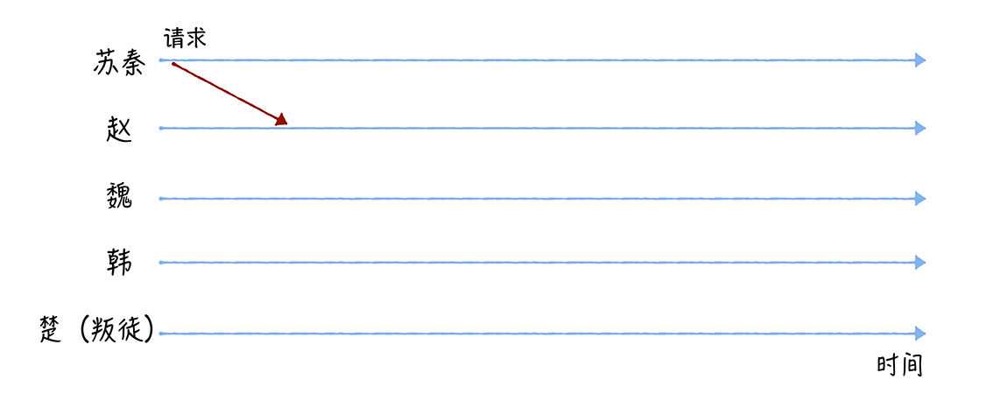
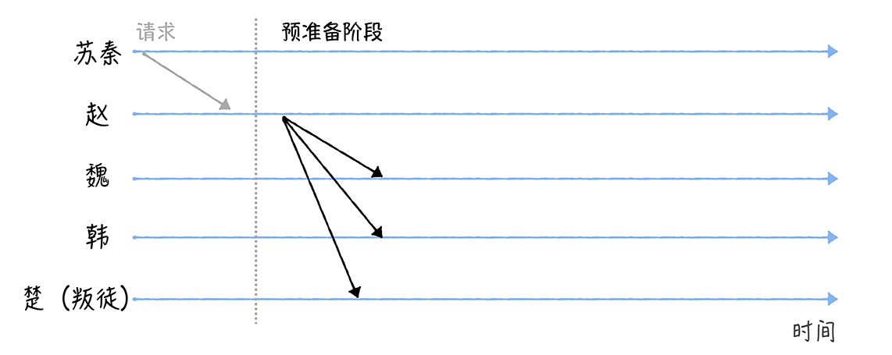
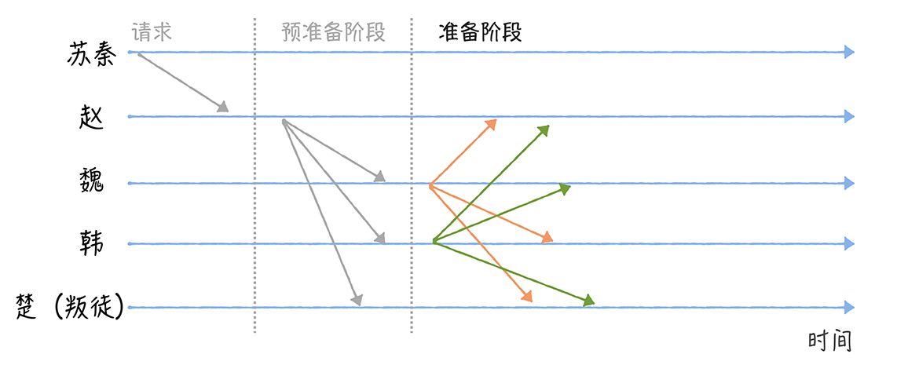
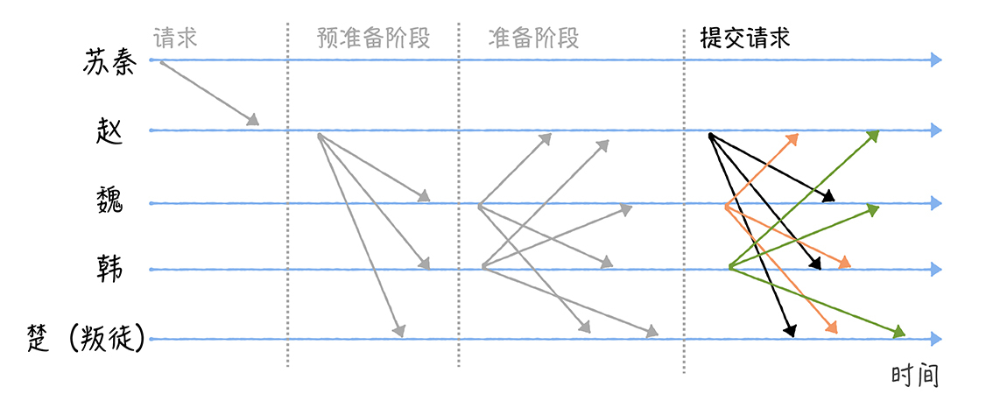
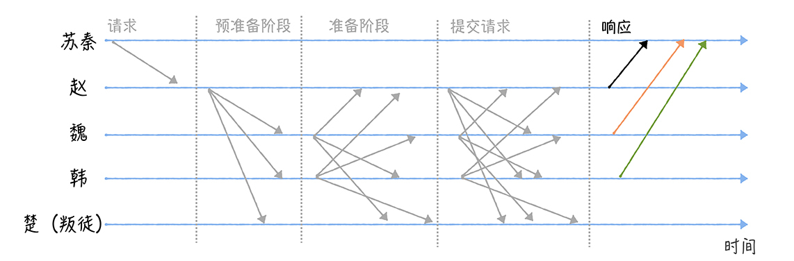

# 13 | PBFT算法：有人作恶，如何达成共识？
你好，我是韩健。

学完了 [01讲](https://time.geekbang.org/column/article/195662) 的拜占庭将军问题之后，有同学在留言中表达了自己的思考和困惑：口信消息型拜占庭问题之解在实际项目中是如何落地的呢？先给这位同学点个赞，很棒！你能在学习的同时思考落地实战。

不过事实上，它很难在实际项目落地，因为口信消息型拜占庭问题之解是一个非常理论化的算法，没有和实际场景结合，也没有考虑如何在实际场景中落地和实现。

比如，它实现的是在拜占庭错误场景下，忠将们如何在叛徒干扰时，就一致行动达成共识。但是它并不关心结果是什么，这会出现一种情况：现在适合进攻，但将军们达成的最终共识却是撤退。

很显然，这不是我们想要的结果。因为在实际场景中，我们需要就提议的一系列值（而不是单值），即使在拜占庭错误发生的时候也能被达成共识。那你要怎么做呢？答案就是掌握PBFT算法。

PBFT算法非常实用，是一种能在实际场景中落地的拜占庭容错算法，它在区块链中应用广泛（比如Hyperledger Sawtooth、Zilliqa）。为了帮助你更好地理解PBFT算法，在今天的内容中，我除了带你了解PBFT达成共识的原理之外，还会介绍口信消息型拜占庭问题之解的局限。相信学习完本讲内容后，你不仅能理解PBFT达成共识的基本原理，还能理解算法背后的演化和改进。

老规矩，在开始今天的学习之前，咱们先看一道思考题：

假设苏秦再一次带队抗秦，这一天，苏秦和4个国家的4位将军赵、魏、韩、楚商量军机要事，结果刚商量完没多久苏秦就接到了情报，情报上写道：联军中可能存在一个叛徒。这时，苏秦要如何下发作战指令，保证忠将们正确、一致地执行下发的作战指令，而不是被叛徒干扰呢？

带着这个问题，我们正式进入今天的学习。

首先，咱们先来研究一下，为什么口信消息型拜占庭问题之解很难在实际场景中落地，除了我在开篇提到的非常理论化，没有和实际的需求结合之外，还有其他的原因么？

其实，这些问题是后续众多拜占庭容错算法在努力改进和解决的，理解了这些问题，能帮助你更好地理解后来的拜占庭容错算法（包括PBFT算法）。

## 口信消息型拜占庭问题之解的局限

我想说的是，这个算法有个非常致命的缺陷。如果将军数为n、叛将数为 f，那么算法需要递归协商 f+1轮，消息复杂度为O(n ^ (f + 1))，消息数量指数级暴增。你可以想象一下，如果叛将数为64，消息数已经远远超过 **int64** 所能表示的了，这是无法想象的，肯定不行啊。

另外，尽管对于签名消息，不管叛将数（比如f）是多少，经过f + 1轮的协商，忠将们都能达成一致的作战指令，但是这个算法同样存在“理论化”和“消息数指数级暴增”的痛点。

讲到这儿，你肯定明白为什么这个算法很难在实际场景中落地了。可技术是不断发展的，算法也是在解决实际场景问题中不断改进的。那么PBFT算法的原理是什么呢？为什么它能在实际场景中落地呢？

## PBFT是如何达成共识的？

我们先来看看如何通过PBFT算法，解决苏秦面临的共识问题。先假设苏秦制定的作战指令是进攻，而楚是叛徒（为了演示方便）：

需要你注意的是，所有的消息都是签名消息，也就是说，消息发送者的身份和消息内容都是无法伪造和篡改的（比如，楚无法伪造一个假装来自赵的消息）。

首先，苏秦联系赵，向赵发送包含作战指令“进攻”的请求（就像下图的样子）。

当赵接收到苏秦的请求之后，会执行三阶段协议（Three-phase protocol）。

- 赵将进入预准备（Pre-prepare）阶段，构造包含作战指令的预准备消息，并广播给其他将军（魏、韩、楚）。

那么在这里，我想问你一个问题：魏、韩、楚，收到消息后，能直接执行指令吗？

答案是不能，因为他们不能确认自己接收到指令和其他人接收到的指令是相同的。比如，赵可能是叛徒，赵收到了2个指令，分别是“进攻”和“准备30天的粮草”，然后他给魏发送的是“进攻”，给韩、楚发送的是“准备30天粮草”，这样就会出现无法一致行动的情况。那么他们具体怎么办呢？我接着说一下。

- 接收到预准备消息之后，魏、韩、楚将进入准备（Prepare）阶段，并分别广播包含作战指令的准备消息给其他将军。比如，魏广播准备消息给赵、韩、楚（如图所示）。为了方便演示，我们假设叛徒楚想通过不发送消息，来干扰共识协商（你能看到，图中的楚是没有发送消息的）。

然后，当某个将军收到2f个一致的包含作战指令的准备消息后，会进入提交（Commit）阶段（这里的2f包括自己，其中f为叛徒数，在我的演示中是1）。在这里，我也给你提一个问题：这个时候该将军（比如魏）可以直接执行指令吗？

答案还是不能，因为魏不能确认赵、韩、楚是否收到了2f 个一致的包含作战指令的准备消息。也就是说，魏这时无法确认赵、韩、楚是否准备好了执行作战指令。那么怎么办呢？别着急，咱们继续往下看。

- 进入提交阶段后，各将军分别广播提交消息给其他将军，也就是告诉其他将军，我已经准备好了，可以执行指令了。

- 最后，当某个将军收到2f + 1个验证通过的提交消息后（包括自己，其中f为叛徒数，在我的演示中为1），也就是说，大部分的将军们已经达成共识，这时可以执行作战指令了，那么该将军将执行苏秦的作战指令，执行完毕后发送执行成功的消息给苏秦。

最后，当苏秦收到f+1个相同的响应（Reply）消息时，说明各位将军们已经就作战指令达成了共识，并执行了作战指令（其中f为叛徒数，在我的演示中为1）。

你看，经过了三轮协商，是不是就指定的作战指令达成了共识，并执行了作战指令了呢？

在这里，苏秦采用的就是 **简化版的PBFT算法**。在这个算法中：

- 你可以将赵、魏、韩、楚理解为分布式系统的四个节点，其中赵是主节点（Primary），魏、韩、楚是备份节点（Backup）；
- 将苏秦理解为业务，也就是客户端；
- 将消息理解为网络消息；
- 将作战指令“进攻”，理解成客户端提议的值，也就是希望被各节点达成共识，并提交给状态机的值。

**在这里我想说的是，** PBFT算法是通过签名（或消息认证码MAC）约束恶意节点的行为，也就是说，每个节点都可以通过验证消息签名确认消息的发送来源，一个节点无法伪造另外一个节点的消息。最终，基于大多数原则（2f + 1）实现共识的。

需要你注意的是，最终的共识是否达成，客户端是会做判断的，如果客户端在指定时间内未收到请求对应的f + 1相同响应，就认为集群出故障了，共识未达成，客户端会重新发送请求。

另外需要你注意的是，PBFT算法通过视图变更（View Change）的方式，来处理主节点作恶，当发现主节点在作恶时，会以“轮流上岗”方式，推举新的主节点。

最后我想说的是，尽管PBFT算法相比口信消息型拜占庭之解已经有了很大的优化，将消息复杂度从O(n ^ (f + 1))降低为O(n ^ 2)，能在实际场景中落地，并解决实际的共识问题。但PBFT还是需要比较多的消息。比如在13节点集群中（f为4）。

- 请求消息：1
- 预准备消息：3f = 12
- 准备消息：3f \* (3f - f) = 96
- 提交消息：(3f - f + 1) \* (3f + 1)= 117
- 回复消息：3f - 1 = 11

也就是说，一次共识协商需要237个消息，你看，消息数还是蛮多的，所以我推荐你，在中小型分布式系统中使用PBFT算法。

## 内容小结

以上就是本节课的全部内容了，本节课我主要带你了解了口信消息型拜占庭问题之解的局限和PBFT的原理，我希望你明确这样几个重点。

1. 不管口信消息型拜占庭问题之解，还是签名消息型拜占庭问题之解，都是非常理论化的，未考虑实际场景的需求，而且协商成本非常高，指数级的消息复杂度是很难在实际场景中落地，和解决实际场景问题的。

2. PBFT算法是通过签名（或消息认证码MAC）约束恶意节点的行为，采用三阶段协议，基于大多数原则达成共识的。另外，与口信消息型拜占庭问题之解（以及签名消息型拜占庭问题之解）不同的是，PBFT算法实现的是一系列值的共识，而不是单值的共识。

最后，我想说的是，相比Raft算法完全不适应有人作恶的场景，PBFT算法能容忍(n - 1)/3个恶意节点(也可以是故障节点)。另外，相比PoW算法，PBFT的优点是不消耗算力，所以在日常实践中，PBFT比较适用于相对“可信”的场景中，比如联盟链。

需要你注意的是，PBFT算法与Raft算法类似，也存在一个“领导者”（就是主节点），同样，集群的性能也受限于“领导者”。另外，O(n ^ 2)的消息复杂度，以及随着消息数的增加，网络时延对系统运行的影响也会越大，这些都限制了运行PBFT算法的分布式系统的规模，也决定了PBFT算法适用于中小型分布式系统。

## 课堂思考

当客户端在收到了f + 1个结果，就认为共识达成了，那么为什么这个值不能小于f + 1呢？欢迎在留言区分享你的看法，与我一同讨论。

最后，感谢你的阅读，如果这篇文章让你有所收获，也欢迎你将它分享给更多的朋友。