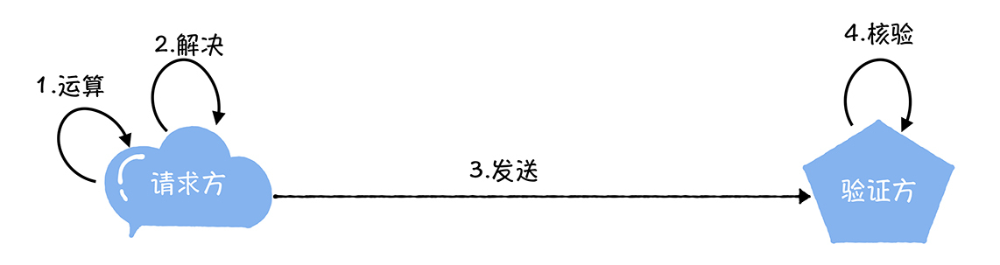
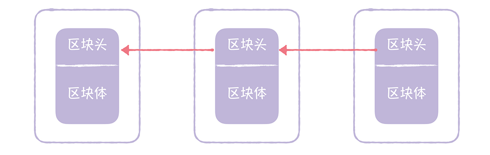
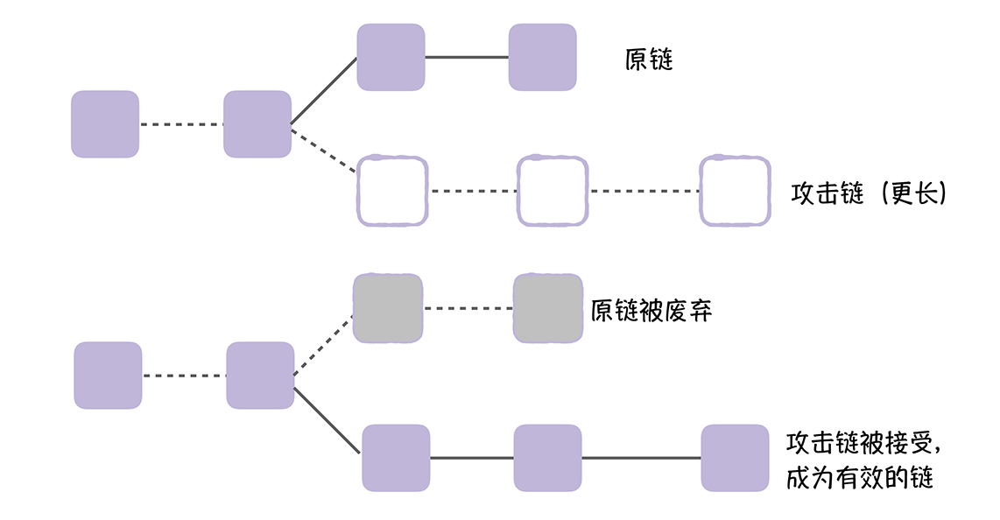

# 14 | PoW算法：有办法黑比特币吗？
你好，我是韩健。

谈起比特币，你应该再熟悉不过了，比特币是基于区块链实现的，而区块链运行在因特网上，这就存在有人试图作恶的情况。学完 [01讲](https://time.geekbang.org/column/article/195662) 和 [13讲](https://time.geekbang.org/column/article/209450) 之后，有些同学可能已经发现了，口信消息型拜占庭问题之解、PBFT算法虽然能防止坏人作恶，但只能防止少数的坏人作恶，也就是(n - 1) / 3个坏人 (其中n为节点数)。可如果区块链也只能防止一定比例的坏人作恶，那就麻烦了，因为坏人可以不断增加节点数，轻松突破(n - 1) / 3的限制。

那区块链是如何改进这个问题的呢？答案就是PoW算法。

在我看来，区块链通过工作量证明（Proof of Work）增加了坏人作恶的成本，以此防止坏人作恶。比如，如果坏人要发起51%攻击，需要控制现网51%的算力，成本是非常高昂的。为啥呢？因为根据Cryptoslate 估算，对比特币进行 51% 算力攻击需要上百亿人民币！

那么为了帮你更好地理解和掌握PoW算法，我会详细讲解它的原理和51%攻击的本质。希望让你在理解PoW算法的同时，也了解PoW算法的局限。

首先我来说说PoW的原理，换句话说，就是PoW是如何运行的。

## 如何理解工作量证明？

什么是工作量证明(Proof Of Work，简称PoW)呢？你可以这么理解：就是一份证明，用来确认你做过一定量的工作。比如，你的大学毕业证书就是一份工作量证明，证明你通过4年的努力完成了相关课程的学习。

那么回到计算机世界，具体来说就是，客户端需要做一定难度的工作才能得出一个结果，验证方却很容易通过结果来检查出客户端是不是做了相应的工作。

比如小李来BAT面试，说自己的编程能力很强，那么他需要做一定难度的工作（比如做个编程题）。根据做题结果，面试官可以判断他是否适合这个岗位。你看，小李做个编程题，面试官核验做题结果，这就是一个现实版的工作量证明。

具体的工作量证明过程，就像下图中的样子：



请求方做了一些运算，解决了某个问题，然后把运算结果发送给验证方，进行核验，验证方根据运算结果，就能判断请求方是否做了相关的工作。

需要你注意的是，这个算法具有不对称性，也就是说，工作对于请求方是有难度的，对于验证方则是比较简单的，易于验证的。

既然工作量证明是通过指定的结果，来证明自己做过了一定量的工作。那么在区块链的PoW算法中需要做哪些工作呢？答案是哈希运算。

区块链是通过执行哈希运算，然后通过运算后的结果值，证明自己做过了相关工作。为了帮你更好地理解哈希运算，在介绍哈希运算之前，咱们先来聊一聊哈希函数。

哈希函数（Hash Function），也叫散列函数。就是说，你输入一个任意长度的字符串，哈希函数会计算出一个长度相同的哈希值。假设我们对任意长度字符串（比如"geektime"）执行SHA256哈希运算，就会得到一个32字节的哈希值，就像下面的样子：

```
$ echo -n "geektime" | sha256sum
bb2f0f297fe9d3b8669b6b4cec3bff99b9de596c46af2e4c4a504cfe1372dc52  -

```

那我们如何通过哈希函数进行哈希运算，从而证明工作量呢？为了帮你理解这部分内容，我举个具体的例子。

我们给出的工作量要求是，基于一个基本的字符串（比如"geektime"），你可以在这个字符串后面添加一个整数值，然后对变更后（添加整数值)的字符串进行SHA256哈希运算，如果运算后得到的哈希值（16进制形式）是以"0000"开头的，就验证通过。为了达到这个工作量证明的目标，我们需要不停地递增整数值，一个一个试，对得到的新字符串进行 SHA256 哈希运算。

按照这个规则，我们需要经过35024次计算，才能找到恰好前4位为0的哈希值。

```
"geektime0" => 01f28c5df06ef0a575fd0e529be9a6f73b1290794762de014ec84182081e118e
"geektime1" => a2567c06fdb5775cb1e3ce17b72754cf146fcc6da75c8f1d87d7ab6a1b8c4523
...
"geektime35022" =>
8afc85049a9e92fe0b6c98b02b27c09fb869fbfe273d0ab84ad8c5ac17b8627e
"geektime35023" =>
0000ec5927ba10ea45a6822dcc205050ae74ae1ad2d9d41e978e1ec9762dc404

```

通过这个示例你可以看到，工作量证明是通过执行哈希运算，经过一段时间的计算后，得到符合条件的哈希值。也就是说，可以通过这个哈希值，来证明我们的工作量。

关于这个规则，我也想多说几句，这个规则不是固定的，在实际场景中，你可以根据场景特点，制定不同的规则，比如，你可以试试分别运行多少次，才能找到恰好前3位和前5位为0的哈希值。

现在，你对工作量证明的原理应该有一定的了解了，那么有同学肯定好奇了，在区块链中是如何实现工作量证明的呢？

## 区块链如何实现PoW算法的？

区块链也是通过SHA256来执行哈希运算的，通过计算出符合指定条件的哈希值，来证明工作量的。因为在区块链中，PoW算法是基于区块链中的区块信息，进行哈希运算的，所以我先带你回顾一下区块链的相关知识。

区块链的区块，是由区块头、区块体2部分组成的，就像下图中的样子。

- 区块头（Block Head）：区块头主要由上一个区块的哈希值、区块体的哈希值、4字节的随机数（nonce）等组成的。
- 区块体（Block Body）：区块包含的交易数据，其中的第一笔交易是Coinbase交易，这是一笔激励矿工的特殊交易。


我想说的是，拥有80字节固定长度的区块头，就是用于区块链工作量证明的哈希运算中输入字符串，而且通过双重SHA256哈希运算（也就是对SHA256哈希运算的结果，再执行一次哈希运算），计算出的哈希值，只有小于目标值（target），才是有效的，否则哈希值是无效的，必须重算。

学到这儿你可以看到，在区块链中是通过对区块头执行SHA256哈希运算，得到小于目标值的哈希值，来证明自己的工作量的。

计算出符合条件的哈希值后，矿工就会把这个信息广播给集群中所有其他节点，其他节点验证通过后，会将这个区块加入到自己的区块链中，最终形成一串区块链，就像下图的样子：



最后，我想说的是，算力越强，系统大概率会越先计算出这个哈希值。这也就意味着，如果坏人们掌握了51%的算力，就可以发起51%攻击，比如，实现双花（Double Spending），也就是说，同一份钱花2次。

具体说的话，就是攻击者掌握了较多的算力，能挖掘一条比原链更长的攻击链，并将攻击链向全网广播，这时呢，按照约定，节点将接受更长的链，也就是攻击链，丢弃原链。就像下图的样子：



需要你注意的是，即使攻击者只有30%的算力，他也有可能连续计算出多个区块的哈希值，挖掘出更长的攻击链，发动攻击； 另外，即使攻击者拥有51%的算力，他也有可能半天无法计算出一个区块的哈希值，也就是攻击失败。也就是说，能否计算出符合条件的哈希值，有一定的概率性，但长久来看，攻击者攻击成功的概率等同于攻击者算力的权重。

## 内容小结

以上就是本节课的全部内容了，本节课我主要带你了解了PoW算法的原理，和51%攻击，我希望你明确这样几个重点。

1. 在比特币的区块链中，PoW算法，是通过SHA256进行哈希运算，计算出符合指定条件的哈希值，来证明工作量的。

2. 51%攻击，本质是因为比特币的区块链约定了“最长链胜出，其它节点在这条链基础上扩展”，攻击者可以通过优势算力实现对最长链的争夺。

3. 除了通过PoW算法，增加坏人作恶的成本，比特币还通过“挖矿得币”奖励好人，最终保持了整个系统的运行稳定。


因为本讲是拜占庭容错算法的最后一讲，我想多说几句：学完了01讲的同学，应该还记得，我们提到Raft算法是非拜占庭容错算法。那么如果我们把Raft算法用于拜占庭场景中，会怎么样呢？

比如，在比特币中，我们采用了Raft算法实现共识，而不是基于PoW算法的区块链，那么，就会出现这样的情况，当恶意节点当选为领导者后，他可以不断地告诉其他节点，这些比特币都是我的，按照Raft的约定，其他节点也就只能接受这种情况，谁让恶意节点是领导者呢？ **最终就会出现，所有的比特币都被恶意节点盗走的情况**，完全乱套了。

另外我想说的是，因为拜占庭容错算法（比如PoW算法、PBFT算法），能容忍一定比例的作恶行为，所以它在相对开放的场景中应用广泛，比如公链、联盟链。非拜占庭容错算法（比如Raft）无法对作恶行为进行容错，主要用于封闭、绝对可信的场景中，比如私链、公司内网的DevOps环境。我希望你能准确理解2类算法之间的差异，根据场景特点，选择合适的算法，保障业务高效、稳定的运行。

## 课堂思考

既然，我提了如何通过计算得到"0000"开头的哈希值，来做实现工作量证明，那么你不妨思考下，如果约定是更多“0”开头的哈希值，比如“00000000”，工作量是增加了还是减少了，为什么呢？欢迎在留言区分享你的看法，与我一同讨论。

最后，感谢你的阅读，如果这篇文章让你有所收获，也欢迎你将它分享给更多的朋友。