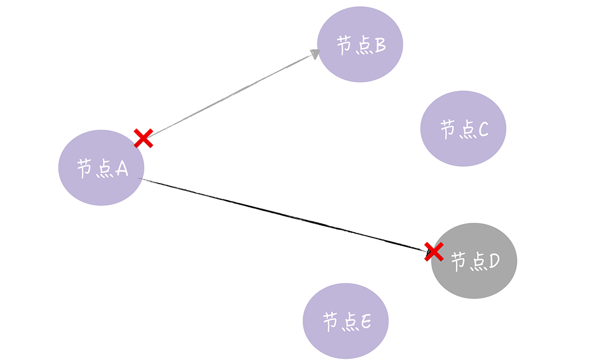
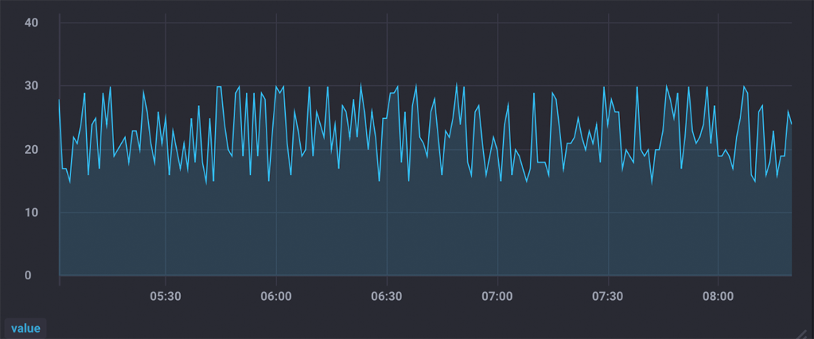
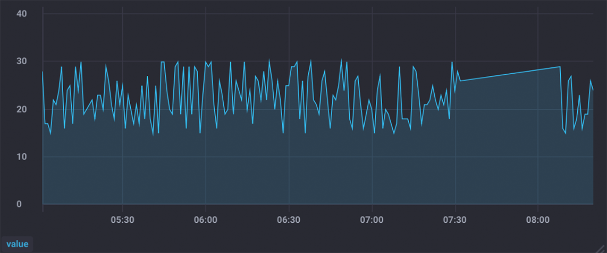

# 16 | InfluxDB企业版一致性实现剖析：他山之石，可以攻玉
你好，我是韩健。

学习了前面15讲的内容后，我们了解了很多常用的理论和算法（比如CAP定理、Raft算法等）。是不是理解了这些内容，就能够游刃有余地处理实际系统的问题了呢？

在我看来，还远远不够，因为理论和实践的中间是存在鸿沟的，比如，你可能有这样的感受，提到编程语言的语法或者分布式算法的论文，你说起来头头是道，但遇到实际系统时，还是无法写程序，开发分布式系统。

而我常说，实战是学习的最终目的。为了帮你更好地掌握前面的理论和算法，接下来，我用5讲的时间，分别以InfluxDB企业版一致性实现、Hashicorp Raft、KV系统开发实战为例，带你了解如何在实战中使用技术，掌握分布式的实战能力。

今天这一讲，我就以InfluxDB企业版为例，带你看一看系统是如何实现一致性的。有的同学可能会问了：为什么是InfluxDB企业版呢？因为它是排名第一的时序数据库，相比其他分布式系统（比如KV存储），时序数据库更加复杂，因为我们要分别设计2个完全不一样的一致性模型。当你理解了这样一个复杂的系统实现后，就能更加得心应手地处理简单系统的问题了。

那么为了帮你达到这个目的。我会先介绍一下时序数据库的背景知识，因为技术是用来解决实际场景的问题的，正如我之前常说的“要根据场景特点，权衡折中来设计系统”。所以当你了解了这些背景知识后，就能更好的理解为什么要这么设计了。

## 什么是时序数据库？

你可以这么理解，时序数据库，就是存储时序数据的数据库，就像MySQL是存储关系型数据的数据库。而时序数据，就是按照时间顺序记录系统、设备状态变化的数据，比如CPU利用率、某一时间的环境温度等，就像下面的样子：

```
> insert cpu_usage,host=server01,location=cn-sz user=23.0,system=57.0
> select * from cpu_usage
name: cpu_usage
time                host     location system user
----                ----     -------- ------ ----
1557834774258860710 server01 cn-sz    55     25
>

```

在我看来，时序数据最大的特点是数据量很大，可以不夸张地说是海量。时序数据主要来自监控（监控被称为业务之眼），而且在不影响业务运行的前提下，监控埋点是越多越好，这样才能及时发现问题、复盘故障。

**那么作为时序数据库，InfluxDB企业版的架构是什么样子呢？**

你可能已经了解过，它是由META节点和DATA节点2个逻辑单元组成的，而且这两个节点是2个单独的程序。那你也许会问了，为什么不能合成到一个程序呢？答案是场景不同。

- META节点存放的是系统运行的关键元信息，比如数据库（Database）、表（Measurement）、保留策略（Retention policy）等。它的特点是一致性敏感，但读写访问量不高，需要一定的容错能力。
- DATA节点存放的是具体的时序数据。它有这样几个特点：最终一致性、面向业务、性能越高越好，除了容错，还需要实现水平扩展，扩展集群的读写性能。

我想说的是，对于META节点来说，节点数的多少代表的是容错能力，一般3个节点就可以了，因为从实际系统运行观察看，能容忍一个节点故障就可以了。但对DATA节点而言，节点数的多少则代表了读写性能，一般而言，在一定数量以内（比如10个节点）越多越好，因为节点数越多，读写性能也越高，但节点数量太多也不行，因为查询时就会出现访问节点数过多而延迟大的问题。

所以，基于不同场景特点的考虑，2个单独程序更合适。如果META节点和DATA节点合并为一个程序，因读写性能需要，设计了一个10节点的DATA节点集群，这就意味着META节点集群（Raft集群）也是10个节点。在学了Raft算法之后，你应该知道，这时就会出现消息数多、日志提交慢的问题，肯定不行了。（对Raft日志复制不了解的同学，可以回顾一下 [08讲](https://time.geekbang.org/column/article/205784)）

现在你了解时序数据库，以及InfluxDB企业版的META节点和DATA节点了吧？那么怎么实现META节点和DATA节点的一致性呢？

## 如何实现META节点一致性？

你可以这样想象一下，META节点存放的是系统运行的关键元信息，那么当写操作发生后，就要立即读取到最新的数据。比如，创建了数据库“telegraf”，如果有的DATA节点不能读取到这个最新信息，那就会导致相关的时序数据写失败，肯定不行。

所以，META节点需要强一致性，实现CAP中的CP模型（对CAP理论不熟悉的同学，可以先回顾下 [02讲](https://time.geekbang.org/column/article/195675)）。

那么，InfluxDB企业版是如何实现的呢？

因为InflxuDB企业版是闭源的商业软件，通过 [官方文档](https://docs.influxdata.com/enterprise_influxdb/v1.7/concepts/clustering/#architectural-overview)，我们可以知道它使用Raft算法实现META节点的一致性（一般推荐3节点的集群配置）。那么说完META节点的一致性实现之后，我接着说一说DATA节点的一致性实现。

## 如何实现DATA节点一致性？

我们刚刚提到，DATA节点存放的是具体的时序数据，对一致性要求不高，实现最终一致性就可以了。但是，DATA节点也在同时作为接入层直接面向业务，考虑到时序数据的量很大，要实现水平扩展，所以必须要选用CAP中的AP模型，因为AP模型不像CP模型那样采用一个算法（比如Raft算法）就可以实现了，也就是说，AP模型更复杂，具体有这样几个实现步骤。

### 自定义副本数

首先，你需要考虑冗余备份，也就是同一份数据可能需要设置为多个副本，当部分节点出问题时，系统仍然能读写数据，正常运行。

那么，该如何设置副本呢？答案是实现自定义副本数。

关于自定义副本数的实现，我们在 [12讲](https://time.geekbang.org/column/article/209130) 介绍了，在这里就不啰嗦了。不过，我想补充一点，相比Raft算法节点和副本必须一一对应，也就是说，集群中有多少个节点就必须有多少个副本，你看，自定义副本数，是不是更灵活呢？

学到这里，有同学可能已经想到了，当集群支持多副本时，必然会出现一个节点写远程节点时，RPC通讯失败的情况，那么怎么处理这个问题呢？

### Hinted-handoff

我想说的是，一个节点接收到写请求时，需要将写请求中的数据转发一份到其他副本所在的节点，那么在这个过程中，远程RPC通讯是可能会失败的，比如网络不通了，目标节点宕机了，等等，就像下图的样子。



那么如何处理这种情况呢？答案是实现Hinted-handoff。在InfluxDB企业版中，Hinted-handoff是这样实现的:

- 写失败的请求，会缓存到本地硬盘上;
- 周期性地尝试重传;
- 相关参数信息，比如缓存空间大小(max-szie)、缓存周期（max-age）、尝试间隔（retry-interval）等，是可配置的。

在这里我想补充一点，除了网络故障、节点故障外，在实际场景中，临时的突发流量也会导致系统过载，出现RPC通讯失败的情况，这时也需要Hinted-handoff能力。

虽然Hinted-handoff可以通过重传的方式来处理数据不一致的问题，但当写失败请求的数据大于本地缓存空间时，比如某个节点长期故障，写请求的数据还是会丢失的，最终的节点的数据还是不一致的，那么怎么实现数据的最终一致性呢？答案是反熵。

### 反熵

需要你注意的是，时序数据虽然一致性不敏感，能容忍短暂的不一致，但如果查询的数据长期不一致的话，肯定就不行了，因为这样就会出现“Flapping Dashboard”的现象，也就是说向不同节点查询数据，生成的仪表盘视图不一样，就像图2和图3的样子。





从上面的2个监控视图中你可以看到，同一份数据，查询不同的节点，生成的视图是不一样的。那么，如何实现最终一致性呢？

答案就是咱们刚刚说的反熵，而我在 [11讲](https://time.geekbang.org/column/article/208182) 以自研InfluxDB系统为例介绍过反熵的实现，InfluxDB企业版类似，所以在这里就不啰嗦了。

不过有的同学可能会存在这样的疑问，实现反熵是以什么为准来修复数据的不一致呢？我想说的是，时序数据像日志数据一样，创建后就不会再修改了，一直存放在那里，直到被删除。

所以，数据副本之间的数据不一致，是因为数据写失败导致数据丢失了，也就是说，存在的都是合理的，缺失的就是需要修复的。这时我们可以采用两两对比、添加缺失数据的方式，来修复各数据副本的不一致了。

### Quorum NWR

最后，有同学可能会说了，我要在公司官网上展示的监控数据的仪表板（Dashboard），是不能容忍视图不一致的情况的，也就是无法容忍任何“Flapping Dashboard”的现象。那么怎么办呢？这时我们就要实现强一致性（Werner Vogels提到的强一致性），也就是每次读操作都要能读取最新数据，不能读到旧数据。

那么在一个AP型的分布式系统中，如何实现强一致性呢？

答案是实现Quorum NWR。同样，关于Quorum NWR的实现，我们在12讲已介绍，在这里也就不啰嗦了。

最后我想说的是，你可以看到，实现AP型分布式系统，比实现CP型分布式要复杂的。另外，通过上面的内容学习，我希望你能注意到，技术是用来解决场景需求的，没有十全十美的技术，在实际工作中，需要我们深入研究场景特点，提炼场景需求，然后根据场景特点权衡折中，设计出适合该场景特点的分布式系统。

## 内容小结

本节课我主要带你了解时序数据库、META节点一致性的实现、DATA节点一致性的实现。以一个复杂的实际系统为例，带你将前面学习到的理论串联起来，让你知道它们如何在实际场景中使用。我希望你明确的重点如下：

1. CAP理论是一把尺子，能辅助我们分析问题、总结归纳问题，指导我们如何做妥协折中。所以，我建议你在实践中多研究多思考，一定不能认为某某技术“真香”，十全十美了，要根据场景特点活学活用技术。

2. 通过Raft算法，我们能实现强一致性的分布式系统，能保证写操作完成后，后续所有的读操作，都能读取到最新的数据。

3. 通过自定义副本数、Hinted-handoff、反熵、Quorum NWR等技术，我们能实现AP型分布式系统，还能通过水平扩展，高效扩展集群的读写能力。


最后，我想再强调下，技术是用来解决场景的需求的，只有当你吃透技术，深刻理解场景的需求，才能开发出适合这个场景的分布式系统。另外我还想让你知道的是，InfluxDB企业版一年的License费高达1.5万美刀，为什么它值这个价钱？就是因为技术带来的高性能和成本优势。比如：

- 相比OpenTSDB，InfluxDB的写性能是它的9.96倍，存储效率是它的8.69倍，查询效率是它的7.38倍。
- 相比Graphite，InfluxDB的写性能是它的12倍，存储效率是6.3倍，查询效率是9倍。

在这里我想说的是，数倍或者数量级的性能优势其实就是钱，而且业务规模越大，省钱效果越突出。

另外我想说的是，尽管influxdb-comparisons的测试比较贴近实际场景，比如它的DevOps测试模型，与我们观察到常见的实际场景是一致的。但从实际效果看，InfluxDB的优势更加明显，成本优势更加突出。因为传统的时序数据库不仅仅是性能低，而且在海量数据场景下，接入和查询的痛点突出。为了缓解这些痛点，引入和堆砌了更多的开源软件。比如：

- 往往需要引入Kafka来缓解，因突发接入流量导致的丢数据问题；
- 需要引入Storm、Flink来缓解，时序数据库计算性能差的问题；
- 需要做热数据的内存缓存，来解决查询超时的问题。

所以在实施中，除了原有的时序数据库会被替换掉，还有大量的开源软件会被省掉，成本优势突出。在这里我想说的是，从实际实施看（自研InfluxDB系统），性能优势和成本优势也是符合这个预期的。

最后我想说的是，我反对堆砌开源软件，建议谨慎引入Kafka等缓存中间件。老话说，在计算机中，任何问题都可以通过引入一个中间层来解决。这句话是正确的，但背后的成本是不容忽视的，尤其是在海量系统中。 **我的建议是直面问题，通过技术手段在代码和架构层面解决它，而不是引入和堆砌更多的开源软件。** 其实，InfluxDB团队也是这么做，比如他们两次重构存储引擎。

## 课堂思考

我提到没有十全十美的技术，而是需要根据场景特点，权衡折中，设计出适合场景特点的分布式系统。那么你试着思考一下，假设有这样一个场景，一个存储系统，访问它的写请求不多（比如 1K QPS），但访问它的读请求很多（比如1M QPS），而且客户端查询时，对数据的一致性敏感，也就是需要实现强一致性，那么我们该如何设计这个系统呢？为什么呢？欢迎在留言区分享你的看法，与我一同讨论。

最后，感谢你的阅读，如果这篇文章让你有所收获，也欢迎你将它分享给更多的朋友。