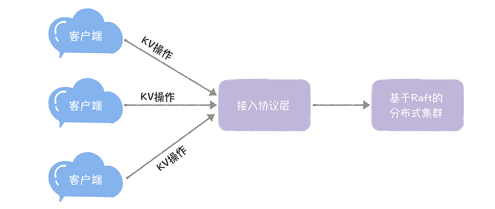
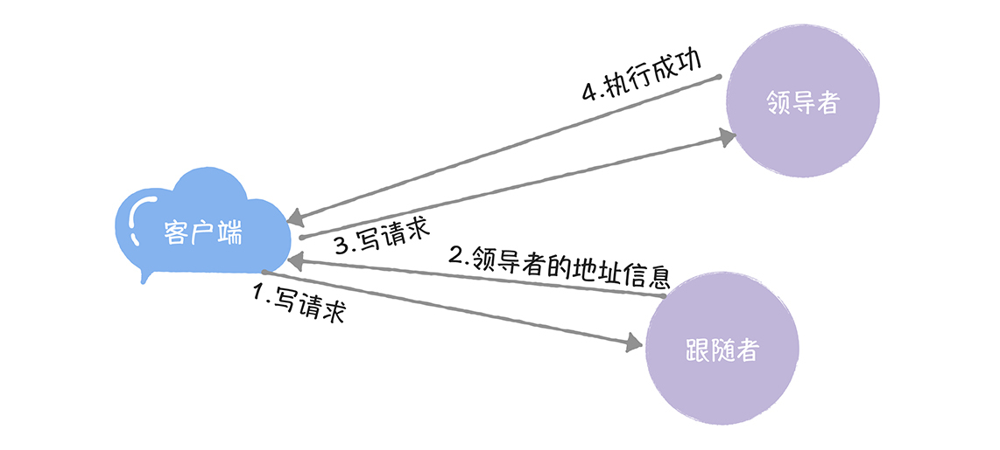
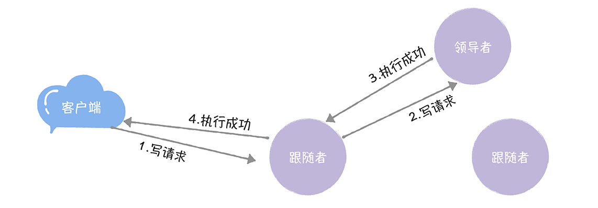

# 19 | 基于Raft的分布式KV系统开发实战（一）：如何设计架构？
你好，我是韩健。

学完前面2讲之后，相信你已经大致了解了Raft算法的代码实现（Hashcorp Raft），也掌握了常用API接口的用法，对Raft算法的理解也更深刻了。那么，是不是掌握这些，就能得心应手的处理实际场景的问题了呢？

在我看来，掌握的还不够，因为Raft算法的实现只是工具。而掌握了工具的用法，和能使用工具得心应手地处理实际场景的问题，是两回事。也就是说，我们还需要掌握使用Raft算法开发分布式系统的实战能力，然后才能游刃有余的处理实际场景的问题。

我从这个角度出发，在接下来的2节课中，我会分别从架构和代码实现的角度，以一个基本的分布式KV系统为例，具体说一说，如何基于Raft算法构建一个分布式KV系统。 **那么我希望你能课下多动手，自己写一遍，不给自己留下盲区。** 如果条件允许的话，你还可以按需开发实现需要的功能，并将这套系统作为自己的“配置中心”“名字路由”维护下去，不断在实战中加深自己对技术的理解。

可能有同学会问：“老韩，为什么不以Etcd为例呢？它不是已经在生产环境中落地了吗？”

我是这么考虑的，这个基本的分布式KV系统的代码比较少，相对纯粹聚焦在技术本身，涉及的KV业务层面的逻辑少，适合入门学习（比如你可以从零开始，动手编程实现），是一个很好的学习案例。

另外，对一些有经验的开发者来说，这部分知识能够帮助你掌握Raft算法中，一些深层次的技术实现，比如如何实现多种读一致性模型，让你更加深刻地理解Raft算法。

今天这节课，我会具体说一说如何设计一个基本的分布式KV系统，也就是需要实现哪些功能，以及在架构设计的时候，你需要考虑哪些点（比如跟随者是否要转发写请求给领导者？或者如何设计接入访问的API？）

好了，话不多说，一起进入今天的课程吧！

在我看来，基于技术深度、开发工作量、学习复杂度等综合考虑，一个基本的分布式KV系统，至少需要具备这样几块功能，就像下图的样子。



- 接入协议：供客户端访问系统的接入层API，以及与客户端交互的通讯协议。
- KV操作：我们需要支持的KV操作（比如赋值操作）。
- 分布式集群：也就是说，我们要基于Raft算法实现一个分布式存储集群，用于存放KV数据。

需要你注意的是，这3点就是分布式KV系统的核心功能，也就是我们需要编程实现的需求。

在我看来，要实现一个基本的分布式KV系统，首先要做的第一件事，就是实现访问接入的通讯协议。因为如果用户想使用这套系统，对他而言的第一件事，就是如何访问这套系统。那么，如何实现访问接入的通讯协议呢？

## 如何设计接入协议？

我想说的是，在早些时候，硬件性能低，服务也不是很多，开发系统的时候，主要矛盾是性能瓶颈，所以，更多的是基于性能的考虑，采用UDP协议和实现私有的二进制协议，比如，早期的QQ后台组件，就是这么做的。

现在呢，硬件性能有了很大幅度的提升，后台服务器的CPU核数都近百了，开发系统的时候，主要的矛盾已经不是性能瓶颈了，而是快速增长的海量服务和开发效率，所以这时，基于开发效率和可维护性的考虑，我们就需要优先考虑标准的协议了（比如HTTP）。

如果使用HTTP协议，那么就需要设计HTTP RESTful API，作为访问接口。具体怎么设计呢？

我想说的是，因为我们设计实现的是KV系统，肯定要涉及到KV操作，那么我们就一定需要设计个API（比如"/key"）来支持KV操作。也就是说，通过访问这个API，我们能执行相关的KV操作了，就像下面的样子（查询指定key（就是foo）对应的值）。

```
curl -XGET http://raft-cluster-host01:8091/key/foo

```

另外，需要你注意的是，因为这是一个Raft集群系统，除了业务层面（KV操作），我们还需要实现平台本身的一些操作的API接口，比如增加、移除集群节点等。我们现在只考虑增加节点操作的API（比如"/join"），就像下面的样子。

```
http://raft-cluster-host01:8091/join

```

另外，在故障或缩容情况下，如何替换节点、移除节点，我建议你在线下对比着增加节点的操作，自主实现。

除此之外，在我看来，实现HTTP RESTful API，还有非常重要的一件事情要做，那就是在设计API时，考虑如何实现路由，为什么这么说呢？你这么想象一下，如果我们实现了多个API，比如"/key"和"/join"，那么就需要将API对应的请求和它对应的处理函数一一映射起来。

我想说的是，我们可以在serveHTTP()函数（Golang）中，通过检测URL路径，来设置请求对应处理函数，实现路由。大概的原理，就像下面的样子。

```
func (s *Service) ServeHTTP(w http.ResponseWriter, r *http.Request) {    // 设置HTTP请求对应的路由信息
        if strings.HasPrefix(r.URL.Path, "/key") {
                s.handleKeyRequest(w, r)
        } else if r.URL.Path == "/join" {
                s.handleJoin(w, r)
        } else {
                w.WriteHeader(http.StatusNotFound)
        }
}

```

从上面代码中，我们可以看到，当检测到URL路径为“/key”时，会调用handleKeyRequest()函数，来处理KV操作请求；当检测到URL路径为"/join"时，会调用handleJoin()函数，将指定节点加入到集群中。

你看，通过"/key"和"/join"2个API，我们就能满足这个基本的分布式KV系统的运行要求了，既能支持来自客户端的KV操作，也能新增节点并将集群运行起来。

当客户端通过通讯协议访问到系统后，它最终的目标，还是执行KV操作。那么，我们该如何设计KV操作呢？

## 如何设计KV操作？

我想说的是，常见的KV操作是赋值、查询、删除，也就是说，我们实现这三个操作就可以了，其他的操作可以先不考虑。具体可以这么实现。

- **赋值操作：** 我们可以通过HTTP POST请求，来对指定key进行赋值，就像下面的样子。

```
curl -XPOST http://raft-cluster-host01:8091/key -d '{"foo": "bar"}'

```

- **查询操作：** 我们可以通过HTTP GET请求，来查询指定key的值，就像下面的样子。

```
curl -XGET http://raft-cluster-host01:8091/key/foo

```

- **删除操作：** 我们可以通过HTTP DELETE请求，来删除指定key和key对应的值，就像下面的样子。

```
curl -XDELETE http://raft-cluster-host01:8091/key/foo

```

在这里，尤其需要你注意的是，操作需要具有幂等性。幂等性这个词儿你估计不会陌生，你可以这样理解它：同一个操作，不管执行多少次，最终的结果都是一样的，也就是，这个操作是可以重复执行的，而是重复执行不会对系统产生预期外的影响。

为什么操作要具有幂等性呢？

因为共识算法能保证达成共识后的值（也就是指令）就不再改变了，但不能保证值只被提交一次，也就是说，共识算法是一个“at least once”的指令执行模型，是可能会出现同一个指令被重复提交的情况，为什么呢？我以Raft算法为例，具体说一说。

比如，如果客户端接收到Raft的超时响应后，也就是这时日志项还没有提交成功，如果此时它重试，发送一个新的请求，那么这个时候Raft会创建一个新的日志项，并最终将新旧2个日志项都提交了，出现了指令重复执行的情况。

在这里我想强调的是，你一定要注意到这样的情况，在使用Raft等共识算法时，要充分评估操作是否具有幂等性，避免对系统造成预期外的影响，比如，直接使用“Add”操作，就会因重复提交，导致最终的执行结果不准了，影响到业务。这就可能会出现，用户购买了100Q币，系统却给他充值了500Q币，肯定不行了。

说完如何设计KV操作后，因为我们的最终目标是实现分布式KV系统，那么，就让我们回到分布式系统最本源的一个问题上，如何实现分布式集群？

## 如何实现分布式集群？

我想说的是，正如在09讲中提到的，我推荐使用Raft算法实现分布式集群。而实现一个Raft集群，我们首先要考虑的是如何创建集群，为了简单起见，我们暂时不考虑节点的移除和替换等。

**创建集群**

在Raft算法中，我们可以这样创建集群。

- 先将第一个节点，通过Bootstrap的方式启动，并作为领导者节点。
- 其他节点与领导者节点通讯，将自己的配置信息发送给领导者节点，然后领导者节点调用AddVoter()函数，将新节点加入到集群中。

创建了集群后，在集群运行中，因为Raft集群的领导者不是固定不变的，而写请求是必须要在领导者节点上处理的，那么如何实现写操作，来保证写请求都会发给领导者呢？

**写操作**

一般而言，有2种方法来实现写操作。我来具体说说。

**方法1：** 跟随者接收到客户端的写请求后，拒绝处理这个请求，并将领导者的地址信息返回给客户端，然后客户端直接访问领导者节点，直到该领导者退位，就像下图的样子。



**方法2：** 跟随者接收到客户端的写请求后，将写请求转发给领导者，并将领导者处理后的结果返回给客户端，也就是说，这时跟随者在扮演“代理”的角色，就像下图的样子。



在我看来，虽然第一种方法需要客户端的配合，但实现起来复杂度不高；另外，第二种方法，虽然能降低客户端的复杂度，客户端像访问一个黑盒一样，访问系统，对领导者变更完全无感知。

但是这个方法会引入一个中间节点（跟随者），增加了问题分析排查的复杂度。而且，一般情况下，在绝大部分的时间内（比如Google Chubby团队观察到的值是数天），领导者是处于稳定状态的，某个节点一直是领导者，那么引入中间节点，就会增加大量的不必要的消息和性能消耗。所以，综合考虑，我推荐方法1。

学习了Raft算法后，我们知道，相比写操作（只要在领导者节点执行就可以了）而言，读操作要复杂些，因为如何实现读操作，关乎着一致性的实现，也就是说，怎么实现读操作，决定了客户端是否会读取到旧数据。那么如何实现读操作呢？

**读操作**

其实，在实际系统中，并不是实现了强一致性就是最好的，因为实现了强一致性，必然会限制集群的整体性能。也就是说，我们需要根据实际场景特点进行权衡折中，这样，才能设计出最适合该场景特点的读操作。比如，我们可以实现类似Consul的3种读一致性模型。

- default：偶尔读到旧数据。
- consistent：一定不会读到旧数据。
- stale：会读到旧数据。

如果你不记得这3种模型的含义了，你可以去09讲回顾下，在这里，我就不啰嗦了。

也就是说，我们可以实现多种读一致性模型，将最终的一致性选择权交给用户，让用户去选择，就像下面的样子。

```
curl -XGET http://raft-cluster-host02:8091/key/foo?level=consistent  -L

```

## 内容小结

本节课我主要带你了解了一个基本的分布式KV系统的架构，和需要权衡折中的技术细节，我希望你明确的重点如下。

1.在设计KV操作时，更确切的说，在实现Raft指令时，一定要考虑幂等性，因为Raf指令是可能会被重复提交和执行。

2.推荐你采用这种方式来实现写操作：跟随者接收到客户端的写请求时，拒绝该请求并返回领导者的地址信息给客户端，然后客户端直接访问领导者。

3.在Raft集群中，如何实现读操作，关乎一致性的实现，推荐实现default、consistent、stale三种一致性模型，将一致性的选择权交给用户，让用户根据实际业务特点，按需选择，灵活使用。

最后，我想说的是，这个基本的分布式KV系统，除了适合入门学习外，也比较适合配置中心、名字服务等小数据量的系统。另外我想补充一下，对于数据层组件，不仅性能重要，成本也很重要，而决定数据层组件的成本的最关键的一个理念是冷热分离，一般而言，可以这么设计三级缓存：

- 热数据：经常被访问到的数据，我们可以将它们放在内存中，提升访问效率。
- 冷数据：有时会被访问到的数据，我们可以将它们放在SSD硬盘上，访问起来也比较快。
- 陈旧数据：偶尔会被访问到的数据，我们可以将它们放在普通磁盘上，节省存储成本。

在实际系统中，你可以统计热数据的命中率，并根据命中率来动态调整冷热模型。在这里，我想强调的是，冷热分离理念在设计海量数据存储系统时尤为重要，比如，自研KV存储的成本仅为Redis数十分之一，其中系统设计时非常重要的一个理念就是冷热分离。希望你能重视这个理念，在实际场景中活学活用。

## 课堂思考

我提到了其他节点与领导者节点通讯，将自己的配置信息发送给领导者节点，然后领导者节点调用addVoter()函数，将新节点加入到集群中，那么，你不妨思考一下，当节点故障时，如何替换一个节点呢？欢迎在留言区分享你的看法，与我一同讨论。

最后，感谢你的阅读，如果这篇文章让你有所收获，也欢迎你将它分享给更多的朋友。