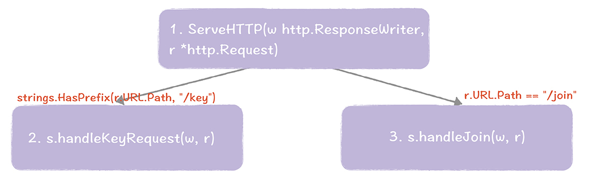
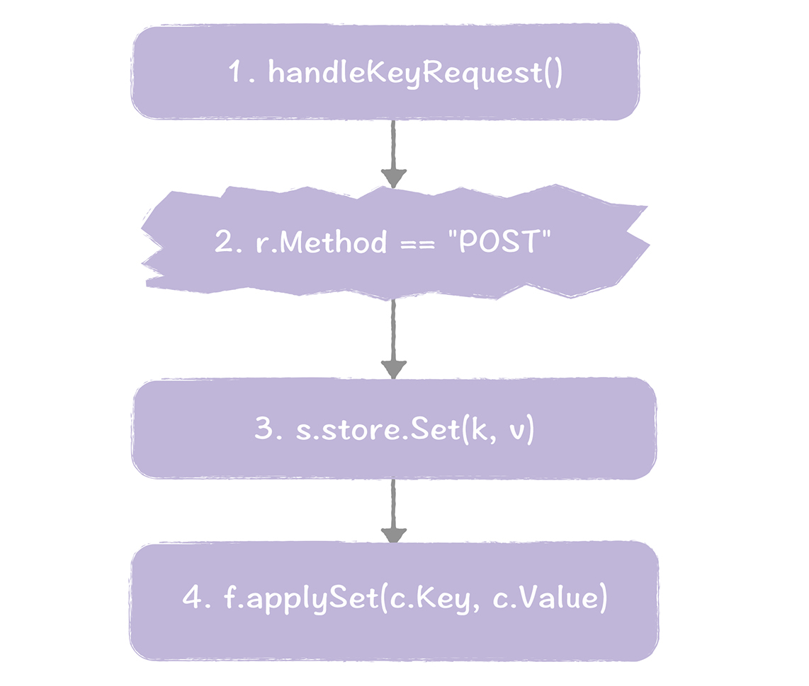
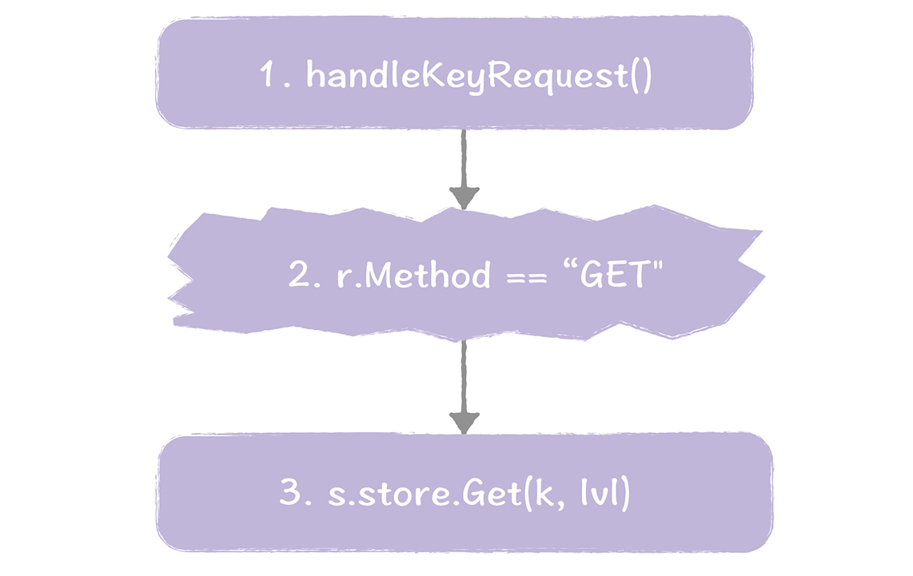
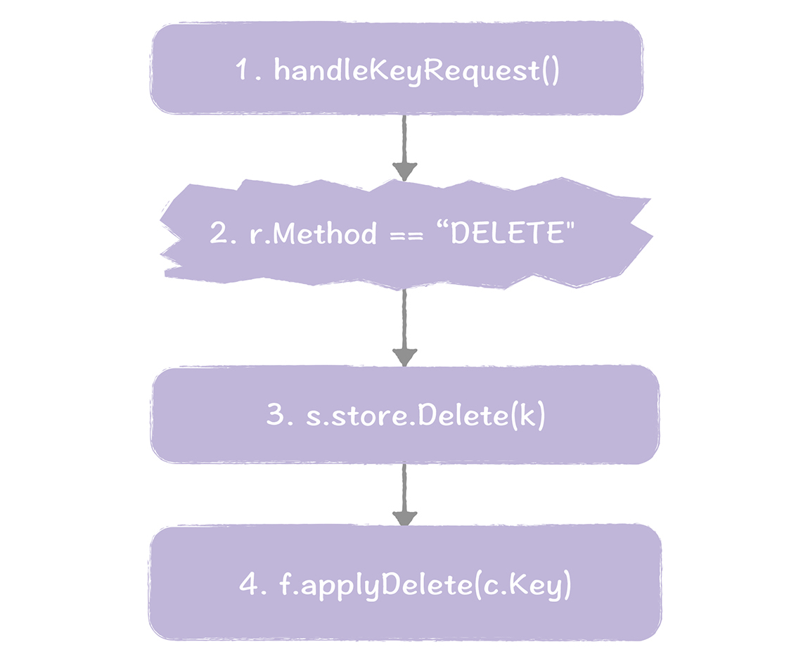
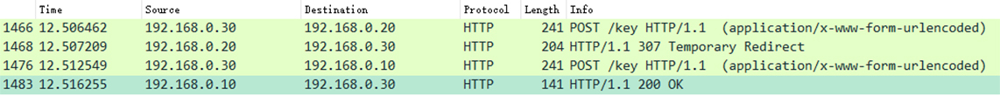
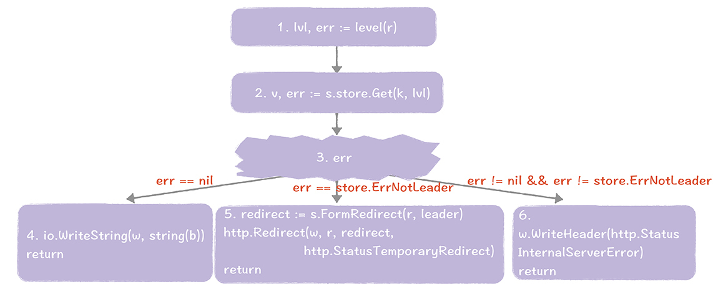

# 20 | 基于Raft的分布式KV系统开发实战（二）：如何实现代码？
你好，我是韩健。

学完 [上一讲](https://time.geekbang.org/column/article/217049) 后，相信你已经了解了分布式KV系统的架构设计，同时应该也很好奇，架构背后的细节代码是怎么实现的呢？

别着急，今天这节课，我会带你弄明白这个问题。我会具体讲解 [分布式KV系统](https://github.com/hanj4096/raftdb) 核心功能点的实现细节。比如，如何实现读操作对应的3种一致性模型。而我希望你能在课下反复运行程序，多阅读源码，掌握所有的细节实现。

话不多说，我们开始今天的学习。

在上一讲中，咱们将系统划分为三大功能块（接入协议、KV操作、分布式集群），那么今天我会按顺序具体说一说每块功能的实现，帮助你掌握架构背后的细节代码。首先，先来了解一下，如何实现接入协议。

## 如何实现接入协议？

在19讲提到，我们选择了HTTP协议作为通讯协议，并设计了"/key"和"/join"2个HTTP RESTful API，分别用于支持KV操作和增加节点的操作，那么，它们是如何实现的呢？

接入协议的核心实现，就是下面的样子。



我带你走一遍这三个步骤，便于你加深印象。

1. 在ServeHTTP()中，会根据URL路径设置相关的路由信息。比如，会在handlerKeyRequest()中处理URL路径前缀为"/key"的请求，会在handleJoin()中处理URL路径为"/join"的请求。
2. 在handleKeyRequest()中，处理来自客户端的KV操作请求，也就是基于HTTP POST请求的赋值操作、基于HTTP GET请求的查询操作、基于HTTP DELETE请求的删除操作。
3. 在handleJoin()中，处理增加节点的请求，最终调用raft.AddVoter()函数，将新节点加入到集群中。

在这里，需要你注意的是，在根据URL设置相关路由信息时，你需要考虑是路径前缀匹配（比如strings.HasPrefix(r.URL.Path, “/key”)），还是完整匹配（比如r.URL.Path == “/join”），避免在实际运行时，路径匹配出错。比如，如果对"/key"做完整匹配（比如r.URL.Path == “/key”），那么下面的查询操作会因为路径匹配出错，无法找到路由信息，而执行失败。

```
curl -XGET raft-cluster-host01:8091/key/foo

```

另外，还需要你注意的是，只有领导者节点才能执行raft.AddVoter()函数，也就是说，handleJoin()函数，只能在领导者节点上执行。

说完接入协议后，接下来咱们来分析一下第二块功能的实现，也就是，如何实现KV操作。

## 如何实现KV操作？

上一节课，我提到这个分布式KV系统会实现赋值、查询、删除3类操作，那具体怎么实现呢？你应该知道，赋值操作是基于HTTP POST请求来实现的，就像下面的样子。

```
curl -XPOST http://raft-cluster-host01:8091/key -d '{"foo": "bar"}'

```

也就是说，我们是通过HTTP POST请求，实现了赋值操作。



同样的，我们走一遍这个过程，加深一下印象。

1. 当接收到KV操作的请求时，系统将调用handleKeyRequest()进行处理。
2. 在handleKeyRequest()函数中，检测到HTTP请求类型为POST请求时，确认了这是一个赋值操作，将执行store.Set()函数。
3. 在Set()函数中，将创建指令，并通过raft.Apply()函数将指令提交给Raft。最终指令将被应用到状态机。
4. 当Raft将指令应用到状态机后，最终将执行applySet()函数，创建相应的key和值到内存中。

在这里，我想补充一下，FSM结构复用了Store结构体，并实现了fsm.Apply()、fsm.Snapshot()、fsm.Restore()3个函数。最终应用到状态机的数据，以map\[string\]string的形式，存放在Store.m中。

那查询操作是怎么实现的呢？它是基于HTTP GET请求来实现的。

```
curl -XGET http://raft-cluster-host01:8091/key/foo

```

也就是说，我们是通过HTTP GET请求实现了查询操作。在这里我想强调一下，相比需要将指令应用到状态机的赋值操作，查询操作要简单多了，因为系统只需要查询内存中的数据就可以了，不涉及状态机。具体的代码流程如图所示。



我们走一遍这个过程，加深一下印象。

1. 当接收到KV操作的请求时，系统将调用handleKeyRequest()进行处理。
2. 在handleKeyRequest()函数中，检测到HTTP请求类型为GET请求时，确认了这是一个赋值操作，将执行store.Get()函数。
3. Get()函数在内存中查询指定key对应的值。

而最后一个删除操作，是基于HTTP DELETE请求来实现的。

```
curl -XDELETE http://raft-cluster-host01:8091/key/foo

```

也就是说，我们是通过HTTP DELETE请求，实现了删除操作。



同样的，我们走一遍这个过程。

1. 当接收到KV操作的请求时，系统将调用handleKeyRequest()进行处理。
2. 在handleKeyRequest()函数中，检测到HTTP请求类型为DELETE请求时，确认了这是一个删除操作，将执行store.Delete()函数。
3. 在Delete()函数中，将创建指令，并通过raft.Apply()函数，将指令提交给Raft。最终指令将被应用到状态机。
4. 当前Raft将指令应用到状态机后，最终执行applyDelete()函数，删除key和值。

学习这部分内容的时候，有一些同学可能会遇到，不知道如何判断指定的操作是否需要在领导者节点上执行的问题，我给的建议是这样的。

- 需要向Raft状态机中提交指令的操作，是必须要在领导者节点上执行的，也就是所谓的写请求，比如赋值操作和删除操作。
- 需要读取最新数据的查询操作（比如客户端设置查询操作的读一致性级别为consistent），是必须在领导者节点上执行的。

说完了如何实现KV操作后，来看一下最后一块功能，如何实现分布式集群。

## 如何实现分布式集群？

### 创建集群

实现一个Raft集群，首先我们要做的就是创建集群，创建Raft集群，主要分为两步。首先，第一个节点通过Bootstrap的方式启动，并作为领导者节点。启动命令就像下面的样子。

```
$GOPATH/bin/raftdb -id node01  -haddr raft-cluster-host01:8091 -raddr raft-cluster-host01:8089 ~/.raftdb

```

这时将在Store.Open()函数中，调用BootstrapCluster()函数将节点启动起来。

接着，其他节点会通过-join参数指定领导者节点的地址信息，并向领导者节点发送，包含当前节点配置信息的增加节点请求。启动命令就像下面的样子。

```
$GOPATH/bin/raftdb -id node02 -haddr raft-cluster-host02:8091 -raddr raft-cluster-host02:8089 -join raft-cluster-host01:8091 ~/.raftdb

```

当领导者节点接收到来自其他节点的增加节点请求后，将调用handleJoin()函数进行处理，并最终调用raft.AddVoter()函数，将新节点加入到集群中。

在这里，需要你注意的是，只有在向集群中添加新节点时，才需要使用-join参数。当节点加入集群后，就可以像下面这样，正常启动进程就可以了。

```
$GOPATH/bin/raftdb -id node02 -haddr raft-cluster-host02:8091 -raddr raft-cluster-host02:8089  ~/.raftdb

```

集群运行起来后，因为领导者是可能会变的，那么如何实现写操作，来保证写请求都在领导者节点上执行呢？

### 写操作

在19讲中，我们选择了方法2来实现写操作。也就是，当跟随者接收到写请求后，将拒绝处理该请求，并将领导者的地址信息转发给客户端。后续客户端就可以直接访问领导者（为了演示方便，我们以赋值操作为例）。


我们来看一下具体的内容。

1. 调用Set()函数执行赋值操作。
2. 如果执行Set()函数成功，将执行步骤3；如果执行Set()函数出错，且提示出错的原因是当前节点不是领导者，那这就说明了当前节点不是领导者，不能执行写操作，将执行步骤4；如果执行Set()函数出错，且提示出错的原因不是因为当前节点不是领导者，将执行步骤5。
3. 赋值操作执行成功，正常返回。
4. 节点将构造包含领导者地址信息的重定向响应，并返回给客户端。然后客户端直接访问领导者节点执行赋值操作。
5. 系统运行出错，返回错误信息给客户端。

需要你注意的是，赋值操作和删除操作属于写操作，必须在领导者节点上执行。而查询操作，只是查询内存中的数据，不涉及指令提交，可以在任何节点上执行。

而为了更好的利用curl客户端的HTTP重定向功能，我实现了HTTP 307重定向，这样，你在执行赋值操作时，就不需要关心访问节点是否是领导者节点了。比如，你可以使用下面的命令，访问节点2（也就是raft-cluster-host02，192.168.0.20）执行赋值操作。

```
curl -XPOST raft-cluster-host02:8091/key -d '{"foo": "bar"}' -L

```

如果当前节点（也就是节点2）不是领导者，它将返回包含领导者地址信息的HTTP 307重定向响应给curl。这时，curl根据响应信息，重新发起赋值操作请求，并直接访问领导者节点（也就是节点1，192.168.0.10）。具体的过程，就像下面的Wireshark截图。



相比写请求必须在领导者节点上执行，虽然查询操作属于读操作，可以在任何节点上执行，但是如何实现却更加复杂，因为读操作的实现关乎着一致性的实现。那么，具体怎么实现呢？

### 读操作

我想说的是，我们可以实现3种一致性模型（也就是stale、default、consistent），这样，用户就可以根据场景特点，按需选择相应的一致性级别，是不是很灵活呢？

具体的读操作的代码实现，就像下面的样子。



我们走一遍这个过程。

1. 当接收到HTTP GET的查询请求时，系统会先调用level()函数，来获取当前请求的读一致性级别。
2. 调用Get()函数，查询指定key和读一致性级别对应的数据。
3. 如果执行Get()函数成功，将执行步骤4；如果执行Get()函数出错，且提示出错的原因是当前节点不是领导者节点，那么这就说明了，在当前节点上执行查询操作不满足读一致性级别，必须要到领导者节点上执行查询操作，将执行步骤5；如果执行Get()函数出错，且提示出错的原因不是因为当前节点不是领导者，将执行步骤6。
4. 查询操作执行成功，返回查询到的值给客户端。
5. 节点将构造，包含领导者地址信息的重定向响应，并返回给客户端。然后客户端直接访问领导者节点查询数据。
6. 系统运行出错，返回错误信息给客户端。

在这里，为了更好地利用curl客户端的HTTP重定向功能，我同样实现了HTTP 307重定向（具体原理，前面已经介绍了，这里就不啰嗦了）。比如，你可以使用下面的命令，来实现一致性级别为consistent的查询操作，不需要关心访问节点（raft-cluster-host02）是否是领导者节点。

```
curl -XGET raft-cluster-host02:8091/key/foo?level=consistent  -L

```

## 内容小结

本节课我主要带你了解了接入协议、KV操作、分布式集群的实现，我希望你记住下面三个重点内容：

1. 我们可以借助HTTP请求类型，来实现相关的操作，比如，我们可以通过HTTP GET请求实现查询操作，通过HTTP DELETE请求实现删除操作。

2. 你可以通过HTTP 307 重定向响应，来返回领导者的地址信息给客户端，需要你注意的是，curl已支持HTTP 307重定向，使用起来很方便，所以推荐你优先考虑curl，在日常中执行KV操作。

3. 在Raft中，我们可以通过raft.VerifyLeader()来确认当前领导者，是否仍是领导者。


在这里，我还想强调的一点，任何大系统都是由小系统和具体的技术组成的，比如能无限扩展和支撑海量服务的QQ后台，是由多个组件（协议接入组件、名字服务、存储组件等）组成的。而做技术最为重要的就是脚踏实地彻底吃透和掌握技术本质，小系统的关键是细节技术，大系统的关键是架构。所以，在课程结束后，我会根据你的反馈意见，再延伸性地讲解大系统（大型互联网后台）的架构设计技巧，和我之前支撑海量服务的经验。

这样一来，我希望能帮你从技术到代码、从代码到架构、从小系统到大系统，彻底掌握实战能力，跨过技术和实战的鸿沟。

虽然这个分布式KV系统比较简单，但它相对纯粹聚焦在技术，能帮助你很好的理解Raft算法、Hashicorp Raft实现、分布式系统开发实战等。所以，我希望你不懂就问，有问题多留言，咱们一起讨论解决，不要留下盲区。

另外，我会持续维护和优化这个项目，并会针对大家共性的疑问，开发实现相关代码，从代码和理论2个角度，帮助你更透彻的理解技术。我希望你能在课下采用自己熟悉的编程语言，将这个系统重新实现一遍，在实战中，加深自己对技术的理解。如果条件允许，你可以将自己的分布式KV系统，以“配置中心”、“名字服务”等形式，在实际场景中落地和维护起来，不断加深自己对技术的理解。

## 课堂思考

我提到了通过-join参数，将新节点加入到集群中，那么，你不妨思考一下，如何实现代码移除一个节点呢？欢迎在留言区分享你的看法，与我一同讨论。

最后，感谢你的阅读，如果这篇文章让你有所收获，也欢迎你将它分享给更多的朋友。