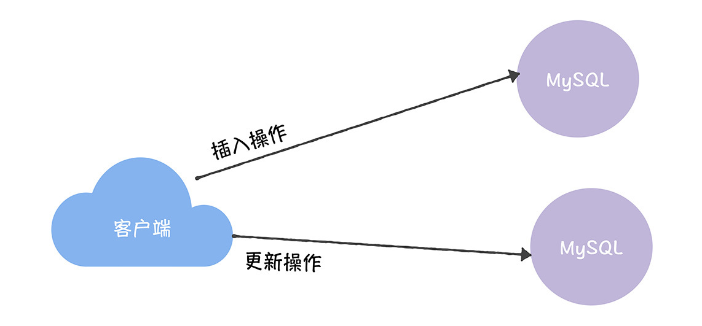
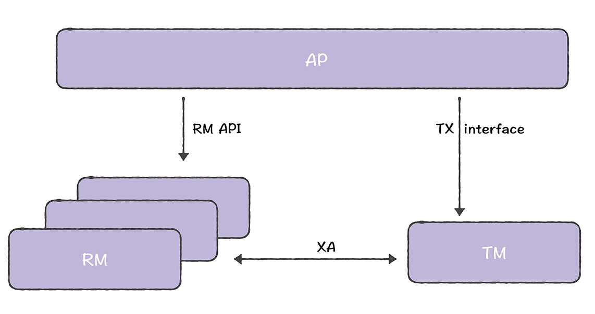
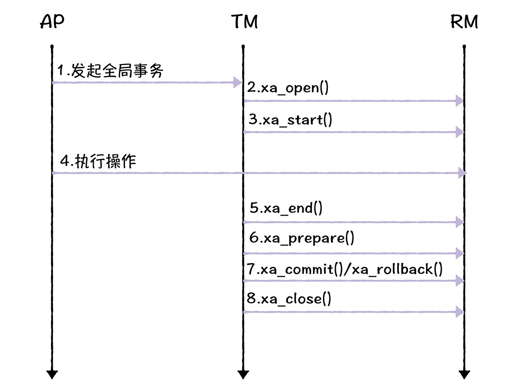
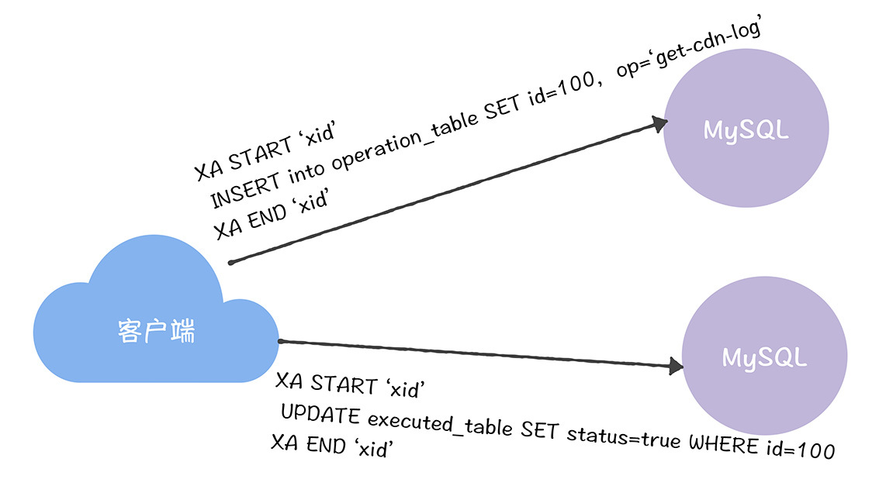
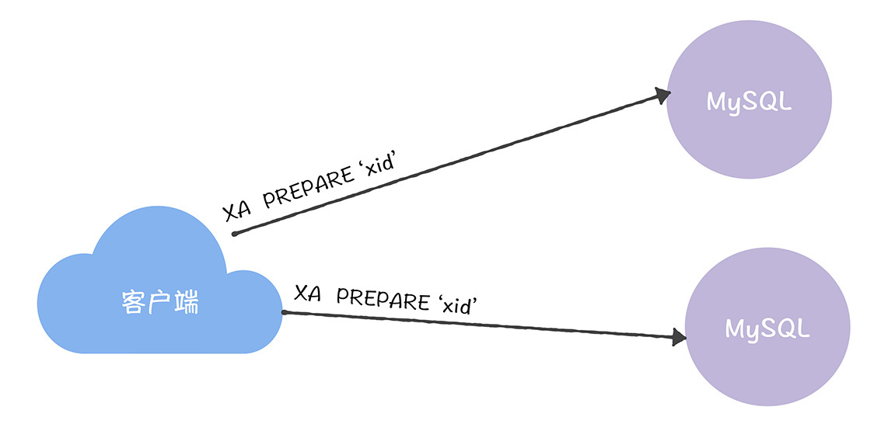
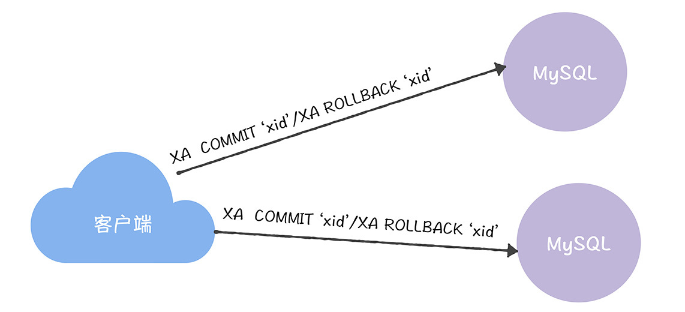

# 加餐 | MySQL XA是如何实现分布式事务的？
你好，我是韩健。

相信很多同学都知道MySQL支持单机事务，那么在分布式系统中，涉及多个节点，MySQL又是怎么实现分布式事务的呢？

这个和我最近遇到的问题很类似，我现在负责的一个业务系统，需要接收来自外部的指令，然后访问多个内部其他系统来执行指令，但执行完指令后，我需要同时更新多个内部MySQL数据库中的值（比如MySQL数据库A、B、C）。

但又因为业务敏感，系统必须处于一个一致性状态（也就是说，MySQL数据库A、B、C中的值要么同时更新成功，要么全部不更新）。不然的话，会出现有的系统显示指令执行成功了，有的系统显示指令尚未被执行，导致多部门对指令执行结果理解混乱。

那么我当时是如何实现多个MySQL数据库更新的一致性呢？答案就是采用MySQL XA。

在我看来，MySQL通过支持XA规范的二阶段提交协议，不仅实现了多个MySQL数据库操作的事务，还能实现MySQL、Oracle、SQL Server等支持XA规范的数据库操作的事务。

对你来说，理解MySQL XA，不仅能理解数据层分布式事务的原理，还能在实际系统中更加深刻的理解二阶段提交协议，这样一来，当你在实际工作中，遇到多个MySQL数据库的事务需求时，就知道如何通过MySQL XA来处理了。

老规矩，咱们先来看一道思考题。

假设两个数据库A、B（位于不同的服务器节点上），我们需要实现多个数据库更新（比如，UPDATE executed\_table SET status = true WHERE id=100）和插入操作（比如，INSERT into operation\_table SET id = 100, op = ‘get-cdn-log’）的事务，那么在MySQL中如何实现呢？

带着这个问题，我们进入今天的学习。不过因为MySQL通过XA规范实现分布式事务的，所以你有必要先来了解一下XA规范。

## 什么是XA？

提到XA规范，就不得不说DTP模型（ Distributed Transaction Processing），因为XA规范约定的是DTP模型中2个模块（事务管理器和资源管理器）的通讯方式，那DTP，就是分布式事务处理，就像下图的样子：

为了帮助你更好的理解DTP模型，我来解释一下DTP各模块的作用。

- AP：应用程序（Aplication Program），一般指事务的发起者（比如数据库客户端或者访问数据库的程序），定义事务对应的操作（比如更新操作UPDATE executed\_table SET status = true WHERE id=100）。
- RM：资源管理器（Resource Manager），管理共享资源，并提供访问接口，供外部程序来访问共享资源，比如数据库，另外RM还应该具有事务提交或回滚的能力。
- TM：事务管理器（Transaction Manager），TM是分布式事务的协调者。TM与每个RM进行通信，协调并完成事务的处理。

你是不是觉得这个架构看起来很复杂？其实在我看来，你可以这么理解这个架构：应用程序访问、使用资源管理器的资源，并通过事务管理器的事务接口（TX interface）定义需要执行的事务操作，然后事务管理器和资源管理器会基于XA规范，执行二阶段提交协议。

那么，XA规范是什么样子的呢？它约定了事务管理器和资源管理器之间双向通讯的接口规范，并实现了二阶段提交协议：

为了帮你更好地理解这个过程，咱们一起走下流程，加深下印象：

1. AP（应用程序）联系TM（事务管理器）发起全局事务；
2. TM调用ax\_open()建立与资源管理器的会话；
3. TM调用xa\_start()标记事务分支（Transaction branch）的开头；
4. AP访问RM（资源管理器），并定义具体事务分支的操作，比如更新一条数据记录（UPDATE executed\_table SET status = true WHERE id=100）和插入一条数据记录（INSERT into operation\_table SET id = 100, op = ‘get-cdn-log’）；
5. TM调用xa\_end()标记事务分支的结尾；
6. TM调用xa\_prepare()通知RM做好事务分支提交的准备工作，比如锁定相关资源，也就是执行二阶段提交协议的提交请求阶段；
7. TM调用xa\_commit()通知RM提交事务分支（xa\_rollback()通知RM回滚事务），也就是执行二阶段提交协议的提交执行阶段；
8. TM调用xa\_close()关闭与RM的会话。

整个过程，也许有些复杂，不过你可以这么理解： **xa\_start()和xa\_end()在准备和标记事务分支的内容，然后调用xa\_prepare()和xa\_commit()（或者xa\_rollback()）执行二阶段提交协议，实现操作的原子性。** 在这里需要你注意的是，这些接口需要按照一定顺序执行，比如xa\_start()必须要在xa\_end()之前执行。

另外我想说的是，事务管理器对资源管理器调用的xa\_start()和xa\_end()这对组合，一般用于标记事务分支（就像上面的更新一条数据记录和插入一条数据记录）的开头和结尾。在这里，你需要注意的是：

- 对于同一个资源管理器，根据全局事务的要求，可以前后执行多个操作组合，比如，先标记一个插入操作，然后再标记一个更新操作。
- 事务管理器只是标记事务，并不执行事务，最终是由应用程序通知资源管理器来执行事务操作的。

另外，XA规范还约定了如何向事务管理器注册和取消资源管理器的API接口（也就是ax\_reg()和ax\_unreg()接口）。在这里需要你注意的是，这两个接口是ax\_开头的，而不是像xa\_start()那样是xa\_开头的，这是很容易误解的点，我希望你能注意到。

那么讲了这么多，我们该如何通过MySQL XA实现分布式事务呢？

## 如何通过MySQL XA实现分布式事务呢？

首先，你需要创建一个唯一的事务ID（比如xid），来唯一标识事务，并调用“XA START”和“XA END”来定义事务分支对应的操作（比如INSERT into operation\_table SET id = 100, op = ‘get-cdn-log’）。

接着，你需要执行“XA PREPARE”命令，来执行二阶段提交协议的提交请求阶段。

最后，你需要调用“XA COMMIT”来提交事务（或者“XA ROLLBACK”回滚事务）。这样你就实现了全局事务的一致性了。

从上面的流程中，你可以看到，客户端在扮演事务管理器的角色，而MySQL数据库就在扮演资源管理器的角色。另外，你要注意，上面流程中的xid必须是唯一值。

另外，我想补充的是，如果你要开启MySQL的XA功能，必须设置存储引擎为 InnoDB，也就是说，在MySQL中，只有InnoDB引擎支持XA规范。

当然了，可能有些同学对MySQL XA有这样的疑问，能否将“XA END”和“XA PREPARE”合并到一起呢？ **答案是不能，因为在“XA END”之后，是可以直接执行“XA COMMIT”的，也就是一阶段提交（比如当共享资源变更只涉及到一个RM时）。**

最后，我强调一下，MySQL XA性能不高，适合在并发性能要求不高的场景中使用，而我之所以需要采用MySQL XA实现分布式事务，不仅因为整个系统对并发性能要求不高，还因为底层架构是多个第三方的，没法改造。

## 内容小结

本节课我主要带你了解了XA规范，以及如何使用MySQL XA实现分布式事务。我希望你明确这样几个重点。

1.XA规范是个标准的规范，也就是说，无论是否是相同的数据库，只要这些数据库（比如MySQL、Oracle、SQL Server）支持XA规范，那么它们就能实现分布式事务，也就是能保证全局事务的一致性。

2.相比商业数据库对XA规范的支持，MySQL XA性能不高，所以，我不推荐你在高并发的性能至上场景中，使用MySQL XA。

3.在实际开发中，为了降低单点压力，通常会根据业务情况进行分表分库，将表分布在不同的库中，那么，在这种情况下，如果后续需要保证全局事务的一致性时，也需要实现分布式事务。

最后我想说的是，尽管XA规范保证了全局事务的一致性，实现成本较低，而且包括MySQL在内的主流数据库都已经支持，但因为XA规范是基于二阶段提交协议实现的，所以它也存在二阶段提交协议的局限，比如：

首先，XA规范存在单点问题，也就是说，因为事务管理器在整个流程中扮演的角色很关键，如果其宕机，比如在第一阶段已经完成了，在第二阶段正准备提交的时候，事务管理器宕机了，相关的资源会被锁定，无法访问。

其次，XA规范存在资源锁定的问题，也就是说，在进入准备阶段后，资源管理器中的资源将处于锁定状态，直到提交完成或者回滚完成。

不过，虽然MySQL XA能实现数据层的分布式事务，但在我现在负责的这套业务系统中，还面临这样的问题：那就是在接收到外部的指令后，我需要访问多个内部系统，执行指令约定的操作，而且，我必须保证指令执行的原子性，也就是说，要么全部成功，要么全部失败，那么我应该怎么做呢？答案是TCC，这也是我在下一讲想和你聊一聊的。

## 课堂思考

既然我提到了我通过MySQL XA解决了数据库操作的一致性问题，而MySQL XA性能不高，适用于对并发性能要求不高的场景中。那么你不妨想想，在MySQL XA不能满足并发需求时，如何重新设计底层数据系统，来避免采用分布式事务呢？为什么呢？欢迎在留言区分享你的看法，与我一同讨论。

最后，感谢你的阅读，如果这节课让你有所收获，也欢迎你将它分享给更多的朋友。