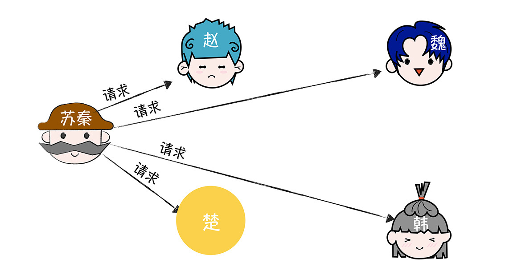
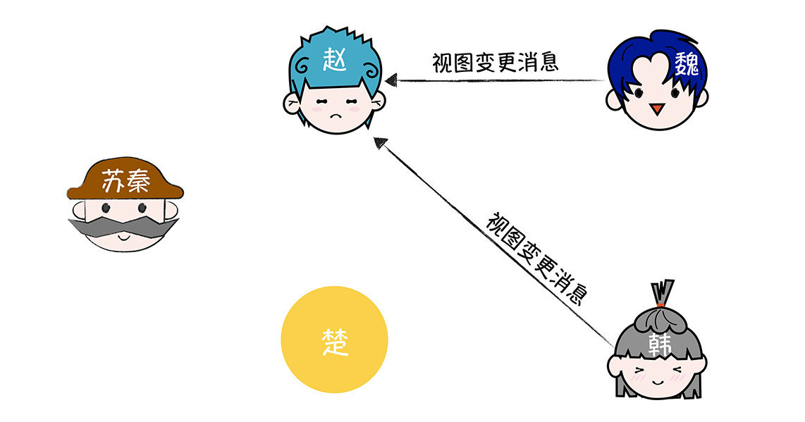
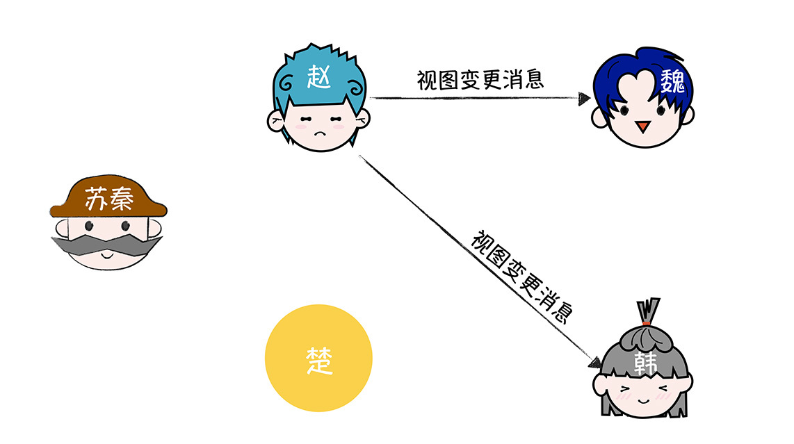

# 加餐 | PBFT算法：如何替换作恶的领导者？
你好，我是韩健。

上一讲，我们了解到，PBFT可以防止备份节点作恶，因为这个算法是主节点和备份节点组成的，那你想象一下，如果主节点作恶（比如主节点接收到了客户端的请求，但就是默不作声，不执行三阶段协议），这时无论正常节点数有多少，备份节点肯定没办法达成共识，整个集群都没办法正常运行。这么大的问题，你该怎么解决呢？

答案是视图变更（View Change），也就是通过领导者选举，选举出新的主节点，并替换掉作恶的主节点。（其中的“视图”你可以理解为领导者任期的，不同的视图值对应不同的主节点。比如，视图值为1时，主节点为A；视图值为2时，主节点为B。）

对于领导者模型算法而言，不管是非拜占庭容错算法（比如Raft），还是拜占庭容错算法（比如PBFT），领导者选举都是它们实现容错能力非常重要的一环。比如，对Raft而言，领导者选举实现了领导者节点的容错能力，避免了因领导者节点故障导致整个集群不可用。而对PBFT而言，视图变更，除了能解决主节点故障导致的集群不可用之外，还能解决主节点是恶意节点的问题。

对你来说，理解视图变更，可以理解拜占庭容错算法如何处理领导者故障和作恶。这样一样，从07讲到13讲（非拜占庭容错场景到拜占庭容错场景），你就能更全面地理解领导者选举的原理，和能解决的问题了，这样当你后续熟悉其他领导者选举算法，或设计自己的领导者选举算法时，也能更加的得心应手了。

既然领导者选举这么重要，那么PBFT到底是如何实现视图变更的呢？带着这样的疑问，我们进入今天的内容。

## 主节点作恶会出现什么问题？

在PBFT中，主节点作恶有这么几种情况，比如：

- 我开篇提到的，主节点接收到客户端请求后，它不做任何处理，也就是默不作声；
- 主节点接收到客户端请求后，给不同的预准备请求分配不同的序号；
- 再或者，主节点只给部分节点发送预准备消息。

需要你注意的是，不管出现哪种情况，共识都是无法达成的，也就是说， **如果恶意节点当选了主节点，此时无论忠诚节点数多少，忠诚节点们将都无法达成共识。**

而这种情况肯定是无法接受的，这就需要我们在发现主节点可能在作恶时，设计一个机制，将作恶的主节点替换掉，并保证最终只有忠诚的节点在担任主节点。这样，PFBT才能保证当节点数为3f + 1（其中f为恶意节点数）时，忠诚的节点们能就客户端提议的指令达成共识，并执行一致的指令。

那么，在PBFT中，视图变更是如何选举出新的主节点，并替换掉作恶的主节点的呢？答案你肯定知道了，那就是视图变更。

## 如何替换作恶的主节点？

在我看来，视图变更是保证PBFT算法能稳定运行的关键，当系统运行异常时，客户端或备份节点触发系统的视图变更，通过“轮流上岗”的方式： **(v + 1) mod \|R\|，其中v为当前视图的值，\|R\|为节点数** 选出下一个视图的主节点，最终选出一个忠诚、稳定运行新主节点，并保证了共识的达成。

为了帮你更好地理解视图变更的原理，我继续以苏秦为例（这次，咱们把叛将楚当作是“大元帅”，让它扮演主节点的角色）。

首先，苏秦联系楚，向楚发送包含作战指令“进攻”的请求。

当楚接收到苏秦的请求之后，为了达到破坏作战计划的目的，它默不作声，内心想：我就是不执行三阶段协议（Three-phase protocol），不执行你的指令，也不通知其他将军执行你的指令，你能把我怎么办？

结果，苏秦等到花都谢了，还是没办法接收到2个相同的响应（Reply）消息。都过了约定的时间了，苏秦在想，也许各位将军们出什么问题了。

这时苏秦会直接给各位将军发送作战指令。

当赵、魏、韩接收到来自的苏秦的作战指令时，它们会将作战指令分别发送给楚，并等待一段时间，如果在这段时间内，仍未接收到来自楚的预准备消息，那么它们就认为楚可能已经叛变了，就发起视图变更（采用“轮流上岗”的方式选出新的大元帅，比如赵），并向集群所有节点发送视图变更消息（view-change message）。

当赵接收到2个视图变更消息后，它就发送新视图消息（new-view message）给其他将军，告诉大家，我是大元帅了。

当其他将军接收到新视图消息后，就认为选出了新的大元帅。然后，忠诚的将军们就可以一致地执行来自苏秦的作战指令了。

你看，叛变的大元帅，就这样被发现和替换掉了，而最终大元帅一定是忠诚的。

回到计算机的世界中，如何理解呢？与13讲一样，在这里我就不啰嗦了。不过为了帮你更全面地理解视图变更，我想补充几点：

首先，当一个备份节点，在定时器超时触发了视图变更后，它将暂时停止接收和处理，除了检查点（CHECKPOINT） 、视图变更、新视图之外的消息。你可以这么理解，这个节点认为现在集群处于异常状态，不能再处理客户端请求相关的消息了。

其次，除了演示中的情况，会触发备份节点进行视图变更，下面几种情况也会触发视图变更，比如：

- 备份节点发送了准备消息后，在约定的时间内未接收到来自其他节点的2f个相同的准备消息。
- 备份节点发送了提交消息后，在约定的时间内未接收到来自其他节点的2f个相同的提交消息。
- 备份节点接收到异常消息，比如视图值、序号和已接受的消息相同，但内容摘要不同。

也就是说，视图变更除了能解决主节点故障和作恶的问题，还能避免备份节点长时间阻塞等待客户端请求被执行。

最后，需要你注意的是，了解Raft的同学应该知道，领导者的选举和日志提交，都是由集群的节点来完成的。但在PBFT中，客户端参与了拜占庭容错的实现，比如，客户端实现定时器，等待接收来自备份节点的响应，并且如果等待超时，发送请求给所有节点，我希望你能注意到这点。

## 内容小结

本节课我主要带你了解了PBFT是如何替换作恶的领导者的。我希望你明确这样几个重点。

1.客户端通过等待f+1个相同响应消息超时，来发现主节点可能在作恶，此时客户端发送客户端请求给所有集群节点，从而触发可能的视图变更。

2.与Raft在领导者选举期间服务不可用类似，在视图变更时，PBFT集群也是无法提供服务的。

因为本讲是PBFT算法的最后一讲，所以我想多说几句。

首先，在一般情况下，每个节点都需要持久化保存状态数据（比如准备消息），以便在后面使用。但随着系统运行，数据就会越来越多，最终肯定会出现存储空间不足的情况。那么，怎么解决这个问题？

答案是检查点（checkpoint）机制。PBFT实现了检查点，来定时清理节点本地缓存的但已经不再需要的历史数据（比如预准备消息、准备消息和提交消息），节省了本地的存储空间，并不会影响系统的运行。

其次，我们都知道基于数字签名的加解密，是非常消耗性能，这也是为什么在一些对加解密要求高的场景中，大家常直接在硬件中实现加解密，比如IPSEC VPN。如果在PBFT中，所有消息都是签名消息，那么肯定非常消耗性能，会极大制约PBFT算法的落地场景。那么，有什么办法优化这个问题呢？

答案是将数字签名和消息验证码（MAC）混合着使用。具体来说就是，在PBFT中，只有视图变更消息和新视图消息采用了签名消息，其他消息采用的是消息验证码，这样一来，就节省了大量的加解密的性能开销。

最后，PBFT是一个能在实际场景中落地的拜占庭容错算法，它和区块链也结合紧密，具体来说的话，有这么几种应用。

- 相对可信、有许可限制的联盟链，比如Hyperledger Sawtooth。
- 与其他拜占庭容错算法结合起来，落地公有链。比如Zilliqa，将POW算法和PBFT结合起来，实现公有链的共识协商。具体来说，POW算法作为认证，证明节点不是“坏人”，PBFT来实现共识。针对PBFT消息数过多、不适应大型分布式系统的痛点，Zilliqa实现了分片（Sharding）技术。

另外，也有团队因为PBFT消息数过多、不适应大型分布式系统的痛点，放弃使用PBFT，通过法律来约束“节点作恶”的行为，比如IBM的Hyperledger Fabric。那么我想说的是，技术是发展的，适合的才是最好的，所以，我建议你根据场景的可信度，来决定是否采用PBFT算法，是否改进和优化PBFT算法。

## 课堂思考

既然我提到在PBFT中，PBFT是通过视图变更来选举出新的主节点的。那么你不妨想想，集群是在视图变更时，能否继续处理来自客户端的写请求呢？为什么呢？欢迎在留言区分享你的看法，与我一同讨论。

最后，感谢你的阅读，如果这节课让你有所收获，也欢迎你将它分享给更多的朋友。