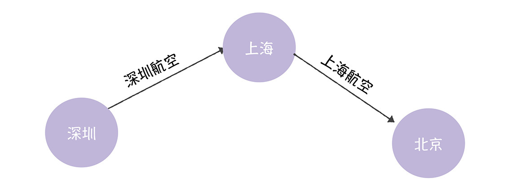
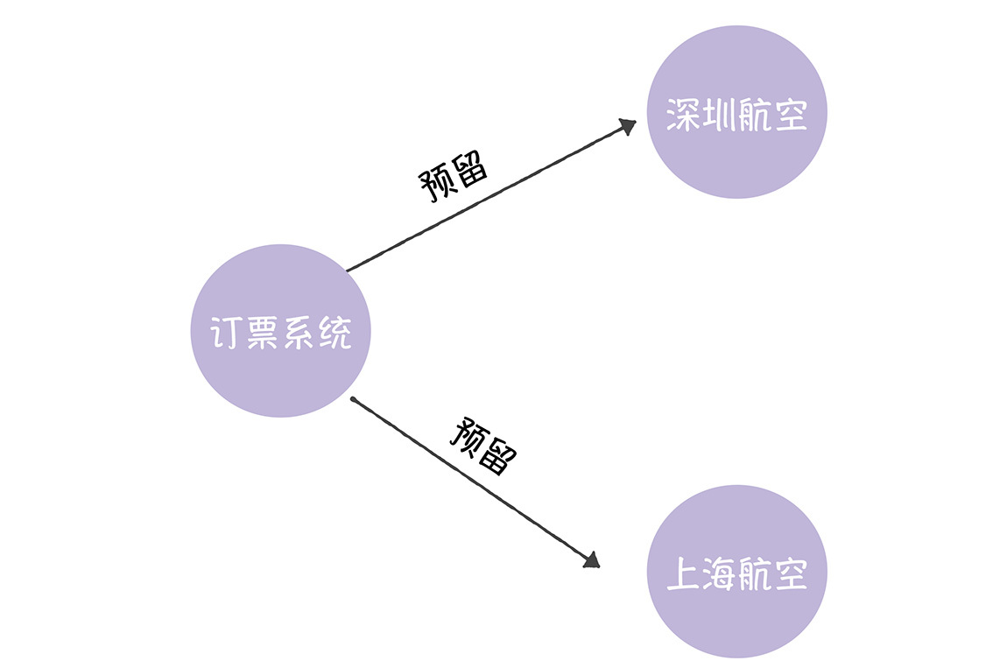
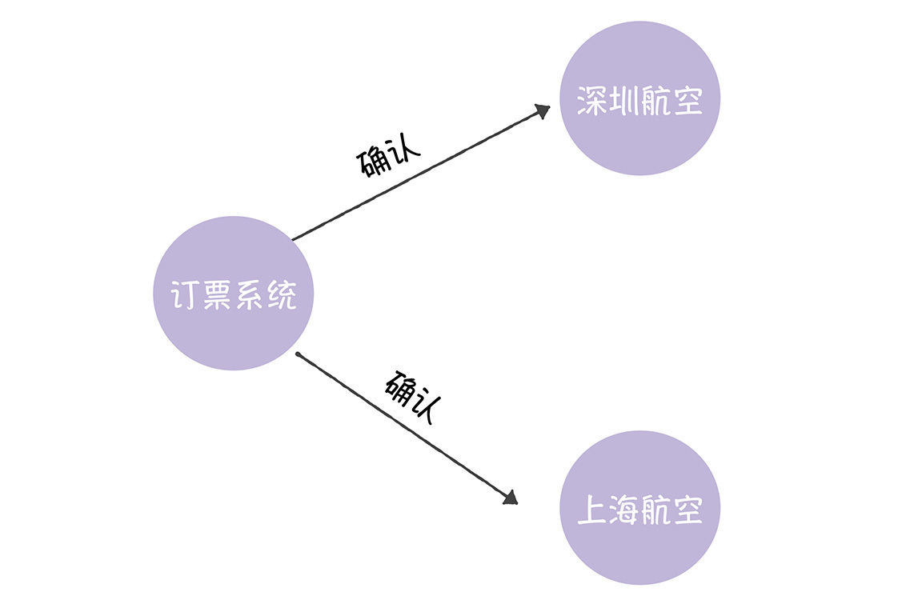
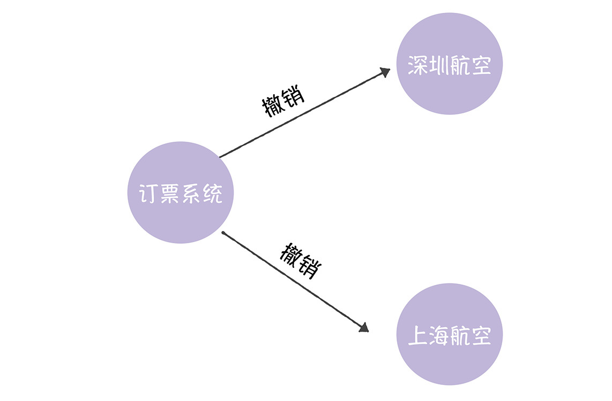
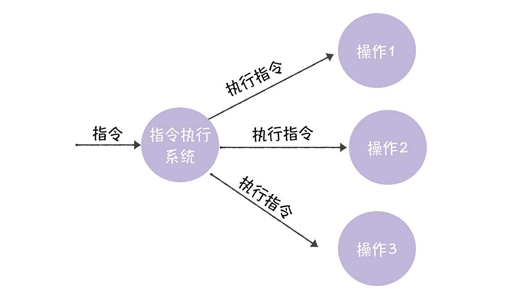
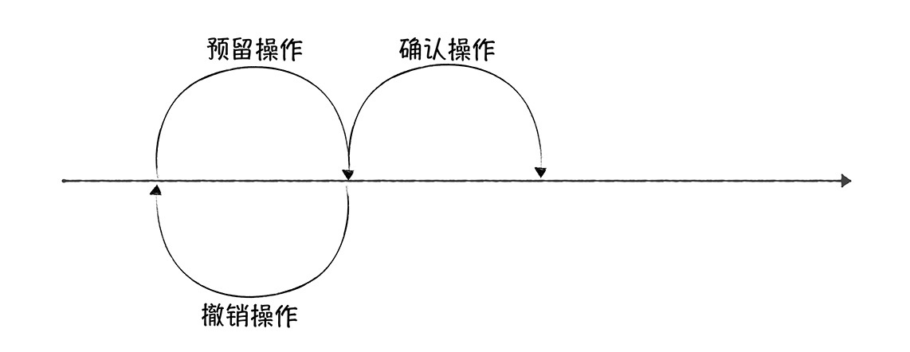

# 加餐 | TCC如何实现指令执行的原子性？
你好，我是韩健。

在上一讲我提到，虽然MySQL XA能实现数据层的分布式事务，解决多个MySQL操作的事务问题，但我现在负责的这套业务系统还面临别的问题：在接收到外部的指令后，我需要访问多个内部系统，执行指令约定的操作，而且，还必须保证指令执行的原子性（也就是事务要么全部成功，要么全部失败）。

那么我是如何实现指令执行的原子性呢？答案是TCC。

在我看来，上一讲中，基于二阶段提交协议的XA规范，实现的是数据层面操作的事务，而TCC能实现业务层面操作的事务。

对你来说，理解了二阶段提交协议和TCC后，你可以从数据层面到业务层面，更加全面理解如何实现分布式事务了，这样一来，当你在日常工作中，需要实现操作的原子性或者系统状态的一致性时，就知道该如何处理了。

那么为了帮助你更好地理解TCC，咱们还是先来看一道思考题。

我以如何实现订票系统为例，假设现在要实现一个企鹅订票系统，给内部员工提供机票订购服务，但在实现订票系统时，我们需要考虑这样的情况：

我想从深圳飞北京，但这时没有直达的机票，要先定深圳航空的航班，从深圳去上海，然后再定上海航空的航班，从上海去北京。

因为我的目的地是北京，所以如果只有一张机票订购成功，肯定是不行的，这个系统必须保障2个订票操作的事务要么全部成功，要么全部不成功。那么该如何实现2个订票操作的事务呢？

带着这个问题，我们进入今天的学习，先来了解一下什么是TCC。

## 什么是TCC？

在 [04讲](https://time.geekbang.org/column/article/200717)，我们介绍了TCC，你如果对TCC不熟悉，或者忘记了，那么可以回过头复习一下。在这里，我只想补充一点，那就是：你可以对比二阶段提交协议来理解，TCC包含的预留、确认或撤销这 2 个阶段，比如：

- Try是指预留，它和二阶段提交协议中，提交请求阶段的操作类似，具体来说就是，系统会将需要确认的资源预留、锁定，确保确认操作一定能执行成功。

- Confirm是指确认，它呢和二阶段提交协议中，提交执行阶段的操作类似，具体是指，系统将最终执行的操作。

- Cancel是指撤销，比较像二阶段提交协议中的回滚操作，具体指系统将撤销之前预留的资源，也就是撤销已执行的预留操作对系统产生的影响。

在我看来，二阶段提交协议和TCC的目标，都是为了实现分布式事务，这也就决定了它们“英雄所见略同”，在思想上是类似的，但我再次强调一下，这两个算法解决的问题场景是不同的，一个是数据层面，一个是业务层面，这就决定了它们在细节实现是不同的。所以接下来，我们就一起看看TCC的细节。

为了更好地演示TCC的原理，我们假设深圳航空、上海航空分别为订票系统提供了以下3个接口：机票预留接口、确认接口和撤销接口。

那么这时，订票系统可以这样来实现操作的事务：

首先，订票系统调用2个航空公司的机票预留接口，向2个航空公司申请机票预留。

如果两个机票都预留成功，那么订票系统将执行确认操作，也就是订购机票。

但如果此时有机票没有预留成功（比如深圳航空的从深圳到上海的机票），那这时该怎么办呢？这时订票系统就需要通过撤销接口来撤销订票请求。

你看这样，我们就实现了订票操作的事务了。TCC是不是也很容易理解呢？答案是肯定的，那它难在哪儿呢？

在我看来，TCC的难点不在于理解TCC的原理，而在于如何根据实际场景特点来实现预留、确认、撤销三个操作。所以，为帮助你更深刻的理解TCC三操作的实现要点，我将以一个实际项目具体说一说。

## 如何通过TCC指令执行的原子性？

我在一开始提到，当我接收到外部指令时，需要实现操作1、2、3，其中任何一个操作失败，我都需要暂停指令执行，将系统恢复到操作未执行状态，然后再重试。

其中，操作1、2、3的含义具体如下。

- 操作1：生成指定URL页面对应的图片，并持久化存储。
- 操作2：调用内部系统1的接口，禁用指定域名的访问权限。
- 操作3：通过MySQL XA更新多个数据库的数据记录。

那么我是如何使用TCC来解决这个问题的呢？答案是我在实现每个操作时，都会分别实现相应的预留、确认、撤销三操作。

首先，因为操作1是生成指定URL页面对应的图片，我是这么实现TCC三操作的。

- 预留操作：生成指定页面的图片，并存储到本地。
- 确认操作：更新操作1状态为完成。
- 撤销操作：删除本地存储的图片。

其次，因为操作2是调用内部系统1的接口，禁用该域名的访问权限，那么，我是这么实现TCC三操作的。

- 预留操作：调用的内部系统1的禁用指定域名的预留接口。这时我们先通知系统1预留相关的资源。
- 确认操作：调用的内部系统1的禁用指定域名的确认接口。我们执行禁用域名的操作，这时，禁用域名的操作的生效了。
- 撤销操作：调用的内部系统1的禁用指定域名的撤销接口。我们撤销对该域名的禁用，并通知内部系统1释放相关的预留资源。

最后，操作3是通过MySQL XA更改多个MySQL数据库中的数据记录，并实现数据更新的事务。我是这么实现TCC三操作的：

- 预留操作：执行XA START和XA END准备好事务分支操作，并调用XA PREPARE，执行二阶段提交协议的提交请求阶段，预留相关资源。
- 确认操作：调用XA COMMIT执行确认操作。
- 撤销操作：调用XA ROLLBACK执行回滚操作，释放在Try阶段预留的资源。

在这里，你可以看到，确认操作是预留操作的下一个操作，而撤销操作则是用来撤销已执行的预留操作对系统产生的影响，类似在复制粘贴时，我们通过“Ctrl Z”撤销“Ctrl V”操作的执行，就像下图的样子。而这是理解TCC的关键，我希望你能注意到。

这样一来，在操作1、2、3的预留操作执行结束，如果预留操作都执行成功了，那么我将执行确认操作，继续向下执行。但如果预留操作只是部分执行成功，那么我将执行撤销操作，取消预留操作执行对系统产生的影响。通过这种方式（指令对应的操作要么全部执行，要么全部不执行），我就能实现指令执行的原子性了。

另外，在实现确认、撤销操作时，有一点需要我们尤为注意，因为这两个操作在执行时可能会重试，所以，它们需要支持幂等性。

## 内容小结

本节课我主要带你了解了TCC，以及如何使用TCC实现分布式事务。我希望你明确这样几个重点。

1.TCC是个业务层面的分布式事务协议，而XA规范是数据层面的分布式事务协议，这也是TCC和XA规范最大的区别。

2.TCC与业务耦合紧密，在实际场景使用时，需要我们根据场景特点和业务逻辑来设计相应的预留、确认、撤销操作，相比MySQL XA，有一定的编程开发工作量。

3.本质上而言，TCC是一种设计模式，也就是一种理念，它没有与任何技术（或实现）耦合，也不受限于任何技术，对所有的技术方案都是适用的。

最后，我想补充的是，因为TCC是在业务代码中编码实现的，所以，TCC可以跨数据库、跨业务系统实现资源管理，满足复杂业务场景下的事务需求，比如，TCC可以将对不同的数据库、不同业务系统的多个操作通过编码方式，转换为一个原子操作，实现事务。

另外，因为TCC 的每一个操作对于数据库来讲，都是一个本地数据库事务，那么当操作结束时，本地数据库事务的执行也就完成了，所以相关的数据库资源也就被释放了，这就能避免数据库层面的二阶段提交协议长时间锁定资源，导致系统性能低下的问题。

## 课堂思考

我提到了自己通过TCC解决了指令执行的原子性问题。那么你不妨想想，为什么TCC能解决指令执行的原子性问题呢？欢迎在留言区分享你的看法，与我一同讨论。

最后，感谢你的阅读，如果这节课让你有所收获，也欢迎你将它分享给更多的朋友。