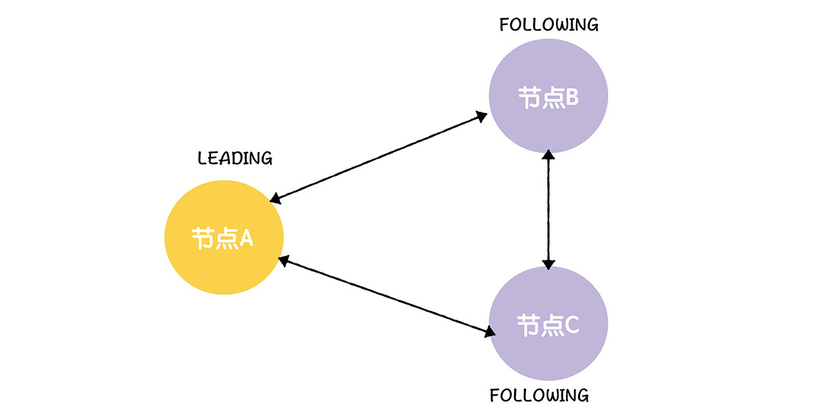
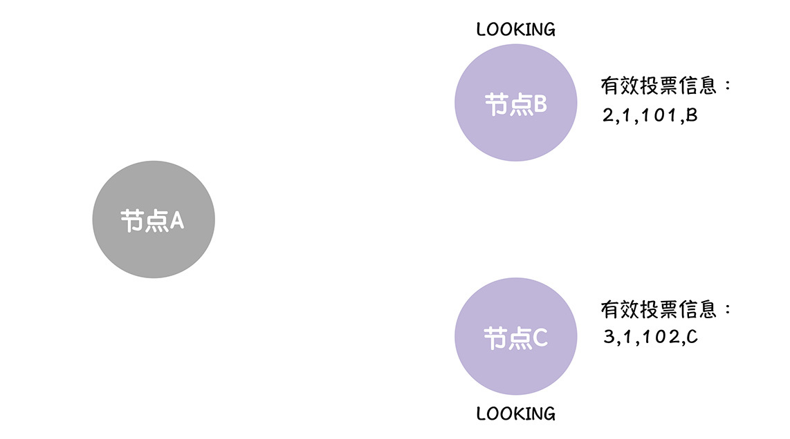
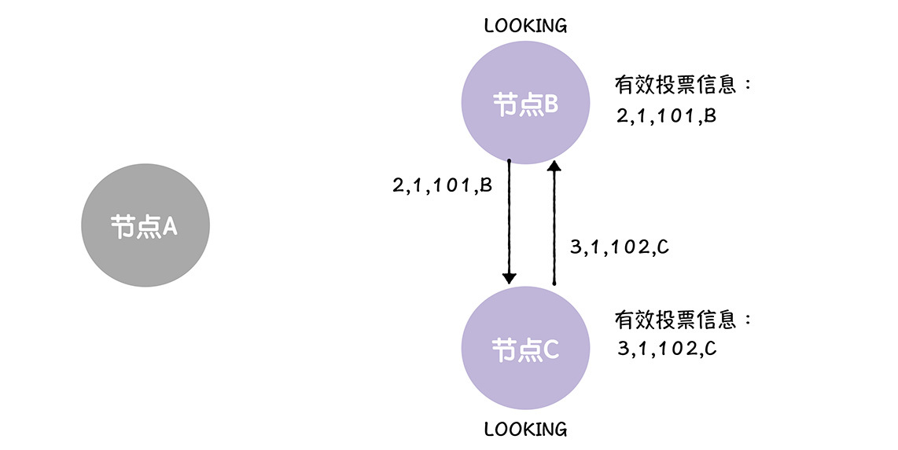
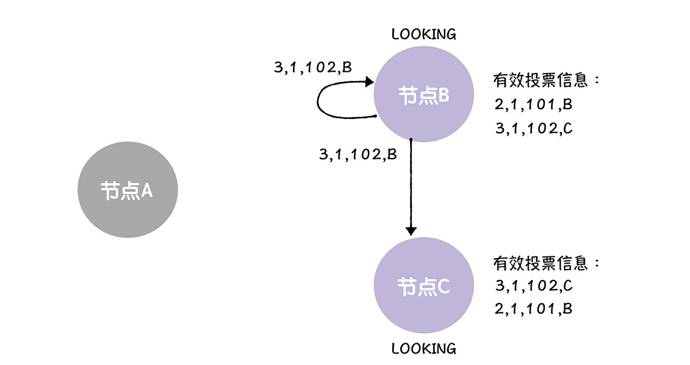
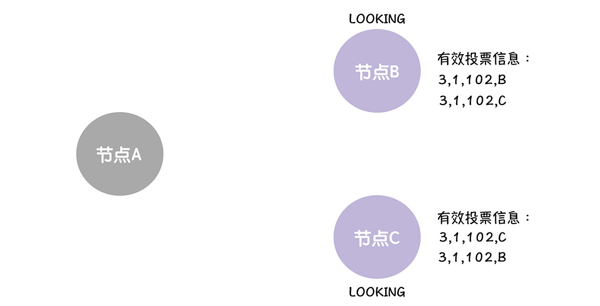
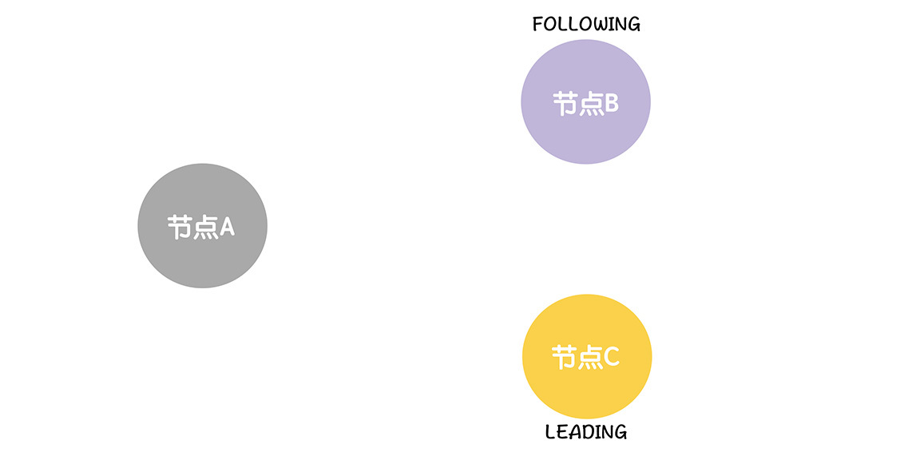
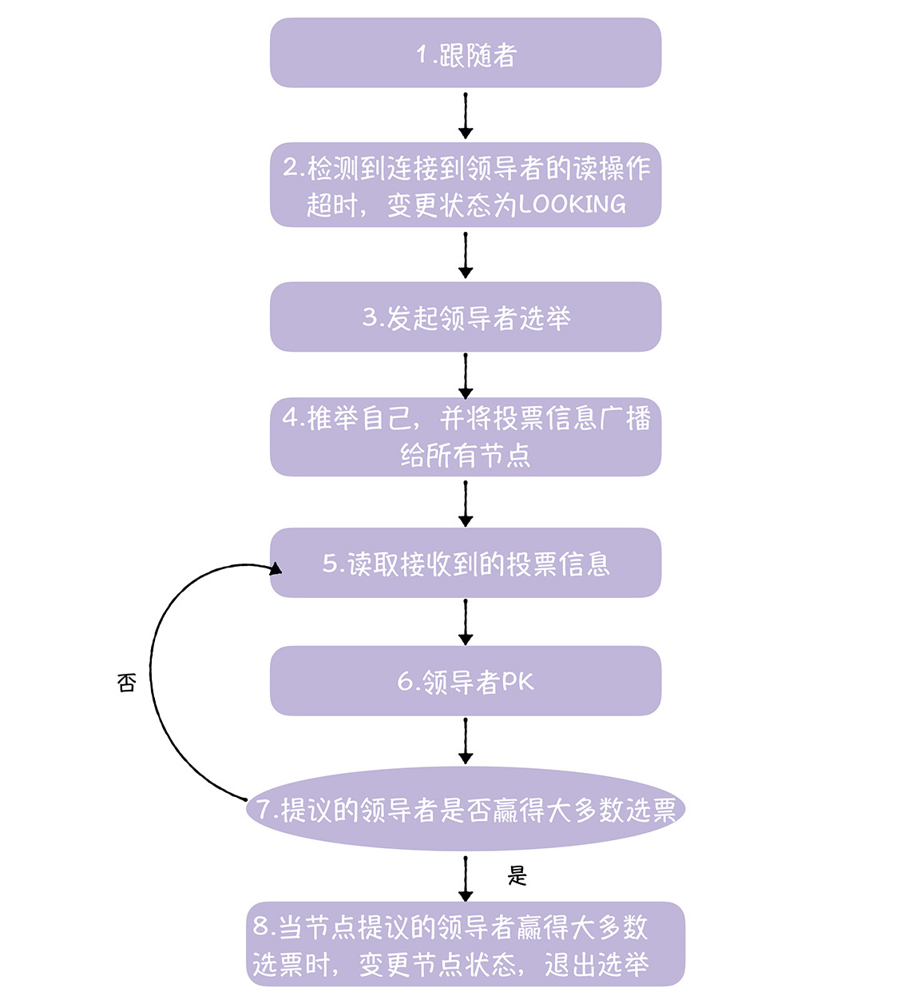

# 加餐 | ZAB协议（一）：主节点崩溃了，怎么办？
你好，我是韩健。

咱们都知道，系统在运行中，不可避免会出现各种各样的问题，比如进程崩溃了、服务器死机了，这些问题会导致很严重的后果，让系统没办法运行。学完了15讲后，你应该还记得，在ZAB中，写请求是必须在主节点上处理的，而且提案的广播和提交，也是由主节点来完成的。既然主节点那么重要，如果它突然崩溃宕机了，该怎么办呢？

答案是选举出新的领导者（也就是新的主节点）。

在我看来，领导者选举，关乎着节点故障容错能力和集群可用性，是ZAB协议非常核心的设计之一。你想象一下，如果没有领导者选举，主节点故障了，整个集群都无法写入了，这将是极其严重的灾难性故障。

而对你来说，理解领导者选举（也就是快速领导者选举，Fast Leader Election），能更加深刻地理解ZAB协议，并在日常工作中，游刃有余地处理集群的可用性问题。比如如果写请求持续失败，可以先排查下集群的节点状态。

既然领导者选举这么重要，那么ZAB是如何选举领导者的呢？带着这个问题，我们进入今天的学习。

## ZAB如何选举领导者？

既然要选举领导者，那就涉及成员身份变更，那么在ZAB中，支持哪些成员身份呢？

### 有哪些成员身份？

ZAB支持3种成员身份（领导者、跟随者、观察者）。

- 领导者（Leader）： 作为主（Primary）节点，在同一时间集群只会有一个领导者。需要你注意的是，所有的写请求都必须在领导者节点上执行。

- 跟随者（Follower）：作为备份（Backup）节点， 集群可以有多个跟随者，它们会响应领导者的心跳，并参与领导者选举和提案提交的投票。需要你注意的是，跟随者可以直接处理并响应来自客户端的读请求，但对于写请求，跟随者需要将它转发给领导者处理。

- 观察者（Observer）：作为备份（Backup）节点，类似跟随者，但是没有投票权，也就是说，观察者不参与领导者选举和提案提交的投票。你可以对比着Paxos中的学习者来理解。


需要你注意的是，虽然ZAB支持3种成员身份，但是它定义了4种成员状态。

- LOOKING：选举状态，该状态下的节点认为当前集群中没有领导者，会发起领导者选举。
- FOLLOWING ：跟随者状态，意味着当前节点是跟随者。
- LEADING ：领导者状态，意味着当前节点是领导者。
- OBSERVING： 观察者状态，意味着当前节点是观察者。

为什么多了一种成员状态呢？这是因为ZAB支持领导者选举，在选举过程中，涉及了一个过渡状态（也就是选举状态）。

现在，你已经了解了成员身份，那么在ZAB中是如何变更成员身份，来选举领导者呢？接下来，我们就来看一下领导者的具体选举过程。

### 如何选举？

为了帮你更好地理解ZAB的领导者选举，我举个例子演示一下，为了演示方便和更容易理解（我们聚焦最核心的领导者PK），假设投票信息的格式是<proposedLeader, proposedEpoch, proposedLastZxid，node>，其中：

- proposedLeader，节点提议的，领导者的集群ID，也就是在集群配置（比如myid配置文件）时指定的ID。
- proposedEpoch，节点提议的，领导者的任期编号。
- proposedLastZxid，节点提议的，领导者的事务标识符最大值（也就是最新提案的事务标识符）。
- node，投票的节点，比如节点B。

假设一个ZooKeeper集群，由节点A、B、C组成，其中节点A是领导者，节点B、C是跟随者（为了方便演示，假设epoch分别是1和1，lastZxid分别是101和102，集群ID分别为2和3）。那么如果节点A宕机了，会如何选举呢？



首先，当跟随者检测到连接领导者节点的读操作等待超时了，跟随者会变更节点状态，将自己的节点状态变更成LOOKING，然后发起领导者选举（为了演示方便，我们假设这时节点B、C都已经检测到了读操作超时）：


接着，每个节点会创建一张选票，这张选票是投给自己的，也就是说，节点B、C都“自告奋勇”推荐自己为领导者，并创建选票<2, 1, 101, B>和<3, 1, 102, C>，然后各自将选票发送给集群中所有节点，也就是说，B发送给B、C，C也发送给B、C。

一般而言，节点会先接收到自己发送给自己的选票（因为不需要跨节点通讯，传输更快），也就是说，B会先收到来自B的选票，C会先收到来自C的选票：


需要你注意的是，集群的各节点收到选票后，为了选举出数据最完整的节点，对于每一张接收到选票，节点都需要进行领导者PK，也就将选票提议的领导者和自己提议的领导者进行比较，找出更适合作为领导者的节点，约定的规则如下：

- 优先检查任期编号（Epoch），任期编号大的节点作为领导者；
- 如果任期编号相同，比较事务标识符的最大值，值大的节点作为领导者；
- 如果事务标识符的最大值相同，比较集群ID，集群ID大的节点作为领导者。

如果选票提议的领导者，比自己提议的领导者，更适合作为领导者，那么节点将调整选票内容，推荐选票提议的领导者作为领导者。

当节点B、C接收到的选票后，因为选票提议的领导者与自己提议的领导者相同，所以，领导者PK的结果，是不需要调整选票信息，那么节点B、C，正常接收和保存选票就可以了。



接着节点B、C分别接收到来自对方的选票，比如B接收到来自C的选票，C接收到来自B的选票：



对于C而言，它提议的领导者是C，而选票（<2, 1, 101, B>）提议的领导者是B，因为节点C的任期编号与节点B相同，但节点C的事务标识符的最大值比节点B的大，那么，按照约定的规则，相比节点B，节点C更适合作为领导者，也就是说，节点C不需要调整选票信息，正常接收和保存选票就可以了。

但对于对于节点B而言，它提议的领导者是B，选票（<3, 1, 102, C>）提议的领导者是C，因为节点C的任期编号与节点B相同，但节点C的事务标识符的最大值比节点B的大，那么，按照约定的规则，相比节点B，节点C应该作为领导者，所以，节点B除了接收和保存选票信息，还会更新自己的选票为<3, 1, 102, B>，也就是推荐C作为领导者，并将选票重新发送给节点B、C：



接着，当节点B、C接收到来自节点B，新的选票时，因为这张选票（<3, 1, 102, B>）提议的领导者，与他们提议的领导者是一样的，都是节点C，所以，他们正常接收和存储这张选票，就可以。



最后，因为此时节点B、C提议的领导者（节点C）赢得大多数选票了（2张选票），那么，节点B、C将根据投票结果，变更节点状态，并退出选举。比如，因为当选的领导者是节点C，那么节点B将变更状态为FOLLOWING，并退出选举，而节点C将变更状态为LEADING，并退出选举。



你看，这样我们就选举出新的领导者（节点C），这个选举的过程，很容易理解，我在这里只是假设了一种选举的情况，还会存在节点间事务标识符相同、节点在广播投票信息前接收到了其他节点的投票等情况，这里你可以思考一下，课下自己动手操作一下。

为了帮你在线下更好的阅读代码，自我学习，我想补充一下，逻辑时钟（logicclock）（也就是选举的轮次），会影响选票的有效性，具体来说，逻辑时钟大的节点不会接收来自值小的节点的投票信息。比如，节点A、B的逻辑时钟分别为1和2，那么，节点B将拒绝接收来自节点A的投票信息。

在这里，我想强调的是，领导者选举的目标，是从大多数节点中选举出数据最完整的节点，也就是大多数节点中，事务标识符值最大的节点。 **另外，ZAB本质上是通过“见贤思齐，相互推荐”的方式来选举领导者的。** 也就说，根据领导者PK，节点会重新推荐更合适的领导者，最终选举出了大多数节点中数据最完整的节点。

当然了，文字和代码是2种不同的表达，一些细节，仅仅通过文字是无法表达出来的，所以，为了帮你更通透地理解领导者选举的实现，接下来，我将以最新稳定版的 [ZooKeeper](https://downloads.apache.org/zookeeper/zookeeper-3.6.0/apache-zookeeper-3.6.0.tar.gz) 为例（也就是3.6.0），具体说一说代码的实现。

## ZooKeeper是如何实现的？

首先，我们来看看，在ZooKeeper中是如何实现成员身份的？

在ZooKeeper中，成员状态是在QuorumPeer.java中实现的，为枚举型变量，就像下面的样子。

```
public enum ServerState {
    LOOKING,
    FOLLOWING,
    LEADING,
    OBSERVING
}

```

其实，在ZooKeeper中，没有直接定义成员身份，而是用了对应的成员状态来表示，比如，处于FOLLOWING状态的节点为跟随者。

在这里，我想补充一点，如果你想研究相关成员的功能和实现，那么你可以把对应的成员状态作为切入点来研究，比如，你想研究领导者的功能实现，那么，你可以在代码中搜索LEADING关键字，然后研究相应的上下文逻辑，就能得到自己想要的答案了。

如果跟随者将自己的状态从跟随者状态变更为选举状态，这就表示跟随者在发起领导者选举，那么，在ZooKeeper中，领导者选举是如何实现的呢？

## 如何实现选举？

领导者选举，是在FastLeaderElection.lookForLeader()中实现的。我来讲一下核心的流程，大概的流程，就像下面的样子。



为帮助你更好的理解这个流程，我们来一起走读下核心代码，加深下印象。

1.在集群稳定运行时，处于跟随者状态的节点，在Follower.followLeader()函数中，周期性地读数据包和处理数据包：

```
QuorumPacket qp = new QuorumPacket();
while (this.isRunning()) {
    // 读取数据包
    readPacket(qp);
    // 处理数据包
    processPacket(qp);
}

```

2.当跟随者检测到连接到领导者的读操作超时了（比如领导者节点故障了），这时会抛出异常（Exception），跳出上面的读取数据包和处理数据包的循环，并最终跟随者将节点状态变更为选举状态。

```
public void run() {
    case FOLLOWING:
        ......
        finally {
            // 关闭跟随者节点
            follower.shutdown();
            setFollower(null);
            // 设置状态为选举状态
            updateServerState();
        }
        break;
    ......
}

```

3.当节点处于选举状态时，将调用makeLEStrategy().lookForLeader()函数（实际对应的函数为FastLeaderElection.lookForLeader()），发起领导者选举。

```
setCurrentVote(makeLEStrategy().lookForLeader());

```

4.在FastLeaderElection.lookForLeader()函数中，节点需要对逻辑时钟（也就是选举的轮次）的值执行加1操作，表示我们开启一轮的领导者选举，然后创建投票提案（默认推荐自己为领导者），并通知所有节点：

```
synchronized (this) {
  // 对逻辑时钟的值执行加一操作
  logicalclock.incrementAndGet();
  // 创建投票提案，并默认推荐自己为领导者
  updateProposal(getInitId(), getInitLastLoggedZxid(),
                 getPeerEpoch());
}
// 广播投票信息给所有节点
sendNotifications();

```

5.当节点处于选举状态时，会周期性地从队列中读取接收到的投票信息，直到选举成功。

```
while ((self.getPeerState() == ServerState.LOOKING) && (!stop)) {
   // 从队列中读取接收到的投票信息
   Notification n = recvqueue.poll(notTimeout, TimeUnit.MILLISECONDS);
   ......
}

```

6.当接收到新的投票信息时，节点会进行领导者PK，来判断谁更适合当领导者，如果投票信息中提议的节点比自己提议的节点，更适合当领导者，更新投票信息，推荐投票信息中提议的节点作为领导者，并广播给所有节点：

```
else if (totalOrderPredicate(n.leader, n.zxid, n.peerEpoch, proposedLeader, proposedZxid, proposedEpoch)) {
  // 投票信息中提议的节点比自己提议的节点更适合作为领导者，更新投票信息，并推荐投票信息中提议的节点
  updateProposal(n.leader, n.zxid, n.peerEpoch);
  // 将新的投票信息广播给所有节点
  sendNotifications();
}

```

7.如果自己提议的领导者赢得大多数选票，则执行步骤8，变更节点状态，退出选举；如果自己提议的领导者仍未赢得大多数选票，则执行步骤5，继续从接收队列中读取新的投票信息。

8.最后，当节点提议的领导者赢得大多数选票时，根据投票结果，判断当前节点的状态，领导者或跟随者，并变更节点状态，退出选举。

```
if (voteSet.hasAllQuorums()) {
  ......
    // 根据投票结果，判断并设置节点状态
    setPeerState(proposedLeader, voteSet);
    // 退出领导者选举
    Vote endVote = new Vote(proposedLeader, proposedZxid, logicalclock.get(), proposedEpoch);
    leaveInstance(endVote);
    return endVote;
  ......
}

```

需要你注意的是，在这里，我们只是演示一种选举情况，更多的情况，比如接收到来自逻辑时钟比当前节点小的节点的投票信息，再比如接收到来自领导者的投票信息，你可以在课下自己研究一下，遇到问题时，欢迎留言，咱们一起讨论。

## 内容小结

本节课我主要带你了解了ZAB是如何选举领导者的，以及在ZooKeeper中是如何实现的。我希望你明确这样几个重点。

1.领导者选举的目标，是选举出大多数节点中数据最完整的节点，也就是大多数节点中事务标识符值最大的节点。

2.任期编号、事务标识符最大值、集群ID的值的大小，决定了哪个节点更适合作为领导者，按照顺序，值大的节点更适合作为领导者。

学到这里，有同学可能会说：“老韩，我研究了一下，领导者是大多数节点中，已提交提案事务标识符最大的节点，因为在领导者选举的实现中，事务标识符采用的是dataTree.lastProcessedZxid的值，而这个变量标记的是已提交提案的事务标识符最大值。到底要怎么理解呢？”

我要先为你的探索和思考点个赞，我想说的是，在领导者选举的实现中，事务标识符采用的是dataTree.lastProcessedZxid的值。需要你特别注意的是，在跟随者节点正常运行时，dataTree.lastProcessedZxid表示的是已提交提案的事务标识符最大值，但当跟随者检测到异常，退出跟随者状态时（在follower.shutdown()函数中），ZooKeeper会将所有未提交提案提交，并使用lastProcessedZxid表示节点上提案（包括刚提交的提案）的事务标识符的最大值，在接下来的领导者选举中，使用的也是该值，也就是说，ZAB的领导者选举，选举出的是大多数节点中数据最完整的节点。

为了方便你理解，我举个具体的例子。

A、B、C三节点，A是领导者，B、C是跟随者，B有2个已提交提案(<1, 1>，<1, 2>)，C有4个未提交提案(<1, 1>，<1, 2>，<1, 3>，<1, 4>)，那么当A故障后，C就会当选领导者。因为C的dataTree.lastProcessedZxid值（也就是<1, 4>）大于B的dataTree.lastProcessedZxid值（也就是<1, 2>）。

最后，你可能会好奇，我为啥会写这么多内容，来分析源码实现，除了因为代码也是一种表达，能有效弥补文字的无法表达的内容之外，还因为对于一个软件来说，最准确、最新的使用手册和技术内幕就是源码。我希望你也能养成阅读源码的习惯，将源码和文档结合起来，来准确理解软件的功能和原理。

选举出了新领导者，它是不是就可以处理写请求了呢？当然不可以，因为ZAB集群还需要通过成员发现（Discovery）和数据同步（Synchronization）来恢复故障，然后领导者才能行使“领导”的职能，处理写请求，这也是我会在下一讲重点带你了解的。

## 课堂思考

既然我提到在ZAB协议中，ZAB协议是通过快速领导者选举，来选举出新的领导者的。那么你不妨想想，在选举中，会出现选票被瓜分、选举失败的问题吗？为什么呢？欢迎在留言区分享你的看法，与我一同讨论。

最后，感谢你的阅读，如果这节课让你有所收获，也欢迎你将它分享给更多的朋友。