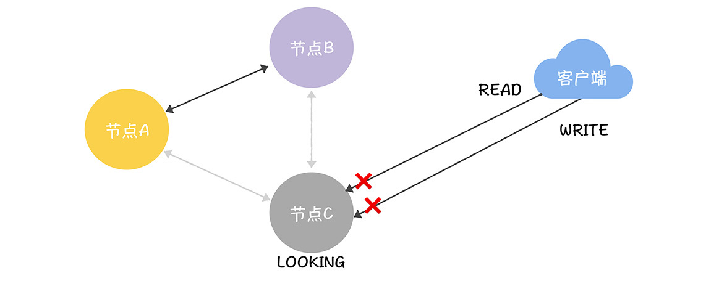
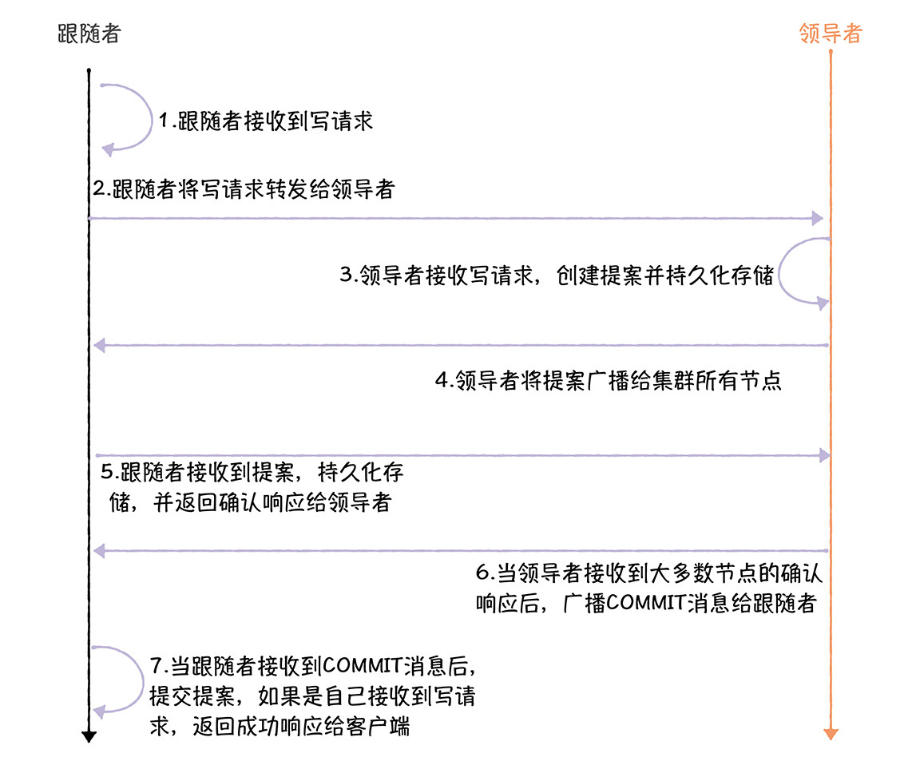
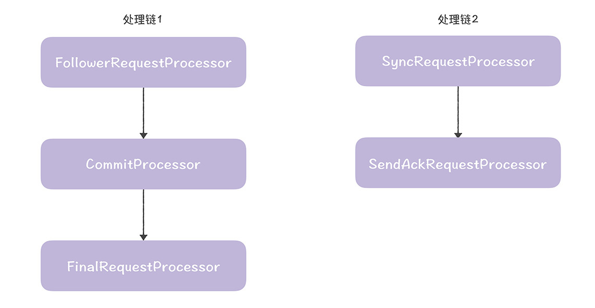
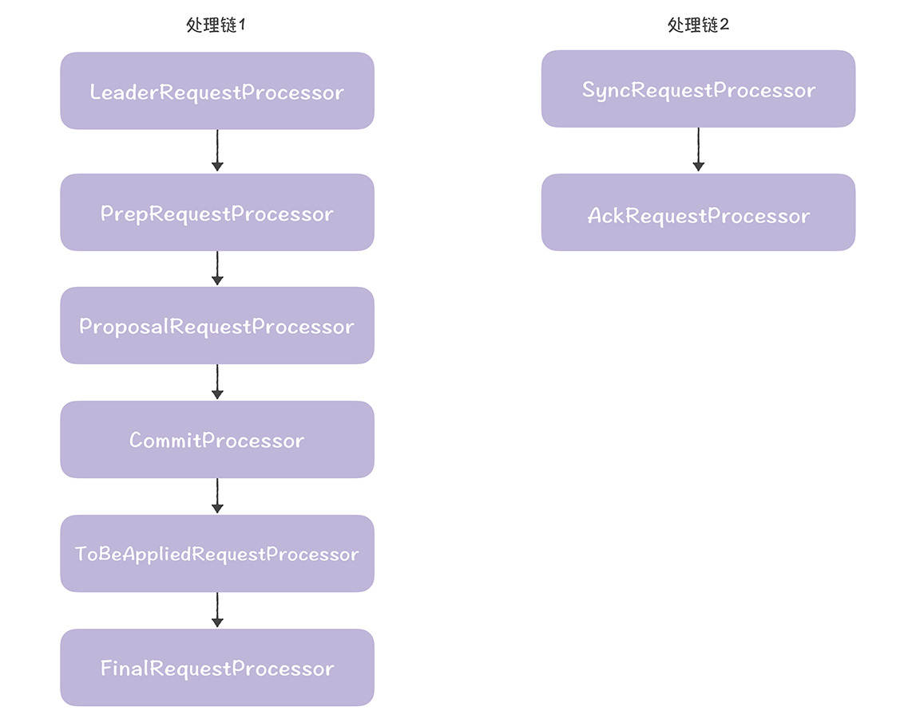
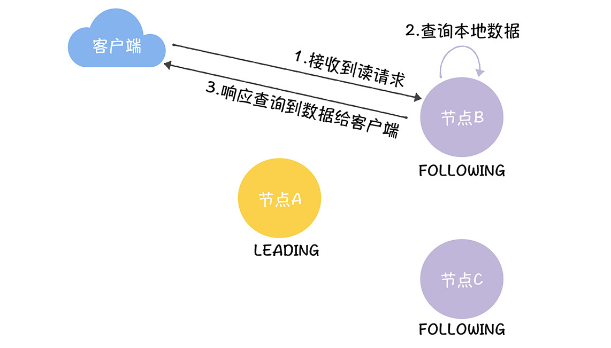

# 加餐 | ZAB协议（三）：如何处理读写请求？
你好，我是韩健！

你应该有这样的体会，如果你想了解一个网络服务，执行的第一个功能肯定是写操作，然后才执行读操作。比如，你要了解ZooKeeper，那么肯定会在zkCli.sh命令行中执行写操作（比如“create /geekbang 123”）写入数据，然后再是读操作（比如“get /geekbang”）查询数据。这样一来，你才会直观地理解ZooKeeper是如何使用的了。

在我看来，任何网络服务最重要的功能就是处理读写请求，因为我们访问网络服务本质上都是在执行读写操作，ZooKeeper也不例外。 **而且对ZooKeeper而言，这些功能更为重要，因为在ZooKeeper中，如何处理写请求，关乎着操作的顺序性，而操作的顺序性会影响节点的创建；如何处理读请求，关乎着一致性，它们又影响着客户端是否会读到旧数据。**

接下来，我会从ZooKeeper系统的角度，全面地分析整个读写请求的流程，帮助你更加全面、透彻地理解读写请求背后的原理。

你肯定知道，在ZooKeeper中，写请求是必须在领导者上处理，如果跟随者接收到了写请求，它需要将写请求转发给领导者，当写请求对应的提案被复制到大多数节点上时，领导者会提交提案，并通知跟随者提交提案。而读请求可以在任何节点上处理，也就是说，ZooKeeper实现的是最终一致性。

对你来说，理解了如何处理读写请求，不仅能理解读写这个最重要功能的核心原理，还能更好地理解ZooKeeper的性能和一致性。这样一来，当你在实际场景中安装部署ZooKeeper的时候，就能游刃有余地做资源规划了。比如，如果读请求比较多，你可以增加节点，配置5节点集群，而不是常见的3节点集群。

话不多说，我们进入今天的内容，一起探究ZooKeeper处理读写请求的背后原理和代码实现。

## ZooKeeper处理读写请求的原理

其实，我在 [15讲](https://time.geekbang.org/column/article/229975) 演示“如何实现操作顺序性”时，就已经介绍了ZooKeeper是如何处理读写请求的了。所以在这里我就不啰嗦了，只是在此基础上，再补充几点。

首先，在ZooKeeper中，与领导者“失联”的节点，是不能处理读写请求的。比如，如果一个跟随者与领导者的连接发生了读超时，设置了自己的状态为LOOKING，那么此时它既不能转发写请求给领导者处理，也不能处理读请求，只有当它“找到”领导者后，才能处理读写请求。

举个例子：当发生分区故障了，C与A（领导者）、B网络不通了，那么C将设置自己的状态为LOOKING，此时在C节点上既不能执行读操作，也不能执行写操作。



其次，当大多数节点进入到广播阶段的时候，领导者才能提交提案，因为提案提交，需要来自大多数节点的确认。

最后，写请求只能在领导者节点上处理，所以ZooKeeper集群写性能约等于单机。而读请求是可以在所有的节点上处理的，所以，读性能是能水平扩展的。也就是说，你可以通过分集群的方式来突破写性能的限制，并通过增加更多节点，来扩展集群的读性能。

熟悉了ZooKeeper处理读写请求的过程和原理后，相信你应该好奇这些功能在ZooKeeper代码中是如何实现的呢？

## ZooKeeper代码是如何实现读写操作的呢？

### 如何实现写操作？

我先来说一说写操作，在ZooKeeper代码中，处理写请求的核心流程就像下图一样（为了帮你更好的理解这部分内容，我来演示一下复杂的情况，也就是跟随者接收到写请求的情况）。



接下来，咱们一起走一遍核心代码的流程，加深一下印象。

1.跟随者在FollowerRequestProcessor.processRequest()中接收到写请求。具体来说，写请求是系统在ZooKeeperServer.submitRequestNow()中发给跟随者的。

```
firstProcessor.processRequest(si);

```

而firstProcessor，是在FollowerZooKeeperServer.setupRequestProcessors()中创建的。

```
protected void setupRequestProcessors() {
  // 创建finalProcessor，提交提案或响应查询
  RequestProcessor finalProcessor = new FinalRequestProcessor(this);
  // 创建commitProcessor，处理提案提交或读请求
  commitProcessor = new CommitProcessor(finalProcessor,   Long.toString(getServerId()), true, getZooKeeperServerListener());
  commitProcessor.start();
  // 创建firstProcessor，接收发给跟随者的请求
  firstProcessor = new FollowerRequestProcessor(this, commitProcessor);
  ((FollowerRequestProcessor) firstProcessor).start();
  // 创建syncProcessor，将提案持久化存储，并返回确认响应给领导者
  syncProcessor = new SyncRequestProcessor(this, new SendAckRequestProcessor(getFollower()));
  syncProcessor.start();
}

```

需要你注意的是，跟随者节点和领导者节点的firstProcessor是不同的，这样当firstProcessor在ZooKeeperServer.submitRequestNow()中被调用时，就分别进入了跟随者和领导者的代码流程。另外，setupRequestProcessors()创建了2条处理链，就像下图的样子。



其中，处理链1是核心处理链，最终实现了提案提交和读请求对应的数据响应。处理链2实现了提案持久化存储，并返回确认响应给领导者。

2.跟随者在FollowerRequestProcessor.run()中将写请求转发给领导者。

```
// 调用learner.request()将请求发送给领导者
zks.getFollower().request(request);

```

3.领导者在LeaderRequestProcessor.processRequest()中接收写请求，并最终调用pRequest()创建事务（也就是提案），并持久化存储。

```
// 创建事务
pRequest2Txn(request.type, zks.getNextZxid(), request, create2Request, true);
......
// 分配事务标识符
request.zxid = zks.getZxid();
// 调用ProposalRequestProcessor.processRequest()处理写请求，并将事务持久化存储
nextProcessor.processRequest(request);

```

在这里，需要你注意的是，写请求也是在ZooKeeperServer.submitRequestNow()中发给领导者的。

```
firstProcessor.processRequest(si);

```

而firstProcessor，是在LeaderZooKeeperServer.setupRequestProcessors()中创建的。

```
protected void setupRequestProcessors() {
  // 创建finalProcessor，最终提交提案和响应查询
  RequestProcessor finalProcessor = new FinalRequestProcessor(this);
  // 创建toBeAppliedProcessor，存储可提交的提案，并在提交提案后，从toBeApplied队列移除已提交的
  RequestProcessor toBeAppliedProcessor = new Leader.ToBeAppliedRequestProcessor(finalProcessor, getLeader());
  // 创建commitProcessor，处理提案提交或读请求
  commitProcessor = new CommitProcessor(toBeAppliedProcessor, Long.toString(getServerId()), false, getZooKeeperServerListener());
  commitProcessor.start();
  // 创建proposalProcessor，按照顺序广播提案给跟随者
  ProposalRequestProcessor proposalProcessor = new ProposalRequestProcessor(this, commitProcessor);
        proposalProcessor.initialize();
  // 创建prepRequestProcessor，根据请求创建提案
  prepRequestProcessor = new PrepRequestProcessor(this, proposalProcessor);
  prepRequestProcessor.start();
  // 创建firstProcessor，接收发给领导者的请求
  firstProcessor = new LeaderRequestProcessor(this, prepRequestProcessor);
  ......
}

```

需要你注意的是，与跟随者类似，setupRequestProcessors()给领导者也创建了2条处理链（其中处理链2是在创建proposalRequestProcessor时创建的）。



其中，处理链1是核心处理链，最终实现了写请求处理（创建提案、广播提案、提交提案）和读请求对应的数据响应。处理链2实现了提案持久化存储，并返回确认响应给领导者自己。

4.领导者在ProposalRequestProcessor.processRequest()中，调用propose()将提案广播给集群所有节点。

```
zks.getLeader().propose(request);

```

5.跟随者在Follower.processPacket()中接收到提案，持久化存储，并返回确认响应给领导者。

```
// 接收、持久化、返回确认响应给领导者
fzk.logRequest(hdr, txn, digest);

```

6.当领导者接收到大多数节点的确认响应（Leader.processAck()）后，最终在CommitProcessor.tryToCommit()提交提案，并广播COMMIT消息给跟随者。

```
// 通知跟随者提交
commit(zxid);
// 自己提交
zk.commitProcessor.commit(p.request);

```

7.当跟随者接收到COMMIT消息后，在FollowerZooKeeperServer.commit()中提交提案，如果最初的写请求是自己接收到的，返回成功响应给客户端。

```
// 必须顺序提交
long firstElementZxid = pendingTxns.element().zxid;
if (firstElementZxid != zxid) {
  LOG.error("Committing zxid 0x" + Long.toHexString(zxid)
            + " but next pending txn 0x" +
            Long.toHexString(firstElementZxid));
  ServiceUtils.requestSystemExit(ExitCode.UNMATCHED_TXN_COMMIT.getValue());
}
// 将准备提交的提案从pendingTxns队列移除
Request request = pendingTxns.remove();
request.logLatency(ServerMetrics.getMetrics().COMMIT_PROPAGATION_LATENCY);
// 最终调用FinalRequestProcessor.processRequest()提交提案，并如果最初的写请求是自己接收到的，返回成功响应给客户端
commitProcessor.commit(request);

```

这样，ZooKeeper就完成了写请求的处理。你要特别注意一下，在分布式系统中，消息或者核心信息的持久化存储很关键，也很重要，因为这是保证集群能稳定运行的关键。

当然了，写入数据，最终还是为了后续的数据读取，那么在ZooKeeper中，是如何实现读操作的呢？

### 如何实现读操作？

相比写操作，读操作的处理要简单很多，因为接收到读请求的节点，只需要查询本地数据，然后响应数据给客户端就可以了。读操作的核心代码流程，如图所示。



咱们一起走一遍核心代码的流程，加深一下印象。

1.跟随者在FollowerRequestProcessor.processRequest()中接收到读请求。

2.跟随者在FinalRequestProcessor.processRequest()中查询本地数据，也就是dataTree中的数据。

```
// 处理读请求
case OpCode.getData: {
  ......
  // 查询本地dataTree中的数据
  rsp = handleGetDataRequest(getDataRequest, cnxn, request.authInfo);
  ......
  break;
}

```

3.然后跟随者响应查询到数据给客户端。

```
case OpCode.getData : {
  ......
  // 响应查询到的数据给客户端
  cnxn.sendResponse(hdr, rsp, "response", path, stat, opCode);
  break;
}

```

你看，这样ZooKeeper就完成读操作的处理。在这里，我想补充一点，你可以dataTree理解为Raft的状态机，提交的数据，最终存放在dataTree中。

## 内容小结

本节课我主要带你了解了ZooKeeper处理读写请求的过程，以及ZooKeeper的代码实现和核心流程。我希望你明确这样几个重点。

1.与领导者“失联”的跟随者（比如发生分区故障时），是既不能处理写请求，也不能处理读请求的。

2.在ZooKeeper中，写请求只能在领导者节点上处理，读请求可以在所有节点上处理，实现的是最终一致性。

因为本讲是ZAB协议的最后一讲，为了帮你后续学习本课程没有提到的内容，我想补充几点。

首先，ZAB的术语众多，而且有些术语表达的是同一个含义，这些术语有些在文档中出现，有些在代码中出现。而你只有准确理解术语，才能更好地理解ZAB协议的原理，所以，我补充一些内容。

- 提案（Proposal）：进行共识协商的基本单元，你可以理解为操作（Operation）或指令（Command），常出现在文档中。
- 事务（Transaction）：也是指提案，常出现在代码中。比如，pRequest2Txn()将接收到的请求转换为事务；再比如，未提交提案会持久化存储在事务日志中。在这里需要你注意的是，这个术语很容易引起误解，因为它不是指更广泛被接受的含义，具有ACID特性的操作序列。

其次，在我看来，Raft算法和ZAB协议很类似，比如主备模式（也就是领导者、跟随者模型）、日志必须是连续的、以领导者的日志为准来实现日志一致等等。那为什么它们会比较类似呢？

**我的看法是，“英雄所见略同”。** 比如ZAB协议要实现操作的顺序性，而Raft的设计目标，不仅仅是操作的顺序性，而是线性一致性，这两个目标，都决定了它们不能允许日志不连续，要按照顺序提交日志，那么，它们就要通过上面的方法实现日志的顺序性，并保证达成共识（也就是提交）后的日志不会再改变。

最后，我想就ZAB和Raft做个对比，来具体说说ZAB和Raft的异同。既然我们要做对比，那么首先要定义对比标准，我是这么考虑的：你应该有这样的体会，同一个功能，不同的同学实现的代码都会不一样（比如数据结构、代码逻辑），所以过于细节的比较，尤其是偏系统实现方面的，意义不大（比如跟随者是否转发写请求到领导者，不仅意义不大，而且这是ZAB和Raft都没有约定的，是集群系统需要考虑的），我们可以从核心原理上做对比。

- 领导者选举：ZAB采用的“见贤思齐、相互推荐”的快速领导者选举（Fast Leader Election），Raft采用的是“一张选票、先到先得”的自定义算法。在我看来，Raft的领导者选举，需要通讯的消息数更少，选举也更快。

- 日志复制：Raft和ZAB相同，都是以领导者的日志为准来实现日志一致，而且日志必须是连续的，也必须按照顺序提交。

- 读操作和一致性：ZAB的设计目标是操作的顺序性，在ZooKeeper中默认实现的是最终一致性，读操作可以在任何节点上执行；而Raft的设计目标是强一致性（也就是线性一致性），所以Raft更灵活，Raft系统既可以提供强一致性，也可以提供最终一致性。

- 写操作：Raft和ZAB相同，写操作都必须在领导者节点上处理。

- 成员变更：Raft和ZAB都支持成员变更，其中ZAB以动态配置（dynamic configuration）的方式实现的。那么当你在节点变更时，不需要重启机器，集群是一直运行的，服务也不会中断。

- 其他：相比ZAB，Raft的设计更为简洁，比如Raft没有引入类似ZAB的成员发现和数据同步阶段，而是当节点发起选举时，递增任期编号，在选举结束后，广播心跳，直接建立领导者关系，然后向各节点同步日志，来实现数据副本的一致性。 **在我看来，ZAB的成员发现，可以和领导者选举合到一起，类似Raft，在领导者选举结束后，直接建立领导者关系，而不是再引入一个新的阶段；数据同步阶段，是一个冗余的设计，可以去除的，因为ZAB不是必须要先实现数据副本的一致性，才可以处理写请求，而且这个设计是没有额外的意义和价值的。**


另外，ZAB和ZooKeeper强耦合，你无法在实际系统中独立使用；而Raft的实现（比如Hashicorp Raft）是可以独立使用的，编程友好。

## 课堂思考

我提到ZooKeeper提供的是最终一致性，读操作可以在任何节点上执行。那么如果读操作访问的是备份节点，为什么无法保证每次都能读到最新的数据呢？欢迎在留言区分享你的看法，与我一同讨论。

最后，感谢你的阅读，如果这节课让你有所收获，也欢迎你将它分享给更多的朋友。