# 加餐 | ZAB协议（二）：如何从故障中恢复？
你好，我是韩健。

我们上一讲提到了ZAB的领导者选举，在我看来，它只是选举了一个适合当领导者的节点，然后把这个节点的状态设置成LEADING状态。此时，这个节点还不能作为主节点处理写请求，也不能使用领导职能（比如，它没办法阻止其他“领导者”广播提案）。也就是说，集群还没有从故障中恢复过来，而成员发现和数据同步会解决这个问题。

总的来说，成员发现和数据同步不仅让新领导者正式成为领导者，确立了它的领导关系，还解决了各副本的数据冲突，实现了数据副本的一致性。这样一来，集群就能正常处理写请求了。在这句话里：

- 确立领导关系，也就是在成员发现（DISCOVERY）阶段，领导者和大多数跟随者建立连接，并再次确认各节点对自己当选领导者没有异议，确立自己的领导关系；
- 处理冲突数据，也就是在数据同步（SYNCHRONIZATION）阶段，领导者以自己的数据为准，解决各节点数据副本的不一致。

对你来说，理解这两点，可以更好地理解ZooKeeper怎么恢复故障，以及当主节点崩溃了，哪些数据会丢失，哪些不会，以及背后的原因。也就是说，你能更加深刻地理解ZooKeeper的节点故障容错能力。

那么说了这么多，集群具体是怎么从故障中恢复过来的呢？带着这个问题，我们进入今天的学习。

## ZAB集群怎么从故障中恢复过来？

如果我们想把ZAB集群恢复到正常状态，那么新领导者就要确立自己的领导关系，成为唯一有效的领导者，然后作为主节点“领导”各备份节点一起处理读写请求。

### 如何确立领导关系？

那么通过开篇，你可以知道，选举出的领导者，是在成员发现阶段确立领导关系的。

在当选后，领导者会递增自己的任期编号，并基于任期编号值的大小，来和跟随者协商，最终建立领导关系。 **具体说的话，就是跟随者会选择任期编号值最大的节点，作为自己的领导者，而被大多数节点认同的领导者，将成为真正的领导者。**

我举个例子，具体帮你理解一下。

假设一个ZooKeeper集群，由节点A、B、C组成。其中，领导者A已经宕机，C是新选出来的领导者，B是新的跟随者（为了方便演示，假设B、C已提交提案的事务标识符最大值分别是<1, 10>和<1, 11>，其中1是任期编号，10、11是事务标识符中的计数器值，A宕机前的任期编号也是1）。那么B、C如何协商建立领导关系呢？

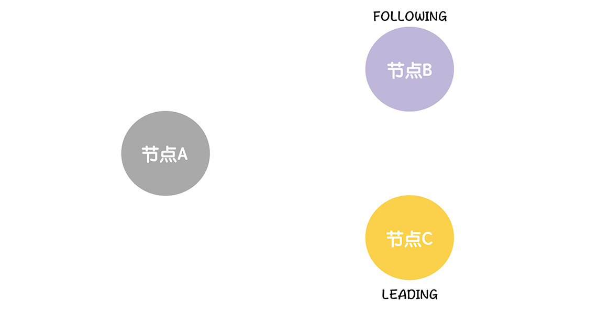

首先，B、C会把自己的ZAB状态设置为成员发现（DISCOVERY），这就表明，选举（ELECTION）阶段结束了，进入了下一个阶段：

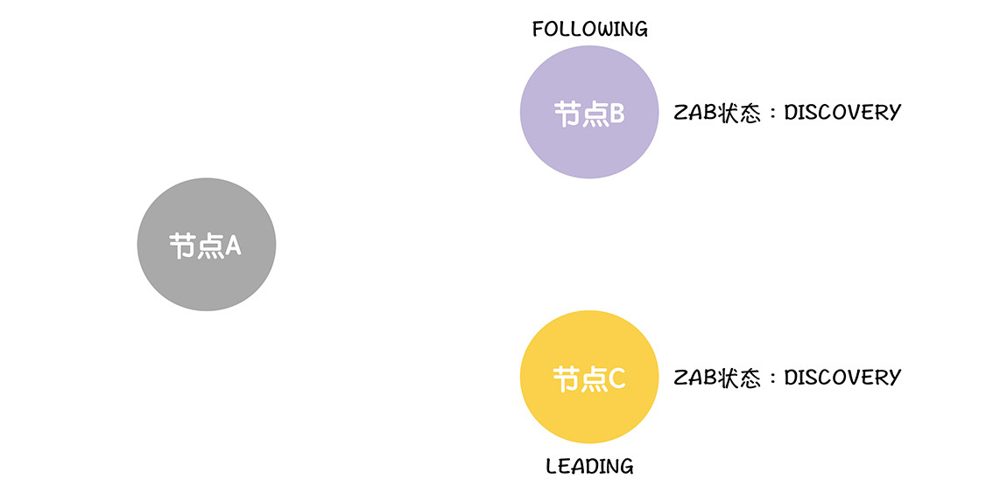

在这里，我想补充一下，ZAB定义了4种状态，来标识节点的运行状态。

- ELECTION（选举状态）：表明节点在进行领导者选举；
- DISCOVERY（成员发现状态）：表明节点在协商沟通领导者的合法性；
- SYNCHRONIZATION（数据同步状态）：表明集群的各节点以领导者的数据为准，修复数据副本的一致性；
- BROADCAST（广播状态）：表明集群各节点在正常处理写请求。

关于这4种状态，你知道它们是做什么的就可以了。我就强调一点， **只有当集群大多数节点处于广播状态的时候，集群才能提交提案。**

接下来，B会主动联系C，发送给它包含自己接收过的领导者任期编号最大值（也就是前领导者A的任期编号，1）的FOLLOWINFO消息。

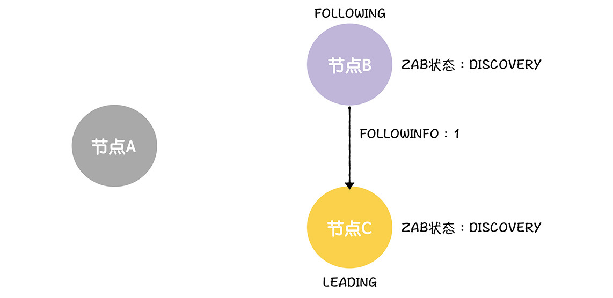

当C接收来自B的信息时，它会将包含自己事务标识符最大值的LEADINFO消息发给跟随者。

你要注意，领导者进入到成员发现阶段后，会对任期编号加1，创建新的任期编号，然后基于新任期编号，创建新的事务标识符（也就是<2, 0>）。


当接收到领导者的响应后，跟随者会判断领导者的任期编号是否最新，如果不是，就发起新的选举；如果是，跟随者返回ACKEPOCH消息给领导者。在这里，C的任期编号（也就是2）大于B接受过的其他领导任期编号（也就是旧领导者A的任期编号，1），所以B返回确认响应给C，并设置ZAB状态为数据同步。

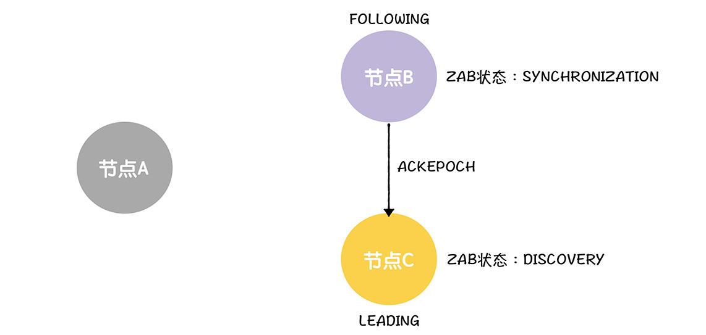

最后，当领导者接收到来自大多数节点的ACKEPOCH消息时，就设置ZAB状态为数据同步。在这里，C接收到了B的消息，再加上C自己，就是大多数了，所以，在接收到来自B的消息后，C设置ZAB状态为数据同步。

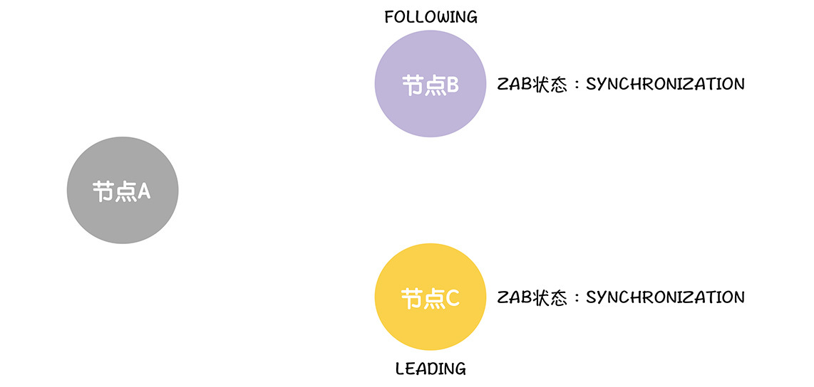

**现在，ZAB在成员发现阶段确立了领导者的领导关系，之后领导者就可以行使领导职能了。** 而这时它首先要解决的就是数据冲突，实现各节点数据的一致性，那么它是怎么做的呢？

### 如何处理冲突数据？

当进入到数据同步状态后，领导者会根据跟随者的事务标识符最大值，判断以哪种方式处理不一致数据（有DIFF、TRUNC、SNAP这3种方式，后面我会具体说一说）。

因为C已提交提案的事务标识符最大值（也就是<1, 11>）大于B已提交提案的事务标识符最大值（也就是<1, 10>），所以C会用DIFF的方式修复数据副本的不一致，并返回差异数据（也就是事务标识符为<1, 11>的提案）和NEWLEADER消息给B。

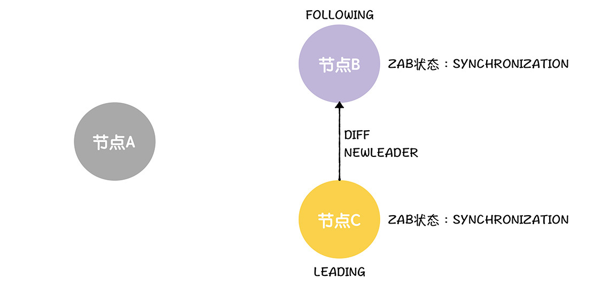

**在这里，我想强调一点：B已提交提案的最大值，也是它最新提案的最大值。** 因为在ZooKeeper实现中，节点退出跟随者状态时（也就是在进入选举前），所有未提交的提案都会被提交。这是ZooKeeper的设计，你知道有这么个事就可以了。

然后，B修复不一致数据，返回NEWLEADER消息的确认响应给领导者。

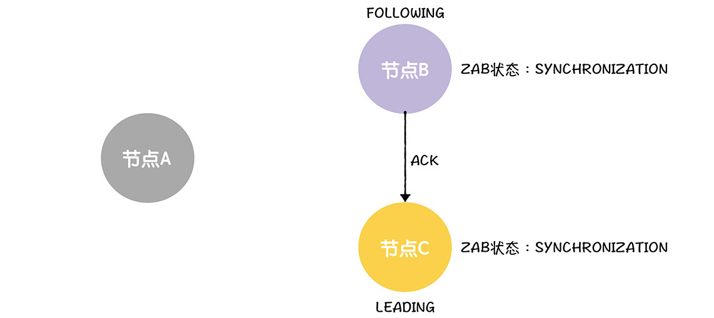

接着，当领导者接收到来自大多数节点的NEWLEADER消息的确认响应，将设置ZAB状态为广播。在这里，C接收到B的确认响应，加上C自己，就是大多数确认了。所以，在接收到来自B的确认响应后，C设置自己的ZAB状态为广播，并发送UPTODATE消息给所有跟随者，通知它们数据同步已经完成了。

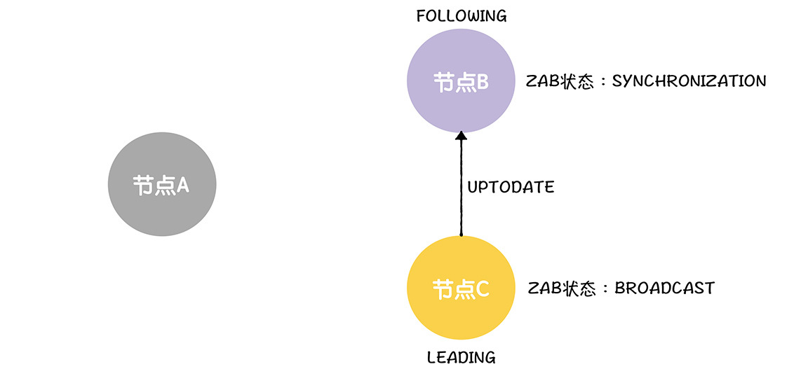

最后当B接收到UPTODATE消息时，它就知道数据同步完成了，就设置ZAB状态为广播。

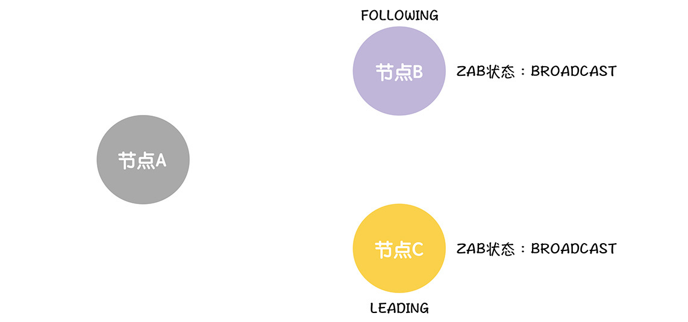

这个时候，集群就可以正常处理写请求了。

现在，我已经讲完了故障恢复的原理，那接下来，我们就来看一看ZooKeeper到底是怎么实现的吧。

## ZooKeeper如何恢复故障？

### 成员发现

成员发现是通过跟随者和领导者交互来完成的， **目标是确保大多数节点对领导者的领导关系没有异议，也就是确立领导者的领导地位。**

大概的实现流程，就像下面这样：

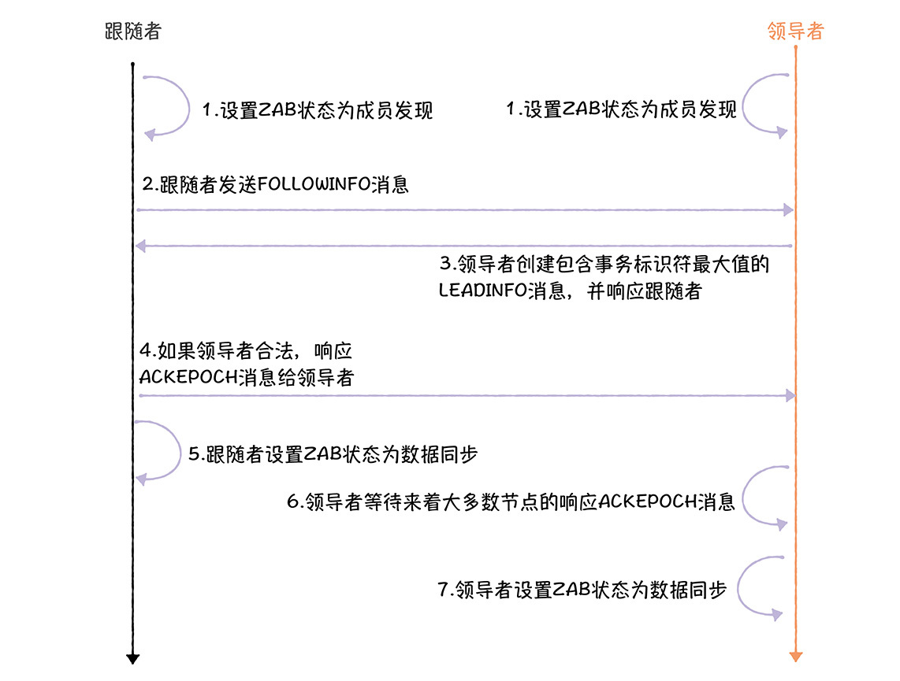

为帮你更好地理解这个流程，我们来走一遍核心代码的流程，加深下印象。

第一步，领导者选举结束，节点进入跟随者状态或者领导者状态后，它们会分别设置ZAB状态为成员发现。具体来说就是：

- 跟随者会进入到Follower.followLeader()函数中执行，设置ZAB状态为成员发现。

```
self.setZabState(QuorumPeer.ZabState.DISCOVERY);

```

- 领导者会进入到Leader.lead()函数中执行，并设置ZAB状态为成员发现。

```
self.setZabState(QuorumPeer.ZabState.DISCOVERY);

```

第二，跟随者会主动联系领导者，发送自己已接受的领导者任期编号最大值（也就是acceptedEpoch）的FOLLOWINFO消息给领导者。

```
// 跟领导者建立网络连接
connectToLeader(leaderServer.addr, leaderServer.hostname);
connectionTime = System.currentTimeMillis();
// 向领导者报道，并获取领导者的事务标识符最大值
long newEpochZxid = registerWithLeader(Leader.FOLLOWERINFO);

```

第三，接收到来自跟随者的FOLLOWINFO消息后，在LearnerHandler.run()函数中，领导者将创建包含自己事务标识符最大值的LEADINFO消息，并响应给跟随者。

```
// 创建LEADINFO消息
QuorumPacket newEpochPacket = new
QuorumPacket(Leader.LEADERINFO, newLeaderZxid, ver, null);
// 发送LEADINFO消息给跟随者
oa.writeRecord(newEpochPacket, "packet");

```

第四，接收到来自领导者的LEADINFO消息后，跟随者会基于领导者的任期编号，判断领导者是否合法，如果领导者不合法，跟随者发起新的选举，如果领导者合法，响应ACKEPOCH消息给领导者。

```
// 创建ACKEPOCH消息，包含已提交提案的事务标识符最大值
QuorumPacket ackNewEpoch = new QuorumPacket(Leader.ACKEPOCH, lastLoggedZxid, epochBytes, null);
// 响应ACKEPOCH消息给领导者
writePacket(ackNewEpoch, true);

```

第五，跟随者设置ZAB状态为数据同步。

```
self.setZabState(QuorumPeer.ZabState.SYNCHRONIZATION);

```

第六，需要你注意的是，在LearnerHandler.run()函数中（以及Leader.lead()函数），领导者会调用waitForEpochAck()函数，来阻塞和等待来自大多数节点的ACKEPOCH消息。

```
ss = new StateSummary(bbepoch.getInt(), ackEpochPacket.getZxid());
learnerMaster.waitForEpochAck(this.getSid(), ss);

```

第七，当领导者接收到来自大多数节点的ACKEPOCH消息后，在Leader.lead()函数中，领导者将设置ZAB状态为数据同步。

```
self.setZabState(QuorumPeer.ZabState.SYNCHRONIZATION);

```

这样，ZooKeeper就实现了成员发现，各节点就领导者的领导关系达成了共识。

当跟随者和领导者设置ZAB状态为数据同步，它们也就是进入了数据同步阶段，那在ZooKeeper中数据同步是如何实现的呢？

### 数据同步

数据同步也是通过跟随者和领导者交互来完成的，目标是确保跟随者节点上的数据与领导者节点上数据是一致的。大概的实现流程，如图所示：

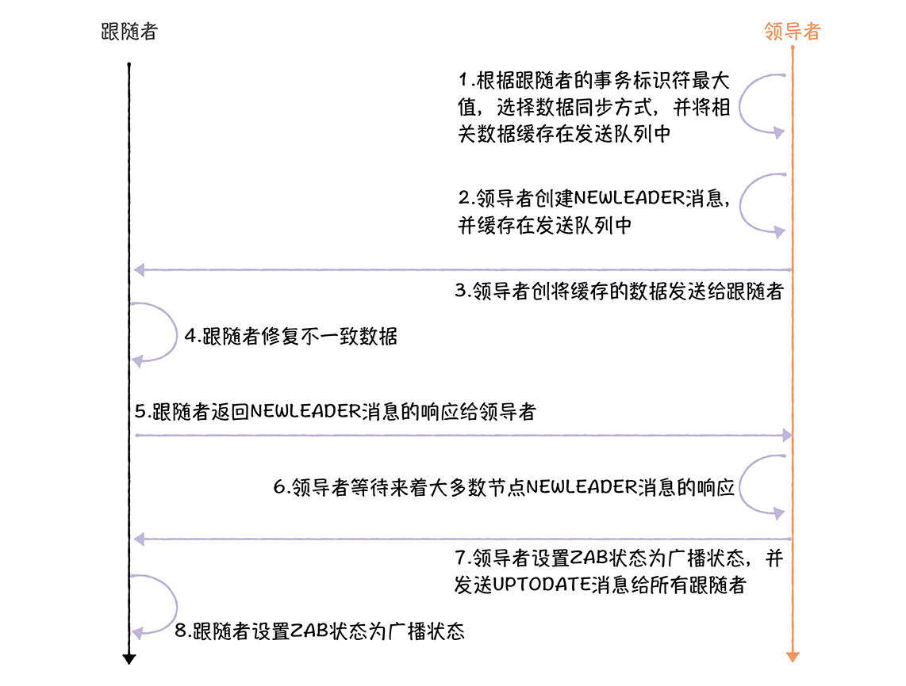

为了方便你理解，咱们一起走一遍核心代码的流程，加深下印象。

第一，在LearnerHandler.run()函数中，领导者调用syncFollower()函数，根据跟随者的事务标识符值最大值，判断用哪种方式处理不一致数据，把已经提交提案和未提交提案都同步给跟随者：

```
peerLastZxid = ss.getLastZxid();
boolean needSnap = syncFollower(peerLastZxid, learnerMaster);

```

在这里，需要你了解领导者向跟随者同步数据的三种方式（TRUNC、DIFF、SNAP），它们是什么含义呢？要想了解这部分内容，你首先要了解一下syncFollower()中，3个关键变量的含义。

- peerLastZxid：跟随者节点上，提案的事务标识符最大值。
- maxCommittedLog、minCommittedLog：领导者节点内存队列中，已提交提案的事务标识符最大值和最小值。需要你注意的是，maxCommittedLog、minCommittedLog与ZooKeeper的设计有关。在ZooKeeper中，为了更高效地复制提案到跟随者上，领导者会将一定数量（默认值为500）的已提交提案放在内存队列里，而maxCommittedLog、minCommittedLog分别标识的是内存队列中，已提交提案的事务标识符最大值和最小值。

说完3个变量的含义，我来说说3种同步方式。

- TRUNC：当peerLastZxid大于maxCommittedLog时，领导者会通知跟随者丢弃超出的那部分提案。比如，如果跟随者的peerLastZxid为11，领导者的maxCommittedLog为10，那么领导者将通知跟随者丢弃事务标识符值为11的提案。

- DIFF：当peerLastZxid小于maxCommittedLog，但peerLastZxid大于minCommittedLog时，领导者会同步给跟随者缺失的已提交的提案，比如，如果跟随者的peerLastZxid为9，领导者的maxCommittedLog为10，minCommittedLog为9，那么领导者将同步事务标识符值为10的提案，给跟随者。

- SNAP：当peerLastZxid小于minCommittedLog时，也就是说，跟随者缺失的提案比较多，那么，领导者同步快照数据给跟随者，并直接覆盖跟随者本地的数据。


在这里，我想补充一下，领导者先就已提交提案和跟随者达成一致，然后调用learnerMaster.startForwarding()，将未提交提案（如果有的话）也缓存在发送队列（queuedPackets），并最终复制给跟随者节点。也就是说， **领导者以自己的数据为准，实现各节点数据副本的一致的。**

需要你注意的是，在syncFolower()中，领导者只是将需要发送的差异数据缓存在发送队列（queuedPackets），这个时候还没有发送。

第二，在LearnerHandler.run()函数中，领导者创建NEWLEADER消息，并缓存在发送队列中。

```
// 创建NEWLEADER消息
QuorumPacket newLeaderQP = new QuorumPacket(Leader.NEWLEADER, newLeaderZxid, learnerMaster.getQuorumVerifierBytes(), null);
// 缓存NEWLEADER消息到发送队列中
queuedPackets.add(newLeaderQP);

```

第三，在LearnerHandler.run()函数中，领导者调用startSendingPackets()函数，启动一个新线程，并将缓存的数据发送给跟随者。

```
// 发送缓存队列中的数据
startSendingPackets();

```

第四，跟随者调用syncWithLeader()函数，处理来自领导者的数据同步。

```
// 处理数据同步
syncWithLeader(newEpochZxid);

```

第五，在syncWithLeader()函数，跟随者接收到来自领导者的NEWLEADER消息后，返回确认响应给领导者。

```
writePacket(new QuorumPacket(Leader.ACK, newLeaderZxid, null, null), true);

```

第六，在LearnerHandler.run()函数中（以及Leader.lead()函数），领导者等待来自大多数节点的NEWLEADER消息的响应。

```
learnerMaster.waitForNewLeaderAck(getSid(), qp.getZxid());

```

第七，当领导者接收到来自大多数节点的NEWLEADER消息的响应时，在Leader.lead()函数中，领导者设置ZAB状态为广播状态。

```
self.setZabState(QuorumPeer.ZabState.BROADCAST);

```

并在LearnerHandler.run()中发送UPTODATE消息给所有跟随者，通知它们数据同步已完成了。

```
queuedPackets.add(new QuorumPacket(Leader.UPTODATE, -1, null, null));

```

第八，当跟随者接收到UPTODATE消息时，就知道自己修复完数据不一致了，可以处理写请求了，就设置ZAB状态为广播。

```
// 数据同步完成后，也就是可以正常处理来自领导者的广播消息了，设置ZAB状态为广播
self.setZabState(QuorumPeer.ZabState.BROADCAST);

```

你看，这样就确保各节点数据的一致了，接下来，就可以以领导者为主，向其他节点广播消息了。

## 内容小结

本节课我主要带你了解了ZAB如何恢复故障，我希望你明确这样几个重点。

1.成员发现，是为了建立跟随者和领导者之间的领导者关系，并通过任期编号来确认这个领导者是否为最合适的领导者。

2.数据同步，是通过以领导者的数据为准的方式，来实现各节点数据副本的一致，需要你注意的是，基于“大多数”的提交原则和选举原则，能确保被复制到大多数节点并提交的提案，就不再改变。

在这里，我想特别强调一下，在ZooKeeper的代码实现中，处于提交（Committed）状态的提案是可能会改变的，为什么呢？

在ZooKeeper中，一个提案进入提交（Committed）状态，有两种方式：

- 被复制到大多数节点上，被领导者提交或接收到来自领导者的提交消息（leader.COMMIT）而被提交。在这种状态下，提交的提案是不会改变的。

- 另外，在ZooKeeper的设计中，在节点退出跟随者状态时（在follower.shutdown()函数中），会将所有本地未提交的提案都提交。需要你注意的是，此时提交的提案，可能并未被复制到大多数节点上，而且这种设计，就会导致ZooKeeper中出现，处于“提交”状态的提案可能会被删除（也就是接收到领导者的TRUNC消息而删除的提案）。


更准确的说， **在ZooKeeper中，被复制到大多数节点上的提案，最终会被提交，并不会再改变；而只在少数节点存在的提案，可能会被提交和不再改变，也可能会被删除。** 为了帮助你理解，我来举个具体的例子。

- 如果写请求对应的提案“SET X = 1”已经复制到大多数节点上，那么它是最终会被提交，之后也不会再改变。也就是说，在没有新的X赋值操作的前提下，不管节点怎么崩溃、领导者如何变更，你查询到的X的值都为1。

- 如果写请求对应的提案“SET X = 1”未被复制到大多数节点上，比如在领导者广播消息过程中，领导者崩溃了，那么，提案“SET X = 1”，可能被复制到大多数节点上，并提交和之后就不再改变，也可能会被删除。这个行为是未确定的，取决于新的领导者是否包含该提案。


另外，我想补充下，在ZAB中，选举出了新的领导者后，该领导者不能立即处理写请求，还需要通过成员发现、数据同步2个阶段进行故障恢复。这是ZAB协议的设计决定的，不是所有的共识算法都必须这样，比如Raft选举出新的领导者后，领导者是可以立即处理写请求的。

最后，完成数据同步后，节点将进入广播状态，那ZAB是如何处理读写请求，又是如何广播消息的呢？下节课，我会重点带你了解这部分内容。

## 课堂思考

我提到在ZAB中，提案提交的大多数原则和领导者选举的大多数原则，确保了被复制到大多数节点的提案就不再改变了。那么你不妨思考和推演一下，这是为什么呢？欢迎在留言区分享你的看法，与我一同讨论。

最后，感谢你的阅读，如果这节课让你有所收获，也欢迎你将它分享给更多的朋友。