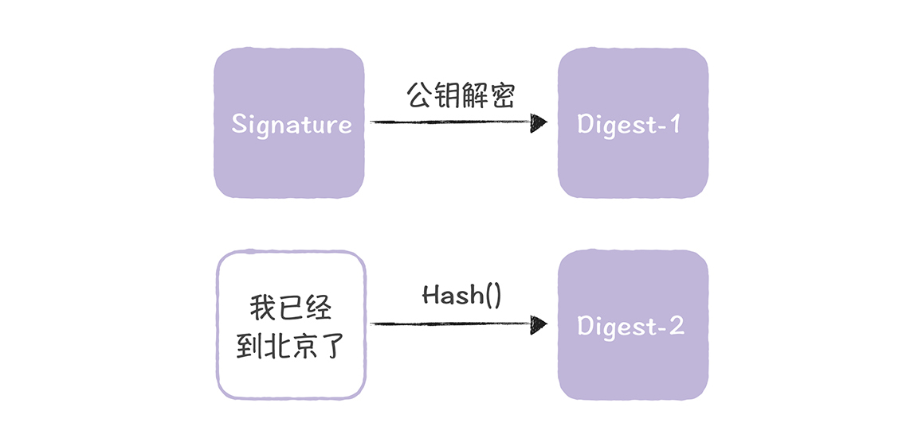
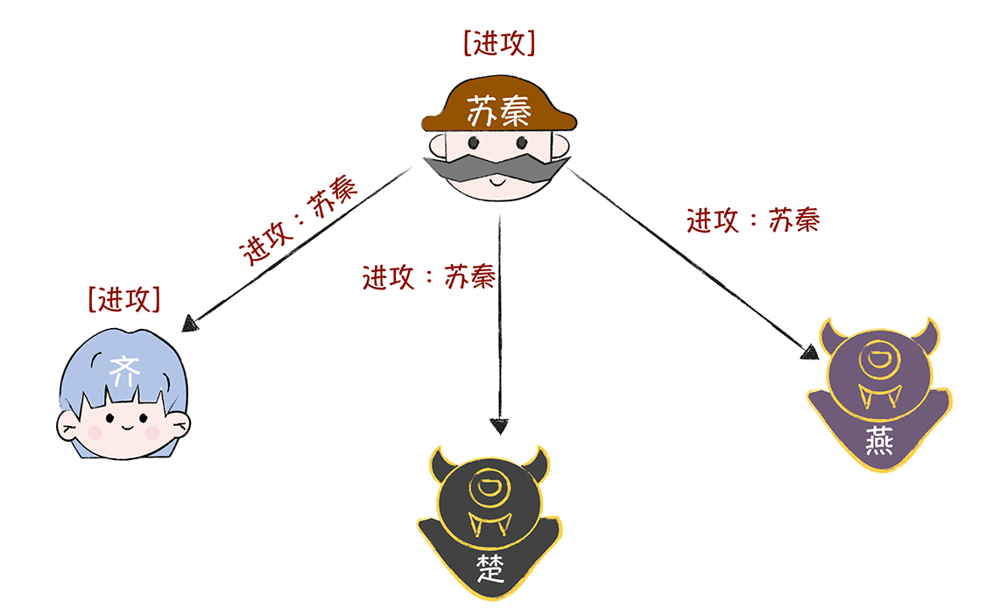
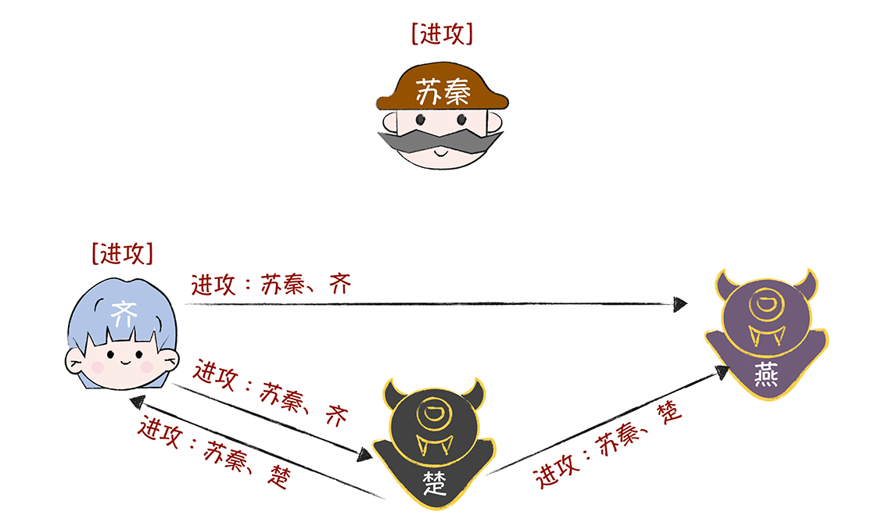
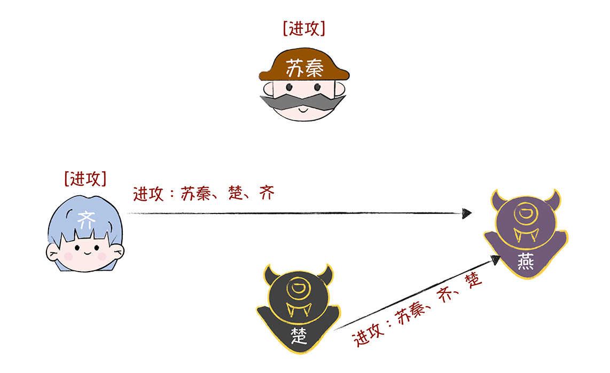
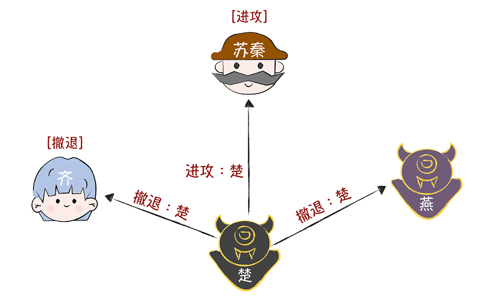
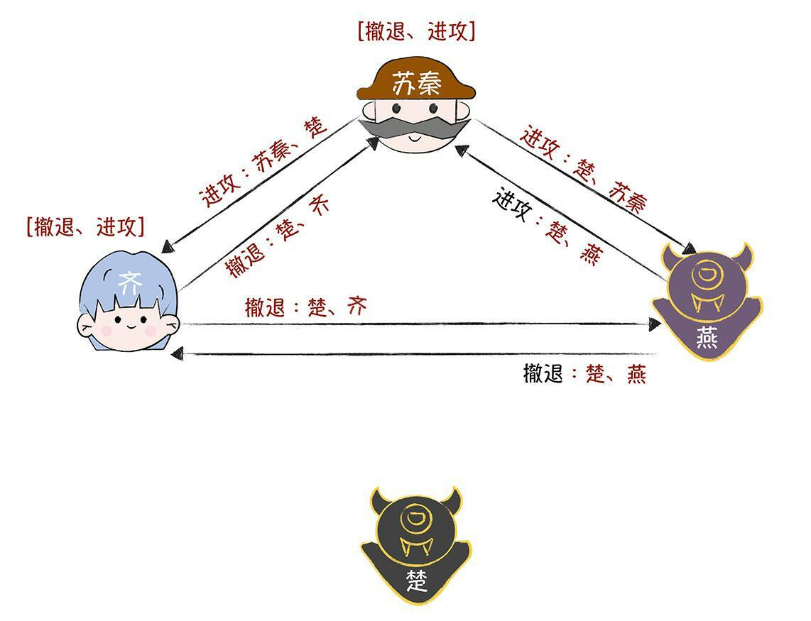
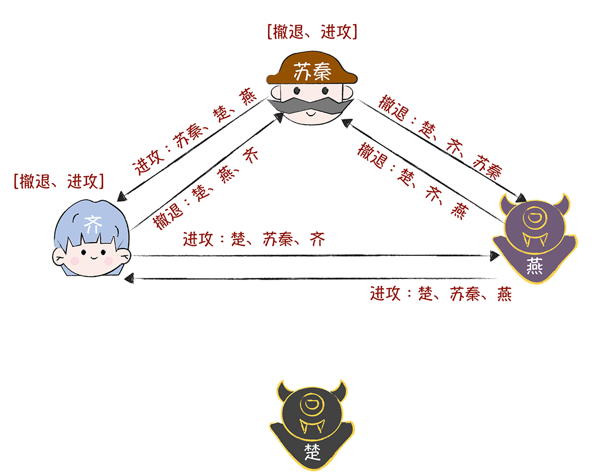

# 加餐  | 拜占庭将军问题：如何基于签名消息实现作战计划的一致性？
你好，我是韩健。

在 [01讲](https://time.geekbang.org/column/article/195662) 中，为了不啰嗦，让你举一反三地学习，我对签名消息型拜占庭问题之解，没有详细展开，而是聚焦在最核心的点“签名约束了叛徒的作恶行为”，但从留言来看，很多同学在理解签名和如何实现作战一致性上，还是遇到了问题。比如不理解如何实现作战计划的一致性。

另外，考虑到签名消息是一些常用的拜占庭容错算法（比如PBFT）的实现基础，很重要，所以这节课我会对签名消息型拜占庭问题之解进行补充。在今天的内容中，除了具体讲解如何基于签名消息实现作战计划的一致性之外，我还会说一说什么是签名消息。希望在帮你掌握签名消息型拜占庭问题之解的同时，还帮你吃透相关的基础知识。

当然，在学完01讲之后，相信你已经明白了，签名消息拜占庭问题之解，之所以能够容忍任意数量的叛徒，关键就在于通过消息的签名，约束了叛徒的作恶行为，也就是说，任何篡改和伪造忠将的消息的行为，都会被发现。

既然签名消息这么重要，那么什么是签名消息呢？

## 什么是签名消息？

签名消息指的就是带有数字签名的消息，你可以这么理解“数字签名”：类似在纸质合同上进行签名来确认合同内容和证明身份。

在这里我想说的是，数字签名既可以证实内容的完整性，又可以确认内容的来源，实现不可抵赖性（Non-Repudiation）。既然签名消息优点那么多， **那么如何实现签名消息呢？**

你应该还记得密码学的学术CP（Bob和Alice）吧（不记得的话也没关系，你把他们当作2个人就可以了），今天Bob要给Alice发送一个消息，告诉她，“我已经到北京了”，但是Bob希望这个消息能被Alice完整地接收到，内容不能被篡改或者伪造，我们一起帮Bob和Alice想想办法，看看如何实现这个消息。

首先，为了避免密钥泄露，我们推荐Bob和Alice使用非对称加密算法（比如RSA）。也就是说，加密和解密使用不同的秘钥，在这里，Bob持有需要安全保管的私钥，Alice持有公开的公钥。

然后，Bob用哈希算法（比如MD5）对消息进行摘要，然后用私钥对摘要进行加密，生成数字签名（Signature），就像下图的样子：

接着，Bob将加密摘要和消息一起发送给Alice：

接下来，当Alice接收到消息和加密摘要（Signature）后，她会用自己的公钥对加密摘要（Signature）进行解密，并对消息内容进行摘要（Degist-2），然后将新获取的摘要（Degist-2）和解密后的摘要（Degist-1）进行对比，如果2个摘要（Digest-1和Digest-2）一致，就说明消息是来自Bob的，并且是完整的，就像下图的样子：

你看，通过这种方法，Bob的消息就能被Alice完整接收到了，任何篡改和伪造Bob消息的行为，都会因为摘要不一致，而被发现。 **而这个消息就是签名消息。**

现在，你应该理解了什么是签名消息了吧？另外，关于在留言区提到的“为什么签名消息能约束叛将们的作恶行为？”，在这里，我再补充下，通过上面的Bob和Alice的故事，我们可以看到，在数字签名的约束下，叛将们是无法篡改和伪造忠将的消息的，因为任何篡改和伪造消息的行为都会被发现，也就是作恶的行为被约束了。也就是说，叛将这时能做“小”恶（比如，不响应消息，或者叛将们相互串通发送指定的消息）但他们无法篡改或伪造忠将的消息了。

既然数字签名约束了叛将们的作恶行为，那么苏秦怎么做才能实现作战的一致性的呢？也就是忠将们执行一致的作战计划。

## 如何实现作战计划的一致性？

之前我已经提到了，苏秦可以通过签名消息的方式，不仅能在不增加将军人数的情况下，解决二忠一叛的难题，还能实现无论叛将数多少，忠诚的将军们始终能达成一致的作战计划。

为了方便你理解，我以二忠二叛（更复杂的叛徒作恶模型，因为叛徒们可以相互勾结串通）为例具体演示一下，是怎样实现作战计划的一致性的：

需要你注意的是，4位将军约定了一些流程来发送作战信息、执行作战指令。

**第一轮：**

- 先发送作战指令的将军，作为指挥官，其他的将军作为副官。
- 指挥官将他的签名的作战指令发送给每位副官。
- 每位副官，将从指挥官处收到的新的作战指令（也就与之前收的作战指令不同），按照顺序（比如按照首字母字典排序）放到一个盒子里。

**第二轮：**

- 除了第一轮的指挥官外，剩余的3位将军将分别作为指挥官，在上一轮收到的作战指令上，加上自己的签名，并转发给其他将军。

**第三轮：**

- 除了第一、二轮的指挥官外，剩余的2位将军将分别作为指挥官，在上一轮收到的作战指令上，加上自己的签名，并转发给其他将军。

最后，各位将军按照约定，比如使用盒子里最中间的那个指令来执行作战指令。（假设盒子中的指令为A、B、C，那中间的指令也就是第n /2个命令。其中，n为盒子里的指令数，指令从0开始编号，也就是B）。

为了帮你直观地理解，如何基于签名消息实现忠将们作战计划的一致性，我来演示一下作战信息协商过程。 **而且我会分别以忠将和叛将先发送作战信息为例来演示，** 这样可以完整地演示叛将对作战计划干扰破坏的可能性。

那么忠诚的将军先发送作战信息的情况是什么呢？

为了演示方便，假设苏秦先发起带有签名的作战信息，作战指令是“进攻”。那么在第一轮作战信息协商中，苏秦向齐、楚、燕发送作战指令“进攻”。

在第二轮作战信息协商中，齐、楚、燕分别作为指挥官，向另外2位发送作战信息“进攻”。可是楚、燕已经叛变了， **但在签名的约束下，他们无法篡改和伪造忠将的消息，** 为了达到干扰作战计划的目的，他们俩一个选择发送消息，一个默不作声，不配合。

在第三轮作战信息协商中，齐、楚分别作为指挥官，将接收到的作战信息，附加上自己的签名，并转发给另外一位（这时的叛徒燕，还是默不作声，不配合）。

最终，齐收到的作战信息都是“进攻”（它收到了苏秦和楚的），按照“执行盒子最中间的指令”的约定，齐会和苏秦一起执行作战指令“进攻”，实现忠将们作战计划的一致性。

那么如果是叛徒楚先发送作战信息，干扰作战计划，结果会有所不同吗？我们来具体看一看。在第一轮作战信息协商中，楚向苏秦发送作战指令“进攻”，向齐、燕发送作战指令“撤退”。（当然还有其他的情况，这里只是选择了其中一种，其他的情况，你可以都推导着试试，看看结果是不是一样？）

然后，在第二轮作战信息协商中，苏秦、齐、燕分别作为指挥官，将接收到的作战信息，附加上自己的签名，并转发给另外两位。

**为了达到干扰作战计划的目的，叛徒楚和燕相互勾结了。** 比如，燕拿到了楚的私钥，也就是燕可以伪造楚的签名，这个时候，燕为了干扰作战计划，给苏秦发送作战指令“进攻”，给齐发送作战指令却是“撤退”。

接着，在第三轮作战信息协商中，苏秦、齐、燕分别作为指挥官，将接收到的作战信息，附加上自己的签名，并转发给另外一位。

最终，苏秦和齐收到的作战信息都是“撤退、进攻”，按照“执行盒子最中间的指令”的约定，苏秦、齐和燕一起执行作战指令“撤退”，实现了作战计划的一致性。也就是说，无论叛将楚和燕如何捣乱，苏秦和齐都能执行一致的作战计划，保证作战的胜利。

另外在这里，我想补充一点，签名消息的拜占庭问题之解，也是需要进行m+1轮（其中m为叛将数，所以你看，只有楚、燕是叛变的，那么就进行了三轮协商）。你也可以从另外一个角度理解：n位将军，能容忍(n - 2) 位叛将（只有一位忠将没有意义，因为此时不需要达成共识了）。 **关于这个公式，你只需要记住就好了，推导过程你可以参考论文。**

最后，我想说的是，签名消息型拜占庭问题之解，解决的是忠将们如何就作战计划达成共识的问题，也就只要忠将们执行了一致的作战计划就可以了。但它不关心这个共识是什么，比如，在适合进攻的时候，忠将们可能执行的作战计划是撤退。也就是，这个算法比较理论化。

关于理论化这一点，有的同学会想知道它如何去用，在我看来呢，这个算法解决的是共识的问题，没有与实际场景结合，是很难在实际场景中落地的。在实际场景中，你可以考虑后来的改进过后的拜占庭容错算法，比如PBFT算法。

## 内容小结

本节课我主要带你了解了什么签名消息，以及忠将们如何通过签名消息实现作战的一致性，我希望你明确这样几个重点：

1.数字签名是基于非对称加密算法（比如RSA、DSA、DH）实现的，它能防止消息的内容被篡改和消息被伪造。

2.签名消息约束了叛徒的作恶行为，比如，叛徒可以不响应，可以相互勾结串通，但叛徒无法篡改和伪造忠将的消息。

3.需要你注意的是，签名消息拜占庭问题之解，虽然实现了忠将们作战计划的一致性，但它不关心达成共识的结果是什么。

最后，我想说的是，签名消息、拜占庭将军问题的签名消息之解是非常经典的基础知识，影响和启发了后来的众多拜占庭容错算法（比如PBFT），理解了本讲的内容后，你能更好地理解其他的拜占庭容错算法，以及它们如何改进的？为什么要这么改进？比如，在PBFT中，基于性能的考虑，大部分场景的消息采用消息认证码（MAC），只有在视图变更（View Change）等少数场景中采用了数字签名。

## 课堂思考

我演示了在“二忠二叛”情况下，忠将们如何实现作战计划的一致性，那么你不妨推演下，在“二忠一叛”情况下，忠将们如何实现作战计划的一致性呢？欢迎在留言区分享你的看法，与我一同讨论。

最后，感谢你的阅读，如果这篇文章让你有所收获，也欢迎你将它分享给更多的朋友。