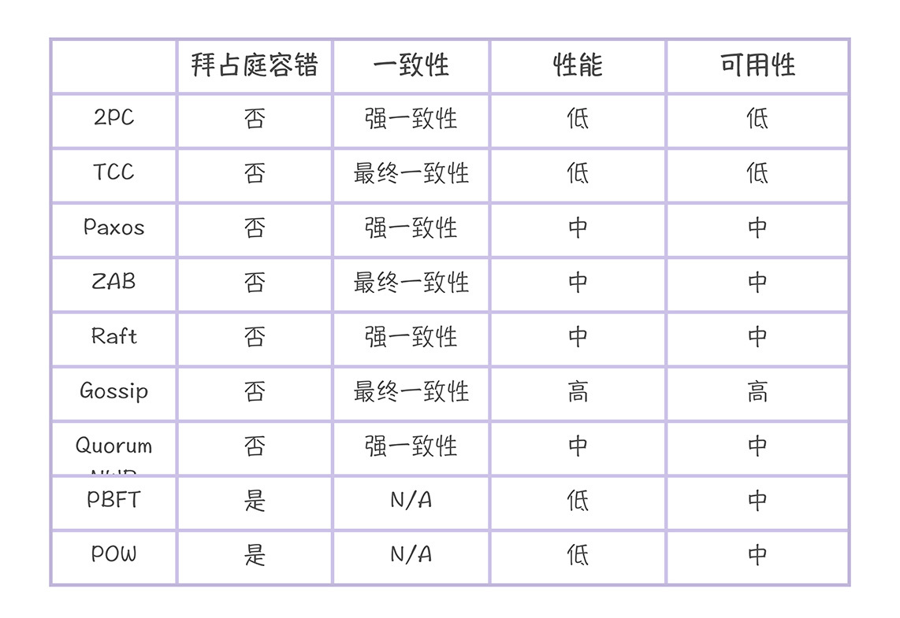
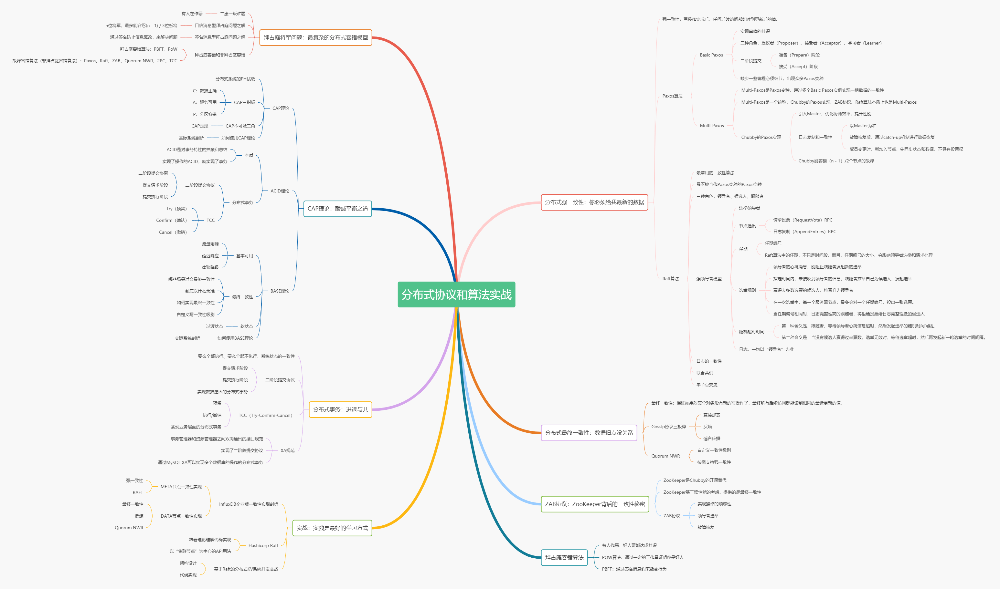

# 学习路径 | 分布式协议与算法你应该这么学
你好，我是韩健。

在正式开始学习这门课之前，我想先和你聊一聊怎么学，因为掌握了学习路径、建立了全局观之后，你才能达到事半功倍的效果。

我们都知道，分布式协议和算法（为了不啰嗦，咱们下文都简称分布式算法）很实用、也很火，很多后端工程师在面试的时候，都会被问及分布式、高可用、一致性这些专业名词背后的算法原理和实现方式。

但是分布式算法也是比较新的，快速发展的。比如，1989年莱斯利·兰伯特（Leslie Lamport）提出了Paxos，2006年，谷歌研发团队让Paxos在生产环境中落地，但是Paxos缺乏编程实现的必须细节，最终的算法实现仍是建立在一个未证明的算法之上。再后来，也就是到了2013，斯坦福大学的迭戈·安加罗（Diego Ongaro）和约翰·奥斯特霍德（John Ousterhout）提出了Raft，但是2016年，Raft仍在解决成员变更的Bug。

正因为技术比较新，所以尚未能沉淀为书，很多同学都找不到分布式算法方面的经典书籍，再加上互联网上中文资料错误多，他们在学习相关的分布式算法的时候，会觉得吃力和困惑。

那么，如何才能掌握一个相对新、而且又在蓬勃快速发展的技术知识呢？这就是我这节课想要跟你分享的内容： **如何高效地学习和掌握分布式算法？**

在我看来，开发分布式系统最关键的就是根据场景特点，选择合适的算法，在一致性和可用性之间妥协折中，而妥协折中的关键就在于能否理解各算法的特点。

也就是说，我们先要弄清楚每个算法的特点是什么，适合怎样的场景，这样当你在开发分布式系统时，才能做到心中有数，游刃有余地选择适合的算法，来解决实际场景的问题。

那么问题来了：这些算法究竟有什么特点？适合怎样的场景呢？

## 分布式算法的四度空间

为了帮你更好地理解最常用的分布式算法的特点，我从拜占庭容错、一致性、性能和可用性四个纬度帮你整理了一张表，你可以对照着看一下：

## 拜占庭容错

拜占庭错误是莱斯利·兰伯特在《拜占庭将军问题》中提出的一个错误模型，描述了一个完全不可信的场景，除了存在故障行为，还存在恶意行为。顾名思义，拜占庭容错（Byzantine Fault Tolerance，BFT），就是指能容忍拜占庭错误了。

而非拜占庭容错，又叫故障容错（Crash Fault Tolerance，CFT），解决的是分布式系统中存在故障，但不存在恶意节点的共识问题，比如进程奔溃，服务器硬件故障等等。

一般而言，在可信环境（比如企业内网）中，系统具有故障容错能力就可以了，常见的算法有二阶段提交协议（2PC）、TCC（Try-Confirm-Cancel）、Paxos算法、ZAB协议、Raft算法、Gossip协议、Quorum NWR算法。

而在不可信的环境（比如有人做恶）中，这时系统需要具备拜占庭容错能力，常见的拜占庭容错算法有POW算法、PBFT算法。

## 一致性

一般来讲，我们将一致性分为三类。

- 强一致性：保证写操作完成后，任何后续访问都能读到更新后的值。
- 弱一致性：写操作完成后，系统不能保证后续的访问都能读到更新后的值。
- 最终一致性：保证如果对某个对象没有新的写操作了，最终所有后续访问都能读到相同的最近更新的值。

但是我要提醒你注意，强一致性是具有多种含义的。

首先，在埃里克·布鲁尔的猜想中，CAP中的强一致性（也就是C）是指ACID的C，系统状态的一致性，而这种一致性，可以通过二阶段提交协议来实现。

其次，在CAP定理中，CAP中的强一致性（也就是C）是指原子一致性（也就是线性一致性）。其中，Paxos、Raft能实现线性一致性，而ZooKeeper基于读性能的考虑，它通过ZAB协议提供的是最终一致性。

一般而言，在需要系统状态的一致性时，你可以考虑采用二阶段提交协议、TCC。在需要数据访问是的强一致性时，你可考虑Raft算法。在可用性优先的系统，你可以采用Gossip协议来实现最终一致性，并实现Quorum NWR来提供强一致性。

## 可用性

可用性说的是任何来自客户端的请求，不管访问哪个非故障节点，都能得到响应数据，但不保证是同一份最新数据，可用性强调的是服务可用。

一般来讲，采用Gossip协议实现最终一致性系统，它的可用性是最高的，因为哪怕只有一个节点，集群还能在运行并提供服务。其次是Paxos算法、ZAB协议、Raft算法、Quorum NWR算法、PBFT算法、POW算法，它们能容忍一定数节点故障。

最后是二阶段提交协议、TCC，只有当所有节点都在运行时，才能工作，可用性最低。

## 性能

一般来讲，采用Gossip协议的AP型分布式系统，具备水平扩展能力，读写性能是最高的。其次是Paxos算法、ZAB协议、Raft算法，因为它们都是领导者模型，写性能受限于领导者，读性能取决于一致性实现。最后是二阶段提交协议和TCC，因为在实现事务时，需要预留和锁定资源，性能相对低。

以上就是这些算法的特点了，了解完这部分内容之后，我想你一定有这样的疑问：“老韩，这些算法看起来很深奥，我怎样才能搞懂它们呢？按部就班的学吗？”

根据我多年的经验，你之所以觉得这些算法和相关的分布式技术，学起来比较难，是因为它们比较新，缺乏体系化。如果这时有个全景图，帮你建立全局观，那么你就可以体系化的理解相关算法了，在提高学习效率同时，也能在实际场景中“按图索骥”的选用相关的算法，而这些就是我接下来想和你具体聊一聊的。

## 专栏内容该如何学？

**拜占庭将军问题：最复杂的分布式容错模型**

**难度：** 一颗星

**学习材料：** 01讲、加餐 \| 拜占庭将军问题：如何基于签名消息实现作战计划的一致性？

拜占庭容错是分布式领域最复杂的容错模型，是你必须要了解的。另外，口信消息型拜占庭问题之解、签名消息型拜占庭问题之解，你可以通过预设不同的忠将数、叛将数，来推演下，在推演中学习和掌握。

**CAP理论：酸碱平衡之道**

**难度：** 二颗星

**学习材料：** 02讲、03讲、04讲

学习CAP理论的关键，不是仅仅知道CAP不可能三角，而是要能在C和A之间，根据实际场景特点，妥协权衡折中。这也是CAP猜想提出的初衷，希望业界能重视可用性，而不是只考虑ACID。

**分布式事务：进退与共**

**难度：** 二颗星

**学习材料：** 03讲，加餐 \| MySQL XA是如何实现分布式事务的，加餐 \| TCC如何实现指令的原子性

事务是指具有ACID特性的一组操作，要么全部执行，要么全部不执行，实现的是系统状态的一致性。一般在支付，或其他需要原子操作的场景下比较常用。

实现分布式事务，最常用的方法是二阶段提交协议和TCC，这两个算法的适用场景是不同的，二阶段提交协议实现的是数据层面的事务，比如XA规范采用的就是二阶段提交协议；TCC实现的是业务层面的事务，比如当操作不仅仅是数据库操作，还涉及其他业务系统的访问操作时，这时就应该考虑TCC了。

**分布式强一致性：你必须给我最新的数据**

**难度：** 五颗星

**学习内容：** 05讲、06讲、07讲、08讲、09讲、10讲。

很多同学经常误解的一个点，就是将Consensus（共识）当成了一致性，也就是称为Paxos、Raft为一致性算法，其实Paxos和Raft是共识算法。而之所以出现这个问题，是因为在很多中文文章中，将Consensus和Consistency都翻译成了一致性，其实这样是不合适的，因为共识（Consensus）和一致性（Consistency）是两个完全不同的概念。

- 共识：各节点就指定值（Value）达成共识，而且达成共识后的值，就不再改变了。
- 一致性：是指写操作完成后，能否从各节点上读到最新写入的数据，如果立即能读到，就是强一致性，如果最终能读到，就是最终一致性。

提到共识算法，Paxos是一个必须要提及的话题，而且ZAB协议、Raft算法都可以看作是Paxos变种，所以，你需要了解Paxos算法。

但因为Paxos算法的可理解性和可编程性痛点突出，所以在实际场景中，最常的共识算法是Raft，我们可以基于Raft实现强一致性系统，Raft是需要彻底掌握的，在学习时，你可以结合17讲、18讲、19讲、20讲来一起学习，从前传（Paxos）到理论，再到实战，彻底吃透和掌握。

而一致哈希是常用的寻址算法，能突破集群性能的领导者限制，也是需要我们掌握的。

**分布式最终一致性：数据旧点没关系**

**难度：** 三颗星

**学习材料：** 11讲、12讲。

无论实现分布式事务还是强一致性，性能和可用性都是挑战，在一些对性能或可用性要求比较高的场景，比如时序数据、统计数据、状态数据（QQ登录状态），最终一致性是首选，因为最终一致性系统不仅能提供出色的性能，还能实现水平扩展。而Gossip协议是实现最终一致性的常用方法。

如果实现了最终一致性，但有时可能需要临时提供强一致性能力，这个时候，你可以用Quorum NWR来实现。

**ZAB协议：ZooKeeper背后的一致性秘密**

**难度：** 二颗星

**学习材料：** 15讲，加餐 \| ZAB协议（一）：主节点崩溃了，怎么办？加餐 \| ZAB协议（二）：如何从故障中恢复？加餐 \| ZAB协议（三）：如何处理读写请求？

ZooKeeper是一个常用的分布式协调服务，而且ZAB协议在共识算法的发展过程中起到了一个承前启后的作用，它受Paxos算法、原子广播协议的启发，又影响到后来的Raft算法。但从实战的角度，ZAB协议的实现，无法剥离ZooKeeper代码独立使用， **所以这部分内容，我建议日常使用ZooKeeper的同学仔细学习一下，其他同学的话，可以选学。**

**拜占庭容错算法：有人作恶，如何达成共识**

**难度：** 二颗星

**学习材料：** 13讲、14讲，加餐 \| PBFT算法：如何替换作恶的领导者？

在一个完全不可信的环境中（比如有人作恶），如果需要达成共识，那么我们就必须考虑拜占庭容错算法，常用的拜占庭容错算法有POW算法、PBFT算法，它们在区块链中应用广泛。

**实战：实践是最好的学习方式**

**难度：** 四颗星

**学习材料：** 16讲、17讲、18讲、19讲、20讲。

你可能有这样的体会，技术的学习往往是在模仿中开始的，在实战中顿悟升华。分布式算法的学习也不例外，技术是需要在实战中学习，也只有在实战中，你才能真正的理解技术。

他山之石，可以攻玉，为了帮助你更好地理解实际场景中一致性的实现，我会剖析InfluxDB企业版的一致性实现（强一致性和最终一致性两个方案）。也会分析一个流行的Raft实现（Hashicorp Raft），除了在代码中理解Raft算法，也会带你熟悉一下Hashicorp Raft的API接口，最终在19、20讲，带你使用API接口开发实现自己的分布式KV系统。

我啰嗦了那么多，其实就是为了让你更高效地掌握常用的分布式算法。另外，为了帮你更好的理解算法的特点和整体学习的思路，我做了个知识地图，方便你梳理整个知识体系。

## 总结

生有涯知无涯，只有抓住技术本质，才能举一反三，以不变应万变。而本课程我带你了解的这些算法和理论，都是最经典和经得起时间检验的。

但学习的过程绝不会一帆风顺，如果你在学习过程中有困惑、茫然，甚至是沮丧，希望你能多留言，咱们聊一聊，一起想想办法， **让我们把分布式算法学习这件意义非凡的事情坚持下去，一起攻克分布式系统设计的关键难题。**

现在，就让我们正式开始分布式算法之旅吧！一起享受技术的乐趣。