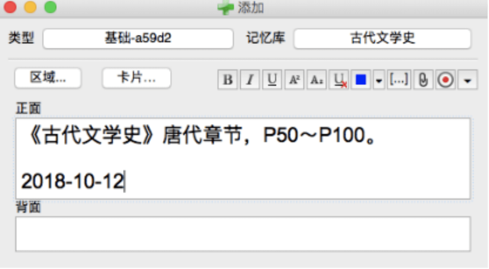
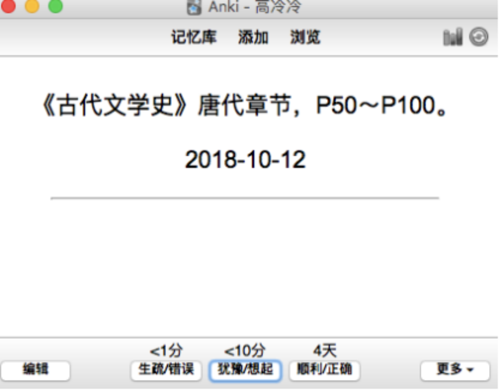

# 06｜教你高效复习：巧用学习神器取得好成绩
学习是有方法的，按照正确的方法练习，每个人都可以成为学霸。

大家好，我是冷冷。

今天要跟大家分享的是，如何高效复习？如何巧用学习神器，花尽量少的时间，取得尽量好的成绩。

### 01

在讲具体的方法之前，我想先分享一个重要的思维，叫做“ **闭环**”。

不知大家有没有意识到，在学习的时候，我们所付出的努力，至少有一半都浪费掉了，比如那些只读了一遍的书、做了笔记却从未复习的课程、看了个开头便抛之脑后的资料……

你看，我们并不是不努力，但却一直在无效努力，原因就在于没有“闭环”思维。

那么，什么是“闭环”呢？ **它指的是把一件事从头做到尾。** 比如说，你读了一本书，那么之后需要安排时间去温习笔记，甚至尝试把其中的素材和观点，应用到写作和表达中，也就是输出；再比如说，你做了一张试卷，对答案发现做错了一些题目，那么你需要弄清楚自己犯错的原因，是知识点没有掌握牢靠呢，还是计算过程出现了失误呢，然后对症下药，整理出错题本，在之后的学习中，要记得提醒自己去温习和巩固。

而我们在平时的学习中，常常只是做好了前面的环节，比如读书做笔记，比如做完试卷对答案，但后面的环节，往往是缺失的。

为什么呢？因为学习和做题，虽然比较消耗脑力，但步骤足够简单，按部就班去做，做完也就结束了。但后面的这些工作，比如整理、复习和应用，更为繁琐和细碎，不容易操作。

接下来我们详细讲一讲，如何实现学习和复习中的“闭环”。

### 02

很多人在考研的时候，喜欢先把几门专业课的书看完，认真做好笔记，之后再进入复习环节。但复习的时候，会发现：

你之前花了很大功夫去理解的知识点，现在已经变得非常陌生，又像是重新开始学习。

你今天复习完了第一章，等到第二天的时候，本来应该继续第二章，但又觉得第一章没有复习好，于是又从第一章重新开始。

你不可能在一天之内看完一本书，只能把复习任务打散，但由于内容太多，时间跨度太长，而你又会边复习边遗忘，于是，很难做出合理的安排。

怎么解决这些问题呢？

**首先，学习和复习是应该齐头并进的事情。** 刚学会的新知识，最好第二天就安排复习；第一遍复习后，要及时进行第二遍复习。依此类推。

那么，怎样才是及时复习呢？

最理想的情况是，这块知识点你已经有了一定程度的遗忘，但稍作努力可以大致回想起来，这个时候去重新温习，效果是最好的。

还记得我们之前讲过什么吗？付出一定的努力去回想知识点，是巩固记忆的必经之路。

在最开始的两三次复习中，这个回想的过程，会让你感到吃力，而且，遗忘的速度也比较快，所以，应该安排比较近的间隔时间。而到了后面的复习环节，你会记得相对牢靠，那么，这时可以根据具体情况，适当拉长间隔时间。

说到这里，我们遇到了一个艰难的问题。

我们无法一天复习完一本书，需要把它按照章节拆解为几部分，最好能够做到学完一部分，就及时复习一部分，并且再据此安排之后的二次复习、三次复习等等等等。但这会让事情变得很麻烦，尤其是任务类型比较多的时候，简直是一团乱麻，比如：

今天是10月12号，我学了《古代文学史》的第三章，那么复习时间大致可以安排在10月13号、10月17号、10月24号……

昨天是10月11号，我背了两页单词，那么复习时间可以安排在10月12号、10月16号、10月23号……

也就是说，你每天都要仔细安排好不同科目、不同章节的复习内容和时间，这个过程非常繁琐，光靠大脑进行规划，是不行的，这个工作量它处理不了。

那我们该怎么办呢？

### 03

在这里，我要推荐给大家一个好用的记忆神器，叫做Anki。大家不用担心这是软文植入，Anki完全不需要我给它打广告。

我们可以利用 **Anki**，在复习的时候实现“闭环”。

Anki和记单词的软件类似，它可以帮助你在手机或者电脑上，以一个又一个页面的形式，记忆东西。在Anki中，你可以为不同的科目分别创建记忆库，然后把每一科的知识点，以文字、图片或者音频的形式，做成笔记卡片，放到对应的记忆库中。

大家都很熟悉记单词的软件，它会根据你对一个单词的熟悉程度，安排下一次的复习时间。Anki同样可以实现这个功能。在用它背东西的过程中，你可以针对每个页面上的知识点，主动选择下一次的复习时间。而Anki会像尽职尽责的老师一样，到了指定的时间，就安排你复习对应的内容。

也就是说，你不需要再自己费心安排每块知识点的复习时间，也不需要每天提醒自己该复习什么内容，一切都交给Anki就好了，它会帮你安排得井井有条。

但是，这里又存在一个新的问题：我们有那么多需要看的书，那么多需要复习的知识点，逐一记录到Anki中，需要花很多时间，这不就把任务复杂化了吗？关于这一点，有一个很好的解决方法。

怎么做呢？我们来看一个具体的案例吧。

### 04

比如我今天学了《古代文学史》的唐代章节，那我可以在Anki中这样做笔记：《古代文学史》唐代章节，P50～P100。

紧接着，第二天，我去复习前一天学的内容，只要按照这个页面的提示，把第50页到第100页的内容，温习一遍就好了。然后，Anki会提示我选择下一次的复习时间，比如1分钟后、10分钟后、4天后。

我可以选择4天后。当4天后我再次复习时，Anki这个笔记卡片的页面，会提供给我新的选项，比如10分钟、1天、4天、10天。那我可以根据熟悉程度，再次选择新的时间间隔。

就是这么简单。我只需要每天打开Anki，把那些到期的内容，逐一复习完毕就可以了。

我们并不需要把过于细碎的知识点制作成单独的卡片，因为这样非常耗费时间。按我的建议，把某本书的某一章节、某几页单词，作为一个整体的复习任务，记录成Anki 的一页笔记，效率更高。

而且，这种复习方式，会在心理上减轻我们的负担。虽然说任务量是相同的，但是，和直接复习一本完整的书相比，把它拆分为一些章节，各个击破，后者会让我们更轻松，更有成就感。

还有两个重要的建议，一是，如果你在复习某张卡片的时候，发现自己某一块知识掌握得不太好，可以重新编辑这张卡片，做一些记录，提醒自己在下次复习的时候，重点关注哪些内容；二是，在复习某个章节的时候，可以在卡片上，针对其中的知识点提出一些问题，每次复习时，试着主动回想、给出答案。

大家还记得吗？我之前强调过， **“检索式练习”比“重复阅读”的记忆效果更好。**

另外，在Anki中，你可以随时编辑卡片，在页面上加入新的问题，或者删去旧的问题。

Anki的使用方法没有技术含量，不值得做成一节课程，大家可以关注我的公众号“高冷冷”，回复“Anki”，获得我写的超详细使用教程。

### 总结

这节课我们学了啥？语文课代表冷冷的例行总结来了：

1、我们之所以付出了很多“无效”努力，原因在于缺少“闭环”。学习之余，重视复习和应用，才能实现闭环。

2、对于复习来说，当这块知识点你已经有了一定程度的遗忘，但稍作努力可以大致回想起来，这个时候去重新温习，效果是最好的。

3、利用记忆神器Anki实现闭环，每一块内容，都能以合适的频率，在合适的时间，得到有效的复习。

好了，今天的内容就到这里。我是冷冷，祝你今天吃饱，我们下节课再见。