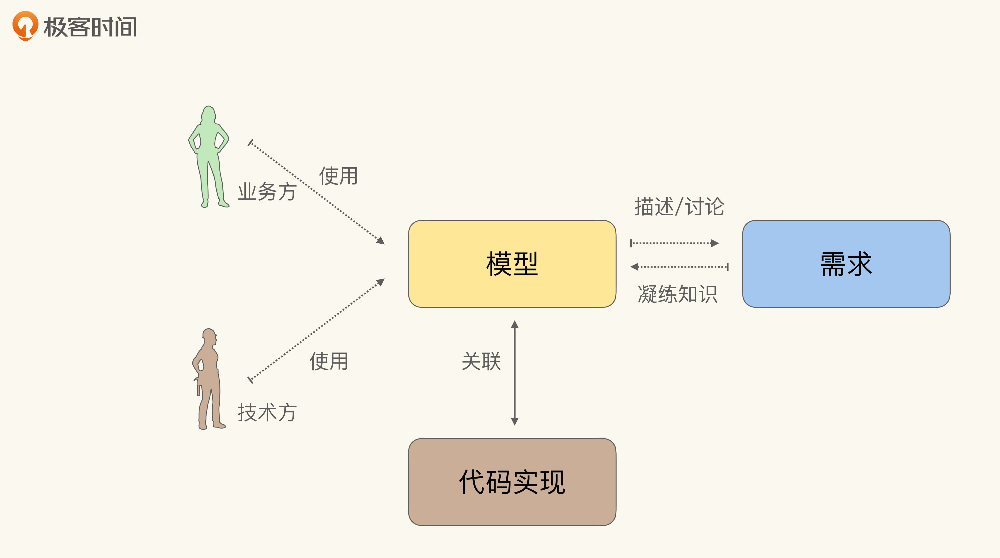
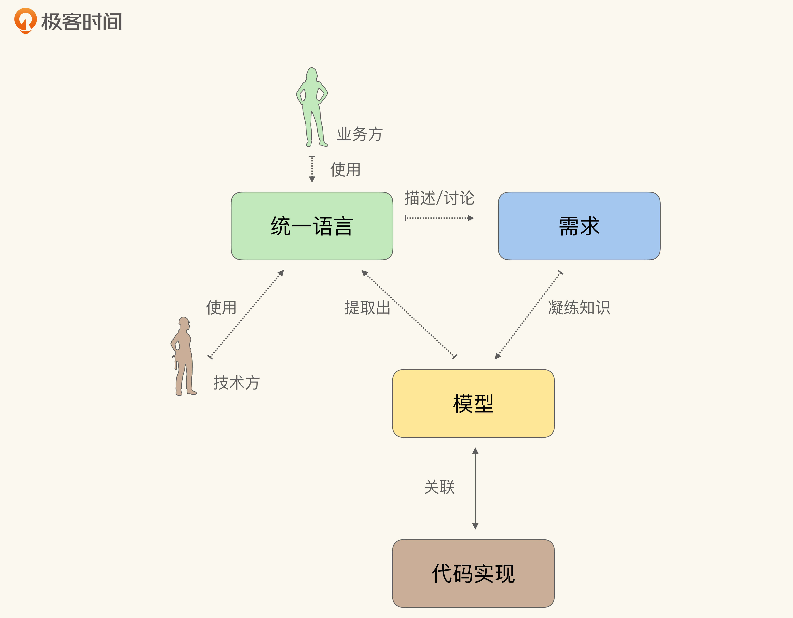
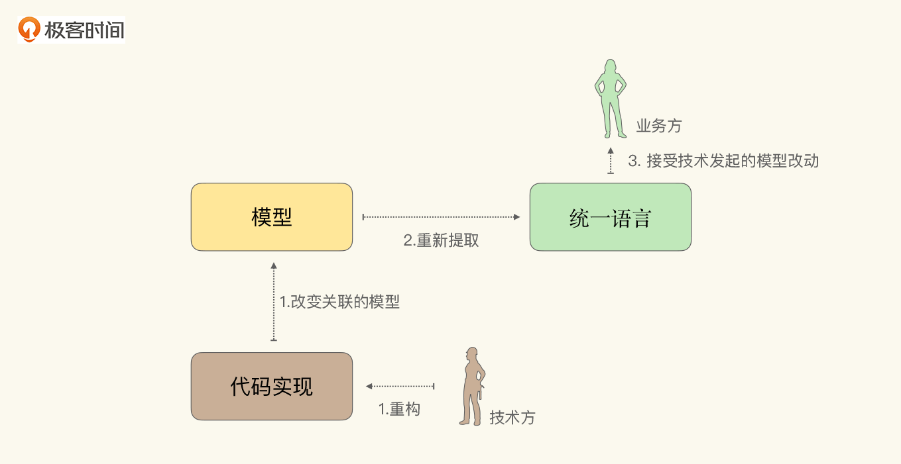
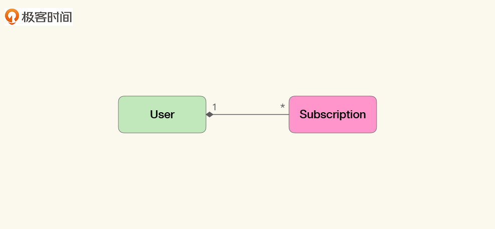
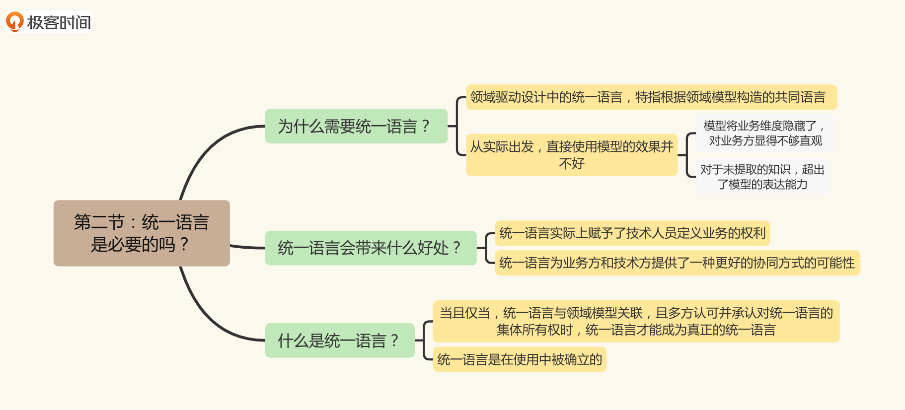
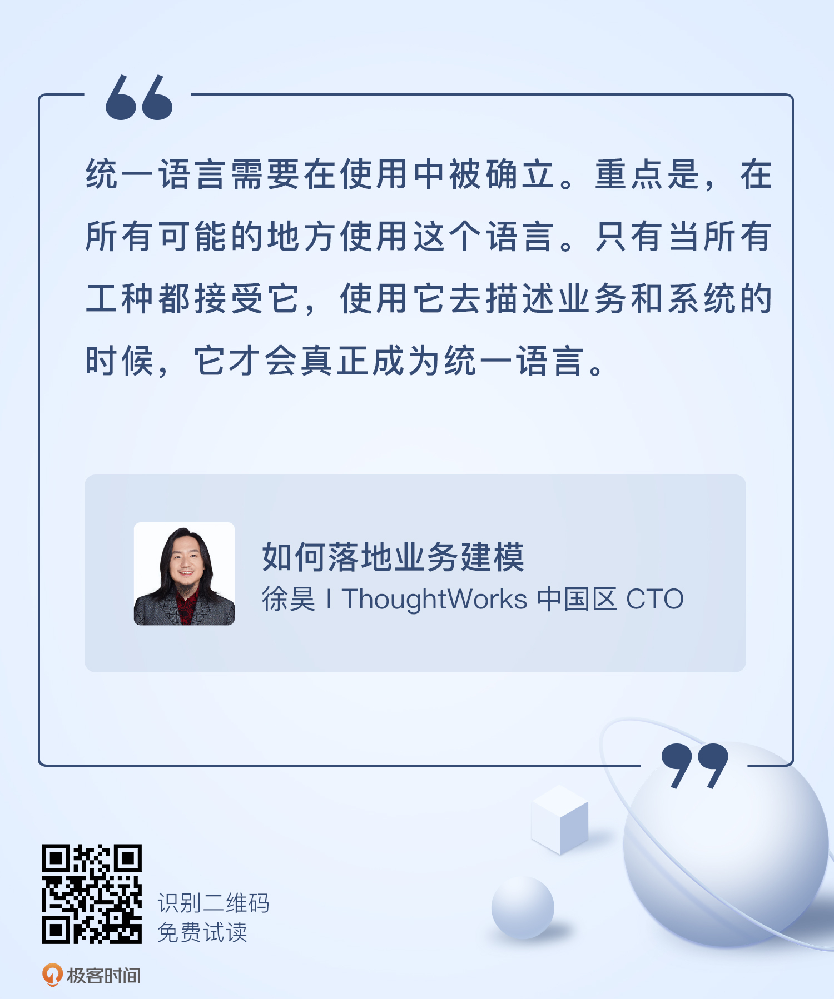

# 02｜统一语言是必要的吗？
你好，我是徐昊。今天我们来聊一聊领域驱动设计中的统一语言与模型的关联。

在上一讲，我们介绍了领域驱动设计的核心理念，即在业务系统中应该使用与问题域相关的模型，而不是通用的数据结构去描述问题。并由此介绍了Eric Evans提倡的知识消化，总结起来就是“两关联一循环”。

我们讲了第一个关联，那就是模型与软件实现的关联，并解释了为什么它是实践知识消化的前提。那么今天我们来讲第二个关联：统一语言与模型关联，也就是从模型中提取统一语言。

不过在讲具体做法之前，我们要先思考一下，为什么需要统一语言，以及统一语言会带来哪些好处。

## 统一语言是基于领域模型的共同语言

统一语言（Ubiquitous Language） **是一种业务方与技术方共同使用的共同语言**（Common Language），业务方与技术方通过共同语言描述业务规则与需求变动。可以说，共同语言为双方提供了协作与沟通的基础。注意，这里的业务方泛指一切非最终软件实现者，他们可能有很多名字：客户、产品、业务、业务分析师、解决方案架构师、用户体验设计师等等。

共同语言也有很多种形式。比如，用户画像（User Persona）与相关的用户旅程（User Journey） ，就能从流程角度有效地构成共同语言。再比如，数据字典（Data Dictionary）在很长的时间里，也是从软件实现侧形成共同语言的依据。

不过领域驱动设计中的 **统一语言，特指根据领域模型构造的共同语言**。这也是为什么要为它特意构造一个专有且生僻的词汇Ubiquitous Language，来和我们一般意义上的共同语言作出区分。

我们知道，领域驱动设计是一种模型驱动的设计方法。那么 **在理论的理想情况下，模型本身就应该是业务方和技术方讨论需求的基础**（如下图所示）。照此来看，这是不是就意味着统一语言是多余的呢？

通过图示可以看出，直接使用模型作为统一语言在实际操作中效果并不理想。

我们可以先从业务方和技术方各自所站的视角来分析一下。

如果站在研发人员的角度，直接使用模型有诸多好处。但是如果将视角切换到业务方，模型就不够直观了，业务方难以直接把模型和他们对系统的理解关联到一起。这主要是因为业务方看待系统的角度与开发人员不同。

业务方大多习惯从业务维度（Business Perspective），比如流程、交互、功能、规则、价值等出发去描述软件系统，这是业务方感知软件系统的主要途径。而 **模型则偏重于数据角度，描述了在不同业务维度下，数据将会如何改变，以及如何支撑对应的计算与统计**。那么，业务的维度就被模型的抽象隐藏了，业务方是无法从模型中直接感知到业务维度的。

此外，模型是从已知需求中总结提炼的知识，这就意味着模型无法表达未知需求中尚未提炼的知识。但是，单纯使用模型一定会有无法表述的需求，因而我们需要一个相对允许歧义与未知的隔离层，来帮助我们发现和反馈模型的不足。

更确切地说，我们需要 **一种能与模型关联的共同语言，它既能让模型在核心位置扮演关键角色，又能弥合视角差异，并提供足够的缓冲**。

从模型中提取的统一语言，覆盖了领域模型中的概念与逻辑，还提供必要的补充，以帮助业务方理解模型。同时，统一语言也扮演了试验田的角色，其中出现的未被提取的知识，将作为触发提炼知识的循环，逐步完善模型。因而，如下图所示，我们会在提炼知识的循环中使用统一语言，而不是模型。

再进一步说，不直接使用模型，也是领域驱动方法对其他模型驱动方法的反思。同样兴起于20世纪末21世纪初的模型驱动架构（Model Driven Architecture），就建议业务人员直接使用模型描述需求，然而并没有取得成功。因为 **相对于模型的精确，统一语言的模糊反而更能满足人与人之间交流的需求**。

因而，虽然理论上说可以不需要，但统一语言并不是多余的，它源自一线实践者的经验，是一种实证的智慧。

当然，经过了多年实践之后，最终我们还是借由不同的建模方法，能够几乎仅仅使用模型作为统一语言了，我会在第7-9讲为你介绍。不过在那日到来之前，我们还需要知道，统一语言带来的好处与改变，怎么提取统一语言，以及现在它是个什么样子。

## 修改代码就是改变统一语言

我们在讲关联模型与软件实现时，提到它的最终目的是达到这样一种状态：修改模型就是修改代码；修改代码就是修改模型。要知道，统一语言是从领域模型中提取的，包含了领域模型中的概念与逻辑。那么 **改变了模型，实际上也就改变了统一语言**。

于是， **修改代码就是修改模型，改变模型就是改变统一语言，修改代码等于改变统一语言**。这是一个强而有力的推论，因为它描述了这样一种可能的场景： **不是因为需求变更，而是因为代码重组与重构引起的代码修改，最终会反映到统一语言中，反映到我们应该如何理解并沟通的需求上去**（如下图所示）。

这相当于让开发方来定义业务问题，并要求业务方按照开发提出的模型来描述业务和需求。这听起来匪夷所思，但实际上这种情况每时每刻都在上演，只是身在其中的人并不自知而已。

**想想看，一旦将软件实现与领域模型关联，那么对实现的简化，也就是对领域问题的简化；从实现中抽取的抽象概念，也就是从问题域中抽取的抽象概念**。

通常的情况是，技术方通过代码不断修改实际的业务模型，但这种变化很难有效传递给业务方，于是这种变化就成为了“隐秘的角落”。同时，也很难让业务方以技术方改变后的业务概念去思考问题。最终导致双方互看不爽，分歧越来越大。

因此，看起来匪夷所思的情况，实际上一直都在发生。技术方一直都在定义业务，只是没有合理的途径让业务方了解并接纳而已。

不过统一语言及其背后的领域模型从观念上改变了这一状况，它将大家从各自的领地，也就是业务与技术中，拉到了一个中间地带。统一语言与领域模型既不完全属于业务，也不完全属于技术，而是双方共有的部分。于是技术方与业务方就有了差不多的话语权，至少有了可以沟通和协同的空间。

一旦业务方接受了统一语言，实际上就是放弃了对业务100%的控制权，也意味着统一语言在业务上能够赋予开发人员更大的控制权。这或许是出于Eric的故意设计，抑或是源于Eric对敏捷价值观的深刻认同，在有限的几次接触中，我并没有跟他求证过。但可以肯定的是， **统一语言实际上赋予了技术人员定义业务的权利**。

你可能会有疑问， **业务人员放弃对业务的100%控制权话语权不是一件坏事吗**？

正如前面所讲，在实际工作中，修改代码引起模型改变无可避免。因而无论业务人员是否愿意，他们对业务其实都没有100%的控制权。差别仅仅在于 **业务人员是否知晓这种改变，是否有机会验证这种改变在合理的方向上**。

可以说，统一语言给予了双方一种沟通和协商的途径。只不过，统一语言在给技术方带来额外的权利同时，也隐含着额外的义务，即 **借由统一语言，在提炼知识的循环中，接受业务方的监督与反馈**。如果业务方不同意技术方修改的模型，那么在后续提炼知识的循环中，可以修正这种误差，也就是技术人员也丧失了对代码100%的控制权。

看到这儿，你可能就明白了。除了将“隐秘的角落”公之于众外，模型还通过统一语言将开发视角的介入业务领域，为业务方带来有益的补充。毕竟跨行协作是创新的土壤，不是吗？

总结来说，统一语言提供了一种更好的协同方式的可能性。在业务方大多强势的环境中，难能可贵地建立了技术反馈业务的途径，降低了知识消化过程失败的风险。

听了这么多好处，我猜你肯定希望看到一个例子，以便直观地理解什么是统一语言。那么我在这里就展示一个简单的例子。

## 一个简单的统一语言提案

统一语言本身的形式并不重要，或者说统一语言并没有统一的形式，它甚至可以是任意一种形式。但是， **当且仅当，统一语言与领域模型关联，且多方认可并承认对统一语言的集体所有权时，统一语言才能成为真正的统一语言**。

统一语言必须是团队的共识，是团队成员愿意在工作中使用的语言。在经由那个神圣的社交时刻（social moment）之前，我更愿意将它称作 **统一语言提案**，以示与真正的统一语言的差别。毕竟在业务方与技术方都认可之前，它并不是统一语言。

统一语言可以包含以下内容：

- 源自领域模型的概念与逻辑；
- 界限上下文（Bounded Context）；
- 系统隐喻；
- 职责的分层；
- 模式（patterns）与惯用法。

我们仍然以极客时间专栏的模型为例，看看能提取出怎样的统一语言。由于目前这仍然是个很简单的模型，提取出来的语言可能无法包含上述所有内容，但能帮助你理解它，这就足够了。

根据这个模型，我们可以从中提取到对应的领域概念，也就是领域模型中的实体：

- 用户（User）是指所有在极客时间注册过的人；
- 订阅的专栏（Subscription）是指用户付费过的专栏。

同时由于User与Subscription之间的关系，我们可以提取一个业务逻辑：

- 用户可以订阅多个专栏。

除了源自领域逻辑的核心概念之外， **界限上下文、系统隐喻等其他几项都可以看作对业务维度的补充与展开。将它们引入通过统一语言后，可以帮助业务方更直观地理解模型**。

比如系统隐喻就是在价值与业务模式维度上的补充与扩展。我们经常会听到某某产品说，我们要做某某领域的淘宝，或者我们是某某行业的滴滴。这样言简意赅地表示了产品的愿景，也就是价值定位与核心模式。这些信息也应该放进统一语言中。类似的，责任分层关注“稳定性”，哪些是稳定而哪些是易变的；模式与惯用法是业务规则、流程与实现模式。

稍微需要额外提及一下的是 **界限上下文**（Bounded Context）。界限上下文是围绕某些模型设置的边界。所有人对于如何利用边界中的模型有清晰明确的想法，这个想法借由这个边界保持一致，不受外界信息的干扰。

这个定义稍微有点不好理解，实际上 **界限上下文是现实中某种决定在模型上的反映**。它可以是源自业务领域本身的，这时候界限上下文的范围就和子域（Subdomain）等概念所表示的范围重合了。比如，我们说这是订阅子域，因而存在一个叫做订阅的界限上下文。我们可以将界限上下文的名字放入统一语言：

- 订阅。

此外，界限上下文还可以表示其他一些有的没的。比如，如果用户（User）源自另外一个服务，或者遗留系统，我们没法修改它。于是我们可以建立一个界限上下文，叫 **“动不了”**，用来解释为什么会做出一些古怪的设计决定：“因为有的地方动不了”。我们需要在统一语言中加入这个界限上下文的名字，因为当我们说到“动不了”的时候，可能会指代这个上下文。

总的来说，界限上下文是万能的， **应用之妙存乎一心，关键在于你会不会用**。我建议你把它当个筐，不好解决的问题都扔进去就好了。

言归正传，我们现在抽取的语言是这样的：

- 用户（User），指所有在极客时间注册过的人；
- 订阅的专栏（Subscription），指用户付费过的专栏；
- 用户可以订阅多个专栏；
- 订阅。

通过定义与解释，我们使这些词语在其所使用的上下文中没有歧义。再通过这些基础词汇，去描述业务的行为或者规则，慢慢就可以将其确立为跨业务与技术的统一语言了。要始终记得， **统一语言是在使用中被确立的**。

那么这个语言该怎么用呢？除了在日常沟通中口头使用之外，比如还可以通过它来编写用户需求（以用户故事的形式）：

> 作为一个用户（User），当我查阅购买过的专栏（Subscription）时，从而可以看到其中的教学内容。

或是用它来描述行为驱动开发（Behaviour Driven Development）的测试：

> 当用户（User）已购买过了某个专栏（Subscription），那么当他/她访问这个专栏时，就不需要再为内容付费。

或是实例化需求（Specification by Example，SbE）的说明，等等。

重点是， **在所有可能的地方使用这个语言**。只有当所有工种角色都接受它，使用它去描述业务和系统的时候，它才会真正成为统一语言。

## 小结

我们来简单地总结一下。统一语言特指 **根据领域模型构造的业务方与技术方都使用的共同语言**。虽然在理想中，我们希望直接使用模型作为统一语言。但从实际出发，直接使用模型的效果并不好。

主要是两点：

- 模型将业务维度隐藏了，对业务方显得不够直观；
- 对于未提取的知识，超出了模型的表达能力。因而统一语言是非常必要的。

需要强调的是，统一语言提供了一种更好的协同方式的可能性。统一语言与其背后的领域模型赋予了研发人员通过重构定义业务的能力，在业务方大多强势的环境中，难能可贵地建立了技术反馈业务的途径，降低了知识消化过程失败的风险。

到这里，我们的“两关联一循环”就还剩最后一个环节：凝练知识的循环。我们下节课再见。

编辑小提示：为了方便读者间的交流学习，我们建立了微信读者群。想要加入的同学，戳此加入 [“如何落地业务建模”交流群](https://jinshuju.net/f/wjtvTP) >>>

## 思考题

通过两节课的介绍，我想你大概对于知识消化与领域驱动设计有了自己的理解，那么你会怎么跟别人介绍领域驱动设计？你认为领域驱动设计到底是什么呢？

欢迎把你的思考和想法分享在留言区，我会和你交流。同时，我也会把其中不错的回答在留言区置顶，供大家学习讨论。