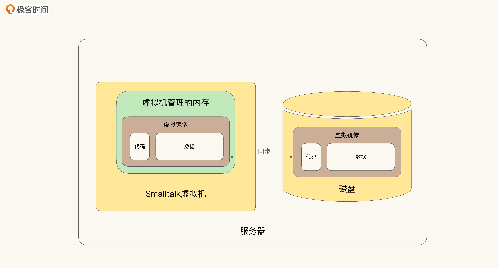
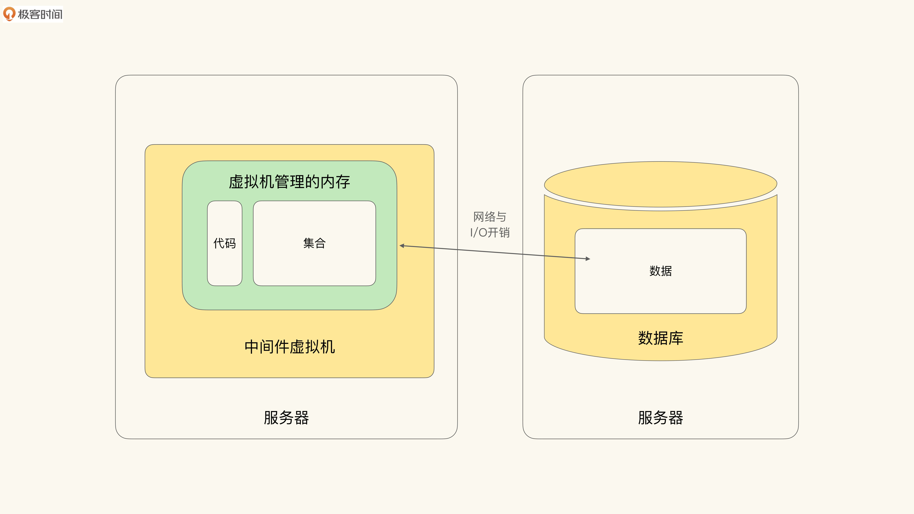
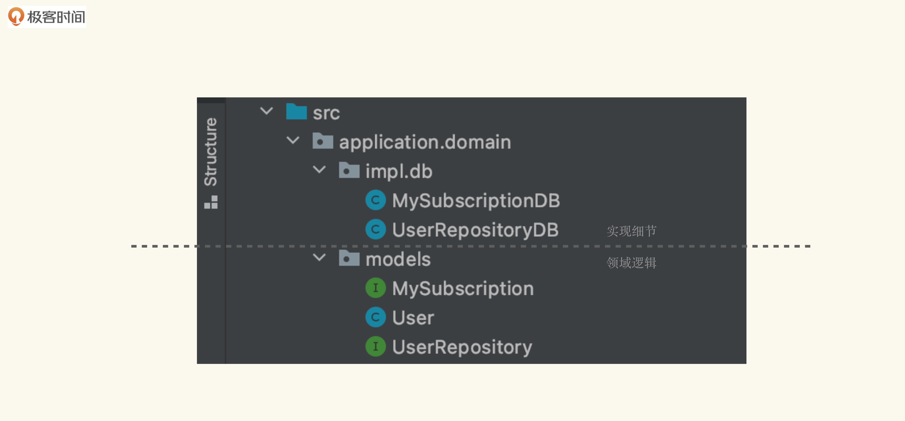
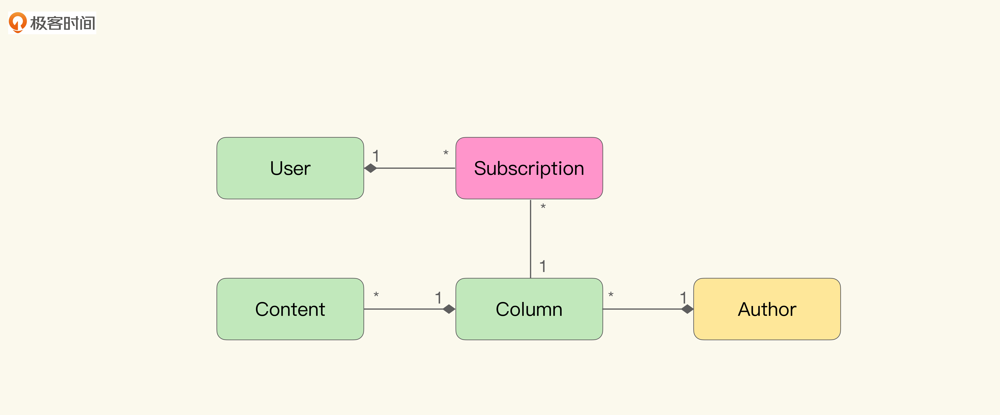
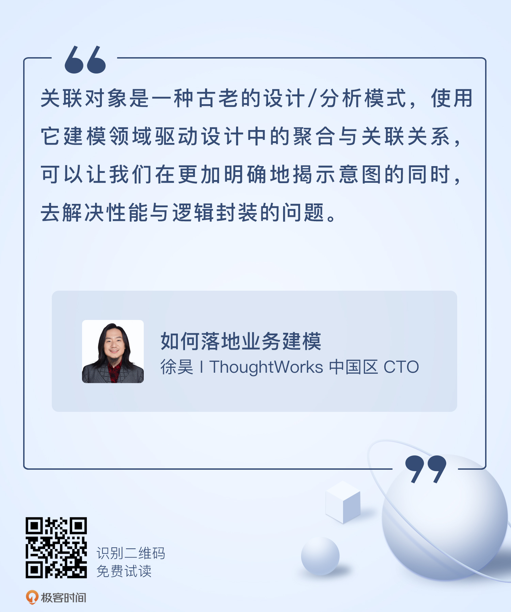

# 04｜跨越现实的障碍（上）：要性能还是要模型？
你好，我是徐昊。今天我们来聊聊通过关联对象（Assocation Object）建模聚合（Aggregation）。

在前面三节课，我们学习了领域驱动设计中的“两关联一循环”：模型与软件实现关联；统一语言与模型关联；提炼知识的循环。其中，统一语言与提炼知识的循环作为一种更为平衡的权责关系，促进了业务方与技术方更好的协作。而这一切又是以模型与软件实现关联为基础。

然而落地到实践中，关联模型与软件实现总有一些让人纠结与苦恼的地方。引起这些苦恼的主要原因是 **架构风格的变化**。我们已经从单机时代过渡到了多层单体架构，以及云原生分布式架构，但我们所采用的建模思路与编程风格并没有彻底跟上时代的步伐，这种差异通常会以 **性能问题** 或是 **代码坏味道** 的形式出现。

如果我们想要真正发挥出领域驱动设计的作用，就需要 **在不同架构风格下，找到能够维持模型与软件实现统一的办法**。这也是这个领域常看常新，总能产生新实践的原因。

因而接下来，我会用三节课来介绍一组实现模式，帮助我们应对从单机架构过渡到多层架构，保持模型与软件实现的关联。这些模式也是我们后面学习在微服务和云原生时代，实施领域驱动设计方法的基础。

今天这节课，我们就先从关联对象这一方法开始讲起。关联对象是一个古老的设计/分析模式，Martin Fowler在 [《分析模式》](https://book.douban.com/subject/4832380/) 中讨论过它。Peter Coad将它视为一种常见的业务构成模式，并应用到业务分析中。而我大概从2005年开始，使用它建模领域驱动设计中的聚合与关联关系，以解决领域模型（Domain Model）中对技术组件的封装问题。

不过，在讲解到关联对象的具体做法之前，我们需要先看一下 **领域驱动设计中的聚合关系在具体实现中存在哪些问题**。了解了问题所在，我们才能更有针对性地去寻找解决办法。

## 无法封装的数据库开销

在应用领域驱动设计的时候，聚合与聚合根（Aggregation Root）是构成“富含知识的模型（Knowledge Rich Model）”的关键。通过聚合关系，我们可以将 **被聚合对象的集合逻辑放置于聚合/聚合根里，而不是散落在外，或是放在其他无关的服务中**。这么做可以使得逻辑富集于模型中，避免“逻辑泄露”。

不过落到具体实现上，我们经常会遇到这样一个挑战，即： **这些被聚合的对象，通常都是被数据库持久化**（Persistent） **的集合**（Collection）。也就是说，数据库系统的引入，网络I/O与其他性能开销无法被接口抽象隔离。而将具体技术实现引入领域模型，则有悖领域驱动设计的理念。

接下来，我们就通过一个例子，在具体的上下文中看一看存在什么问题。然后，再看一下这个问题在建模思路上产生的根源，以及要如何修正我们的建模思路。

### 集合遍历与N+1

让我们再回到在 [第二讲](https://time.geekbang.org/column/article/387945) 里展示的极客时间专栏的例子：

```
class User {

   private List<Subscription> subscriptions;

   // 获取用户订阅的所有专栏
   public List<Subscription> getSubscriptions() {
     ...
   }

   // 计算所订阅的专栏的总价
   public double getTotalSubscriptionFee() {
     ...
   }
}

class UserRepository {
  ...
  public User findById(long id) {
    ...
  }

```

按照面向对象和领域驱动设计提倡的做法，User作为聚合根，需要管控其对应的Subscription。现在我们有一个简单且常见的需求：在页面上，显示对用户已经订阅过的专栏进行分页处理。那么，我们大概会这么写：

```
user.getSubscriptions().subList(from, from + pageSize);

```

可以发现，在这段代码里，我们假设所有的Subscription都在内存里，因此所有的计算与逻辑都可以在内存中完成了。那么，我们就需要在读取User的时候，将它对应的所有订阅过的专栏信息都从数据库读取到内存中，以便后续使用。

如果是少量订阅的场景，比如几个或者几十个，那这段代码并没有什么问题。但如果有个特别好学的人，买了几万甚至几百万个专栏呢（先假设专栏有无限个）？此时将所有订阅过的专栏都读取到内存里，这就意味着会有巨大的网络I/O开销和内存占用。

当然，这里你可能会说，JPA/Hibernate等ORM提供了延迟加载啊。是的，但这又会引入 **经典的性能瓶颈N + 1问题**。因为随着延迟加载集合的遍历，其中的Subscription对象会被依次加载。

延迟加载的实现流程是这样的：

- 先执行一条查询获取集合的概况。比如总共有多少条记录之类的信息。
- 然后根据概况信息，生成一个集合对象。这时候集合对象基本上是空的，不占用什么内存空间。
- 随后，当我们需要集合内的具体信息的时候，它再根据我们需要访问的对象，按需从数据库中读取。

理论上讲，这是为了避免一次性读入大量数据带来的性能问题，而提出的解决办法。

然而，如果需要获取所有的数据，那么我们总共就会有N+1次数据库访问：1次是指第一次获取概况的访问，N次指而后集合中N个对象每个一次。而每一次加载，都伴随着对数据库的访问，自然就会带来I/O与数据库的开销。特别是频繁地对数据库访问，可能会阻塞其他人，从而造成性能瓶颈。

在这种情况下，我们其实没有什么好的选择： **要么是一次性读入全部数据，避免N + 1问题；要么是引入N+1问题，变成钝刀子割肉**。

为了避免这两种情况，很自然地，你会想起这样一种做法：通过查询语句一次性定位所需分页，这样只需要一次查询就能解决问题。不过这么做的困难在于， **分页查询的逻辑要放在哪个对象上，才能保持模型与软件实现的关联**。

一种做法是 **为订阅**（Subscription） **构造一个独立的Repository对象**，将逻辑放在里面（也是Spring推荐的做法）：

```
interface SubscriptionRepository extends ... {
  public Page<Subscription> findPaginated(int from, int size);
}

```

这种做法的问题就是会导致 **逻辑泄露**。Subscription被User聚合，那么User所拥有的Subscription的集合逻辑应该被封装在User中，这样才能保证User是“逻辑丰富的模型”，因为 **非聚合根提供Repository是一种坏味道**。

如果聚合到User上是可行的吗？其实也不行。因为这么做会将技术实现细节引入领域逻辑中，而无法保持领域逻辑的独立。代码如下：

```
public class User {
    public List<Subscription> getSubscriptions() {
      ....
    }

    public List<Subscription> getSubscriptions(int from, int size) {
       return db.executeQuery(....);
    }
 }

```

造成这种两难局面的根源在于， **我们希望在模型中使用集合接口，并借助它封装具体技术实现的细节**。因为在我们的概念中， **内存中的集合与数据库是等价的，都可以通过集合接口封装**。但实际情况是，我们无法忽略数据库带来的额外作用与开销，内存中的集合与数据库并不是等价的，封装失败。

那么，为什么在我们的概念中，我们会认为内存中的集合与数据库是等价的，是可以通过集合接口封装的呢？这就要从面向对象技术的开端——Smalltalk系统说起了。

### Smalltalk中集合与数据库是等价的

鲜少有人了解的一个事实是， **集合与数据库的等价，在早期面向对象系统Smalltalk中是一个基础概念**。

这其实不难理解，如果对象中包含的状态可以映射为数据库表中的一列，那么一组对象自然就可以映射成一张表了。有了一张表，自然也就可以看作是一个最小的数据库了。

Smalltalk作为面向对象系统内置的一套 **面向对象数据库**（Object Oriented Database）。于是在使用Smalltalk系统时，集合与数据库是无差别的。如下图所示，展示了Smalltalk系统的构成。



如上图所示，Smalltalk中除了虚拟机（Virtual Machine）之外，还有虚拟镜像（Virtual Image，VI）。 **虚拟镜像相当于虚拟机内存的持久化保存**。每次虚拟机启动的时候，都会把虚拟镜像中的信息读入到内存中以恢复状态，而Java、.NET虚拟机并不会保留之前内存中的信息。

打个比方。Smalltalk虚拟机的启动过程，类似于VMWare虚拟机上的Pause，内存中的所有状态都被持久化保存了，那么我们可以继续从之前暂停的地方开始。而其他语言的虚拟机则是彻底地重启（Restart），并不会保留之前的结果。

在Smalltalk的虚拟镜像中，存储着所有的代码和数据。我们称呼Smalltalk为一个面向对象系统，而不仅仅是面向对象语言。因为它既是一门面向对象语言，也是一个虚拟机的操作系统，还是一个面向对象数据库。

那么在这样的系统中，Smalltalk中的集合（无论是Array、List，还是什么）就等同于一个数据库。只要这个集合被创建出来，除非显示化地通过垃圾回收销毁，否则它就会被虚拟镜像持久化。 **垃圾收集和持久化一样，都可以被看作是对象生命周期**（Object Lifecycle） **的一个状态**。

因此，数据库中的数据和非数据库中的数据，都可以通过Collection表达，我们不用再去区分它。而在Smalltalk中，这种等价关系深刻影响了我们的思路和建模习惯，毕竟我们所熟知的面向对象语言都从Smalltalk中借鉴了大量的概念。而早期的建模者也大都来自Smalltalk社区，比如Peter Coad、Kent Beck、Martin Fowler等（当然我也是）。所以我们学习建模方法的时候，或多或少有一些源自Smalltalk社区的习惯。

然而随着时代的发展，这种习惯在多层架构（Mulit-tier Architecture）下遇到了挑战。那么接下来我们就看看多层架构是怎么彻底割裂了集合与数据库的。

### 多层架构彻底割裂了集合与数据库

Smalltalk在中国未曾真正地流行过，大多数人是从C++甚至是Java、.NET开始接触面向对象编程的。而无论是C++、Java，还是后来的面向对象编程语言，其实都不是完整的面向对象系统。

集合作为面向对象中的重要概念，被吸纳入这些语言后，就去掉了与数据库的强关联（毕竟这些语言默认不带有数据库模块）。因此，集合虽然在概念上仍然等同于数据库，但如此简单粗暴的建模，就会遇到我们前面提到的“是否N+1”的两难选择。

那么Java、.NET这些语言为什么要这么做呢？它们为什么不能像Smalltalk一样，内涵完整地面对象数据库呢？这其实是架构风格演化的结果。

我们明显可以发现， **Smalltalk是典型的单机单体架构**。从操作系统、数据库到应用程序，都在一个虚拟机上，就好像是一台小型机一样。这样的 **架构结构无法水平扩展**（horizontal scaling） **，只能垂直扩展**（vertical scaling）。这就意味着我们需要 **不断提高单点的计算能力，才能提高整个的容量与吞吐**。这并不符合架构的整体发展趋势。

进入21世纪后，随着对系统容量要求的增加，易于水平扩展的三层架构逐渐成为行业主流。而数据库作为一个独立组件，则不再与应用合体。示意图如下：



于是，Smalltalk的面向对象系统在这种架构下分别变成了：应用程序中间件（对应Smalltalk虚拟机）和数据库（对应Smalltalk虚拟镜像的持久化数据部分）。

多层架构彻底割裂了对象集合与数据库，这对我们实现领域模型建模提出了挑战，对Collection逻辑的建模也就难以摆脱具体实现细节了。那就是我们 **必须明确哪些是持久化的数据，并对它的一些逻辑区别对待**。这就是原味面向对象范型（Vanilla Object Oriented），在架构风格演化过程中遇到的挑战。

几乎所有实施过DDD的人，都在这个问题上挣扎过。如果对于如此常见且如此简单的分页功能，我们都无法将模型与软件实现关联的话。那么，面对更复杂的问题时我们要怎么办呢？这是大多数怀揣理想准备实施DDD的人，碰到的第一个阻碍。

关联对象就是一种解决这个问题的设计模式。

## 关联对象

**关联对象**，顾名思义，就是 **将对象间的关联关系直接建模出来，然后再通过接口与抽象的隔离，把具体技术实现细节封装到接口的实现中**。这样既可以保证概念上的统一，又能够避免技术实现上的限制。

现在让我们再来看看极客时间专栏的例子，如果使用关联对象，如何帮我们避免N+1和逻辑泄露的问题。

### 使用关联对象实现聚合关系

首先我们需要定义关联对象，因为我们需要表达的是User与Subscription间的一对多的关系，那么最简单的命名方法是将两个对象名字组合，从而得到关联对象的名字UserSubscriptions：

```
public interface UserSubscriptions extends Iterable<Subscription> {
   List<Subscription> subList(int from, int to); //分页
   double getTotalSubscriptionFee(); //获取总共花费
   int count(); //获取总订阅数
   Iterable<Subscription> sort(...);
   ....
}

```

当然，我们最好是从业务上下文出发，寻找更具有业务含义的名字，毕竟我们是要形成统一语言的，源自业务的名字总是更容易被非技术角色所理解。

比如这里我们要表达的是用户已经订阅的专栏，或者是用户已经购买的专栏，那么PaidColumn，甚至MySubscriptions，都不错，看哪一个更容易被团队接受了。我这里选择MySubscriptions，于是User对象就变成了这样：

```
public interface MySubscriptions extends Iterable<Subscription> {
...
}

public class User {
  private MySubscriptions mySubscriptions;

  public MySubscriptions getMySubscriptions() {
     return mySubscriptions
  }
}

```

那么之前对于分页和计算的调用也就相应地变为：

```
user.getMySubscriptions().subList(0, 10);
user.getMySubscriptions().getTotalSubscriptionFee();

```

很明显，我们没有逻辑泄露，User是Subscription的聚合根，那么与之相关的逻辑也仍然被封装在User的上下文中，当然是进一步被封装在关联对象中。

那么我们怎么解决持久化的问题呢？怎么从领域对象中，移除掉对技术实现的依赖呢？秘诀就在于 **接口与实现分离**。代码如下：

```
package model.impl.db;

public class MySubscriptionsDB implements MySubscriptions {
  ...
  private User user;

  public List<Subscription> subList(int from, int to) {
    return db.executeQuery(...);
  }
  ...

```

在这里，我们将与数据库访问相关的逻辑毫不避讳地封装到MySubscriptionsDB中。不过，作为领域对象的User类，并不会知道它使用了数据库，因为它仅仅通过MySubscriptions接口，访问它所需要的功能。此时我们可以通过简单的分包的策略：



从上图中包的架构上看，模型的包中有MySubscriptions、User、UserRepository。与数据库相关的代码的包里有MySubscriptionsDB和UserRepositoryDB。于是，我们成功地将核心的领域逻辑与实现细节分开了。

当然最后还有一个问题： **如何将MySubscriptionsDB与User结合在一起**？最直接的做法就是这样：

```
public UserRepositoryDB implements UserRepository {
  ...
  public User findBy(long id) {
      User user = .....;
      return setMySubscription(user);
  }

  public List<User> findBy(....) {
      List<User> user = .....;
      return user.map(user -> setMySubscription(user));
  }

  private User setMySubscription(User user) {
      user.setMySubscriptions(new MySubscriptionDB(db, user));
      return user;
  }
}

```

因为User是聚合根，从数据库中读取的User对象都需要从UserRepository中获取。那么，在UserRepository的具体实现中为User对象设置MySubscription对象，是再自然不过的选择了。

当然更简洁漂亮的做法，是通过Java CDI API或是框架提供的生命周期实践监听器，来完成关联对象的设置。

### 隔离技术实现细节与领域逻辑

通过引入关联对象，我们可以更好地隔离领域逻辑与技术实现细节。在这里，我们还是用极客时间专栏的例子来解释。

如果这时候Subscription信息并不是存在数据库中，而是通过RESTful API从另一个系统中获取的。那么，我们只需提供另一个MySubscriptions的实现就可以了：

```
package model.impl.api;

public class MySubscriptionsAPI implements MySubscriptions {
  ...
  private User user;

  public List<Subscription> subList(int from, int to) {
    return client.findSubscriptions(....);
  }
  ...

```

这种改变并不会传递到领域逻辑层，对于分页和计算的调用仍然为：

```
user.getMySubscriptions().subList(0, 10);
user.getMySubscriptions().getTotalSubscriptionFee();

```

RESTful API的性能瓶颈和需要调整的地方与数据库不同，这种变化都被关联对象的接口封装隔离了。

从面向对象编程的角度来说，我们很容易理解为什么关联对象可以带来如此多的好处。在诸多面向对象的最佳实践中，有一条是说要尽可能避免使用原始类型（primitive type）。因为原始类型没有对概念进行提取，也缺乏封装，所以我们应该尽可能地使用自定义的类去替换它们。

不过如果我们把语言内提供的集合类型（List等）也当作原始类型的话，关联对象就是对这一条建议自然的扩展： **使用自定义关联对象，而不是集合类型来表示对象间的关联**。

### 通过集体逻辑揭示意图

关联对象除了可以帮助聚拢逻辑、隔离实现细节之外，还能从概念上帮助我们获得更好的领域模型，因为关联对象是对集体逻辑的直接建模。

所谓 **集体逻辑，是指个体不具备，而成为一个集体之后才具备的能力。哪怕是同一群个体，组成了不同的集体，就会具有不同的逻辑**。

我们仍然回到极客时间专栏的例子上，来帮助你理解。比如我们现在的模型是这样的：



```
public class User {
   private List<Subscription> subscriptions;

   ....
}

public class Column {
    private List<Subscription> subscriptions;

    ....
}

```

在这段代码中，User中的List表示用户已订阅的所有专栏，而Column中的List，则表示所有订阅了专栏的用户。虽然同为Subscription的集合，但是当它们组成集体时，在不同的上下文中则具有不同的含义。

那么如果显式地表达为关联对象，可以进一步澄清我们的意图，得到揭示意图的接口（Intention Revealing Interface）。代码如下：

```
public class User {

   public static interface MySubscriptions extends Iterable<Subscription> {
   ...
   }

   private MySubscriptions mySubscriptions;

   ...
}

public class Column {

    public static interface MyReaders extends Iterable<Subscription> {
    ...
    }

    private MyReaders myReaders；

    ..

```

在这段代码中，我们通过引入关联对象，可以将这两个不同的集体变更为User.MySubscriptions和Column.MyReaders，然后在各自的上下文去定义不同的集体逻辑。

比如我订阅的专栏可以计算我一共付了多少钱，而在我的读者中，可以计算订阅者对专栏的平均打分情况，示意代码如下：

```
public static interface MySubscriptions extends Iterable<Subscription> {
  double getTotalFee();
}

public static interface MyReaders extends Iterable<Subscription> {
  double getAverageRating();
}

```

## **小结**

我们来简单地总结一下。随着架构风格的演化与改变，面向对象技术中的集合，从与数据库完全等价，变成了与数据库完全割裂的东西。

然而在概念上，我们仍留有 **通过集合封装内存中的对象与数据库中的数据** 的习惯。这使得我们在使用领域驱动设计的时候，特别是使用聚合关系的时候，变得左右为难： **要么放弃性能，获得更好的模型；要么泄露逻辑，以得到可接受的性能**。

但是关联对象，则可以让我们在更加明确揭示意图的同时，去解决性能与逻辑封装的问题。我个人从很早就开始将关联对象作为实现聚合关系的默认方法了，它从未让我失望（it never fails me）。我建议你也试一试，这样我就不用给你解释什么叫惊喜了。

编辑小提示：为了方便读者间的交流学习，我们建立了微信读者群。想要加入的同学，戳此加入 [“如何落地业务建模”交流群](https://jinshuju.net/f/wjtvTP) >>>

## 思考题

关联对象实际上是通过将隐式的概念显式化建模来解决问题的，这是面向对象技术解决问题的通则：永远可以通过引入另一个对象解决问题。那么在领域模型中还有哪些隐式概念呢？这些概念会给我们带来什么麻烦呢？



欢迎把你的思考和想法分享在留言区，我会和你交流。同时呢，我也会把其中一些不错的回答置顶，供大家学习。