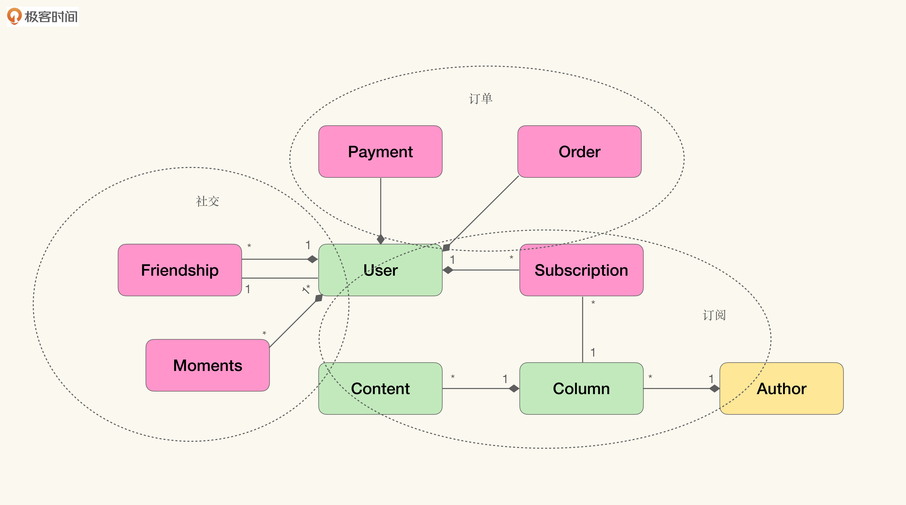
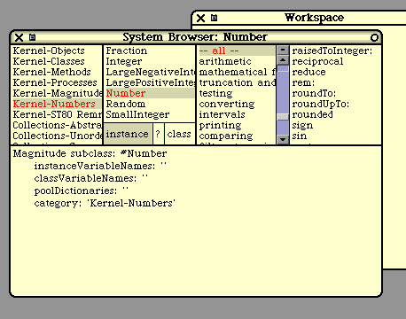
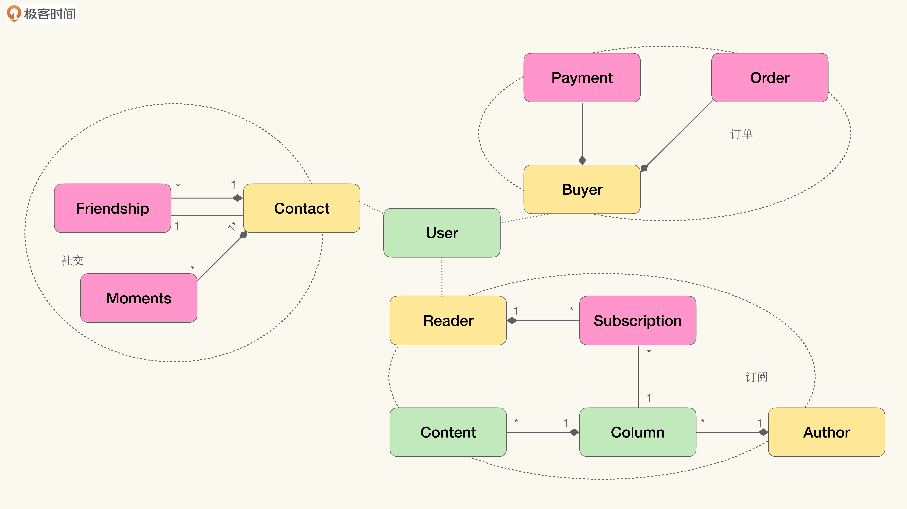

# 05｜跨越现实的障碍（中）：富含知识还是代码坏味道？
你好，我是徐昊。今天我们来聊聊如何有效地分离领域模型中的上下文。

上节课我们介绍了关联对象，以及如何通过关联对象建模聚合/关联关系，从而在不影响性能的情况下，更好地维持领域模型与软件实现的统一。

今天，我们来看另一个在关联领域模型与软件实现时经常遇到的问题：上下文过载（Context Overloading）。所谓 **上下文过载**，就是指 **领域模型中的某个对象会在多个上下文中发挥重要作用，甚至是聚合根**。一来这个对象本身会变得很复杂，造成模型僵化；二来可能会带来潜在的性能问题。

于是，将过载的上下文进行有效的分离，就成了我们现在需要面对的问题。方法上也有很多不同的选择，我主要介绍 **角色对象**（Role Object）和 **上下文对象**（Context Object）这两种。这两个方法与我们上节课讲的关联对象一脉相承，都是通过将隐含概念显式建模来解决问题。

同样地，在看到具体的解决方法之前，我们需要深入了解上下文过载会产生哪些问题。

## 因富含逻辑而产生的过大类

为了帮助你理解上下文过载会产生哪些问题，我还是借助极客时间专栏的例子来说明一下。当然，首先我们需要扩展这个领域模型。



在这个扩展了的模型中，包含了三个不同的上下文。

1. 订阅：用户阅读订阅内容的上下文，根据订阅关系判断某些内容是否对用户可见；
2. 社交：用户维护朋友关系的上下文，通过朋友关系分享动态与信息；
3. 订单：用户购买订阅专栏的上下文，通过订单与支付，完成对专栏的订阅。

按照这个模型，我们很容易得到与之对应的“富含知识的模型”：

```
public class User {
    private long id;

    // 社交上下文
    private List<Friendship> friends;
    private List<Moments> moments;

    // 订阅上下文
    private List<Subscription> subscriptions;

    // 订单上下文
    private List<Order> orders;
    private List<Payment> payments;

    // 社交上下文
    public void make(Friendship friend) {
      ...
    }

    public void break(Friendship friend) {
      ...
    }

    // 订单上下文
    public void placeOrder(Column column) {
      ...
    }

    // 订阅上下文
    public boolean canView(Content content) {
      ...
    }
}

```

如果对代码坏味道敏感的同学，估计已经发现问题所在了： **一个对象中包含了不同的上下文**，而这恰好是 **坏味道过大类**（Large Class）的定义。

那么过大类会带来什么问题呢？首当其冲是 **模型僵硬**。想要理解这个类的行为，就必须理解所有的上下文。而只有理解了所有的上下文，才能判断其中的代码和行为是否合理。

于是， **上下文的过载就变成了认知的过载**（Cognitive Overloading）， **而认知过载就会造成维护的困难**。通俗地讲，就是 **“看不懂、改不动”**，代码就变成“祖传代码”了。

但是我们不要忘了，这是与模型关联的代码啊！ **改不动的代码就是改不动的模型**！改不动的僵硬的模型，要怎么参与提炼知识的循环呢？

当然，过大类还容易滋生重复代码、引入偶然耦合造成意外的缺陷等编码上的问题。不过这些问题与模型僵硬比起来，似乎有点不值一提。

另一个问题没那么严重，但同样值得重视，这个问题仍然与性能有关。在不同的上下文中，我们需要访问的数据也不尽相同。

比如在维护朋友关系、发布动态信息时，我们不太可能访问订阅与订单信息。类似的，当我们访问订单信息的时候，也不太可能关注朋友信息。那么，当所有的上下文都汇聚于User时，我们怎么才能获得一个高效的聚合加载策略呢（当然通过关联对象我们能缓解这个问题，具体请看上一课）？

**这里的吊诡之处在于，我们并没有做什么坏事，反而是因为严格遵照“富含知识的模型”的原则，才导致了上下文过载**。

我们来分析一下。User在不同的上下文中都处在聚合根的位置：

- 在订阅上下文中，User是Subscription的聚合根；
- 在订单上下文中，User是Payment和Order的聚合根；
- 在社交上下文中，User是Friendship和Moments的聚合根。

根据构建“富含知识模型”的做法，被聚合对象的集合逻辑放置于聚合/聚合根里，而不是散落在外，或是放在其他无关的服务中。这么做可以使得逻辑富集于模型中，同时有利于通过聚合关系管理一组对象与领域概念的映射，保持领域概念与逻辑的完整性。

那么，每当User在不同的上下文中处于聚合/聚合根位置的时候，与之相关的逻辑都会进入User中，User会不可避免地膨胀。这就是上下文过载。

又要再说一句题外话了。在使用原味面向对象范型（Vanilla Object Oriented）的时候，不自觉地就会产生过大类，这其实也跟Smalltalk有关。正如我们上节课所讲，Smalltalk是一个面向对象系统，其中还包含一个IDE： **System Browser**。



在Smalltalk中，源代码并不以文本格式作为主要表达形式，而是通过一个图形化的界面，让我们有指导性地、片段式地浏览对应的代码。上图中左起第三个窗口就是自定义的上下文。也就是说，即使对象中存在再多的上下文，也不会影响我们对代码的理解和修改。毕竟上下文再多，我们也不会一次看到多个方法的具体实现代码。

如果你用过Eclipse IDE开发Java项目的话，那么这里肯定有一个不那么有用的古怪的视图，让你百思不得其解。但如果你对这张图和上面Smalltalk System Browser有点了解的话，就能从布局中看出一些端倪。


这其实是Eclipse对Smalltalk的致敬。毕竟，Eclipse也算是传奇Smalltalk程序员Kent Beck的作品。但当我们以文本作为源代码的主要形式，以类作为源代码的主要组织方式时，仅仅通过视图的切换是无法达成Smalltalk的效果的。于是，过大类的上下文过载就成了一个严重的问题。

## 逻辑汇聚于上下文还是实体？

上下文过载问题最根本的症结在于， **逻辑是需要汇聚于实体**（User） **还是上下文**（订阅、社交与订单）。

原味面向对象范型（也是领域驱动设计的默认风格）的答案是汇聚于实体，但是缺少有效分离不同上下文的方式。而DCI范型（Data-Context-Interaction，数据-上下文-交互）要求汇聚于显式建模的上下文对象（Context Object），或者上下文中的角色对象（Role Object）上。如果按照DCI范型的思路，我们可以如下图这样建立模型：



这其实也很容易理解。 **在不同的上下文中，用户是以不同的角色与其他对象发生交互的，而一旦离开了对应的上下文，相关的交互也就不会发生了**。

这与我们生活中的体验是一致的。上班时，以员工的身份发生的工作活动与交互，下班之后其实可以不用发生了。因为已经脱离了工作这个上下文，不再扮演这个角色了。同样的，在生活中的以其他身份发生的活动与交互，在工作中也不该发生。

也就是说，在订阅上下文中的读者（Reader），不会以读者的身份与订单上下文中的支付信息发生交互。而买家（Buyer），也不会以买家的身份去社交上下文中去建立朋友关系。

从DCI的角度看待聚合与聚合根关系，我们可以发现，并不是User聚合了Subscription，而是订阅上下文中的Reader聚合了它。同时，并不是User聚合了Friendship与Moments，而是社交上下文中的Contact聚合了它们。可以说， **User只是恰好在不同的上下文中扮演了这些角色而已**。

理清了这一层关系，我们也就发现了上下文过载的根源： **实体在不同的上下文中扮演的多个角色，再借由聚合关系，将不同上下文中的逻辑富集于实体之中，就造成了上下文过载。**

明白这一点，解决方案也就呼之欲出了：针对不同上下文中的角色建模，将对应的逻辑富集到角色对象中，再让实体对象去扮演不同的角色，就能解决上下文过载的问题了。

当然，理想永远是清晰且美好的，在实践中却没有这么简单，主要是 **如何在代码中实现这种实体与角色间的扮演关系**。

## 通过角色对象分离不同上下文中的逻辑

一个最简单的想法是，将角色抽象成接口：

```
//阅读上下文
interface Reader {
    List<Subscription> getSubscriptions();

    boolean canView(Content content);
}

//订单上下文
interface Buyer {
    List<Order> getOrders();

    List<Payment> getPayments();

    void placeOrder(Column column);
}

//社交上下文
interface Contact {
    List<Friendship> friends;

    List<Moments> moments;

    void make(Friendship friend);

    void break(Friendship friend);

```

然而，这实际上并没有解决什么问题：

```
public class User implements Reader, Buyer, Contact {
    // 社交上下文
    public void make(Friendship friend) {
      ...
    }

    public void break(Friendship friend) {
      ...
    }

    // 订单上下文
    public void placeOrder(Column column) {
      ...
    }

    // 订阅上下文
    public boolean canView(Content content) {
      ...
    }
}

```

通过实现接口去完成角色扮演，得到的代码其实没什么差别。虽然借助当代IDE，我们可以较容易地判断行为来自哪个上下文，但实际得到的改善极其有限。既然接口不好用的话，另一个思路就是通过 **装饰器**（Decorator），我们可以构造一系列角色对象（Role Object）作为User的装饰器：

```
public class Reader {
    private User user;
    private List<Subscription> subscriptions;

    public Reader(User user) {
        ...
    }

    // 订阅上下文
    public boolean canView(Content content) {
      ...
    }
}

public class Buyer {
    private User user;

    private List<Order> orders;
    private List<Payment> payments;

    public Buyer(User user) {
        ...
    }

    // 订单上下文
    public void placeOrder(Column column) {
      ...
    }
}

public class Contact {
    private User user;

    private List<Friendship> friends;
    private List<Moments> moments;

    public Contact(User user) {
        ...
    }

    // 社交上下文
    public void make(Friendship friend) {
      ...
    }

    public void break(Friendship friend) {
      ...
    }

```

我们很容易地将不同上下文中的行为与逻辑富集到对应的角色对象中，并且与领域模型中的概念完全对应起来。然而这里还有最后一个问题，就是 **如何构造这些装饰器对象。**

从代码中我们可以看到，除了行为之外，我们将对应的聚合与关联关系也都富集于角色对象里了，而这些被聚合的对象极大可能是被持久化在数据库中的数据。所以，简单的调用构造函数，并不能保证我们能从数据库中有效地读取这些数据：

```
User user = repository.findById(....);

Buyer buyer = new Buyer(user); // 内存中构造角色对象
Reader reader = new Reader(user); // 并不会从数据库中读取
Contact contact = new Contact(user); // 其上的关联关系

```

所以，我们需要将构造角色对象的逻辑放置在能够触发技术调用的地方。那么最自然的一个选择，就是Repository对象了。

```
public interface UserRepository {
    User findById(long id);

    Buyer asBuyer(User user);

    Reader asReader(User user);

    Contact asContact(User user);
}

public class UserRepositoryDB implements UserRepository {
    public User findById(long id) {
        return db.executeQuery(...)
    }

    public Buyer asBuyer(User user) {
        return new Buyer(user, db.executeQuery(...));
    }

    public Reader asReader(User user) {
        return new Reader(user, db.executeQuery(...));
    }

    public Contact asContact(User user) {
        return new Contact(user, db.executeQuery(...));
    }
}

```

于是，我们获取角色对象的方法也就可以变成：

```
User user = repository.findById(....);

Buyer buyer = repository.asBuyer(user);
Reader reader = repository.asReader(user);
Contact Contact = repository.asContact(user);

```

到此为止，通过角色对象我们得到了还不错的结果——几乎就是完美的方案了。这个方案的优势有以下几点。

首先，我们 **把不同上下文中的逻辑分别富集于不同的角色对象中**。

当我们需要改动代码时，只需要找到对应上下文中的角色对象，在角色对象中进行修改即可。这一方面解决了认知过载的问题，避免了模型僵化。另一方面，因为角色对象的封装，代码的改变并不会进行传播。

比如如果我们需要修改订阅上下文中的逻辑，只需找到与订阅上下文相关的角色对象Reader就行了。因为我们只改动了Reader，而User、Buyer、Contact都没有任何变化，所以这个修改没有传播到其他的上下文中。

与之对比的是，如果没有角色对象，我们就需要在User中修改，那么修改就会被传播到所有的上下文中。

其次， **从实体对象转化到角色对象经由了显式的方法调用**（asBuyer、asReader、asContact） **，这实际上表示了上下文切换**。

也就是说，当我们调用asBuyer时，我们的上下文就从无限定上下文，切换到了订单上下文。那么在这个上下文中，我们对影响性能的集合加载就有了更明确的答案（比如订单历史预加载、支付历史延迟加载等等），进一步避免因为性能问题，破坏模型与软件实现的一致性。

不过你应该注意到了，我刚才说这“几乎是完美的方案”。那是因为我们还可以 **在揭示意图与技术解耦上做得更好**。

## 通过上下文对象分离不同上下文中的逻辑

如同我们之前在关联对象中讲到的，获取关联集合的方式可能是异构的，也就是不止从数据库中读取这一种方法。如果社交上下文中的朋友关系，是通过服务接口调用，从其他社交平台获取的呢？这个时候，我们将asContact方法置于UserRepositoryDB之内，就显得不那么合适了。

我们来换个思路。我们可以遵循关联对象的思路，将上下文直接建模出来，并通过接口隔离具体实现：

```
interface SubscriptionContext {
    interface Reader {
        boolean canView(Content content);
    }

    Reader asReader(User user);
}

interface SocialContext {
    interface Contact {
        void make(Friendship friend);
        void break(Friendship friend);
    }

    Contact asContact(User user);
}

interface OrderContext {
    interface Buyer {
        void placeOrder(Column column);
    }

    Buyer asBuyer(User user);

```

那么，我们就可以将上下文对象的获取放置在UserRepository上，对它进行改写：

```
interface UserRepository {
    User findUserById(long id);

    SubscriptionContext inSubscriptionContext();
    SocialContext inSocialContext();
    OrderContext inOrderContext();
}

public class UserRepositoryDB {
    //通过依赖注入获取不同的上下文对象
    @Inject private SubscriptionContext subscriptionContext;

    @Inject private SocialContext socialContext;

    @Inject private OrderContext orderContext;

    ...
}

最后的使用方式就成了：

UserRepository users = ....;

User user = users.findUserById(...);

Buyer buyer = users.inOrderContext().asBuyer(user);
Reader reader = users.inSubscriptionContext().asReader(user);
Contact contact = users.inSocialContext().asContact(user);

```

现在这就是完美的方案。通过增加上下文对象，我们获得了诸多好处。

第一， **借由上下文对象的封装，不同上下文中的技术可以是完全异构的**。也就是在不同的上下文中，我们可以使用不同的技术方案。而这些技术的细节，不会暴露给外在的使用者。

比如订阅上下文可以是数据库的，社交上下文是通过三方API与外界服务整合的，订单上下文则是通过消息系统（Messaging System）与企业内进销存系统整合的。

第二， **软件实现、模型与统一语言更加紧密地关联在了一起**。

我们知道界限上下文的名字是统一语言的一部分。在模型中虽然不以实体的形式出现，但总归还是有它的标识（虚线的上下文边界）。如果没有上下文对象，那么它不会是软件实现的一部分，总是觉得不够理想。而有了上下文对象，统一语言、领域模型和软件实现就彻底一致了。这种舒服的滋味实在难以言表啊！

第三， **我们更加清楚地揭示了领域知识的意图**。特别是在对照这领域模型，参看Repository接口的时候：


```
interface UserRepository {
    User findUserById(long id);

    SubscriptionContext inSubscriptionContext();
    SocialContext inSocialContext();
    OrderContext inOrderContext();
}

```

通过这个定义，我们清晰地知道，User在三个不同的上下文中扮演不同的角色。而没有上下文对象的时候，这些信息则没有被披露，会增加理解的成本和负担。

### 上下文间的依赖关系

不过这里还有一个问题， **上下文对象在处理复杂问题的时候，还能继续保持简洁和优雅吗？** 让我们再来看一个略微复杂的问题。比如我们要做个新业务，将我所订阅的专栏赠送给我的朋友。

直觉告诉我们，这需要跨越两个不同的上下文，才能构建这个业务。也就是说，在这个业务中，处在订阅上下文中的Reader，也是处在社交上下文中的Contact。单纯从实现它来说，问题也不难解决：

```
User user = users.findUserById(...);
User friend = users.findUserById(...);

Contact contact = users.inSocialContext().asContact(user);

Reader reader = users.inSubscriptionContext().asReader(user);
Subscription subscription = reader.getSubscriptions(...);

if（contact.isFriend(friend)) {
    reader.transfer(subscription, friend);

```

这里的问题是，“只有朋友间才能赠送”属于领域逻辑。我们希望它被富集到模型中，而不是在模型外，那么我们要怎么处理呢？答案出乎意料得简单，在上下文对象中加入依赖就好了：

```
public class SubscriptionContextDB implements SubscriptionContext {
    @Inject SocialContext SocialContext;

    public Reader asReader(User user) {
        //在这里将依赖的上下文传到角色对象中去就好了
    }
}

```

而实现这个业务代码就成了：

```
User user = users.findUserById(...);
User friend = users.findUserById(...);

Reader reader = users.inSubscriptionContext().asReader(user);
Subscription subscription = reader.getSubscriptions(...);

reader.transfer(subscription, friend)

```

通过显式建模上下文对象，我们不光将业务逻辑富集到领域模型中，而且在跨域多个上下文实现某个业务时，上下文之间的依赖关系还成了实现细节，被封装于上下文对象中了。多么美妙啊！

## 小结

我们来简单地总结一下。当我们严格遵照“富含知识的模型”的原则，将聚合关系有关的逻辑富集到领域模型上时，很容易产生上下文过载的问题，其根源在于实体在不同的上下文中扮演了多个角色。

而上下文过载会导致模型僵化，也就是“看不懂改不动”的代码变成了“看不懂改不动”的模型，这样提炼知识的循环就无法展开了。因而我们需要将上下文从领域对象上剥离，解决办法就是角色对象和上下文对象。

需要强调的是，虽然仅仅使用角色对象也能解决问题，但是配合上下文对象一起，它们能在揭示意图的同时，使模型、统一语言与软件实现更紧密地关联在了一起，是非常有用的模式。

编辑小提示：为了方便读者间的交流学习，我们建立了微信读者群。想要加入的同学，戳此加入 [“如何落地业务建模”交流群](https://jinshuju.net/f/wjtvTP) >>>

## 思考题

关联对象、角色对象和上下文对象都属于结构模式（Structural Pattern），帮助我们组织对象中的数据。那么从行为模式（Behavioral Pattern）上看，我们还会遇到什么问题呢？


欢迎把你的思考和想法分享在留言区，我会和你交流。同时呢，我也会把其中一些不错的回答置顶，供大家学习。