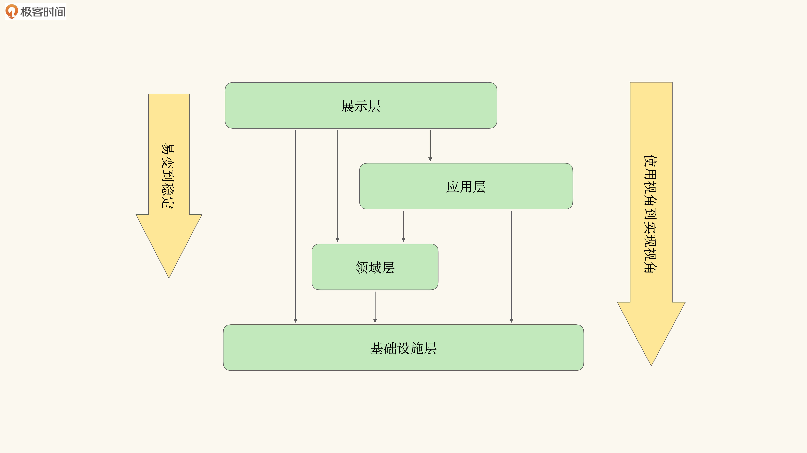
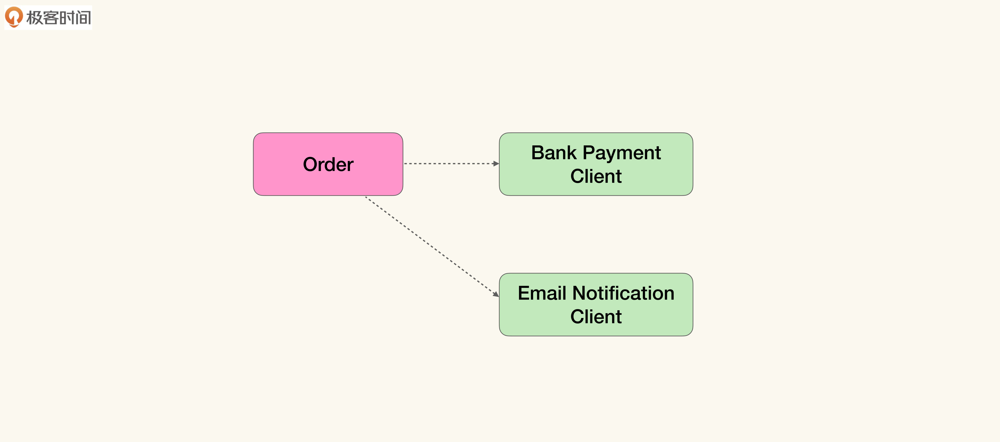
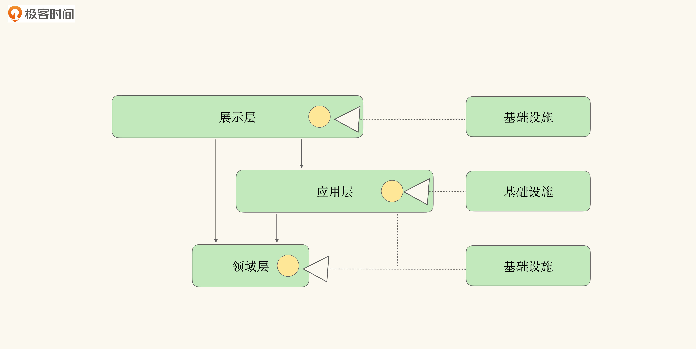
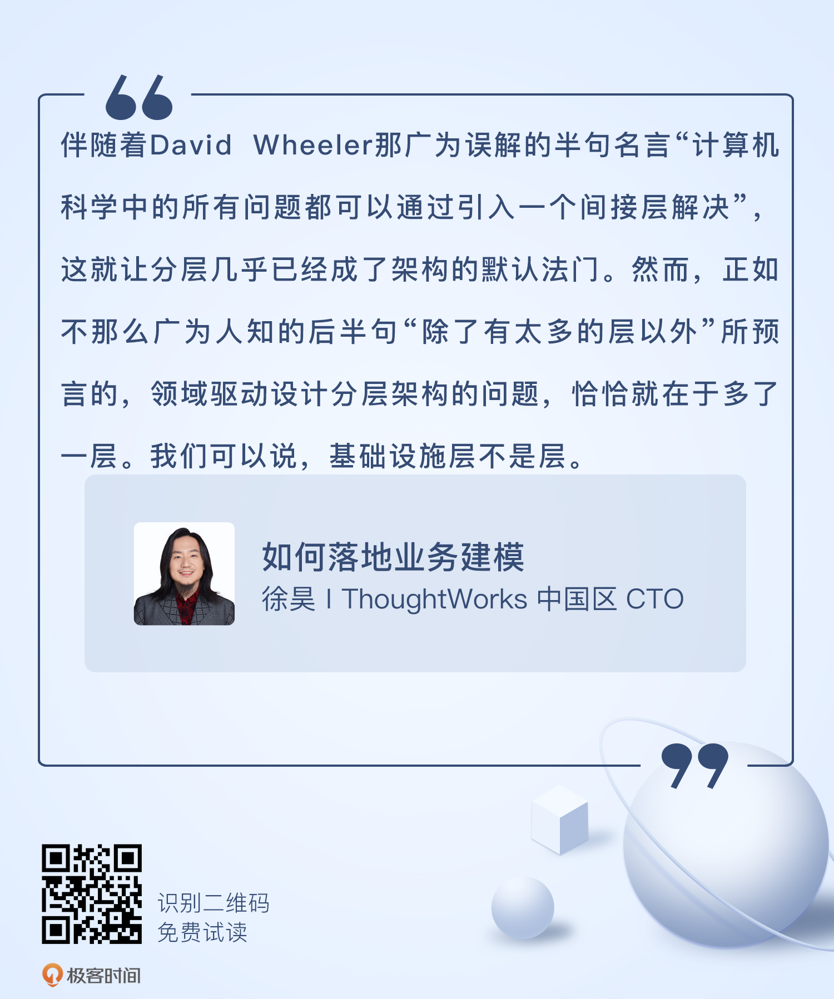

# 06 | 跨越现实的障碍（下）：架构分层就对了吗？
你好，我是徐昊。今天我们来聊聊如何有效地基于领域模型构造合理的架构。

到目前为止，我们学会了通过关联对象解决聚合/关联关系；利用角色对象分离不同上下文中的交互；并使用上下文对象完成实体对象到角色对象的扮演。这些模式通过结构上的优化，更好地组织了对核心数据的访问逻辑，使得我们可以在兼顾架构约束的同时，将领域概念与逻辑有效地转化为领域模型。

然而当我们把眼光从构造领域模型，扩展到利用领域模型构建整个应用或系统时，就会遇到新的问题： **如何组织领域逻辑与非领域逻辑，才能避免非领域逻辑对模型的污染**？

通常我们会使用分层架构（Layered Architecture）区分不同的逻辑以解决这个问题。然而由于领域层被人为赋予了最稳定的特性，破坏了分层架构间的依赖关系。所以我们需要 **修正分层，才能有效地围绕领域模型来构造软件架构**。

那么今天这节课我们就看看分层架构的问题在哪儿，以及如何通过能力供应商（Capability Provider）模式获得一个更好的架构愿景。

## 领域层的“不正当关系”

**分层架构** 是运用最为广泛的架构模式，它 **将不同关注点的逻辑封装到不同的层中**，以便扩展维护，同时也能有效地控制变化的传播。

在使用领域驱动设计时，我们通常会将系统分成四层：

1. **展现层**（Representation Layer）：负责给最终用户展现信息，并接受用户的输入作为功能的触发点。如果不是人机交互系统，用户也可以是其他软件系统。
2. **应用层**（Application Layer）：负责支撑具体的业务或者交互流程，将业务逻辑组织为软件的功能。
3. **领域层**（Domain Layer）：核心的领域概念、信息与规则。它不随应用层的流程、展现层的界面以及基础设施层的能力改变而改变。
4. **基础设施层**（Infrastructure Layer）：通用的技术能力，比如数据库、消息总线等等。

领域驱动设计使用分层架构，主要是因为 **各层的需求变化速率**（Pace of Changing） **不同**。分层架构对变化传播的控制，是通过层与层之间的依赖关系实现的，因为下层的修改会波及到上层。我们希望通过层来控制变化的传播，只要所有层都单向依赖比自己更稳定的层，更易变依赖不易改变的，那么变化就不会扩散了。

伴随着David Wheeler那广为误解的半句名言：“计算机科学中的所有问题都可以通过引入一个间接层解决”，这就让分层几乎已经成了架构的默认法门。然而，正如不那么广为人知的后半句“除了有太多的层以外”所预言的， **领域驱动设计分层架构的问题**， **恰恰就在于多了一层**。接下来我们就来分析一下这个问题。

### 通用技术能力和领域概念谁稳定？

大部分谈论领域驱动设计架构的书或文章，都会拿出这样一张分层依赖图，用来说明应该如何构造合理的层与层之间的依赖关系：


这张图通过依赖关系表示了每一层的变化速率：展示层最易变，其次是应用层，然后是领域层，最后是基础设施层。那实际情况是这样吗？有一部分说对了，而另一部分则值得商榷。

**展现层的逻辑，的确是最容易改变的**：新的交互模式，不同的视觉模版，甚至单纯就是怕用户看烦，想修改一下保持新鲜感，都会带来展现层逻辑的改变。

而 **应用层的逻辑，会随着业务流程以及功能点的变化而改变**。比如流程的重组与优化、新功能点的引入，都会改变应用层的逻辑。

领域层是核心领域概念的提取。从理论上说，如果通过知识消化完成模型的提取，由模型构成的领域层应该就是稳定态了，不会发生重大改变。因为一旦领域层出现重大改变，就意味着重大业务调整，整个系统都可以推倒重来了。因而 **在软件系统有限的生命周期内，我们可以认为领域层应该是不变的**。

**这也是为什么领域驱动设计受到行业热捧的一个原因**，寻找到一个在软件系统生命周期内稳固的不变点，由它构成架构、协同与交流的基础，帮助我们更好地应对软件中的不确定性。当然，这里的“不变”指的是 **已经存在的领域概念和核心逻辑不会改变**，但是仍然可以有新的概念和逻辑加入到领域层中。

**基础设施层的逻辑由所选择的技术栈决定**，更改技术组件、替换所使用的框架，都会改变基础设施层的逻辑。因而基础设施层的变化频率跟所用的技术组件有很大关系。越是核心的组件，变化就越缓慢，比如在选定数据库系统后，不太可能频繁地更换它。而如果是一个缓存系统，那么变化的频率就会快很多。

但是， **基础设施层还可能存在不可预知的突变**。如果我们历数过往的诸多思潮，NoSQL（Not Only SQL）、大数据（Big Data）、云计算（Cloud Computing）等等，都为基础设施层带来过未曾预期的突变。

此外，周围系统生态的演化与变更，也会给基础设施层带来不可预知的突变的可能。比如，所依赖的消息通知系统从短信变成微信，支付方式从网银支付变成移动支付，等等。

这里就有问题了。从概念上看，领域层是绝对稳定的。它既不随应用逻辑，也不随技术能力的变化而改变。唯一能够促使它变化的，是真实世界业务中的核心概念与逻辑。换句话说，领域模型不会被赛博世界（Cyber World）内的任何变化影响，它就是赛博世界中的孙悟空，跳出了三界外，不在五行中。

所以， **跟领域层相比，基础设施层就不够稳定**（其实不光基础设施，所有层跟它相比都不稳定），那么我们怎么能让绝对稳定的领域层，去依赖不够稳定的基础设施层呢？这不是违背了分层架构的依赖原则吗？

**领域模型对基础设施的态度是非常微妙的**：一方面，领域逻辑必须依赖基础设施才能完成相应的功能；另一方面，领域模型必须强调自己稳定性，才能维持它在架构中的核心位置。而作为被人为认定为的绝对稳定，它不能依赖任何非领域逻辑（除了基础库）。任何对其他逻辑的依赖都会带来修改的传递，会使领域层变得不稳定。

明明有实质性的依赖关系，却碍于“绝对稳定”的身份而不能承认。我想每个人都会想起一些不那么美好的词汇，来形容这种“不正当关系”吧。

可悲的是，作为架构师，我们还必须得帮助领域层来实现这种“不正当关系”（然后我劝你停止联想，不然人通过劳动改造自然的同时，劳动也会改造人，架构师就没法维持IT一族老实人的美好人设了），这样才能确立领域层的“绝对稳定”和“绝对核心”的位置。

理解了这点，你可以再看一下我们在关联对象 [那节课](http://https://time.geekbang.org/column/article/389072) 中看到的一段代码。现在，我想你对它的丑陋之处会有更深刻的认识了：它暴露了领域层对基础设施的直接依赖。

```
public class User {
    public List<Subscription> getSubscriptions() {
      ....
    }

    public List<Subscription> getSubscriptions(int from, int size) {
       return db.executeQuery(....);
    }
 }

```

### 基础设施不是层

产生这种“既要用，又不愿意承认”的依赖关系的根源在于， **基础设施本身就不是层**。或者更严格地说，以变化速率作为分层依据，那么基础设施就是无效的分层。如果你仔细看一下分层架构，可以发现两个相关而又不同的维度：变化上，从易变到稳定；逻辑上，从使用视角到实现视角。



从使用视角到实现视角，是另一个可以理解分层的方式：

1. 展示层最接近最终用户，完全表示对最终用户的信息展示和输入收集。同时它也使用了应用层、领域层与基础设施层。
2. 应用层，从业务流程与交互体验上支撑了展示层逻辑的实现。同时它也使用了领域层与基础设施层。
3. 领域层，从业务概念和核心逻辑上支撑了应用层流程和体验的实现。同时它也使用了基础设施层。
4. 基础设施层，从技术能力上支撑了领域层概念和逻辑的实现。

从这个角度看，我们也更能理解为什么展示层比应用层易变，应用层比领域层易变。因为层与层之间是使用与实现的关系，但是这个关系在领域层与基础设施层之间被打破了。

因为我们人为地规定了领域层最稳定，那么用以实现领域层的基础设施层，就不能比领域层更稳定。因此我们的选择只有两个：要么承认领域层并不是最稳定的（也就是领域层是“在特定技术栈上的领域模型实现”）；要么就别把基础设施当作层来看。

说句题外话，其实我始终推荐 **不要过分强调领域层的绝对独立性**，心里坦然接受领域层并不是无约束的理想化实现，而是受特定技术栈与技术生态环境约束的实现，就没那么多烦恼与纠结了。

这么做的话，对于领域驱动设计的优点，我们也并没有损失什么。除了需要做点儿心理建设来接纳它之外，唯一真正的不足，是可能要在构造测试上投入更多的成本。比如测试领域层逻辑时，需要构建基础设施的假替身（Test Double，Fake），并且还需要将领域层与基础设施层一起测试。

第一个迈出这一步且被广泛接受的框架是Ruby On Rails。它对领域驱动设计的颠覆，绝不小于它对Web开发的颠覆。特别是，既然使用了基础设施层，就大大方方地承认，提前准备好相关的测试工具，也没什么不好嘛。

然而对于大多数实践领域驱动开发的人而言，领域层的“绝对稳定”是如同光速一般的恒常，“孙悟空”是心中的白月光，“又当又立”是圣杯。否定掉领域层的稳定性，心理建设成本过高。

那么我们 **只能承认基础设施不是层**，需要从不同的角度构建一种架构模式，使得领域模型既可以隐含地使用基础设施，又不暴露对它的依赖。

## 能力供应商模式

如何才能取消基础设施层，但仍然不影响领域模型的实现呢？我会推荐 **使用能力供应商**（Capability Provider） **模式**。能力供应商模式是面向对象基础原则SOLID的综合应用，网上关于SOLID的讨论汗牛充栋，我就不在这里展开了。

### 从基础设施到有业务含义的能力

让我们通过一个案例，看一下如何构造能力供应商。还是极客时间的例子，这次我们来看订单部分。假设目前需要通过网银来支付订单，并通过邮件将订单状态更新并发送给客户。模型如下：



那么在忽略具体实现细节之后，代码可能是这个样子的：首先调用银行网关，然后根据银行网关返回的结果，生成支付记录并通知客户。

```
public class Order {

    public void pay() {
        BankResponse response = bank.pay(....);
        if （response.isOk()) {
            payments.add(new Payment(response...));
            status = ....;
            email.send(....);
        } else {
            email.send(....);
        }
    }
}

```

如前所述，这样的代码从领域驱动设计角度来看并不算好。因为我们在领域层中，直接依赖了基础设施层中的网银网关客户端和邮件通知客户端。但是想改正这个问题，并没有那么容易。

因为领域层被认为定义为绝对稳定，它不能依赖任何非领域逻辑（除了基础库）。而我们又要使用网银客户端和邮件通知客户端来完成功能，那该怎么办呢？我们只好 **将网银客户端和邮件通知客户端移动到领域层内**。

但是我们不能直接移动，毕竟领域层中只能是领域概念与逻辑，与具体业务无关的概念是不能进去领域层的。于是我们需要 **将对基础设施层的依赖，看作一种未被发现的领域概念进行提取**，这样其实就发挥了我们定义业务的权利，从业务上去思考技术组件的含义。

一种有效的方法是 **将技术组件进行拟人化处理**。比如网银转账这个行为，如果在业务中有一个人去做这个操作，那么会是谁呢？通知用户订单状态发生转变了，这个人又会是谁呢？通过拟人化，我们就能很清楚地看到技术组件到底帮助我们完成了什么业务操作。

在我们这个例子里，转账的是出纳（Cashier），通知用户的是客服（Customer Service）。于是我们的模型就能转化为：


可以看到，我们将具有业务含义的能力抽象成接口纳入领域层，而使用基础设施层的技术能力去实现领域层的接口。也就是说， **基础设施层成为了能力供应商**。代码如下：

```
//领域层内
interface Cashier {
    ...
}

interface CustomerService {
    ...
}

public class Order {

    public void pay(Cashier cashier, CustomerService staff) {
        try {
            Payment payment = cashier.collect(...);
            payments.add(payment);
            staff.tell(owner, ..);
        } catch(....) {
            staff.tell(owner, ..);
        }
    }
}

//领域层外
public class BankPaymentCahsier extends BankPaymentClient implements Cashier {
    ...
}

public class EmailCustomerService extends EmailNotificationClient implements CustomerService {

```

你肯定觉得，就这？这不就是抽个接口改个名吗？是的，从实现技法上看，这是简单得不能再简单的面向对象方式了： **从具体实现方法中寻找到一个抽象接口，然后将从对具体实现的依赖，转化为对接口的依赖**（SOLID中的里氏替换原则）。

但是与之前相比，我们现在的做法有两个不同：

1. 领域模型与软件实现关联；
2. 统一语言与模型关联。

没错儿，就是领域驱动设计的“两关联”。我们再复习一下，通过两关联，任何词汇都可以成为领域概念，而与概念提取的发起方无关。

也就是说，领域概念可以不是领域方提取的。 **只要我们从技术组件中提取的词汇具有业务含义，且被业务方认可，那么它就是领域概念**。因此我们并不是改了个名，而是提取了领域概念。要时刻牢记自己的权利！

总结来说，通过从技术组件抽象具有业务含义的能力，我们就能将基础设施转变为具有这种能力的供应商。于是，我们就能帮助领域层实现了它希望的那种“不正当关系”，既使用了基础设施，又对它没有依赖：我们依赖的是领域层内的能力接口（SOLID中的接口隔离原则），而不是基础设计的实现（SOLID中的倒置依赖原则）。

将基础设施转化成为能力供应商后，我们的分层结构中也就不再存在基础设施层了。于是我们的架构愿景，也就发生了改变。那么该怎么使用能力供应商，来形成真正多层架构呢？我们接着往下看。

### 使用能力供应商的多层架构

我们可以将基础设施，看作对不同的层的扩展或贡献（SOLID的开闭原则）。它虽被接口隔离，但却是展示层、应用层和领域层的有机组成部分。在每一层中留有能力接口，基础设施则作为这些能力接口的供应商，参与层内、层间的交互。



那么这样的架构，无论从变化的频率还是使用实现关系上就形成了统一。除此之外，通过能力供应商，我们还解决了分层架构里的另一个难题： **层与层之间是单向依赖关系，那么如果需要上一层参与下一层的交互与逻辑，层与层之间就会形成双向依赖关系**。

不过，通过能力与能力供应商，层与层之间出现了另一种交互的可能：上一层作为下一层的能力供应商，参与到下一层的业务与流程中去。而这种参与，并不会带来额外的依赖。示意图如下：


比如在前面支付的例子里，除了邮件通知以外，我们还希望触发一个流程去为用户做一下支付失败原因的回访。这属于应用层逻辑的一部分。那么我们只需要在应用层中实现对应的逻辑，并成为领域层的能力供应商就可以了。示意代码如下：

```
public class FollowUpWorkflow implements CustomerSerivce {
    private WorkflowEngine engine;

    public void tell(.....) {
        this.engine.startFlow(....);
    }
}

```

我不知道你是否觉得能力供应商这个模式有点眼熟？没错儿，它就是关联对象、角色对象和上下文对象的 **元模式**（Meta Pattern）。事实上，我们 [第4讲](http://https://time.geekbang.org/column/article/389082)、 [第5讲](http://https://time.geekbang.org/column/article/389089) 所学的内容，都可以看作是能力供应商模式的一种特殊表现形式。它们所表示的能力，与在特定技术约束下如何组织领域模型的数据相关。比如关联对象，就是如何在数据库不在内存中的情况下读取大量数据，并维持逻辑一致性的能力。

通过这个元模式，我们还可以衍生出很多有用的模式，比如全局数据对象（Global Data Object）模型，用类似Users这样的领域概念表示系统全局范围内所有的用户对象。

这里我就不一一展开了，我相信如果你理解了能力供应商，并认真学习了前几节课的例子，你自然可以收发随心地使用恰当的模式来解决遇到的问题。

## 小结

我们来简单总结一下。分层模式并不能很好地帮助我们构建以领域模型为核心的系统架构，主要问题就在于如何处理领域层与基础设施层的关系上。而我们对领域模型的执念，使得我们无法承认基础设施层更稳定（本身也有突变风险）。所以我们应该重新思考 **分层架构是否正确，以及怎么分才更合理**。

我个人建议分成三层：展示层、应用层与领域层。不仅要将基础设施作为能力供应商配合其他层来使用，同时通过能力供应商模式，来实现层与层之间的双向交互，这样就不用担心会带来额外的依赖了。

最后，能力供应商模式是一个元模式，关联对象、角色对象和上下文对象可以看作它的具体应用。熟练掌握这个模式，你就可以根据需要发明自己的领域驱动实现模式了。

编辑小提示：为了方便读者间的交流学习，我们建立了微信读者群。想要加入的同学，戳此加入 [“如何落地业务建模”交流群](https://jinshuju.net/f/wjtvTP) >>>

## 思考题

能力供应商模式在处理大的架构问题上，唯一的不足就在于将显式的依赖关系，转化为了隐式依赖关系，这就对知识管理有了更高的要求。请你思考一下这种架构模式对项目交付的挑战，以及需要怎样的知识管理手段才能保证知识传递的顺畅？



如果你在学习过程中有任何问题或者心得，欢迎在留言区和我交流互动。