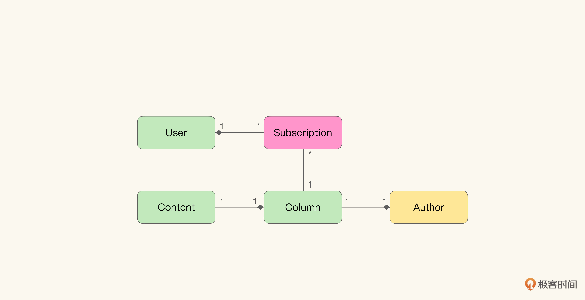
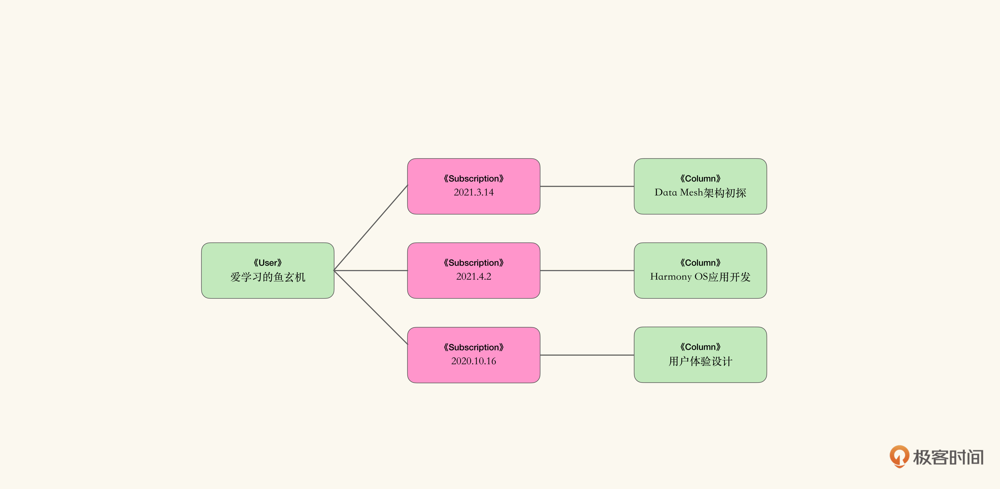
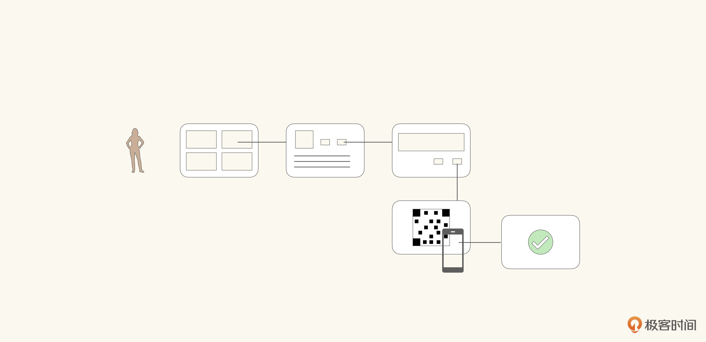
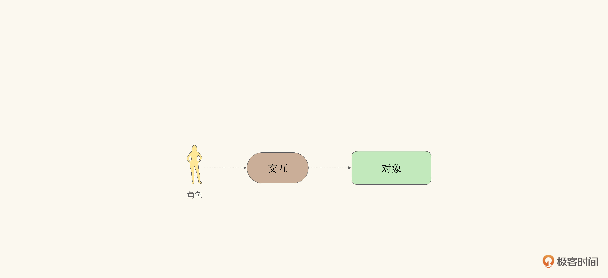
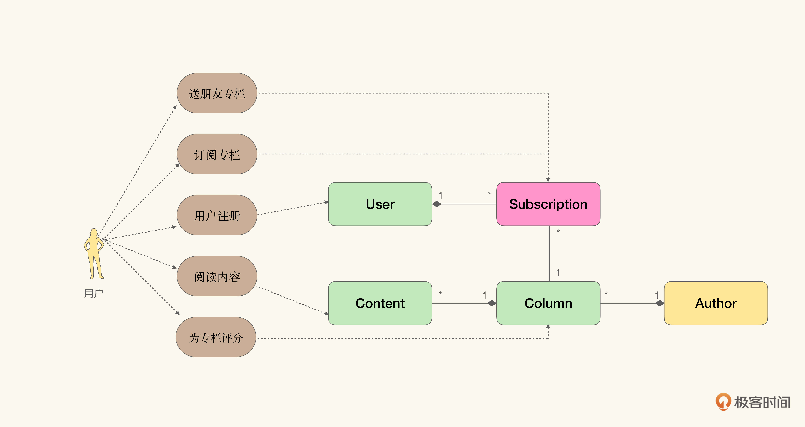
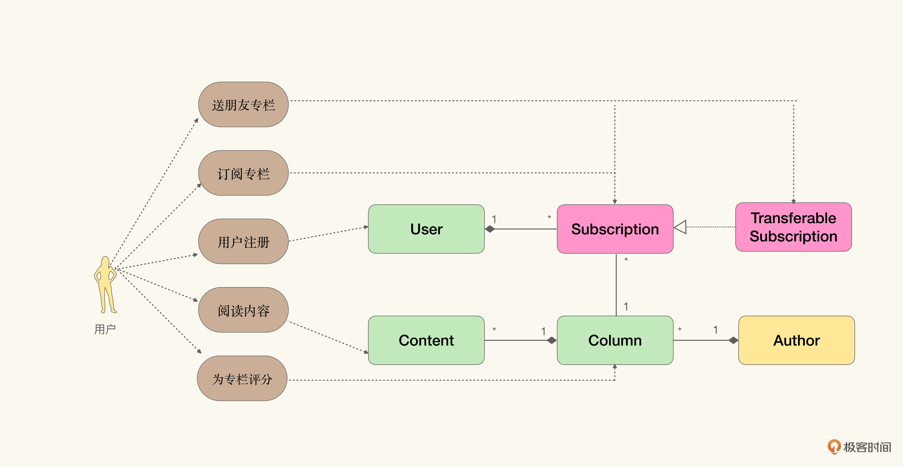
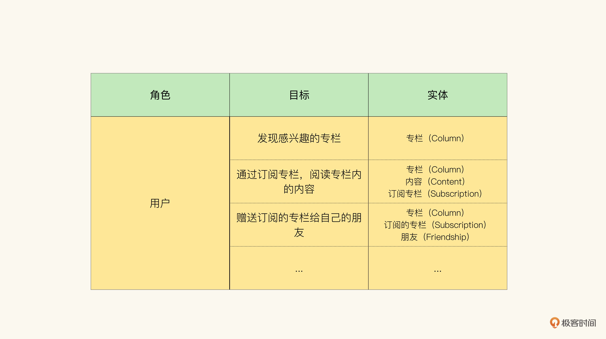
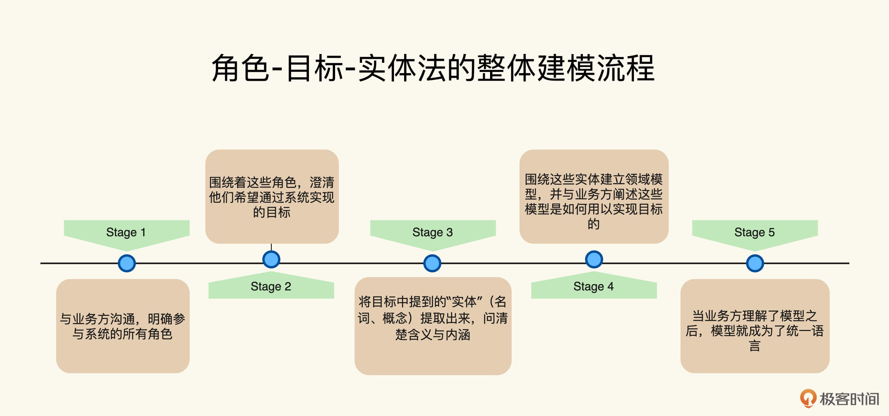
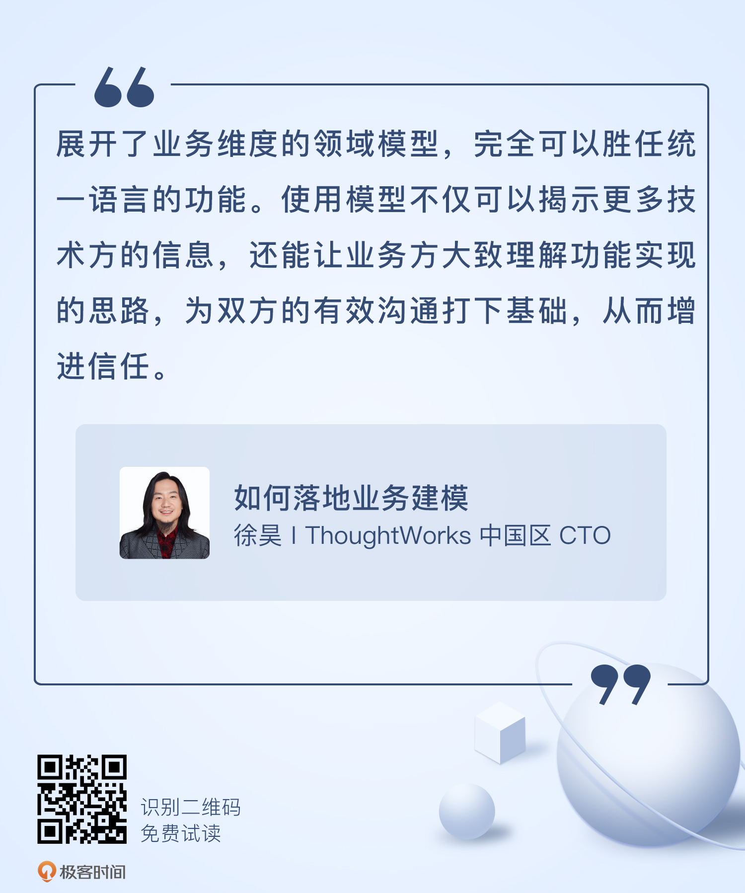

# 07｜统一语言可以是领域模型本身吗？
你好，我是徐昊。今天我们来聊聊如何把领域模型作为统一语言。

在 [第二讲](https://time.geekbang.org/column/article/387945)，我们谈论到为什么统一语言是必要的：一是因为业务维度在领域模型中被隐藏了；二是我们需要一个缓冲，去发现模型中不存在的概念。不过这里有一个隐藏的前提假设：最终建模结果将是原味面向对象范型的模型。

而我们在介绍上下文对象的 [第五讲](https://time.geekbang.org/column/article/389089) 里，已经见到一种不同于原味面向对象模型范型的思路：DCI范型。围绕角色与上下文对业务进行分解，而不仅仅是实体与关系。那么我们是不是可以通过不同的建模范型，将领域模型本身当作统一语言呢？

答案是肯定的，而且其中最关键的就是 **如何将隐藏在模型中的业务维度展开**。不同的建模范式，展开业务维度的方式与逻辑也不尽相同。我们首先需要更仔细地理解一下业务维度是如何被隐藏在模型中的，然后再看看不同的建模方法将会如何展开业务维度。

## 业务是模型的隐藏维度

我们仍然以你已经很熟悉的极客时间专栏领域模型为例，看看在订阅这个上下文中（模型如下图所示），原味对象范型的模型是如何将业务维度隐藏的：

作为技术人员，我们可以很容易地从数据角度理解业务行为：当用户订阅了一个专栏之后，就会产生一个新的 Subscription 对象，它会记录用户具体订阅了哪个专栏。而我们通过对Subscription对象的检视，就能知道用户一共订阅了多少个专栏。下图展示的是我们将模型实例化后的结果：

需要说明的是，在这个过程中，我们并不关心Subscription是如何产生的。无论是用户自行购买的、朋友送的、抽奖中的、首单减免白得的，只要最终产生了Subscription对象，用户就能访问专栏内对应的内容。

比如，在2020年10月16日，用户“爱学习的鱼玄机”自行购买了专栏《用户体验设计》，就会产生一个Subscription实例，将用户与专栏关联起来。而只要这个Subscription对象存在，用户就可以访问专栏内的课程内容。

同样，在2021年4月2日，“爱学习的鱼玄机”接受朋友“会聊骚的黄庭坚”的馈赠，得到了专栏《Harmony OS 应用开发》，这样也会产生一个Subscription实例。它将用户与专栏关联起来，让“爱学习的鱼玄机”可以看到这个专栏里的内容。

从数据变化的角度看，自行购买、朋友送、抽奖中、首单减免白得等流程，都被隐藏在模型的抽象之中了。一方面，这正体现了模型抽象能力的强大。只要产生相似的数据关联，业务逻辑就可以被保证，而细节则可以被忽略。而另一方面，其实也增加了业务方理解模型的难度。

如果订阅专栏的流程如下图所示，包含不同的步骤与操作，业务方要如何才能明白模型是怎么支撑这个流程的呢？

可以看到，业务方很难从领域模型中感受到业务维度（流程、交互、功能、规则、价值等），所以这也正是我们 **需要额外构造统一语言** 的原因。

但是如果有办法可以将隐藏在领域模型中的业务维度展开（哎呀呀，低维展开了呢），使得业务方能够理解 **不同的业务流程是如何作用于领域模型的。** 那么，业务方就能够判断领域模型是否准确捕捉了业务概念，以及领域模型是否能够有效支撑整个系统（也就是判断技术方是否真正理解了需求）。这时候我们就不再需要额外的统一语言了，因为模型本身就能起到统一语言的作用。

那么我们将业务方可以理解的领域模型称作 **业务友好与可读**（Business friendly and readable） **的模型**，这类模型可以作为统一语言使用。于是将隐藏在领域模型中的业务维度展开，最终的目标就是通过在模型中还原业务维度，使得模型变得业务友好与可读，从而将模型变成统一语言。

将模型变得业务友好与可读的方法有很多，但总体而言主要有两个方向：

1. 催化剂建模法及其变体（Catalysis Modeling and its variants）；
2. 事件建模法（Event-based Modeling）。

今天我们先讲催化剂建模法，因为它是一个简单直接的方法，非常容易使用。下节课再介绍事件建模法。

## 催化剂建模法

**催化剂建模法**（以下均称“催化剂方法”）是一种 **尝试将流程视角引入对象建模** 的方法。它的历史比领域驱动设计还要古老，大约成形于20世纪90年代中期，也就是1996年前后。它跟领域驱动设计有着相似的价值观和实践手段，比如在催化剂方法中，有一个称作 **共享词汇表（Shared Vocabulary）的核心实践**。没错，它就是催化剂版本的统一语言。

不同于统一语言，共享词汇表只包含领域模型的名字，其余的业务逻辑都通过模型自身来表达。从这一点，我们也可以看出催化剂方法对其产出模型的信心。

这也是催化剂方法跟知识消化法不同的地方。催化剂方法更强调对模型本身的构造，而不是依赖一个试错的过程去逼近真相。当然，这也使它看起来更像一种 **重设计** 的方法（Big Upfront Design）。然而生不逢时，发表后没几年，恰好赶上敏捷运动（Agile Movement）如火如荼，就迅速被人遗忘了。

当催化剂方法再度进入我们视野的时候，是因为我们需要寻找一种更具业务表现力、可作为统一语言的模型。借由这个原因，催化剂方法又被重新拾起，作为一种将业务维度在领域模型上展开的方法，重新被引入到领域驱动设计中。但我们还是嫌弃它颇为厚重的建模流程，最后被逐步轻量化，产生了很多不同的变体（怎么感觉身世凄苦得和Casper David Friderich有一拼）。

从建模上讲，催化剂方法最大的特点在于， **将交互**（interaction） **显式地建模到对象模型中**。如下图所示，为催化剂方法建模的概念关系图：

交互既可以代表业务流程，也可以是用例或者系统功能。通过使用关系（uses）表示在流程或功能点上使用了哪些对象模型，相当于通过角色和交互为对象模型打了标签（tag），从而将隐藏在模型中的业务维度（流程、功能点）展开了。

如果我们使用催化剂方法重新建模极客时间的例子，结果大概是这个样子：

通过这个催化剂方法建模的模型，我们明确可以看到：订阅专栏是通过建立Subscription对象实现的；送朋友专栏也是通过Subscription对象实现的。再配合简单的说明和解释，我们就可以逐步让业务方理解：系统的功能大致是如何被实现的，哪些模型对哪些业务流程有影响。而在领域模型的粒度下，如果业务方能理解系统是如何实现的，那对双方的协同合作将会有巨大的好处。

我想你肯定经历过这样的场景：因为开发人员发现需求修改的部分涉及到核心模块，给出了较大工作量的评估；而业务方怀疑开发人员是故意保留工作量弹性，于是便不断挑战工期进度。

因此 **借由领域模型，双方能就需求的具体范围、风险和成本形成一定的共识，从而避免猜忌性施压与扯皮**。这样的话，业务方与开发人员也都能把这套模型当作统一语言，去澄清需求，以及评估实现的风险与成本了。

对于业务的讨论、需求的澄清，通常是在给定的流程与业务上下文中，需要讨论 **涉及的模型信息是否足够，概念是否清晰**。比如在上面这个图里，我们可以明显发现一个信息不足的地方，就是我们系统中并没有存在朋友关系，那么送朋友专栏要怎么操作呢？

一种做法是修改领域模型，增加朋友关系的信息。比如这样：

另一种可能的做法是，在领域模型中引入一种特殊的订阅关系：可转让的订阅。也就是说，虽然是我订阅的专栏，但目的是转送别人这样一种订阅关系。至于转送的渠道，可能是微信、短信、邮件或是其他具有朋友关系的平台：

至于究竟哪种方案更好呢？不知道。这是需要业务方与技术方共同讨论并确定产品方向的时刻：是引入社交属性，还是保持纯粹的定位。不过当业务方理解了在背后支撑流程的模型，这种讨论就能变得更加顺畅自然。

至于对风险和成本的评估，也是同样的道理。当需要引入新的功能点时，可能会牵扯到对背后模型的修改，那么我们就可以根据 **要修改的模型来判断成本和风险**。

就以上面两个不同的模型为例。同样是在模型中增加一个新概念，朋友关系比可转让的订阅风险要小得多。毕竟订阅处在模型的中心，承载了太多的业务，这一点可以根据有多少功能点使用了这个模型，以及使用这个模型的功能点的重要程度进行综合判断。

而朋友关系相对来说就没有那么重要，所以风险要小得多。但为了维护朋友关系，我们可能还需要引入另外一些功能：申请好友、好友验证之类。功能范围可能会大一些。

但不管选择哪种方案，更为重要的是，在充分理解这些成本与风险之后，业务人员可以做出更为准确的判断，看看要采用什么样的方式来实现这个功能，既能使项目可控，又能满足系统发展的需要。

所以借由这个例子，我们可以看到，展开了业务维度的领域模型完全可以胜任统一语言的功能。此外，使用模型还可以揭示更多技术方的信息，通过它能让业务方大致理解功能实现的思路，为双方的有效沟通打下基础，增进信任。

## 角色-目标-实体法（Role-Goal-Entity）

催化剂方法将角色与交互直接建模到了领域模型中，从业务维度展开的角度上讲，的确带来了很多优点。然而在领域驱动设计的语境下，它也存在难以克服的缺点： **交互被直接建模到模型中了，那么我们要怎么关联模型与软件实现呢？我们是选择性地忽略交互与角色，还是将交互实现成某种特定的组件呢？**

要知道，将交互直接实现为组件，在2005年左右看起来特别有道理。因为那时候无论是J2EE还是.NET的多层架构，都有一个在概念上跟交互差不多的组件。在J2EE里是Session Bean，在.NET中是业务逻辑接口层。但是随着架构轻量化的趋势，采用这种做法的人越来越少。

这时出现在领域模型中的交互就变得很尴尬了。一方面，不能缺少交互这部分信息，否则业务维度又被隐藏了，领域模型也就无法担任统一语言；另一方面，交互又没有软件实现与它关联，并且严格意义讲它也不是领域逻辑，慢慢就变成了一种“你看它不爽，但是又干不掉它”的存在。

于是角色-目标-实体法出现了。角色-目标-实体法不再将流程建模到模型中，而是作为发现领域概念的指导。角色-目标-实体法通过一张表格来梳理系统中的角色，他们想在系统上实现的目标，以及在实现这个目标的过程中会接触哪些领域模型中的实体。我们仍然以极客时间的专栏为例，可以得到这样一个表格：

一旦我们理解了催化剂方法，那么就能看出角色-目标-实体法只不过是换了一种形式，它通过一个额外的表格将领域模型中的业务维度展开了。所以在很大程度上，我们可以将角色-目标-实体法当作催化剂方法的简化版。

角色-目标-实体法除了能够得到一个更“纯净”（也就是不包含无法与实现关联的模型）的领域模型之外，还提供了一种 **收集需求，结构化进行领域建模与构建统一语言的流程**：

1. 首先与业务方沟通，明确参与系统的所有角色。
2. 围绕着这些角色，澄清他们希望通过系统达成的目标。
3. 将目标中提及的“实体”（名词、概念）提取出来，问清楚含义与内涵。
4. 围绕这些实体建立领域模型，并与业务方阐述这些模型是如何用以实现目标的。
5. 当业务方理解了模型之后，模型就成为了统一语言。

这个流程有个额外的好处： **可以提高业务方对领域模型的认同感**。

不同于催化剂方法， **角色-目标-实体法更像一种共创方法，它** 由研发人员建立领域模型，然后再解释给业务方 **。** 双方通过协作共同梳理系统中的用户与其目标，共同澄清领域概念。然后技术人员再根据澄清的实体，建立领域模型。这样得到的领域模型，可以更自然地成为统一语言。

正是由于这样的好处，角色-目标-实体法在领域驱动设计中得到了广泛的认可和实践。不过我们仍然要明白，它与催化剂方法之间千丝万缕的联系。而且还要知道，我们之所以放弃催化剂法，是因为在今日架构的趋势中，没有与流程直接对应的组件。

但是随着架构风格的变化，比如，随着BFF（Backend For Frontend）的日趋流行，我们能在软件实现中又能找到一种与交互对应的组件了，说不准哪天我们又会开始结合使用催化剂法与角色-目标-实体法了。

编辑小提示：为了方便读者间的交流学习，我们建立了微信读者群。想要加入的同学，戳此加入 [“如何落地业务建模”交流群](https://jinshuju.net/f/wjtvTP) >>>

## 小结

我们来简单地总结一下。将领域模型作为统一语言的一个难点在于如何有效地展开业务维度。因此各种领域建模方法的优劣高下，都可以在这个维度下进行比较与取舍。

这节课讲了两种方法，分别是催化剂方法和角色-目标-实体法，它们通过直接在领域模型中引入交互，解决了业务维度展开的问题，可以有效地将领域模型变成统一语言。

此外，角色-目标-实体法还提供了一种共创统一语言的流程，在梳理需求的同时实现了将领域模型转换为统一语言。

下节课，我们将介绍另一种不同的业务维度展开的方法：事件建模法。在开始之前，我希望你可以思考下面的问题。

## 思考题

催化剂方法和角色-目标-实体法可能会存在哪些不足？如果让你改进这个方法，你会从哪些角度入手？

欢迎把你的思考和想法分享在留言区，我会和你交流讨论。我们下节课再见！