# 09｜怎么才能更有效地获得事件流？
你好，我是徐昊。今天我们来聊聊四色建模法（4 color modeling）。

在事件建模法中，获取事件流（Event Stream）是建立领域模型的切入点。而事件流在多大程度上可以反映业务的现实，影响了最终模型的质量与功用。不同的事件建模法，在获取事件流的方法上也有所不同。

[上节课](http://https://time.geekbang.org/column/article/390799) 我们讲解的事件风暴法，是通过头脑风暴的形式来获取事件流。今天我来介绍另一种事件建模法：四色建模法。它的起源有点复杂。最早的源头是Peter Coad在1992年研究对象模式时，为了提取可复用的对象组件而发明的 **四原型法**。

在1997年的时候，作为一种补充策略，Peter Coad开始提倡在模型中引入不同的颜色，从而将模型的动态交互展示在静态的模型中，形成了 **彩色建模法**（Color Modeling）。

而后，我自己在2005年左右，将事件建模与彩色建模法结合形成了 **四色建模法**， **用以获得更具业务含义的模型，以便直接使用模型作为统一语言**。

毋须讳言，四色建模法是一种我偏爱的方法，今天我们就来看看它的特点。我会先讲一下使用头脑风暴获取事件流的不足，然后再介绍四色法做了哪些改进。

## 头脑风暴法的不足：成功取决于收敛逻辑

在大多数事件建模法中，通过头脑风暴获取事件流是主流的做法。比如我们在 [上节课](http://https://time.geekbang.org/column/article/390799) 讲的事件风暴法，就是这样一种以头脑风暴为主的事件建模法。

头脑风暴是一种通过发散-收敛荟萃信息的方法。它可以分为发散和收敛两个阶段：

- 在发散阶段，主持人（Facilitator）通过引导团队成员，收集他们的想法，产生事件；
- 在收敛阶段，主持人则需要根据某种逻辑过滤收集到的事件，形成领域事件。

如下图所示：

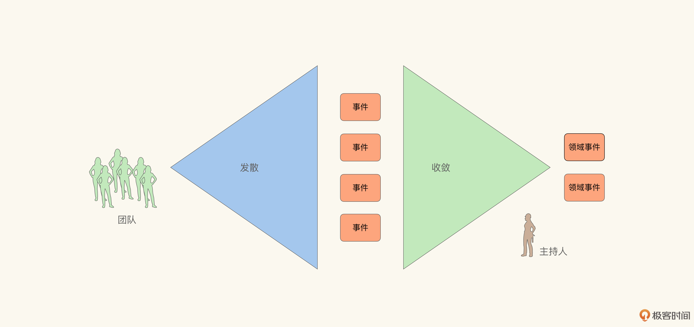

**要想更加有效地获取领域事件，关键在收敛而不在发散**。在发散阶段，所有参与者可以天马行空。不过这样的方法在产生有效信息的同时，也会产生大量的噪音。但是在收敛阶段，则会按照某一逻辑主线，合并相似概念，过滤无用信息。那么我们可以很容易地想到，如果主持人采用不同的逻辑去收敛事件，最后获得的结果也可能不尽相同。

然而在事件风暴法，以及其他以头脑风暴为主的事件建模法中，对于用于收敛的逻辑大多语焉不详，因而极度依赖主持人的经验与自觉，最终结果自然就会存在一定的随意性。 **这也使得事件风暴法变成了那种“一学就会，一用就废”的方法**。有经验的老手越用越顺手，而初学者往往不得要领。

所以有一些事件建模方法就干脆彻底抛弃了发散-收敛这种头脑风暴式的弱分析方法。既然最终事件流的质量取决于收敛逻辑，那么我们为什么不直接从收敛逻辑出发，通过引导-分析直接获取事件流呢？的确可以这么做，而四色建模法也正是这样一种从收敛逻辑出发的强分析法。

## 四色法的核心逻辑：从收入流与成本结构中寻找事件

四色法主要通过三个关键逻辑寻找领域事件。这三个逻辑源自企业运营与管理实践：

1. 如果有现金收入，表示承担了义务。拿钱办事，需要收集证据，说明义务履约成功。
2. 如果有现金支出，表明拥有权利。花钱消灾，需要检查对方是否按时履约。
3. 对于没有现金往来的，可以通过目标-实际对比，产生类似履约的约束。所谓目标-实际对比，就是设立一个目标/计划，然后追踪实际执行的结果。

作为四色建模法的创始人，我可以给你仔细讲一讲我为什么会选择这三个逻辑作为发现领域事件的主要逻辑。

这三个寻找事件的逻辑 **并不是从技术视角臆造的，而是在现实业务中真实存在的，并且还是商业规则的底层逻辑**。所以从它们出发，可以更容易地得到与现实业务相符合的事件流。

其中前两条（现金收入承担义务和现金支出表示权利）源自现金日记帐（Cash Journal），与收入流（Revenue Stream）直接相关，最后一条则与成本结构（Cost Structure）有关。

这里我们需要有一点点基础的财务背景知识，帮助我们理解企业在运营与管理时的视角。不过我们并不需要知道所有的细节，能够在宏观上有所了解就可以了。

在现实中经营一段真实的业务，财务是基本的视角。在企业财务制度中，有“管帐的”和“管钱的”两种分工。会计是通常所谓“管帐的”，无论是总账会计还是明细账会计，都是负责为企业的经营管理与决策提供核算资料；而出纳则是“管钱的”，主要负责管理企业票据、货币资金、有价证券的收付与核算。

日记帐（Journal）是出纳用以记录收付与核算的帐本，现金日记帐就是与现金有关的日记帐。企业与顾客之间、企业与企业间的财务往来，都通过现金日记帐体现。可以说，现金日记帐是收入流的重要组成部分， **所有与收入流相关的业务活动，最终都会在现金日记帐上有所体现。因而也是我们需要重点关注的问题域**。与之相对的是总账（General Ledger），它则根据不同的科目，对业务单据进行汇总和核算。

在理解了日记帐和总账的区别之后，我们就能明白该怎么从财务角度来看待业务：

- 业务活动中可以有多种多样的行为，其中大部分行为从财务角度来说都无关紧要；
- 但是如果出现与现金有关的活动，就必须记录在日记账中；
- 一旦记录在现金日记账内，那么其关联的原始单据，也会根据科目设置进入总账。换句话说，日记帐内记录现金结果，总账内记录重要的过程单据。
- 最后再由总账形成试算平衡表。

业务活动通过日记帐和总账反映到试算平衡表的过程如图所示：

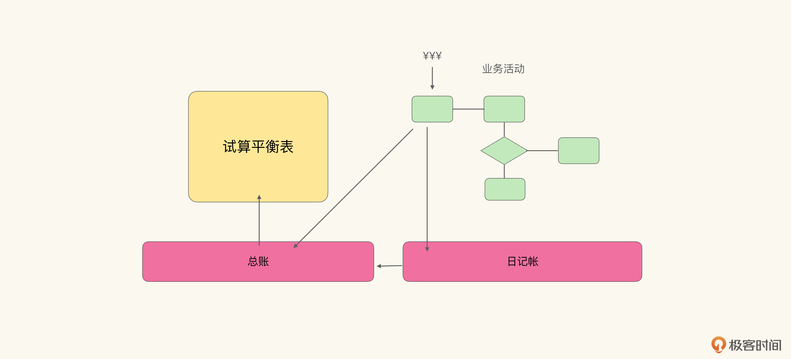

从事件建模的视角不难发现：日记帐中记录了关键事件，总账中记录了这个事件的缘起和后续。由此为依据，我们就能从运营业务而不仅仅是设计系统的角度，去发掘关键的领域事件。 **因此抓住了日记帐上的事件，就能围绕它建立起前后关联的事件流。这也是为什么，我会将现金权责作为四色建模法主要逻辑的原因**。也就是我们开始讲的三个逻辑中的前两条。

事实上，在实际经营业务时，除了财务视角，还有流程视角。管理理论认为，企业可以将其核心经营行为，转化为流程（无论是对外的业务活动，还是对内的工作流）。那么流程中产生的经营开支（Opex）就构成了成本结构中很重要的一部分。然后再通过为流程的执行设定KPI，控制企业经营的效率。大致流程如下图所示：

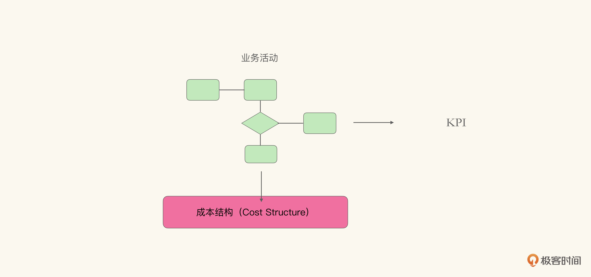

那么很自然，作为设定KPI的人需要知道KPI是否被严格地履行，而KPI的责任人也需要不断地收集证据，表示自己的进度。

而KPI的设定，是源自对于成本结构的优化。 **支撑这种考核与收集，是很多软件系统的本质目标，也是我们需要关注的领域**。所以围绕KPI，我们同样可以建立起前后关联的事件流，也就是由所有可以证明KPI的证据串联起来的事件。

因而，在与总账和日记帐关联不紧密的领域，我选择了目标-实际对比，作为发现、串联事件的主逻辑。

总之，我们寻找领域模型，提取统一语言，做分层与隔离，目的都是为了有效地控制变化和传播。那么我们更应该从源头入手，找到业务中相对稳定的部分去建模，而不是选择一段变化的业务去稳定地构造它的模型。毕竟 **我们期待领域驱动设计能够为我们带来的一切优点，都依赖于尽早地从业务侧隔离开稳定与易变的部分。**

那么什么是更稳定的部分呢？答案是 **业务模式**（Business Model）。对于一家步入正轨的企业而言，在其生命周期内剧烈变化核心业务模式是小概率事件（甚至是求死之路，更多地会通过构建新的实体去承载新的业务）。

因而业务模式在企业生命周期内，是相当稳定的。而业务模式主要通过收入流和成本结构来体现。 **四色建模法的核心逻辑就源自收入流和成本结构，通过现金权责识别与收入流有关的事件，通过目标-实际对比发现与成本结构关联的事件**。

这是四色建模法与其他建模法的主要不同： **完全拥抱业务视角，以业务的内在逻辑作为发现事件的主要逻辑**。如果业务会从财务和流程效率的角度去考虑问题，那么我们也要从这个角度出发去建模。某种程度上说，这是一个对技术人员不太友好的建模方法。这种彻底的业务化视角，可以算作我留给这个行业的一个重要遗产吧。

## 四色建模法的具体操作流程

下面让我们来看看四色建模法的具体操作流程。四色建模法之所以叫四色建模，主要是因为它里面 **存在四种主要的对象原型**， **且每一种原型都有一种颜色与之对应，一共有四种颜色**，由此而得名。

这四种对象原型分别是：

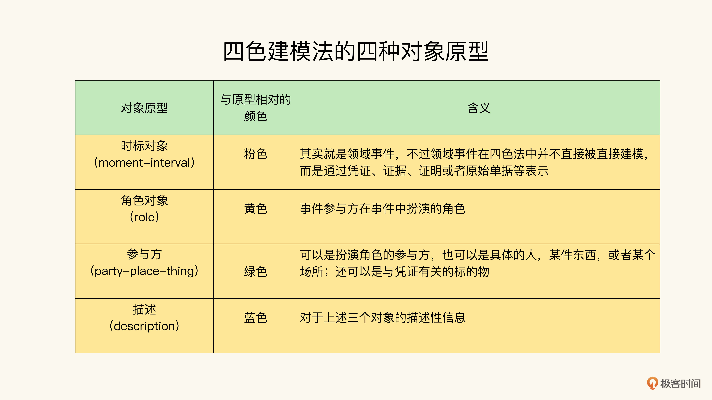

有了前面课程的基础，你会发现这些概念并不怎么陌生，在其他建模方法中都有类似的对应。在了解了这四种基础原型之后，四色建模的具体流程是这样的：

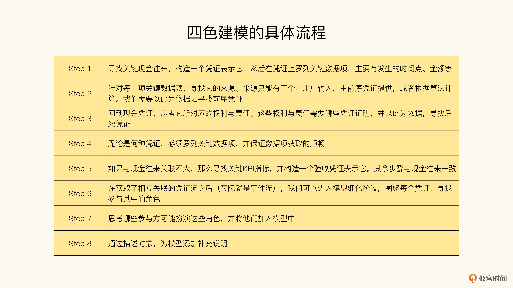

可以看到四色建模法对最终模型的构造有更为明确的要求：

- 凭证必须围绕现金往来或KPI；
- 凭证间必须通过关键数据项明确关联关系。

这也是为什么我说四色建模是一种 **强分析方法** 的原因： **可经由明确的逻辑推导，不需要依赖于发散-收敛式的探索**。

那么就让我们继续以极客时间专栏为例，看看四色建模法能帮助我们得到什么不一样的模型吧。首先我们需要思考一下在极客时间专栏的模型中，有哪些现金往来（Payment和Commission Payment）？很容易想到的就是读者购买专栏以及专栏作者分成这两项，构造的模型如下：

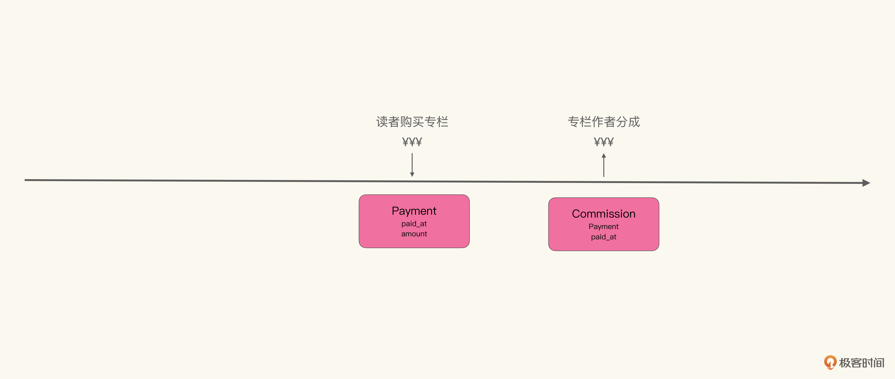

如图所示，我们构造了两个凭证去表示这两个现金往来，然后分别列出它们的关键数据项：时间点和金额。接着就可以开始追溯前序凭证了。

我们先看一下这两个凭证中相对简单的一个：读者购买专栏的凭证。

它的关键数据项金额（amount）显然不可能由读者输入，而应该由前序凭证提供。想想看，支付的前序凭证是什么呢？对，是订单，因为是针对订单进行支付的。因此支付的金额应该与订单的金额相等。

而订单的金额显然也不可能是由读者输入的，那么订单的前序凭证是什么呢？是专栏报价，订单的金额应该与专栏报价相等。那报价哪里来的呢？是由编辑输入的。到此为止，我们就完成了一条完整的追溯，如图所示：

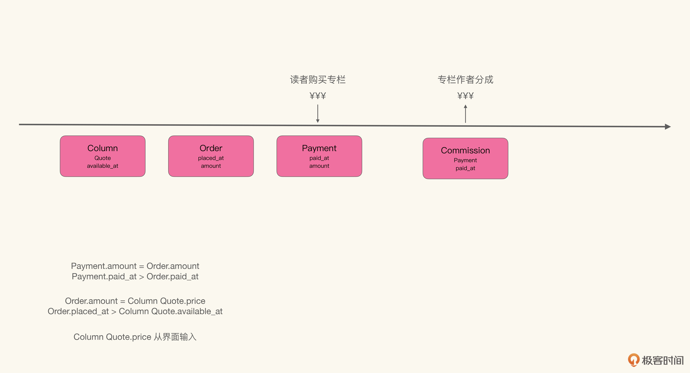

在这里我们不光记录了凭证的先后顺序，还记录了模型间的计算逻辑和时标顺序逻辑。计算逻辑自不必说，时标顺序也是非常重要的领域逻辑。

举个例子，如果某专栏目前定价199元，但是在今天下午14:00以后，会开始促销打折变成99元。那么读者在13:59分下单，根据约束Order.placed\_at > Column Quote.available\_at，他必须支付199元。

我们记录了凭证的时间节点，如果这位读者不满意，我们可以根据追溯信息有理有据地告诉他，我们并没有占他的便宜。要知道，所有牵扯到财务往来的业务，都必须经受得起这样的考验，这样才能保证业务经营的顺畅。这也是为什么我们要在事件发生阶段就明确追溯关系。

在寻找完前序凭证之后，Payment有什么履约凭证吗？那我们要看一看，从客户那里收到的钱表示了什么权责。根据业务上下文，读者购买的是阅读专栏的权利，那么我们就需要一个凭证表示读者可以在后续阅读对应专栏里的内容。

于是我们可以引入凭证订阅（Subscription），它具有关键数据项开始时间（started\_at），也就是从何时开始，用户可以阅读对应专栏的内容。我们知道这个时间必须晚于支付完成，不能允许读者在支付完成前就阅读专栏，哪怕早一毫秒都不行：

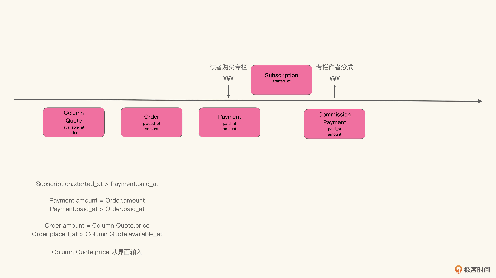

现在我们再来看专栏作者分成，这里的难点在于关键数据项金额（amount）。显然不可能让作者自己输入要提取多少分成。这个分成通常是按某个规定好的时间段提取，比如每月一次，或者每季度一次。

那么我们可以写出amount的计算逻辑（伪代码）。按照账期找到所有账期内读者购买的凭证，求出总销售金额，然后再按约定好的分成比例，计算作者的分成：

```
amount = sum(payment.amount) * percentage where payment.paid_at in (last paid, payment days)

```

不过这里就有一些数据项来路不明了：分成比例（percentage）、账期日（payment days）和上次分成付款日（last paid）。那么如果我们往前追溯，可以发现包含分成比例、账期日的凭证，是专栏撰写合同，而上次分成付款日则是通过计算得到的（分成支付凭证中最晚的那个。如果没有，则默认是合同签约日）。于是我们可以得到：

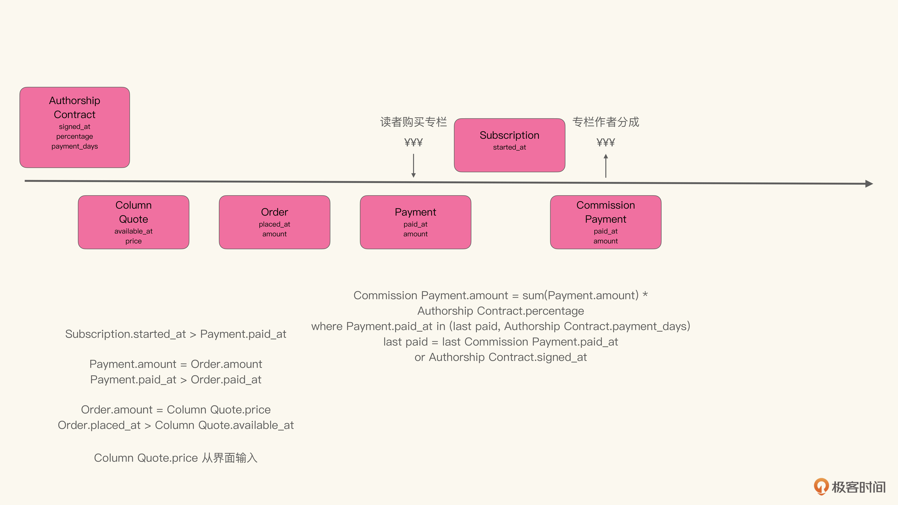

到此为止，我们获得了一条由通过关键数据项彼此关联的凭证链，同时也是领域事件流。这条凭证链表示了从作者签约、专栏定价、读者付费、作者分成的全过程，捕捉了极客时间专栏这项业务的收入流，我们称之为 **业务的脊梁**（Backbone of the business）。

不过在继续进行下一步之前，我们可以先来验证一下这个业务的脊梁的有效性，看业务能否顺畅进行。首先我们可以将所有的凭证，转化为真实的单据；然后通过角色扮演游戏，让业务方模拟业务的经营。如图所示：

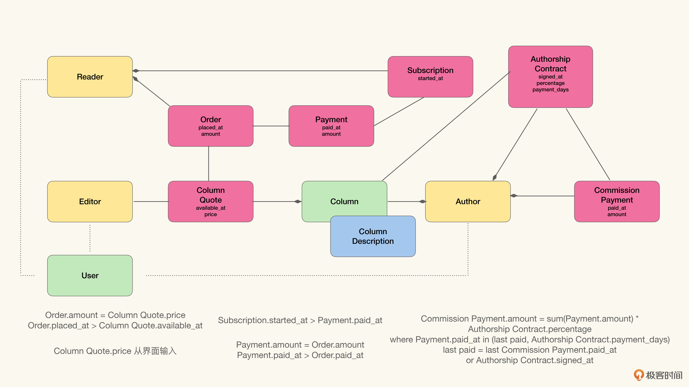

在验证的过程中，除了正常流程之外，我们主要需要模拟的是各种业务异常引起的追溯的例子，看看被业务脊梁捕捉的数据是否能够保证我们对权责的证明。比如我们之前讲到专栏定价修改、读者不满意的情况。类似的还有作者对分成不满意，质疑分成结果，等等。

这是四色建模另一个不同于其他建模方法的地方：它认为 **软件系统是业务流程的加速和优化，但是模型是要用以支撑业务运营的，并不仅仅为了构造软件而设计的，** 因而天然地更容易被业务方接受，成为统一语言。

找到并验证了业务脊梁，剩下的事情就简单了。首先寻找与凭证相关的角色，然后再寻找能够扮演这些角色的参与者，以及与凭证相关的标的物，如图所示：

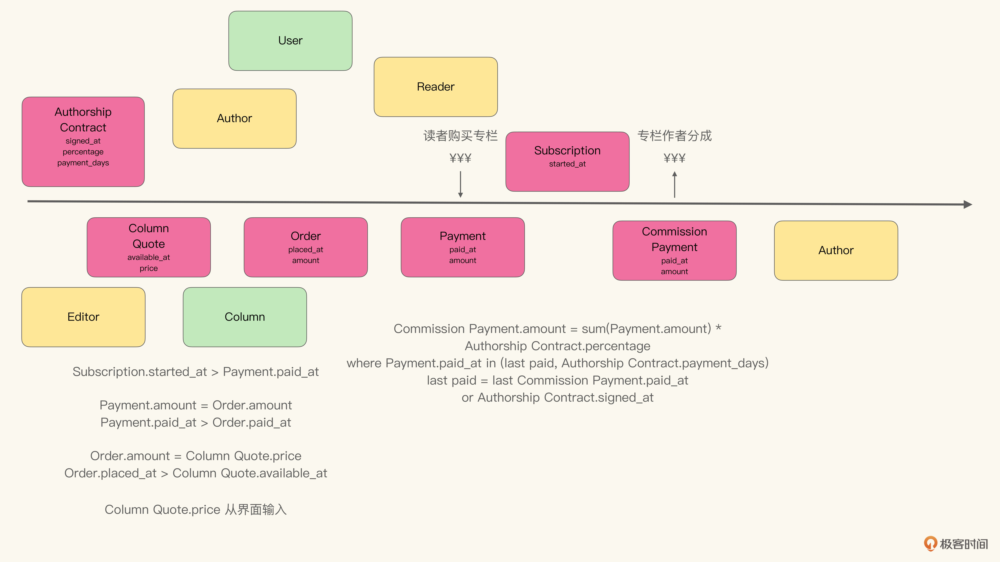

我们只需要按照关键数据项间的关联，将模型连在一起，稍加润色，补充一下描述对象，就能得到领域模型了：


围绕KPI的建模流程大同小异，这里就不再给出例子了。你可以留作思考题自行练习。

## 小结

这节课我们讲述风暴式获取事件流的隐藏弊端，那就是在没有明确的收敛逻辑下，得到的事件流具有较大的随机性。而且从实际操作的角度上看，也会让风暴法过度依赖主持人的经验与能力，结果难以保证。

而后介绍了由我发展创立的四色建模法，以及它是如何从业务的基础逻辑，也就是收入流和成本结构出发，建模业务的经营，并从中提取领域模型的。多年来，我收到过很多对四色法的反馈。其中最多的声音，就是建模建出了职业经理人的感觉。因为它更容易从纯业务角度说服业务方，采纳模型，作为统一语言。

通过第7、8、9这三节课，我们讲解了为什么我们希望使用模型作为统一语言，以及在这个方向上行业作出的努力和尝试。总体的思路就是在模型中展开业务维度、通过头脑风暴共建、严格依照业务经营逻辑建模等。每个方法各有优劣，请荟萃使用。

编辑小提示：为了方便读者间的交流学习，我们建立了微信读者群。想要加入的同学，戳此加入 [“如何落地业务建模”交流群](https://jinshuju.net/f/wjtvTP) >>>

## 思考题

请你围绕专栏运营的KPI：用户转化率（经过营销活动最终购课的比例）为例，建立相应的模型。


相信通过建立模型，你会对这节课的知识掌握得更牢固。同时，也欢迎把你建立好的模型分享出来。当然，如果有什么疑问或想法，也可以在评论区留言，我会和你交流。