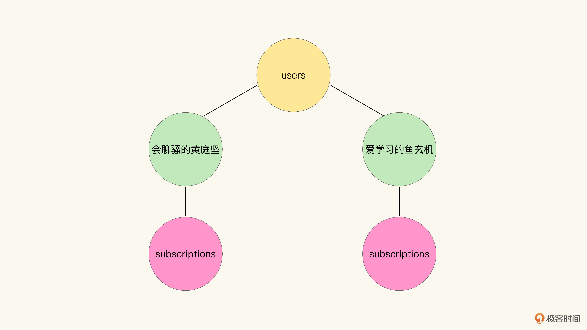
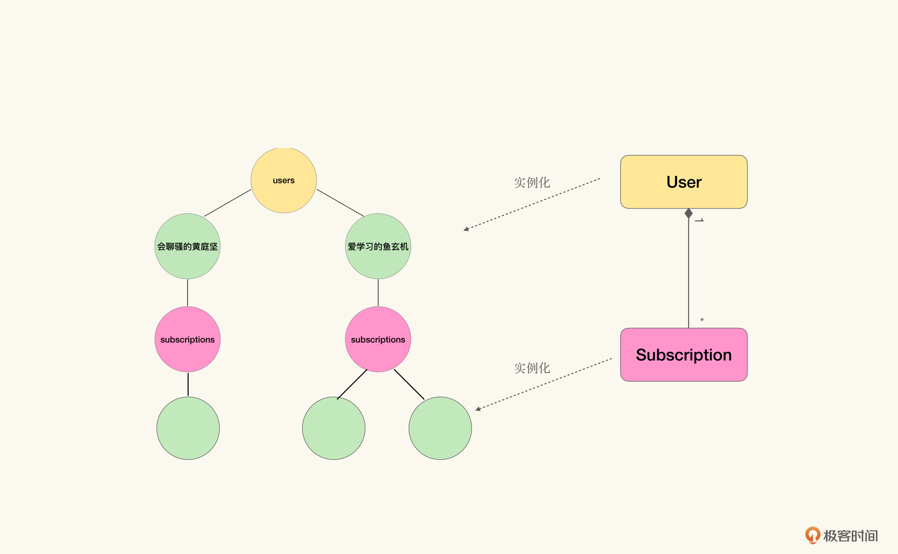
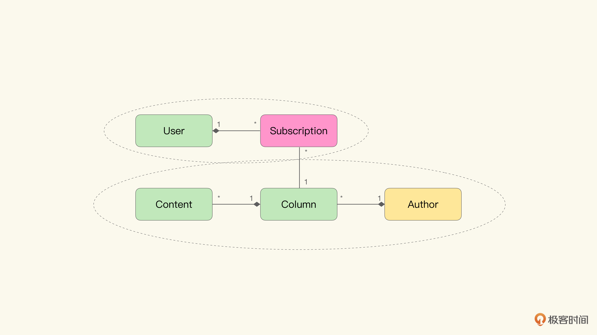
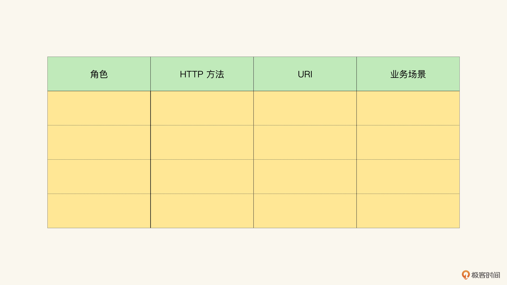
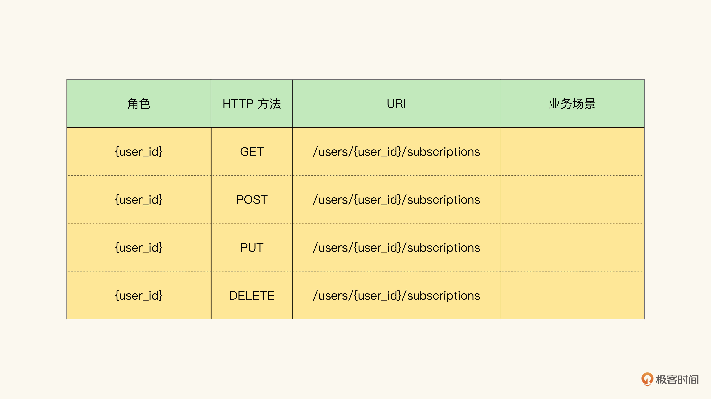
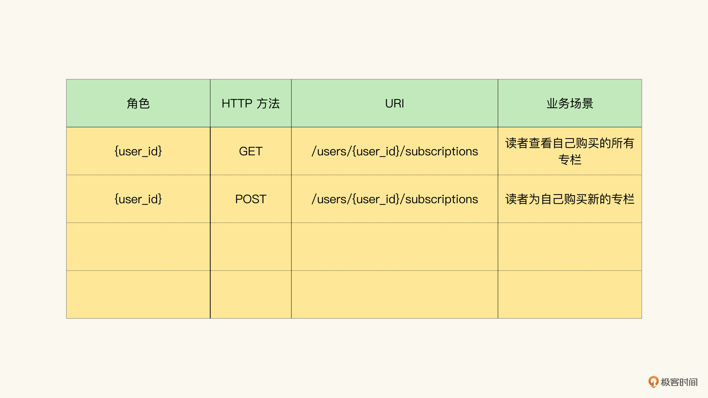
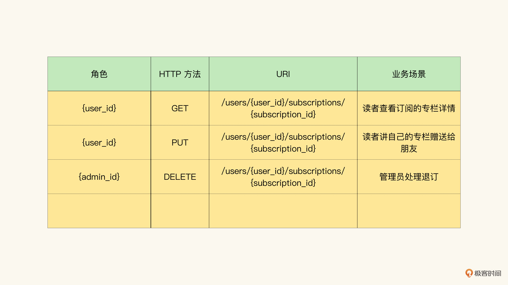
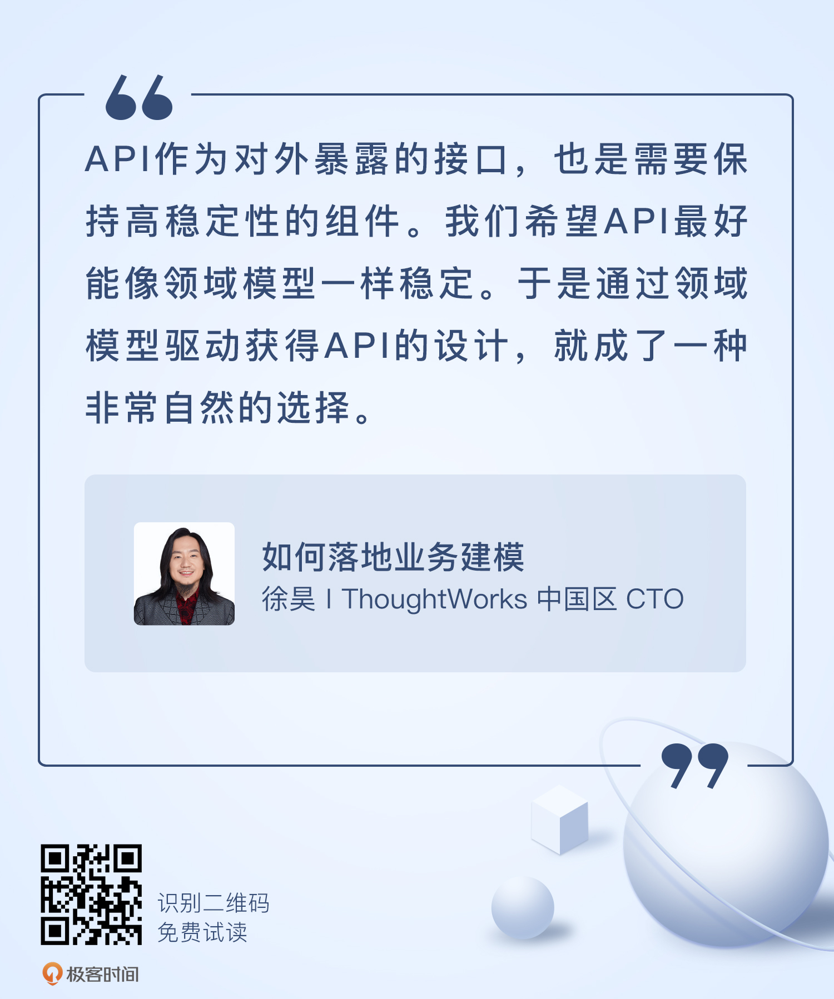

# 10 | 将模型实现为RESTful API（上）
你好，我是徐昊。今天我们来聊聊如何将模型映射为RESTful API。

通过前面九节课的学习，你应该已经学会了如何通过几种设计模式避免架构约束对模型的影响（第4-6节），也学会了几种不同的建模方法以构造业务模型（第7-9节）。然而我们之前讲的内容，主要的着眼点在于如何获得模型，以及如何组织代码。接下来，就是通过模型获得API，从而将模型作为业务能力，暴露给其他消费者调用。

在前面的课程中，我们一直都在强调领域驱动设计受到行业热捧的一个原因： **寻找到一个在软件系统生命周期内稳固的不变点，由它构成架构、协同与交流的基础，帮助我们更好地应对软件中的不确定性**。

API作为对外暴露的接口，也是需要保持高稳定性的组件。我们希望API最好能像领域模型一样稳定。于是 **通过领域模型驱动获得API的设计**（Domain Model Driven API Design），就成了一种非常自然的选择。

那么今天我们就来讲一讲怎样构建领域驱动的API设计，以及为何我们会选用RESTful API。

## 什么风格的API适合作为模型API？

想要实现领域模型驱动API并不困难，但是我们需要选择恰当的API风格： **要从数据角度，而不要从行为角度去构建API**，以保证构建的API能够和领域模型结合得更加紧密。

从行为角度和数据角度构造API存在什么差异呢？让我们通过一个例子来解释它，我想你也猜到了。对，还是极客时间的例子，我们在讲解 [催化剂方法](https://time.geekbang.org/column/article/390792) 时展示过它：


如果从行为角度进行API设计，那么我们的着眼点就应该从人机交互上入手，寻找系统提供了什么服务，并针对这些服务进行API设计。

于是在这个例子中，我们就应该从“送朋友专栏”“订阅专栏”“用户注册”“阅读内容”“专栏评分”这些交互入手，建立对应的API。

我们很自然可以想到，为每一个交互定义一个接口，从而得到服务的定义（以gRPC为例）：

```
service GeekTime {
    rpc SendGift(SendGiftRequest) returns SendGiftReply {}

    rpc SubscribeColumn(SubscribeColumnRequest) returns SubscribeColumnReply {}

    rpc RegisterUser(RegisterUserRequest) returns RegisterUserReply {}

    rpc ReadColumn(ReadColumnRequest) returns ReadColumnReply {}

    rpc RateColumn(RateColumnRequest) returns RateColumnReply {}
}

message SendGiftRequest {
...
}

..

```

这种API风格被称为 **RPC风格**（Remote Procedure Call Style）。RPC的雏形出现于1960年代末，在1980年代逐渐成为分布式系统的默认风格（1981年，被Bruce Nelson正式命名为Remote Procedure Call）。它是我们最熟悉，也是最古老的一种远程调用风格。RPC风格的优点是 **简单直接**，提供什么功能都在接口里说清楚。

然而从模型的角度上来讲，除非你严格地使用催化剂方法，否则RPC风格跟模型之间有所隔阂，也就是说结合得不够紧密。主要表现在如下两个方面。

首先， **RPC的方法名并不来自于领域对象**。已经学过催化剂方法的你应该知道，交互是一种我们将隐藏在领域模型中的业务维度展开的方式，目的是让业务方能够理解不同的业务流程是如何作用于领域模型的。因而实际上，交互是业务维度在领域模型上的补充。所以， **我们从交互入手，获得的RPC风格API并不是源自领域模型的，而是源自其他业务维度的。**

其次， **RPC风格的API的消息与返回信息通常也与领域模型无关**， **而是围绕着交互给出的具体反馈**。比如，上面例子中阅读内容这个API接口（ReadColumn），其返回值ReadColumnReply很大可能是仅仅包含对应篇章的内容，而不会包含与之关联的作者信息。

可以看到， **在RPC这种风格的API中，方法名与领域模型无关，消息与返回值也与领域模型无关。因而我们可以说，它就不是领域模型驱动的API设计。**

当然严格意义来讲，我们可以说RPC风格的API是统一语言驱动的API设计。不过经过7-9节的学习，你应该已经相信，我们能够使用领域模型取代统一语言了，于是通过领域模型而不是统一语言驱动API设计，便是我们努力的方向。

如果我们从数据角度构建API会得到什么不一样的结果呢？这个时候我们就要思考，在不同的交互行为中，需要分别修改哪些数据，以及我们要如何表示这些数据。

以最简单的用户注册为例，我们实际上是构造了新的User对象，并将其存储到数据库中。而订阅专栏，则是针对某个特定的User，在其聚合User-Subscription中，增加了新的Subscription。

我们永远都可以从另一个角度看待交互行为： **在操作结束之后，对交互背后的模型带来了什么样的改动。这就是从数据角度去建模行为。也正是从这个角度，为我们提供了一种与模型紧密相关的构造API的方法。**

那 **该怎么表示这些API** 呢？我们可以先使用URI表示所需修改的对象，然后再说明我们希望这个对象发生什么样的改变。

比如在用户注册的场景中，我们可以使用 `/users` 表示系统中所有的用户。那么注册新用户，就是在/users中增加一条新的数据。我们可以使用标准HTTP方法（HTTP Method）中的POST方法来表示。于是注册用户的API就变成了 `POST /users`。

类似的，对于订阅专栏而言，我们可以使用 `/users/{user_id}/subscriptions` 表示针对某个用户的 `User-Subscription` 聚合。其中 `{user_id}` 是可以被替换的模板，我们可以将它替换为具体的用户标识符。比如 `/users/爱学习的鱼玄机/subscriptions`，就表示“爱学习的鱼玄机”的所有订阅。

那么订阅专栏也就是在这个聚合中增加一条数据，同样，我们可以使用标准HTTP方法中的POST方法来表示。于是订阅专栏的API就变成了 `POST /users/{user_id}/subscriptions`。

相应的，其他的几个RPC风格API也可以被转化为对应的数据风格API：

- 阅读内容：读取 `Author-Column-Content` 聚合。 `GET /authors/{author_id}/columns/{column_id}/content/{content_id}`。
- 送朋友专栏：通过 `User-Subscription` 聚合，转让订阅。 `POST /users/{friend_id}/subscriptions`。
- 专栏评分：通过 `Author-Column` 聚合修改评分。 `UPDATE /authors/{author_id}/columns/{column_id}`。

可以看到，通过URI与标准HTTP方法，我们就从数据角度构造了与RPC等价的API。 **但是不同于RPC方法，我们的URI是直接从领域模型中转化得来的，我们与URI沟通的方式是依赖于标准的HTTP方法的。也就是说，我们是从领域模型出发，驱动出的API设计。**

其实这一点也不奇怪。我们在 [第7节](https://time.geekbang.org/column/article/390792) 就已经讲过： **模型是从数据变化的角度描述业务，具体的业务流程反而是被隐藏的**。那么从数据的角度去构造API，自然比从行为的角度出发更符合领域模型的特点。因而我们讲，领域模型驱动的API设计需要从数据角度去构建API。

看到这里，你可能会有一个疑问。这种操作看上去很像是直接暴露对数据库的访问啊，难道这真不是直接暴露两个表User、Subscription让别人直接改吗？POST /users和INSERT USERS表看起来很像啊！

这里关键的不同在于，我们是 **在富含知识的模型之上去暴露API的**。也就是说，并不是单纯对数据进行读写，而是通过对象间的关系，去触发富含于模型之中的逻辑。

特别是如果你仔细看我们上面讲的行为与数据的对应，就会发现 **大量的逻辑是通过聚合而不是单独对象实现的**（订阅专栏、阅读内容等）。如果换成数据库词汇，就是多表间的逻辑，而不是单独一张表去完成的。因而我们并不能将从数据角度构造API，等同于直接暴露数据库。

说句题外话（又到了题外话时间），RPC风格的API从根源上讲，是面向过程的编程风格，也就是数据中无逻辑，要通过过程完成对数据的操作。而数据风格的API，则更多是面向对象风格：逻辑都富集于对象中，对对象的访问就可以触发相应的逻辑。 **因而这种风格成功的关键与难点，就在于构造富含知识的模型**。

当年微软的ADO.NET Entity Framework和其之上的ADO.NET Data Service就忽略了聚合才是领域模型的核心（而不仅仅是实体），做了一个莫名其妙的框架出来。的确简化了直接暴露数据表操作的成本，但完全没有降低核心复杂度。

好了，言归正传。我们前面描述API的方式，比如POST/users，你看起来一定不陌生。它非常接近我们熟知的RESTful API风格。是的，RESTful API是为数不多的从数据角度去描述API的方法之一。因而我们将它作为实现领域驱动API设计的不二法门。

为什么是不二法门呢？第一，对于API，我们希望它易于被其他系统整合。

所谓的RESTful API，是指符合REST架构风格的API设计。而REST架构风格是对互联网架构（WWW，我们使用的互联网本网）的总结与提炼。通过RESTful API，我们能够获得相当于互联网的开放性和易于整合性。当然，前提是需要满足REST架构属性，比如无状态、可缓存等等。

第二，则是因为没有什么其它数据风格API可选。比如事件驱动API（Event Driven API），对于单体多层架构而言，有点大材小用，所付出的成本与收益不成比例。

因而目前我们讲，在前云时代，RESTful API是我们实现领域驱动API设计的不二法门。

## 如何将模型映射为RESTful API？

那么如何将领域模型映射为RESTful API呢？总共分为四步：

1. 通过URI表示领域模型。
2. 根据URI设计API。
3. 使用分布式超媒体（Distributed Hypermedia）设计API中涉及的资源。
4. 使用得到的API去覆盖业务流程，验证API的完整性。

今天我们先来讲解前两步，后两步则留待下节课再讲。

### 通过URI表示领域模型

我们先来看如何通过URI表示领域模型。我们都知道，除去scheme、host声明等信息，URI主要通过路径（Path）指示某个资源。而 **路径可以看作是对某种层次结构遍历的结果。**

比如URI中有这样的一个路径“/users/爱学习的鱼玄机/subscriptions”，那么我们可以认为它实际是下图所示的图结构中，对右侧分支遍历的结果：



那么同样地，如果是对左侧分支遍历，就能得到另外一个路径“/users/会聊骚的黄庭坚/subscriptions”。

仔细看这个图，我们会发现它是将 `User-Subscriptions` 聚合进行实例化之后，再将实例与领域对象结合在一起，得到的对象图：



那么当我们看到路径 `/users/爱学习的鱼玄机/subscriptions` 时，或者它的模板化表示形式 `/users/{user_id}/subscriptions` 时，我们就可以还原出路径背后的领域模型，也就是 `User-Subscription` 的一对多聚合关系。

通过实例化的方式，我们将领域模型展开成了对象图。然后，再在这张对象图上遍历，就能得到可以表示领域模型的URI路径模板。

当然，一旦我们理解了实例化和领域模型之间的关系，我们也可以直接从领域模型出发，设计URI路径模板。

从领域模型出发设计URI，主要依赖的是 **聚合关系**。因此我们需要在领域模型中寻找聚合边界，再根据聚合边界内的关系设计URI。

比如在下面这个极客时间专栏的领域模型中，存在两个不同的聚合边界：

1. 以User为聚合根的 `User-Subscriptions` 聚合；
2. 以Author为聚合根的 `Author-Column-Content` 聚合。



然后我们就可以从聚合中依次设计对应的API模板了。比如对于 `User-Subscription` 聚合，我们可以得到如下的URI模板。

1. `/users User` 聚合根，表示系统中的全部用户。
2. `/users/{user_id} User` 的实例化，表示通过 `user_id` 标定的某个用户。
3. `/users/{user_id}/subscriptions User-Subscriptions` 聚合，表示某个用户的全部订阅。
4. `/users/{user_id}/subscriptions/{subscription_id} User和Subscription` 的实例化，表示通过 `user_id和subscription_id` 标定的某个订阅。

这里我们一共得到了四个不同的URI模板，其中两个是集合逻辑（1和3），两个是实体逻辑(2和4)。当URI模板表示集合逻辑时，我们无需实例化，只需要引用模型中的概念即可。而表示实体逻辑时，我们就需要对领域模型进行实例化，将它们从概念具象化到某个特定的个体。

类似的，我们也可以将Author-Column-Content聚合表示为URI模板：

1. `/authors Author` 聚合根，表示系统中所有的作者。
2. `/authors/{author_id} Author` 的实例化，表示某个具体的作者。
3. `/authors/{author_id}/columns` 某个作者所撰写的所有专栏。
4. `/authors/{author_id}/columns/{column_id}` 作者撰写专栏的实例化，表示某个特定的专栏。
5. `/authors/{author_id}/columns/{column_id}/contents` 某个作者的某个专栏的全部内容。
6. `/authors/{author_id}/columns/{column_id}/contents/{content_id}` 某个作者的某个专栏内容的实例化，表示某个特定的课程。

看到这里你可能会问，像 `/authors/{author_id}/columns/{column_id}/contents/{content_id}` 这样的URI模板不会太长了吗？我们是否需要简化一下？

答案是不需要。比起URI模板的长短，我们更关心这些模板是否与领域模型的结构一致。在模型中，特定的课程是通过 `Author-Column-Content` 聚合关系表达的，那么我们就需要通过如此冗长的URI模板来表示它。

当然，如果你觉得URI模板的长度过长，那么重新审视你的领域模型也是十分有必要的，看看其中是否具有不恰当的聚合关系。如果聚合关系正常，就请坦然接受它的URI表现形式。

### 根据URI设计API

在根据领域模型得到了URI模板之后，我们就需要围绕着URI进行API设计了。这个过程惊人地简单。我们需要做的就是构造这样一张表格，表格中包含：角色、HTTP 方法、URI、业务场景这样一些条目。如下图所示：



然后，我们只需填入角色、URI，然后按照穷举法，填入所有的HTTP方法就可以了。比如，对于 `/users/{user_id}/subscriptions` 这个URI，我们可以将常用的四个HTTP方法填入表格：



这里有个我个人的小偏好，就是 **通过模板化表示角色**（通常的做法是以统一语言中的角色名加\_id）。比如第一行，实际我的意思是，角色是user，并且和URI中给出的 `user_id` 是同一个人。当然，也可以只统一语言中的角色名。

下一步，我们就需要 **寻找业务方反馈**，帮助我们判断对于这些由HTTP方法和URI组成的行为，是否存在合理的业务场景。假如业务方确定了业务场景的存在，那么表格中的条目就成为了API候选。

当然在上图的表格中，我们对表示集合逻辑的URI施加了PUT和DELETE方法。对于集合逻辑而言，PUT和DELETE通常没有任何含义。我们只是为了说明一个过程，通过这样的枚举，不容易遗漏可能的API候选。

最后，在这个例子里，我们得到的API候选是这样的：



这个过程很简单吧。那我们再来看一个例子，这个例子里我们引入不同的角色。我们通常会将API候选看作是HTTP方法和URI的组合，然而调用方的角色其实也是很重要的。过程我就省略了，方法和刚才讲的一样，我们着重看一下结果：



通常来说，已经订阅的专栏就无法修改了，但是我们假设有赠送功能。于是呢，读者发起的“对于专栏的修改”，那么其实就是赠送；与之相对的，由系统管理员发起的“对于读者订阅专栏的修改”，可能就是处理退订。

看到这里，我不知道你发现没有， **这个设计API的流程和催化剂法的变体角色-目标-实体法如出一辙。其中业务场景是目标，而实体则是通过URI表示的领域模型。** 所以这样的API建模过程，同时也在帮助我们展开业务维度，更好地将领域模型作为统一语言。

到此为止，我们得到了一系列的API候选，接下来就需要使用分布式超媒体设计API中所涉及的资源，以完善API的设计。以及使用得到的API去覆盖业务流程，验证API的有效性。这两步，我们下节课再讲。

## 小结

这节课我们讲述了，实现领域模型驱动API设计，需要选择恰当的API风格。也就是不要从行为角度而要从数据角度去构建API。同时我们分析了为什么从行为角度构建的API和模型之间存有隔阂，而从数据角度构建的API能够和领域模型结合得更加紧密。

然后我们解释了为什么RESTful API是在前云时代，实现领域驱动的API设计的不二法门。一个由于其自身的特点：源自互联网架构，能提供更好的互联性；另一个则因为也没什么其他更好的选择了。

最后我们介绍了如何将领域模型实现为RESTful API。分为四步：

1. 通过URI表示领域模型；
2. 根据URI设计API；
3. 使用分布式超媒体设计API中涉及的资源；
4. 使用得到的API去覆盖业务流程，验证API的完整性。

我们讲解了前两步，后两步则要留到下节课继续。

## 思考题

我们在使用RESTful API时，经常会遇到这种情况：不同的客户端（比如手机或页面）需要不同格式的数据。那么我们有没有办法，只提供一种格式的数据，但能满足所有客户端的需求，不需要根据客户端的要求而修改，并且还不怎么影响性能？



欢迎把你的思考和想法分享在留言区，我会和你交流讨论。我们下节课再见！