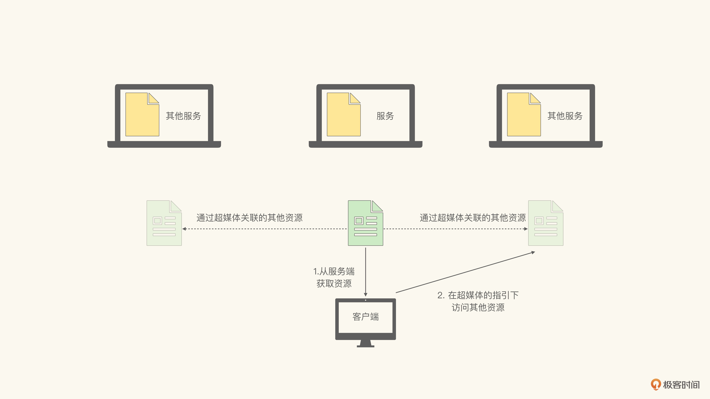
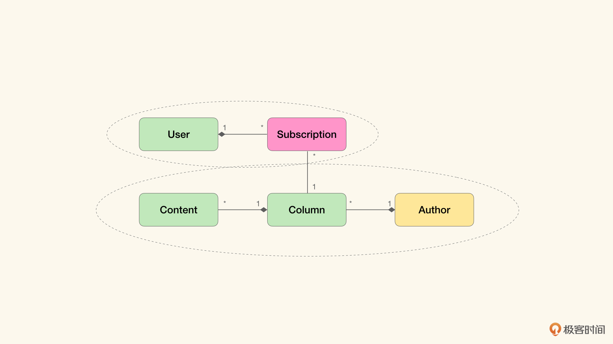
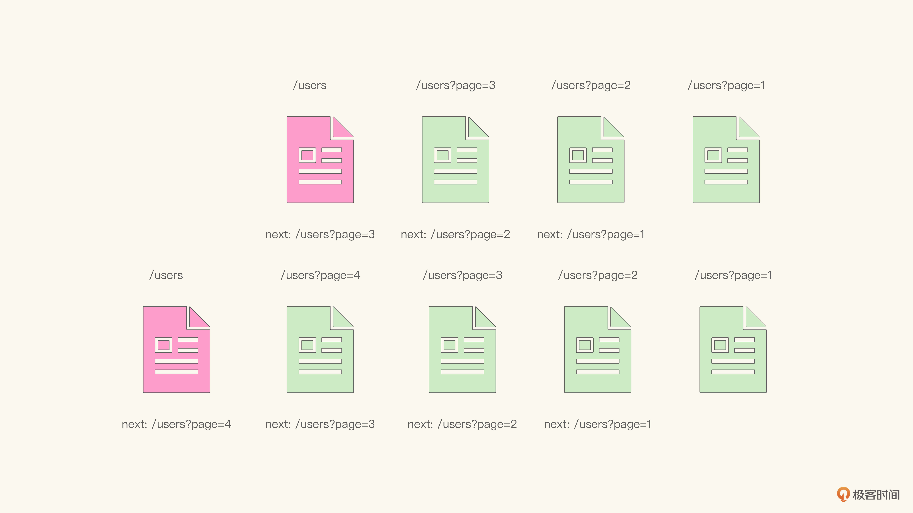
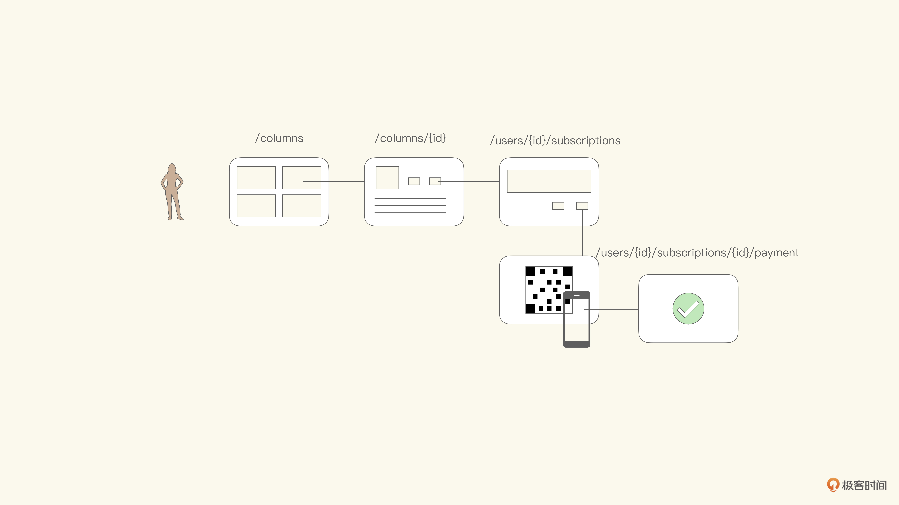

# 11｜将模型实现为RESTful API（下）
你好，我是徐昊。今天我们来聊聊继续如何将模型映射为RESTful API。

上节课我们学习了如何将领域模型实现为RESTful API的宏观步骤，分为四步：

1. 通过URI表示领域模型；
2. 根据URI设计API；
3. 使用分布式超媒体设计API中涉及的资源；
4. 使用得到的API去覆盖业务流程，验证API的有效性。

并着重学习了，如何通过URI表示领域模型；并在得到与领域模型对应的URI之后，使用类似角色-目标-实体法的分析方法，获得API候选。那么今天我们就继续学习后面两步，通过分布式超媒体设计API中涉及的资源，并将使用API覆盖业务流程，以验证API的有效性。

## **RESTful API是一种什么样风格的API？**

到目前为止我们得到的API候选，比如 GET /users 等，还不能被称作RESTful API，而仅仅可以被叫做 **基于HTTP的远程过程调用**（HTTP RPC）。那么 **RESTful API到底是一种什么样的API呢？**

RESTful API是指 **符合REST架构风格的API设计**，而REST架构风格是对互联网规模架构（Internet Scale Architecture）的总结与提炼。这一切都源于Roy Fielding提出的一个问题：既然互联网（Internet）是人类迄今为止构造的最大的软件应用，那么到底是什么样的架构原则，支撑了如此规模的异构且互联的系统呢？我们能从中学习到什么，以帮助我们更好地构建软件？

Roy Fielding将互联网定义为 **分布式超媒体信息获取系统**（Distributed Hypermedia Information Retrieval System）。也就是由超媒体描述的、分布式的信息系统。在这个系统中，信息分布在不同的服务器中，并由超媒体联通。换句话说， **分布式超媒体是互联网的集成策略**（需要进一步了解的同学可以去看看 [Roy的论文](https://www.ics.uci.edu/~fielding/pubs/dissertation/top.htm)）。

因而我们必须理解这种集成策略给整个系统带来了什么影响，这样才能在实现RESTful API时，尽可能发挥它的优势。

在我看来，这种集成策略实现了客户端与服务器之间的渐进式服务消费（Progressive Service Consumption）。 **而这种渐进式服务消费，在客户端的多样性和API的稳定性之间，取得了完美的平衡。**

也就是说，它让我们可以用同样一套API，去对应具有不同诉求的参差多态的客户端们（我将这种API称为幸福API，因为罗素说“参差多态乃是幸福的本源”。那么能够支持参差多态的客户端的API，也就是幸福API）。

让我们回想一下，当你访问网络上的信息时，你会通过URI指定需要访问的页面。页面中会关联CSS、JavaScript等所需的资源，并包含其他页面的链接。浏览器会下载对应的CSS、JavaScript，完成界面的渲染。你也可以通过页面中的链接，去访问其他关联的页面。

在整个过程中，你无需考虑CSS、JavaScript来自哪里，关联的页面是否来自同一个网站。因为从始至终，你都将这些关联的资源看作是一个完整的资源在消费。这是我们习以为常的场景。

然而如果我们从系统集成的角度重新看待这个过程，就会有不同的体会。 **网页中对其他资源的引用，实际上表示了对其他服务计算结果的整合**。一个典型的例子就是Google Analytics，虽然它是以js的形式出现。但当页面引用到了这个js资源时，实际上完成的是对Google Analytics服务的整合。

而当你点击页面中包含的链接时，浏览器会为你请求对应的网站资源，并将计算结果（大概率是另一个页面）在浏览器客户端里展示。这也可以看作是对其他系统的集成。更具体地讲，也就是浏览器客户端通过延迟（Lazy）调用的方式，整合了其他系统提供的服务。

所以无论是css、js这样的资源，还是通过超链接引用的其他页面，都是服务端返回的页面中描述的。而客户端则根据服务端提供的描述，选择恰当的时机，访问这些关联的资源，也就是整合其他系统提供的服务。这样的系统集成方式，我们称之为 **由服务器指导的客户端侧集成**（Server-side guided client-side integration）。如图所示：



由于对于关联资源的访问是由客户端发起的，并不是由服务器端强制的，那么客户端可能出于某些原因（安全、计算资源受限等）选择不去访问某些关联资源。

比如，在智能手机大规模流行之前，大部分手机上的浏览器不具备完整执行js的能力，因而很多浏览器选择不加载任何js资源。

从这样的角度出发，我们就会发现，CSS、JavaScript或者页面中通过超链接引用的其他页面， **都可以看作是对当前页面的增强**。比如CSS增强了当前页面的视觉效果，js增强了当前页面的交互，页面中的超链接为页面中的内容提供了额外的信息。 **于是通过超媒体格式，我们不仅可以描述当前的服务，还可以描述增强的服务。**

比如，你在极客时间专栏里阅读这篇文章，那么当前的服务是让文章在浏览器中显示，供你阅读，这是默认服务。那么怎么增强它呢？我们可以提供语音的版本，也可以提供视频，还可以提供大字打印版等等。那么我们可以在超媒体格式中，描述这些关联的资源。如下HTML代码所示（HTML是最常见的超媒体）：

```
<article>
    <title>11 | 将模型实现为RESTful API（下）</title>
    <p>....</p>
    <link href="http://voice.geekbang.org/chapter11.mp3" rel="voice"/>
    <link href="http://video.geekbang.org/chapter11.mp4" rel="video"/>
    <link href="http://easy-reading-print.com/13678328" rel="print"/>
</article>

```

在这段代码中，我们通过link标签，表示了这篇文章与其他资源的关系。可以看出，我们关联了“ [http://voice.geekbang.org/chapter11.mp3”“http://video.geekbang.org/chapter11.mp4”和“http://easy-reading-print.com/13678328”](http://voice.geekbang.org/chapter11.mp3%E2%80%9D%E2%80%9Chttp://video.geekbang.org/chapter11.mp4%E2%80%9D%E5%92%8C%E2%80%9Chttp://easy-reading-print.com/13678328%E2%80%9D) 。它们与当前文章的关系分布为voice、video和print。此时，客户端可以根据这些额外的信息，在不同的情景下选择加载哪些额外的资源。

假设此时我们有三个客户端，分别是用于阅读的某阅读器，用于听书的某播放器，以及某个打印机。那么这些客户端只需要拿到这段超媒体，然后各自选择对应的服务即可：

- 阅读器按照HTML格式显示内容，忽略其他关联的服务；
- 播放器从超媒体中提取由 `voice` 链接的资源，去加载对应的mp3，忽略其他HTML文本和服务；
- 打印机从超媒体中提取由 `print` 链接的资源，送去打印，忽略其他HTML文本和服务。

可以看到，我们使用了同样的API，支撑起了完全不同的客户端。而这些客户端彼此之间也并不知道对方的存在，它们只关心自己关注的资源。换言之， **通过超媒体描述的增强服务，让客户端和服务器之间形成了一种协商与匹配的关系，也就是我们所说的渐进式服务消费**。

所谓渐进式，指得是按需索取，而不要求消费全部关联的服务。也正是渐进式的消费方式，促使互联网成为了一个异构、松耦合且开放的系统。同时这也正是我们希望自己所构建的系统能够具有的特质。

所以 **通过分布式超媒体的设计，实现这种渐进式服务消费，也就是我们从HTTP RPC过渡到真正的RESTful API的重中之重**。

这里再讲三个题外话。第一个， **以渐进式思路构造的超媒体格式，是一个被极度低估了的思考模型**。

它的一个具体应用——渐进增强（Progressive Enhancement），是开发前端应用的最佳思考方式，同时也是诸多JavaScript框架的核心思路。掌握了它，你就能迅速成为资深前端工程师。

我仍然记得我是如何在领悟了渐进增强之后，在4个小时之内，从前端白丁成为前端架构师的。以及，多年前那个初秋的午后，郑晔同学（对，就是在极客时间已经写了三个专栏，正在努力写第四个的郑晔同学）在西安高新区某公交站等出租车时，跟我说起前端学习是如何如何之零碎，不如后端知识系统。当我用了20分钟给他讲了渐进增强，然后他几乎是马上就全都会了。

第二，如果通过超媒体关联的资源是代码，那么我们就能指引客户端按照服务端设计的行为，去执行和消费超媒体资源了。

比如，我们现在有一个订单，需要通过支付网关支付。而支付网关可能有很多不同的选择，网银啊、微信啊、支付宝什么的。那么我们可以通过超链接关联支付网关的客户端：

```
<article>
    <title>订单详情</title>
    <p>....</p>
    <link href="http://payment.com/12358921" rel="payment"/>
    <link href="http://payment.geekbang.org/bank.js" rel="payment-client"/>
</article>

```

这意味着，客户端不需要知道使用的是哪个支付网关，只需要加载 `payment-client` 关联的资源，并通过它完成支付即可（当然我们需要提前约定JavaScript的加载策略和入口函数）。于是，服务端进一步控制了客户端的行为，不仅仅是通过超媒体指引了增强的服务，连带如何消费这些服务也提供了指引。

这就是按需代码（Code-On-Demand），通过它，我们能够在将服务器端的计算压力转移到客户端的同时，也不会丧失自己对计算的控制。此外，通过它，也进一步解耦了客户端与服务器之间的耦合。客户端不需要理解服务器端的逻辑，只需要按照指示执行代码即可。可以这么说，按需代码这个技巧，对于需要高灵活度的API设计是极其重要的。

第三，这种完全由服务端控制的客户端行为，也被称作HATEOAS（Hypermedia As The Engine Of Application State），即 **超媒体作为应用程序状态的控制引擎**。在Richardson成熟的模型中（Richardson Maturity Model），是最高成熟度的RESTful API。我想经过今天的学习，你应该完全理解其背后的原因了。

好了，我们言归正传，接下来就看看如何使用分布式超媒体来设计API中的资源，以实现HATEOAS。

## 如何将模型映射为RESTful API？

### 通过分布式超媒体设计API中涉及的资源

首先我们需要知道什么样的格式属于超媒体。那么 **包含超链接的格式都可以看作超媒体**，因此HTML是超媒体格式。在前面的例子里，HTML中的link是表达关联资源的主要手段，它的构成要素有两个：

1. 指向关联资源的链接（href）；
2. 与主资源是哪种关联关系（rel）。

这两个是构成超链接的必要因素，缺一不可。同时，只要具备这两个要素，都可以被看作超链接。比如如下HTML元素，可以当作超链接：

```
<a href="http://payment.com/12358921" rel="payment"/>

<area shape="rect" coords="184,6,253,27" href="http://some-place.com" rel="center" />

```

**而我们常用的JSON和XML并没有提供默认的链接格式，所以它们并不是超媒体**。于是我们在设计RESTful API的时候，要使用HAL（Hypertext Application Language），而不是原味的JSON或者XML（Vanilla JSON or Plain XML）。

HAL目前还是Internet标准的一个提案，你也可以自定义自己的XML和JSON超媒体格式，不过我估计最终结果和HAL应该差不多，所以还不如直接用HAL来得简单。

XML的HAL基本上就是把HTML的link作为标准标签引入了XML，而JSON的HAL则定义了\_links结构来表示链接。如下所示，就是XML HAL和JSON HAL规范中给出的同一个资源的示例：

```
Content-Type: application/hal+xml
<resource rel="self" href="/orders/523">
    <link rel="warehouse" href="/warehouse/56"/>
    <link rel="invoice" href="/invoices/873"/>
    <currency>USD</currency>
    <status>shipped</status>
    <total>10.20</total>
</resource>

Content-Type: application/hal+json
{
  "_links": {
    "self": { "href": "/orders/523" },
    "warehouse": { "href": "/warehouse/56" },
    "invoice": { "href": "/invoices/873" }
  },
  "currency": "USD",
  "status": "shipped",
  "total": 10.20
}

```

解决了格式问题，我们来看看怎么使用超媒体设计API中的资源。这里的关键，正如我们刚才所讲，是 **如何通过超链接构成渐进式服务消费**。

我们仍以极客时间专栏的模型为例：



首先我们看一下聚合根的超媒体描述。对于一个User实例而言，我们可以使用如下的HAL JSON来描述它：

```
{
    "_links": {
        "self": { "href": "/users/19" },
        "subscriptions": { "href": "/users/19/subscriptions" }
    },
    "username": "爱学习的鱼玄机",
    ...
}

```

这段HAL JSON中包含两个超链接：self和subscriptions。self表明获取当前资源的URI，我们会将这个URI称作主URI（Primary URI）。这个URI从概念上来讲，和ID是等价的，也就是可以用于唯一定位当前资源的标识符。同时，self也是用以缓存的URI。

subscriptions表示了聚合关系User-Subscriptions，也就是指示了如何寻找被当前User聚合的Subscription。对于聚合根而言，需要为所有的聚合对象提供链接，以指示如何获取这些聚合对象。

你可能会问，self URI有什么用？如果单独对一个User实例而言，可能用处不大。但是在集合资源中，self URI就是不可或缺的了。比如对于 `/users`，我们使用如下的HAL JSON描述：

```
{
    "_links": {
        "self" : "/users"
    },
    "_embedded": {
        "users": [
            {
                "_links": {
                    "self": "/users/18"
                },
                "username" : "会聊骚的黄庭坚",
                ...
            },
            {
                "_links": {
                    "self": "/users/19"
                },
                "username" : "爱学习的鱼玄机",
                ...
            },
            ...
        ]
    },
    "total": 43215,
    ...
}

```

可以看到，我们通过 `_embedded` 表示了所有的用户。不过这里还有一个需要我们权衡的地方。如果User对象有很多属性（比方说包含年龄、家庭住址、个人状态等），那么我们需要在 `/users` 的HAL JSON中包含所有这些属性吗？

如果包含所有属性，那么这个HAL JSON的体积可能会变得非常巨大；而如果不包含所有的属性，那么在客户端需要使用其中某些数据的时候，就会拿不到相应的信息。

这时候就该列表中每一个User对象中包含的self URI发挥作用了。 **我们可以把集合资源和其中的独立资源，看作是渐进式的两种不同服务。**

也就是说，我们可以把在集合资源中包含的数据，看作是更基础的服务，像常用数据这样，可以满足大部分客户端在通常情况下对用户数据的需求。而其中每一个User对象中包含的self URI所指示的服务，我们可以将其看作是增强服务，也就是全量数据。

于是，如果某个客户端需要不包含在常用数据中的信息，那么它可以通过self URI去获取全量数据。 **也就是说，我们将常用数据和全量数据设计成渐进式消费的两种不同的服务，并通过分布式超媒体格式，描述了它们之间的关联。**

这样我们就可以让同样一份超媒体描述，来支撑不同的客户端了。与此同时，我们也不需要为不同的客户端提供不同格式的数据信息。当然，你可能会问，这么做，难道不会有性能问题吗？ **答案是有，不过没关系，因为有缓存。**

REST架构大量依赖缓存来缓解性能问题。我们甚至可以说，是否能够有效地利用缓存，会决定REST架构的成败。这也是为什么我们强调主URI应该是用于缓存的URI。 **也就是在构造资源的时候，我们要将缓存当作必须考虑的特性，详加设计。**

让我通过一个例子，来看看缓存会怎样影响我们的设计决策。这也是非常常见的一个场景——分页。

你可能注意到了，在前面的HAL JSON中， `/users` 一共有43215个用户，如果将所有的用户都包含进来，就会产生极大的HAL JSON文件，因此我们需要分页处理。好在这并不难：

```
{
    "_links": {
        "self" : "/users",
        "next" : "/users?page=3"
    }
    ...
}

```

我们可以通过next链接表示后面的一页。那么我们怎么才能通过缓存，使得当有新用户注册的时候，大部分页面的缓存都不失效呢？

一个有效的策略是，永远不缓存 `/users` 页面，也就是 `/users` 永远表示新近注册的用户。如果它们达到分页上限时（比如50），就生成新的页面id，并缓存它，然后继续使用 `/users` 等待新注册的用户。如下图所示：



那么前面几页的HAL JSON可能就是这样子的（如下所示）。而且你会发现缓存下来的页面，我们永远不需要修改其中的内容：

```
// 以下为未被缓冲的信息
{
    "_links": {
        "self" : "/users",
        "next" : "/users?page=4"
    }
    ...
}

// 以下为被缓冲的信息
{
    "_links": {
        "self" : "/users?page=4",
        "next" : "/users?page=3"
    }
    ...
}

{
    "_links": {
        "self" : "/users?page=3",
        "next" : "/users?page=2"
    }
    ...
}

```

那你可能会有疑问，如果客户端与服务端对分页的要求不同，这时候该怎么办？比如客户端需要每页显示50条，而服务器端则需要按每页20条缓存？

答案是： **服务器永远不需要考虑客户端的需求。** 把客户端的额外需求，当作渐进式服务消费的需求，那我们只需要提供对应的链接即可。

也就是说，只要保证页面间的链接，剩下的就交由客户端自行处理。 **这就是互联网架构的精髓，将集成与订制推向客户端，从而保持服务端的稳定。**

### 将API映射回业务流程

在我们将API中涉及的资源都使用分布式超媒体描述了之后，我们就获得了完整的API定义。而且，借由分布式超媒体，我们可以达成HATEOAS，实现渐进式服务消费，从而充分分离客户端与服务端的耦合与依赖。此外，如果你充分考虑了缓存策略，性能也不会构成任何问题。

那么剩下的最后一步，就是将API重新映射回所需要支撑的业务流程或者用户旅程之中，与业务方一起验证这些API是否能够满足所有的需求。示意图如下：



如果我们将API作为模型的另一种表现形式，那么映射会在流程中与业务方验证，也就和磋商形成统一语言的过程一致了。我想你已经有足够的了解了，就不再赘述了。

## 小结

这节课我们讲述了什么是分布式超媒体，以及为什么它是互联网架构的默认集成模式。以及我们如何通过使用分布式超媒体形成渐进式服务消费。并以此为核心理念，讨论了如何描述API中的资源。此外，我们还重点讨论了集合资源，以及如何通过缓存解决分页等问题，并通过一个分页的例子展示了如何将客户端与服务端充分解耦。

至此，你应该学会了在单体分层架构模式下，如何将模型的能力通过RESTful API暴露。那么接下来，我们将进入云时代的业务建模，看看新的架构约束到底将会怎样影响我们建立业务模型。

编辑小提示：为了方便读者间的交流学习，我们建立了微信读者群。想要加入的同学，戳此加入 [“如何落地业务建模”交流群](https://jinshuju.net/f/wjtvTP) >>>

## 思考题

你是如何理解云平台的？在你看来，云平台的哪些特性会影响我们的业务模型？


欢迎把你的思考和想法分享在留言区，我会和你交流。那么旧约部分到这里就结束了，我们新约篇章再见！