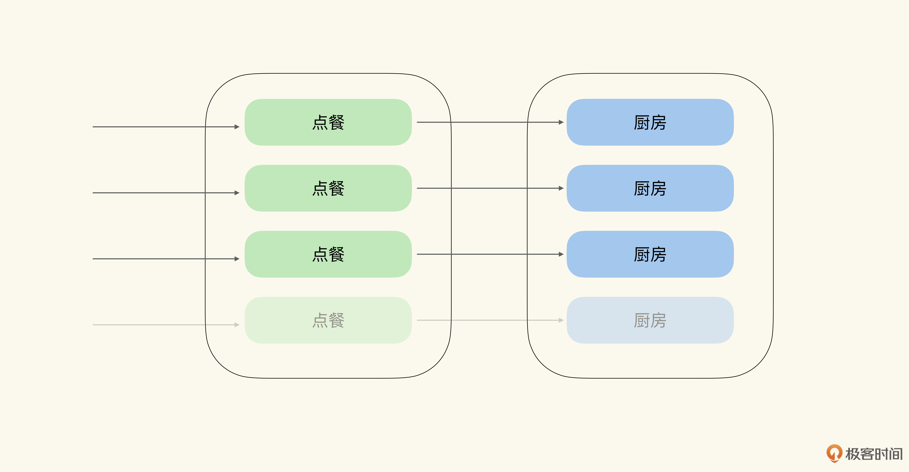
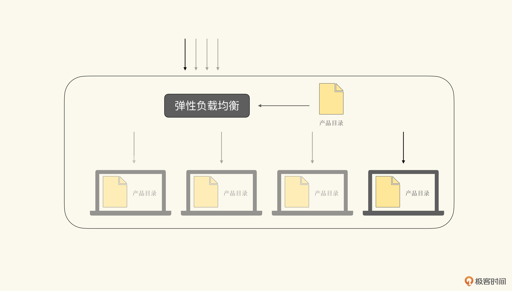
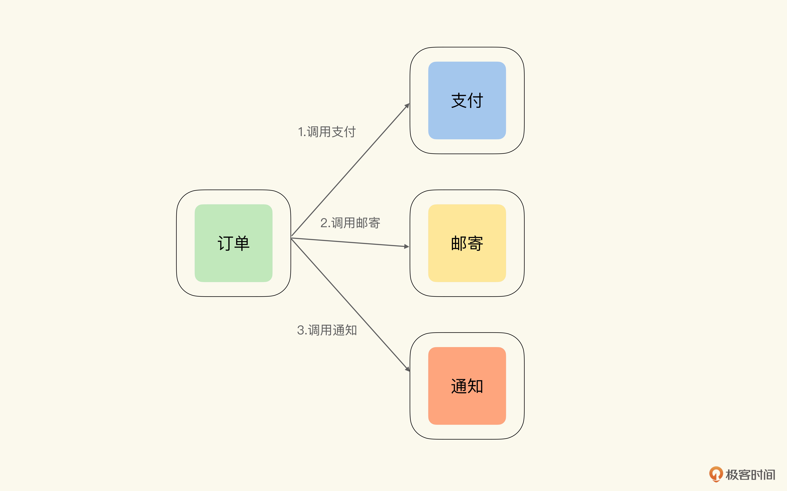
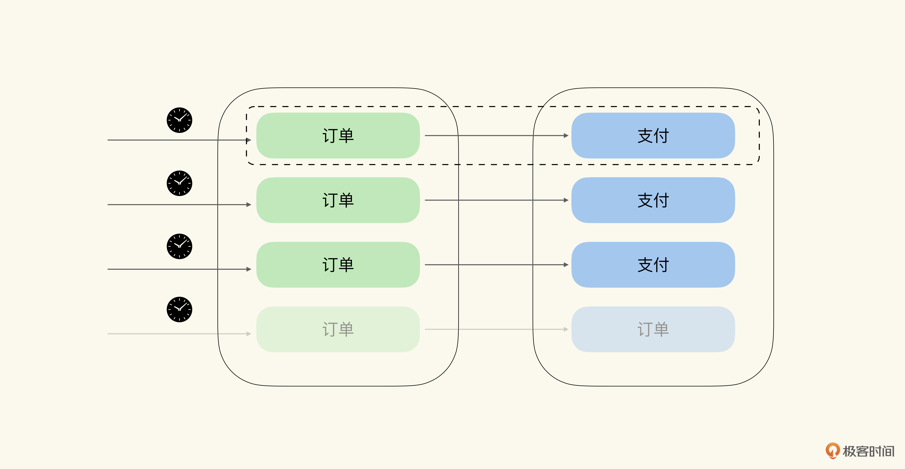
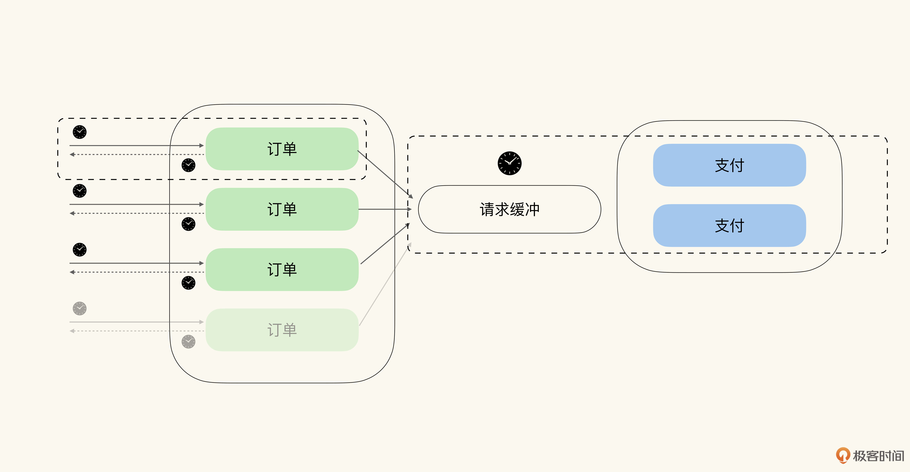
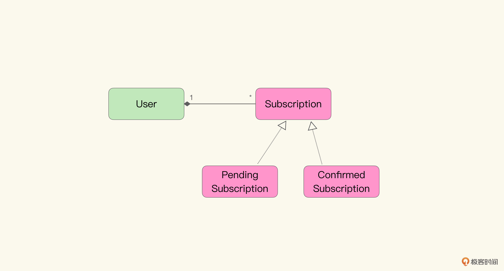
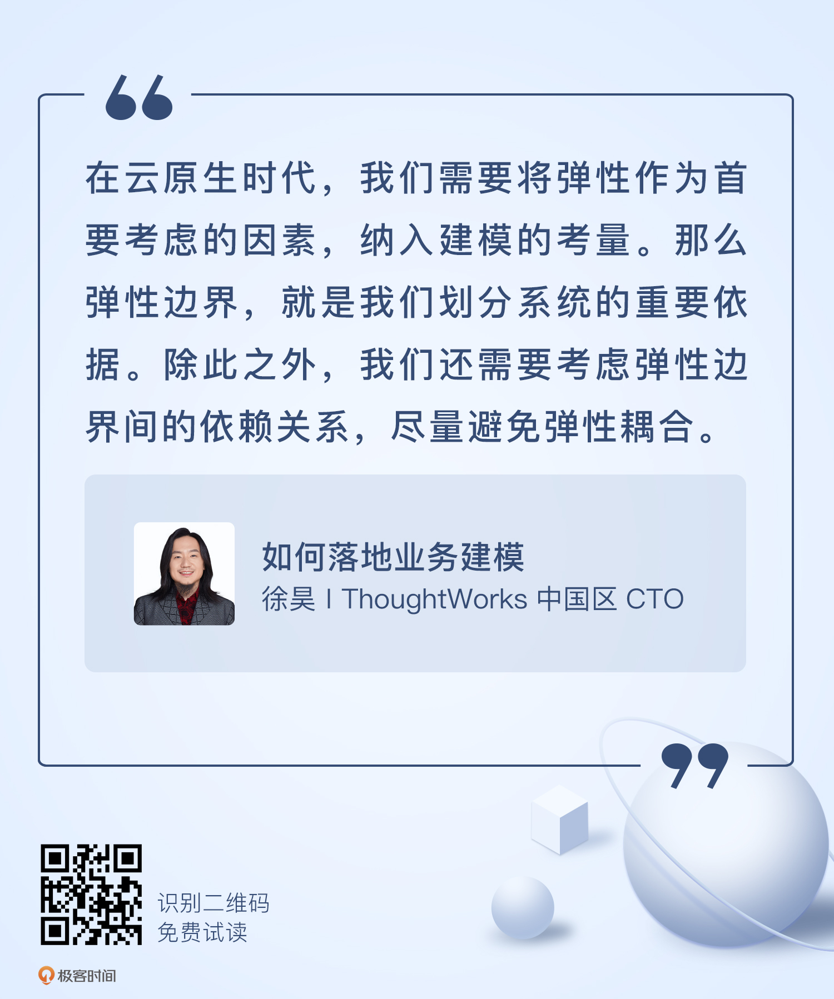

# 13｜云时代的挑战（下）：如何保持弹性边界的独立性？
你好，我是徐昊。今天我们来继续聊聊弹性边界对业务建模的影响。

上节课我们介绍了弹性边界的概念，以及弹性优先原则。照此来看，我们是不是按照组件不同的弹性要求，将它们分别放置到不同的弹性边界中，就可以最优化地利用云平台的能力了呢？

答案并没有这么简单。因为除了弹性边界外，我们还需要考虑流量的传播，以及在弹性边界间造成的依赖关系。

今天我们就来讲一讲弹性边界间的依赖关系。包括什么样的依赖关系是合理的，有什么样的依赖关系是我们希望避免的，以及不同的弹性依赖关系又会给业务建模带来什么样的影响。

## 弹性边界间的依赖与耦合

就好像软件的模块之间会存在依赖关系一样，弹性边界间也会存在依赖关系。不恰当的软件模块依赖，最终会引发散弹式修改（Shotgun Surgery），也就是软件模块的边界并没能隔离变化的传播。换句话说，在一个模块中出现的变化，会传播到其他模块中，引起其他模块的修改。

**而弹性边界间的依赖（也就是服务间调用关系，或是数据交换关系），会造成流量的传递**。如果上游弹性边界突然需要处理大量的流量，那么这些流量自然也会传递到下游弹性边界中。

让我们举一个生活中的例子，来帮助理解弹性边界间的依赖关系。假设你是一家快餐店的负责人，你雇佣了一个负责点餐的员工。厨房是负责制作餐食的部门，有一套能完成对应操作的设备，以及负责餐食制作的厨师。

当顾客不多的时候，点餐的员工可以从容地完成点餐，厨房也可以在顾客耐心耗尽之前，做好顾客所需的餐食。而如果顾客过多的时候，就会出现大量顾客等待与排队的情况。

这个时候，你可以通过雇佣更多的点餐人员，来减少顾客在点餐时的等待。但与此同时，你还需要扩容厨房，引入更多的设备与厨师，解决取餐的等待。这样才能让顾客真正满意。

看起来我们可以通过分别雇佣点餐人员，和厨房人员去缓解点餐和取餐的等待。但是你仔细想想，点餐与厨房真的是分离的吗？

其实并不是，他们共同构成完整的服务，需要共同协作才能满足顾客对就餐的要求。而其中厨房作为下游服务，它的容量要求源自点餐。那么更多的订单，就意味着需要更多的设备与厨师，这样才能保证在合理时间内，让所有顾客都能吃上饭。

现在让我们把整个厨房搬入 **赛博世界**（Cyber World）。于是我们可以说点餐处在一个弹性边界内，而厨房处在另一个弹性边界内，两个边界内的服务共同完成了整个业务流程。那么随着点餐部分弹性的伸缩，流量就传递到了厨房部分，也引起了类似的弹性伸缩。如下图所示：

我 **将这种不同弹性边界间流量的传递称作弹性依赖**（Elasticity Dependency）。弹性依赖可以帮助我们理解不同弹性边界内容量变化的根源，并制定相应的扩容策略，然后作出最佳应对。

在云原生架构下，只要组件之间存在交互，弹性依赖就不可避免。只不过， **云平台更擅长处理依赖于吞吐量**（Thoughput） **的弹性依赖，但对依赖于响应时间**（Response Time） **的弹性依赖，就没有什么好办法了**。

看到这儿你可能有些不理解，为什么云平台能更好地处理依赖于吞吐量的弹性依赖呢？在讨论这个问题之前，我们先来看看响应时间和吞吐量依赖的差别。还是让我们用餐厅的例子来做说明。

对于响应时间的依赖，你可以把自己想象成快餐店负责点单且传菜的员工（比如上海特调咖啡顶流大店O.P.S. Cafe就是这样的模式，点单员需要为顾客解释每一杯咖啡的特点）。顾客直接与你沟通，后面还有源源不断排队而来的人，你必须打起精神尽快帮助每一位顾客点单，并通知后厨完成餐食准备，然后打包交给顾客。

另外你还需要注意，在前一个顾客拿到菜品之前，你不能为后一个顾客服务。有任何的延迟，你不光会被当前的顾客抱怨，还会被后面排队的顾客抱怨。这时候，你的关注点就在于每一位顾客点餐后厨房的进度，也就是厨房的响应时间。因为厨房的响应速度，是你服务质量的重要组成部分。

而对于吞吐量的依赖，只需要改变一点，就是你不负责传菜，而只需将菜品信息交给后厨即可。点过餐的顾客会在一旁等候，当餐食制作完成后，你会取餐并交给顾客。

这时候，显然你也不能让顾客无限等待下去。但是，你不会关注每一位顾客点餐后厨房的进度，而会关注最早点餐的顾客已经等待了多久，厨房内有多少份餐食在做，以及是不是能够在可接受的时间内，服务完所有的顾客。于是你的关注点就从每一单的响应速度，变成了整个后厨的吞吐量。

在这两种情况下，点餐部分的流量都会涌入厨房；在两种情况下，点餐和厨房间都会存在弹性依赖。但是，在第二种情况下，云平台可以作出更好的应对。

这背后的原因在于水平扩展并不能保证改进响应时间，而只能提高吞吐量。也就是说， **云平台的弹性并不总能改进响应时间，但一定可以提高吞吐量**。这就意味着对于吞吐量的诉求，可以通过弹性来解决。但对于响应时间的诉求，弹性可能无法处理。

比如在微服务架构风格下，我们将产品目录组件放入一个弹性边界内。对于该组件访问请求增大时，弹性负载均衡会通过云平台的复制功能，构造新的虚拟机，处理峰值的请求流量。因而在单位时间内，我们能处理的请求数量就变多了。也就是说，这个弹性边界内组件的吞吐量增加了。

如下图所示，展示了随着请求增大时，通过弹性增加吞吐量的过程：

**弹性扩容实际上就是对吞吐量的扩容，因而更大的吞吐量诉求对于云平台来说，就是小事一桩**。同时我们也可以观察到，弹性扩容对响应速度没什么影响。如果从始至终，只有一个请求访问该服务，那么无论弹性负载均衡复制多少新的虚拟机，都无法缩短响应时间。

当然严格意义来说，因为请求数量过多，造成的处理延迟（Latency），是可以通过水平扩展消除的。但是很显然，我们现在讨论的是无延迟情况下的响应时间，所以这种情况也就不在我们的考量范围之内了。

那么通过水平扩展缩短响应时间，需要将请求转化为并行算法，从而将计算分布到不同的计算节点上。然而借由阿母达尔定律（Amdahl’s law）我们知道，通过水平扩展产生的加速比，依赖于计算中可并行化的部分。

也就是说，如果某个计算中不包含任何可并行的部分，那么水平扩展就不会缩短它的响应时间。

这里要说句题外话。就算某个计算中包含大量的可并行部分，我们也没有通用算法可以将任意计算都转化为高效的并行算法。当然如果有，也会被编译器迅速吸纳，从而脱离我们的关注。需要知道的是，我们对Actor并发模型、函数式编程等新的编程范式的热情，在很大程度上，也是因为这些新的范式能够提供一定程度的自动并行优化，帮助我们缩短响应时间。

言归正传。 **正因为云平台不擅长处理依赖于响应时间的弹性依赖，我将这类弹性依赖称为弹性耦合（Elasticity Coupling），以表示与依赖于吞吐量的弹性依赖的区别**。因为两个弹性边界间存在弹性耦合，通常意味着，将这两个弹性边界分离后，对于云平台利用效率的提高，不足以弥补为了分离它们所付出的成本。

这也是很多微服务拆分失败案例的根源：从业务上看，的确是分离的上下文，但却没能解除业务上下文间的弹性耦合。结果就是费力拆分了业务上下文，却不能获得独立的弹性边界；高昂的成本也没能换回微服务对云平台弹性的有效利用。总感觉拆了个寂寞。

因而我们不仅需要根据弹性优先原则，来划分弹性边界，还需要保证弹性边界间具有恰当的依赖关系，避免出现弹性耦合。

## 如何避免弹性耦合？

如前所述，我们需要尽可能地避免弹性耦合，才能充分利用云平台的能力。那么，怎么才能避免弹性耦合呢？

最简单的方式，是将组件间的同步调用模式改为异步。这是因为，服务与组件间的同步调用，会带来响应时间的依赖；而异步调用，则能将其改变为吞吐量的依赖。

为了更好地理解同步调用是如何带来响应时间依赖的，我们还是先来看一个例子。

假设我们有一个电子商务网站，已经完全部署到了云平台之上。而且我们按照弹性边界，将这个系统分解成了“订单”“支付”“邮寄”“通知”等组件，并将它们放置到不同的弹性负载均衡控制之下。

那么对于“下单”这个业务功能，我们会：

- 通过订单组件，先去调用支付组件，完成订单支付。
- 然后呢，再通知邮寄组件，生成快递单，将用户购买的产品发出。
- 最后通过通知组件，告知用户订单状态。

如下图所示，展示了不同弹性边界内业务功能间的相互调用：

如果订单组件是同步调用支付组件，那么作为调用方的订单组件，也会消耗资源，等待支付组件的返回。

这里要注意，无论这个等待的时间是500毫秒、15秒或是5分钟，可以确定的是，在下游响应之后，调用方才能释放自己的资源。而且，调用方付出了资源等待，那么这个时间就不仅仅是消耗了下游的资源，调用方自己的资源其实也在消耗。

此时，支付组件的响应时间，也就包含在了订单组件的响应时间里面，因而订单组件的响应时间依赖于支付组件的响应时间。这就意味着订单与支付这两个弹性边界间存在着耦合关系。如图所示：

而异步调用的关键，就在于无需消耗资源等待下游返回，就可以将对下游响应时间的要求，改为对于吞吐量的诉求。

比如前面讲的订单与支付的例子。如果是异步调用，作为调用方的订单组件就不需要等待支付组件返回，而是可以继续处理后续的请求。支付组件呢，则只需要在规定时间内处理完请求，并通知作为调用方的订单组件即可。

这个规定时间，无论是500毫秒、15秒或是5分钟，其实并不是响应时间，而是吞吐量的另一种表现形式。所以500毫秒，其实是每分钟120次的吞吐量（60秒x1000毫秒 / 500），15秒就是每分钟5次的吞吐量，5分钟也就是1小时12次的吞吐量。

以此来看，当订单侧流量增大时，我们只需要利用云平台对支付进行扩容，保证同样的吞吐量即可。那么这里的关键就在于， **异步调用是怎么做到将响应时间变为吞吐量的呢**？

我们可以将异步调用想象成在所需调用的组件前，存在一个请求的缓冲。所有的请求都会先进入缓冲之中，而且这个缓冲有个总容量，在到达这个容量之前，总处理时间不会超过某个给定的限定值。

那么因为组件间的直接调用被缓冲隔离了，上下游组件间从直接耦合，就变成了通过缓冲的间接耦合。

而同步调用中对响应速度的要求，就被分解成了处理时间、等待返回时间和请求缓冲的轮转时间。其中请求缓冲的轮转时间，就是吞吐量的另一种表现形式。在我们前面例子里，这三个时间分别对应订单的处理速度、订单的结果返回速度以及支付的吞吐量。

如下图所示，其中吞吐量我使用轮转速度来表示：

由此可以看出，通过将同步调用改变为异步调用，我们就把对于下游响应时间的依赖，改变成对于下游吞吐量的依赖。然后将弹性耦合变成了弹性依赖，使得整个系统可以更好地利用云平台的能力。

因此我们现在面临着一个很有意思的局面。 **在前云时代**（Pre-Cloud Era） **，同步调用是我们在服务间所采用的调用和整合方式。而到了云时代，这种天经地义的做法反而被认为是有害的。**

James Lewis和Martin Fowler在他们的名作 [《微服务》](https://www.martinfowler.com/articles/microservices.html) 中，有一个边栏就明确提及“同步调用有害”（Synchronous calls considered harmful）。而行业中也有大量的佐证，表明在云时代，异步调用、事件驱动架构风格会逐渐成为主流的选择。

Netflix就在拆分微服务的过程中明确提出，需要将同步调用替换为异步； [异步风格API倡议](https://www.asyncapi.com)（Async API Initiative）则尝试通过标准化异步API的设计，来取代RESTful API风格，使之成为未来服务互联的标准。

我相信这些尝试仅仅是个开始，随着我们对于云平台、弹性以及弹性边界认识的深入，过往的最佳实践都会被打破。而 **围绕着云与弹性，我们会重新认识什么才是架构软件的最佳方式。**

## 默认异步对业务建模的挑战

为了消除弹性耦合，我们需要放弃默认同步调用的方式。那么当我们延续领域驱动设计的思路，以一种模型驱动的视角来看待这个问题的话，就会面临两个挑战：

1. 如何将异步调用与模型结合起来？
2. 如何处理异步调用对聚合关系一致性的影响？

你可能没有意识到，通过原味面向对象建模（Vanilla Object Modeling）得到的模型，几乎默认都是同步模型。让我们随便从前面的章节里选一个模型：

可以看到在这个模型中，有两个对象，User和Subscription；以及一个关联关系User-Subscriptions。

通过这个模型，我们可以创建User对象、Subscription对象，或者将User对象与Subscription对象关联在一起。但是从模型中，并没有任何结构支撑我们以异步的方式构造User、Subscription对象，或是将User与Subscription关联起来。

要知道， **异步方式意味着，由模型产生的数据可能存在中间状态**。比如，我们通过异步方式为User增加了新的Subscription，那么可能处于“请求已发送，但是还没有得到明确反馈的中间态”。

而在同步模型中，要么Subscription已经与User关联，要么未与User关联，并不存在一种中间状态。当然，我们可以通过修改模型，增加中间状态，如下图所示：

通过旧约部分的学习，我想你一定可以知道这里有什么问题。我们将架构约束引入模型，也就是将它们引入到统一语言，进而通过模型定义业务。

想想看，这仅仅是为了架构约束的需要，引入的技术概念呢？还是这种异步的中间态，在业务上存在特殊的含义？这是我们在进行业务建模时，需要思考的第一个问题。

此外，异步的中间态还会影响聚合根对关联关系一致性的控制。正如我们前面所说，在同步模型中，要么Subscription已经与User关联，要么未与User关联。Subscription关联的一致性由聚合根User控制。

然而一旦进入异步模式，会出现尚未确认的关联。这个问题其实不大，不过需要额外注意的是， **那些在规定时间内没有得到确认的关联**。

比如我们说，为用户增加订阅，需要在5分钟内给出确认信息。如果在5分钟内未能收到确认信息，那么订阅的增加就失败了。此时，我们就需要将这个处于中间态的订阅，从关联中移除。

那么这种 **因为异步带来的一致性改变，对业务会产生什么影响呢**？这是我们需要考虑的第二个问题。

所以归根到底，为了解决弹性耦合的问题，我们需要将原味面向对象风格中默认的同步模型改为异步。但是我们也知道，在领域驱动设计“两关联一循环”的大框架下，对于模型的改动，最终会反映到我们如何理解业务上。因此我们需要一种方式，将异步模型对应到业务上下文中。

这是我创造8X Flow时，希望解决的另一个大问题（第一个大问题是如何在模型中引入弹性边界，上一节课讲过）。理解了8X Flow要解决的问题，也就是如何有效地将弹性作为首要概念引入建模，那么你在接下来的课程中，就可以更好地学习它了。

## 小结

这一讲我们介绍了弹性依赖与弹性耦合，以及它们如何影响了我们对云平台的利用。此外，我们还深入地分析了弹性耦合产生的原因，以及如何通过异步模型将对于响应时间的依赖，转化为对于吞吐量的依赖。最后我们讨论了，异步模型对领域模型的影响。

那么结合上一节课的内容，总结起来看， **在云原生时代，我们需要将弹性作为首要考虑的因素，纳入建模的考量**。那么弹性边界，就是我们划分系统的重要依据。而且，我们还需要考虑弹性边界间的依赖关系，尽量避免弹性耦合。

对于业务建模来说， **为了配合云时代的架构约束，我们需要做到如下几点**：

1. 确立一种模型结构以反映弹性边界；
2. 从异步模型的视角，解读业务逻辑；
3. 在弹性边界切分业务上下文时，维护业务一致性；
4. 在异步调用产生中间态异常时，维护业务一致性。

事实上，这些便是我创造8X Flow的出发点。我相信，解决了这些问题，我们就能在云时代做好业务建模。

编辑小提示：为了方便读者间的交流学习，我们建立了微信读者群。想要加入的同学，戳此加入 [“如何落地业务建模”交流群](https://jinshuju.net/f/wjtvTP) >>>

## 思考题

这两节课我们讲了云平台带来的架构约束，以及这些约束对于业务建模的影响。那么请你反思一下前云平台，你能找到对应的架构约束，以及它们对于建模的影响吗？

非常期待你能把自己的思考和想法分享在留言区，我会和你交流。我们下节课再见！