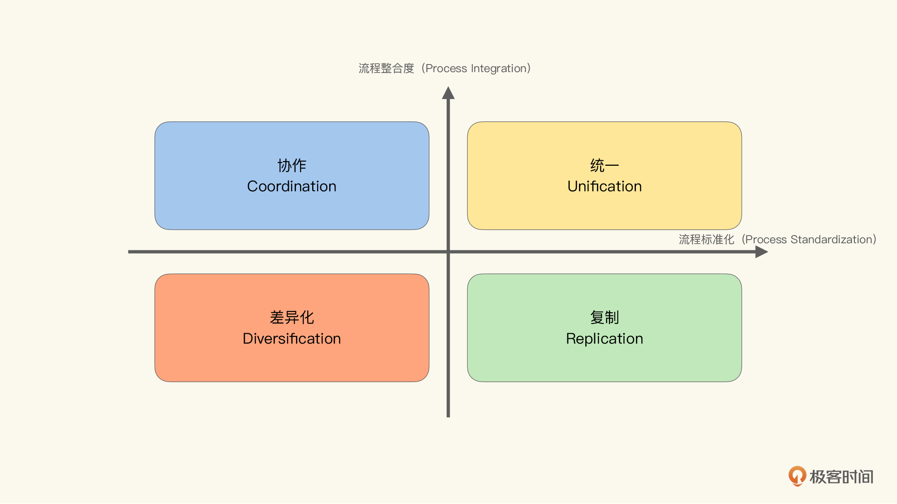
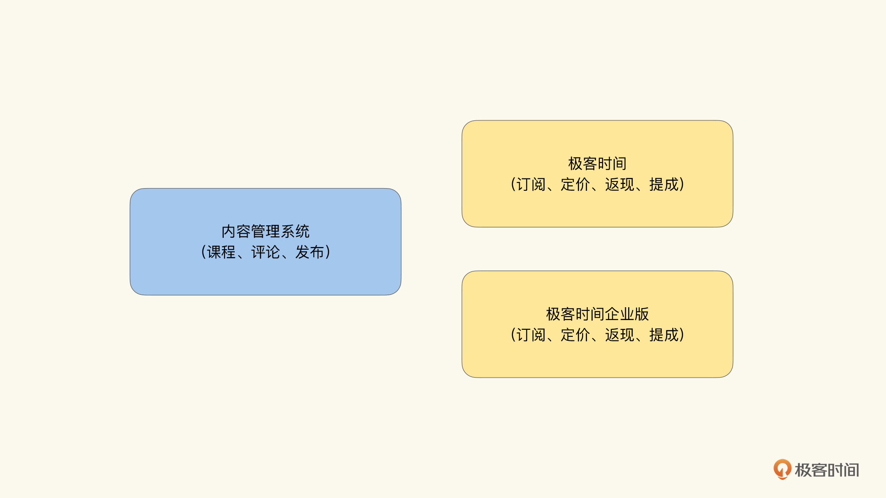
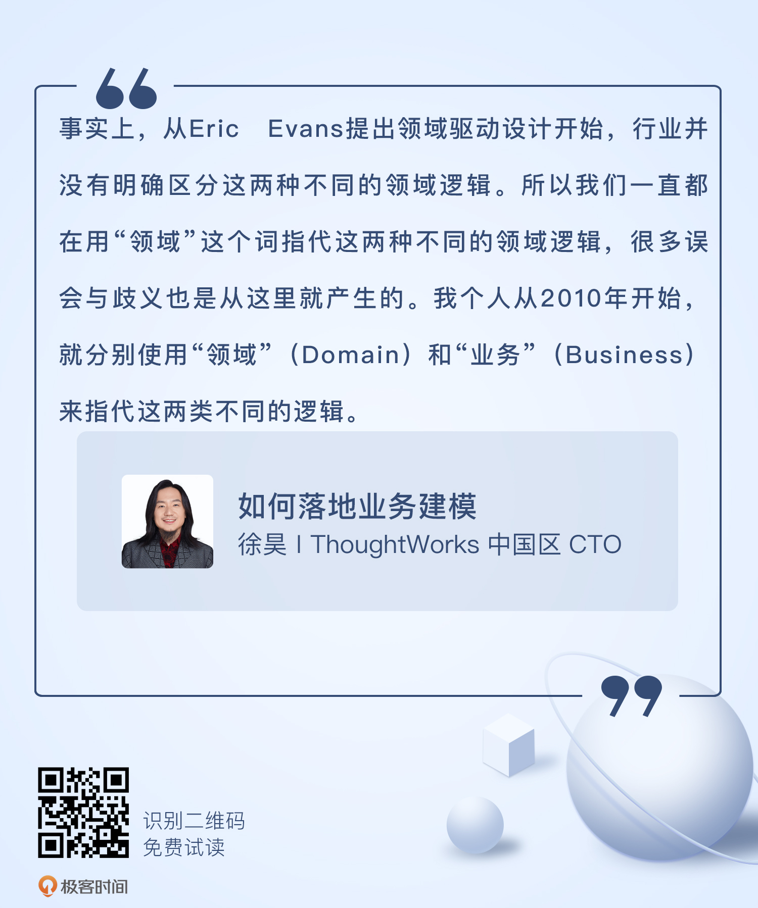

# 14 | 8X Flow（上）：何为业务？何为领域？
你好，我是徐昊。今天我们开始进入8X Flow的学习。

8X Flow是继四色建模法之后，由我发明的另一种建模方法。其实以前四色建模法也叫8X Flow。

从之前的学习中你会发现，四色法是一种数据流方法——Flow有了；而我姓徐名昊字八叉，以我的名字命名而得；但后来为了向Peter Coad致敬，表示灵感来自他的彩色建模法，就叫了四色建模法。于是今天要介绍的方法，我们内部之前叫8X Flow 2.0，现在直接叫8X Flow就行了。

8X Flow方法是四色法的一种演进。虽然 **权责追溯** 仍然是8X Flow的核心理念，但比起四色法，8X Flow更注重通过权责关系，提取业务模式；并通过引入变化点构建可复用的业务模型。所以对于业务平台或业务中台这类系统来说，8X Flow可谓是量身定制。此外，由于充分考虑了云时代的架构约束，得到的模型也能很容易地映射到微服务架构上。

那么接下来，我会用三节课来介绍8X Flow的具体内容。今天我们先来讲一讲业务系统与领域系统的区别，因为这二者之间有着明显的弹性边界，而根据弹性优先原则，我们首先要对它们加以区分。

## 模型真的是稳定的吗？

正如我们在“云时代的挑战”这两讲中提到的，进入云时代后，出于更有效地利用云平台的目的，我们引入了新的架构约束：弹性优先原则。也就是说， **在云时代架构系统中，弹性是最需要优先考虑的因素。**

在具体讨论如何在业务模型中体现弹性优先原则之前，我想你可能会有这么一连串的问题。

- 对于业务建模而言，我们需要考虑弹性吗？
- 业务不应该是独立于技术的吗？难道我们从前云时代过渡到云时代，连模型也要改变吗？那么我们怎么还能相信，建模的稳定性？
- 我们在 [第6讲](https://time.geekbang.org/column/article/389095) 也说过：“一旦领域层出现重大改变，就意味着重大的业务调整，整个系统都可以推倒重来了。因而在软件系统有限的生命周期内，我们可以认为领域层应该是不变的。”难道说，云会让系统推倒重来吗？

这些都是很好的问题，触及了业务建模最底层的逻辑。而要回答这些问题，归根到底，我们需要弄清楚一件事： **业务模型会不会受到技术范型的影响？**

答案是： **会，但不经常发生**。那么什么时候会发生呢？ **就是在技术范型改变可以带来成本大幅下降，或者带来收入巨幅增加的时候。**

说到底，我们做软件，特别是业务软件，并不是为了什么自我表达，而是为了更好地帮助业务方实现业务价值。而业务价值也很简单： **产生更多的收入，或者用更低的成本**。

那么，当技术范型的改变，可以带来巨幅收入或者成本改变时，业务自身的运营方式，必然也会利用这些技术的改变。所以从源头上，业务就变了，那么模型自然也要响应这种改变，作出对应的变化。

所以实际上， **并不是新的技术范型直接改变了模型，而是新的技术范型带来了成本收入上的优势，业务方则为了利用这些优势，便根据这些新的技术范型，改变了业务运营方式，然后引起了背后模型的改变**。

那么，能够引起业务重视的新的技术范型，自然不是什么新的编程语言或者新的框架，而是一些能够产生较大影响的技术范型的改变。

比如，企业级数据库系统（Enterprise Database System）的出现，直接将企业应用架构从单体桌面系统（Monolithic Desktop Application）架构转向了两层客户端/服务器架构（C/S，Client/ Server）。我觉得没有人会相信，自己在桌面应用中设计的模型，可以无缝过渡到数据库时代吧。毕竟我们需要思考范式、数据冗余、索引这些在之前根本不存在的概念，并在模型中加以体现。

类似的情况，在互联网（Internet）普及的过程中，客户端/服务器架构变成了多层架构（Multi-Tiered Architecture）。你在旧约部分能看到，过去十几年我们一直在与这种改变作斗争，让我们的建模方法可以适应架构的改变。

同样的，在C/S架构中的模型，也不能无缝过渡到多层架构里。那就需要考虑新的架构约束，重新建模。比如我们在旧约部分讲到的关联对象、角色对象和能力提供者等模式，都是重新建模时采用的手段。

可以说，好的模型可以在软件生命周期内保持稳定，帮助我们在特定的架构风格下高效应对变化。这没错儿。 **但是，模型不能帮我们渡劫。如果架构风格彻底改变了，那就没办法了，模型必须重建**。

非常不巧的是，云计算就是我们现在正面临的这样一场大劫。而它带来的变革之大，也是这么多年来诸多变化之最。因为云改变了 **成本最低的运营模式，将其从统一模式（Unification）变成了复制模式（Replication）。**

统一模式与复制模式出自 **四种业务运营模型**，最早由IBM在上世纪八十年代发明用以描述不同业务模式间的差异，以及需要何种IT能力来支撑与其对应的模式，后来被商学院教程广泛采纳，就成了一个讨论业务模式与IT诉求的非常有用的宏观模型。如下图所示：

对于四种业务运营模型，我在这里还是做个简单的说明。你可以将流程标准化看做是否需要强制使用同样的业务流程；而将流程整合度，看做是否需要使用同一数据源。那么我们就可以这么来理解了：

- 统一模式：强制使用同样的流程，也需要使用同样的数据源。业务上是强流程强管控模式，对应在软件上的运营模式就是单实例模式（Singleton）。举个例子，比如用户身份系统，在逻辑上我们始终认为只有一种，也就是单实例。当然，这个单实例可以是一片集群或云化的，但只要在概念是统一的，那么它就是统一模式。

- 复制模式：强制使用同样的流程，但可以使用不同的数据源。业务上是以同样业务模式独立运营的业务单元（Business Unit），对应在软件上的运营模式是多租户模式（Multi Tenancy）。对于每个租户，他们如同独占整个系统一样，但是租户间数据是隔离的。也就是我们说的SaaS模式。

- 协作模式：不强制使用同样的流程，但需要使用同样的数据源。业务上是仅仅在财务流程和关键数据上互通的，更具有独立性的业务单元或子公司模式。对应在软件上，可以看做通过开放API提供对于共享数据的访问。

- 差异化模式：不强制使用同样的流程，也不使用同样的数据源。基本上就是不同的业务实体。对应到软件上，可以将其看作开放生态模式。

这四种业务运营模式，不仅仅是对IT系统，对组织结构也有指导意义。而从这个角度来看， **我们行业内存在的很多问题，就源自业务组织能力与IT能力的不匹配**。

比如说，业务组织已经逐步过渡到独立BU的形态，而IT系统却无法提供与复制模式匹配的运营能力。当然，这种影响也是双向的。毕竟在逆康威定律（Inverse Conway Maneuver）的影响下， **最低成本的软件架构模式，也会影响企业对运营模式的选择**。

我们知道，在前云时代，统一模式所对应的软件架构也就是单实体模式，是最容易实现，也具有最低的运营成本（在数据中心为主的基础设施上）。所以 **我们所熟知的最佳实践，都是在统一模式为最低成本的假设前提下，被总结确立起来的。**

而在云时代，复制模式代替了统一模式，具有最低的成本。而业务方也在尝试改变运营模式，以获得云平台的红利。所以不仅仅是建模，我们所熟知的一切，都需要重新确认是否仍然是最佳实践。

说到底，我们不可低估云计算带来的改变。不过更重要的是，在这股巨浪中，我们不应保留任何先入之见，而是要去探索背后的核心逻辑。

## 什么是模型中最明显的弹性边界？

我们知道云是通过降低成本改变运营模式，从而给业务带来影响的。那么是否存在着某些业务功能更容易受到运营模式的影响，而另一些业务功能，则不容易受到运营模式的影响呢？

如果是这样的情况，就意味着 **这两种不同的功能存在不同的弹性边界。那么按照弹性优先的原则，我们就需要将这两类需求进行分离**，从而在最宏观层面上，贯彻弹性优先的原则。

那真实情况是怎么样呢？让我们以极客时间专栏为例，罗列一下与之相关的功能点，看看这些功能点之间存在什么差异：

1. 编辑发布新的专栏；
2. 编辑为专栏定价；
3. 读者订阅专栏；
4. 读者阅读专栏；
5. 读者转发专栏拉新返现；
6. 编辑发布专栏内新的课程章节；
7. 读者在课程下评论；
8. 作者回复读者评论；
9. 作者根据专栏销量获得提成。

现在让我们考虑一下，在运营模式改变的情况下，哪些功能点会发生改变。

比如说，极客时间专栏提供了企业版，也就是对企业收取特定的费用（每年或者一次性），这样企业内的员工就能无限或者按照规定的量来自由阅读专栏。

可以发现，与发布、阅读、评论相关的功能点，无论是公开版本，还是企业版本，都没有什么区别。而定价、返现、提成等功能，则会发生较大的改变。也就是说，这些功能点更容易受运营模式改变的影响。

如果按照变化隔离的原则，从架构上将这两类功能分割开的话，我们就有了一个不同的看待极客时间系统架构的角度。我们将它分成两部分：一个是与运营无关的内容管理系统（Content Management System，CMS）；一个是极客时间的运营系统。

那么，企业版不过就是在内容管理系统上，提供了另一套运营系统而已。如下图所示：

由此我们就发现了一个常用的架构模式，可以把 **系统分解为两部分：与运营无关的部分；提供运营能力的部分。**

比如，对于类似Google、Bing这类搜索引擎而言，与运营无关的部分是搜索引擎，而与运营有关的则是广告的投放和竞价。对于类似优酷、爱奇艺这类视频网站而言，与运营无关的是流媒体部分，而与运营有关的则是VIP账户、广告等。

下面让我们来看看分开的这两部分中的模型。在与运营无关的部分中，模型似乎不怎么需要业务方的输入。比如说：

- 极客时间专栏中的内容管理系统，核心的概念是专栏、课程和评论，和通用的内容管理系统中的栏目（Category）、文章（Article）、评论（Comment）似乎没有什么区别。
- 类似地，对于搜索引擎而言，与运营无关的部分中，关键概念是分词、词频、索引、爬虫等，似乎更不需要业务方的输入。

而在与运营相关的部分，模型则需要业务方的输入和验证。比如说：

- 对于极客时间专栏而言，这部分牵扯到如何定价、如何分成等诸多业务规则。在没有业务方输入的前提下，几乎不可能构造出任何的模型，甚至都无从开始。
- 类似地，对于搜索引擎而言，广告如何与关键词关联、如何计算投放量、如何衡量广告效果等等，就需要业务方制定相应的规则与逻辑。

那么我们就会发现，在进行建模时，针对与运营无关的部分和与运营有关的部分，我们需要处理的核心复杂度并不相同。而且，“两关联一循环”对于这两部分的功用也不尽相同。事实上，从Eric Evans提出领域驱动设计开始，行业并没有明确区分这两种不同的领域逻辑。所以我们一直都在用“领域”这个词，指代这两种不同的领域逻辑。很多误会与歧义也是从这里就产生的。

我个人从2010年开始，就分别使用“领域”（Domain）和“业务”（Business）来指代这两类不同的逻辑。即：“ **领域”表示与运营无关的问题域，“业务”表示与运营相关的问题域**。

之所以将与运营无关的逻辑称作“领域逻辑”，原因有二。

第一，这两部分分别有不同的建模方法。既然领域与业务有不同的关注点，那么针对不同的关注点，自然有不同的最佳实践和最佳建模方法。分别对待，会让我们更容易得到恰当的模型。

第二，在我们区分了领域逻辑与业务逻辑之后，再回过头去看Eric Evans的领域驱动设计，会发现他在书中给出的例子，大部分都是与领域系统相关的。所以他没起错书名，他讲的的确是“领域驱动设计”。因此，如此命名可以减少概念上的冲突。

## 究竟是领域建模还是业务建模？

知识消化的“两关联一循环”，对于领域逻辑和业务逻辑都是有效的吗？还是只对某一种逻辑更适用呢？ **从我的经验来看，通过“两关联一循环”对业务逻辑建模的效果，要远远好于对领域逻辑的建模的效果**。

业务逻辑与运营相关。运营本身也没有绝对的好坏之分，只有合适与否。大量的业务逻辑其实是源自运营实践经验的总结，其背后也不一定存在什么严谨的逻辑。所以所谓的“专家”可能也只是经验丰富而已。

我经常举这样一个例子。比如你和你朋友都是卖烤白薯的，你们分别在东直门地铁站左右站立，配方、产品、文案无一不同。唯一的差别是，你每天进货，而你的朋友一次进一周的货。那么在运营中，你会有很多与采购有关的操作，而你的朋友则更多关注库存的管理。当你们都成为红薯专家的时候，如果互换位置（听起来有没有职业经理人空降的感觉），其实都玩不转。因为你不知道怎么管库存，而你的朋友可能无法处理频繁的采购操作。

业务逻辑是和某种运营方式绑定的，我们把业务逻辑的这个特性称作 **运营特定（Business Operation Specific）**。知识消化对于这类逻辑的总结与提炼，具有很好的效果，这个我们在旧约部分已经讲过了，就不再复述了。

相对地，你可能会发现，如果把卖烤红薯变成卖烤土豆，那么采购或是库存的业务逻辑其实没什么改变。这种特性我们叫做 **领域中立（Domain Neutral）**。

也就是说，某种业务运营的模式（也就是赚钱的办法）其实可能和对应的领域功能没什么关系。比如极客时间专栏的订阅分成模式，如果把内容换成网剧，其实也是成立的。还有Google的广告竞价模式，把搜索引擎换成门户类网站，也是成立的。

**因而业务逻辑一般具有运营特定和领域中立性。与之相对的，就是领域逻辑具有运营中立性和领域特定性**。那么这里就有一个问题：对于领域逻辑，知识消化法还有效吗？

事实上，对于能通过面向对象模型表示核心复杂度的领域逻辑，知识消化法是能够发挥作用的。因为我们讲到现在，隐含的前提就是通过对象模型建模问题。但是，并不是所有的领域逻辑都适合使用对象模型表达。

比如推荐引擎，通过特征建模（Feature Modeling）并使用相似度算法，可能是更好的方法。当然，也可以是决策树（Decision Tree），甚至是神经网络（Neural Network）。这时候，知识消化并不能帮助我们得到这些模型。

那你可能会问，为什么Eric Evans可以从“领域逻辑”出发，提炼出知识消化法呢？

这主要是因为，他并没有区分领域和业务，所以他想解决的问题是对“业务逻辑”的提取。而书中例子多是“领域逻辑”，只不过因为“领域逻辑”更好举例而已。

所以知识消化实际是一种“业务建模”方法，而不是“领域建模”方法。这也是为什么，我们这门课叫《如何落地业务建模》。

总结来说，将领域与业务分开，可以让我们更好地理解什么是业务系统： **支撑业务运营，利用领域系统赚钱/省钱的系统，叫做业务系统**。所以我们业务建模的目的，就是寻找到恰当的业务模型，更好地支撑业务系统的构建与演进。

## 小结

这节课我们主要介绍了云给业务运营模式带来了什么样的改变，以及这种改变会如何影响我们获取业务模型。然后，我们将逻辑分成了领域逻辑与业务逻辑，分别讨论了它们的异同，以及我们究竟是在针对什么进行建模。

总结起来说， **业务逻辑** 是源自业务运营的逻辑，是领域中立且运营特定的，其复杂度来自于业务流程，关注的是如何通过某个领域逻辑实现获利。因而它的关注点，就集中在盈利和成本结构上。或者说，业务逻辑对外体现为利润或现金，对内体现为成本和绩效承诺。

而 **领域逻辑** 源自问题域自身的逻辑，是运营中立而领域特定的，其复杂度来自于问题本身，关注点通常是算法、计划、统计、优化等等。

所以关注业务逻辑的组件与关注领域逻辑的组件，通常具有不同的弹性边界。以极客时间专栏为例，在缓存策略恰当的前提下，如果读者猛增，那么对内容管理部分的弹性需求，会远远小于对业务运营部分的弹性需求。而对于搜索引擎业务来说，当搜索用户猛增时，对广告投放这部分的弹性需求，要远远小于对索引部分的弹性需求。

因而从弹性优先的角度出发，我们应该将关注业务逻辑的组件与关注领域逻辑的组件分离。这样构建出来的模型，更能适应云时代的架构约束，也能让我们分别使用不同的建模方法，获得对应的领域模型与业务模型。

## 思考题

对于业务系统来说，除了可以使用事件建模法之外，还有没有其他的方式，可以让我们更好地从“盈利”的角度来展开业务维度？此外，在我们常见的领域系统中，有哪些可以使用非对象模型以更好地描述问题？

欢迎在留言区写下你的想法和思考，我会和你交流。我们下节课继续8X Flow的学习！