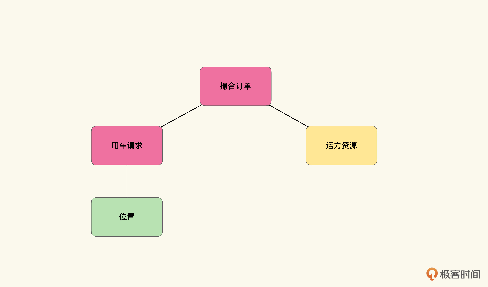
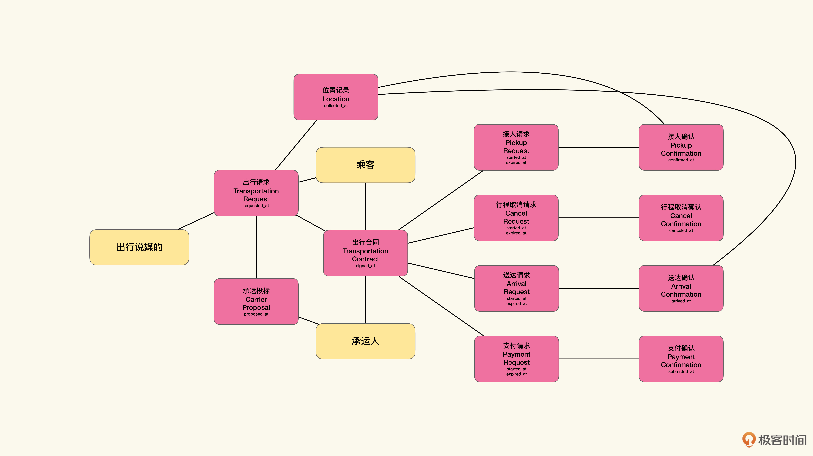
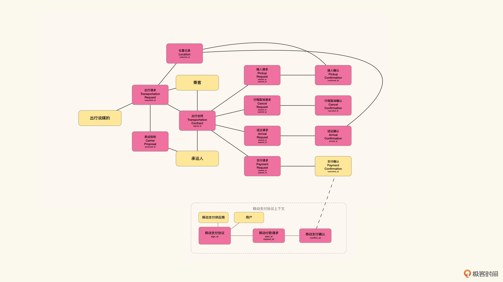
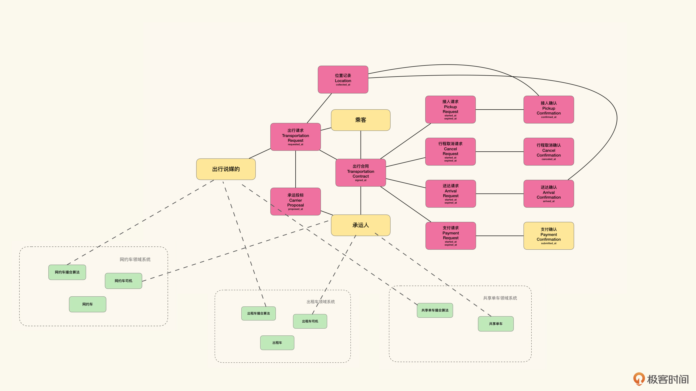
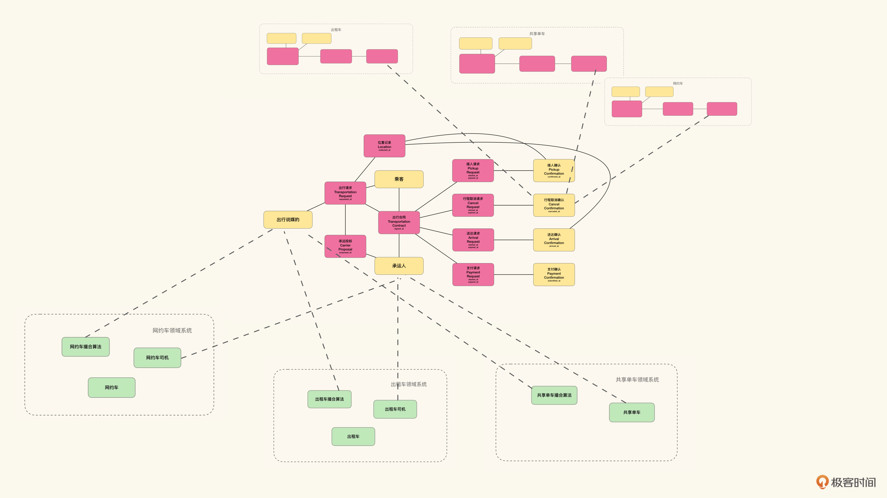
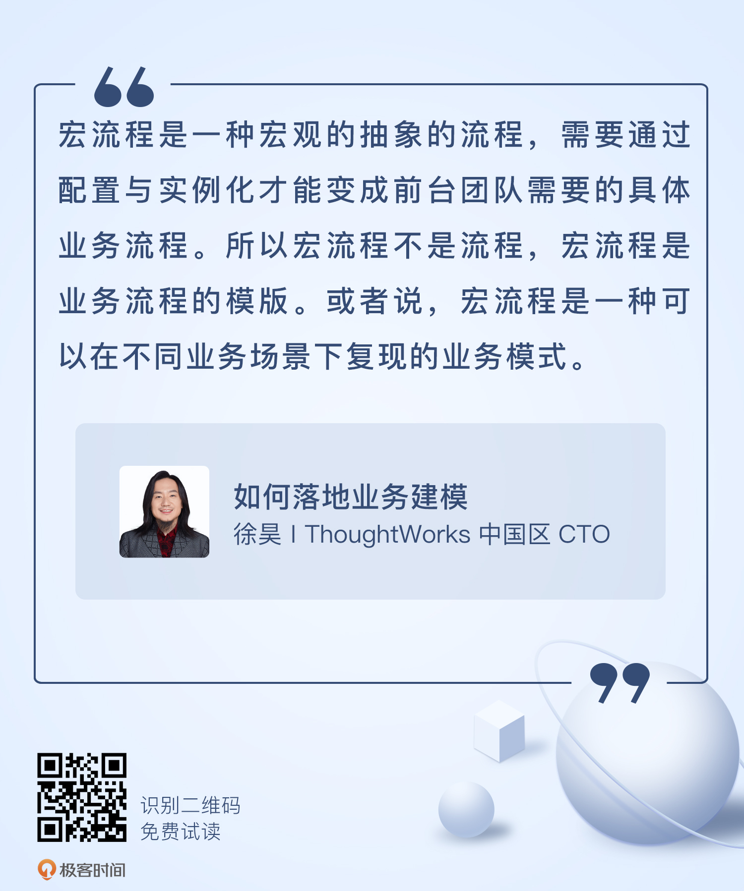

# 18｜中台建模（下）：如何寻找可复用的业务模式？
你好，我是徐昊。今天我们继续学习如何使用8X Flow建模中台系统。

在上节课中，我们围绕中台的诸多不同思潮，分析了中台与平台的差异，中台模式与SaaS模式的区别。此外，还介绍了平台能力与应用自主度的概念。通过这两个概念，可以帮助我们理解中台在平台能力与应用自主度中取舍的平衡点，就在于“特定场景中的业务模式”，也就是宏流程。

那么作为一门建模课，我们接下来的问题自然就会变成：如何建模宏流程？如何根据得到的宏流程形成完整的中台策略？这也正是我们今天要讨论的问题。

## 业务模式建模难在哪儿？

通过上节课的学习我们已经知道， **宏流程是一种宏观的抽象的流程，需要通过配置与实例化才能变成前台团队需要的具体业务流程。** 所以宏流程不是流程，宏流程是业务流程的模版。或者说，宏流程是一种可以在不同业务场景下复现的业务模式。

对于业务模式的建模难点主要在于寻找合理的抽象程度。因为业务模式中既有泛化的概念，也有具体的实体。如果泛化概念不够，那么业务模式就会退化为具体的业务功能了；但如果泛化概念太多，则容易引起过度抽象，丧失业务模式的价值。

仍然以出行模式为例，我们可以说出行模式的核心是一种撮合模式，也就是由需求方发起请求，然后从资源池中寻找最为匹配的资源与之对应。但是这种模式又不是泛泛地撮合，而是跟需求方发起需求的时间与位置息息相关的。如下图所示：

在这个业务模式里面既有泛化的概念，比如资源。也有具体的实体，比如位置。当然，我们还可以在这个基础上进一步抽象，比如把位置变成资源筛选条件。那么不光是出行了，股票、婚恋、期货都可以被装入到这个业务模式中。但这就有过度抽象的倾向了。

较高的抽象层次固然可以帮助我们理解问题，但却无法支撑具体的决策。要知道，出行模式之所以成立，恰恰在于它并不是一个泛泛的撮合模式。而在于在出行场景下，它能够对具体业务予以决策上的支持。

比如当乘客发出用车请求时，A和B两辆车都处在资源池中，这个时候，我们就需要给出A和B当中哪一个更为匹配的决策。再比如说，如果匹配到了A，但是A未在规定时间内到达乘客所在地点，要怎么处理；或者到达了，乘客不见了，要怎么办？

**业务模式不仅需要用来帮助我们理解业务是怎么回事，而且需要在业务场景下，帮助我们做出业务决策。因而我们可以讲，业务模式实际上是一组决策模式的集合**。业务模式需要一种恰如其分的抽象：适度地泛化可以在不同的场景下复用，但又要避免在具体的场景下丧失它对于业务决策的指导意义。

**对于业务模式，最好的办法是从已经存在的业务模型中去提取，而不是直接建模**。已经存在的业务模型，可以帮助我们在业务场景下决策，这也是我们业务建模的出发点。那么我们只需要对已经存在的模型进行泛化，就可以从业务模型中提取到业务模式了。

说句题外话，在软件开发里需要 **恰当抽象** 的场景中，抽取、重构这种后置行为几乎都是更好的选择。原因就在于 **并不是我们不会抽象，而是很容易过度抽象**。

在抽象过程中，经常会出现一种接近终极真理的幻觉。只要我们愿意，我们永远可以将繁复的细节抽象成极简的模型。比如一切都是对象，一切都是阴阳互化，一切都是空，等等。

然而事实是，这些高度抽象的模型会丧失对细节的指导意义。所以我们始终要戴着脚镣跳舞，时刻提醒自己：模型还具有指导意义吗？ **开始抽象容易，但停下来难**。或者更格言式的表达： **谁都可以抽象模型，但只有智者知道在哪里停下来**。而通向智者之路，就是去掌握抽取、重构这些技巧。

知道了业务建模的难点在哪里，接下来我们就可以进行建模了，我们先看看怎么从合同上下文中提取宏流程。

## 从合同上下文中提取宏流程

8X Flow中的合同上下文，非常适合用来提取宏流程。原因有二：

1. 合同履约本身就隐含了双方业务往来的流程；
2. 合同上下文中的角色是变化点，而引入变化点，就是对业务流程的泛化。

首先来看一下8X Flow合同上下文的履约中隐含的业务流程。以出行的合同为例，根据我们日常经验，其中权责履约项目包含：取消、接人、送达、支付。与这个合同对应的投标邀请和投标，就是出行请求和承运投标。对应的合同上下文如下图所示：

在这个合同上下文中，有两个主要的流程。第一个是乘客发出出行请求，然后平台通过“出行说媒的”这个撮合引擎的拟人化角色，匹配到对应的承运人，最后形成出行合同的过程。

从业务功能角度来说，这就是叫车的功能流程；从合同的角度来说，是签订出行合同的流程。

第二个就是出行合同签订之后的履约流程。承运人到指定地点接人，然后送达目的地，最后乘客支付费用。

从业务功能来讲，这就是乘车的功能流程。从合同的角度来看，这是合同的履约流程。

重要的业务流程，其背后都有对应的合同流程，这并不是偶然的。 **合同流程是因，业务流程是果**。我们知道，所有业务活动都需要在合同（具有法律效力的口头约定）的框架下进行，这是法律法规的要求。合同签订的过程是合同双方对合同内容讨价还价的过程，合同内容实际上是合同双方为完成履约所需要进行的业务活动的框架。

企业需要根据合同流程设计自己的业务流程，以完成对应的合同流程。 **因而从合同出发寻找到的合同流程，实际上是业务流程的目标与模板。而业务流程，是对合同流程的实现与映射**。

既然合同流程是业务流程的模板，使得合同流程本身就具有一定的宏流程特点。比如，在出行合同上下文中，规定了履约项支付车费。但由于这只是在合同流程中的履约项，那么映射到业务流程中，就可以有不同的表现形式了。

像先叫车到达目的地，之后再支付所有费用，或者在出发之前通过算法形成一口价，提前完成费用的支付与抵扣，都是对于这个合同权益项的履约。那么在合同流程上，这两者没有什么区别。但在业务流程上，就可能存在差异。

所以要建模宏流程，合同流程就是一个非常好的候选和出发点。从合同流程出发，我们寻找到一个合理的流程框架，就可以在不同的业务上下文中展开或映射成不同的业务流程。

那么接下来我们就需要对合同流程进行必要的泛化，也就是通过角色和角色的扮演，将变化点引入到合同上下文中来。

对于已经了解了8X Flow的你来说，这一部分应该不会陌生。比如我们可以将出行合同上下文中的支付确认变成角色对象，也就是接受从不同的合同上下文产生的凭证，作为履约证据。如下图所示：

**然后呢，合同上下文中的变化点与扩展点，并不仅仅是履约的确认凭证。任何角色对象，都可以看做是业务上的变化点与扩展点。但是扮演关系不一定来自另外的合同上下文，它可能来自于领域系统**。比如，在这个例子中拟人化的撮合算法出行拉媒的和承运人。

我们都知道，在中台化的出行模式中，不同业务场景下的承运人，实际上就是被不同的前台团队管理的不同运力资源。那么对于网约车来说，承运人就是网约车司机。对于出租车，就是出租车司机。对于共享单车，就是附近可用的共享单车。

同样，对于拟人化的撮合算法出行拉媒的，在不同的业务场景下，就表示不同的算法，或者同一算法的不同配置策略。因而我们可以将运力和算法建模为领域系统，然后通过领域系统来扮演这两个角色。如下图所示：

通过这张图就可以发现，在不同的业务场景下，我们对合同上下文中的变化点做了不同的配置与扩展：

- 在网约车的业务场景下，就是出行合同上下文配合网约车领域系统，支持了网约车的业务；
- 在出租车的业务场景下，就是出行合同上下文配合出租车领域系统，支持了出租车的业务。

于是我们通过配置，将同样的合同流程，具体展开成了不同的业务流程，也就达到了业务层面上模式复用的目的。

进行到这一步，模型就展现出了中台的雏形。当然，如果在这里停下来，也是可以接受的。毕竟我们已经找到了可重用的业务模式，以及重用这个业务模式的方式。但如果继续观察的话，我们就会发现在不同的业务场景下，履约确认可能也会有所不同。

比如送达确认，对于网约车而言，行程需要网约车司机发起行程结束的请求，然后再与行程目的地进行比较，以确认行程到达。对于共享单车而言，需要乘客发起还车请求，然后确认锁车，即可表示行程到达。

于是我们可以将履约确认项进一步角色化，然后再去追溯在不同的业务场景中，还有哪些凭证与合同上下文，可以实现确认履约。

因为后续的做法与8X Flow中提取角色的做法（具体参见第15讲）大同小异，我们就不再赘述了。如下示意图，表示我们假设的不同上下文与出行合同上下文的组合：

于是我们就从8X Flow的合同上下文中提取了宏流程，也就是可以在不同业务场景下复用的业务模式。不光如此，对于业务模式在不同的业务场景下，能进行什么样的扩展与订制，我们也通过扩展点进行了建模。最终我们得到的就是中台业务模型。

## 领域系统？业务系统？

在结束今天的课程之前，再来看看刚才建模过程中我们对领域系统的使用。我们简单地将不同业务场景下的实体与算法扔入一个领域上下文，于是就得到了网约车、共享单车等领域系统。

那么真实的情况是这样的吗？可能并不是。比如对于网约车的管理，背后肯定有网约车司机与出行公司之间的合同，运营网约车的前台团队内部肯定也有自己的绩效约定。那么我们为什么不去深挖这些合同呢？从这些合同中进一步寻找凭证来完成角色的扮演呢？

让我们再想一想领域系统与业务系统的差异（具体参见第14讲）。针对业务系统，我们使用合同上下文建模，最终得到是业务模式或运营模式。而针对领域系统，我们使用对象建模，最终得到的是一组功能。

所以当我们希望重用业务模式的时候，会将其中的业务部分与领域部分分离，进行业务建模。而如果我们暂时不关心业务模式的复用，那么就可以从功能的角度，将它看成领域系统。

在刚才的例子中，我们关心且希望复用的，是出行合同上下文中所蕴含的撮合模式，以及这个模式背后的履约流程。在这种情况下，运力部分的业务模式和内部的运营模式就不是我们的关注点了，因而可以将它们简化为一个领域系统来看待。

注意，我们永远可以从领域系统中分析并分离背后的运营模式，问题是有没有这个必要。

## 小结

这节课我们主要介绍了如何从8X Flow的合同上下文中提取宏流程，并通过提取出的宏流程构建中台的业务模型。

总结起来，大致流程是这样的：

1. 通过8X Flow进行业务建模；
2. 确定需要在不同业务场景中可复用的业务模式；
3. 寻找到业务模式所对应的8X Flow合同上下文；
4. 通过将履约项角色化引入变化点；
5. 在不同的业务场景下扩展替换变化点，并将它们分别放置于不同上下文中；
6. 在不同上下文中继续8X Flow建模，直到可以解释清楚不同的业务上下文是如何完成对宏流程的扩展。

在得到中台的业务模型之后，我们就可以开始着手中台的实现了。事实上，中台除了在业务建模具有挑战之外，在技术实现上也颇具难度，因而我们需要大量使用微服务和SaaS化架构。这也正是我们接下来两节课要讲的内容。

## 思考题

在进行合同上下文泛化的时候，我们是对履约确认项进行角色化处理的，那么为什么不能对履约请求项进行角色化处理呢？请注意，我明确告诉你不能这么做，所以请思考不能这么做的理由。

很期待你能把自己的思考和想法分享在留言区，我会和你交流。我们下节课再见！