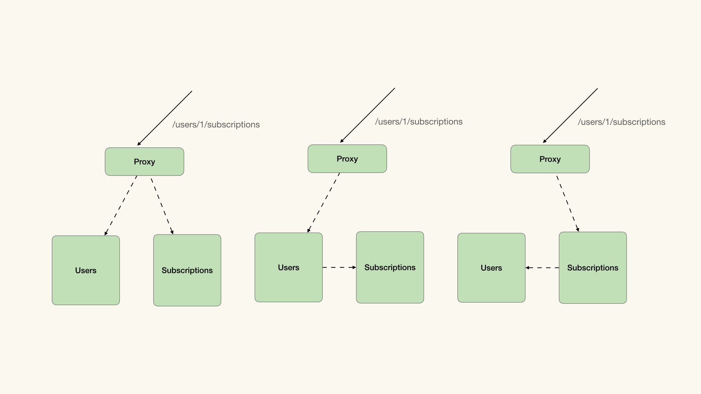
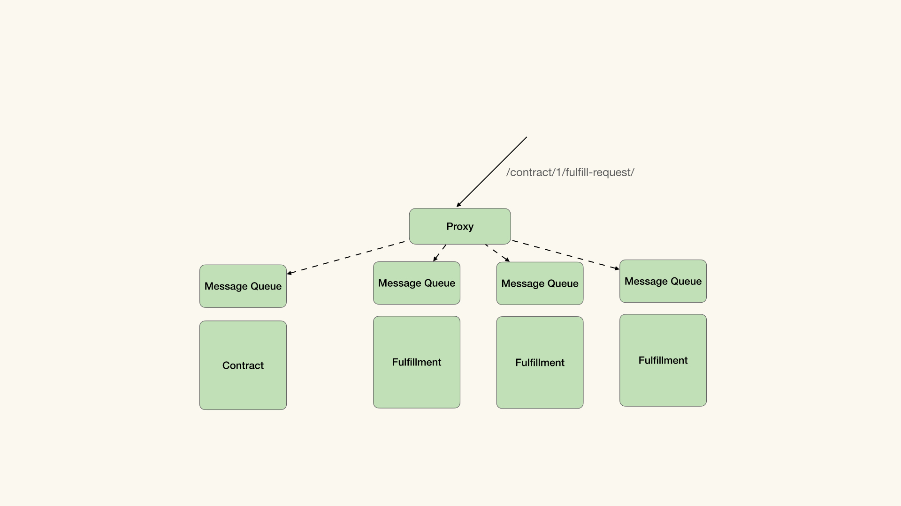
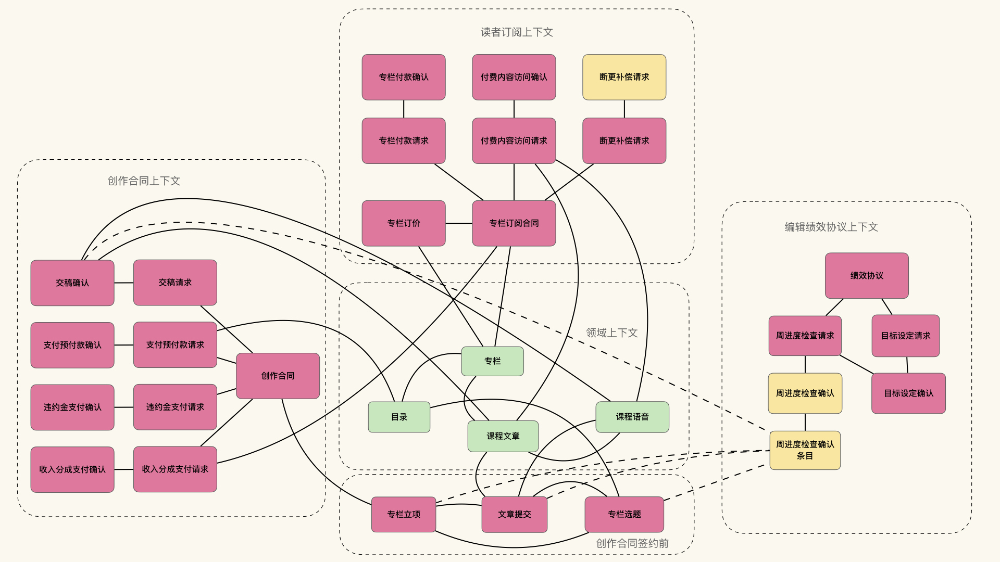
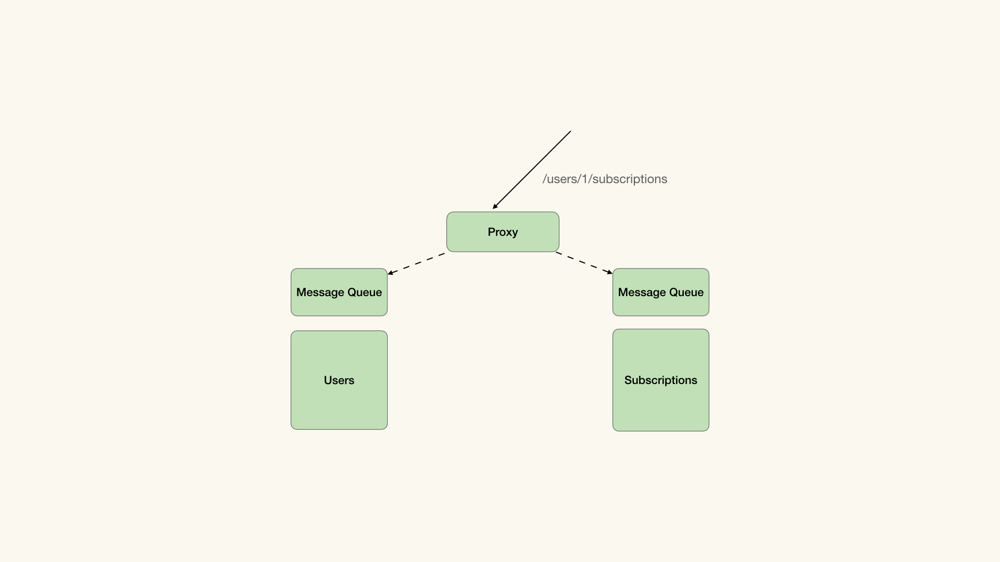

# 19｜如何将模型实现为微服务？
你好，我是徐昊。今天我们来聊聊如何将8X Flow模型映射为微服务。

经过14-16节的学习，我们已经可以使用合同上下文、履约上下文和领域上下文对业务进行建模了。那么当我们希望在云平台上将业务模型实现为软件系统时，就需要将合同上下文、履约上下文和领域上下文作为系统天然的边界，并将它们放置到不同的弹性边界中，从而在满足业务扩展与需求变化的前提下，尽可能地降低成本。

有了弹性边界，我们自然很容易地想到可以将不同弹性边界内的内容，实现成微服务架构风格（Microservices）。那么今天我们就来讲一讲，如何将8X Flow的模型实现为微服务架构风格。

## 微服务还是伪微服务？

在开始讨论这个问题之前，我们首先要重申一下 **什么是微服务**。关于微服务，现在有诸多迷思，以及很多看起来像是微服务，但实则南辕北辙的伪微服务风格。

在James Lewis和Martin Fowler的名作 [《微服务》](https://www.martinfowler.com/articles/microservices.html) 中，将微服务定义为一种架构风格，并总结了它的九种特质：

1. 通过服务实现组件化；
2. **服务按照业务能力划分组织；**
3. 服务以产品而不是项目研发；
4. 逻辑集中在服务中，编排简单；
5. 每个服务自主决策（技术栈、语言等等）；
6. 每个服务自主管理数据（不强制使用统一数据源）；
7. 基础设施自动化；
8. 将服务失败当作常态纳入设计考量；
9. 演进式设计（不求一步到位）。

具体的内容可以参考James和Martin的文章，其中有三个特别关键的点，我需要专门提出来说一说。正是对于这三点理解的偏差，从而形成了三种典型的伪微服务风格。

第一点是服务按照业务能力划分组织。这个架构特性说的是，微服务中的服务应该以业务能力（Business Capability）为粒度。其实这也间接回答了“微服务到底多微合适”这个问题：既不是单纯的技术能力（比如查询、获取系统时间），也不是完整的应用（Application），而是用以支撑构建应用的业务能力。

所以微服务的“微”是个相对概念，而不是绝对概念。也就是说，与单体应用（Monolithic Application）相比，微服务是微小的。这就好比说，对比银河系，太阳连尘埃都不如。但是太阳就很小吗？并不是吧。

说句题外话。在我看来，软件行业中存在一个神秘的“恰当粒度”（Appropriate Size）。比如很多年以前，当我们使用用例（Use Case）捕捉用户需求的时候，出现过这样的争论：到底用什么样的粒度去捕捉用例最合适？而转换到用户故事（User Story）之后，它直接把“粒度恰当”（Size Appropriated）当作特性之一了。技术上也是一样，但凡出现分布式架构，每一个分布式组件多大，永远是讨论的焦点。SOA（Service Oriented Architecture）基本上就是被这个争论给搅黄的。现在热门话题不又是“微服务到底应该多微”吗？

对于用例的恰当粒度，Alistair Cockburn在《编写有效用例》（Writing Effective Use Case）一书中给出了最佳实践。他将业务和技术比喻为天空与大海。天空中有云彩（宏观目标）、风筝（目标），大海里有鱼（功能点）和扇贝（实现细节）。而恰当的粒度恰好在天空与大海的交汇处：用户目标。它既有业务上的含义，也有技术上的支撑。

到了用户故事就更明显了，它必须包含用户价值与实现价值的行为，也就是说，用户故事必须在业务和实现上都具有指导意义才行。而对于SOA，最佳实践是能力建模（Capability Modeling），以业务能力为粒度进行SOA的服务构建。从某种意义上说，微服务这个词被发明出来，本意就是为了将使用能力建模的SOA（当然还有利用RESTful API而不是复杂的WS-\*）与其他SOA风格分离。

你会发现，通常所说的“恰当粒度”是在业务与实现两个维度上平衡的结果。并不会存在“只从单一维度入手，越怎么样就越好”这么简单粗暴的结论。所以微服务并不是越小越好，当小到不能表示业务能力，就不再是微服务了。

**如果不顾及服务是否按照业务能力划分组织，就是一种典型的伪微服务模式，我称之为分布式服务（Distributed Services）。** 要注意，分布式服务并不是反模式，它有其特有的用处，只不过它并不是微服务而已。也可以这么理解，微服务算是分布式服务的一种特例。与其他分布式服务相比，微服务特有的优势，大半都源自按照业务能力划分组织服务。

对于微服务，我要说的第二点是，以产品而不是项目研发。产品和项目的差异体现在团队结构和生命周期上。

从团队结构上来讲，产品团队包含产品研发和产品运营。在产品生命周期内，产品团队负责产品的一切。而项目团队的职能通常会更简单一些，不包含运营和运维部分。快速说一句题外话，DevOps是需要产品团队才能实现真正的研发自运维。

从生命周期上讲，产品的生命周期分为初始、稳定、支持和结束生命这么几个阶段。那么产品的不同版本，可能处在不同的生命周期中。比如我们熟知的Windows操作系统，在Windows 8发布之后，Windows XP依旧有官方的延期支持。

所以产品团队也可能需要在同一时间内，支持多个处在不同生命周期的产品版本。比如1.0是支持阶段，1.5是稳定阶段，2.0是初始阶段，等等。而项目通常假设只有唯一的产物，随着项目生命周期的进展，项目化服务一直在改变。

**那么产品化服务的生命周期，实际上相当于承诺在产品生命周期内，服务是不变的**。也就是说，只要1.0不结束生命，那么我们就可以一直使用它。哪怕你发布了1.5、2.0、3.0，只要1.0能满足我的需要，并且还在生命周期内，那么作为消费者，我可以无视你的后续版本。 **那么对于产品化服务的耦合，在产品的生命周期内可以看作是稳定的，** 并且可由消费方选择是否升级。

但项目化服务通常做不到这一点。项目化服务通常都只有唯一的产品，当服务出现新版本后，之前的版本就默认消失了，对应的消费者也都会受到波及。这就带来了服务间紧密的耦合和修改的传播。

因而微服务需要服务间不仅在接口上松耦合，还要在生命周期上松耦合。也就是微服务可以自主发布，其他服务不应受到影响。产品化是实现这一点的根本途径。 **如果服务缺乏产品化生命周期，那就是另一个典型的伪微服务模式，我称之为微工作组（Microstreams）。** 这个模式会产生一组在生命周期上紧密耦合的服务，从而完全丧失微服务的意义。而且随着服务数量变多，这种生命周期的耦合还会带来难以承受的沟通成本。

说句题外话，判断是不是微工作组，有两个特别简单的办法：

1. 你可以去看看每个服务团队之间的会议有多少。真正的微服务团队，很少与其他团队沟通（都在契约里）；
2. 你可以去听听团队里会有多少次用到“集成”或者“整合（integration）”这个词。用得越多，就越是微工作组。

对于微服务，我要说的最后一点是，逻辑集中在服务中，编排简单。逻辑越在服务中集中，所需要的编排就越简单，通常通过RESTful API或者轻量的消息机制即可完成。而如果服务中的逻辑简单，那么就会有大量的逻辑泄露到编排逻辑中去，此时就需要使用复杂的编排工具辅助我们的工作，比如企业服务总线（Enterprise Service Bus，ESB）。

选择编排复杂的逻辑，听起来很有道理：既然我们希望在不同场景下复用服务，那么总有一些需要改变的订制代码，我们需要将它们与服务本身分离。分离之后，就能通过编排引擎，帮助我们在不同的场景下重用这些服务了。

然而你会发现，按照这个逻辑走下去， **服务往往会变成对于数据的CRUD，然后大量的逻辑存在于编排引擎中，这也是典型的伪微服务模式，我称之为傻服务（Dumb Service）。** 当服务没有封装业务能力，而架构师又对复用充满雄心的时候，经常会出现傻服务。这不光服务傻，人也不太机灵。

除了上面三种典型的伪微服务之外，最近还流行起了一种伪微服务架构风格，被称作 **分布式单体**（Distributed Monolith）。正如微服务本身一样，我们很难给出分布式单体的确切定义，但是可以描述它的特质。

分布式单体也是通过一组分布式服务构建的应用，但是却具有单体应用的特质：修改其中某个服务，会引发修改很多其他服务；无法有效地水平扩展。

微服务的核心思路就在于将业务能力封装成独立的松耦合的服务。通过这样一组服务，构建企业内的能力生态系统。除了能满足当前应用的需要之外，也为未来可能的新应用提供了坚实的基础。

而分布式单体虽然是分布的，但在逻辑上仍然是一个单体应用。这一组分布式服务的首要目的是高效地服务于所构建的应用。这种观念上的差别（虽然可能不是主观故意的），也造成了我们对技术的不同评价和偏好。比如“用RPC还是RESTful API来设计服务的API”，就能分辨出你是不是真的在做微服务。

## 使用RESTful API描述微服务API

通过前面的讲解，我们可以发现微服务架构风格与分布式服务、分布式单体架构的关键区别在于三点：

1. 服务封装业务能力，以服务构成企业内生态；
2. 以产品的角度管理版本和集成策略；
3. 服务富含逻辑，编排简单。

其实理解了这三点关键差异，很多关于微服务的问题自然也就迎刃而解了。什么样的粒度是合适的？服务之间存在耦合怎么办？我需要多复杂的编排工具？前台的逻辑传递到服务要怎么处理？这些问题只要变成：微服务会怎么做？分布式服务会怎么做？分布式单体会怎么做？然后互加比较，自然就知道应该选择什么方案了。

接下来的问题更偏技术性一些，对于每个服务我们要如何设计它的API？虽然有一些新的思潮涌现，但我个人认为， **以目前而言，分布式超媒体仍然是微服务API的最佳方式。也就是说，RESTful API仍然是微服务API的最佳选择。** 主要有这么三点原因。

首先，我们需要将微服务构成的企业内生态看做一个整体。套用我前同事Ian Robinson的名言\_Be the web , not behind the web\_（成为互联网，而不是躲在互联网之后）。也就是说，我们应该将企业能力构造成一个web，而不是仅仅将web作为对外暴露服务的接口。

那么怎么才能描述这构成企业内生态的一组服务呢？自然是 **分布式超媒体**。也就是通过超链接表示服务与服务之间的关系，指导客户端完成它对其他服务的调用。比如我们可以通过这样的超媒体描述，来表示完成支付的不同方式：

```
<article>
    <title>订单详情</title>
    <p>....</p>
    <link href="http://payment.com/12358921" rel="online-payment"/>
    <link href="http://enterprise.com/12358921" rel="enterprise-payment"/>
client"/>
</article>

```

在这段超媒体描述中，我们指明了可以用于完成订单支付的两种方式，一种是在线直接支付，一种是使用企业支付。

这里我们会发现一个有意思的情况，就是 **如果以分布式超媒体方式去描述服务间的关联，那么其实我们不太在意它到底是单体应用还是微服务结构**。 **所以一旦把眼光放到，通过服务构成企业内生态，并使用分布式超媒体去描述这个类似于web的生态系统时，会发现微服务不过是实现上的细枝末节。**

当我们明确了自己真正要解决的问题，那么就需要让服务可以融入到分布式超媒体中。所以RESTful API仍是目前将服务融入分布式超媒体的最佳方式。

第二，URI在表示服务编排的时候，仍然可以保持模型之间的关系。除了通过超链接，将关联的服务与资源联系在一起之外，URI也可以用于表示服务之间的编排。这是因为符合RESTful风格的资源URI可以看做是函数调用。比如，如下的URI和代码是等价的：

```
GET /users/1/subscriptions

(subscriptions (users 1)) //LISP 函数风格

getSubscriptions(getUsers(1)) // Java

```

我们可以将这个URI看做是对Users和Subscriptions这两个服务的编排。那么按照对照函数式编程，不同的求值策略（比如惰性求值）也就变成了对于服务不同的编排策略。如下图所示：



对于同样的URI，在不同的场景下，最合适的编排策略可能并不相同。但是URI帮我们封装了这些细节。

也就是说，我们通过 `/users/{uid}/subscriptions` 引用了Users和Subscriptions服务的编排。无论编排方式怎么改变，只要URI仍是 `/users/{uid}/subscriptions`，那么对于消费方来说，就没有影响。而妙就妙在 `/users/{uid}/subscriptions` 是从模型而来的，因而是稳定的。这一点是其他RPC风格微服务API所不具备的。

说句题外话，URI可以看作求值，是我在我司技术委员会上做的一个闪电演讲的主题。当时听众里有Martin Fowler、Neal Ford、Scott Shaw、Rebecca Parsons等人，他们都是函数式编程的狂热信徒，于是我就讲了函数化URI、Continuation与服务编排等话题。Rebecca和Martin说这个话题在我所有的闪电演讲里可以排进前三（截止到2017年）。有兴趣的同学可自行推导，反正讲之前我只想了20分钟。

第三，RESTful API也可以表示异步。这是一个对于RESTful API常见的误解，就是RESTful API都是同步的。那么如果需要异步调用服务，就无法使用RESTful API了。

然而在HTTP的状态码中，有一个专门为异步设计的202，表示请求已接受，然后我们只需要在header中指明对应的URI，或者设计成特定的返回结构，就能支撑异步结构了。

比如，你想创建一个新的用户，那么API可以返回202表示请求已接受，然后返回对应的创建任务，供你查询创建进度：

```
POST /users

HTTP Status 202

{
  "task": {
    "href" : "/user-tasks/12345"
  }
}

```

因为之前讲过的原因，我一般会使用分布式超媒体来描述整个服务生态，而将异步机制放置在分布式超媒体之后。也就是说，哪怕服务间完全以消息机制通讯，在API层面上，也仍然是以资源为主体的RESTful API。如下图所示：



综合来看，如果RESTful API设计得合理，那么微服务只是在实现层面给予了更好的弹性调配空间；而如果API设计得不合理，那么就算把微服务玩出花也没什么用。我的建议一直都是： **比起微服务，我们更应该关注如何通过分布式超媒体表示由服务构成的生态，更应该关注如何Be the web。**

## 将8X Flow模型实现为微服务

当我们捋顺了思路，那么将8X Flow得到的模型转化为微服务，就是水到渠成的事情了。让我们再看一下 [第16讲](https://time.geekbang.org/column/article/404292) 中得到的模型：



首先，先不管微服务不微服务，以不同的合同上下文和领域上下文为URI的根，将其中模型映射为RESTful API（方法与 [第10讲](https://time.geekbang.org/column/article/395650)、 [第11讲](https://time.geekbang.org/column/article/396467) 相同），并构造分布式超媒体表示这一组服务构成的生态系统。

接下来就要拆分不同的服务了。通过8X Flow建模，业务能力有三种表现模式，分别是：合同上下文表示的业务模式，履约上下文表示的业务能力，以及合同前上下文表示的合同签订流程。

理论上讲，每个不同履约项都可能具有不同的弹性边界，而以履约项为单位拆分成细小的服务，仍然可以表示业务能力。然而我会建议你，从合同上下文开始，先将不同的合同上下文作为服务边界，然后再看看是否需要将履约项拆分成独立的服务。

由于合同上下文与履约项通常会处在相同的URI根上，我们可以按照通过URI编排服务的方式，对它们进行编排。示意图如下：



**需要再次强调，你并不需要把每一个履约项拆分成独立的服务，这样不一定有什么好处**。只有在履约项真的需要独立的弹性边界时，才需要这么做。至于其他两种业务上下文，比照合同上下文处理即可。

另外，对于每个领域上下文，我建议做成一个服务就行了。毕竟在面向对象设计中，弹性边界不是很容易切分。但是只要使用RESTful API，无论服务如何拆分，接口都是稳定的。

## 小结

今天我们先讨论了什么是微服务，什么是伪微服务。然后讨论了如何使用RESTful API通过分布式超媒体来描述由微服务构成的企业内生态。最后描述了怎么将8X Flow的模型转化为微服务。

你可能会发现，这篇有点文不对题，通篇5000多字，只有最后500字讲了怎么从8X Flow映射到微服务。

首先，在我看来，行业内做伪微服务的人多，而做真微服务的人少。很多问题不值得去解决，因为没有将问题定义清楚。而一旦明白什么是真微服务，大多问题都变得不言自明。

其次，如果对比微服务和如何使用RESTful API构建企业内生态，显然后者重要得多。微服务可能仅仅是我们通向后者的一种方式而已，我们需要更关注后者。

一旦明确了，我们要实现的是真的微服务，并且我们的目的是为了使用RESTful API，并通过分布式超媒体来描述企业内生态。那么“正确的微服务”的做法也就变得简单直接了。 **所以我在这门课快要结束的时候，给你一个例子，看看怎么样通过定义问题，来简化解决方案。**

## 思考题

请你思考一下，除了组织结构之外，产品化的服务会给我们带来哪些挑战？


很期待你能把自己的思考和想法分享在留言区，我会和你交流。我们下节课再见！