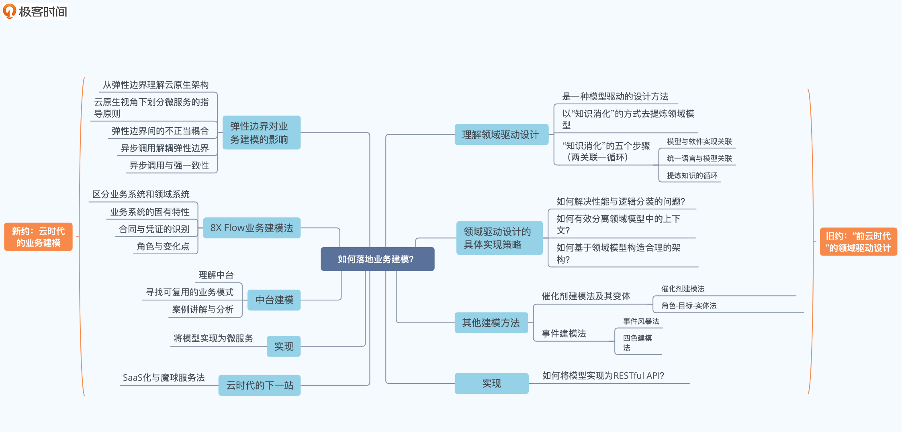
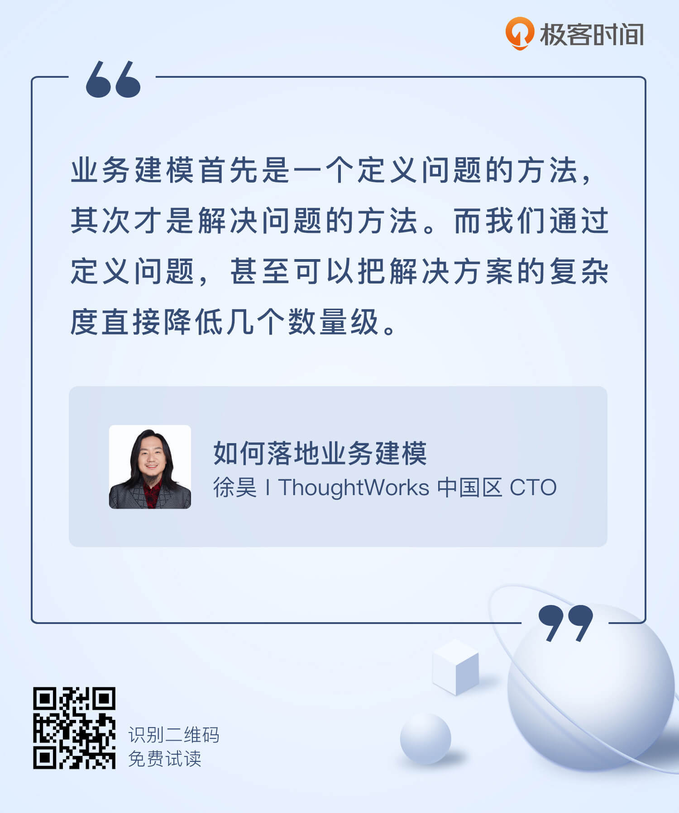

# 开篇词｜为什么你需要学习业务建模？
你好，我是徐昊，欢迎和我一起学习业务建模。

对于业务建模，我想大多数人有这么一串疑问：

1. 这个东西有什么用？好像面试也不怎么问到，学了能加薪吗？
2. 我听说微服务好像需要用到，那我不用微服务还需要学吗？微服务如果不流行了，那我是不是白学了？
3. 建模不建模，代码写出来有什么不一样吗？

这些都是好问题。我完全可以理解这些问题的出发点： **希望从解决实际问题的角度出发，看看业务建模能帮我们做什么。**

然而我要强调的是： **业务建模首先是一个定义问题的方法，其次才是解决问题的方法**。

## 解决问题还是定义问题？

我们很容易理解解决问题带来的价值，但也很容易忽略定义问题的力量。这么说你可能不太理解，我来给你分享个案例，来讲一讲我们是怎么通过定义问题，把解决方案的复杂度直接降低几个数量级的。

我曾在做项目时遇到过这样一个需求：客户要求我们将某种报告转换成PDF格式，以方便用户下载。

这些报告中有大量的图片，图片上又有很多文字说明。要让这些报告在页面上显示，那我们可以根据浏览器提供的屏幕尺寸和需要显示的文字字数，动态计算字体样式，保证图片说明的可读性。但是在转换成PDF的过程中，由于我们无法得知屏幕的信息，难免会出现一些排版格式的错误。

于是，我们项目组的一位技术骨干向我提出了一个“完美”解决方案：

- 使用当时最先进的后台渲染技术，在服务器端的浏览器进程中渲染页面（通过PhantomJS）。这样我们就能准确地计算合理的字体样式了。
- 然后，再将渲染好的页面通过浏览器后台进程转存为PDF文档，并通过云端的大规模存储服务进行缓存（AWS S3）。
- 为了应对突发巨量下载的可能性，我们还可以用当时最先进的云计算（AWS EC2），构造一组后台渲染集群。并根据下载量的大小，利用云计算的弹性动态调整集群的大小。

显然，对于我们要解决的问题，这位技术骨干是这样定义的：PDF中保留的信息样式与用户在浏览器中看到的是一致的。

然而真是这样吗？在解决问题之前，我们要先搞清楚客户要保留图片文字说明的目的。

我们知道，文字说明是版权信息声明，因此保留它的主要意义，就在于避免法务纠纷。那么问题来了，PDF中的信息样式，必须和用户在浏览器中看到的一致吗？

答案是：不一定！

我们都知道PDF是一种矢量格式，可以无限放大。那么无论我们提供的文字有多小，都可以经由放大看到其中的信息。

所以我们可以重新定义一下这个问题：PDF中需要保留图片的版权信息，以避免法务纠纷。而读者只需要知道版权信息的存在，不一定需要直接阅读它。

从这个问题定义出发，最终的解决方案格外简单：当图片说明文字超过一定字数，直接选择一个很小的字号，以保证信息留存在PDF中。

而实现方案，其实就是一条if语句的事儿。

我想，你一定可以理解一个后台渲染集群和一条 if 语句在成本上的差异。这就是对问题定义不同，带来的解决方案上的差异。

而这两个方案的差异点，主要在于我们看待问题的角度不同：

- 从业务的角度，去看待会产生什么实际影响；
- 还是从技术的角度，去看待如何完美地解决某个被别人定义的问题。

通常来说，问题定义得准确，那么实现起来也不会复杂到哪里去。反之， **如果没有搞清楚要解决什么问题，就可能需要各种奇技淫巧去弥补问题定义上的不足。**

要知道，多数人为了逃避真正的思考，愿意做任何事。而如果 **程序员为了逃避理解问题并给出定义，最后通常就会成为只会倒腾各种技术方案的架构师。**

至此，定义问题的重要性想必你已了然于胸，接下来一个更为重要的问题是：该怎么有效定义问题呢？

想要有效定义问题，就要从业务出发，首先尝试在业务中寻找简化问题的可能性，然后在技术中寻找对应的解决方案。业务建模就是这样一个过程。 **明确业务中的关键问题，使用易于实现的模型将业务问题表达出来。**

可以看到，在上面的案例中，我们甚至没有动用任何建模手段，而仅仅是在业务上下文中澄清了真正的诉求，就极大地简化了解决方案。

而一旦涉及软件开发的核心难点，也就是处理隐藏在业务知识中的核心复杂度，除了清晰地理解业务诉求之外，还需要通过建模的方式对这种复杂度进行简化与精炼。

## 学习业务建模的难点在哪里？

业务建模的方法有很多种，我们日常用到的：从着眼数据库设计的实体关系法（E-R Modeling），到面向对象分析与设计法（Object Oriented Analysis and Design），再到围绕知识消化的领域驱动设计（Domain Driven Design），不一而足。

而业务建模方法的吊诡之处就在于， **使用它的难度并不在于建模本身**。无论是哪种建模方法，你总能按照书里教程中的例子，照猫画虎地做个七七八八。

**业务建模真正的难点有两个：**

1. 清晰地定义业务问题，并让所有干系人都接受你对业务问题的定义；
2. 在特定架构的约束下，将模型实现出来。

接下来我就着重讲讲这两个难点，看看我们该怎么应对。

### 难点一：如何定义问题并让所有人接受？

对于“定义问题并让所有人接受”，我相信有些人会双手一摊，然后说：我不是业务专家，没有业务知识，怎么来定义问题？

注意，这里我所说的定义业务问题，是指 **对业务问题的梳理和总结**， **明确对业务的影响及产出**。

所以不是让你说明自己做的是什么业务，而是要你去提炼总结它，并通过你所选用的业务建模方法中蕴含的逻辑框架去验证它。如果发现漏洞和不足，要及时提出，让人参与讨论。

那么这里对你的挑战就不仅仅是建模本身了，而在于 **如何获取业务方的信任，并展开有效的讨论**。关于这个问题，大部分建模的教程中都不怎么涉及，但这却是能否有效使用业务建模方法的关键。

### 难点二：如何在特定架构下实现模型？

建模方法有着更长的生命周期，而技术架构却总在不停地演化，所以“在特定架构的约束下实现模型”，就成了学习业务建模的另一个难点。

我们在学习建模方法的时候，往往会不自觉地忽略架构对模型的影响。于是大概率会出现这样一种情况：学会了一种建模方法，却因为不知道怎么处理架构约束，而无法将其应用到实际工作中。

就好像如果今天你去学习面向对象建模方法，那么很可能你为模型所编写的代码，仍然会是在与数据存储无关的单体架构下，练习各种继承与接口的用法。而一旦在工作中真正使用，数据库、网络的访问开销，会把你的模型打散得七零八落。

正因为这两个困难，业务建模方法成了一种“ **所有人都在谈论它，但是没人知道具体怎么做；所有人都觉得其他人在使用它，于是只能声称自己也在用的东西**”。

因而在学习业务建模时，一方面，我们 **需要转移自己的关注点**。

不要太在意获得模型是否完美，是否在概念上足够抽象，是否使用了模式，等等。反而，我们更应该关注该 **如何围绕模型，建立有效的沟通与反馈机制**。也就是说，该怎么将模型中蕴含的逻辑讲给别人听。并且还要让别人能听懂，能给出反馈。

**理想的模型，需要是所有人都能懂的模型，** 而不是诘屈聱牙，满是完美的模式和抽象的概念。

另一方面，我们还需要 **对架构演化趋势保持足够的关注度**。

通常而言，每3-5年就会出现新的架构风格。比如过去15年，我们就经历了从单体到多层，再到微服务的改变。

在不同的架构风格下，业务建模和模型实现模式（Implementation Pattern）的最佳实践会存在些许差异。而这些差异，很可能会决定建模的成败。在后面的课程里，你就会看到很多这样的例子。

## 课程是如何设计的？

刚刚说的这些，其实也正是咱们这门课的核心设计理念。接下来，我就说说这门课具体是怎么设计的。

我将课程分成“旧约”和“新约”两部分。“旧约”主要讲解从单体到多层架构风格下，业务建模的最佳实践以及实现模式。“新约”则更偏重在云计算的时代里，新的架构模式下业务建模的最新发展与演化。

### 旧约：“前云时代”的领域驱动设计

首先，我会为你介绍 **领域驱动设计方法**。领域驱动设计时至今日仍是绝大多数人进行业务建模的首要方法。作为一种建模方法，它并不是那么出色，然而在如何引领需求发掘，如何建立沟通反馈，如何与业务方共建模型等问题上， **提供了一套出色的框架**。

而后，我会为你介绍在多层架构成为主流架构选择的时代中，领域驱动设计 **在模型实现上遇到了哪些挑战，我们该如何应对** 它。这部分是一个热身与预告，可以帮助我们理解架构约束会对模型带来何种影响。

最后我会介绍四种建模方法，分别是： **催化剂法、角色-目标-实体法、事件风暴与四色法**，以 **弥补领域设计在建模能力上的缺陷**。

这部分是过去十五年“前云时代”，我们对领域驱动设计应用的总结与提炼，因而称为“旧约”。

### 新约：“云时代”的业务建模

来到今时今日，云时代彻底改变了我们构造软件的方式，微服务、中台、软件的SaaS化都是这一影响的体现。新的架构约束会极大影响我们业务建模的方法，但同时也大大扩展了业务建模的内涵。

首先，我会为你介绍 **云到底带来了哪些观念上的改变**，它具体的颠覆性体现在什么地方，对我们构造业务系统有什么影响。

而后呢，我会介绍一种由我发明的业务建模方法 **8X Flow法**，用于解决 **以微服务、分布式事务** 为主导的架构风格中的业务建模问题。这个方法同样可以用于 **构建中台系统**，也是我司目前用于中台建模的主要方法。

最后，我会介绍另外一个由我发明的用于SaaS化业务建模的方法： **魔球服务建模法**（Magic Ball Offering Modeling）。它是一种 **从运营角度出发**， **构造SaaS化服务** 的方法。

## 开篇寄语

最后的最后，还想说段题外话。正如人生三大恨一样：海棠无香；鲥鱼多刺；随便一个应景的什么。我们这个行业呢，也有三大难：命名；缓存过期；随便一个应景的什么。

作为 ThoughtWorks 全球技术战略委员会成员之一，我有大量的机会和这个行业里最优秀的人才共事，比如Rachel Laycock、Ian Robinson、Jim Webber、Sam Newman、Neal Ford、Martin Folwer、Rebecca Parsons等等。

这些人有一个不那么广为人知的称号—— **字匠**（Word Smith），也就是说他们对于某个概念，可以寻找到极端贴切，而又饶有趣味的命名。

我相信，是 **对定义问题的偏执，让他们获得了长久而成功的职业生涯**。因而，哪怕仅仅作为一种思维训练法，业务建模也是值得学习的。

好了，从现在开始，就让我们一起开启学习业务建模的美妙旅程吧！同时，关于业务建模，如果你有什么想法或疑问，也欢迎在评论区留言，我会和你交流讨论。