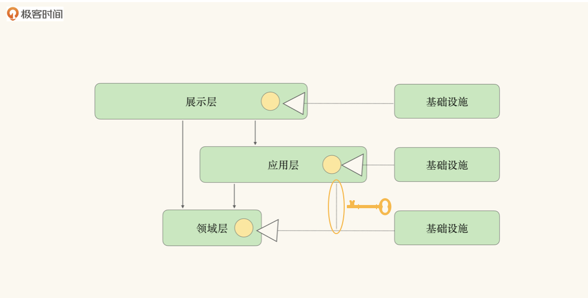
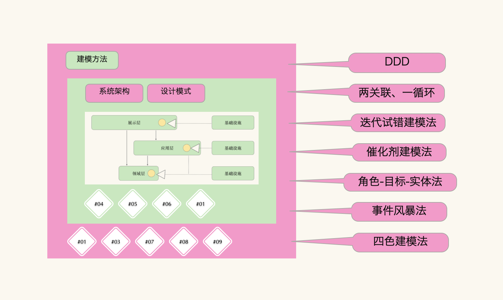
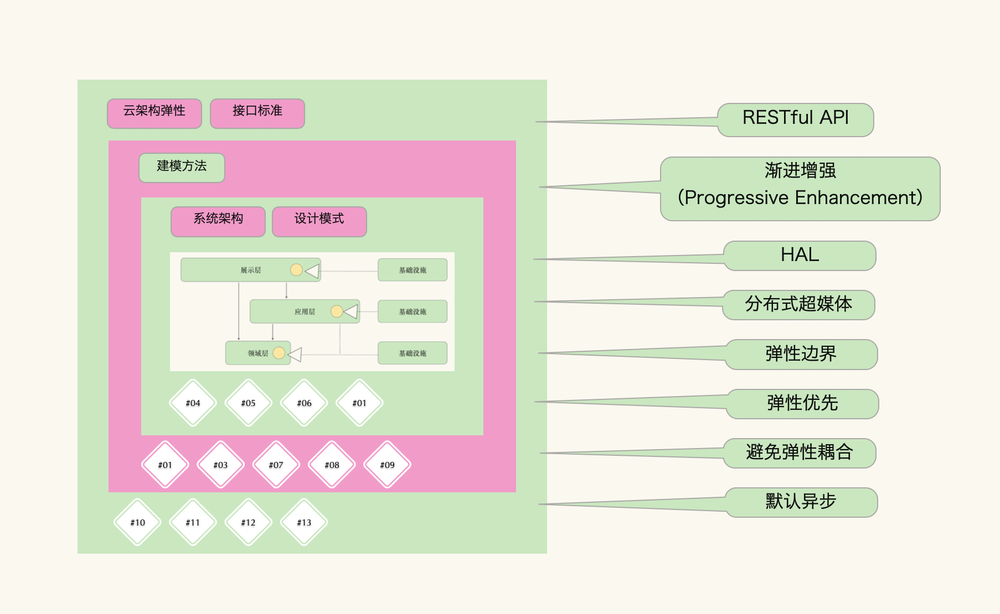
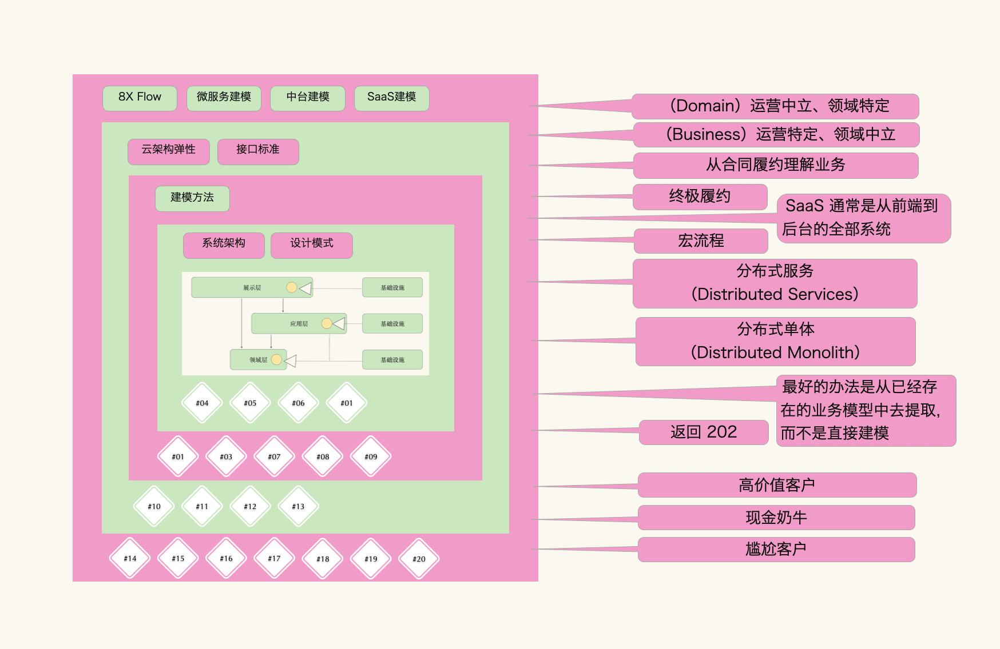
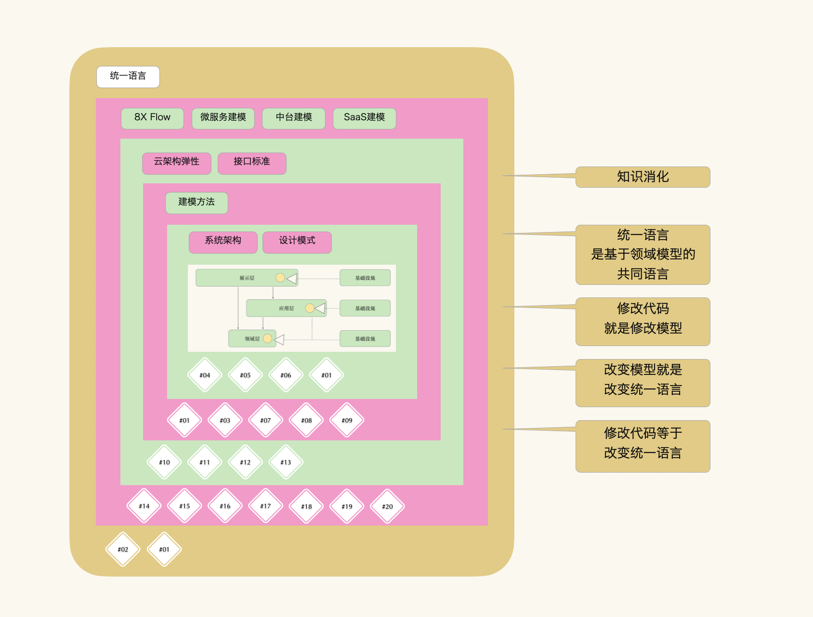
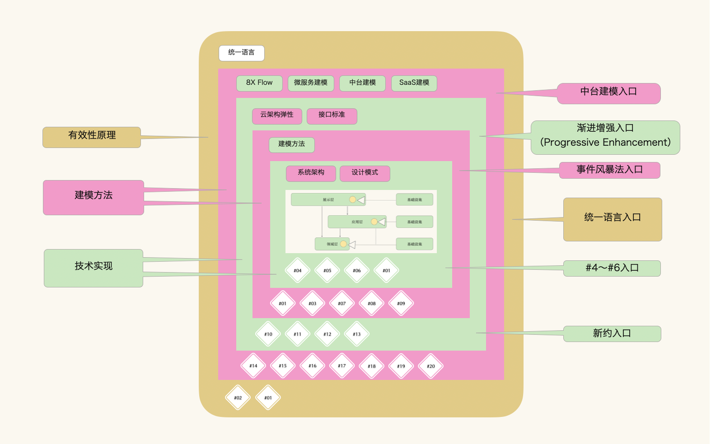

# 用户故事02｜邹海龙：大道千条，我选其一
你好，我是邹海龙，一个喜欢囤课的次高龄程序员。

学习徐昊老师的课程，最大的收获就是让我开始重新审视自己的技术认知。准确地说，这门课让我终于认清，自己原来是一个曾在CQRS邪教门口徘徊，拥有pojo幻想，还与Low code这个行业毒瘤擦身而过，现在又刚刚爬出伪微服务泥潭的次高龄程序员。

既然是用户故事，那么我决定通过讲一个故事，来呈现学习这门课的心路历程。

## 我的习武故事

### **进入建模大厦的钥匙**

万万没想到，带我进入建模大厦的竟然是一张图。不，准确地说应该是一条线。这条线看起来很普通，可是如果细看，会发现它跟其它线很不一样。方向、形状，无一不透露着它的与众不同。

恍惚间觉得这条线就像建模大厦转角处步行楼梯间的小门钥匙，我拿着钥匙仔细看，发现钥匙上刻着一行小字——“设计模式xxxx”。后面的字有些模糊，没法看清楚具体是什么。

我看左右无人，于是忐忑地打开楼梯间的小门走了进去。爬了4层楼后，才终于看到一个开放的通道。沿着通道继续走，再拐两个弯，看到了一扇毛玻璃门，是虚掩着的。推开门，发现不远处就是6号店铺，原来自己已经到建模大厦的3层了。心里默默念叨：“这，就算是进来了！”

### **盲盒**

收起钥匙，想了想哪里有些不对劲。为什么我爬了4层楼梯，最后却出现在大厦的3层呢？

我向6号店的店员说出了心中的疑惑，店员的解释也很透彻。原来在大厦的不同区域，楼层划分的方式也不相同。所以 **步行梯的4层，其实只相当于大厦商业区域的3层。中间那些水、电、空调等基础设施所在的M层是封闭的，除了大厦的工作人员以外，其他人都进不去。**

我左右环顾，发现4号、5号、6号这三家店铺有着非常相似的装修风格，并且卖的都是盲盒。秘籍上印着Smalltalk、贫血模型、充血模型、关联对象、角色对象、上下文对象、逻辑泄露、隔离实现、模型僵硬等各种商品，还有商品的简介。

我忍不住好奇，在6号店选了一个盲盒，打开后发现里面只有一张卡片，上面写着“能力供应商”五个大字。细细看去，底部还有一行小字：“可到4或5号店领取一个元模型盲盒”。

等走出6号店我才注意到，这三家店铺的招牌下都有一行小字注释：“设计模式连锁武术学校”。

这让我想起二十年前，那时的我还是个初涉江湖的青葱少年。机缘巧合之下，得到了门派首席长老的指点与馈赠（长老曾以《中文之星2.0》之手笔名动江湖），并拿到了一本出自该武术学校的秘籍，名叫《设计模式》。今日想起依然不胜感激。

我意识到自己有点儿走神儿了。“设计模式连锁武术学校”，我低头看着重新拿在手里的钥匙，终于认出了上面模糊的文字。就在这时，大厦的广播里传出了温柔的女声：“刚刚抽到能力供应商盲盒的同学，请到3楼1号DDD专卖店赢取特别奖励。”

1号店铺离得不远，我走进去说明了身份，接着店里的液晶屏就显示出一个问题：

> 请问关联对象、角色对象、上下文对象与能力供应商是什么关系？

我绞尽脑汁想了足足5分钟，在放弃前的最后一秒，脑海中突然被塞进一个激动的声音： **“答案就在那里，就写在那里，你睁开眼睛看一看，怎么会看不见呢！怎么会不知道答案呢！”**

我猛然想起那张卡片上面写的“元模型——”，不禁脱口而出。

“回答正确！”还未出口的“盲盒”两个字，已经被液晶屏里激动的正确提示音淹没了。随后液晶屏播放了一段武术动画片，那些看起来陌生却又似曾相识的招式，让我想起秘籍《设计模式》中的23式拳法。只是从来没想过，这些招式竟然可以如此组合，并且组合得如此精妙！令人叹为观止！

看完了武术动画片，也得到了我的特别奖励“DDD练功糖一盒”。其实，这种糖我是很熟悉的。今年有很长一段时间我都在邀请甲方一起吃这种练功糖。刚入口时很甜，慢慢就会变酸，有时甚至有点儿苦，所以很多人会只吃甜的那一部分，而把其余的扔掉。

1号店店员还向我介绍了“DDD练功糖”的功效，还说 **如果我能够熟练掌握盲盒里的各种拳法，一边吃糖一边施展拳法，便会威力大增。** 最后店员小声提示我，其实楼上还有很多其他种类的糖，如果您有兴趣也可以去转转。

### **练功糖**

我满怀期待地上了楼，3号、7号、8号、9号店依次映入眼帘，里面果然摆放着不同种类的练功糖，有迭代试错糖、催化剂糖、角色-目标-实体糖、事件风暴糖、四色糖等等，琳琅满目。

每种糖都提供了试吃小包装，于是我一包一包吃下来，感觉还不错。每吃一种糖，再配合着打上几拳，感受着每种糖配合拳法带来的不同威力。有的狂风暴雨、摧枯拉朽，有的和风细雨、润物无声。我感觉事件风暴糖和四色糖比较符合我的口味，打出的拳也更容易发挥威力。

不过在9号店练拳时， **一位长发及肩的中年儒士** 对着我的方向轻轻摇了摇头。于是我收了拳向他请教：“可是有什么地方练得不对？”

他微微顿了顿说到：“ **足下武功若再要精进，可借助器械加强体魄，周而复始必有所得。**”说完便转身离去。离去时身边还跟着一位少女，身着青衣。

我正准备跟上去问个究竟，不曾想才转了一个弯，就被左手边的10号店吸引住了。

### **器械**

10号店是卖器械的，11号、12号、13号好像都是。不对，不是卖器械的，而是一个器械健身房。

进入健身房看到每种器械上都刻着古怪的名字，渐进增强、RESTful API、HAL、分布式超媒体、弹性边界、弹性优先、避免弹性耦合、默认异步，林林总总。店铺教练向我介绍，使用这些器械主要是为了获得两种能力：

- **拳法前后端的结合方式更加完善；**
- **各种拳法架构的弹性组合。**

在教练的帮助下，我试练了一节课。“效果还可以，悟性不错！”教练鼓励我：“如果能再继续一个学期的训练，你就考虑入手一些符合个人特点的装备吧。”

装备？什么装备？

教练看着我，讪讪地笑了笑：“嗯，现在的比武方式跟前些年有了很大的不同，单纯的拳法比试已经过时了，现在大家比的都是使用某种装备的战斗能力。当然，拳法还是必不可少的基本功，否则你也无法驾驭好装备。”

“哦，原来如此，那我能先去看看装备吗？”我问到。

“当然可以”，教练指了指楼上的方向。

告别了教练，我快步上楼。

### **装备**

上楼后，我发现这一层展示的全都是装备。我从14号店依次走到20号店，了解到装备大致分为三种，分别是：中台、微服务和SaaS。

当我走到19号微服务店铺时，二十年前的回忆又浮现在脑海里。记得那是在加入门派的选拔仪式上，首席长老微笑着肯定了我的能力：“你基本理解了面向对象的设计思想”。

我不失机敏地问到：“您能给我讲讲在面向过程和面向对象之后，接下来会是什么呢？”他思考了一下：“会是面向服务，但现在还不够成熟”。这句话我当时记忆很深刻，不过一时无法理解。不想时隔多年后终于得到印证， **只是在“服务”前多了个“微”字。**

拉回了思绪，我向19号店提出要购买微服务装备的想法，店里却要求我出示健身房的训练记录。我当然没有了！于是为难地看着店员。

“那我没办法卖给您”，她耸耸肩。看我没有离开的意思，她又接着说：“如果您有2号店的推荐信也可以”。

“2号店？”我犹豫了一下，快步走下楼去。

### **心法**

回到三楼只找到了1号店，却不见2号店的踪迹。于是走进1号店准备问路，刚要开口，发现面前站的竟是那位青衣少女，我俩不约而同地笑了起来。

> “请问2号店怎么走？”我首先开口。

> 她眉微上扬回问我：“你想买装备？”

> 我疑惑地看着她：“你怎么知道？”

> 她微笑着抬起手：“跟我来吧！”

随即走到了1号店的一个屏风后面。我跟上去，发现后面竟有一扇门，原来所谓的2号店就是1号店的套间。她轻轻叩门，里面响起一个熟悉的声音：“请进”。

只见那位长发及肩的中年儒士正在独自饮茶，看到我们进来，便起身示意落座。

“我姓文，这位是我们大厦的武学宗师徐真人”，青衣少女向我介绍。

我向徐真人做了足足800字的自我介绍，并表明了希望获得推荐信的来意。文姑娘笑着说：“徐真人了解大厦里发生的一切，包括你来申请推荐信。”随后在徐真人的点头示意下，文姑娘从桌上拿起一个信封交给我。

我站起身，双手抱拳，微微颔首：“谢谢徐真人！谢谢文姑娘！”

转身离开，刚出门，文姑娘追了出来，双手递过一本书：“这是徐真人送你的心法秘籍”。真人果然不凡，出手就是秘籍。我赶忙从文姑娘手里接过秘籍，映入眼帘的是四个大字——统一语言。

道别了徐真人和文姑娘，我拿着《统一语言》这本心法秘籍，向着楼上19号店“微服务”的方向大踏步走去……

好，故事讲完了。故事本身是杜撰的，但故事里的认知是真实的。那么现在回到现实，谈谈我对徐昊老师这门课的理解。

## **我的学习心法**

### **设计模式（故事里的盲盒）**

还是先从设计模式谈起。如果按部就班地学习23种设计模式，那么我们可能不知道这些模式能解决什么问题，什么时候能用。虽然书中会有一些例子说明，但回到实际业务场景中，会发现很难准确对应。

我个人之前的做法是，下意识地写一段代码，然后发现它符合了某种设计模式。然而更为有效的方法应该是先想好设计模式，再去想代码应该怎样跟业务匹配。这是一个顺其自然的过程，当你面向对象的抽象能力达到水平线，自然就能写出那些设计模式所需要的代码了。

如图所示，徐老师在第6讲讲的能力供应商就是这个过程的极致体现，也正是这节课，让我突破了原本对层的理解。图中的其他关键词就是故事中的盲盒，也是第4-6讲让我颇受启发的要点。

### **建模方法（故事里的练功糖）**

课程对于业界流行的业务建模和领域建模的相关方法进行了全面的介绍。尤其是对方法之间的关系，它们是如何产生、演变、融合和转换的，徐老师的讲解深入浅出。在此之前我看过很多建模方法的相关课程和资料，大都相对片面，视角单一。而徐老师的多方法对比讨论，对于提高建模认知非常高效。

下图中的关键词就是故事里的糖，也是我从第1、3、7、8、9讲寻觅到的建模方法，欢迎其他同学继续补充。

顺便说一句，最近DDD很火。在我还很年轻的时候DDD就出生了，所以今天的DDD已经不再年轻了。这两年DDD翻红除了微服务流行掀起的技术原因外，还与国内企业软件素养的普遍提高有关。比如今年我有超过40天与甲方业务专家一起做DDD现场建模的经历，在感受业务专家参与业务建模的热情与专注的同时，也深刻体验了统一语言在业务建模过程中的魅力和价值。

### **避免弹性耦合（故事里的器械）**

关于系统弹性的认知，我过去的理解不充分，更是从来没想过默认异步可以让软件与现实世界的运行方式这样接近。关于弹性边界和弹性优先原则，徐昊老师在课程当中做了深入的讲解，通过学习课程相信你们跟我一样可以重新理解什么是系统弹性，应该用什么样的原则去设计系统弹性，重点是我们一定需要学会避免弹性耦合。

对于接口部分，徐老师的观点也非常鲜明，就是采用RESTful API。此外，老师还特别强调了渐进增强对于理解前端的重要性。如果你之前没有系统学习过这些内容，那么这部分内容就足以值回票价了。

如图所示，其中接口和系统弹性方面的关键词来自第10-13讲的内容，在故事中这些标准和方法被比喻成器械。因为我希望自己能够通过这些标准和方法的训练，解决目前工作中接口调用和业务弹性的实际问题。

### **业务还是领域（故事里的装备）**

在第14-20讲这么大的一个集合中，老师地毯式地描述了8X Flow为微服务、中台、SaaS建模的过程。在建模过程中，我们必须牢记领域模型的特性是“运营中立而领域特定”，业务模型的特性是“运营特定而领域中立”。

业务模型是通过实际业务的梳理建模而形成，借助合同履约过程来理解业务建模的过程，所以这是一个特别经典的从现实世界借鉴成熟模型，并应用到软件建模过程的范本。

另外，徐老师对于客户的价值分析我也非常认同。高价值客户和现金奶牛客户是需要去大力发展的，而尴尬客户是耗费掉你的大量资源的黑洞。我相信商业参与度比较高的同学们，对此肯定会有共鸣。

图中的关键词来自第14-20讲的内容，我在故事中把它们比喻成装备，意在强调这部分内容的先进性和有效性。

另外，徐老师在课程中讲到：“ **对于业务模式，最好的办法是从已经存在的业务模型中去提取，而不是直接建模。”** 把这句话送给那些不关心业务、只醉心于技术的朋友们，我们共勉！

### **统一语言（故事里的心法）**

徐昊老师在第一讲就开宗明义，统一语言是知识消化的核心过程；两关联一循环是统一语言的方法论，是业务与模型闭环的有效性保障。

如图所示，统一语言即故事里的心法，也是让我对自己当前工作产生灵魂拷问的法门，为什么技术跟业务之间不能做到认知一致呢？原因就在于没有完成知识消化。

徐老师在课程里是这么说的：

> **修改代码就是修改模型，修改模型就是改变统一语言，修改代码等于改变统一语言**。

徐老师已经把话讲到最精炼的程度了，我只能一字不差地摘录下来。故事里提到我今年连续实战了40天的DDD。没错，就是在这个过程中，我深刻感受到统一语言在业务用户和软件团队之间起着多么重要的桥梁作用。如果统一语言产生了歧义，那么整个系统或者项目都会付出沉重的代价，时间延期、费用超支，甚至导致项目失败。所以学习并熟练使用统一语言的建模原则，必然会成为我们成功构建系统和项目的有效保障！

## 我是谁？

简单介绍下我的从业经历，可能对我后面的建议有一丢丢的说服力。

- 我先是在乙方做了8年的程序员。所以20年前就体验过C/S的Low Code平台的失败（当然，主要责任在首席长老）。徐真人不许笑！
- 接着在甲方做了8年的IT部门管理，供职的三家公司都是家喻户晓的零售品牌（名字就不讲了）。所以对中台、SaaS这些大词儿接触得比较多。
- 最近7年又做回了乙方（一晃又快8年了），负责一个技术团队，目前在跟微服务持续较劲。

基于之前的经历，我试着找几个角门，帮你进入徐昊老师建设的建模大厦。如果不通，也没法完全负责。

- 前端的朋友，你可以把渐进增强作为大厦的入口。
- 后端的朋友，如果已经对23种设计模式有过实践，那么可以从4～6讲进入大厦。
- 甲方的朋友，你可以从统一语言、事件风暴建模法尝试进入，然后重点学习中台建模。
- 构建低代码和SaaS平台的朋友，新约部分应该是你的主入口。
- 小白朋友，建议从软件基础开始学习。如果你的资金和时间都不紧张，那么通读课程，可以帮你理解软件是如何客观有效地满足业务的。
- 以上范围之外的朋友，恕无法给出针对性建议，你只能自行寻找入口了。

大道千条，我选其一，留下的999条，任君挑选。感谢你的时间，看到了最后。以上分享，与诸位共勉！

### **番外**

走在去往19号店的路上，我下意识地翻开《统一语言》这本心法秘籍，发现里面夹着一张精致的卡片，它的中间位置印着一行烫金小字：“8X Flow 装备5折优惠券”。卡片的右下角还有一个印章，貌似是谁的姓名。定睛细看，发现是“囚牛集鉴”四个字。这才想起文姑娘曾经说过，徐真人可是会制琴的啊！

环顾大厦，看到这里还有很多空房间，真心盼望徐真人和文姑娘能导入更多的店铺，抑或建设新的大厦。

祝大厦生意蒸蒸日上！再次感谢徐真人！再次感谢文姑娘！