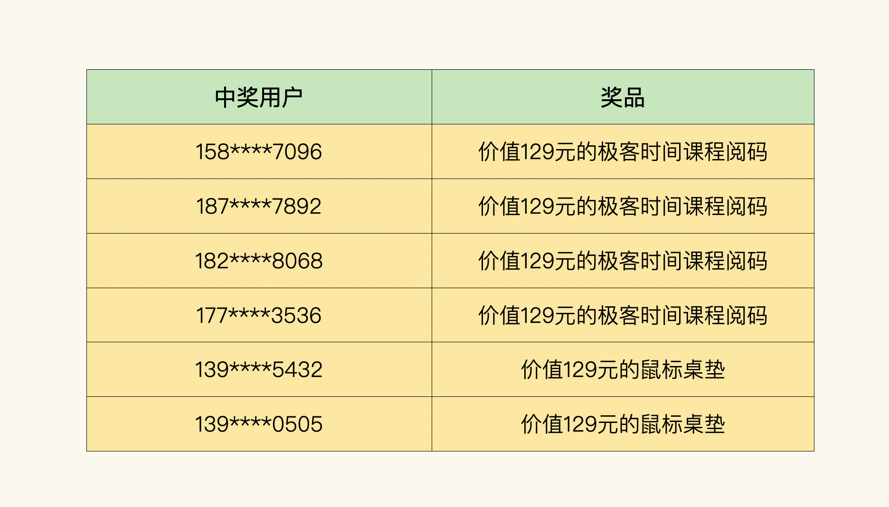

# 编辑手记01｜写给专栏读者的一封小信
你好，我是《如何落地业务建模》专栏的编辑辰洋。今天我来公布一下结课问卷的中奖名单，同时也想借这个机会来专门说点题外话，向我们专栏的读者表达一下感谢。

## 公布结课问卷中奖名单

专栏的结课问卷调研已经回收完毕，首先要感谢参与结课问卷调研的每一位读者。你们不仅对《如何落地业务建模》专栏给予了充分的肯定，对极客时间平台予以支持和鼓励，而且还给我们专栏提出了非常中肯的建议和想法。

在此，我挑选出反馈信息最具体、丰富、有实际价值的6位读者，送出“价值129元的极客时间课程阅码”或“价值129元的鼠标垫”。名单如下：

恭喜以上6位读者，也再次感谢每一位参与结课问卷调研、给予反馈的读者！

## 感动带来改变

然后我还要特别谢谢在专栏更新期间，不断给予学习效果反馈的那些读者。自课程上架以来，徐老师一直关注着读者的学习情况。所以每更新2-3讲，我就会去留言区找一些读者，通过一对一沟通的方式收集学习效果反馈，然后给到徐老师。

在专栏更新的两个月里，我们共调研10次，跟60余位读者进行对谈，最终整理好的有效反馈记录达2万余字，也体察到了专栏读者最真实的学习诉求和学习状况。这些反馈是我们一起学习的印记，也是我们努力把课程打磨更为极致的点滴证明。

根据这些建议和反馈，我们在打磨课程时也做了一些优化与补充。主要有如下几点：

- “云时代的挑战”这两篇文章被推翻，重新打磨；
- 新约部分的文章会通过举更多的例子，来阐释那些比较晦涩难懂的知识点；
- 建立读者交流群，建立一个交流共享的渠道；
- 打磨用户故事，由读者现身说法分享学习方法与收获。

另外，徐老师也由此发起了“题外话系列”，集中解答了其中一些值得回答的问题。这个深度答疑系列被不少读者认为是“小知识、高见解”，收获了不少好评。

那么这里我就要说句题外话了。徐老师是一位专业且靠谱的作者，他 **不仅认真写稿、从不拖稿，还催我改稿、收集反馈**。正是因为徐老师的这个提议，让我化被动为主动，兴致盎然地投入到了这项工作中去，与此同时也收获了不少感动。

靠谱的反馈会让我感动。有读者说要对自己提出的每一条意见负责，所以他细读了三遍，然后发来了将近两千字、并且排版整齐的反馈。也有读者白天忙于项目，凌晨两点下班后给我发来了长长的反馈。

真诚的行为也会让我感动。有读者会为专栏的运营推广出谋划策，想营销点子。也有读者会因为这么优质的专栏却销量不理想而扼腕叹息，然后拉着同事朋友一起入坑。还有的读者极富同理心，他们在感慨课程内容有难度、不好消化的同时，还能由此及彼推己及人，会想到我作为编辑，也在经历坎坷曲折，然后给予鼓励。

**慢慢的，这项调研工作就成了一个双向交流与分享的通道。慢慢的，我收到的那些反馈不再只是理性的文字，它的背后是一个人的学习状态和世界**。这也是为什么我喜欢用“读者”来称呼你们，而非“用户”。

必须承认的是，我其实很容易被感动。但如若只是片刻的感动，那么感动之后大概率又会投入到自己以前的生活中，认知和行为并不能发生太大的改变。关键就在于，在打磨这个专栏的过程中，我接收到的感动是持久的、多方位的。所以我能从内心深处作出反思，并在行为上作出改变。正如徐老师在 [《驱动变革：如何驱使行为改变》](https://mp.weixin.qq.com/s/QjogY1ljSiSKIbw0trxGhA) 这篇文章中所讲的，相比“分析-思考-改变”这种理性的变革模式，“目睹-感受-改变”则是驱使行为改变的更为有效的办法。

最后，也要谢谢每一位坚持学完课程的读者。课程的知识密度大，学习门槛较高，需要理论基础、实践水平、代码实操兼而有之，才有可能通过这场认知的洗礼，抵达业务建模的彼岸。看到你们仍在坚持学习、反复回看和积极交流，这是我作为编辑，努力为平台上每一位读者交付优质内容的动力。长路漫漫，我们再会！

顺便说一句，徐老师于9月27日（周一）晚19:30在极客时间进行了直播，主题是“云时代，架构师都面临哪些新挑战？”，干货十足， [点击链接](https://www.bilibili.com/video/BV1Uq4y1P7nj?spm_id_from=333.999.0.0) 可观看回放！