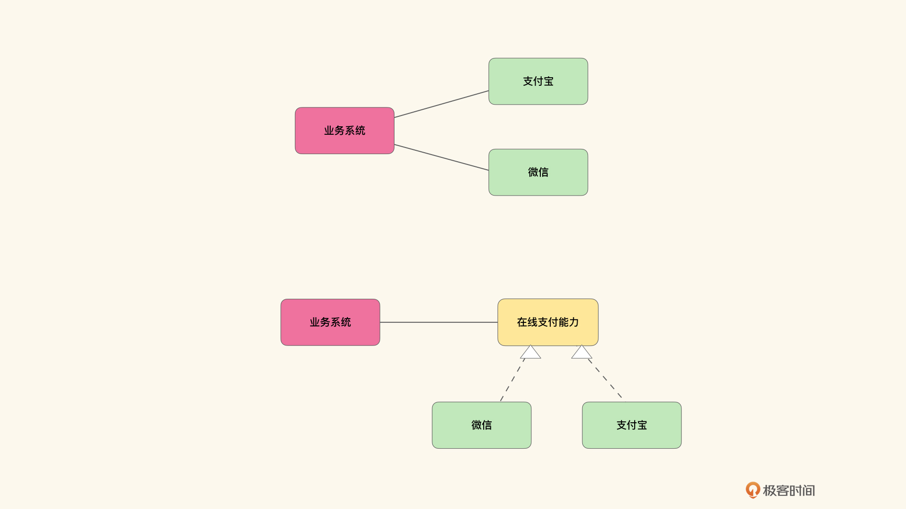

# 说点题外话01｜好耦和与坏耦和
你好，我是徐昊。今天我们专门来说点题外话（都知道，这门课里的题外话，都不是题外话）。

目前我们正好完成了旧约部分的学习。也就是说：

- 通过第 [1](http://https://time.geekbang.org/column/article/386052)、 [2](http://https://time.geekbang.org/column/article/387945)、 [3](http://https://time.geekbang.org/column/article/389072) 讲，我们重新梳理了什么是领域驱动设计；
- 在第 [4](http://https://time.geekbang.org/column/article/389082)、 [5](http://https://time.geekbang.org/column/article/389089)、 [6](http://https://time.geekbang.org/column/article/389095) 讲，了解了在落地领域驱动设计时，有哪些模式可以帮助我们更容易地实现模型；
- 在第 [7](http://https://time.geekbang.org/column/article/390792)、 [8](http://https://time.geekbang.org/column/article/390799)、 [9](http://https://time.geekbang.org/column/article/392869) 讲，学习了不同的建模方法，以帮助我们展开业务维度；
- 最后，在第 [10](http://https://time.geekbang.org/column/article/395650) 和 [11](http://https://time.geekbang.org/column/article/396467) 讲，学习了怎么把模型映射为RESTful架构。

内容整体来说是比较紧凑的，知识密度也比较大，所以在进入新约部分的学习之前，我希望你能喘口气儿，稍微回顾一下我们学习过的内容。

要知道，反思是学习真正发生的时候。毕竟 **学习的目的是改变我们的行为和思维，而一味地摄入内容和信息呢，并不一定真的能达到你想要的效果**。

那么接下来，我将会集中回答一系列问题，帮助你更好地理解我们在旧约部分讲到的内容。因此， **如果你有什么迫切的疑问，请尽快在评论区留言。时间有限，抓紧上车，入股不亏**（当然，非官方版本是因为作者突发腰伤，需要休刊）。

今天，我想先来谈一谈耦合的问题。因为我从收到的留言和问题反馈中，发现很多同学对耦合已经有创伤后应激障碍（PTSD Post Traumatic Stress Disorder）了。有同学经常担心是不是会存在耦合，然后开始准备用各种手段消除耦合，等等。

但是我们需要知道，耦合从逻辑上讲，有必然耦合和偶然耦合两种。所谓 **必然耦合**，就是如果你使用支付宝或者微信完成在线支付，那么你必须要跟支付宝或者微信存在耦合关系。这种耦合关系 **是完成业务的必须**。

对于这种耦合关系，你是无法消除的。也就是说，无论你怎么写代码，最终的结果都会转化为对支付宝或者微信的调用。当然，你也可以通过代码的组织，将这种耦和关系变得很隐蔽。比如通过事件驱动风格，神神秘秘地发一个消息，然后呢，后面会有个人帮你去完成调用。

然而消息发送在概念上和接口调用也没什么区别。所以当我们都处在概念层面时（比如我们现在在讨论必然耦合），其实你还是调用了对方的接口，所不同的是调用方法的差异。到底是直接调用，还是发个事件调用而已。

那么偶然耦合就不同了。什么样的情况算是偶然耦合呢？比如你现在要存一段数据，你可以选择把它存成文件，或者存在数据库里，再或者是区块链上链。不过，无论你选择哪种方式，其实都是偶然耦合，除非你有必须要这么存储的道理，否则你也只是随机地、偶然地选择了一种实现需要的方式而已。

所以对于耦合来说，我们本能地认为必然耦合是好的耦合，而偶然耦合是不好的。 **因为必然耦合中蕴含着必然性，也就是确定性；而偶然耦合里则包含着偶然性，也就是变化性**。那么我们就需要处理掉偶然耦合。这恰恰是偶然耦合PTSD症状的源头之一。

然而让我们用偶然耦合和必然耦合再去看支付宝或者微信，你就会有另一种感受。我们是必然要使用支付宝或者微信吗？

显然不是！我们必然要使用的是网上支付服务，而我们只是偶然地选择了支付宝或者微信，作为我们实现网上支付的手段而已。

那么有什么办法可以让我们表达这种想法吗？有的。那就是提取业务能力。 **也就是说，我们不再必然耦合于支付宝和微信了，我们必然耦合于在线支付能力**。然后呢，让支付宝和微信成为这种能力的实现。如下图所示：

**从做法上来说，我们从业务上找到了业务真正所耦合的能力，然后将其他具体的供应商隐藏在能力之后**。这样我们就完成了从偶然耦合到必然耦合的重构。事实上，这么做也深化了我们对业务的理解。而且也明确了我们所完成的功能，到底需要耦合于其他哪些业务能力。

注意，这个操作的关键在于， **我们从业务上寻找到了对应的业务能力**。从业务上寻找到的能力，是对业务本身理解的深化。而不是你随便编一个什么能力，只要能抽象过去就好。

但是一旦我们疏于理解业务，这个操作就演化成了著名的耦合PTSD： **见不得对具体实现的依赖**。于是我们会粗暴地将对接口依赖看做必然耦合，然后把对具体实现的依赖看成偶然耦合。所有具体实现都必须抽象一个接口，也不管它是不是能在业务上找到对应的能力。

这种盲目地对具体实现的恐惧，以及盲目地将所有具体实现都归结为偶然耦合的一刀切的做法，其实是我们行业的一大病，同时也是很多具有迷惑性的烂代码的来源。看起来整整齐齐，所有变化点都考虑到了，实则并没能简化问题，也没能降低理解难度，只是写的人自己爽了而已。

可以说， **真正的明白人，只会消除不必要的偶然耦合，通过把对具体实现的偶然耦合，转化为对隐藏业务能力的必然耦合，从而简化对业务问题的理解**。

## 思考题

请从必然耦合和偶然耦合的角度思考一下，领域模型的多层架构，特别是基础设施层，到底应该是偶然耦合，还是必然耦合呢？

然后再回顾一下我们在4-6讲谈论的模式，其中哪些模式利用了将偶然耦合转化为必然耦合的技巧？我们又是如何识别偶然耦合的呢？

最后，如果你有什么迫切的疑问，或者想听的话题，请尽快在评论区留言。再说一遍，时间有限，抓紧上车。或许你的疑问，就会成为下一篇题外话的主题。

划重点，如果对课程内容有任何想法或建议，可以加专栏编辑的微信，和她交流，成为专栏的优质读者。微信号是：seekforli。