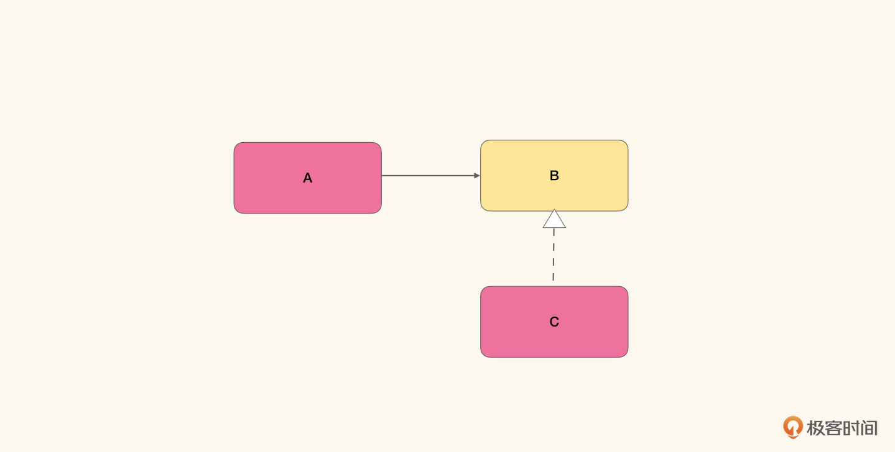

# 说点题外话02｜模式并不是解决方案
你好，我是徐昊。今天我们再来专门说点题外话。

说点题外话系列，是我根据评论区的留言，以及不少读者直接给到编辑的反馈中，挑选出来一些值得回答，但又不好直接回答的问题，然后呢，我会讲讲这些问题背后对应的原则。希望你可以感受到我强烈的暗示，在学完之后，不仅要思考，还要主动去寻找一下答案。

除此之外，我也希望给平淡的连载生活带来一定的现场感。比如今天这篇文章是周四零点推送，那么编辑小姐姐会在周三中午12点截止反馈收集。然后呢，我会从中挑选要写的话题，从下午两点开始写，然后录音。这样或多或少可以为专栏课程带来一些不可预知的可能性（比如编辑小姐姐一整个下午都在担心专栏是不是会断更，以及一整个下午，都保持着随时待命的状态）。

言归正传，今天我要讲一讲 **模式**（Pattern）。自从GoF（Gang of Four）在1994年发布设计模式（Design Pattern）以来，模式就成了获得可重用的对象模型的重要手段，而模式语言（Design Language），也成了我们描述架构和解决方案的重要手段。

我知道我们这个专栏的读者都有比较长的工作年限，也有比较丰富的工作经验，想来对于模式，你肯定是不陌生的。那么我先问一下，如下图所示是什么模式：

如图所示，某个类A将自己的行为委托给某个接口B，然后某个具体实现类C，实现了B的接口。你能想到什么模式呢？

如果仅从这个结构来看，那么对应的模式有很多很多可能性，我随便可以列出五种：

- 策略模式（Stragegy Pattern）：B是策略的接口，C是具体的策略实现。
- 适配器模式（Adapter Pattern）：B是某个接口，C是将另一个实现转换为B的实现。
- 状态模式（State Pattern）：B表示状态的接口，C是某个具体状态。
- 备忘录模式（Memento Pattern）：B表示备忘录的接口，C是备忘录某个特定的数据备份。
- 装饰器模式（Decorator Pattern）：B是某个接口，C是装饰了这个接口的额外功能。

我们会发现，如果仅仅给定最终的实现结构，那对应的模式可能有很多很多种。那么，怎么才能判断我们到底使用的是什么模式呢？

这个时候，我们就要回到模式的定义了。模式至少包含两个部分：问题和解决方案。 **同样的解决方案可能会对应着不同的问题。那么，同样的解决方案与不同的问题配对，也就产生了不同的模式**。

比如说，对于 **策略模式**，问题是对于某个类，需要施加不同的算法以完成不同的功能。那么怎么做才能使得算法可以替换，还不会影响到使用这些算法的类呢？

那么对应的解决方案就是，通过接口表示算法，然后将不同的算法封装到不同的对象中，并让这些对象实现这个表示算法的接口，这样就可以实现算法的替换了。

而对于 **状态模式** 而言，问题是某个类的行为随着它内部状态的改变而改变，我们如何将不同内部状态下的行为进行有效地封装，并在状态改变时做出与之对应的变化呢？

对应的解决方案就是，通过接口表示状态，然后将不同状态下的行为，封装到不同的对象中，并让这些对象实现这个表示状态的接口，这样就可以在内部状态改变的时候，实现行为的改变了。

虽然从最后结果上看，我们得到了类似的代码结构，但实际上，两者却是完全不同的两个模式，因为它们要解决的问题完全不同。那么我们不禁要问了， **是否能够从解决方案反推它要解决的问题，然后判断我们使用了什么模式呢？**

答案是， **不行，最好也别这么做**！

其实不光是在写代码，与人交往的时候，也最怕从行为贸然推断意图。比如说，哪个小姐姐多看了你一眼，你就觉得人家看上你了。于是批《红楼梦》的脂砚斋就跳出来说，古来穷酸最会替别人取中自己。你看，你和脂砚斋都已经在意图批判了，这样不好。

再比如这道经典送命题：为什么你去喝酒都不陪我，你一定是不爱我了。这也是标准的意图推断，多少不和谐都是从这里来的。

所以如果你深受其苦，那么请反思一下自己， **为什么你看到某个具体的实现方案，就会猜测它是不是某个模式呢**？我们还是要理解具体在解决什么问题，然后结合解决方案，才能明白具体是什么模式。

因为这样做其实也带来了另一个问题，就是不对问题加以判断，盲目地去套用某个解决方案的结构。这造就了大量看起来很高级，实则一无是处的烂代码，而且这种代码还充满了酸臭的匠气。

所以说，模式与建模是一样的，都是 **问题先行**。模式 **最难的地方就在于判断当前的问题与模式要解决的是否是同一个问题**，这也是为什么我们提倡通过重构获得模式：当问题明显出现的时候（以坏味道的形式），那么最难的一步其实你已经解决了。这时再通过重构去得到具体的解决方案，反而是简单的。

## 思考题

最后是非常值得我们思考的思考题环节。请问：我们在第4-6节所讲的模式，它们各自对应的问题和解决方案分别是什么？

一定记得把你的思考和想法分享在留言区，我会和你交流。同时，也非常期待你能把自己的疑问和想听的话题，写在留言区，或者反馈给专栏编辑（微信号：seekforli）。我们下个题外话再见！