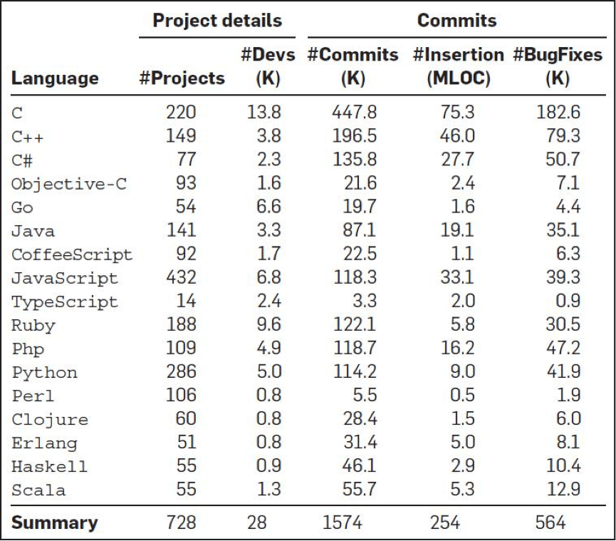
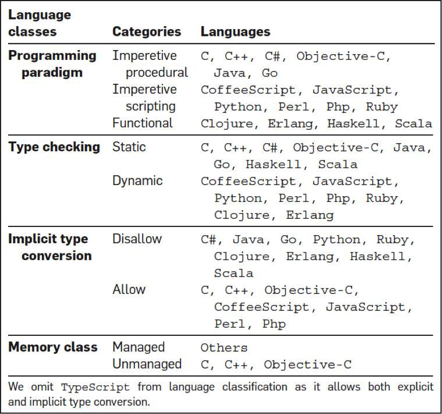
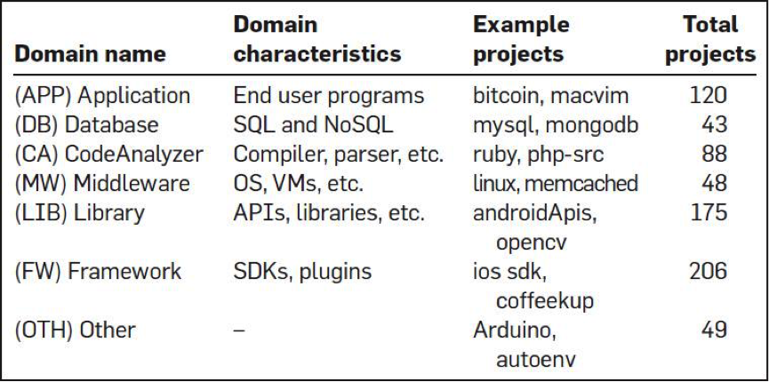
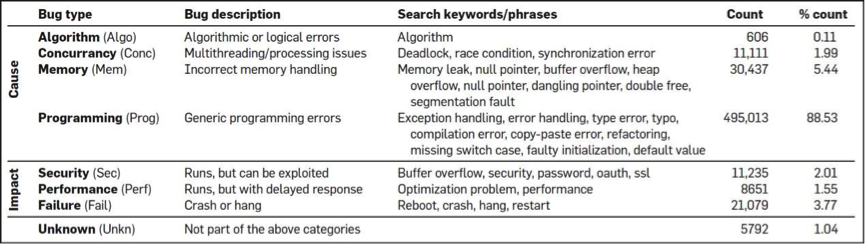
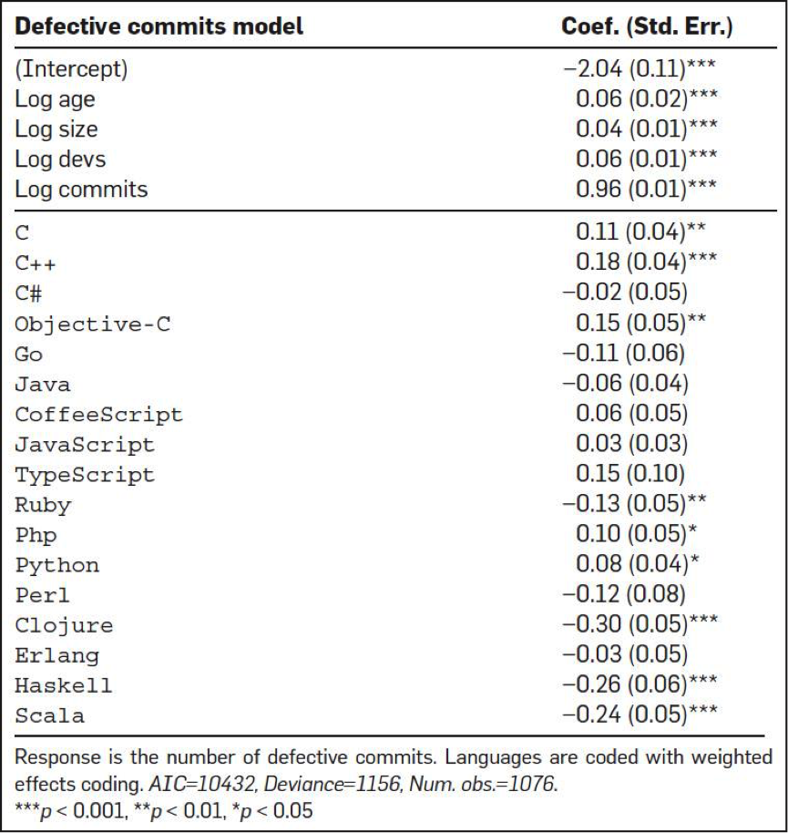
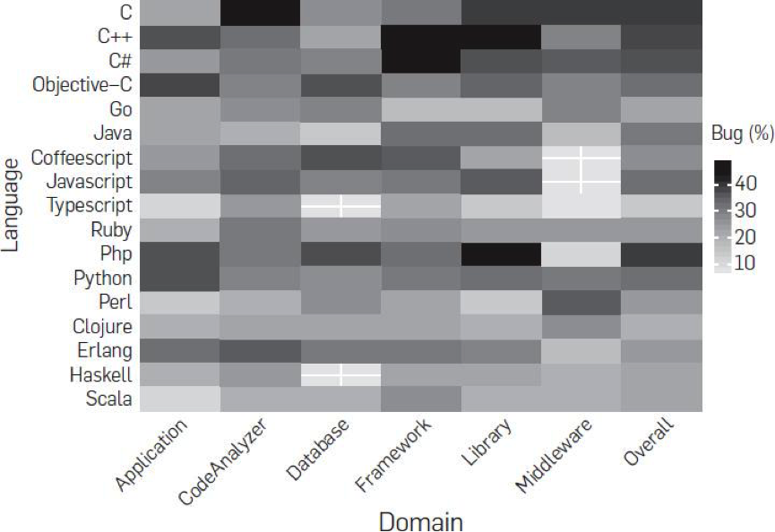
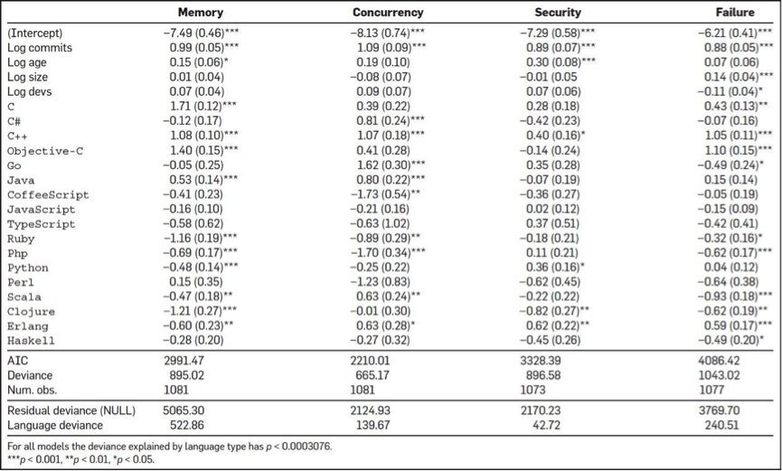

# 07 | 推荐阅读：每个程序员都该知道的知识
你好，我是陈皓，网名左耳朵耗子。

在整个为期一年的专栏内容中，我会逐步向你推荐一些有价值的内容，供你参考，这些内容有中文，有英文，也有视频，它们都是我认为对我非常有价值的信息，我也希望它们对你能有同样的帮助和启发。

今天，我为你推荐的5篇文章，它们分别是：

- Stack Overflow上推荐的一个经典书单；
- 美国某大学教授给计算机专业学生的一些建议，其中有很多的学习资源；
- LinkedIn的高效代码复查实践，很不错的方法，值得你一读；
- 一份关于程序语言和bug数相关的有趣的报告，可以让你对各种语言有所了解；
- 最后是一本关于C++性能优化的电子书。

#### 每个程序员都应该要读的书

在Stack Overflow上有用户问了一个 [问题](https://stackoverflow.com/questions/1711/what-is-the-single-most-influential-book-every-programmer-should-read)，大意是想让大家推荐一些每个程序员都应该阅读的最有影响力的图书。

虽然这个问题已经被关闭了，但这真是一个非常热门的话题。排在第一位的用户给出了一大串图书的列表，看上去着实吓人，不过都是一些相当经典相当有影响力的书，在这里我重新罗列一些我觉得你必须要看的。

- **《代码大全》** 虽然这本书有点过时了，而且厚到可以垫显示器，但是这绝对是一本经典的书。

- **《程序员修练之道》** 这本书也是相当经典，我觉得就是你的指路明灯。

- **《计算机的构造和解释》** 经典中的经典，必读。

- **《算法导论》** 美国的本科生教材，这本书应该也是中国计算机学生的教材。

- **《设计模式》** 这本书是面向对象设计的经典书籍。

- **《重构》** 代码坏味道和相应代码的最佳实践。

- **《人月神话》** 这本书可能也有点过时了，但还是经典书。

- **《代码整洁之道》** 细节之处的效率，完美和简单。

- **《Effective C++》/《More Effective C++》** C++中两本经典得不能再经典的书。也许你觉得C++复杂，但这两本书中带来对代码稳定性的探索方式让人受益，因为这种思维方式同样可以用在其它地方。以至于各种模仿者，比如《Effective Java》也是一本经典书。

- **《Unix编程艺术》《Unix高级环境编程》** 也是相关的经典。

还有好多，我就不在这里一一列举了。你可以看看其它的答案，我发现自己虽然读过好多书，但同样还有好些书没有读过，这个问答对我也很有帮助。

#### 每个搞计算机专业的学生应有的知识

**[What every computer science major should know](http://matt.might.net/articles/what-cs-majors-should-know/)**，每个搞计算机专业的学生应有的知识。

本文作者马修·迈特（Matthew Might）是美国犹他大学计算机学院的副教授，2007年于佐治亚理工学院取得博士学位。计算机专业的课程繁多，而且随着时代的变化，科目的课程组成也在不断变化。

如果不经过思考，直接套用现有的计算机专业课程列表，则有可能忽略一些将来可能变得重要的知识点。为此，马修力求从四个方面来总结，得出这篇文章的内容。

1. 要获得一份好工作，学生需要知道什么？
2. 为了一辈子都有工作干，学生需要知道什么？
3. 学生需要知道什么，才能进入研究生院？
4. 学生需要知道什么，才能对社会有益？

这篇文章不仅仅对刚毕业的学生有用，对有工作经验的人同样有用，这里我把这篇文章的内容摘要如下。

首先，对于我们每个人来说，作品集（Portfolio）会比简历（Resume）更有参考意义。所以，在自己的简历中应该放上自己的一些项目经历，或是一些开源软件的贡献，或是你完成的软件的网址等。最好有一个自己的个人网址，上面有一些你做的事、自己的技能、经历，以及你的一些文章和思考会比简历更好。

其次，计算机专业工作者也要学会与人交流的技巧，包括如何写演示文稿，以及面对质疑时如何与人辩论的能力。

最后，他就各个方面展开计算机专业人士所需要的硬技能：工程类数学、Unix哲学和实践、系统管理、程序设计语言、离散数学、数据结构与算法、计算机体系结构、操作系统、网络、安全、密码学、软件测试、用户体验、可视化、并行计算、软件工程、形式化方法、图形学、机器人、人工智能、机器学习、数据库等等。详读本文可以了解计算机专业知识的全貌。

这篇文章的第三部分简直就是一个知识资源向导库，给出了各个技能的方向和关键知识点，你可以跟随着这篇文章里的相关链接学到很多东西。

# LinkedIn高效的代码复查技巧

**[LinkedIn’s Tips for Highly Effective Code Review](https://thenewstack.io/linkedin-code-review/)**，LinkedIn的高效代码复查技巧。

对于Code Review，我曾经写过一篇文章 《 [从Code Review谈如何做技术](https://coolshell.cn/articles/11432.html)》，讲述了为什么Code Review是一件很重要事情。今天推荐的这篇文章是LinkedIn的相关实践。

这篇文章介绍了LinkedIn内部实践的Code Review形式。具体来说，LinkedIn的代码复查有以下几个特点。

- 从2011年开始，强制要求在团队成员之间做代码复查。Code Review带来的反馈意见让团队成员能够迅速提升自己的技能水平，这解决了LinkedIn各个团队近年来因迅速扩张带来的技能不足的问题。

- 通过建立公司范围的Code Review工具，这就可以做跨团队的Code Review。既有利于消除bug，提升质量，也有利于不同团队之间经验互通。

- Code Review的经验作为员工晋升的参考因素之一。

- Code Review的一个难点是，Reviewer可能不了解某块代码修改的背景和目的。所以LinkedIn要求代码签入版本管理系统前，就对其做清晰的说明，以便复查者了解其目的，促进Review的进行。

  我认为，这个方法实在太赞了。因为，我看到很多时候，Reviewer都会说不了解对方代码的背景或是代码量比较大而无法做Code Review，然而，他们却没有找到相应的方法解决这个问题。

  LinkedIn对提交代码写说明文档这个思路是一个非常不错的方法，因为代码提交人写文档的过程其实也是重新梳理的过程。我的个人经验是，写文档的时候通常会发现自己把事儿干复杂了，应该把代码再简化一下，于是就会回头去改代码。是的，写文档就是在写代码。

- 有些Code Review工具所允许给出的反馈只是代码怎样修改以变得更好，但长此以往会让人觉得复查提出的意见都表示原先的代码不够好。为了提高员工积极性，LinkedIn的代码复查工具允许提出“这段代码很棒”之类的话语，以便让好代码的作者得到鼓励。我认为，这个方法也很赞，正面鼓励的价值也不可小看。

- 为Code Review的结果写出有目的性的注释。比如“消除重复代码”，“增加了测试覆盖率”，等等。长此以往也让团队的价值观得以明确。

- Code Review中，不但要Review提交者的代码，还要Reivew提交者做过的测试。除了一些单元测试，还有一些可能是手动的测试。提交者最好列出所有测试过的案例。这样可以让Reviewer做出更多的测试建议，从而提高质量。

- 对Code Review有明确的期望，不过分关注细枝末节，也不要炫技，而是对要Review的代码有一个明确的目标。

# 编程语言和代码质量的研究报告

[A Large-Scale Study of Programming Languages and Code Quality in GitHub](https://cacm.acm.org/magazines/2017/10/221326-a-large-scale-study-of-programming-languages-and-code-quality-in-github/)，编程语言和代码质量的研究报告。

这是一项有趣的研究。有四个人从GitHub上分析了728个项目，6300万行代码，近3万个提交人，150万次commits，以及17种编程语言（如下图所示），他们想找到编程语言对软件质量的影响。

然后，他们还对编程语言做了一个分类，想找到不同类型的编程语言的bug问题。如下图所示：

以及，他们还对这众多的开源软件做了个聚类，如下图：

对bug的类型也做了一个聚类，如下图：

其中分析的方法我不多说了。我们来看一下相关的结果。

首先，他们得出来的第一个结果是，从查看 bug fix的commits的次数情况来看，C、C++、Objective-C、PHP和Python中有很多很多的commits都是和bug fix相关的，而Clojure、Haskell、Ruby、Scala在bug fix的commits的数上明显要少很多。

下图是各个编程语言的bug情况。如果你看到是正数，说明高于平均水平，如果你看到是负数，则是低于平均水平。

第二个结论是，函数式编程语言的bug明显比大多数其它语言要好很多。有隐式类型转换的语言明显产生的bug数要比强类型的语言要少很多。函数式的静态类型的语言要比函数式的动态类型语言的程序出bug的可能性要小很多。

第三，研究者想搞清是否bug数会和软件的领域相关。比如，业务型、中间件型、框架、lib，或是数据库。研究表明，并没有什么相关性。下面这个图是各个语言在不同领域的bug率。

第四，研究人员想搞清楚bug的类型是否会和语言有关系。的确如此，bug的类型和语言是强相关性的。下图是各个语言在不同的bug类型的情况。如果你看到的是正数，说明高于平均水平，如果你看到的是负数，则是低于平均水平。

也许，这份报告可以在你评估编程语言时有一定的借鉴作用。

# 电子书：《C++软件性能优化》

**[Optimizing Software in C++ - Agner Fog](http://agner.org/optimize/optimizing_cpp.pdf)** \- PDF，C++软件性能优化。

这本书是所有C++程序员都应该要读的一本书，它事无巨细地从语言层面、编译器层面、内存访问层面、多线程层面、CPU层面讲述了如何对软件性能调优。实在是一本经典的电子书。

Agner Fog还写了其它几本和性能调优相关的书，你可以到这个网址 [下载](http://www.agner.org/optimize/)。

- Optimizing subroutines in assembly language: An optimization guide for x86 platforms
- The microarchitecture of Intel, AMD and VIA CPUs: An optimization guide for assembly programmers and compiler makers
- Instruction tables: Lists of instruction latencies, throughputs and micro-operation breakdowns for Intel, AMD and VIA CPUs
- Calling conventions for different C++ compilers and operating systems

我今天推荐的内容比较干，都需要慢慢吸收体会，当然最好是能到实践中用用，相信这样你会有更多的感悟和收获。另外，不知道你还对哪些方面的内容感兴趣，欢迎留言给我。我后面收集推荐内容的时候，会有意识地关注整理。