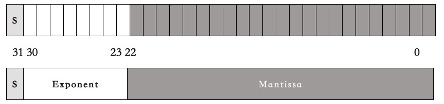
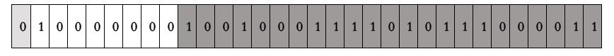
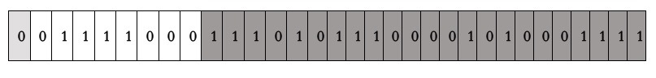
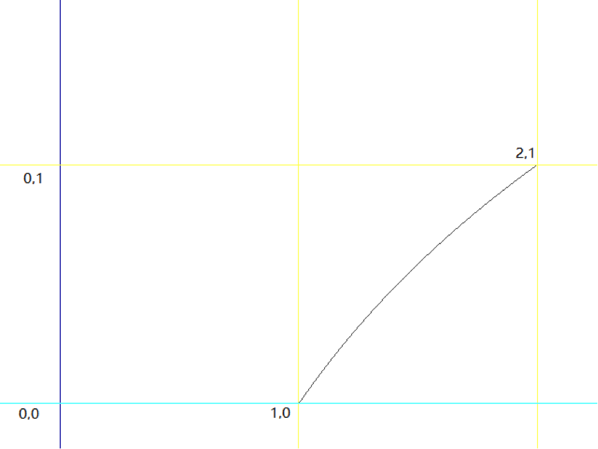
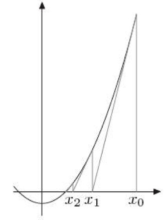

# 13 | 魔数 0x5f3759df
你好，我是陈皓，网名左耳朵耗子。

下列代码是在《雷神之锤III竞技场》源代码中的一个函数（已经剥离了C语言预处理器的指令）。其实，最早在2002年（或2003年）时，这段平方根倒数速算法的代码就已经出现在Usenet与其他论坛上了，并且也在程序员圈子里引起了热烈的讨论。

我先把这段代码贴出来，具体如下：

```c
float Q_rsqrt( float number )
{
    long i;
    float x2, y;
    const float threehalfs = 1.5F;

    x2 = number * 0.5F;
    y  = number;
    i  = * ( long * ) &y; // evil floating point bit level hacking
    i  = 0x5f3759df - ( i >> 1 );  // what the fuck?
    y  = * ( float * ) &i;
    y  = y * ( threehalfs - ( x2 * y * y ) );  // 1st iteration
    // 2nd iteration, this can be removed
    // y  = y * ( threehalfs - ( x2 * y * y ) );

    return y;
}

```

这段代码初读起来，我是完全不知所云，尤其是那个魔数0x5f3759df，根本不知道它是什么意思，所以，注释里也是 What the fuck。今天这节课，我主要就是想带你来了解一下这个函数中的代码究竟是怎样出来的。

其实，这个函数的作用是求平方根倒数，即$x^{-1/2}$，也就是下面这个算式：

$$\\frac{1}{\\sqrt{x}}$$

当然，它算的是近似值。只不过这个近似值的精度很高，而且计算成本比传统的浮点数运算平方根的算法低太多。在以前那个计算资源还不充分的年代，在一些3D游戏场景的计算机图形学中，要求取照明和投影的光照与反射效果，就经常需要计算平方根倒数，而且是大量的计算——对一个曲面上很多的点做平方根倒数的计算。也就是需要用到下面的这个算式，其中的x,y,z是3D坐标上的一个点的三个坐标值。

$$\\frac{1}{\\sqrt{x^{2}+y^{2}+z^{2}}}$$

基本上来说，在一个3D游戏中，我们每秒钟都需要做上百万次平方根倒数运算。而在计算硬件还不成熟的时代，这些计算都需要软件来完成，计算速度非常慢。

我们要知道，在上世纪90年代，多数浮点数操作的速度更是远远滞后于整数操作。所以，这段代码所带来的作用是非常大的。

# 计算机的浮点数表示

为了讲清楚这段代码，我们需要先了解一下计算机的浮点数表示法。在C语言中，计算机的浮点数表示用的是IEEE 754 标准，这个标准的表现形式其实就是把一个32bits分成三段。

- 第一段占1bit，表示符号位。代称为S（sign）。
- 第二段占8bits，表示指数。代称为E（Exponent）。
- 第三段占23bits，表示尾数。代称为M（Mantissa）。

如下图所示：



然后呢，一个小数的计算方式是下面这个算式：

$$(-1)^{S}\\ast(1+\\frac{M}{2^{23}})\\ast 2^{(E-127)}$$

但是，这个算式基本上来说，完全就是让人一头雾水，摸不着门路。对于浮点数的解释基本上就是下面这张漫画里表现的样子。


下面，让我来试着解释一下浮点数的那三段表示什么意思。

- 第一段符号位。对于这一段，我相信应该没有人不能理解。

- 第二段指数位。什么叫指数？也就是说，对于任何数x，其都可以找到一个$n$，使得$2^{n}$<=x<=$2^{n+1}$。比如：对于3来说，因为 2 < 3 < 4，所以 n=1。而浮点数的这个指数为了要表示0.00x的小数，所以需要有负数，这8个bits本来可以表示0-255。为了表示负的，取值要放在 \[-127,128\] 这个区间中。这就是为什么我们在上面的公式中看到的 $2^{(E-127)}$这一项了。也就是说，$n = E-127$，如果$n=1$，那么$E$就是128了。

- 第三段尾数位。也就是小数位，但是这里叫偏移量可能好一些。这里的取值是在\[ 0 - $2^{23}$\]中。你可以认为，我们把一条线分成$2^{23}$个线段，也就是8388608个线段。也就是说，把$2^{n}$到$2^{n+1}$分成了8388608个线段。而存储的M值，就是从$2^n$到 x 要经过多少个段。这要计算一下，$2^{n}$到x的长度占$2^{n}$到$2^{n+1}$长度的比例是多少。


我估计你对第三段还是有点不懂，那么我们来举一个例子。比如说，对3.14这个小数。

- 是正数。所以，S = 0。

- $2^1$ < 3.14 <$2^2$。所以，n=1， n+127 = 128。所以，E=128。

- (3.14 - 2) / (4 - 2) = 0.57， 而$0.57\*2^{23} = 4781506.56$，四舍五入，得到M = 4781507。因为有四舍五入，所以，产生了浮点数据的精度问题。


把S、E、M转成二进制，得到 3.14的二进制表示。



我们再用IEEE 754的那个算式来算一下：

$${(-1)}^0\*({1+\\frac{4781507}{2^{23}}})\*2^{(128-127)}$$

$$=1\*(1+0.5700000524520874)\*2$$

$$=3.1400001049041748046875$$

你看，浮点数的精度问题出现了。

我们再来看一个示例，小数 0.015。

- 是正数。所以，S = 0。

- $2^{-7}< 0.015 < 2^{-6}$ 。所以，n=-7， n+127 = 120。所以，E=120。

- $ (0.015 - 2^{-7}) / (2^{-6} - 2^{-7}) $ = $0.0071875/0.0078125=0.92$。而$0.92 \* 2^{23} = 7717519.36$，四舍五入，得到 M = 7717519。


于是，我们得到0.015的二进制编码：



其中：

- 120 的二进制是01111000
- 7717519的二进制是11101011100001010001111

返回过来算一下：

$$(-1)^{0}\\ast (1+\\frac{7717519}{2^{23}})\\ast 2^{(120-127)}$$

$$=(1+0.919999957084656)\*0.0078125$$

$$=0.014999999664724$$

你看，浮点数的精度问题又出现了。

我们来用C语言验证一下：

```c
int main() {
    float x = 3.14;
    float y = 0.015;
    return 0;
}

```

在我的Mac上用lldb 工具 Debug 一下。

```
(lldb) frame variable
(float) x = 3.1400001
(float) y = 0.0149999997

(lldb) frame variable -f b
(float) x = 0b01000000010010001111010111000011
(float) y = 0b00111100011101011100001010001111

```

从结果上，完全验证了我们的方法。

好了，不知道你看懂了没有？我相信你应该看懂了。

# 简化浮点数公式

因为那个浮点数表示的公式有点复杂，我们简化一下：

$$(-1)^{S}\\ast (1+\\frac{M}{2^{23}})\\ast 2^{(E-127)}$$

我们令，$m = (\\frac{M}{2^{23}} )$，$e = (E-127)$。因为符号位在$y= x^{-\\frac{1}{2}}$的两端都是0（正数），也就可以去掉，所以浮点数的算式简化为：

$$(1+m)\\ast2^{e}$$

上面这个算式是从一个32bits二进制计算出一个浮点数。这个32bits的整型算式是：

$$M+E\\ast2^{23}$$

比如，0.015的32bits的二进制是：00111100011101011100001010001111，也就是整型的：

$$7717519+120\\ast 2^{23}$$

$$= 1014350479$$

$$= 0X3C75C28F$$

# 平方根倒数公式推导

下面，你会看到好多数学公式，但是请你不要怕，因为这些数学公式只需要高中数学就能看懂的。

我们来看一下，平方根数据公式：

$$y=\\frac{1}{\\sqrt\[2\]{x}}=x^{-\\frac{1}{2}}$$

等式两边取以2为基数的对数，就有了：

$$\\log\_2(y) =-\\frac{1}{2}\\log\_2(x)$$

因为我们实际上在算浮点数，所以将公式中的 x 和 y 分别用浮点数的那个浮点数的简化算式$ (1+ m)\*2^e$替换掉。代入$\\log()$公式中，我们也就有了下面的公式：

$$\\log\_{2} (1+m\_y)+e\_y$$

$$=-\\frac{1}{2}(\\log\_2(1+m\_x)+e\_x)$$

因为有对数，这公式看着就很麻烦，似乎不能再简化了。但是，我们知道，所谓的$m\_x$或是$m\_y$，其实是个在0和1区间内的小数。在这种情况下，$\\log\_2 (1.x)$接近一条直线。



那么我们就可以使用一个直线方程来代替，也就是：

$$\\log\_{2}(1+m)\\approx m+\\sigma $$

于是，我们的公式就简化成了：

$$m\_y+\\sigma+e\_y\\approx-\\frac{1}{2}(m\_x+\\sigma+e\_x)$$

因为$m = (\\frac{M}{2^{23}})$，$e = (E-127)$，代入公式，得到：

$$\\frac{M\_y}{2^{23}}+\\sigma+E\_y-127$$

$$\\approx-\\frac{1}{2}(\\frac{M\_x}{2^{23}}+\\sigma+E\_x-127)$$

移项整理一下，把 σ 和127 从左边，移到右边：

$$\\frac{M\_y}{2^{23}}+E\_y\\approx-\\frac{1}{2}(\\frac{M\_x}{2^{23}}+E\_x)-\\frac{3}{2}(\\sigma-127)$$

再把整个表达式乘以$2^{23}$，得到：

$${M\_y}+E\_y{2^{23}}$$

$$\\approx-\\frac{1}{2}(M\_x+E\_x{2^{23}})-\\frac{3}{2}(\\sigma-127){2^{23}}$$

可以看到一个常数：$-\\frac{3}{2}(\\sigma-127){2^{23}}$，把负号放进括号里，变成$\\frac{3}{2}(127-\\sigma){2^{23}}$，并可以用一个常量代数R来取代，于是得到公式：

$${M\_y}+E\_y{2^{23}}\\approx R-\\frac{1}{2}(M\_x+E\_x{2^{23}})$$

还记得我们前面那个“浮点数32bits二进制整型算式” $M+E\* 2^{23}$吗？假设，浮点数x的32bits的整型公式是：$I\_x= M\_x+ E\_x 2^{23}$，那么上面的公式就可以写成：

$$I\_y\\approx R-\\frac{1}{2}I\_x$$

# 代码分析

让我们回到文章的主题，那个平方根函数的代码。

首先是：

```
i  = * ( long * ) &y; // evil floating point bit level hacking

```

这行代码就是把一个浮点数的32bits的二进制转成整型。也就是，前面我们例子里说过的，3.14的32bits的二进制是：01000000010010001111010111000011，整型是：1078523331。即y = 3.14，i = 1078523331。

然后是：

```
i  = 0x5f3759df - ( i >> 1 );  // what the fuck?

```

这就是：

```
i  = 0x5f3759df - ( i / 2 );

```

也就是我们上面推导出来的那个公式：

$$I\_y\\approx R-\\frac{1}{2}I\_x$$

代码里的 R = 0x5f3759df。

我们又知道，R = $\\frac{3}{2}(127-\\sigma){2^{23}}$，把代码中的那个魔数代入，就可以计算出来：σ= 0.0450465 。这个数是个神奇的数字，这个数是怎么算出来的，现在还没人知道。不过，我们先往下看后面的代码：

```
    x2 = number * 0.5F;
    y  = * ( float * ) &i;
    y  = y * ( threehalfs - ( x2 * y * y ) );  // 1st iteration
    // 2nd iteration, this can be removed
    // y  = y * ( threehalfs - ( x2 * y * y ) );

```

这段代码相当于下面这个公式：

$$I\_{y’} = I\_y(1.5-0.5 x I\_y^2)$$

这个其实是“牛顿求根法”，这是一个为了找到一个 f(x)= 0 的根而用一种不断逼近的计算方式。请看下图：



首先，初始值为X0，然后找到X0所对应的Y0（把X0代入公式得到Y0 = f(X0)），然后在（X0,Y0）这个点上做一个切线，得到与X轴交汇的X1。再用X1做一次上述的迭代，得到X2，就这样一直迭代下去，一直找到，y = 0时，x的值。

牛顿法的通用公式是：

$$x\_{n+1}=x\_n-\\frac{f(x\_n)}{f’(x\_n)}$$

于是，对于$y= \\frac{1}{\\sqrt{x}}$来说，对固定的x（常数），我们求y使得$\\frac{1}{y^2}-x=0$，$f(y)= \\frac{1}{y^2} -x$ , $f’(y)=\\frac{-2}{y^3}$ 。 注意：$f’(y)$是$f(y)$关于y的导数。

代入上述的牛顿法的通用公式后得到：

$$y\_{n+1}=y\_n-\\frac{\\frac{1}{y\_n^2}-x}{\\frac{-2}{y\_n^3}}$$

$$=\\frac{y\_n(3-xy\_n^2)}{2}=y\_n(1.5-0.5xy\_n^2)$$

正好就是我们上面的代码。

整个代码是，之前生成的整数操作产生首次近似值后，将首次近似值作为参数送入函数最后两句进行精化处理。代码中的两次迭代正是为了进一步提高结果的精度。但由于《雷神之锤III》的图形计算中并不需要太高的精度，所以代码中只进行了一次迭代，二次迭代的代码则被注释了。

# 相关历史

根据Wikipedia上的描述，《雷神之锤III》的代码直到QuakeCon 2005才正式放出，但早在2002年（或2003年）时，平方根倒数速算法的代码就已经出现在Usenet和其他论坛上了。最初人们猜测是《雷神之锤》的创始人John Carmack写下了这段代码，但他在回复询问他的邮件时否定了这个观点，并猜测可能是先前曾帮id Software优化《雷神之锤》的资深汇编程序员Terje Mathisen写下了这段代码。

而Mathisen的邮件里表示，在1990年代初，他只曾做过类似的实现，确切来说这段代码亦非他所作。现在所知的最早实现是由Gary Tarolli在SGI Indigo中实现的，但他亦坦承他仅对常数R的取值做了一定的改进，实际上他也不是作者。

在向以发明MATLAB而闻名的Cleve Moler查证后，Rys Sommefeldt则认为原始的算法是Ardent Computer公司的Greg Walsh所发明的，但他也没有任何确定性的证据能证明这一点。

不仅该算法的原作者不明，人们也仍无法确定当初选择这个“魔术数字”的方法。Chris Lomont曾做了个研究：他推算出了一个函数以讨论此速算法的误差，并找出了使误差最小的最佳R值0x5f37642f（与代码中使用的0x5f3759df相当接近）。但以之代入算法计算并进行一次牛顿迭代后，所得近似值之精度仍略低于代入0x5f3759df的结果。

因此，Lomont将目标改为查找在进行1-2次牛顿迭代后能得到最大精度的R值，在暴力搜索后得出最优R值为0x5f375a86，以此值代入算法并进行牛顿迭代，所得的结果都比代入原始值（0x5f3759df）更精确。于是他说，“如果可能我想询问原作者，此速算法是以数学推导还是以反复试错的方式求出来的？”

Lomont亦指出，64位的IEEE754浮点数（即双精度类型）所对应的魔术数字是0x5fe6ec85e7de30da。但后来的研究表明，代入0x5fe6eb50c7aa19f9的结果精确度更高（McEniry得出的结果则是0x5fe6eb50c7b537aa，精度介于两者之间）。

后来Charles McEniry使用了一种类似Lomont但更复杂的方法来优化R值。他最开始使用穷举搜索，所得结果与Lomont相同。而后他尝试用带权二分法寻找最优值，所得结果恰是代码中所使用的魔术数字0x5f3759df。因此，McEniry认为，这一常数最初或许便是以“在可容忍误差范围内使用二分法”的方式求得。

这可能是编程世界里最经典的魔数的故事，希望你能够从这节课中收获一些数学的基础知识。数学真是需要努力学习好的一门功课，尤其在人工智能火热的今天。