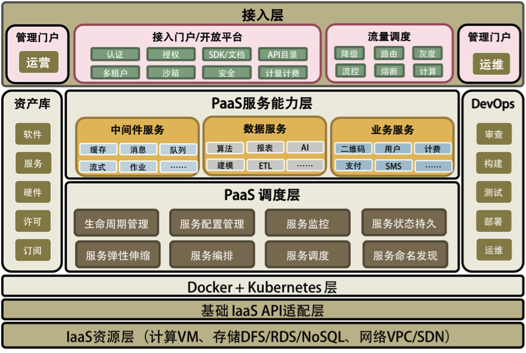

# 27 | 洞悉PaaS平台的本质
你好，我是陈皓，网名左耳朵耗子。

在了解了前面几篇文章中提的这些问题以后，我们需要思考一下该怎样解决这些问题。为了解决这些问题，请先允许我来谈谈软件工程的本质。

我认为，一家商业公司的软件工程能力主要体现在三个地方。

**第一，提高服务的SLA。**

所谓服务的SLA，也就是我们能提供多少个9的系统可用性，而每提高一个9的可用性都是对整个系统架构的重新洗礼。在我看来，提高系统的SLA主要表现在两个方面：

- 高可用的系统；
- 自动化的运维。

你可以看一下我在CoolShell上写的《 [关于高可用系统](https://coolshell.cn/articles/17459.html)》这篇文章，它主要讲了构建高可用的系统需要使用的分布式系统设计思路。然而这还不够，我们还需要一个高度自动化的运维和管理系统，因为故障是常态，如果没有自动化的故障恢复，就很难提高服务的SLA。

**第二，能力和资源重用或复用。**

软件工程还有一个重要的能力就是让能力和资源可以重用。其主要表现在如下两个方面：

- 软件模块的重用；
- 软件运行环境和资源的重用。

为此，需要我们有两个重要的能力：一个是“软件抽象的能力”，另一个是“软件标准化的能力”。你可以认为软件抽象就是找出通用的软件模块或服务，软件标准化就是使用统一的软件通讯协议、统一的开发和运维管理方法……这样能让整体软件开发运维的能力和资源得到最大程度的复用，从而增加效率。

**第三，过程的自动化。**

编程本来就是把一个重复工作自动化的过程，所以， **软件工程的第三个本质就是把软件生产和运维的过程自动化起来**。也就是下面这两个方面：

- 软件生产流水线；
- 软件运维自动化。

为此，我们除了需要CI/CD的DevOps式的自动化之外，也需要能够对正在运行的生产环境中的软件进行自动化运维。

通过了解软件工程的这三个本质，你会发现，我们上面所说的那些分布式的技术点是高度一致的，也就是下面这三个方面的能力。（是的，世界就是这样的。当参透了本质之后，你会发现世界是大同的。）

- 分布式多层的系统架构。
- 服务化的能力供应。
- 自动化的运维能力。

只有做到了这些，我们才能够真正拥有云计算的威力。这就是所谓的Cloud Native。而这些目标都完美地体现在PaaS平台上。

前面讲述的分布式系统关键技术和软件工程的本质，都可以在PaaS平台上得到完全体现。所以，需要一个PaaS平台把那么多的东西给串联起来。这里，我结合自己的认知给你讲一下PaaS相关的东西，并把前面讲过的所有东西做一个总结。

# PaaS平台的本质

一个好的PaaS平台应该具有分布式、服务化、自动化部署、高可用、敏捷以及分层开放的特征，并可与IaaS实现良好的联动。

下面这三件事是PaaS跟传统中间件最大的差别。

- **服务化是PaaS的本质**。软件模块重用，服务治理，对外提供能力是PaaS的本质。
- **分布式是PaaS的根本特性**。多租户隔离、高可用、服务编排是PaaS的基本特性。
- **自动化是PaaS的灵魂**。自动化部署安装运维，自动化伸缩调度是PaaS的关键。

## PaaS平台的总体架构

从下面的图中可以看到，我用了Docker+Kubernetes层来做了一个“技术缓冲层”。也就是说，如果没有Docker和Kubernetes，构建PaaS将会复杂很多。当然，如果你正在开发一个类似PaaS的平台，那么你会发现自己开发出来的东西会跟Docker和Kubernetes非常像。相信我，最终你还是会放弃自己的轮子而采用Docker+Kubernetes的。

在Docker+Kubernetes层之上，我们看到了两个相关的PaaS层。一个是PaaS调度层，很多人将其称为iPaaS；另一个是PaaS能力层，通常被称为aPaaS。没有PaaS调度层，PaaS能力层很难被管理和运维，而没有PaaS能力层，PaaS就失去了提供实际能力的业务价值。而本文更多的是在讲PaaS调度层上的东西。

在两个相关的PaaS层之上，有一个流量调度的接入模块，这也是PaaS中非常关键的东西。流控、路由、降级、灰度、聚合、串联等等都在这里，包括最新的AWS Lambda Service的小函数等也可以放在这里。这个模块应该是像CDN那样来部署的。

然后，在这个图的两边分别是与运营和运维相关的。运营这边主要是管理一些软件资源方面的东西（类似Docker Hub和CMDB），以及外部接入和开放平台上的东西，这主要是对外提供能力的相关组件；而运维这边主要是对内的相关东西，主要就是DevOps。

总结一下，一个完整的PaaS平台会包括以下几部分。

- PaaS调度层 – 主要是PaaS的自动化和分布式对于高可用高性能的管理。
- PaaS能力服务层 – 主要是PaaS真正提供给用户的服务和能力。
- PaaS的流量调度 – 主要是与流量调度相关的东西，包括对高并发的管理。
- PaaS的运营管理 – 软件资源库、软件接入、认证和开放平台门户。
- PaaS的运维管理 – 主要是DevOps相关的东西。

因为我画的是一个大而全的东西，所以看上去似乎很重很复杂。实际上，其中的很多组件是可以根据自己的需求被简化和裁剪的，而且很多开源软件能帮你简化好多工作。虽然构建PaaS平台看上去很麻烦，但是其实并不是很复杂，不要被我吓到了。哈哈。

## PaaS平台的生产和运维

下面的图我给出了一个大概的软件生产、运维和服务接入的流程，它把之前的东西都串起来了。

从左上开始软件构建，进入软件资产库（Docker Registry+一些软件的定义），然后走DevOps的流程，通过整体架构控制器进入生产环境，生产环境通过控制器操作Docker+Kubernetes集群进行软件部署和生产变更。

其中，同步服务的运行状态，并通过生命周期管理来拟合状态，如图右侧部分所示。服务运行时的数据会进入到相关应用监控，应用监控中的一些监控事件会同步到生命周期管理中，再由生命周期管理器来做出决定，通过控制器来调度服务运行。当应用监控中心发现流量变化，要进行强制性伸缩时，它通过生命周期管理来通知控制系统进行伸缩。

左下是服务接入的相关组件，主要是网关服务，以及API聚合编排和流程处理。这对应于之前说过的流量调度和API Gateway的相关功能。

# 总结

恭喜你，已经学完了《分布式系统架构的本质》系列课程的7讲内容。下面，我们对这些内容做一下总结。

传统的单体架构系统容量显然是有上限的。同时，为了应对有计划和无计划的下线时间，系统的可用性也是有其极限的。分布式系统为以上两个问题提供了解决方案，并且还附带有其他优势。但是，要同时解决这两个问题绝非易事。为了构建分布式系统，我们面临的主要问题如下。

- 分布式系统的硬件故障发生率更高，故障发生是常态，需要尽可能地将运维流程自动化。
- 需要良好地设计服务，避免某服务的单点故障对依赖它的其他服务造成大面积影响。
- 为了容量的可伸缩性，服务的拆分、自治和无状态变得更加重要，可能需要对老的软件逻辑做大的修改。
- 老的服务可能是异构的，此时需要让它们使用标准的协议，以便可以被调度、编排，且互相之间可以通信。
- 服务软件故障的处理也变得复杂，需要优化的流程，以加快故障的恢复。
- 为了管理各个服务的容量，让分布式系统发挥出最佳性能，需要有流量调度技术。
- 分布式存储会让事务处理变得复杂；在事务遇到故障无法被自动恢复的情况下，手动恢复流程也会变得复杂。
- 测试和查错的复杂度增大。
- 系统的吞吐量会变大，但响应时间会变长。

为了解决这些问题，我们深入了解了以下这些解决方案。

- 需要有完善的监控系统，以便对服务运行状态有全面的了解。
- 设计服务时要分析其依赖链；当非关键服务故障时，其他服务要自动降级功能，避免调用该服务。
- 重构老的软件，使其能被服务化；可以参考SOA和微服务的设计方式，目标是微服务化；使用Docker和Kubernetes来调度服务。
- 为老的服务编写接口逻辑来使用标准协议，或在必要时重构老的服务以使得它们有这些功能。
- 自动构建服务的依赖地图，并引入好的处理流程，让团队能以最快速度定位和恢复故障，详见《故障处理最佳实践：应对故障》一讲。
- 使用一个API Gateway，它具备服务流向控制、流量控制和管理的功能。
- 事务处理建议在存储层实现；根据业务需求，或者降级使用更简单、吞吐量更大的最终一致性方案，或者通过二阶段提交、Paxos、Raft、NWR等方案之一，使用吞吐量小的强一致性方案。
- 通过更真实地模拟生产环境，乃至在生产环境中做灰度发布，从而增加测试强度；同时做充分的单元测试和集成测试以发现和消除缺陷；最后，在服务故障发生时，相关的多个团队同时上线自查服务状态，以最快地定位故障原因。
- 通过异步调用来减少对短响应时间的依赖；对关键服务提供专属硬件资源，并优化软件逻辑以缩短响应时间。

你已经看到，解决分布式服务的吞吐量和可用性问题不是件容易的事，以及目前的主流技术是怎么办到的。衍生出来的许多子问题，每一个都值得去细化、去研究其解决方案。这已经超出本节课的篇幅所能及的了，但的确都是值得我们做技术的人去深入思考的。

在这里，我想邀请你来讨论一下，你在分布式系统的哪个领域研究得比较深？有什么独特的心得能与我们分享？期待你的留言。

这一讲的最后给出了《分布式系统架构的本质》系列课程的目录，方便你查找自己关注的内容。

- [分布式系统架构的冰与火](https://time.geekbang.org/column/article/1411)
- [从亚马逊的实践，谈分布式系统的难点](https://time.geekbang.org/column/article/1505)
- [分布式系统的技术栈](https://time.geekbang.org/column/article/1512)
- [分布式系统关键技术：全栈监控](https://time.geekbang.org/column/article/1513)
- [分布式系统关键技术：服务调度](https://time.geekbang.org/column/article/1604)
- [分布式系统关键技术：流量与数据调度](https://time.geekbang.org/column/article/1609)
- [洞悉PaaS平台的本质](https://time.geekbang.org/column/article/1610)
- [推荐阅读：分布式系统架构经典资料](https://time.geekbang.org/column/article/2080)
- [推荐阅读：分布式数据调度相关论文](https://time.geekbang.org/column/article/2421)