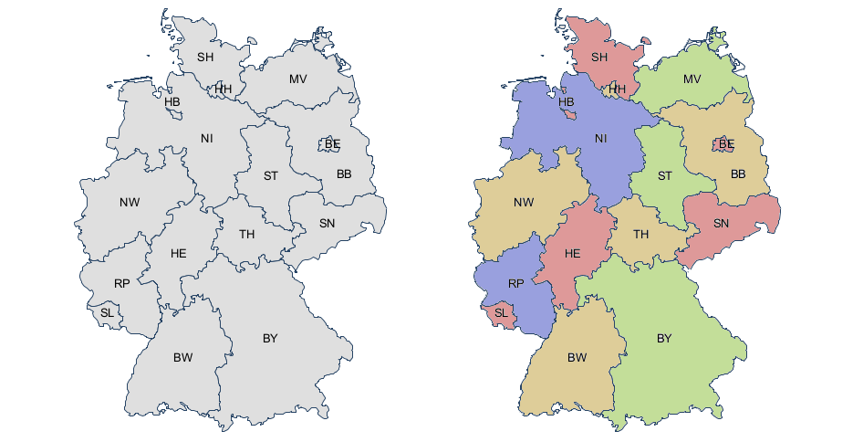

# 39 | 编程范式游记（10）- 逻辑编程范式
你好，我是陈皓，网名左耳朵耗子。

这节课重点介绍Prolog语言。Prolog（Programming in Logic）是一种逻辑编程语言，它创建在逻辑学的理论基础之上，最初被运用于自然语言等研究领域。现在它已被广泛地应用在人工智能的研究中，可以用来建造专家系统、自然语言理解、智能知识库等。

Prolog语言最早由艾克斯马赛大学（Aix-Marseille University）的Alain Colmerauer与Philippe Roussel等人于20世纪60年代末研究开发的。1972年被公认为是Prolog语言正式诞生的年份，自1972年以后，分支出多种Prolog的方言。

最主要的两种方言为Edinburgh和Aix-Marseille。最早的Prolog解释器由Roussel建造，而第一个Prolog编译器则是David Warren编写的。

Prolog一直在北美和欧洲被广泛使用。日本政府曾经为了建造智能计算机而用Prolog来开发ICOT第五代计算机系统。在早期的机器智能研究领域，Prolog曾经是主要的开发工具。

20世纪80年代Borland开发的Turbo Prolog，进一步普及了Prolog的使用。1995年确定了ISO Prolog标准。

有别于一般的函数式语言，Prolog的程序是基于谓词逻辑的理论。最基本的写法是定立对象与对象之间的关系，之后可以用询问目标的方式来查询各种对象之间的关系。系统会自动进行匹配及回溯，找出所询问的答案。

Prolog代码中以大写字母开头的元素是变量，字符串、数字或以小写字母开头的元素是常量，下划线（\_）被称为匿名变量。

# Prolog的语言特征

逻辑编程是靠推理，比如下面的示例：

```
program mortal(X) :- philosopher(X).

philosopher(Socrates).
philosopher(Plato).
philosopher(Aristotle).

mortal_report:-
write('Known mortals are:'), nl, mortal(X),
write(X),nl,
fail.

```

我们可以看到下面的几个步骤。

1. 先定义一个规则：哲学家是人类。
2. 然后陈述事实：苏格拉底、亚里士多德、柏拉图都是哲学家。
3. 然后，我们问，谁是人类？于是就会输出苏格拉底、亚里士多德、柏拉图。

下面是逻辑编程范式的几个特征。

- 逻辑编程的要点是将正规的逻辑风格带入计算机程序设计之中。
- 逻辑编程建立了描述一个问题里的世界的逻辑模型。
- 逻辑编程的目标是对它的模型建立新的陈述。
- 通过陈述事实——因果关系。
- 程序自动推导出相关的逻辑。

# 经典问题：地图着色问题

我们再来看一个经典的四色地图问题。任何一个地图，相邻区域不能用相同颜色，只要用四种不同的颜色就够了。



首先，定义四种颜色。

```
color(red).
color(green).
color(blue).
color(yellow).

```

然后，定义一个规则：相邻的两个地区不能用相同的颜色。

```
neighbor(StateAColor, StateBColor) :- color(StateAColor), color(StateBColor),
    StateAColor \= StateBColor. /* \= is the not equal operator */

```

最前面的两个条件： `color(StateAColor)` 和 `color(StateBColor)` 表明了两个变量 `StateAColor` 和 `StateBColor`。然后，第三个条件： `StateAColor \= StateBColor` 表示颜色不能相同。

接下来的事就比较简单了。我们描述事实就好了，描述哪些区域是相邻的事实。

比如，下面描述了 BW 和 BY 是相邻的。

`germany(BW, BY) :- neighbor(BW, BY).`

下面则描述多个区 BW、 BY、 SL、 RP、 和 ND 的相邻关系：

`germany(BW, BY, SL, RP, HE) :- neighbor(BW, BY), neighbor(BW, RP), neighbor(BW, HE).`

于是，我们就可以描述整个德国地图的相邻关系了。

```
germany(SH, MV, HH, HB, NI, ST, BE, BB, SN, NW, HE, TH, RP, SL, BW, BY) :-
neighbor(SH, NI), neighbor(SH, HH), neighbor(SH, MV),
neighbor(HH, NI),
neighbor(MV, NI), neighbor(MV, BB),
neighbor(NI, HB), neighbor(NI, BB), neighbor(NI, ST), neighbor(NI, TH),
neighbor(NI, HE), neighbor(NI, NW),
neighbor(ST, BB), neighbor(ST, SN), neighbor(ST, TH),
neighbor(BB, BE), neighbor(BB, SN),
neighbor(NW, HE), neighbor(NW, RP),
neighbor(SN, TH), neighbor(SN, BY),
neighbor(RP, SL), neighbor(RP, HE), neighbor(RP, BW),
neighbor(HE, BW), neighbor(HE, TH), neighbor(HE, BY),
neighbor(TH, BY),
neighbor(BW, BY).

```

最后，我们使用如下语句，就可以让Prolog推导到各个地区的颜色。

```
?- germany(SH, MV, HH, HB, NI, ST, BE, BB, SN, NW, HE, TH, RP, SL, BW, BY).

```

# 小结

Prolog这种逻辑编程，把业务逻辑或是说算法抽象成只关心规则、事实和问题的推导这样的标准方式，不需要关心程序控制，也不需要关心具体的实现算法。只需要给出可以用于推导的规则和相关的事实，问题就可以被通过逻辑推导来解决掉。是不是很有意思，也很好玩？

如果有兴趣，你可以学习一下，这里推荐两个学习资源：

- [Prolog Tutorial](http://www.doc.gold.ac.uk/~mas02gw/prolog_tutorial/prologpages/)
- [Learn Prolog Now!](http://www.learnprolognow.org)

以下是《编程范式游记》系列文章的目录，方便你了解这一系列内容的全貌。

- [01 \| 编程范式游记：起源](https://time.geekbang.org/column/article/301)
- [02 \| 编程范式游记：泛型编程](https://time.geekbang.org/column/article/303)
- [03 \| 编程范式游记：类型系统和泛型的本质](https://time.geekbang.org/column/article/2017)
- [04 \| 编程范式游记：函数式编程](https://time.geekbang.org/column/article/2711)
- [05 \| 编程范式游记：修饰器模式](https://time.geekbang.org/column/article/2723)
- [06 \| 编程范式游记：面向对象编程](https://time.geekbang.org/column/article/2729)
- [07 \| 编程范式游记：基于原型的编程范式](https://time.geekbang.org/column/article/2741)
- [08 \| 编程范式游记：Go 语言的委托模式](https://time.geekbang.org/column/article/2748)
- [09 \| 编程范式游记：编程的本质](https://time.geekbang.org/column/article/2751)
- [10 \| 编程范式游记：逻辑编程范式](https://time.geekbang.org/column/article/2752)
- [11 \| 编程范式游记：程序世界里的编程范式](https://time.geekbang.org/column/article/2754)