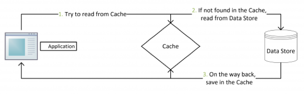
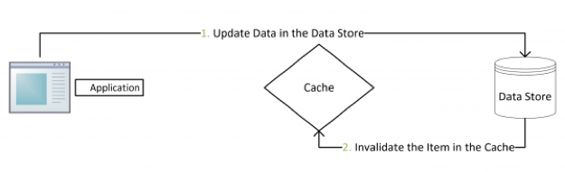
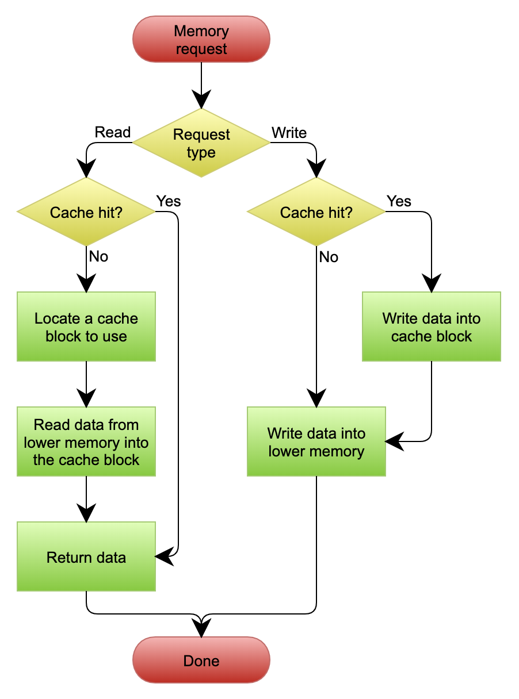
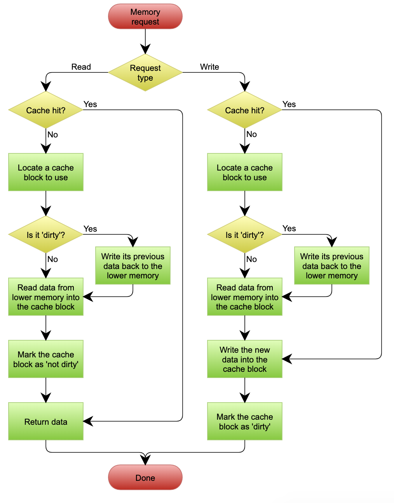

# 58 | 性能设计篇之“缓存”
你好，我是陈皓，网名左耳朵耗子。

前面分享了《分布式系统设计模式》系列文章的前两部分——弹力设计篇和管理设计篇。今天开始这一系列的最后一部分内容——性能设计篇，主题为《性能设计篇之“缓存”》。

基本上来说，在分布式系统中最耗性能的地方就是最后端的数据库了。一般来说，只要小心维护好，数据库四种操作（select、update、insert和delete）中的三个写操作insert、update和delete不太会出现性能问题（insert一般不会有性能问题，update和delete一般会有主键，所以也不会太慢）。除非索引建得太多，而数据库里的数据又太多，这三个操作才会变慢。

绝大多数情况下，select是出现性能问题最大的地方。一方面，select会有很多像join、group、order、like等这样丰富的语义，而这些语义是非常耗性能的；另一方面，大多数应用都是读多写少，所以加剧了慢查询的问题。

分布式系统中远程调用也会消耗很多资源，因为网络开销会导致整体的响应时间下降。为了挽救这样的性能开销，在业务允许的情况（不需要太实时的数据）下，使用缓存是非常必要的事情。

从另一个方面说，缓存在今天的移动互联网中是必不可少的一部分，因为网络质量不一定永远是最好的，所以前端也会为所有的API加上缓存。不然，网络不通畅的时候，没有数据，前端都不知道怎么展示UI了。既然因为移动互联网的网络质量而导致我们必须容忍数据的不实时性，那么，从业务上来说，在大多数情况下是可以使用缓存的。

缓存是提高性能最好的方式，一般来说，缓存有以下三种模式。

# Cache Aside 更新模式

这是最常用的设计模式了，其具体逻辑如下。

- **失效**：应用程序先从Cache取数据，如果没有得到，则从数据库中取数据，成功后，放到缓存中。
- **命中**：应用程序从Cache中取数据，取到后返回。
- **更新**：先把数据存到数据库中，成功后，再让缓存失效。

这是标准的设计模式，包括Facebook的论文《 [Scaling Memcache at Facebook](https://www.usenix.org/system/files/conference/nsdi13/nsdi13-final170_update.pdf)》中也使用了这个策略。为什么不是写完数据库后更新缓存？你可以看一下Quora上的这个问答《 [Why does Facebook use delete to remove the key-value pair in Memcached instead of updating the Memcached during write request to the backend?](https://www.quora.com/Why-does-Facebook-use-delete-to-remove-the-key-value-pair-in-Memcached-instead-of-updating-the-Memcached-during-write-request-to-the-backend)》，主要是怕两个并发的写操作导致脏数据。

那么，是不是这个Cache Aside就不会有并发问题了？不是的。比如，一个是读操作，但是没有命中缓存，就会到数据库中取数据。而此时来了一个写操作，写完数据库后，让缓存失效，然后之前的那个读操作再把老的数据放进去，所以会造成脏数据。

这个案例理论上会出现，但实际上出现的概率可能非常低，因为这个条件需要发生在读缓存时缓存失效，而且有一个并发的写操作。实际上数据库的写操作会比读操作慢得多，而且还要锁表，读操作必须在写操作前进入数据库操作，又要晚于写操作更新缓存，所有这些条件都具备的概率并不大。

**所以，这也就是Quora上的那个答案里说的，要么通过2PC或是Paxos协议保证一致性，要么就是拼命地降低并发时脏数据的概率。而Facebook使用了这个降低概率的玩法，因为2PC太慢，而Paxos太复杂。当然，最好还是为缓存设置好过期时间。**

# Read/Write Through 更新模式

我们可以看到，在上面的Cache Aside套路中，应用代码需要维护两个数据存储，一个是缓存（cache），一个是数据库（repository）。所以，应用程序比较啰嗦。而Read/Write Through套路是把更新数据库（repository）的操作由缓存自己代理了，所以，对于应用层来说，就简单很多了。可以理解为，应用认为后端就是一个单一的存储，而存储自己维护自己的Cache。

## Read Through

Read Through套路就是在查询操作中更新缓存，也就是说，当缓存失效的时候（过期或LRU换出），Cache Aside是由调用方负责把数据加载入缓存，而Read Through则用缓存服务自己来加载，从而对应用方是透明的。

## Write Through

Write Through套路和Read Through相仿，不过是在更新数据时发生。当有数据更新的时候，如果没有命中缓存，直接更新数据库，然后返回。如果命中了缓存，则更新缓存，然后由Cache自己更新数据库（这是一个同步操作）。

下图来自Wikipedia的Cache词条。其中的Memory，你可以理解为就是我们例子里的数据库。

# Write Behind Caching 更新模式

Write Behind又叫Write Back。一些了解Linux操作系统内核的同学对write back应该非常熟悉，这不就是Linux文件系统的page cache算法吗？是的，你看基础知识全都是相通的。所以，基础很重要，我已经说过不止一次了。

Write Back套路就是，在更新数据的时候，只更新缓存，不更新数据库，而我们的缓存会异步地批量更新数据库。这个设计的好处就是让数据的I/O操作飞快无比（因为直接操作内存嘛）。因为异步，Write Back还可以合并对同一个数据的多次操作，所以性能的提高是相当可观的。

但其带来的问题是，数据不是强一致性的，而且可能会丢失（我们知道Unix/Linux非正常关机会导致数据丢失，就是因为这个事）。在软件设计上，我们基本上不可能做出一个没有缺陷的设计，就像算法设计中的时间换空间、空间换时间一个道理。有时候，强一致性和高性能，高可用和高性能是有冲突的。软件设计从来都是trade-off（取舍）。

另外，Write Back实现逻辑比较复杂，因为它需要track有哪些数据是被更新了的，需要刷到持久层上。操作系统的Write Back会在仅当这个Cache需要失效的时候，才会把它真正持久起来。比如，内存不够了，或是进程退出了等情况，这又叫lazy write。

在Wikipedia上有一张Write Back的流程图，基本逻辑可以在下图中看到。

# 缓存设计的重点

缓存更新的模式基本如前面所说，不过这还没完，缓存已经成为高并发高性能架构的一个关键组件了。现在，很多公司都在用Redis来搭建他们的缓存系统。一方面是因为Redis的数据结构比较丰富。另一方面，我们不能在Service内放Local Cache，一是每台机器的内存不够大，二是我们的Service有多个实例，负载均衡器会把请求随机分布到不同的实例。缓存需要在所有的Service 实例上都建好，这让我们的Service有了状态，更难管理了。

所以，在分布式架构下，一般都需要一个外部的缓存集群。关于这个缓存集群，你需要保证的是内存要足够大，网络带宽也要好，因为缓存本质上是个内存和IO密集型的应用。

另外，如果需要内存很大，那么你还要动用数据分片技术来把不同的缓存分布到不同的机器上。这样，可以保证我们的缓存集群可以不断地scale下去。关于数据分片的事，我会在后面讲述。

缓存的好坏要看命中率。缓存的命中率高说明缓存有效，一般来说命中率到80%以上就算很高了。当然，有的网络为了追求更高的性能，要做到95%以上，甚至可能会把数据库里的数据几乎全部装进缓存中。这当然是不必要的，也是没有效率的，因为通常来说，热点数据只会是少数。

另外，缓存是通过牺牲强一致性来提高性能的，这世上任何事情都不是免费的，所以并不是所有的业务都适合用缓存，这需要在设计的时候仔细调研好需求。使用缓存提高性能，就是会有数据更新的延迟。

缓存数据的时间周期也需要好好设计，太长太短都不好，过期期限不宜太短，因为可能导致应用程序不断从数据存储检索数据并将其添加到缓存。同样，过期期限不宜太长，因为这会导致一些没人访问的数据还在内存中不过期，而浪费内存。

使用缓存的时候，一般会使用LRU策略。也就是说，当内存不够需要有数据被清出内存时，会找最不活跃的数据清除。所谓最不活跃的意思是最长时间没有被访问过了。所以，开启LRU策略会让缓存在每个数据访问的时候把其调到前面，而要淘汰数据时，就从最后面开始淘汰。

于是，对于LRU的缓存系统来说，其需要在key-value这样的非顺序的数据结构中维护一个顺序的数据结构，并在读缓存时，需要改变被访问数据在顺序结构中的排位。于是，我们的LRU在读写时都需要加锁（除非是单线程无并发），因此LRU可能会导致更慢的缓存存取的时间。这点要小心。

最后，我们的世界是比较复杂的，很多网站都会被爬虫爬，要小心这些爬虫。因为这些爬虫可能会爬到一些很古老的数据，而程序会把这些数据加入到缓存中去，而导致缓存中那些真实的热点数据被挤出去（因为机器的速度足够快）。对此，一般来说，我们需要有一个爬虫保护机制，或是我们引导这些人去使用我们提供的外部API。在那边，我们可以有针对性地做多租户的缓存系统（也就是说，把用户和第三方开发者的缓存系统分离开来）。

# 小结

好了，我们来总结一下今天分享的主要内容。首先，缓存是为了加速数据访问，在数据库之上添加的一层机制。然后，我讲了几种典型的缓存模式，包括Cache Aside、Read/Write Through和Write Behind Caching以及它们各自的优缺点。

最后，我介绍了缓存设计的重点，除了性能之外，在分布式架构下和公网环境下，对缓存集群、一致性、LRU的锁竞争、爬虫等多方面都需要考虑。下节课，我们讲述异步处理。希望对你有帮助。

也欢迎你分享一下你接触到的缓存方式有哪些？怎样权衡一致性和缓存的效率？

文末给出了《分布式系统设计模式》系列文章的目录，希望你能在这个列表里找到自己感兴趣的内容。

- 弹力设计篇
  - [认识故障和弹力设计](https://time.geekbang.org/column/article/3912)
  - [隔离设计Bulkheads](https://time.geekbang.org/column/article/3917)
  - [异步通讯设计Asynchronous](https://time.geekbang.org/column/article/3926)
  - [幂等性设计Idempotency](https://time.geekbang.org/column/article/4050)
  - [服务的状态State](https://time.geekbang.org/column/article/4086)
  - [补偿事务Compensating Transaction](https://time.geekbang.org/column/article/4087)
  - [重试设计Retry](https://time.geekbang.org/column/article/4121)
  - [熔断设计Circuit Breaker](https://time.geekbang.org/column/article/4241)
  - [限流设计Throttle](https://time.geekbang.org/column/article/4245)
  - [降级设计degradation](https://time.geekbang.org/column/article/4252)
  - [弹力设计总结](https://time.geekbang.org/column/article/4253)
- 管理设计篇
  - [分布式锁Distributed Lock](https://time.geekbang.org/column/article/5175)
  - [配置中心Configuration Management](https://time.geekbang.org/column/article/5819)
  - [边车模式Sidecar](https://time.geekbang.org/column/article/5909)
  - [服务网格Service Mesh](https://time.geekbang.org/column/article/5920)
  - [网关模式Gateway](https://time.geekbang.org/column/article/6086)
  - [部署升级策略](https://time.geekbang.org/column/article/6283)
- 性能设计篇
  - [缓存Cache](https://time.geekbang.org/column/article/6282)
  - [异步处理Asynchronous](https://time.geekbang.org/column/article/7036)
  - [数据库扩展](https://time.geekbang.org/column/article/7045)
  - [秒杀Flash Sales](https://time.geekbang.org/column/article/7047)
  - [边缘计算Edge Computing](https://time.geekbang.org/column/article/7086)