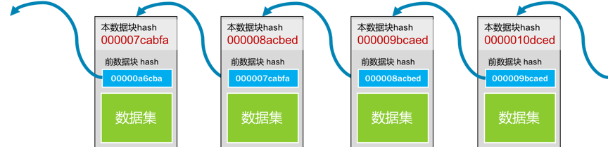
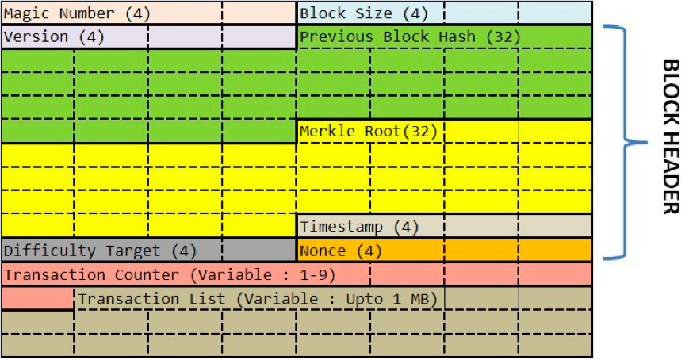
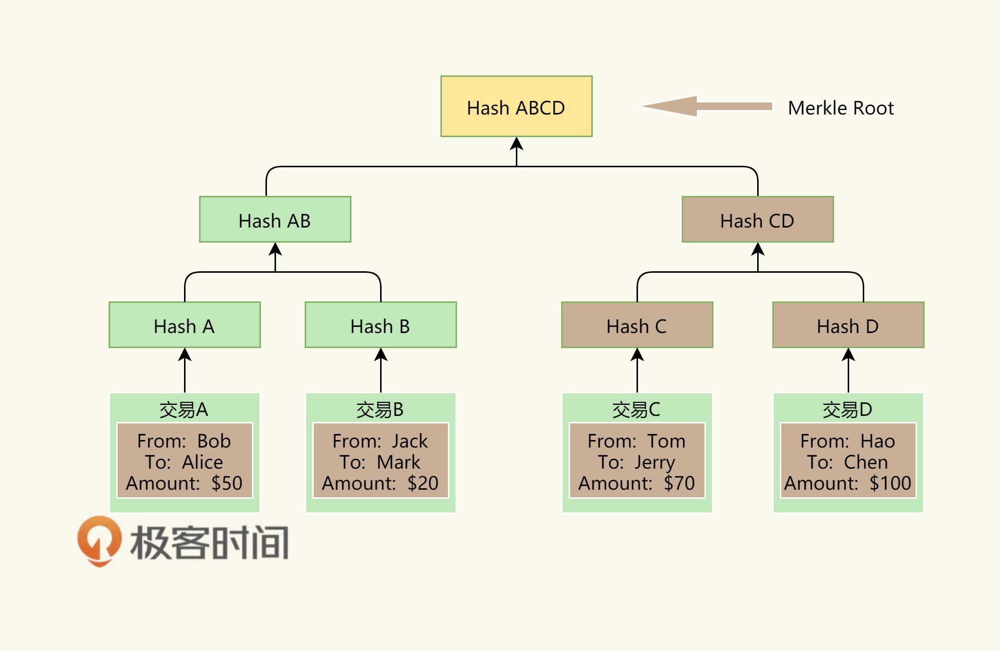
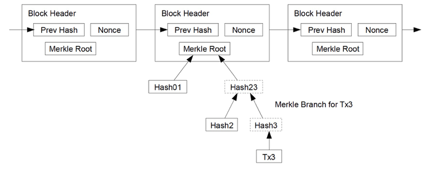
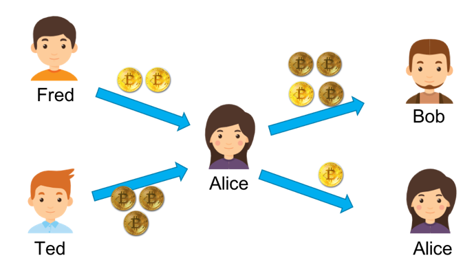
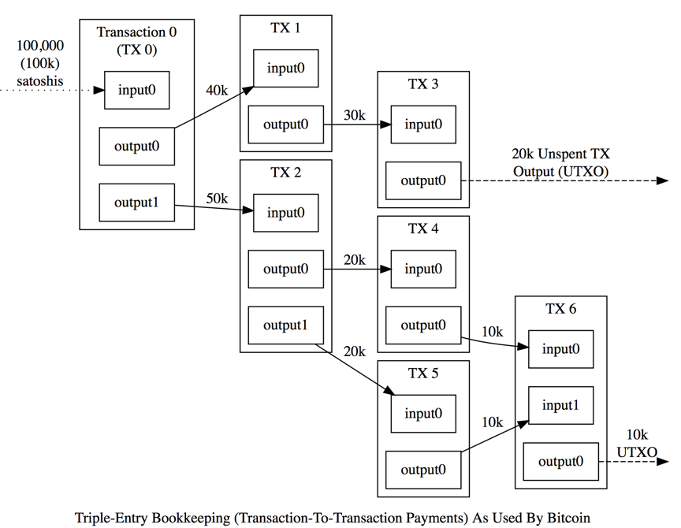

# 64 | 区块链技术细节：哈希算法
你好，我是陈皓，网名左耳朵耗子。

对于计算机来说，区块链就像一个单向链表，一个数据块中保存着三个信息。

- 真正的数据。
- 自己的地址（或是ID）。
- 前一个数据块的地址。

这样，通过追溯前一个块的地址，把所有的数据块存成了一条链。所以，我们叫其BlockChain。如下图所示。



每个数据块的“地址”的编码使用了计算机上的一个算法，计算机圈内人士把这个算法叫Secure Hash。有人音译为“安全哈希”，也有人意译为“安全散列”。在计算机应用中，hash算法主要有几个功能。

- 用来生成唯一标识一个数据块的ID（身份证），这个ID几乎不能重复。

- 用来做数据的特征码。只要数据中一个bit的数据出现更改，那么整个hash值就完全不一样了。而且数学上保证了，我们无法通过hash值反推回原数据。


于是，很多公司在互联网上发布信息或软件的时候，都会带上一个Checksum（校验码）。你只要把整个文件的数据传入到那个特定的hash算法中，就会得到一串很长的字符串。如果和官方发布的Checksum字符串不一样，那么就说明信息或文件内容被人更改或是信息残缺了。因此，也被应用在“数字签名”中。

在计算机世界里，有两个很著名的hash算法，一个叫MD5（ [Wikipedia链接](https://en.wikipedia.org/wiki/MD5)），一个叫SHA-2（ [Wikipedia链接](https://en.wikipedia.org/wiki/SHA-2)）， 区块链用的是SHA-256这个算法。

下面是一个示例。

- 对"chen hao"这个信息计算MD5值得到 9824df83b2d35172ef5eb63a47a878eb（一个16进制数）。

- 如果对 “chen hao"做一个字符的修改，将字母"o"改成数字"0”，即 “chen ha0”，计算出来的MD5值就成了 d521ce0616359df7e16b20486b78d2a8。可以看到，这和之前的MD5值完全不一样了。


于是，我们就可以利用hash算法的这个特性来对数据做"数字签名"。也就是说，我将"数据"和其"签名"（hash计算值）一起发布，这样可以让收到方来验证数据有没有被修改。

我们再来看上面那个区块链的图。


对于第一块数据，我们把其“数据集”和“前数据块的hash值 00000a6cba”一起做hash值，得到本区块的地址000007cabfa。然后，下一个区块会把自己的数据和000007cabfa一起做hash，得到000008acbed这个哈希值……如此往复下去。

根据“被hash的数据中有一个bit被修改了，整个hash就完全不一样了”这个特性，我们知道：

- 如果前置数据块中的数据改了，那么其hash就会完全不一样了，也就是说你的ID或地址就变了，于是别人就找不到这个数据块了；

- 所以，你还要去修改别人数据块中指向你的地址，但是别人数据块中指向你的地址（ID/hash）变了，也会导致他自己的地址（ID/hash）随之变化。因为他用你的地址生成了自己的地址，这样一来，你就需要把其他人的地址全部改掉。


在这样的连锁反应下，你想要偷偷修改一个bit的难度一下就提高很多。所以，在区块链的世界里，越老的区块越安全也越不容易被人篡改，越新的区块越不安全也越容易被人篡改。

# 比特币的hash算法

下面我来简单介绍一下，比特币中区块链的一些细节。下图是区块链的协议格式。



其中Version，Previous Block Hash，Merkle Root，Timestamp，Difficulty Target 和Nonce这六个数据字段是区块链的区块数据协议头。后面的数据是交易数据，分别是：本块中的交易笔数H和交易列表（最多不能超过1MB，为什么是1MB，后面会说）。

下面我来说一下区块头中的那六个字段的含义。

- Version：当前区块链协议的版本号，4个字节。如果升级了，这个版本号会变。

- Previous Block Hash：前面那个区块的hash地址。32个字节。

- Merkle Root：这个字段可以简单理解为是后面交易信息的hash值（后面具体说明一下） 。32个字节。

- Timestamp：区块生成的时间。这个时间不能早于前面11个区块的中位时间，不能晚于"网络协调时间"——你所连接的所有结点时间的中位数。4个字节。

- Bits：也就是上图中的Difficulty Tagrget，表明了当前的hash生成的难度（后面会说）。4个字节。

- Nonce：一个随机值，用于找到满足某个条件的hash值。4字节。


对这六个字段进行hash计算，就可以得到本区块的hash值，也就是其ID或是地址。其hash方式如下（对区块头做两次SHA-256的hash求值）：

```
SHA-256(SHA-256 (Block Header))

```

当然，事情并没有这么简单。比特币对这个hash值是有要求的，其要求是那个Bits字段控制的，然后你可以调整Nonce这个32位整型的值来找到符合条件的hash值。我们把这个事情叫做“挖矿”（在下一篇中，我们会详细讲一下这个事）。

# 关于 Merkle Root

前面说到过，可以简单地将Merkle Root理解为交易的hash值。这里，我们具体说一下，比特币的Merkle Root是怎么计算出来的。

首先，我们知道，比特币的每一笔交易会有三个字段，一个是转出方，一个是转入方，还有一个是金额。那么，我们会对每个交易的这三个字段求hash，然后把交易的hash做两两合并，再求其hash，直到算出最后一个hash值，这就是我们的Merkle Root。

我画了一个图展示一下这个过程。



上面的示意图中有四笔交易，A和B的hash成了Hash-AB， C和D的hash成了Hash-CD，然后再做Hash-AB + Hash-CD 的hash，得到了Hash-ABCD，这就是Merkle Root。整个过程就像一个二叉树一样。

下图是一个区块链的示意图，来自 [比特币的白皮书](https://bitcoin.org/bitcoin.pdf)。



为什么要这样做呢？为什么不是把所有的交易都放在一起做一次hash呢？这不也可以让人无法篡改吗？这样做的好处是——我们把交易数据分成了若干个组。就像上面那个二叉树所表示的一样，我们可以不断地把这个树分成左边的分支和右边的分支，因为它们都被计算过hash值，所以可以很快地校验其中的内容有没有被修改过。

这至少带来三个好处。

1. 大量的交易数据可以被分成各种尺寸的小组，这样有利于我们整合数据和校验数据。

2. 这样的开销在存储和内存上并不大，然而我们可以提高校验一组数据的难易程度。

3. 在P2P的无中心化网络上，我们可以把大量数据拆成一个一个小数据片传输，可以提高网络的传输速度。


最后，需要说一下的是，以太坊有三个不同的Merkle Root树。因为以太坊要玩智能合约，所以需要更多的Merkle Root。

- 一个是用来做交易hash的Merkle Root。

- 一个是用来表示状态State的。因为一个智能合同从初始状态走到最终状态需要有若干步（也就是若干笔交易），每一步都会让合同的状态发生变化，所以需要保存合同的状态。

- 还有一个是用来做交易收据的。主要是用来记录一个智能合约中最终发生的交易信息。在StackExchange上的问题" [Relationship between Transaction Trie and Receipts Trie](https://ethereum.stackexchange.com/questions/5888/relationship-between-transaction-trie-and-receipts-trie)"中有相应的说明，你可以前往一看。


以太坊称其为Merkle Patricia Tree（具体细节可参看其 [官方的Wiki](https://github.com/ethereum/wiki/wiki/Patricia-Tree)）。

# 比特币的交易模型

比特币区块中的交易数据，其实也是一个链。为了讲清楚这个链，我们需要了解一下比特币交易中的两个术语，一个是input，一个是output，也就是交易的支出方（input）和收入方（output）。

在比特币中，一个交易可以有多个output，也就是说我可以把一笔钱汇给多个人，但一个output只能对应一个源的input，还有一个条件就是，output跟input的总数要吻合。

这里举个例子。假设，Fred给了Alice 2个比特币，Ted给了Alice 3个比特币，这个时候，Alice有5个比特币。然而，大比特币的世界里是没有余额的，所以，对于Alice来说，她只有两个没有花出去的交易，一个是2个比特币，一个是3个比特币。这在比特币中叫UTXO（Unspent Transaction Output）。

此时，如果Alice想要转给Bob 4个比特币，她发现自己的两个交易中都不够，也不能拆开之前的那两个比特币交易，那么她只能把交易2和交易3当成input，然后把自己和Bob当成output，Bob分得4个，她自己分1个。这样的交易才平衡。



于是，一笔交易可能会包含大量的Input和Output。因为比特币没有“余额”的概念，所以需要通过多个input来凑，然后output这边还需要给自己找零，给矿工小费。

这样一来，在比特币交易中，你把钱给了我，我又给了张三，张三给了李四……就这样传递下去，形成了一个交易链。因为还没有花出去，所以就成了UTXO，而系统计算你有没有钱可以汇出去时，只需要查看一下你的UTXO就可以了。



(图片来源： [https://bitcoin.org/en/developer-guide](https://bitcoin.org/en/developer-guide) )

UTXO因为没有账户和余额的概念，所以可以并行进行多笔交易。假如你有多个UTXO，你可以进行多笔交易而不需要并行锁。然后其还有匿名性的特征，你可以隐藏自己的交易目的地（通过设置的多个output），而且没有余额意味着是没有状态的。要知道你有多少个比特币，只需要把UTXO的交易记录统计一下就可以知道了。但这也让人比较费解，而且也不利于应用上的开发。以太坊则使用了余额的方式。

在这一讲中，我先讲述了什么是区块链以及它的核心原理是什么。随后分享了比特币的hash算法，以及Merkle Root是如何计算出来的。最后，介绍了比特币的交易模型。希望对你有帮助。

文末给出了《区块链技术》系列文章的目录，希望你能在这个列表里找到自己感兴趣的内容。

- [区块链的革命性及技术概要](https://time.geekbang.org/column/article/5197)
- [区块链技术细节：哈希算法](https://time.geekbang.org/column/article/5363)
- [区块链技术细节：加密和挖矿](https://time.geekbang.org/column/article/5438)
- [去中心化的共识机制](https://time.geekbang.org/column/article/5612)
- [智能合约](https://time.geekbang.org/column/article/5623)
- [传统金融和虚拟货币](https://time.geekbang.org/column/article/5636)