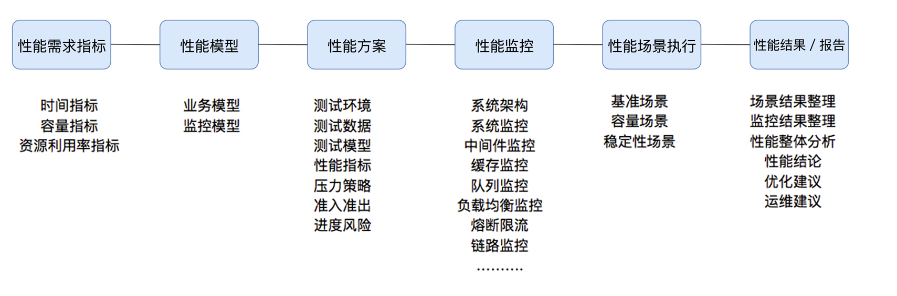

# 01丨性能综述：性能测试的概念到底是什么？
在性能测试行业中，长久以来，都存在几个关键的概念误差。在我从业性能测试十几年的经历中，也看到过书籍或网上传播着各种性能测试的概念、方法论等，但是究其本质，再对应到具体的项目工作中，我发现这些概念以及方法论实在没有指导的价值，并且有些概念的产出，也没有确凿的证据来源。

所以在今天，专栏正式更新的第一天，我希望能把这些内容做些梳理，同时这些梳理的内容也会对应到后续的篇幅之中，以便保持理念的一致性。

## 性能测试概念

我们经常看到的性能测试概念，有人或称之为性能策略，或称之为性能方法，或称之为性能场景分类，大概可以看到性能测试、负载测试、压力测试、强度测试等一堆专有名词的解释。

针对这些概念，我不知道你看到的时候会不会像我的感觉一样：乱！一个小小的性能测试，就延伸出了这么多的概念，并且概念之间的界限又非常模糊。

就拿“压力测试”、“容量测试”和“极限测试”这三个概念来说吧。

网上针对这三个名词的解释是这样的：

> **压力测试**
>
> 压力测试是评估系统处于或超过预期负载时系统的运行情况。压力测试的关注点在于系统在峰值负载或超出最大载荷情况下的处理能力。在压力级别逐渐增加时，系统性能应该按照预期缓慢下降，但是不应该崩溃。压力测试还可以发现系统崩溃的临界点，从而发现系统中的薄弱环节。

> **容量测试**
>
> 确定系统可处理同时在线的最大用户数，使系统承受超额的数据容量来发现它是否能够正确处理。

> **极限测试**
>
> 在过量用户下的负载测试。

恕我直言，这三个概念，对我这个从事性能测试十几年的老鸟来说，都看不出来有啥区别。

也许你会说，你看那里不是说了吗？

“压力测试是在超过预期负载时系统的运行情况”，“容量测试是使系统承受超额的数据容量来发现它是否能够正确处理”。

来吧，就算我语文不好，我也认字的，谁能告诉我这两者的区别是什么？除了字不一样。

如果再抽象一层说一下这些概念，那就是，这些概念都在描述性能测试的不同侧面。而这些侧面本身构不成策略，构不成方法，不能说是概念，也不能说是理论。

此文一出，肯定会有人说，既然你评价当前的概念混乱，那你有什么好建议呢？作为可能被集体轰炸的话题，既然已经摆上了台面，我还是要冒死给一个自己认为的合理定义：

> **性能测试针对系统的性能指标，建立性能测试模型，制定性能测试方案，制定监控策略，在场景条件之下执行性能场景，分析判断性能瓶颈并调优，最终得出性能结果来评估系统的性能指标是否满足既定值。**

这是我觉得唯一合理的概念定义，下面我就把这个概念详细解释一下。

### 性能测试需要有指标

有人说，我们在做项目的时候，就没有指标，老板只说一句，系统压死为止。听起来很儿戏，但这样的场景不在少数。在我看来，把系统压死也算是一种指标。至于你用什么手段把系统“压死”，那就是实现的问题了。你可以采用很多种手段，告诉老板，这系统还没压就死了！ 这也是你的贡献。

而对“有指标”这个定义来说，理论上合理的，并且应该有的指标是：时间指标、容量指标和资源利用率指标。

而这里的指标又会有细分，细分的概念又是一团乱。这个话题我们后面再描述。

### 性能测试需要有模型

模型是什么？它是真实场景的抽象，可以告诉性能测试人员，业务模型是什么样子。比如说，我们有100种业务，但不是每个业务都需要有并发量，可能只有50个业务有，那就要把这些有并发的业务统计出来，哪个业务并发多，哪个业务并发少，做压力时就要控制好这样的比例。

这种做法需要的数据通常都是从生产环境中的数据中统计来的，很多在线上不敢直接压测的企业都是这样做的。

而随着互联网中零售业、云基础架构的全面发展，有些企业直接在线上导流来做性能测试，这种思路上的转变来源于架构的发展及行业的真实需要。但这并不能说明性能测试不需要模型了，因为这个模型已经从生产流量中导过来了。这一点，还是需要你认清的。

但是对于其他的一些行业，比如银行这类金融机构，线上一个交易都不能错。像上面这样做的难度就太大了。所以这些行业中，仍然需要在测试环境中用业务模型来模拟出生产的流量。

同时也请你认清一点，现在的全链路压测，并没有像吹嘘得那么神乎其神，很多企业也只是在线上的硬件资源上做压力而已，并不是真正的逻辑链路修改。

我在工作中经常会被问到，性能流量直接从生产上导的话，是不是就可以不用性能测试人员了？性能测试人员就要被淘汰了？

这未免太短视了，大家都盯着最新鲜的技术、方法、概念，各层的领导也都有自己的知识偏好，万一做了一个决定，影响了最终的结果，有可能会让很多人跟着受罪。

我之前带过的一个团队中，开发架构们一开始就规划了特别详细的微服务架构，说这一套非常好。我说这个你们自己决定，我只要在这里面拿到可用的结果就行。结果开发了不到两个月，一个个微服务都被合并了，还得天天加班做系统重构，只留了几大中台组件。这是为什么呢？因为不适用呀。

同理，性能测试也要选择适合自己系统业务逻辑的方式，用最低的成本、最快的时间来做事情。

### 性能测试要有方案

方案规定的内容中有几个关键点，分别是测试环境、测试数据、测试模型、性能指标、压力策略、准入准出和进度风险。基本上有这些内容就够了，这些内容具体的信息还需要精准。

你可能会说，怎么没有测试计划？我的建议是，用项目管理工具单独画测试计划，比如用Project或OmniPlan之类的工具。这是因为在方案中，写测试计划，基本上只能写一个里程碑，再细化一点，就是在里面再加几个大阶段的条目。但是用项目管理工具做计划就不同了，它不仅可以细分条目，还能跟踪各个工作的动态进度，可以设置前后依赖关系，填入资源和成本以便计算项目偏差。

### 性能测试中要有监控

这个部分的监控，要有分层、分段的能力，要有全局监控、定向监控的能力。关于这一点，我将在第三模块详细说明。

### 性能测试要有预定的条件

这里的条件包括软硬件环境、测试数据、测试执行策略、压力补偿等内容。要是展开来说，在场景执行之前，这些条件应该是确定的。

有人说，我们压力中也会动态扩展。没问题，但是动态扩展的条件或者判断条件，也是有确定的策略的，比如说，我们判断CPU使用率达到80%或I/O响应时间达到10ms时，就做动态扩展。这些也是预定的条件。

关于这一点，在我的工作经历中，经常看到有性能测试工程师，对软硬件资源、测试数据和执行策略分不清楚，甚至都不明白为什么要几分钟加几个线程。在这种情况之下，就不能指望这个场景是有效的了。

### 性能测试中要有场景

可以说，“性能场景”这个词在性能测试中占据着举足轻重的地位，只是我们很多人都不理解“场景”应该如何定义。场景来源于英文的scenario，对性能场景中的“场景”比较正宗的描述是：在既定的环境（包括动态扩展等策略）、既定的数据（包括场景执行中的数据变化）、既定的执行策略、既定的监控之下，执行性能脚本，同时观察系统各层级的性能状态参数变化，并实时判断分析场景是否符合预期。

这才是真正的场景全貌。

性能场景也要有分类，在我有限的工作经验中，性能场景从来都没有超出过这几个分类。

1. 基准性能场景：这里要做的是单交易的容量，为混合容量做准备（不要跟我说上几个线程跑三五遍脚本叫基准测试，在我看来，那只是场景执行之前的预执行，用来确定有没有基本的脚本和场景设计问题，不能称之为一个分类）。
2. 容量性能场景：这一环节必然是最核心的性能执行部分。根据业务复杂度的不同，这部分的场景会设计出很多个，在概念部分就不细展开了，我会在后面的文章中详细说明。
3. 稳定性性能场景：稳定性测试必然是性能场景的一个分类。只是现在在实际的项目中，稳定性测试基本没和生产一致过。在稳定性测试中，显然最核心的元素是时间（业务模型已经在容量场景中确定了），而时间的设置应该来自于运维周期，而不是来自于老板、产品和架构等这些人的心理安全感。
4. 异常性能场景：要做异常性能场景，前提就是要有压力。在压力流量之下，模拟异常。这个异常的定义是很宽泛的，在下一篇文章里，我们再细说。

很多性能测试工程师，都把场景叫成了测试用例。如果只是叫法不同，我觉得倒是可以接受，关键是内容也出现了很大的偏差，这个偏差就是，把用例限定在了描述测试脚本和测试数据上，并没有描述需要实时的判断和动态的分析。这就严重影响了下一个概念：性能结果。

### 性能测试中要有分析调优

一直以来，需不需要在性能测试项目中调优，或者说是不是性能测试工程师做调优，人们有不同的争论。

从性能市场的整体状态来看，在性能测试工程师中，可以做瓶颈判断、性能分析、优化的人并不多，所以很多其他职位上的人对性能测试的定位也就是性能验证，并不包括调优的部分。于是有很多性能项目都定义在一两周之内。这类项目基本上也就是个性能验证，并不能称之为完整的性能项目。而加入了调优部分之后，性能项目就会变得复杂。对于大部分团队来说，分析瓶颈都可能需要很长时间，这里会涉及到相关性分析、趋势分析、证据链查找等等手段。

所以，就要不要进行调优，我做了如下划分。

对性能项目分为如下几类。

1. **新系统性能测试类**：这样的项目一般都会要求测试出系统的最大容量，不然上线心里没底。
2. **旧系统新版本性能测试类**：这样的项目一般都是和旧版本对比，只要性能不下降就可以根据历史数据推算容量，对调优要求一般都不大。
3. **新系统性能测试优化类**：这类的系统不仅要测试出最大容量，还要求调优到最好。

对性能团队的职责定位有如下几种。

1. **性能验证**：针对给定的指标，只做性能验证。第三方测试机构基本上都是这样做的。
2. **性能测试**：针对给定的系统，做全面的性能测试，可以得到系统最大容量，但不涉及到调优。
3. **性能测试+分析调优**：针对给定的系统，做全面的性能测试，同时将系统调优到最优状态。

当只能做性能验证的团队遇到旧系统新版本性能测试类和新系统性能测试优化类项目，那就会很吃力，这样的团队只能做新系统性能测试类项目。

当做性能测试的团队，遇到需要新系统性能测试优化类项目，照样很吃力。这样的团队能做前两种项目。

只有第三个团队才能做第三种项目。

### 性能测试肯定要有结果报告

性能结果如何来定义呢？有了前面监控的定义，有了场景执行的过程，产生的数据就要整理到结果报告中了。这个文档工作也是很重要的，是体现性能团队是否专业的一个重要方面。并不是整理一个Word，美化一下格式就可以了。测试报告是需要汇报或者归档的。

如果是内部项目，测试报告可能就是一个表格，发个邮件就完整了，另外归档也是必须的。而对一些有甲乙方的项目，就需要汇报了。

那么，如何汇报呢？

我们要知道，大部分老板或者上司关心的是测试的结果，而不是用了多少人，花了多少时间这些没有意义的数字。我们更应该在报告中写上调优前后的TPS、响应时间以及资源对比图。

有了上面的的解析，相信你对性能测试的定义有了明确的感觉了。这个定义其实就是描述了性能测试中要做的事情。

当然，也许会有人跳出来说，你这个说得太重了，不够敏捷。现在不都用DevOps了吗？还要按这个流程来走一遍吗？

显然有这种说法的人，没有理解我要说的主旨。以上的内容是针对一个完整的项目，或系统或公司的系统演进。对于一些半路就跟着版本和新需求一轮轮迭代做下去的人的处境会不同，因为这样的人只看到了当前的部分，而不是整个过程。

并且这个过程也是不断在迭代演进的。

不管是敏捷开发过程还是DevOps，你可以一条条去仔细分析下项目中的各个环节（我说的是整个项目从无到有），都不会跳出以上定义，如果有的话，请随时联系我，我好改定义。:)

通过图示最后总结一下性能测试的概念：

有了这个图示之后，就比较清晰了。

所以，前面所说的压力测试、容量测试、负载测试等等，在实际的项目实施过程中，都不具备全局的指导价值。我个人认为，你应该在性能领域中抛弃这些看似非常有道理实则毫无价值的概念。

## 总结

今天的内容我只讲了一点，那就是性能测试的概念。请不要再使用像性能测试、负载测试、容量测试这样的词来概括性能执行策略，这是对实施过程没有任何指导价值的。

在性能测试的概念中，性能指标、性能模型、性能场景、性能监控、性能实施、性能报告，这些既是概念中的关键词，也可以说是性能测试的方法和流程。

而这些概念我们在实际的工作中，都是非常重要的。因为它们要抹平沟通的误解。让不同层级，不同角色的人，可以在同样的知识背景下沟通，也可以让做事情的人有清晰的逻辑思路，同时对同行间的交流，也有正向的促进作用。

## 思考题

最后给你留两道思考题吧，我为什么不推荐使用性能测试、负载测试、容量测试这样的词来概括性能执行策略呢？以及，为什么性能测试中要有监控和分析？

欢迎你在评论区写下你的思考，也欢迎把这篇文章分享给你的朋友或者同事，一起交流一下。