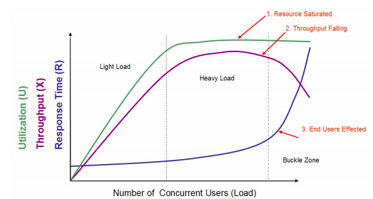
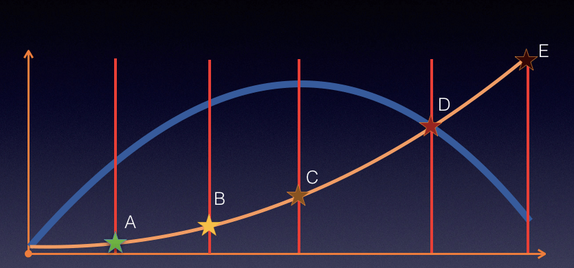
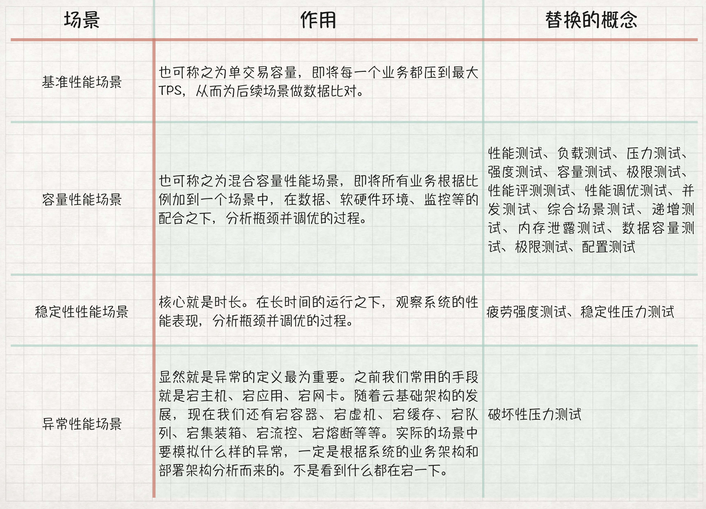

# 02丨性能综述：TPS和响应时间之间是什么关系？
我们在上一篇文章中讲了性能测试的概念，肯定会有人觉得，那些概念很重要，怎么能轻易抹杀呢？那么，在今天的文章中，我们就来扒一扒性能场景，看看概念与实际之间的差别。

前面我们说了性能要有场景，也说了性能场景要有基准性能场景、容量性能场景、稳定性性能场景、异常性能场景。在我有限的十几年性能生涯中，从来没有见过有一个性能场景可以超出这几个分类。下面我将对前面说到的概念进行一一对应。

学习性能的人，一定看吐过一张图，现在让你再吐一次。如下：

在这个图中，定义了三条曲线、三个区域、两个点以及三个状态描述。

1. 三条曲线：吞吐量的曲线（紫色）、利用率（绿色）、响应时间曲线（深蓝色）。
2. 三个区域：轻负载区（Light Load）、重负载区（Heavy Load）、塌陷区（Buckle Zone）。
3. 两个点：最优并发用户数（The Optimum Number of Concurrent Users）、最大并发用户数（The Maximum Number of Concurrent Users）。
4. 三个状态描述：资源饱和（Resource Saturated）、吞吐下降（Throughput Falling）、用户受影响（End Users Effected）。

我在很多地方，都看到了对这张图的引用。应该说，做为一个示意图，它真的非常经典，的确描述出了一个基本的状态。但是，示意图也只能用来做示意图，在具体的项目中，我们仍然要有自己明确的判断。

我们要知道，这个图中有一些地方可能与实际存在误差。

首先，很多时候，重负载区的资源饱和，和TPS达到最大值之间都不是在同样的并发用户数之下的。比如说，当 CPU 资源使用率达到 100% 之后，随着压力的增加，队列慢慢变长，响应时间增加，但是由于用户数增加的幅度大于响应时间增加的幅度之前，TPS 仍然会增加，也就是说资源使用率达到饱和之后还有一段时间TPS才会达到上限。

大部分情况下，响应时间的曲线都不会像图中画得这样陡峭，并且也不一定是在塌陷区突然上升，更可能的是在重负载区突然上升。

另外，吞吐量曲线不一定会出现下降的情况，在有些控制较好的系统中会维持水平。曾经在一个项目中，因为TPS维持水平，并且用户数和响应时间一直都在增加，由于响应时间太快，一直没有超时。我跟我团队那个做压力的兄弟争论了三个小时，我告诉他接着压下去已经没有意义，就是在等超时而已。他倔强地说，由于没有报错，时间还在可控范围，所以要一直加下去。关于这一点争论，我在后续的文章中可能还会提及。

最优并发数这个点，通常只是一种感觉，并没有绝对的数据用来证明。在生产运维的过程中，其实我们大部分人都会更为谨慎，不会定这个点为最优并发，而是更靠前一些。

最大并发数这个点，就完全没有道理了，性能都已经衰减了，最大并发数肯定是在更前的位置呀。这里就涉及到了一个误区，压力工具中的最大用户数或线程数和TPS之间的关系。在具体的项目实施中，有经验的性能测试人员，都会更关心服务端能处理的请求数即TPS，而不是压力工具中的线程数。

这张图没有考虑到锁或线程等配置不合理的场景，而这类场景又比较常见。也就是我们说的，TPS上不去，资源用不上。所以这个图默认了一个前提，只要线程能用得上，资源就会蹭蹭往上涨。

这张图呢，本来只是一个示意，用以说明一些关系。但是后来在性能行业中，有很多没有完全理解此图的人将它做为很有道理的“典范”给一些人讲，从而引起了越来越多的误解。

此图最早的出处是2005年Quest Software的一个PSO Consultant写的一个白皮书 [《Performance Testing Methodology》](http://hosteddocs.ittoolbox.com/questnolg22106java.pdf)。在18页论述了这张图，原文摘录一段如下：

> You can see that as user load increases, response time increases slowly and resource utilization increases almost linearly. This is because the more work you are asking your application to do, the more resources it needs. Once the resource utilization is close to 100 percent, however, an interesting thing happens – response degrades with an exponential curve. This point in the capacity assessment is referred to as the saturation point. The saturation point is the point where all performance criteria are abandoned and utter panic ensues. Your goal in performing a capacity assessment is to ensure that you know where this point is and that you will never reach it. You will tune the system or add additional hardware well before this load occurs.

按照这段描述，这个人只是随着感觉在描述一种现象，除此无它。比如说，The saturation point is the point where all performance criteria are abandoned and utter panic ensues.在我的工作经验中，其实在saturation point之前，性能指标就已经可以显示出问题了，并且已经非常panic了，而我们之所以接着再加压力是为了让指标显示得更为明显，以便做出正确的判断。而调优实际上是控制系统在饱和点之前，这里有一个水位的问题，控制容量到什么样的水位才是性能测试与分析的目标。

我们简化出另一个图形，以说明更直接一点的关系。如下所示：

上图中蓝线表示TPS，黄色表示响应时间。

在TPS增加的过程中，响应时间一开始会处在较低的状态，也就是在A点之前。接着响应时间开始有些增加，直到业务可以承受的时间点B，这时TPS仍然有增长的空间。再接着增加压力，达到C点时，达到最大TPS。我们再接着增加压力，响应时间接着增加，但TPS会有下降（请注意，这里并不是必然的，有些系统在队列上处理得很好，会保持稳定的TPS，然后多出来的请求都被友好拒绝）。

最后，响应时间过长，达到了超时的程度。

在我的工作中，这样的逻辑关系更符合真实的场景。我不希望在这个关系中描述资源的情况，因为会让人感觉太乱了。

为什么要把上面描述得如此精细？这是有些人将第一张图中的Light load对应为性能测试，Heavy Load对应为负载测试，Buckle Zone对应为压力测试……还有很多的对应关系。

事实上，这是不合理的。

下面我将用场景的定义来替换这些混乱的概念。

为什么我要如此划分？因为在具体场景的操作层面，只有场景中的配置才是具体可操作的。而通常大家认为的性能测试、负载测试、压力测试在操作的层面，只有压力工具中线程数的区别，其他的都在资源分析的层面，而分析在很多人的眼中，都不算测试。

拿配置测试和递增测试举例吧。

在性能中，我们有非常多的配置，像JVM参数、OS参数、DB参数、网络参数、容器参数等等。如果我们把测试这些配置参数，称为“配置测试”，我觉得未免过于狭隘了。因为对于配置参数来说，这只是做一个简单的变更，而性能场景其实没有任何变化呀。配置更改前后，会用同样的性能场景来判断效果，最多再增加一些前端的压力，实际的场景并没有任何变化，所以，我觉得它不配做为一个单独的分类。

再比如递增测试，在性能中，基准性能场景也好，容量性能场景也好，哪个是不需要递增的呢？我知道现在市场上经常有测试工程师，直接就上了几百几千线程做压力（请你不要告诉我这是个正常的场景，鉴于我的精神有限，承受不了这样的压力）。除了秒杀场景，同时上所有线程的场景，我还没有见到过。在一般的性能场景中，递增都是必不可少的过程。同时，递增的过程，也要是连续的，而不是100线程、200线程、300线程这样断开执行场景，这样是不合理的。关于这一点，我们将在很多地方着重强调。所以我觉得递增也不配做一个单独的分类。

其他的概念，就不一一批驳了。其实在性能测试中，在实际的项目实施中，我们并不需要这么多概念，这些杂七杂八的概念也并没有对性能测试领域的发展起到什么推进作用。要说云计算、AI、大数据这些概念，它们本身在引导着一个方向。

而性能测试中被定为“测试”，本身就处在软件生存周期的弱势环节，当前的市场发展也并不好。还被这些概念冲乱了本来应该有的逻辑的思路，实在是得不偿失。

## 总结

总之，在具体的性能项目中，性能场景是一个非常核心的概念。因为它会包括压力发起策略、业务模型、监控模型、性能数据（性能中的数据，我一直都不把它称之为模型，因为在数据层面，测试并没有做过什么抽象的动作，只是使用）、软硬件环境、分析模型等。

有了清晰的、有逻辑的场景概念之后，在后面的篇幅当中，我们将从场景的各个角度去拆解。在本专栏中，我们将保持理念的连贯性，以示我不变的职业初心。

## 思考题

如果你理解了今天的内容，不妨说说为什么说现在市场上的概念对性能项目的实施并没有太大的价值？其次，性能场景为什么要连续？而不是断开？

欢迎你在评论区写下你的思考，也欢迎把这篇文章分享给你的朋友或者同事，一起交流一下。