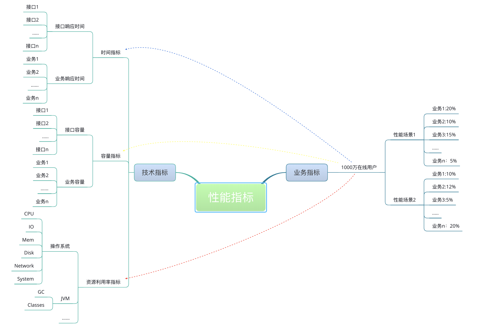
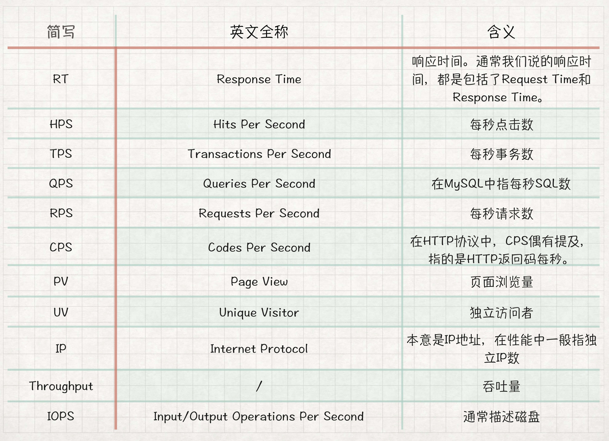
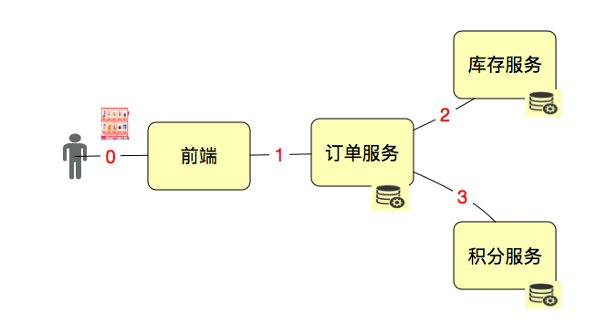
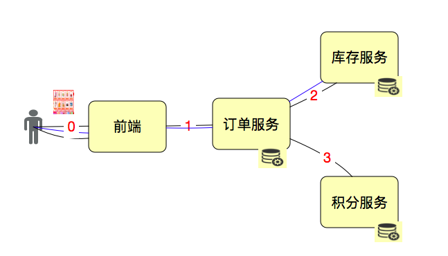
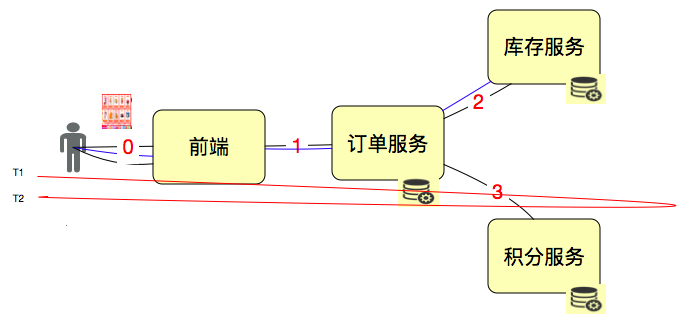
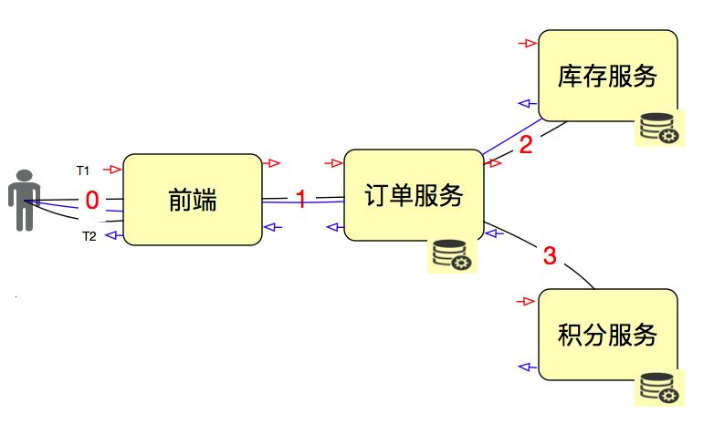
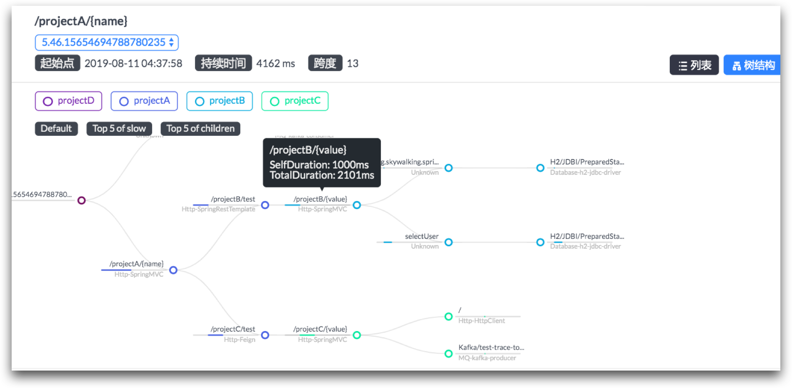
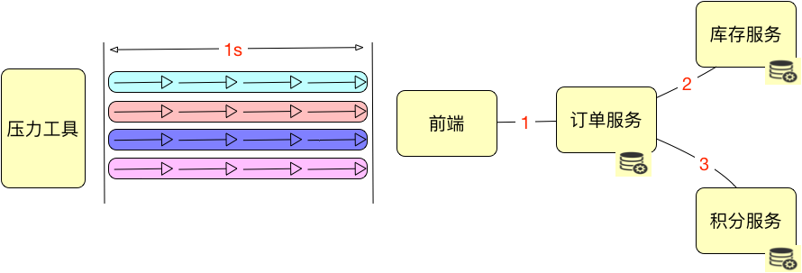
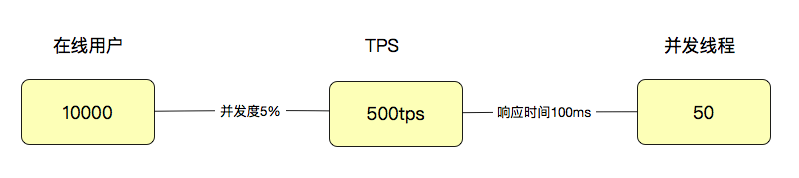

# 03丨性能综述：怎么理解TPS、QPS、RT、吞吐量这些性能指标？
在上一篇文章中，我们讲述了性能场景，下面就要说性能需求指标了。

通常我们都从两个层面定义性能场景的需求指标：业务指标和技术指标。

这两个层面需要有映射关系，技术指标不能脱离业务指标。一旦脱离，你会发现你能回答“一个系统在多少响应时间之下能支持多少TPS”这样的问题，但是回答不了“业务状态是什么”的问题。

举例来说，如果一个系统要支持1000万人在线，可能你能测试出来的结果是系统能支持1万TPS，可是如果问你，1000万人在线会不会有问题？这估计就很难回答了。

我在这里画一张示意图以便你理解业务指标和性能指标之间的关系。

这个示意显然不够详细，但也能说明关系了。所有的技术指标都是在有业务场景的前提下制定的，而技术指标和业务指标之间也要有详细的换算过程。这样一来，技术指标就不会是一块飞地。同时，在回答了技术指标是否满足的同时，也能回答是否可以满足业务指标。

有了这样的关联关系，下面我们看一下性能测试行业常用的性能指标表示法。

我将现在网上能看到的性能指标做了罗列，其中不包括资源的指标。因为资源类的比较具体，并且理解误差并不大，但业务类的差别就比较大了。

## 对这些性能指标都有哪些误解

我记得我还年轻的时候，还没有QPS、RPS、CPS这样的概念，只有TPS。那个时候，天总是那么蓝，时间总是那么慢，“你锁了人家就懂了”。

QPS一开始是用来描述MySQL中SQL每秒执行数Query Per Second，所有的SQL都被称为Query。后来，由于一些文章的转来转去，QPS被慢慢地移到了压力工具中，用来描述吞吐量，于是这里就有些误解，QPS和TPS到底是什么关系呢？

RPS指的是每秒请求数。这个概念字面意思倒是容易理解，但是有个容易误解的地方就是，它指的到底是哪个层面的Request？如果说HTTP Request，那么和Hits Per Second又有什么关系呢？

HPS，这也是个在字面意思上容易理解的概念。只是Hit是什么？有人将它和HTTP Request等价，有人将它和用户点击次数等价。

CPS，用的人倒是比较少，在性能行业中引起的误解范围并不大。同时还有喜欢用CPM（Calls Per Minute，每分钟调用数）的。这两个指标通常用来描述Service层的单位时间内的被其他服务调用的次数，这也是为什么在性能行业中误解不大的原因，因为性能测试的人看Service层东西的次数并不多。

为了区分这些概念，我们先说一下TPS（Transactions Per Second）。我们都知道TPS是性能领域中一个关键的性能指标概念，它用来描述每秒事务数。我们也知道TPS在不同的行业、不同的业务中定义的粒度都是不同的。所以不管你在哪里用TPS，一定要有一个前提，就是 **所有相关的人都要知道你的T是如何定义的**。

经常有人问，TPS应该如何定义？这个实在是没有具体的“法律规定”，那就意味着，你想怎么定就怎么定。

通常情况下，我们会根据场景的目的来定义TPS的粒度。如果是接口层性能测试，T可以直接定义为接口级；如果业务级性能测试，T可以直接定义为每个业务步骤和完整的业务流。

我们用一个示意图来说明一下。

如果我们要单独测试接口1、2、3，那T就是接口级的；如果我们要从用户的角度来下一个订单，那1、2、3应该在一个T中，这就是业务级的了。

当然，这时我们还要分析系统是如何设计的。通常情况下，积分我们都会异步，而库存不能异步哇。所以这个业务，你可以看成只有1、2两个接口，但是在做这样的业务级压力时，3接口也是必须要监控分析的。

所以，性能中TPS中T的定义取决于场景的目标和T的作用。一般我们都会这样来定事务。

- 接口级脚本：

  ——事务start（接口1）

  接口1脚本

  ——事务end（接口1）

  ——事务start（接口2）

  接口2脚本

  ——事务end（接口2）

  ——事务start（接口3）

  接口3脚本

  ——事务end（接口3）
- 业务级接口层脚本（就是用接口拼接出一个完整的业务流）：

  ——事务start（业务A）

  接口1脚本 - 接口2（同步调用）

  接口1脚本 - 接口3（异步调用）

  ——事务end（业务A）
- 用户级脚本

  ——事务start（业务A）

  点击0 - 接口1脚本 - 接口2（同步调用）

  点击0 - 接口1脚本 - 接口3（异步调用）

  ——事务end（业务A）

你要创建什么级别的事务，完全取决于测试的目的是什么。

一般情况下，我们会按从上到下的顺序一一地来测试，这样路径清晰地执行是容易定位问题的。

## 重新理解那些性能指标概念

搞清楚了TPS的T是什么，下面就要说什么是TPS了。字面意思非常容易理解，就是： **每秒事务数**。

在性能测试过程中，TPS之所以重要，是因为它可以反应出一个系统的处理能力。我在很多场景中都说过，事务就是统计了一段脚本的执行时间，并没有什么特别的含义。而现在又多加了其他的几个概念。

首先是QPS，如果它描述的是数据库中的Query Per Second，从上面的示意图中来看，其实描述的是服务后面接的数据库中SQL的每秒执行条数。如果描述的是前端的每秒查询数，那就不包括插入、更新、删除操作了。显然这样的指标用来描述系统整体的性能是不够全面的。所以不建议用QPS来描述系统整体的性能，以免产生误解。

RPS（Request per second），每秒请求数。看似简单的理解，但是对于请求数来说，要看是在哪个层面看到的请求，因为请求这个词，实在是太泛了。我们把上面的图做一点点变化来描述一下请求数。

如果一个用户点击了一次，发出来3个HTTP Request，调用了2次订单服务，调用了2次库存服务，调用了1次积分服务，那么这个Request该如何计算？如果你是算GDP的专家，我觉得可能会是：3+2+2+1=8（次）。而在具体的项目中，我们会单独描述每个服务，以便做性能统计。如果要描述整体，最多算是有3个RPS。如果从HTTP协议的角度去理解，那么HTTP Request算是一个比较准确的描述了，但它本身的定义并没有包含业务。如果赋予它业务的含义，那么用它来描述性能也是可以的。

HPS（Hits Per Second），每秒点击数。Hit一般在性能测试中，都用来描述HTTP Request。但是，也有一些人用它描述真正的客户在界面上的点击次数。关于这一点，就只有在具体的项目中才能规定得具体一些。当它描述HTTP Request时，如果RPS也在描述HTTP Request，那这两个概念就完全一样了。

CPS/CPM：Calls Per Second/ Calls Per Minutes，每秒/每分钟调用次数。这个描述在接口级是经常用到的，比如说上面的订单服务。显然一次客户界面上的点击调用两次。这个比较容易理解。但是，在操作系统级，我们也经常会听到系统调用用call来形容，比如说用strace时，你就会看见Calls这样的列名。

这些概念本身并没有问题，但是当上面的概念都用来描述一个系统的性能能力的时候，就混乱了。对于这种情况，我觉得有几种处理方式：

1. 用一个概念统一起来。我觉得直接用TPS就行了，其他的都在各层面加上限制条件来描述。比如说，接口调用1000 Calls/s，这样不会引起混淆。
2. 在团队中定义清楚术语的使用层级。
3. 如果没有定义使用层级，那只能在说某个概念的时候，加上相应的背景条件。

所以，当你和同事在沟通性能指标用哪些概念时，应该描述得更具体一些。在一个团队中，应该先有这些术语统一的定义，再来说性能指标是否满足。

## 响应时间RT

在性能中，还有一个重要的概念就是响应时间（Response Time）。这个比较容易理解。我们接着用这张示意图说明：

RT = T2-T1。计算方式非常直接简单。但是，我们要知道，这个时间包括了后面一连串的链路。

响应时间的概念简单至极，但是，响应时间的定位就复杂了。

性能测试工具都会记录响应时间，但是，都不会给出后端链路到底哪里慢。经常有人问问题就直接说，我的响应时间很慢。问题在哪呢？在这种情况下，只能回答：不知道。

因为我们要先画架构图，看请求链路，再一层层找下去。比如说这样：

在所有服务的进出口上都做记录，然后计算结果就行了。在做网关、总线这样的系统时，基本上都会考虑这个功能。

而现在，随着技术的发展，链路监控工具和一些Metrics的使用，让这个需求变得简单了不少。比如说这样的展示：

它很直观地显示了，在一个请求链路上，每个节点消耗的时间和请求的持续时间。

我顺便在这里说一下调优在当前性能项目中的状态。

对于响应时间来说，时间的拆分定位是性能瓶颈定位分析中非常重要的一节。但是请注意，这个环节并不是性能测试工程师的最后环节。

在工作中，我经常看到有很多性能测试工程师连时间拆分都不做，只报一个压力工具中看到的响应时间，就给一个通过不通过的结论，丝毫没有定位。

另外，有一些性能测试工程师，倒是用各种手段分析了时间的消耗点，但是也觉得自己的工作就此结束了，而不做根本原因的分析或协调其他团队来分析。

当然在不同的企业里，做分析的角色和要求各不相同，所以也要根据实际的企业现状来说。

在我的观点中，性能只测不调，那就是性能验证的工作，称不上是完整的性能项目。第三方性能测试的机构可以这样做，但是在一个企业内部这样做的话，性能团队的价值肯定就大打折扣了。

但是现在有很多人都不把性能调优做为性能团队的工作，主要原因有几点：

1. 性能测试团队的人能力有限做不到；
2. 性能调优代价高，耗时长，不值得做。

在我带的性能项目中，基本上调优的工作都是我的团队主导的。性能团队当然不可能完全没有技术弱点，所以在很多时候都是协调其他团队的人一起来分析瓶颈点。那为什么是我的团队来主导这个分析的过程呢？

因为每个技术人员对性能瓶颈的定义并不相同，如果不细化到具体的计数器的值是多少才有问题，有误解的可能性就很大。

曾经我在某零售业大厂做性能咨询的时候，一房间的技术人员，开发、运维、DBA都有，结果性能瓶颈出现了，所有人都说自己的部分是没问题的。于是我一个个问他们是如何判断的，判断的是哪个计数器，值又是多少。结果发现很多人对瓶颈的判断都和我想像的不一样。

举例来说，DB的CPU使用率达到90%以上，DBA会觉得没有问题，因为都是业务的SQL，并不是DB本身有问题。开发觉得SQL执行时间慢是因为DB有问题，而不是自己写的有问题，因为业务逻辑并没有错，有问题的点应该是DB上索引不合理、配置不合理。

你看，同样的问题，每个人的看法都有区别。当然也不能排除有些人就是想推诿责任。

这时怎么办呢？如果你可以把执行计划拿出来，告诉大家，这里应该创建索引，而那里应该修改业务条件，这时就具体了。

### 压力工具中的线程数和用户数与TPS

总是有很多人在并发线程数和TPS之间游荡，搞不清两者的关系与区别。这两个概念混淆的点就是，好像线程是真实的用户一样，那并发的线程是多少就描述出了多少真实的用户。

但是做性能的都会知道，并发线程数在没有模拟真实用户操作的情况下，和真实的用户操作差别非常远。

在LoadRunner还比较红火的时候，Mercury提出一个BTO的概念，就是业务科技优化。在LoadRunner中也提出”思考时间“的概念，其实在其他的性能工具中是没有“思考时间”这个词的。这个词的提出就是为了性能工具模拟真实用户。

但是随着性能测试的地位不断下降，以及一些概念和名词不断地被以讹传讹，导致现在很多人都没有明白压力工具中的线程数和用户以及TPS之间是怎样的关系。同样，我们先画一个示意图来说明一下。

这里先说明一个前提，上面的一个框中有四个箭头，每个都代表着相同的事务。

在说这个图之前，我们要先说明“并发”这个概念是靠什么数据来承载的。

在上面的内容中，我们说了好多的指标，但并发是需要具体的指标来承载的。你可以说，我的并发是1000TPS，或者1000RPS，或者1000HPS，这都随便你去定义。但是在一个具体的项目中，当你说到并发1000这样没有单位的词时，一定要让大家都能理解这是什么。

在上面这张示意图中，其实压力工具是4个并发线程，由于每个线程都可以在一秒内完成4个事务，所以总的TPS是16。这非常容易理解吧。而在大部分非技术人的脑子里，这样的场景就是并发数是4，而不是16。

要想解释清楚这个非常困难，我的做法就是，直接告诉别人并发是16就好了，不用关心4个线程这件事。这在我所有项目中几乎都是一样的，一直也没有什么误解。

那么用户数怎么来定义呢？涉及到用户就会比较麻烦一点。因为用户有了业务含义，所以有些人认为一个系统如果有1万个用户在线，那就应该测试1万的并发线程，这种逻辑实在是不技术。通常，我们会对在线的用户做并发度的分析，在很多业务中，并发度都会低于5%，甚至低于1%。

拿5%来计算，就是10000用户x5%=500(用户级TPS)，注意哦，这里是TPS，而不是并发线程数。如果这时响应时间是100ms，那显然并发线程数是500TPS/(1000ms/100ms)=50(并发线程)。

通过这样简单的计算逻辑，我们就可以看出来用户数、线程数和TPS之间的关系了。

但是！响应时间肯定不会一直都是100ms的嘛。所以通常情况下，上面的这个比例都不会固定，而是随着并发线程数的增加，会出现趋势上的关系。

所以，在性能分析中，我一直在强调着一个词： **趋势！**

### 业务模型的28原则是个什么鬼？

我看到有些文章中写性能测试要按28原则来计算并发用户数。大概的意思就是，如果一天有1000万的用户在使用，系统如果开10个小时的话，在计算并发用户数的时候，就用2小时来计算，即1000万用户在2小时内完成业务。

我要说的是，这个逻辑在一个特定的业务系统中是没有任何价值的。因为每个系统的并发度都由业务来确定，而不是靠这样的所谓的定律来支配着业务。

如果我们做了大量的样本数据分析，最后确实得出了28的比例，我觉得那也是可以的。但是如果什么数据都没有分析，直接使用28比例来做评估和计算，那就跟耍流氓没有区别。

业务模型应该如何得到呢？这里有两种方式是比较合理的：

1. 根据生产环境的统计信息做业务比例的统计，然后设定到压力工具中。有很多不能在线上直接做压力测试的系统，都通过这种方式获取业务模型。
2. 直接在生产环境中做流量复制的方式或压力工具直接对生产环境发起压力的方式做压力测试。这种方式被很多人称为全链路压测。其实在生产中做压力测试的方式，最重要的工作不是技术，而是组织协调能力。相信参与过的人都能体会这句话的重量。

### 响应时间的258原则合理吗？

对于响应时间，有很多人还在说着258或2510响应时间是业内的通用标准。然后我问他们这个标准的出处在哪里？谁写的？背景是什么？几乎没有人知道。真是不能想像，一个谁都不知道出处的原则居然会有那么大的传播范围，就像谣言一样，出来之后，再也找不到源头。

其实这是在80年代的时候，英国一家IT媒体对音乐缓冲服务做的一次调查。在那个年代，得到的结果是，2秒客户满意度不错；5秒满意度就下降了，但还有利润；8秒时，就没有利润了。于是他们就把这个统计数据公布了出来，这样就出现了258 principle，翻译成中文之后，它就像一个万年不变的定理，深深影响着很多人。

距离这个统计结果的出现，已经过去快40年了，IT发展的都能上天了，这个时间现在已经完全不适用了。所以，以后出去别再提258/2510响应时间原则这样的话了，太不专业。

那么响应时间如何设计比较合理呢？这里有两种思路推荐给你。

1. 同行业的对比数据。
2. 找到使用系统的样本用户（越多越好），对他们做统计，将结果拿出来，就是最有效的响应时间的制定标准。

### 性能指标的计算方式

我们在网上经常可以看到有人引用这几个公式。

公式（1）：

并发用户数计算的通用公式：$C = \\frac{nL}{T}$

其中C是平均的并发用户数；n是login session的数量；L是login session的平均长度；T指考察的时间段长度。

公式（2）：

并发用户数峰值： $C’ ≈ C+3\\times\\sqrt{C}$

C’指并发用户数的峰值，C就是公式（1）中得到的平均的并发用户数。该公式是假设用户的login session产生符合泊松分布而估算得到的。

仔细搜索之后发现会发现这两个公式的出处是2004年一个叫Eric Man Wong的人写的一篇名叫《Method for Estimating the Number of Concurrent Users》的文章。中英文我都反复看到很多篇。同时也会网上看到有些文章中把这个文章描述成“业界公认”的计算方法。

在原文中，有几个地方的问题。

1. C并不是并发用户，而是在线用户。
2. 这两个公式做了很多的假设条件，比如说符合泊松分布什么的。为什么说这个假设有问题？我们都知道泊松分布是一个钟型分布，它分析的是一个系统在全周期中的整体状态。
3. 如果要让它在实际的项目中得到实用，还需要有大量的统计数据做样本，代入计算公式才能验证它的可信度。
4. 峰值的计算，我就不说了，我觉得如果你是做性能的，应该一看就知道这个比例不符合大部分真实系统的逻辑。
5. 有些人把这两个公式和Little定律做比较。我要说Little定律是最基础的排队论定律，并且这个定律只说明了：系统中物体的平均数量等于物体到达系统的平均速率和物体在系统中停留的平均时间的乘积。我觉得这句话，就跟秦腔中的”出门来只觉得脊背朝后“是一样一样的。

有人说应该如何来做系统容量的预估呢。我们现在很多系统的预估都是在一定的假设条件之下的，之所以是预估，说明系统还不在，或者还没达到那样的量。在这种情况下，我们可以根据现有的数据，做统计分析、做排队论模型，进而推导以后的系统容量。

但是我们所有做性能的人都应该知道，系统的容量是演进来的，而不是光凭预估就可以得出准确数值的。

## 总结

今天的这一篇和前两篇文章是一个体系，我利用这三篇文章对当前的性能测试市场上的一些关键概念进行一些拆解。性能测试策略、性能测试场景、性能测试指标，这些关键的概念在性能测试中深深地影响着很多人。我们简化它的逻辑，只需要记住几个关键字就可以，其他的都不必使用。

1. 性能测试概念中：性能指标、性能模型、性能场景、性能监控、性能实施、性能报告。

2. 性能场景中：基准场景、容量场景、稳定性场景、异常场景。

3. 性能指标中：TPS、RT。 （记住T的定义是根据不同的目标来的）

有了这些之后，一个清晰的性能框架就已经出现了。

## 思考题

你能思考一下，为什么258响应时间不合理吗？像“业务模型用28原则”这些看似常识性的知识点，错在哪里呢？

欢迎你在评论区写下你的思考，我会和你一起交流，也欢迎把这篇文章分享给你的朋友或者同事，一起交流一下。